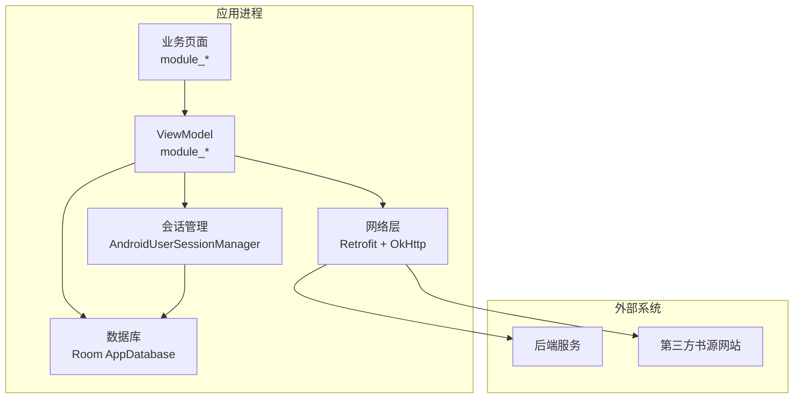
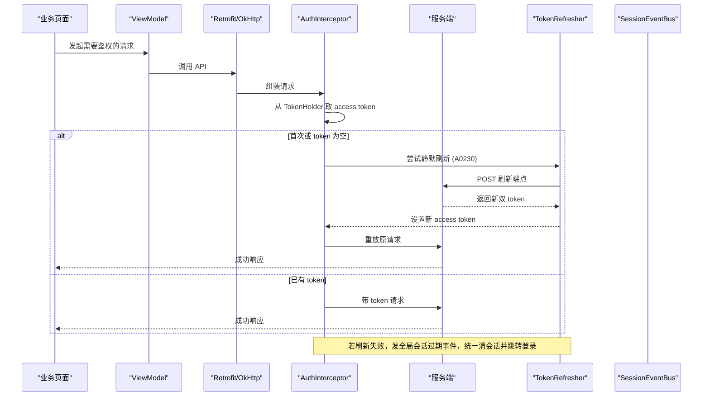
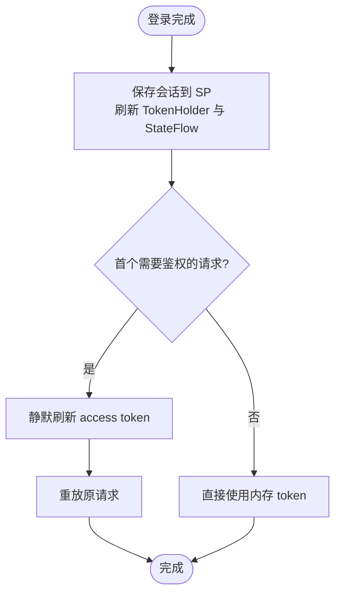
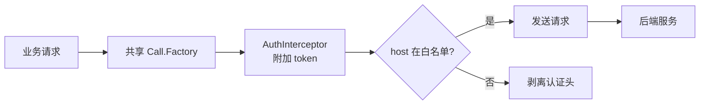
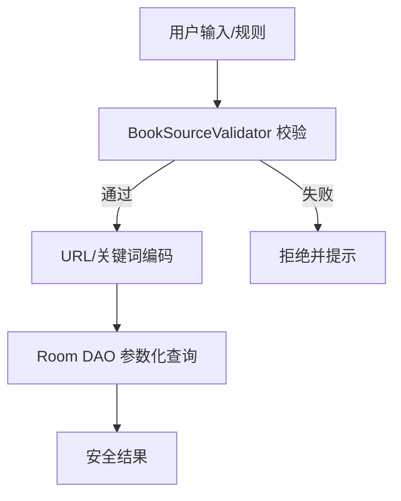
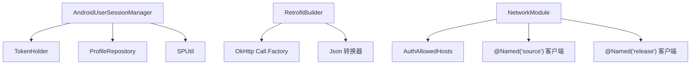

# 数据安全

<cite>
**本文引用的文件**
- [UserSession.kt](file://lib_book_common/src/main/java/com/ebook/common/domain/UserSession.kt)
- [UserSessionManager.kt](file://lib_book_common/src/main/java/com/ebook/common/domain/UserSessionManager.kt)
- [AndroidUserSessionManager.kt](file://lib_book_common/src/main/java/com/ebook/common/domain/AndroidUserSessionManager.kt)
- [RetrofitBuilder.kt](file://lib_ebook_api/src/main/java/com/ebook/api/RetrofitBuilder.kt)
- [NetworkModule.kt](file://lib_ebook_api/src/main/java/com/ebook/api/utils/NetworkModule.kt)
- [LoginInterceptor.kt](file://lib_book_common/src/main/java/com/ebook/common/interceptor/LoginInterceptor.kt)
- [TokenRefresher.kt](file://lib_ebook_api/src/main/java/com/ebook/api/auth/TokenRefresher.kt)
- [SessionEventBus.kt](file://lib_ebook_api/src/main/java/com/ebook/api/auth/SessionEventBus.kt)
- [SessionTokenRefresher.kt](file://lib_book_common/src/main/java/com/ebook/common/domain/SessionTokenRefresher.kt)
- [BookSourceValidator.kt](file://module_me/src/main/java/com/ebook/me/domain/BookSourceValidator.kt)
- [SPUtil.kt](file://lib_book_common/src/main/java/com/ebook/common/util/SPUtil.kt)
- [AppDatabase.kt](file://lib_ebook_db/src/main/java/com/ebook/db/AppDatabase.kt)
- [EncodingInterceptor.kt](file://lib_ebook_api/src/main/java/com/ebook/api/intercepter/EncodingInterceptor.kt)
- [JsNetworkGuard.kt](file://lib_book_source/src/main/java/com/ebook/source/sandbox/JsNetworkGuard.kt)
- [SourceCookieJar.kt](file://lib_book_source/src/main/java/com/ebook/source/sandbox/SourceCookieJar.kt)
- [ADR-0011 Token 身份解耦与仅刷新](file://docs/adr/0011-token-identity-decoupling-token-only-refresh.md)
- [ADR-0028 不可信 JS 沙箱](file://docs/adr/0028-untrusted-js-sandbox.md)
- [ADR-0022 Manifest 权限最小化](file://docs/adr/0022-manifest-permission-minimization.md)
</cite>

## 目录
1. [简介](#简介)
2. [项目结构中的安全边界](#项目结构中的安全边界)
3. [核心组件与安全职责](#核心组件与安全职责)
4. [架构总览](#架构总览)
5. [关键流程详解](#关键流程详解)
6. [依赖关系分析](#依赖关系分析)
7. [性能与可用性考量](#性能与可用性考量)
8. [故障排查指南](#故障排查指南)
9. [结论与建议](#结论与建议)

## 简介
本文件聚焦本项目在数据生命周期内的安全保护，覆盖以下方面：
- 敏感数据存储策略：用户会话（UserSession）的安全存储、Token 管理机制（access token 只驻内存不落盘）、密码不持久化原则。
- 数据传输安全：HTTPS 强制、证书校验、请求拦截与加密上下文。
- 输入验证机制：书源规则输入验证、用户输入过滤、SQL 注入防护。
- 本地数据安全：SharedPreferences 敏感信息保护、文件存储权限控制、数据库加密策略。
- 数据脱敏与日志安全：敏感信息隐藏、调试分级控制。
- 备份与恢复安全：云端同步加密传输、本地备份访问控制。

## 项目结构中的安全边界
- 会话与认证边界集中在 lib_book_common 的 domain 层与 lib_ebook_api 的网络层：
  - UserSession 作为跨模块 seam 类型承载登录态；AndroidUserSessionManager 负责持久化与内存状态一致性。
  - RetrofitBuilder 复用共享的 OkHttp Call.Factory，统一接入 AuthInterceptor、白名单与 debug 脱敏日志。
  - NetworkModule 提供“认证客户端”、“书源纯净客户端”、“发布检查纯净客户端”，严格隔离凭证传播范围。
- 书源解析边界在 lib_book_source：
  - JsNetworkGuard、SourceCookieJar 对脚本外呼进行约束与隔离，避免第三方站点获取用户凭证。
- 数据持久化边界在 lib_ebook_db：
  - Room 实体与 DAO 承担结构化数据存取，迁移与 schema 演进受 ADR 约束。

**图表来源**
- [RetrofitBuilder.kt:24-45](file://lib_ebook_api/src/main/java/com/ebook/api/RetrofitBuilder.kt#L24-L45)
- [NetworkModule.kt:19-72](file://lib_ebook_api/src/main/java/com/ebook/api/utils/NetworkModule.kt#L19-L72)
- [AndroidUserSessionManager.kt:17-162](file://lib_book_common/src/main/java/com/ebook/common/domain/AndroidUserSessionManager.kt#L17-L162)
- [AppDatabase.kt](file://lib_ebook_db/src/main/java/com/ebook/db/AppDatabase.kt)

**章节来源**
- [AndroidUserSessionManager.kt:17-162](file://lib_book_common/src/main/java/com/ebook/common/domain/AndroidUserSessionManager.kt#L17-L162)
- [RetrofitBuilder.kt:24-45](file://lib_ebook_api/src/main/java/com/ebook/api/RetrofitBuilder.kt#L24-L45)
- [NetworkModule.kt:19-72](file://lib_ebook_api/src/main/java/com/ebook/api/utils/NetworkModule.kt#L19-L72)

## 核心组件与安全职责
- 会话模型与接口
  - UserSession：跨模块会话 seam，包含用户标识与临时刷新凭证字段说明，强调 refresh 后不再维护该字段。
  - UserSessionManager：定义保存、轮换、清除与会话状态读取的统一入口。
- Android 实现
  - AndroidUserSessionManager：负责内存 StateFlow、SharedPreferences 持久化、TokenHolder 同步、兼容 SP_* 键清理、旧版明文密码键一次性清理。
- 网络层
  - RetrofitBuilder：复用共享 Call.Factory，统一 JSON 转换器配置，避免重复构建 OkHttpClient。
  - NetworkModule：提供认证允许主机集合、书源纯净客户端、发布检查纯净客户端，确保 token 不泄露给第三方。
- 认证与刷新
  - LoginInterceptor：将 token 附加到请求头（由 TokenHolder 提供）。
  - TokenRefresher / SessionEventBus / SessionTokenRefresher：处理 A0230 过期静默刷新与全局事件处置。

**章节来源**
- [UserSession.kt:1-17](file://lib_book_common/src/main/java/com/ebook/common/domain/UserSession.kt#L1-L17)
- [UserSessionManager.kt:1-62](file://lib_book_common/src/main/java/com/ebook/common/domain/UserSessionManager.kt#L1-L62)
- [AndroidUserSessionManager.kt:17-162](file://lib_book_common/src/main/java/com/ebook/common/domain/AndroidUserSessionManager.kt#L17-L162)
- [RetrofitBuilder.kt:24-45](file://lib_ebook_api/src/main/java/com/ebook/api/RetrofitBuilder.kt#L24-L45)
- [NetworkModule.kt:19-72](file://lib_ebook_api/src/main/java/com/ebook/api/utils/NetworkModule.kt#L19-L72)
- [LoginInterceptor.kt](file://lib_book_common/src/main/java/com/ebook/common/interceptor/LoginInterceptor.kt)
- [TokenRefresher.kt](file://lib_ebook_api/src/main/java/com/ebook/api/auth/TokenRefresher.kt)
- [SessionEventBus.kt](file://lib_ebook_api/src/main/java/com/ebook/api/auth/SessionEventBus.kt)
- [SessionTokenRefresher.kt](file://lib_book_common/src/main/java/com/ebook/common/domain/SessionTokenRefresher.kt)

## 架构总览
下图展示认证与令牌流转的关键路径：登录建立会话 → 首请求触发静默刷新 → 成功后重放原请求 → 失败则全局会话过期处置。

**图表来源**
- [AndroidUserSessionManager.kt:61-98](file://lib_book_common/src/main/java/com/ebook/common/domain/AndroidUserSessionManager.kt#L61-L98)
- [RetrofitBuilder.kt:34-43](file://lib_ebook_api/src/main/java/com/ebook/api/RetrofitBuilder.kt#L34-L43)
- [NetworkModule.kt:29-43](file://lib_ebook_api/src/main/java/com/ebook/api/utils/NetworkModule.kt#L29-L43)
- [TokenRefresher.kt](file://lib_ebook_api/src/main/java/com/ebook/api/auth/TokenRefresher.kt)
- [SessionEventBus.kt](file://lib_ebook_api/src/main/java/com/ebook/api/auth/SessionEventBus.kt)

## 关键流程详解

### 敏感数据存储策略
- 用户会话存储
  - SharedPreferences user_session：仅落盘 is_logged_in、refresh_token、用户标识与展示信息；access token 不落盘，冷启动为空，由首个请求经静默刷新补上。
  - 内存状态：StateFlow 暴露 isLoggedIn/currentUser，供 UI 实时响应。
  - TokenHolder：进程内唯一 access token 持有者，被 AuthInterceptor 使用。
  - 兼容键：同时维护 spUtils 的 SP_* 键以兼容旧链路；清会话时一并清理。
- 密码不持久化原则
  - 升级期一次性清理历史遗留明文密码键（LEGACY_KEY_PASSWORD、LEGACY_SP_PASSWORD），后续不再写入任何密码相关键。
- 双 Token 管理
  - rotateCredentials：仅更新内存 access token 与持久化 refresh token，不触碰用户身份信息。
  - getRefreshToken：仅在已登录状态下返回 refresh token。

**图表来源**
- [AndroidUserSessionManager.kt:61-98](file://lib_book_common/src/main/java/com/ebook/common/domain/AndroidUserSessionManager.kt#L61-L98)
- [SessionTokenRefresher.kt](file://lib_book_common/src/main/java/com/ebook/common/domain/SessionTokenRefresher.kt)

**章节来源**
- [AndroidUserSessionManager.kt:35-162](file://lib_book_common/src/main/java/com/ebook/common/domain/AndroidUserSessionManager.kt#L35-L162)
- [UserSession.kt:1-17](file://lib_book_common/src/main/java/com/ebook/common/domain/UserSession.kt#L1-L17)
- [UserSessionManager.kt:1-62](file://lib_book_common/src/main/java/com/ebook/common/domain/UserSessionManager.kt#L1-L62)

### 数据传输安全
- HTTPS 与证书校验
  - 通过 Hilt 提供的共享 Call.Factory 与 AuthAllowedHosts 白名单限定可信域名；认证客户端默认启用 HTTPS 与标准证书校验。
- 请求拦截与编码
  - EncodingInterceptor：为书源客户端强制 UTF-8 解码，避免乱码导致的数据解析异常。
- 客户端隔离
  - “书源纯净客户端”（@Named("source")）与“发布检查纯净客户端”（@Named("release")）均不携带 token，防止第三方站点获取用户凭证。
  - 认证客户端仅向白名单 host 附加 token。

**图表来源**
- [NetworkModule.kt:29-72](file://lib_ebook_api/src/main/java/com/ebook/api/utils/NetworkModule.kt#L29-L72)
- [RetrofitBuilder.kt:34-43](file://lib_ebook_api/src/main/java/com/ebook/api/RetrofitBuilder.kt#L34-L43)
- [LoginInterceptor.kt](file://lib_book_common/src/main/java/com/ebook/common/interceptor/LoginInterceptor.kt)

**章节来源**
- [NetworkModule.kt:19-72](file://lib_ebook_api/src/main/java/com/ebook/api/utils/NetworkModule.kt#L19-L72)
- [EncodingInterceptor.kt](file://lib_ebook_api/src/main/java/com/ebook/api/intercepter/EncodingInterceptor.kt)
- [RetrofitBuilder.kt:24-45](file://lib_ebook_api/src/main/java/com/ebook/api/RetrofitBuilder.kt#L24-L45)

### 输入验证机制
- 书源规则输入验证
  - BookSourceValidator：对用户导入的书源规则进行校验，阻止非法或不安全规则进入解析器。
- 用户输入过滤
  - 所有用户输入的 URL、关键词等在取值层按规范编码（如关键词百分号编码），减少注入风险。
- SQL 注入防护
  - 使用 Room 参数化查询，DAO 层通过命名参数与类型安全的 API 操作，避免拼接 SQL。

**图表来源**
- [BookSourceValidator.kt](file://module_me/src/main/java/com/ebook/me/domain/BookSourceValidator.kt)
- [AppDatabase.kt](file://lib_ebook_db/src/main/java/com/ebook/db/AppDatabase.kt)

**章节来源**
- [BookSourceValidator.kt](file://module_me/src/main/java/com/ebook/me/domain/BookSourceValidator.kt)
- [AppDatabase.kt](file://lib_ebook_db/src/main/java/com/ebook/db/AppDatabase.kt)

### 本地数据安全
- SharedPreferences 敏感信息保护
  - 仅存储必要的最小化字段；access token 不落盘；旧版明文密码键在升级时一次性清理。
  - SPUtil 提供统一的 SP 读写封装，便于集中管理与清理。
- 文件存储权限控制
  - 遵循 ADR-0022 的权限最小化原则，仅申请必要的运行时权限；下载与导入等场景按需求申请。
- 数据库加密策略
  - Room 数据库默认未开启 SQLCipher 等透明加密；敏感内容建议通过上层加密后再落库（例如对重要备注进行应用层加密）。

**章节来源**
- [AndroidUserSessionManager.kt:45-52](file://lib_book_common/src/main/java/com/ebook/common/domain/AndroidUserSessionManager.kt#L45-L52)
- [SPUtil.kt](file://lib_book_common/src/main/java/com/ebook/common/util/SPUtil.kt)
- [ADR-0022 Manifest 权限最小化](file://docs/adr/0022-manifest-permission-minimization.md)
- [AppDatabase.kt](file://lib_ebook_db/src/main/java/com/ebook/db/AppDatabase.kt)

### 数据脱敏与日志安全
- 日志脱敏
  - 共享 Call.Factory 内置 debug 脱敏日志，避免在日志中输出敏感字段（如 token、密码）。
- 调试分级控制
  - 使用统一的 Logger 抽象，debug/release 自动裁剪日志级别；生产环境禁用详细日志。

**章节来源**
- [RetrofitBuilder.kt:34-43](file://lib_ebook_api/src/main/java/com/ebook/api/RetrofitBuilder.kt#L34-L43)
- [NetworkModule.kt:29-43](file://lib_ebook_api/src/main/java/com/ebook/api/utils/NetworkModule.kt#L29-L43)

### 备份与恢复安全
- 云端同步数据加密传输
  - 通过 HTTPS + 证书校验保障传输安全；token 仅附加至白名单 host，第三方站点无法获取。
- 本地备份文件访问控制
  - 备份文件存放于应用私有目录，受系统沙箱保护；如需导出，需显式授权并提供最小可见范围。
- 脚本沙箱限制
  - 书源脚本通过 JsNetworkGuard 与 SourceCookieJar 限制外呼与 Cookie 使用，防止敏感数据泄露至第三方。

**章节来源**
- [JsNetworkGuard.kt](file://lib_book_source/src/main/java/com/ebook/source/sandbox/JsNetworkGuard.kt)
- [SourceCookieJar.kt](file://lib_book_source/src/main/java/com/ebook/source/sandbox/SourceCookieJar.kt)
- [ADR-0028 不可信 JS 沙箱](file://docs/adr/0028-untrusted-js-sandbox.md)

## 依赖关系分析
- 组件耦合与内聚
  - AndroidUserSessionManager 高内聚地管理会话状态与持久化，对外暴露简洁接口，降低调用方复杂度。
  - RetrofitBuilder 与 NetworkModule 解耦了网络配置与业务调用，便于替换实现与测试。
- 直接依赖
  - 会话管理依赖 TokenHolder、ProfileRepository、SPUtil。
  - 网络层依赖 OkHttp、Retrofit、JSON 转换器与拦截器。
- 间接依赖
  - 书源解析依赖沙箱执行器与网络守门器，保证脚本行为受限。
- 外部依赖
  - Room 用于结构化数据存取；OkHttp/Retrofit 负责网络通信。

**图表来源**
- [AndroidUserSessionManager.kt:29-33](file://lib_book_common/src/main/java/com/ebook/common/domain/AndroidUserSessionManager.kt#L29-L33)
- [RetrofitBuilder.kt:24-45](file://lib_ebook_api/src/main/java/com/ebook/api/RetrofitBuilder.kt#L24-L45)
- [NetworkModule.kt:19-72](file://lib_ebook_api/src/main/java/com/ebook/api/utils/NetworkModule.kt#L19-L72)

**章节来源**
- [AndroidUserSessionManager.kt:29-33](file://lib_book_common/src/main/java/com/ebook/common/domain/AndroidUserSessionManager.kt#L29-L33)
- [RetrofitBuilder.kt:24-45](file://lib_ebook_api/src/main/java/com/ebook/api/RetrofitBuilder.kt#L24-L45)
- [NetworkModule.kt:19-72](file://lib_ebook_api/src/main/java/com/ebook/api/utils/NetworkModule.kt#L19-L72)

## 性能与可用性考量
- 首请求静默刷新带来轻微延迟，但避免了不必要的登录跳转，提升用户体验。
- 客户端超时配置合理（书源 10s，认证 30s），快速失败降低资源占用。
- 内存 token 减少 I/O 开销，提高鉴权速度；refresh token 持久化保障冷启动后可恢复。

[本节为通用指导，无需具体文件引用]

## 故障排查指南
- 登录成功后仍无 token
  - 检查 TokenHolder 是否被正确设置；确认首个请求是否触发静默刷新。
  - 查看 SessionEventBus 是否有会话过期事件。
- 第三方站点收到 token
  - 确认请求是否命中白名单；检查是否误用认证客户端而非纯净客户端。
- 规则解析失败
  - 检查 BookSourceValidator 是否拒绝；查看脚本沙箱执行日志与错误类型。
- 数据库异常
  - 检查 Room 迁移链与 schema 版本；确认 DAO 参数化查询使用正确。

**章节来源**
- [SessionEventBus.kt](file://lib_ebook_api/src/main/java/com/ebook/api/auth/SessionEventBus.kt)
- [NetworkModule.kt:29-72](file://lib_ebook_api/src/main/java/com/ebook/api/utils/NetworkModule.kt#L29-L72)
- [BookSourceValidator.kt](file://module_me/src/main/java/com/ebook/me/domain/BookSourceValidator.kt)
- [AppDatabase.kt](file://lib_ebook_db/src/main/java/com/ebook/db/AppDatabase.kt)

## 结论与建议
- 当前实现已满足核心数据安全要求：access token 只驻内存、密码不持久化、HTTPS 强制、客户端隔离、输入验证与 SQL 参数化。
- 建议进一步：
  - 对数据库敏感字段实施应用层加密（如备注、密钥）。
  - 增强备份文件的访问控制与导出审计。
  - 持续完善日志脱敏规则，确保新增敏感字段自动屏蔽。

[本节为总结性内容，无需具体文件引用]