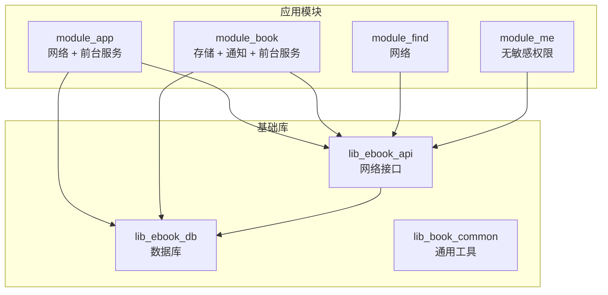
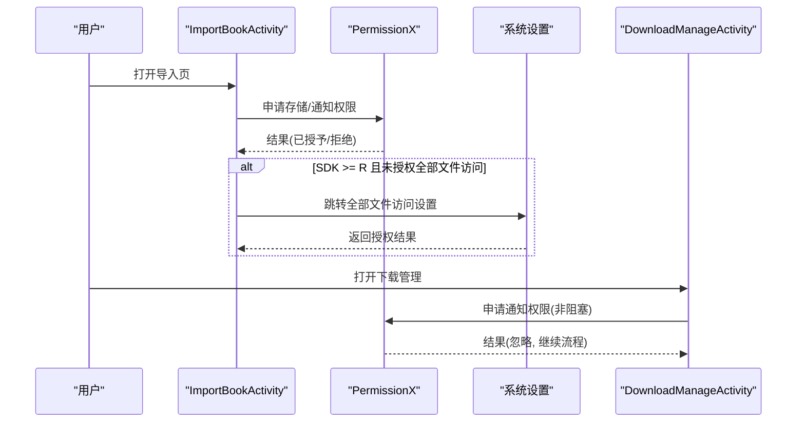
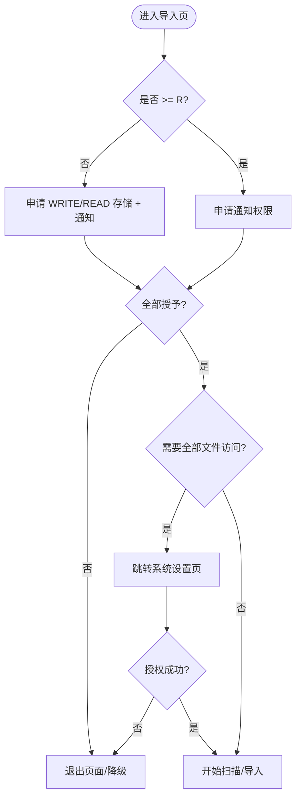
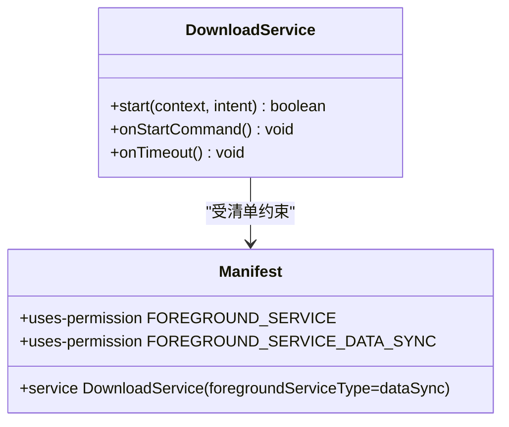
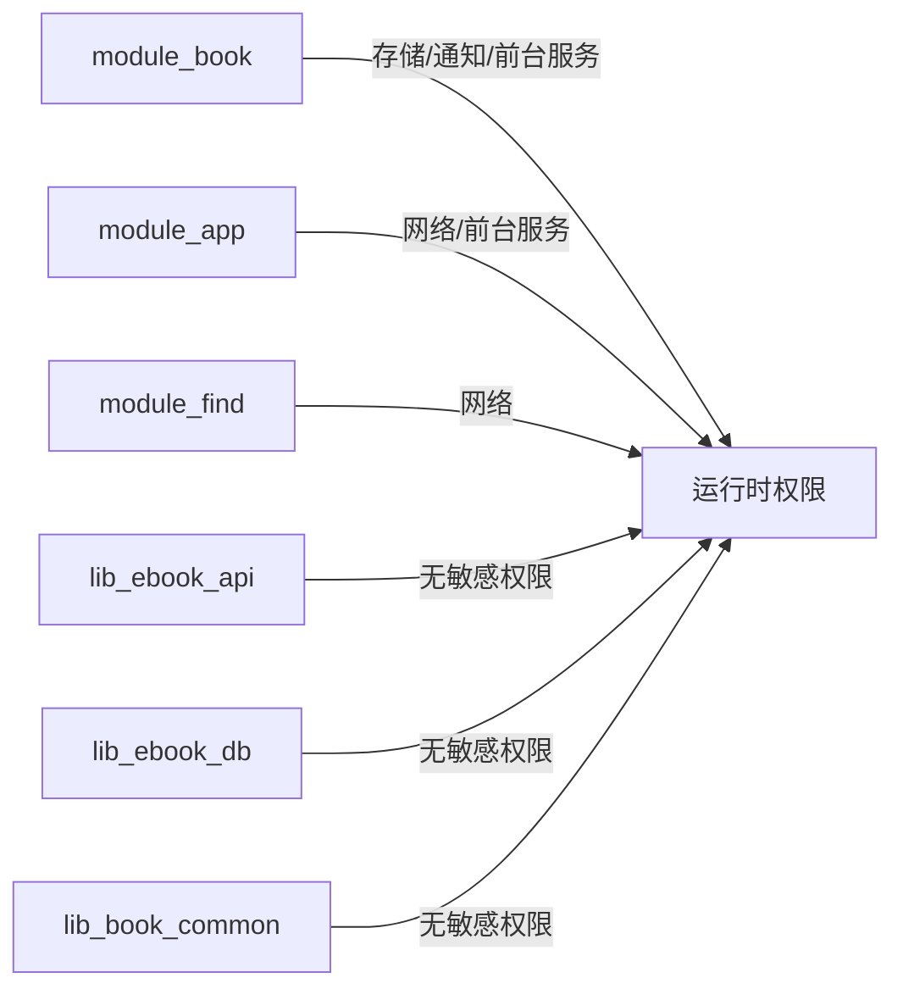

# 权限管理

<cite>
**本文引用的文件**
- [模块应用清单 module_app/AndroidManifest.xml](file://module_app/src/main/AndroidManifest.xml)
- [书籍模块清单 module_book/AndroidManifest.xml](file://module_book/src/main/AndroidManifest.xml)
- [发现模块清单 module_find/AndroidManifest.xml](file://module_find/src/main/AndroidManifest.xml)
- [个人中心清单 module_me/AndroidManifest.xml](file://module_me/src/main/AndroidManifest.xml)
- [API 模块清单 lib_ebook_api/AndroidManifest.xml](file://lib_ebook_api/src/main/AndroidManifest.xml)
- [数据库模块清单 lib_ebook_db/AndroidManifest.xml](file://lib_ebook_db/src/main/AndroidManifest.xml)
- [公共库清单 lib_book_common/AndroidManifest.xml](file://lib_book_common/src/main/AndroidManifest.xml)
- [ADR-0022 清单权限最小化](file://docs/adr/0022-manifest-permission-minimization.md)
- [本地导入页 ImportBookActivity.kt](file://module_book/src/main/java/com/ebook/book/ImportBookActivity.kt)
- [下载管理页 DownloadManageActivity.kt](file://module_book/src/main/java/com/ebook/book/DownloadManageActivity.kt)
</cite>

## 目录
1. [简介](#简介)
2. [项目结构中的权限分布](#项目结构中的权限分布)
3. [核心组件与职责](#核心组件与职责)
4. [架构总览](#架构总览)
5. [详细组件分析](#详细组件分析)
6. [依赖关系分析](#依赖关系分析)
7. [性能与兼容性考量](#性能与兼容性考量)
8. [故障排查指南](#故障排查指南)
9. [结论](#结论)

## 简介
本文件面向 Android 电子书应用的权限管理与使用策略，覆盖运行时权限、前台服务权限、网络与存储权限的使用场景，以及最小权限原则、第三方库权限、最佳实践与审计监控。内容基于仓库内各模块的清单声明与具体实现，结合 ADR-0022 的最小化决策，给出可操作的落地方案与注意事项。

## 项目结构中的权限分布
- 应用入口模块（module_app）仅声明必要的网络与前台服务能力，相机特性以“非必需”声明避免安装过滤误伤。
- 书籍模块（module_book）承担本地书导入与下载功能，声明了存储相关权限、通知权限与前台服务类型，用于多格式本地书扫描与下载任务持久化。
- 发现模块（module_find）与登录、个人中心等模块不持有敏感权限，仅保留网络相关基础能力。
- 底层库模块（lib_ebook_api、lib_ebook_db、lib_book_common）在清单层面保持最小或无权限声明，避免跨层扩散。

图表来源
- [模块应用清单 module_app/AndroidManifest.xml:16-19](file://module_app/src/main/AndroidManifest.xml#L16-L19)
- [书籍模块清单 module_book/AndroidManifest.xml:14-29](file://module_book/src/main/AndroidManifest.xml#L14-L29)
- [发现模块清单 module_find/AndroidManifest.xml:11-12](file://module_find/src/main/AndroidManifest.xml#L11-L12)

章节来源
- [模块应用清单 module_app/AndroidManifest.xml:5-43](file://module_app/src/main/AndroidManifest.xml#L5-L43)
- [书籍模块清单 module_book/AndroidManifest.xml:5-42](file://module_book/src/main/AndroidManifest.xml#L5-L42)
- [发现模块清单 module_find/AndroidManifest.xml:4-12](file://module_find/src/main/AndroidManifest.xml#L4-L12)
- [个人中心清单 module_me/AndroidManifest.xml:4-56](file://module_me/src/main/AndroidManifest.xml#L4-L56)
- [ADR-0022 清单权限最小化](file://docs/adr/0022-manifest-permission-minimization.md#L1-L53)

## 核心组件与职责
- 本地书导入：ImportBookActivity 负责运行时权限申请（低版本存储权限、通知权限）、Android 11+ 全部文件访问授权跳转、权限失败降级处理。
- 下载管理：DownloadManageActivity 负责通知权限申请（POST_NOTIFICATIONS），并将权限作为可选提示而非硬性门槛，确保下载流程不因拒绝通知而阻塞。
- 清单配置：各模块清单按 ADR-0022 进行最小化声明，严格区分集成与独立清单，合并后仅保留必要权限。

章节来源
- [本地导入页 ImportBookActivity.kt:118-197](file://module_book/src/main/java/com/ebook/book/ImportBookActivity.kt#L118-L197)
- [下载管理页 DownloadManageActivity.kt:127-138](file://module_book/src/main/java/com/ebook/book/DownloadManageActivity.kt#L127-L138)
- [ADR-0022 清单权限最小化](file://docs/adr/0022-manifest-permission-minimization.md#L13-L47)

## 架构总览
权限体系由“清单声明 + 运行时申请 + 业务降级”三层组成：
- 清单声明：按模块拆分，仅声明真实需求，合并后校验；相机特性显式 required=false，避免误过滤设备。
- 运行时申请：ImportBookActivity 组合 PermissionX 统一申请存储与通知权限；Android 11+ 通过系统设置跳转完成全部文件访问授权。
- 业务降级：通知权限拒绝不影响下载核心流程；存储权限不足时回退为不可用状态并引导用户授权。

图表来源
- [本地导入页 ImportBookActivity.kt:166-197](file://module_book/src/main/java/com/ebook/book/ImportBookActivity.kt#L166-L197)
- [本地导入页 ImportBookActivity.kt:261-270](file://module_book/src/main/java/com/ebook/book/ImportBookActivity.kt#L261-L270)
- [下载管理页 DownloadManageActivity.kt:127-138](file://module_book/src/main/java/com/ebook/book/DownloadManageActivity.kt#L127-L138)

## 详细组件分析

### 运行时权限：存储与通知
- 存储权限：
  - API < R：申请 WRITE_EXTERNAL_STORAGE、READ_EXTERNAL_STORAGE。
  - API ≥ R：跳过常规存储权限，改用 ACTION_MANAGE_APP_ALL_FILES_ACCESS_PERMISSION 直达应用授权页；若 ROM 不支持 per-app action，则回退到全量列表页。
  - 权限失败：回调中直接退出导入流程，避免死循环与误导用户。
- 通知权限：
  - POST_NOTIFICATIONS 在导入与下载两处按需申请；下载管理中将权限视为“展示渠道”，拒绝不影响下载核心逻辑。
  - 使用 PermissionX 统一封装解释与转发设置对话框，提升体验一致性。

图表来源
- [本地导入页 ImportBookActivity.kt:118-126](file://module_book/src/main/java/com/ebook/book/ImportBookActivity.kt#L118-L126)
- [本地导入页 ImportBookActivity.kt:166-197](file://module_book/src/main/java/com/ebook/book/ImportBookActivity.kt#L166-L197)
- [本地导入页 ImportBookActivity.kt:261-270](file://module_book/src/main/java/com/ebook/book/ImportBookActivity.kt#L261-L270)

章节来源
- [本地导入页 ImportBookActivity.kt:118-197](file://module_book/src/main/java/com/ebook/book/ImportBookActivity.kt#L118-L197)
- [本地导入页 ImportBookActivity.kt:261-270](file://module_book/src/main/java/com/ebook/book/ImportBookActivity.kt#L261-L270)
- [下载管理页 DownloadManageActivity.kt:127-138](file://module_book/src/main/java/com/ebook/book/DownloadManageActivity.kt#L127-L138)

### 前台服务权限配置
- DownloadService 声明 foregroundServiceType="dataSync"，满足 dataSync 前台服务要求；清单同时声明 FOREGROUND_SERVICE 与 FOREGROUND_SERVICE_DATA_SYNC。
- 启动方式统一经 DownloadService.start(context, intent)，避免在页面直接调用 startForegroundService；启动失败需提示用户并回退。
- 通知权限拒绝不影响服务运行，但会影响进度展示；建议友好提示用户开启以提升体验。

图表来源
- [书籍模块清单 module_book/AndroidManifest.xml:27-42](file://module_book/src/main/AndroidManifest.xml#L27-L42)

章节来源
- [书籍模块清单 module_book/AndroidManifest.xml:27-42](file://module_book/src/main/AndroidManifest.xml#L27-L42)
- [ADR-0022 清单权限最小化](file://docs/adr/0022-manifest-permission-minimization.md#L33-L36)

### 网络权限使用场景
- 所有网络请求与网络状态判断均依赖 INTERNET 与 ACCESS_NETWORK_STATE。
- 模块级清单仅声明所需权限，避免无关权限扩散；API 模块提供网络能力，被上层模块复用。

章节来源
- [模块应用清单 module_app/AndroidManifest.xml:16-19](file://module_app/src/main/AndroidManifest.xml#L16-L19)
- [发现模块清单 module_find/AndroidManifest.xml:11-12](file://module_find/src/main/AndroidManifest.xml#L11-L12)

### 最小权限原则与合规
- 只声明代码真正需要的权限；删除历史遗留（Wi-Fi/定位/电话/WakeLock/账号/联系人/相机等）。
- 两份清单（集成/独立）同步增删，合并后逐项核对；相机特性 required=false 避免安装过滤。
- 存储三项（MANAGE/WRITE/READ_EXTERNAL_STORAGE）仅限 module_book 的导入链路使用，不得顺手删除。

章节来源
- [ADR-0022 清单权限最小化](file://docs/adr/0022-manifest-permission-minimization.md#L13-L47)

### 第三方库权限
- PermissionX 用于统一运行时权限申请与解释、跳转设置，无反射面影响混淆。
- 其他第三方库（如 Jsoup、Retrofit、Room、Hilt、Coil）自带消费规则，无需额外 keep 或权限声明。
- 若未来引入带权限声明的第三方库，需重新评估并核对合并清单，必要时使用 tools:node="remove" 覆盖。

章节来源
- [lib_book_common/build.gradle.kts:91](file://lib_book_common/src/main/build.gradle.kts#L91)
- [ADR-0022 清单权限最小化](file://docs/adr/0022-manifest-permission-minimization.md#L40-L47)

### 权限最佳实践
- 用户友好提示：解释用途、提供一键跳转设置；避免“解释→去设置”死循环。
- 优雅降级：通知权限拒绝不阻断下载；存储权限不足时禁用导入并引导授权。
- 持续检查：每次进入相关页面时重新检查权限状态，避免缓存失效导致行为异常。

章节来源
- [本地导入页 ImportBookActivity.kt:166-197](file://module_book/src/main/java/com/ebook/book/ImportBookActivity.kt#L166-L197)
- [下载管理页 DownloadManageActivity.kt:127-138](file://module_book/src/main/java/com/ebook/book/DownloadManageActivity.kt#L127-L138)

### 权限审计与监控
- 清单变更必须核对合并结果（module_app/build/intermediates/merged_manifests/*/AndroidManifest.xml），确保无冗余权限。
- 新增权限需附带证据（全仓无对应 API 调用方可删除），并更新 ADR 与文档。
- 对异常权限行为（如频繁请求、拒绝后重复弹窗）进行日志记录与用户提示优化。

章节来源
- [ADR-0022 清单权限最小化](file://docs/adr/0022-manifest-permission-minimization.md#L40-L47)

## 依赖关系分析
- 模块间权限边界清晰：module_book 独占存储与下载相关权限；module_app 仅提供基础网络与前台服务；其余模块不引入敏感权限。
- 库层不污染应用权限面：lib_ebook_api/lib_ebook_db/lib_book_common 不在清单中声明多余权限，避免间接依赖带来风险。

图表来源
- [书籍模块清单 module_book/AndroidManifest.xml:14-29](file://module_book/src/main/AndroidManifest.xml#L14-L29)
- [模块应用清单 module_app/AndroidManifest.xml:16-19](file://module_app/src/main/AndroidManifest.xml#L16-L19)
- [发现模块清单 module_find/AndroidManifest.xml:11-12](file://module_find/src/main/AndroidManifest.xml#L11-L12)

章节来源
- [书籍模块清单 module_book/AndroidManifest.xml:14-29](file://module_book/src/main/AndroidManifest.xml#L14-L29)
- [模块应用清单 module_app/AndroidManifest.xml:16-19](file://module_app/src/main/AndroidManifest.xml#L16-L19)
- [发现模块清单 module_find/AndroidManifest.xml:11-12](file://module_find/src/main/AndroidManifest.xml#L11-L12)

## 性能与兼容性考量
- 运行时权限请求集中在入口点，避免频繁触发系统弹窗影响体验。
- Android 11+ 全部文件访问跳转采用 per-app action，优先直达应用设置页，ROM 不支持时回退到列表页保证流程不断。
- 前台服务使用 dataSync 类型，符合 targetSdk 35+ 的真实约束；配额用尽或后台启动受限需友好提示与重试策略。

章节来源
- [本地导入页 ImportBookActivity.kt:261-270](file://module_book/src/main/java/com/ebook/book/ImportBookActivity.kt#L261-L270)
- [书籍模块清单 module_book/AndroidManifest.xml:27-42](file://module_book/src/main/AndroidManifest.xml#L27-L42)

## 故障排查指南
- 导入无法扫描：确认已授予全部文件访问权限；检查系统设置跳转是否成功，查看日志中 ActivityNotFoundException 的回退路径。
- 下载无通知：检查 POST_NOTIFICATIONS 是否授予；即使拒绝也不应阻断下载，需在 UI 提示用户开启以获得更好体验。
- 前台服务启动失败：确认清单包含 FOREGROUND_SERVICE 与 FOREGROUND_SERVICE_DATA_SYNC，并确保 DownloadService 的 start 方法正确调用与参数传递。

章节来源
- [本地导入页 ImportBookActivity.kt:261-270](file://module_book/src/main/java/com/ebook/book/ImportBookActivity.kt#L261-L270)
- [下载管理页 DownloadManageActivity.kt:127-138](file://module_book/src/main/java/com/ebook/book/DownloadManageActivity.kt#L127-L138)
- [书籍模块清单 module_book/AndroidManifest.xml:27-42](file://module_book/src/main/AndroidManifest.xml#L27-L42)

## 结论
本项目遵循最小权限原则，通过清晰的模块边界与严格的清单管理，确保仅在必要时申请权限；运行时权限处理注重用户体验与降级策略，前台服务与通知权限配合良好。未来新增权限需基于证据评估并同步更新文档与测试，保持权限面的可读性与可审计性。