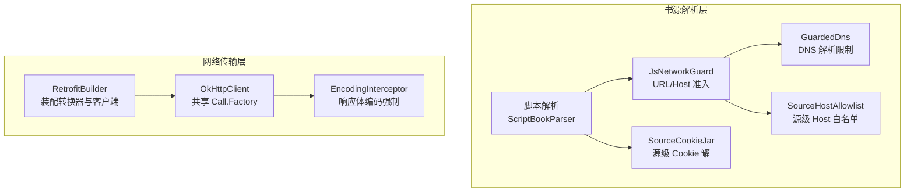
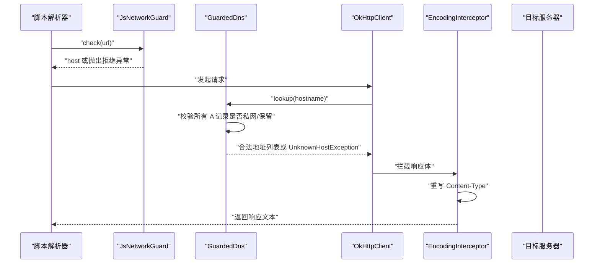
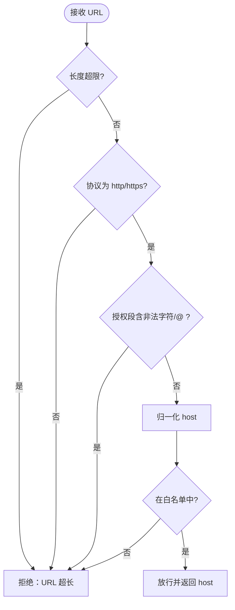
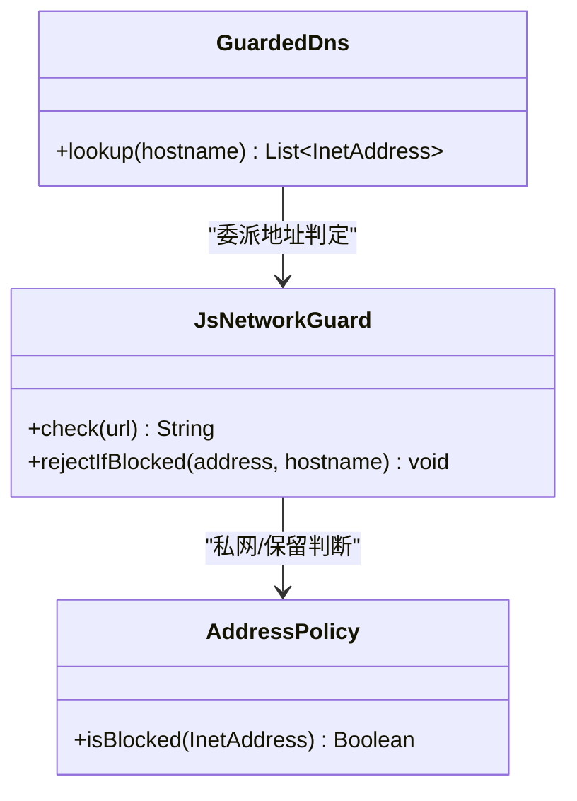
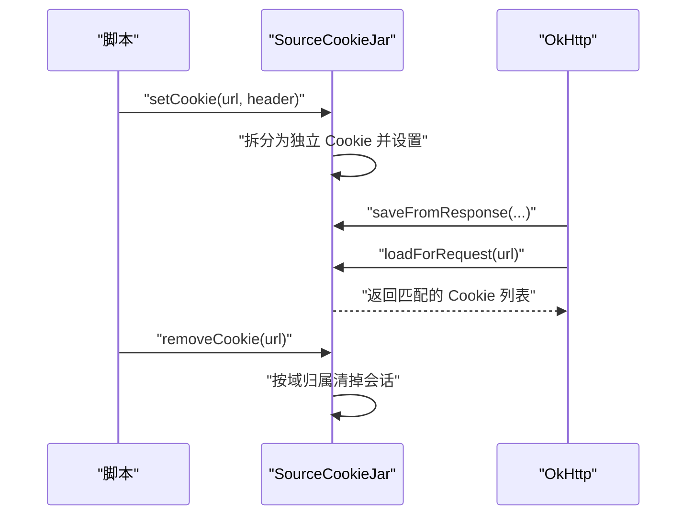
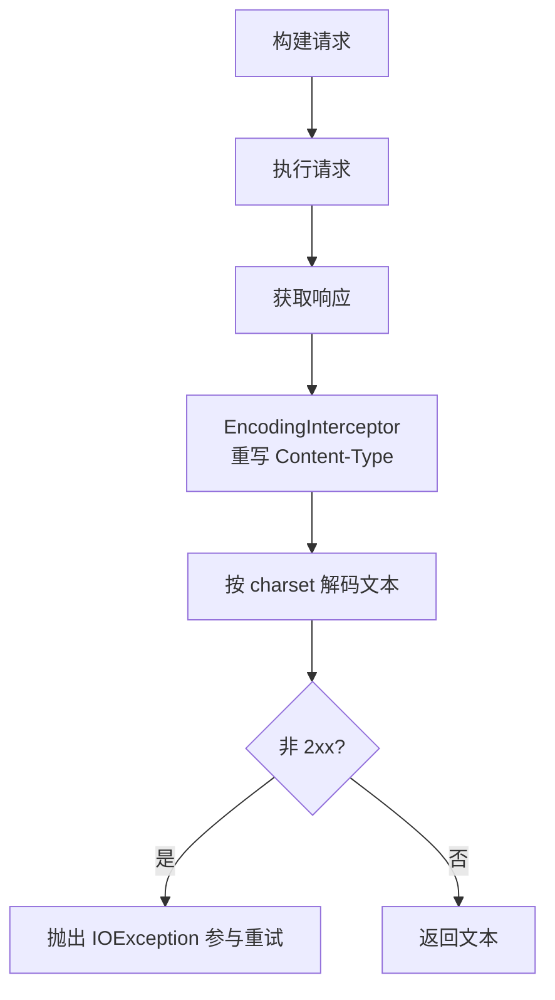
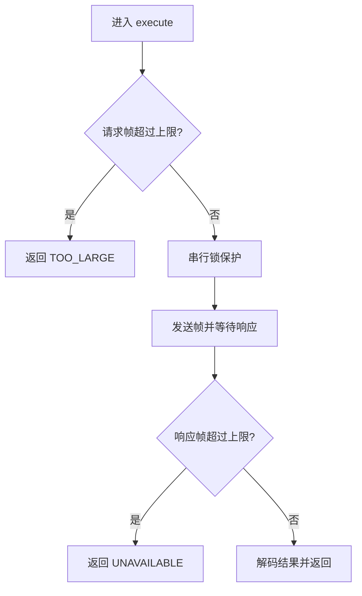
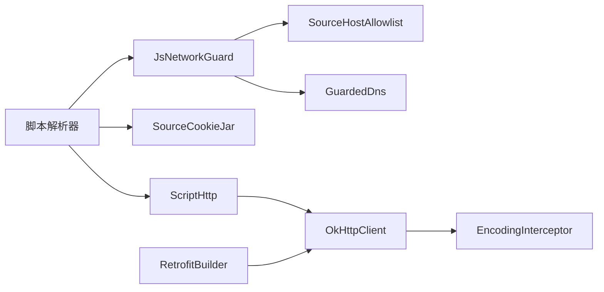

# 网络安全

<cite>
**本文引用的文件**
- [JsNetworkGuard.kt](file://lib_book_source/src/main/java/com/ebook/source/sandbox/JsNetworkGuard.kt)
- [SourceHostAllowlist.kt](file://lib_book_source/src/main/java/com/ebook/source/sandbox/SourceHostAllowlist.kt)
- [SourceCookieJar.kt](file://lib_book_source/src/main/java/com/ebook/source/sandbox/SourceCookieJar.kt)
- [EncodingInterceptor.kt](file://lib_ebook_api/src/main/java/com/ebook/api/intercepter/EncodingInterceptor.kt)
- [ScriptHttp.kt](file://lib_book_source/src/main/java/com/ebook/source/script/ScriptHttp.kt)
- [RetrofitBuilder.kt](file://lib_ebook_api/src/main/java/com/ebook/api/RetrofitBuilder.kt)
- [JsSandboxClient.kt](file://lib_book_source/src/main/java/com/ebook/source/sandbox/JsSandboxClient.kt)
- [JsLimits.kt](file://lib_book_source/src/main/java/com/ebook/source/sandbox/JsLimits.kt)
</cite>

## 目录
1. [简介](#简介)
2. [项目结构](#项目结构)
3. [核心组件](#核心组件)
4. [架构总览](#架构总览)
5. [详细组件分析](#详细组件分析)
6. [依赖关系分析](#依赖关系分析)
7. [性能与安全注意事项](#性能与安全注意事项)
8. [故障排查指南](#故障排查指南)
9. [结论](#结论)

## 简介
本网络安全文档聚焦书源解析链路中的网络防护，覆盖沙箱执行环境的网络隔离、Cookie 作用域与防劫持、DNS 重绑定防护、请求拦截器安全、HTTPS 配置与证书校验策略、以及超时重试与限流等。目标是帮助开发者与运维人员理解并正确使用现有安全机制，并在扩展时遵循相同的安全边界。

## 项目结构
本项目将“书源解析”和“应用自身 API 调用”分层处理：
- 书源侧（脚本/原生解析）通过沙箱执行器与守门器访问网络，受白名单、DNS 限制与私网拒绝策略保护。
- 应用自身 API 调用通过 Retrofit + OkHttp 共享客户端，统一携带鉴权、日志脱敏与编码处理。

**图表来源**
- [JsNetworkGuard.kt:25-99](file://lib_book_source/src/main/java/com/ebook/source/sandbox/JsNetworkGuard.kt#L25-L99)
- [SourceHostAllowlist.kt:20-73](file://lib_book_source/src/main/java/com/ebook/source/sandbox/SourceHostAllowlist.kt#L20-L73)
- [EncodingInterceptor.kt:20-51](file://lib_ebook_api/src/main/java/com/ebook/api/intercepter/EncodingInterceptor.kt#L20-L51)
- [RetrofitBuilder.kt:24-44](file://lib_ebook_api/src/main/java/com/ebook/api/RetrofitBuilder.kt#L24-L44)

**章节来源**
- [JsNetworkGuard.kt:25-99](file://lib_book_source/src/main/java/com/ebook/source/sandbox/JsNetworkGuard.kt#L25-L99)
- [SourceHostAllowlist.kt:20-73](file://lib_book_source/src/main/java/com/ebook/source/sandbox/SourceHostAllowlist.kt#L20-L73)
- [EncodingInterceptor.kt:20-51](file://lib_ebook_api/src/main/java/com/ebook/api/intercepter/EncodingInterceptor.kt#L20-L51)
- [RetrofitBuilder.kt:24-44](file://lib_ebook_api/src/main/java/com/ebook/api/RetrofitBuilder.kt#L24-L44)

## 核心组件
- 沙箱网络准入：JsNetworkGuard 负责 URL 协议、长度、结构、凭证注入与 host 白名单检查；GuardedDns 在 OkHttp 解析点实施地址拦截。
- 源级 Cookie 管理：SourceCookieJar 提供按源隔离的 Cookie 存储与作用域删除能力。
- 响应编码拦截：EncodingInterceptor 以公开 API 重写响应体 Content-Type，避免反射破坏。
- 脚本取文传输：ScriptHttp 提供类型化的请求模型、显式字符集解码与非 2xx 重试参与。
- 沙箱资源与并发控制：JsSandboxClient 与 JsLimits 统一挂钟时限、报文大小、回调深度与任务内请求次数限制。
- Retrofit 装配：RetrofitBuilder 复用共享 Call.Factory，确保鉴权与日志脱敏一致。

**章节来源**
- [JsNetworkGuard.kt:25-99](file://lib_book_source/src/main/java/com/ebook/source/sandbox/JsNetworkGuard.kt#L25-L99)
- [SourceCookieJar.kt:34-127](file://lib_book_source/src/main/java/com/ebook/source/sandbox/SourceCookieJar.kt#L34-L127)
- [EncodingInterceptor.kt:20-51](file://lib_ebook_api/src/main/java/com/ebook/api/intercepter/EncodingInterceptor.kt#L20-L51)
- [ScriptHttp.kt:12-157](file://lib_book_source/src/main/java/com/ebook/source/script/ScriptHttp.kt#L12-L157)
- [JsSandboxClient.kt:35-185](file://lib_book_source/src/main/java/com/ebook/source/sandbox/JsSandboxClient.kt#L35-L185)
- [JsLimits.kt:13-58](file://lib_book_source/src/main/java/com/ebook/source/sandbox/JsLimits.kt#L13-L58)
- [RetrofitBuilder.kt:24-44](file://lib_ebook_api/src/main/java/com/ebook/api/RetrofitBuilder.kt#L24-L44)

## 架构总览
书源解析链路的网络访问必须经过严格的安全门禁与资源限制：

**图表来源**
- [JsNetworkGuard.kt:35-99](file://lib_book_source/src/main/java/com/ebook/source/sandbox/JsNetworkGuard.kt#L35-L99)
- [EncodingInterceptor.kt:28-51](file://lib_ebook_api/src/main/java/com/ebook/api/intercepter/EncodingInterceptor.kt#L28-L51)

## 详细组件分析

### 书源网络隔离与白名单
- URL 准入：仅允许 http/https，禁止长度过长、含非法字符、带 userinfo 的 URL。
- Host 白名单：从规则原文与源自身 URL 导出可解析 host 集合，默认不放行子域，减少攻击面。
- 私网拒绝：对 IPv4/IPv6 的多类保留、环回、链路本地、云元数据、CGNAT、组播等全面拒绝，采用字节级判据避免平台差异。

**图表来源**
- [JsNetworkGuard.kt:35-60](file://lib_book_source/src/main/java/com/ebook/source/sandbox/JsNetworkGuard.kt#L35-L60)
- [SourceHostAllowlist.kt:46-73](file://lib_book_source/src/main/java/com/ebook/source/sandbox/SourceHostAllowlist.kt#L46-L73)

**章节来源**
- [JsNetworkGuard.kt:35-60](file://lib_book_source/src/main/java/com/ebook/source/sandbox/JsNetworkGuard.kt#L35-L60)
- [SourceHostAllowlist.kt:46-73](file://lib_book_source/src/main/java/com/ebook/source/sandbox/SourceHostAllowlist.kt#L46-L73)

### DNS 重绑定防护（GuardedDns）
- 解析时机：GuardedDns 挂在 OkHttp 真正解析处，确保检查与连接使用同一地址，避免 TTL=0 的重绑窗口。
- 多记录全查：任一地址命中私网/保留即整体拒绝，防止部分公网混入绕过。
- 失败语义：抛出 UnknownHostException，使脚本侧可 catch 到“网络失败”，保持行为一致。

**图表来源**
- [JsNetworkGuard.kt:86-99](file://lib_book_source/src/main/java/com/ebook/source/sandbox/JsNetworkGuard.kt#L86-L99)
- [JsNetworkGuard.kt:115-167](file://lib_book_source/src/main/java/com/ebook/source/sandbox/JsNetworkGuard.kt#L115-L167)

**章节来源**
- [JsNetworkGuard.kt:86-99](file://lib_book_source/src/main/java/com/ebook/source/sandbox/JsNetworkGuard.kt#L86-L99)
- [JsNetworkGuard.kt:115-167](file://lib_book_source/src/main/java/com/ebook/source/sandbox/JsNetworkGuard.kt#L115-L167)

### Cookie 管理安全
- 源级隔离：每个源实例拥有独立 CookieJar，避免跨站会话泄漏。
- 作用域控制：set/remove 均基于域名归属判断，删除时宽匹配以避免残留。
- 线程安全：读写加锁，保证同名 cookie 替换与过期清理原子性。
- 会话劫持防护：Cookie 匹配由 OkHttp 负责，不自行实现后缀匹配，降低跨域泄漏风险。

**图表来源**
- [SourceCookieJar.kt:44-127](file://lib_book_source/src/main/java/com/ebook/source/sandbox/SourceCookieJar.kt#L44-L127)

**章节来源**
- [SourceCookieJar.kt:44-127](file://lib_book_source/src/main/java/com/ebook/source/sandbox/SourceCookieJar.kt#L44-L127)

### 网络请求拦截器安全性
- 编码拦截器：以公开 API 重写响应体 Content-Type，避免反射破坏兼容性与混淆；正文流式透传，避免不必要缓冲。
- 请求头注入防护：脚本取文路径要求显式给出 headers，避免默认头冲突；非 2xx 视为 IO 错误参与重试。
- 响应体安全检查：脚本层通过 Transport 统一获取响应文本，避免直接操作底层流导致编码误用。

**图表来源**
- [EncodingInterceptor.kt:28-51](file://lib_ebook_api/src/main/java/com/ebook/api/intercepter/EncodingInterceptor.kt#L28-L51)
- [ScriptHttp.kt:60-87](file://lib_book_source/src/main/java/com/ebook/source/script/ScriptHttp.kt#L60-L87)

**章节来源**
- [EncodingInterceptor.kt:28-51](file://lib_ebook_api/src/main/java/com/ebook/api/intercepter/EncodingInterceptor.kt#L28-L51)
- [ScriptHttp.kt:60-87](file://lib_book_source/src/main/java/com/ebook/source/script/ScriptHttp.kt#L60-L87)

### HTTPS 配置与证书校验
- 共享客户端：RetrofitBuilder 复用 lib_common 提供的 Call.Factory，确保安全策略（如鉴权、日志脱敏）一致生效。
- 自定义信任与降级检测：当前代码未暴露自定义 TrustManager 或 Pinning 配置入口；建议通过上层 Hilt 模块注入 OkHttpClient 以集中管理证书策略与降级检测。
- 中间人攻击防护：依赖系统证书链校验，避免在应用层放宽校验；如需自定义 CA，应通过共享客户端注入，而非在各模块分散配置。

**章节来源**
- [RetrofitBuilder.kt:24-44](file://lib_ebook_api/src/main/java/com/ebook/api/RetrofitBuilder.kt#L24-L44)

### 网络超时与重试机制的安全考虑
- 沙箱资源限制：JsLimits 定义单次执行挂钟上限、堆/栈上限、报文大小上限、回调深度上限与任务内请求次数上限，防止资源滥用与恶意循环。
- 并发与串行：JsSandboxClient 使用串行锁保障单 runtime 顺序执行，避免竞争态导致的超界与重复副作用。
- 连接池安全：每请求派生客户端仅在设置 timeout 时创建，共享连接池以降低开销；非 2xx 作为 IO 错误参与重试，确保失败传播正确。
- 资源泄漏防护：响应体使用 use 块关闭；宿主回调失败转为 ok=false 回复，避免进程崩溃。

**图表来源**
- [JsSandboxClient.kt:65-99](file://lib_book_source/src/main/java/com/ebook/source/sandbox/JsSandboxClient.kt#L65-L99)
- [JsLimits.kt:13-58](file://lib_book_source/src/main/java/com/ebook/source/sandbox/JsLimits.kt#L13-L58)
- [ScriptHttp.kt:43-87](file://lib_book_source/src/main/java/com/ebook/source/script/ScriptHttp.kt#L43-L87)

**章节来源**
- [JsSandboxClient.kt:65-99](file://lib_book_source/src/main/java/com/ebook/source/sandbox/JsSandboxClient.kt#L65-L99)
- [JsLimits.kt:13-58](file://lib_book_source/src/main/java/com/ebook/source/sandbox/JsLimits.kt#L13-L58)
- [ScriptHttp.kt:43-87](file://lib_book_source/src/main/java/com/ebook/source/script/ScriptHttp.kt#L43-L87)

## 依赖关系分析
- 书源解析依赖沙箱守卫与白名单，确保所有外呼受控。
- 网络传输依赖统一的编码拦截与共享客户端，确保鉴权与日志策略一致。
- 沙箱客户端与限制参数集中管理，避免散落配置导致安全口径不一致。

**图表来源**
- [JsNetworkGuard.kt:25-99](file://lib_book_source/src/main/java/com/ebook/source/sandbox/JsNetworkGuard.kt#L25-L99)
- [SourceHostAllowlist.kt:20-73](file://lib_book_source/src/main/java/com/ebook/source/sandbox/SourceHostAllowlist.kt#L20-L73)
- [SourceCookieJar.kt:34-127](file://lib_book_source/src/main/java/com/ebook/source/sandbox/SourceCookieJar.kt#L34-L127)
- [ScriptHttp.kt:43-157](file://lib_book_source/src/main/java/com/ebook/source/script/ScriptHttp.kt#L43-L157)
- [EncodingInterceptor.kt:20-51](file://lib_ebook_api/src/main/java/com/ebook/api/intercepter/EncodingInterceptor.kt#L20-L51)
- [RetrofitBuilder.kt:24-44](file://lib_ebook_api/src/main/java/com/ebook/api/RetrofitBuilder.kt#L24-L44)

**章节来源**
- [JsNetworkGuard.kt:25-99](file://lib_book_source/src/main/java/com/ebook/source/sandbox/JsNetworkGuard.kt#L25-L99)
- [SourceHostAllowlist.kt:20-73](file://lib_book_source/src/main/java/com/ebook/source/sandbox/SourceHostAllowlist.kt#L20-L73)
- [SourceCookieJar.kt:34-127](file://lib_book_source/src/main/java/com/ebook/source/sandbox/SourceCookieJar.kt#L34-L127)
- [ScriptHttp.kt:43-157](file://lib_book_source/src/main/java/com/ebook/source/script/ScriptHttp.kt#L43-L157)
- [EncodingInterceptor.kt:20-51](file://lib_ebook_api/src/main/java/com/ebook/api/intercepter/EncodingInterceptor.kt#L20-L51)
- [RetrofitBuilder.kt:24-44](file://lib_ebook_api/src/main/java/com/ebook/api/RetrofitBuilder.kt#L24-L44)

## 性能与安全注意事项
- 沙箱挂钟与时序：使用单调时钟跨进程可比，避免 ANR 与死锁；回调深度限制防止嵌套执行失控。
- 报文大小限制：Binder 事务缓冲约束下限制请求/响应帧大小，避免 TransactionTooLargeException。
- 连接池与派生客户端：仅在必要时派生带超时客户端，共享连接池减少开销。
- 编码与流式读取：避免全量缓冲，流式处理大响应，降低内存压力。
- 限流与重试：任务内请求次数上限与重试策略结合，抑制恶意循环与过度请求。

[本节为通用指导，不直接分析具体文件]

## 故障排查指南
- 白名单拒绝：当 host 不在白名单时，会抛出拒绝异常，需根据日志调整白名单或修正规则 URL。
- DNS 解析失败：若解析为空或命中私网地址，将抛出 UnknownHostException，需检查域名解析与站点可达性。
- Cookie 异常：若 set/remove 无效，检查 URL 格式与域名归属逻辑；确认线程安全与过期清理。
- 编码乱码：确认 EncodingInterceptor 已生效，且脚本层按指定 charset 解码；避免直接使用 string() 导致编码被覆盖。
- 超时与不可用：若沙箱不可用或断连，检查 JsSandboxClient 的重连与重放逻辑；确认主进程接线正常。

**章节来源**
- [JsNetworkGuard.kt:35-60](file://lib_book_source/src/main/java/com/ebook/source/sandbox/JsNetworkGuard.kt#L35-L60)
- [JsNetworkGuard.kt:86-99](file://lib_book_source/src/main/java/com/ebook/source/sandbox/JsNetworkGuard.kt#L86-L99)
- [SourceCookieJar.kt:65-127](file://lib_book_source/src/main/java/com/ebook/source/sandbox/SourceCookieJar.kt#L65-L127)
- [EncodingInterceptor.kt:28-51](file://lib_ebook_api/src/main/java/com/ebook/api/intercepter/EncodingInterceptor.kt#L28-L51)
- [JsSandboxClient.kt:117-185](file://lib_book_source/src/main/java/com/ebook/source/sandbox/JsSandboxClient.kt#L117-L185)

## 结论
本项目在网络层面构建了多层次防护：书源解析通过沙箱网关与 DNS 限制阻断非法访问；Cookie 按源隔离避免跨站泄漏；响应编码拦截确保一致性解码；沙箱资源与并发控制防止滥用与崩溃；Retrofit 共享客户端统一鉴权与日志策略。建议在扩展时继续遵循这些安全边界，并通过集中注入的方式管理 HTTPS 证书与策略，以保持全局一致性与可维护性。