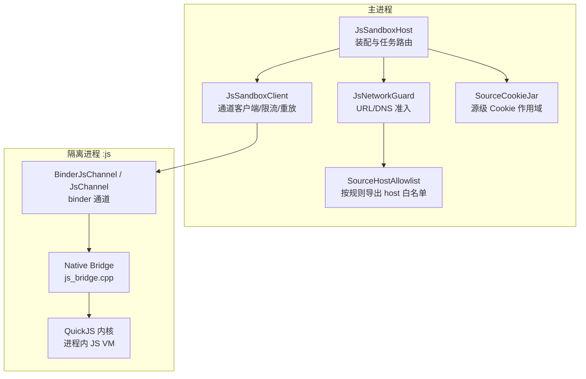
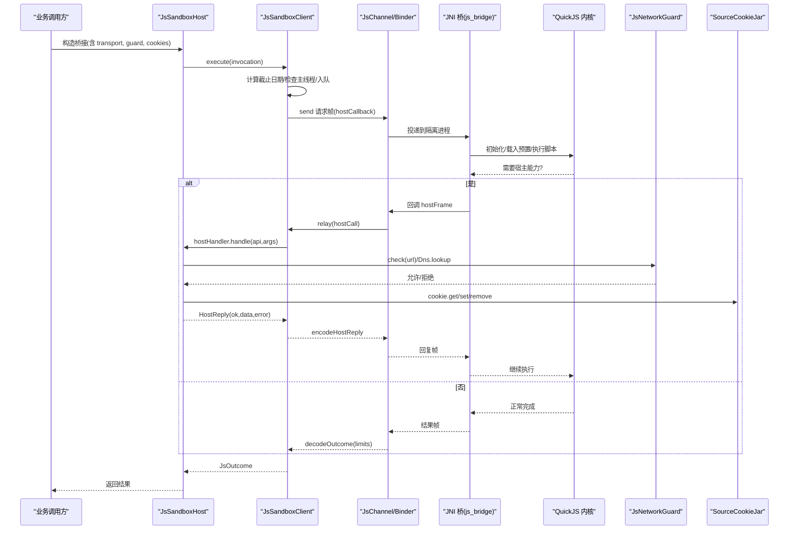
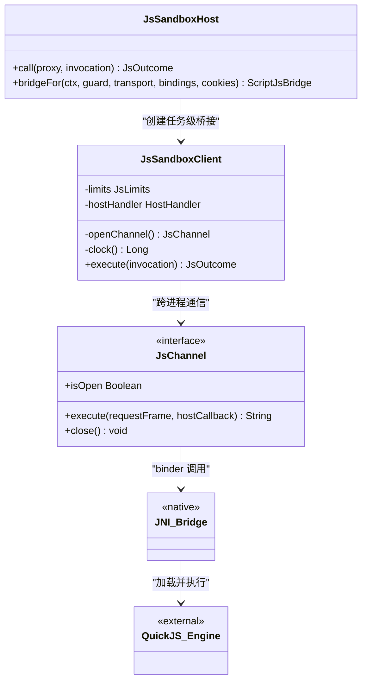
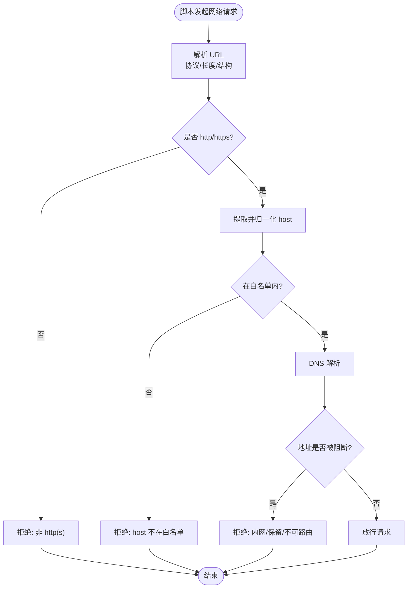
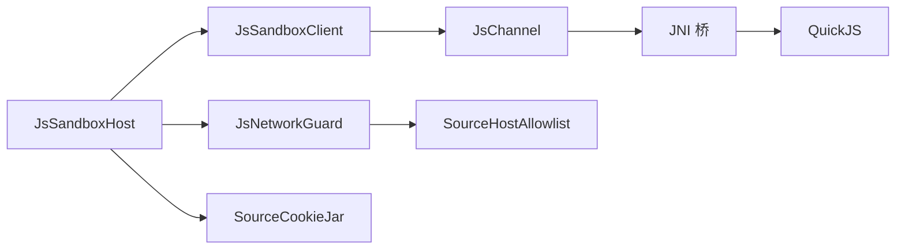

# 脚本沙箱安全

<cite>
**本文引用的文件**   
- [JsSandboxClient.kt](file://lib_book_source/src/main/java/com/ebook/source/sandbox/JsSandboxClient.kt)
- [JsSandboxHost.kt](file://lib_book_source/src/main/java/com/ebook/source/sandbox/JsSandboxHost.kt)
- [SourceCookieJar.kt](file://lib_book_source/src/main/java/com/ebook/source/sandbox/SourceCookieJar.kt)
- [JsChannel.kt](file://lib_book_source/src/main/java/com/ebook/source/sandbox/JsChannel.kt)
- [JsLimits.kt](file://lib_book_source/src/main/java/com/ebook/source/sandbox/JsLimits.kt)
- [JsNetworkGuard.kt](file://lib_book_source/src/main/java/com/ebook/source/sandbox/JsNetworkGuard.kt)
- [SourceHostAllowlist.kt](file://lib_book_source/src/main/java/com/ebook/source/sandbox/SourceHostAllowlist.kt)
- [quickjs.h](file://third_party/quickjs/quickjs.h)
- [quickjs.c](file://third_party/quickjs/quickjs.c)
- [js_bridge.cpp](file://lib_book_source/src/main/cpp/bridge/js_bridge.cpp)
- [CMakeLists.txt](file://lib_book_source/src/main/cpp/CMakeLists.txt)
- [0028-untrusted-js-sandbox.md](file://docs/adr/0028-untrusted-js-sandbox.md)
</cite>

## 目录
1. [引言](#引言)
2. [项目结构](#项目结构)
3. [核心组件](#核心组件)
4. [架构总览](#架构总览)
5. [详细组件分析](#详细组件分析)
6. [依赖关系分析](#依赖关系分析)
7. [性能与安全特性](#性能与安全特性)
8. [故障排查指南](#故障排查指南)
9. [结论](#结论)

## 引言
本文件面向“脚本书源”的 JavaScript 执行环境，系统性阐述沙箱的安全隔离机制与实现要点。内容覆盖进程级隔离、JNI 桥接边界、跨进程通信权限控制、能力白名单与拒绝策略、资源访问限制（文件系统、网络、内存）、执行监控（请求次数、响应大小、超时、递归深度）、会话隔离（源级 Cookie 与作用域），以及恶意代码检测与崩溃隔离。读者可据此评估沙箱在真实场景下的安全性与健壮性。

## 项目结构
与脚本沙箱安全直接相关的代码集中在 lib_book_source 模块的沙箱子包与 C++ 桥接层，并辅以 QuickJS 内核源码与 ADR 文档作为事实依据。

图示来源
- [JsSandboxHost.kt:21-60](file://lib_book_source/src/main/java/com/ebook/source/sandbox/JsSandboxHost.kt#L21-L60)
- [JsSandboxClient.kt:35-185](file://lib_book_source/src/main/java/com/ebook/source/sandbox/JsSandboxClient.kt#L35-L185)
- [JsChannel.kt:7-24](file://lib_book_source/src/main/java/com/ebook/source/sandbox/JsChannel.kt#L7-L24)
- [JsNetworkGuard.kt:25-99](file://lib_book_source/src/main/java/com/ebook/source/sandbox/JsNetworkGuard.kt#L25-L99)
- [SourceHostAllowlist.kt:20-73](file://lib_book_source/src/main/java/com/ebook/source/sandbox/SourceHostAllowlist.kt#L20-L73)
- [SourceCookieJar.kt:34-127](file://lib_book_source/src/main/java/com/ebook/source/sandbox/SourceCookieJar.kt#L34-L127)
- [quickjs.h](file://third_party/quickjs/quickjs.h)
- [quickjs.c](file://third_party/quickjs/quickjs.c)
- [js_bridge.cpp](file://lib_book_source/src/main/cpp/bridge/js_bridge.cpp)

章节来源
- [JsSandboxHost.kt:21-60](file://lib_book_source/src/main/java/com/ebook/source/sandbox/JsSandboxHost.kt#L21-L60)
- [JsSandboxClient.kt:35-185](file://lib_book_source/src/main/java/com/ebook/source/sandbox/JsSandboxClient.kt#L35-L185)
- [JsChannel.kt:7-24](file://lib_book_source/src/main/java/com/ebook/source/sandbox/JsChannel.kt#L7-L24)
- [JsNetworkGuard.kt:25-99](file://lib_book_source/src/main/java/com/ebook/source/sandbox/JsNetworkGuard.kt#L25-L99)
- [SourceHostAllowlist.kt:20-73](file://lib_book_source/src/main/java/com/ebook/source/sandbox/SourceHostAllowlist.kt#L20-L73)
- [SourceCookieJar.kt:34-127](file://lib_book_source/src/main/java/com/ebook/source/sandbox/SourceCookieJar.kt#L34-L127)
- [quickjs.h](file://third_party/quickjs/quickjs.h)
- [quickjs.c](file://third_party/quickjs/quickjs.c)
- [js_bridge.cpp](file://lib_book_source/src/main/cpp/bridge/js_bridge.cpp)

## 核心组件
- 进程隔离与桥接：主进程的 JsSandboxHost/JsSandboxClient 通过 JsChannel（Binder）与隔离进程中的 QuickJS 内核交互；JNI 桥接层位于 C++ 侧，负责将宿主 API 暴露给 JS。
- 能力白名单与拒绝策略：通过 SourceHostAllowlist 从规则文本提取可解析 host，配合 JsNetworkGuard 对 URL/DNS 进行严格准入；不合法或不在白名单的请求统一以类型化异常拒绝。
- 资源访问限制：集中定义于 JsLimits，涵盖挂钟超时、堆/栈上限、请求/响应帧大小、回调深度、任务请求次数等，贯穿执行与传输路径。
- 会话隔离：SourceCookieJar 提供源级 Cookie 作用域，确保不同源的登录态互不可见；与 OkHttp 集成并支持脚本侧读写。
- 执行监控：客户端串行化 execute、截止日期计算、请求/响应字节上限、host 回调大小上限、回调深度保护，保障执行不会拖垮主进程或触发 binder 事务过大。

章节来源
- [JsLimits.kt:13-58](file://lib_book_source/src/main/java/com/ebook/source/sandbox/JsLimits.kt#L13-L58)
- [JsSandboxClient.kt:65-185](file://lib_book_source/src/main/java/com/ebook/source/sandbox/JsSandboxClient.kt#L65-L185)
- [JsNetworkGuard.kt:25-99](file://lib_book_source/src/main/java/com/ebook/source/sandbox/JsNetworkGuard.kt#L25-L99)
- [SourceHostAllowlist.kt:20-73](file://lib_book_source/src/main/java/com/ebook/source/sandbox/SourceHostAllowlist.kt#L20-L73)
- [SourceCookieJar.kt:34-127](file://lib_book_source/src/main/java/com/ebook/source/sandbox/SourceCookieJar.kt#L34-L127)

## 架构总览
下图展示一次脚本执行的端到端流程：主进程构造任务上下文与桥接对象，经由 JsSandboxHost 调用 JsSandboxClient；客户端序列化请求帧并通过 JsChannel 发送到隔离进程；隔离进程由 JNI 桥加载到 QuickJS 内核执行；执行期间若发起宿主能力调用，会通过 HostHandler 回调回主进程处理，并由守卫层校验网络访问；最终结果经通道返回主进程解码为 JsOutcome。

图示来源
- [JsSandboxHost.kt:21-60](file://lib_book_source/src/main/java/com/ebook/source/sandbox/JsSandboxHost.kt#L21-L60)
- [JsSandboxClient.kt:65-185](file://lib_book_source/src/main/java/com/ebook/source/sandbox/JsSandboxClient.kt#L65-L185)
- [JsChannel.kt:7-24](file://lib_book_source/src/main/java/com/ebook/source/sandbox/JsChannel.kt#L7-L24)
- [JsNetworkGuard.kt:25-99](file://lib_book_source/src/main/java/com/ebook/source/sandbox/JsNetworkGuard.kt#L25-L99)
- [SourceCookieJar.kt:34-127](file://lib_book_source/src/main/java/com/ebook/source/sandbox/SourceCookieJar.kt#L34-L127)
- [quickjs.h](file://third_party/quickjs/quickjs.h)
- [quickjs.c](file://third_party/quickjs/quickjs.c)
- [js_bridge.cpp](file://lib_book_source/src/main/cpp/bridge/js_bridge.cpp)

## 详细组件分析

### 进程隔离与 JNI 桥接边界
- 隔离执行：脚本在独立的 `:js` 进程中运行，使用 vendored QuickJS 内核，避免主进程被不受信脚本影响。
- 桥接层：C++ 侧 JNI 桥暴露宿主 API，所有宿主能力必须经明确接口进入，禁止直接暴露系统 API。
- 通道契约：JsChannel 仅暴露 execute/close 等最小接口，且不含 Android 类型，便于测试与替换；异常以 ChannelDeadException 表示通道断开而非脚本错误。

图示来源
- [JsSandboxHost.kt:21-60](file://lib_book_source/src/main/java/com/ebook/source/sandbox/JsSandboxHost.kt#L21-L60)
- [JsSandboxClient.kt:35-185](file://lib_book_source/src/main/java/com/ebook/source/sandbox/JsSandboxClient.kt#L35-L185)
- [JsChannel.kt:7-24](file://lib_book_source/src/main/java/com/ebook/source/sandbox/JsChannel.kt#L7-L24)
- [quickjs.h](file://third_party/quickjs/quickjs.h)
- [quickjs.c](file://third_party/quickjs/quickjs.c)
- [js_bridge.cpp](file://lib_book_source/src/main/cpp/bridge/js_bridge.cpp)

章节来源
- [JsSandboxHost.kt:21-60](file://lib_book_source/src/main/java/com/ebook/source/sandbox/JsSandboxHost.kt#L21-L60)
- [JsSandboxClient.kt:35-185](file://lib_book_source/src/main/java/com/ebook/source/sandbox/JsSandboxClient.kt#L35-L185)
- [JsChannel.kt:7-24](file://lib_book_source/src/main/java/com/ebook/source/sandbox/JsChannel.kt#L7-L24)
- [quickjs.h](file://third_party/quickjs/quickjs.h)
- [quickjs.c](file://third_party/quickjs/quickjs.c)
- [js_bridge.cpp](file://lib_book_source/src/main/cpp/bridge/js_bridge.cpp)

### 能力白名单与 API 调用权限控制
- HostHandler 路由：主进程通过 HostHandler.handle 接收来自脚本的能力请求，所有危险操作在此处统一判定与拒绝。
- 网络访问白名单：SourceHostAllowlist 从书源规则原文中提取绝对 URL 的 host，构建只读白名单；JsNetworkGuard.check 对 URL 做协议、长度、结构校验，再核对 host 是否在白名单，否则抛出类型化拒绝异常。
- DNS 安全：GuardedDns 在 OkHttp 真正解析时拦截地址，拒绝内网、保留与不可路由地址，防止 DNS 重绑绕过。
- 凭证与敏感信息：禁止在 URL 中嵌入用户凭证；cookie 读写均受源级作用域约束，避免跨源泄露。

图示来源
- [JsNetworkGuard.kt:25-99](file://lib_book_source/src/main/java/com/ebook/source/sandbox/JsNetworkGuard.kt#L25-L99)
- [SourceHostAllowlist.kt:20-73](file://lib_book_source/src/main/java/com/ebook/source/sandbox/SourceHostAllowlist.kt#L20-L73)

章节来源
- [JsNetworkGuard.kt:25-99](file://lib_book_source/src/main/java/com/ebook/source/sandbox/JsNetworkGuard.kt#L25-L99)
- [SourceHostAllowlist.kt:20-73](file://lib_book_source/src/main/java/com/ebook/source/sandbox/SourceHostAllowlist.kt#L20-L73)
- [JsChannel.kt:26-37](file://lib_book_source/src/main/java/com/ebook/source/sandbox/JsChannel.kt#L26-L37)

### 资源访问限制
- 请求/响应帧大小：maxRequestBytes、maxOutcomeBytes、maxHostReplyBytes 限制 binder 事务大小，避免 TransactionTooLargeException 与跨进程内存膨胀。
- 执行时间：wallClockMs 通过截止日期比较控制单次执行时长；客户端使用单调时钟，跨进程可比。
- 内存限制：heapBytes 限制 QuickJS 堆，stackBytes 限制栈深度；桥接层在执行前还会结合当前线程栈剩余空间进一步收紧。
- 请求次数：maxRequestsPerTask 限制单任务网络代理请求次数，抑制无限循环拉取。
- 回调深度：maxCallbackDepth 限制嵌套规则/脚本的递归深度，防止死锁与栈溢出。

章节来源
- [JsLimits.kt:13-58](file://lib_book_source/src/main/java/com/ebook/source/sandbox/JsLimits.kt#L13-L58)
- [JsSandboxClient.kt:65-185](file://lib_book_source/src/main/java/com/ebook/source/sandbox/JsSandboxClient.kt#L65-L185)
- [quickjs.h](file://third_party/quickjs/quickjs.h)
- [quickjs.c](file://third_party/quickjs/quickjs.c)

### 会话隔离机制
- 源级 Cookie 作用域：SourceCookieJar 作为 OkHttp 的 CookieJar，同一书源生命周期内共享会话，应用重启或被 LRU 逐出后丢失，避免跨源泄露。
- 脚本侧 API：提供 getCookie/setCookie/removeCookie，内部逐对解析 cookie 头，空值语义为清除该域会话；删除范围按域归属判断，判宽不判窄。
- 线程安全：读写加锁，保证并发下同名 cookie 的正确更新与过期清理。

章节来源
- [SourceCookieJar.kt:34-127](file://lib_book_source/src/main/java/com/ebook/source/sandbox/SourceCookieJar.kt#L34-L127)

### 恶意代码检测与防护
- 异常捕获与降级：JsSandboxClient.execute 捕获未预期异常并转换为类型化的不可用状态；断连自动重连并重放（无副作用前提下）。
- 错误处理策略：主进程 host 回调失败记录日志并以 ok=false 回退，避免异常落入执行器进程导致整个 :js 进程崩溃。
- 崩溃隔离：脚本在内核中执行，崩溃限于隔离进程；JNI 桥与通道设计将异常限定在安全边界内。

章节来源
- [JsSandboxClient.kt:65-185](file://lib_book_source/src/main/java/com/ebook/source/sandbox/JsSandboxClient.kt#L65-L185)
- [JsChannel.kt:26-37](file://lib_book_source/src/main/java/com/ebook/source/sandbox/JsChannel.kt#L26-L37)

## 依赖关系分析
- 组件耦合：JsSandboxHost 持有 JsSandboxClient 与 HostCallbackRouter，协调任务级桥接与回调路由；JsSandboxClient 依赖 JsChannel 与 HostHandler；JsNetworkGuard 依赖 SourceHostAllowlist；SourceCookieJar 独立于网络栈但与其集成。
- 外部依赖：QuickJS 内核与 JNI 桥为原生依赖，位于 third_party 与 cpp 目录；OkHttp 用于网络与 Cookie 管理。
- 潜在环路与风险：回调链路需保证主进程与执行器线程模型正确对接，避免双向死锁；通道异常需快速恢复，避免阻塞后续任务。

图示来源
- [JsSandboxHost.kt:21-60](file://lib_book_source/src/main/java/com/ebook/source/sandbox/JsSandboxHost.kt#L21-L60)
- [JsSandboxClient.kt:35-185](file://lib_book_source/src/main/java/com/ebook/source/sandbox/JsSandboxClient.kt#L35-L185)
- [JsChannel.kt:7-24](file://lib_book_source/src/main/java/com/ebook/source/sandbox/JsChannel.kt#L7-L24)
- [JsNetworkGuard.kt:25-99](file://lib_book_source/src/main/java/com/ebook/source/sandbox/JsNetworkGuard.kt#L25-L99)
- [SourceHostAllowlist.kt:20-73](file://lib_book_source/src/main/java/com/ebook/source/sandbox/SourceHostAllowlist.kt#L20-L73)
- [SourceCookieJar.kt:34-127](file://lib_book_source/src/main/java/com/ebook/source/sandbox/SourceCookieJar.kt#L34-L127)

章节来源
- [JsSandboxHost.kt:21-60](file://lib_book_source/src/main/java/com/ebook/source/sandbox/JsSandboxHost.kt#L21-L60)
- [JsSandboxClient.kt:35-185](file://lib_book_source/src/main/java/com/ebook/source/sandbox/JsSandboxClient.kt#L35-L185)
- [JsNetworkGuard.kt:25-99](file://lib_book_source/src/main/java/com/ebook/source/sandbox/JsNetworkGuard.kt#L25-L99)
- [SourceHostAllowlist.kt:20-73](file://lib_book_source/src/main/java/com/ebook/source/sandbox/SourceHostAllowlist.kt#L20-L73)
- [SourceCookieJar.kt:34-127](file://lib_book_source/src/main/java/com/ebook/source/sandbox/SourceCookieJar.kt#L34-L127)

## 性能与安全特性
- 执行串行化：JsSandboxClient 使用 inFlight 锁串行化 execute，确保同一时刻只有一帧在飞，从而 maxRequestBytes 等 binder 缓冲相关限制有效。
- 超时与限流：wallClockMs 与 maxRequestsPerTask 共同抑制长时间与高频请求；maxCallbackDepth 防止过度嵌套导致的栈压力。
- 报文大小控制：maxRequestBytes/maxOutcomeBytes/maxHostReplyBytes 避免 binder 事务过大导致的崩溃与性能抖动。
- 内存与栈保护：heapBytes/stackBytes 与线程栈余量检查降低 SIGSEGV 风险；QuickJS 内核限制提供底层保障。
- 网络安全：URL 与 DNS 双重校验，拒绝内网与保留地址，防止 DNS 重绑与越权访问。

章节来源
- [JsLimits.kt:13-58](file://lib_book_source/src/main/java/com/ebook/source/sandbox/JsLimits.kt#L13-L58)
- [JsSandboxClient.kt:65-185](file://lib_book_source/src/main/java/com/ebook/source/sandbox/JsSandboxClient.kt#L65-L185)
- [JsNetworkGuard.kt:25-99](file://lib_book_source/src/main/java/com/ebook/source/sandbox/JsNetworkGuard.kt#L25-L99)

## 故障排查指南
- 主线程调用：JsSandboxClient 会拒绝在主线程执行，提示 ANR 风险；应改为后台线程调用。
- 通道异常与断连：出现 ChannelDeadException 时客户端会尝试重连并重放（若无副作用）；频繁断连需检查 :js 进程健康与 binder 连接。
- 白名单拒绝：JsNetworkGuard 抛出的拒绝异常包含 host 信息，便于定位缺失条目；调整 SourceHostAllowlist 时需关注日志。
- 会话问题：SourceCookieJar 为空或无法读取，确认 cookie 写入路径与 URL 归一化是否正确；必要时使用 removeFor 清除旧会话。
- 超时与限流：TIMEOUT 或请求次数超限通常意味着脚本逻辑过于复杂或网络过慢；优化规则或增加限额需谨慎评估影响。

章节来源
- [JsSandboxClient.kt:65-185](file://lib_book_source/src/main/java/com/ebook/source/sandbox/JsSandboxClient.kt#L65-L185)
- [JsNetworkGuard.kt:25-99](file://lib_book_source/src/main/java/com/ebook/source/sandbox/JsNetworkGuard.kt#L25-L99)
- [SourceCookieJar.kt:34-127](file://lib_book_source/src/main/java/com/ebook/source/sandbox/SourceCookieJar.kt#L34-L127)

## 结论
该脚本沙箱通过进程隔离、JNI 桥接边界、严格的网络准入与资源限制、源级会话隔离以及完善的错误与崩溃处理，构建了可信的执行环境。其设计以最小信任面为核心，将不受信的脚本限制在可控范围内，同时保持对真实源规则的兼容性与可用性。未来可在白名单宽松度、限额参数与监控指标上持续调优，以提升鲁棒性与用户体验。