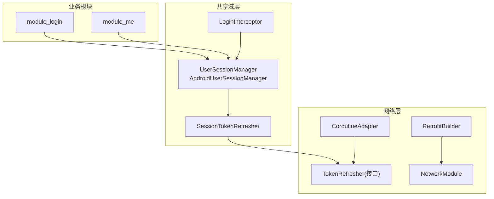
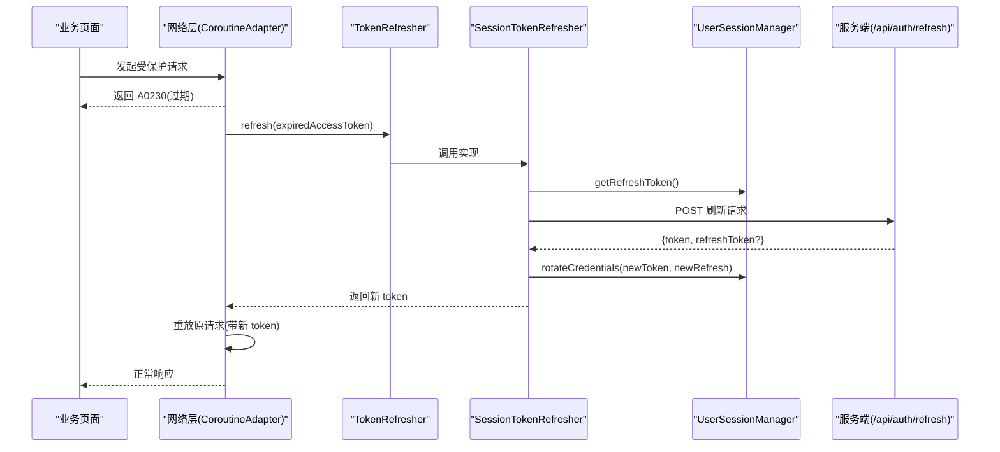
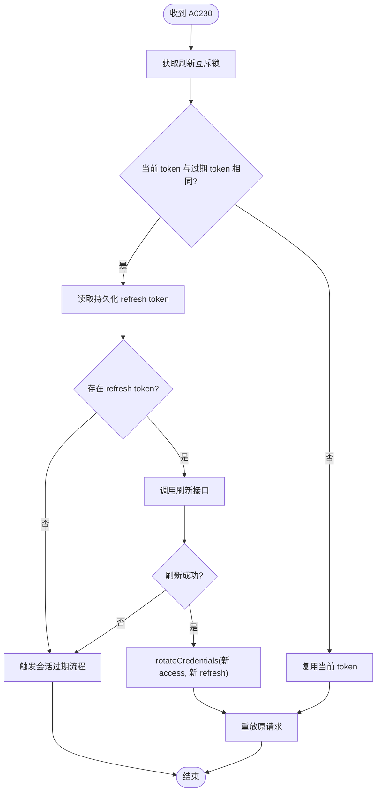
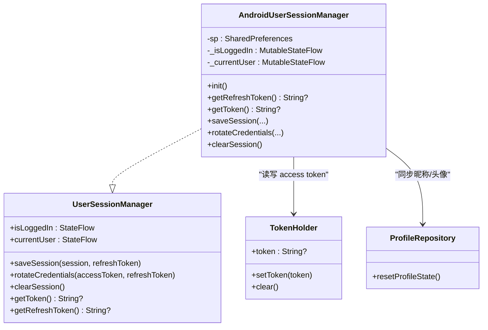
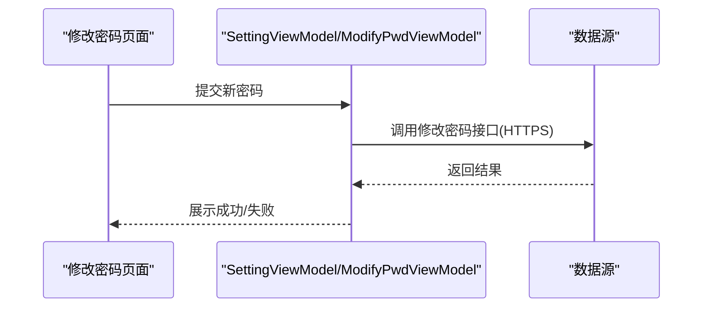
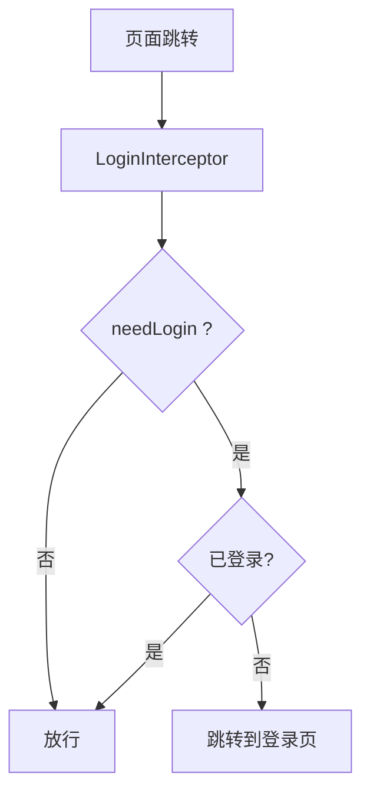
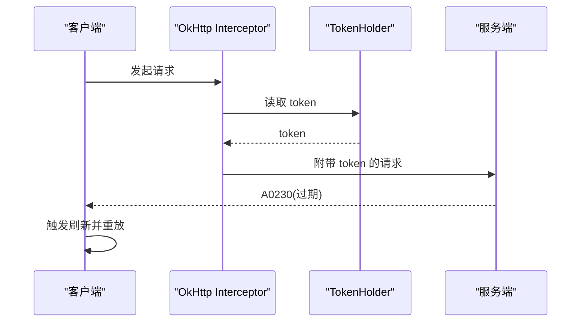
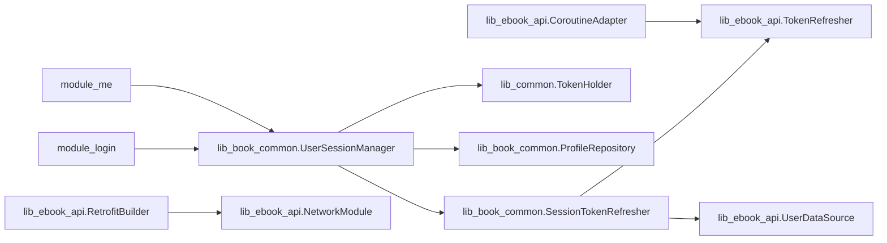

# 认证授权

<cite>
**本文引用的文件**
- [UserSessionManager.kt](file://lib_book_common/src/main/java/com/ebook/common/domain/UserSessionManager.kt)
- [AndroidUserSessionManager.kt](file://lib_book_common/src/main/java/com/ebook/common/domain/AndroidUserSessionManager.kt)
- [UserSession.kt](file://lib_book_common/src/main/java/com/ebook/common/domain/UserSession.kt)
- [SessionTokenRefresher.kt](file://lib_book_common/src/main/java/com/ebook/common/domain/SessionTokenRefresher.kt)
- [TokenRefresher.kt](file://lib_ebook_api/src/main/java/com/ebook/api/auth/TokenRefresher.kt)
- [LoginInterceptor.kt](file://lib_book_common/src/main/java/com/ebook/common/interceptor/LoginInterceptor.kt)
- [RetrofitBuilder.kt](file://lib_ebook_api/src/main/java/com/ebook/api/RetrofitBuilder.kt)
- [NetworkModule.kt](file://lib_ebook_api/src/main/java/com/ebook/api/utils/NetworkModule.kt)
- [CoroutineAdapter.kt](file://lib_ebook_api/src/main/java/com/ebook/api/utils/CoroutineAdapter.kt)
- [SettingViewModel.kt](file://module_me/src/main/java/com/ebook/me/mvvm/viewmodel/SettingViewModel.kt)
- [ModifyPwdActivity.kt](file://module_login/src/main/java/com/ebook/login/ModifyPwdActivity.kt)
- [VerifyUserActivity.kt](file://module_login/src/main/java/com/ebook/login/VerifyUserActivity.kt)
- [ADR-0011](file://docs/adr/0011-token-identity-decoupling-token-only-refresh.md)
- [ADR-0010](file://docs/adr/0010-silent-refresh-seam-and-session-expiry-bus.md)
- [ADR-0008](file://docs/adr/0008-auth-model-token-first-session.md)
- [AGENTS.md](file://AGENTS.md)
</cite>

## 目录
1. [简介](#简介)
2. [项目结构](#项目结构)
3. [核心组件](#核心组件)
4. [架构总览](#架构总览)
5. [详细组件分析](#详细组件分析)
6. [依赖关系分析](#依赖关系分析)
7. [性能考虑](#性能考虑)
8. [故障排查指南](#故障排查指南)
9. [结论](#结论)

## 简介
本文件聚焦于项目的身份验证与权限管理，覆盖双 Token 机制、会话生命周期、密码安全、权限控制、认证拦截器与安全事件处理。实现以“access token 驻内存、refresh token 持久化”的双令牌模式为核心，结合网络层静默刷新与会话过期统一处置，保证多设备、冷启动、并发请求等场景下的可用性与安全性。

## 项目结构
认证相关能力横跨多个模块：
- lib_book_common：会话状态抽象与 Android 实现（UserSessionManager / AndroidUserSessionManager）、会话刷新器（SessionTokenRefresher）、路由级登录拦截（LoginInterceptor）
- lib_ebook_api：刷新接口契约（TokenRefresher）、网络装配（RetrofitBuilder、NetworkModule）、统一调用封装（CoroutineAdapter）
- module_login / module_me：登录、注册、修改密码、登出等业务流程入口
- docs/adr：认证体系的关键设计决策记录（双 Token、静默刷新、会话过期等）

**图表来源**
- [UserSessionManager.kt:1-62](file://lib_book_common/src/main/java/com/ebook/common/domain/UserSessionManager.kt#L1-L62)
- [AndroidUserSessionManager.kt:17-162](file://lib_book_common/src/main/java/com/ebook/common/domain/AndroidUserSessionManager.kt#L17-L162)
- [SessionTokenRefresher.kt:15-96](file://lib_book_common/src/main/java/com/ebook/common/domain/SessionTokenRefresher.kt#L15-L96)
- [TokenRefresher.kt:1-27](file://lib_ebook_api/src/main/java/com/ebook/api/auth/TokenRefresher.kt#L1-L27)
- [LoginInterceptor.kt:10-42](file://lib_book_common/src/main/java/com/ebook/common/interceptor/LoginInterceptor.kt#L10-L42)
- [RetrofitBuilder.kt](file://lib_ebook_api/src/main/java/com/ebook/api/RetrofitBuilder.kt)
- [NetworkModule.kt](file://lib_ebook_api/src/main/java/com/ebook/api/utils/NetworkModule.kt)
- [CoroutineAdapter.kt](file://lib_ebook_api/src/main/java/com/ebook/api/utils/CoroutineAdapter.kt)

**章节来源**
- [UserSessionManager.kt:1-62](file://lib_book_common/src/main/java/com/ebook/common/domain/UserSessionManager.kt#L1-L62)
- [AndroidUserSessionManager.kt:17-162](file://lib_book_common/src/main/java/com/ebook/common/domain/AndroidUserSessionManager.kt#L17-L162)
- [SessionTokenRefresher.kt:15-96](file://lib_book_common/src/main/java/com/ebook/common/domain/SessionTokenRefresher.kt#L15-L96)
- [TokenRefresher.kt:1-27](file://lib_ebook_api/src/main/java/com/ebook/api/auth/TokenRefresher.kt#L1-L27)
- [LoginInterceptor.kt:10-42](file://lib_book_common/src/main/java/com/ebook/common/interceptor/LoginInterceptor.kt#L10-L42)
- [RetrofitBuilder.kt](file://lib_ebook_api/src/main/java/com/ebook/api/RetrofitBuilder.kt)
- [NetworkModule.kt](file://lib_ebook_api/src/main/java/com/ebook/api/utils/NetworkModule.kt)
- [CoroutineAdapter.kt](file://lib_ebook_api/src/main/java/com/ebook/api/utils/CoroutineAdapter.kt)

## 核心组件
- 用户会话管理器（UserSessionManager / AndroidUserSessionManager）：负责登录/登出、双 Token 的内存与持久化、三处镜像同步（内存、SP、ProfileRepository）。
- 会话刷新器（SessionTokenRefresher）：单飞互斥地刷新 access token，成功后仅更新凭证不改变身份信息。
- 刷新接口契约（TokenRefresher）：定义刷新能力，供网络层在 A0230 时调用。
- 路由登录拦截（LoginInterceptor）：页面跳转时根据 needLogin 标记判断是否跳转到登录页。
- 网络装配与统一调用（RetrofitBuilder / NetworkModule / CoroutineAdapter）：组装客户端、拦截器与错误处理，统一处理 A0230 触发刷新。

**章节来源**
- [UserSessionManager.kt:13-62](file://lib_book_common/src/main/java/com/ebook/common/domain/UserSessionManager.kt#L13-L62)
- [AndroidUserSessionManager.kt:17-162](file://lib_book_common/src/main/java/com/ebook/common/domain/AndroidUserSessionManager.kt#L17-L162)
- [SessionTokenRefresher.kt:15-96](file://lib_book_common/src/main/java/com/ebook/common/domain/SessionTokenRefresher.kt#L15-L96)
- [TokenRefresher.kt:1-27](file://lib_ebook_api/src/main/java/com/ebook/api/auth/TokenRefresher.kt#L1-L27)
- [LoginInterceptor.kt:10-42](file://lib_book_common/src/main/java/com/ebook/common/interceptor/LoginInterceptor.kt#L10-L42)
- [RetrofitBuilder.kt](file://lib_ebook_api/src/main/java/com/ebook/api/RetrofitBuilder.kt)
- [NetworkModule.kt](file://lib_ebook_api/src/main/java/com/ebook/api/utils/NetworkModule.kt)
- [CoroutineAdapter.kt](file://lib_ebook_api/src/main/java/com/ebook/api/utils/CoroutineAdapter.kt)

## 架构总览
认证授权围绕“双 Token + 静默刷新 + 会话过期统一处置”展开：
- 登录成功后保存用户会话信息与 refresh token；access token 仅驻内存。
- 冷启动时 TokenHolder 为空，首个需要鉴权的请求携带 A0230 响应码由网络层捕获，触发 SessionTokenRefresher 单飞刷新。
- 刷新成功则轮换新 access token 与新 refresh token（后者落盘），并重放原请求；失败则触发全局会话过期流程（清会话、提示、跳转登录）。
- 页面跳转通过 LoginInterceptor 进行是否需要登录的判定。

**图表来源**
- [SessionTokenRefresher.kt:48-91](file://lib_book_common/src/main/java/com/ebook/common/domain/SessionTokenRefresher.kt#L48-L91)
- [TokenRefresher.kt:16-27](file://lib_ebook_api/src/main/java/com/ebook/api/auth/TokenRefresher.kt#L16-L27)
- [AndroidUserSessionManager.kt:87-98](file://lib_book_common/src/main/java/com/ebook/common/domain/AndroidUserSessionManager.kt#L87-L98)
- [CoroutineAdapter.kt](file://lib_ebook_api/src/main/java/com/ebook/api/utils/CoroutineAdapter.kt)

**章节来源**
- [SessionTokenRefresher.kt:48-91](file://lib_book_common/src/main/java/com/ebook/common/domain/SessionTokenRefresher.kt#L48-L91)
- [TokenRefresher.kt:16-27](file://lib_ebook_api/src/main/java/com/ebook/api/auth/TokenRefresher.kt#L16-L27)
- [AndroidUserSessionManager.kt:87-98](file://lib_book_common/src/main/java/com/ebook/common/domain/AndroidUserSessionManager.kt#L87-L98)
- [CoroutineAdapter.kt](file://lib_ebook_api/src/main/java/com/ebook/api/utils/CoroutineAdapter.kt)

## 详细组件分析

### 双 Token 机制（access 内存存储、refresh 持久化、静默刷新、过期处理）
- access token：仅驻内存（TokenHolder），不落盘；冷启动为空，由首个请求经 A0230 走静默刷新补齐。
- refresh token：持久化到 SharedPreferences；刷新成功后立即替换旧值（服务端旧 refresh 会失效）。
- 静默刷新：使用 Mutex 串行化，避免并发重复刷新；若锁内发现当前 token 已变化，直接复用。
- 过期处理：A0230 由网络层收口，单飞刷新成功则重放；失败则发会话过期事件，统一清会话并引导重新登录。

**图表来源**
- [SessionTokenRefresher.kt:48-91](file://lib_book_common/src/main/java/com/ebook/common/domain/SessionTokenRefresher.kt#L48-L91)
- [AndroidUserSessionManager.kt:87-98](file://lib_book_common/src/main/java/com/ebook/common/domain/AndroidUserSessionManager.kt#L87-L98)
- [ADR-0011](file://docs/adr/0011-token-identity-decoupling-token-only-refresh.md)
- [ADR-0010](file://docs/adr/0010-silent-refresh-seam-and-session-expiry-bus.md)

**章节来源**
- [SessionTokenRefresher.kt:48-91](file://lib_book_common/src/main/java/com/ebook/common/domain/SessionTokenRefresher.kt#L48-L91)
- [AndroidUserSessionManager.kt:87-98](file://lib_book_common/src/main/java/com/ebook/common/domain/AndroidUserSessionManager.kt#L87-L98)
- [ADR-0011](file://docs/adr/0011-token-identity-decoupling-token-only-refresh.md)
- [ADR-0010](file://docs/adr/0010-silent-refresh-seam-and-session-expiry-bus.md)

### 会话生命周期管理（登录维护、多设备、自动登出、同步策略）
- 登录：saveSession 写入 SP 中的身份信息（不含密码）与 refresh token，同时将 access token 写入 TokenHolder。
- 多设备：refresh token 唯一可恢复凭据；服务端刷新时会作废旧 refresh，保证后刷新者优先。
- 自动登出：clearSession 一次性清理三处镜像（内存、SP、ProfileRepository），确保不再被误放行。
- 同步策略：冷启动将 SP 中 session 恢复为内存态，并将已有 refresh token 对应的 access token 留空交由首请求刷新补齐。

**图表来源**
- [UserSessionManager.kt:13-62](file://lib_book_common/src/main/java/com/ebook/common/domain/UserSessionManager.kt#L13-L62)
- [AndroidUserSessionManager.kt:17-162](file://lib_book_common/src/main/java/com/ebook/common/domain/AndroidUserSessionManager.kt#L17-L162)

**章节来源**
- [AndroidUserSessionManager.kt:61-133](file://lib_book_common/src/main/java/com/ebook/common/domain/AndroidUserSessionManager.kt#L61-L133)
- [UserSession.kt:1-17](file://lib_book_common/src/main/java/com/ebook/common/domain/UserSession.kt#L1-L17)
- [ADR-0008](file://docs/adr/0008-auth-model-token-first-session.md)

### 密码安全管理（传输加密、存储规范、修改流程、忘记密码）
- 传输加密：网络层基于 HTTPS；第三方站点编码问题通过 EncodingInterceptor 强制响应体类型与字符集，避免乱码导致解析失败。
- 存储规范：密码永不落盘；历史明文键在应用启动时清理，防止遗留泄露。
- 修改流程：通过 ModifyPwdActivity 等页面完成，遵循后端密码修改接口契约。
- 忘记密码：通过 VerifyUserActivity 等页面完成找回流程。

**图表来源**
- [EncodingInterceptor.kt:10-51](file://lib_ebook_api/src/main/java/com/ebook/api/intercepter/EncodingInterceptor.kt#L10-L51)
- [AndroidUserSessionManager.kt:45-52](file://lib_book_common/src/main/java/com/ebook/common/domain/AndroidUserSessionManager.kt#L45-L52)
- [ModifyPwdActivity.kt](file://module_login/src/main/java/com/ebook/login/ModifyPwdActivity.kt)
- [VerifyUserActivity.kt](file://module_login/src/main/java/com/ebook/login/VerifyUserActivity.kt)
- [SettingViewModel.kt](file://module_me/src/main/java/com/ebook/me/mvvm/viewmodel/SettingViewModel.kt)

**章节来源**
- [AndroidUserSessionManager.kt:45-52](file://lib_book_common/src/main/java/com/ebook/common/domain/AndroidUserSessionManager.kt#L45-L52)
- [ModifyPwdActivity.kt](file://module_login/src/main/java/com/ebook/login/ModifyPwdActivity.kt)
- [VerifyUserActivity.kt](file://module_login/src/main/java/com/ebook/login/VerifyUserActivity.kt)
- [SettingViewModel.kt](file://module_me/src/main/java/com/ebook/me/mvvm/viewmodel/SettingViewModel.kt)

### 权限控制机制（功能模块权限检查、角色管理、API 访问控制、资源访问权限）
- 功能模块权限检查：通过路由拦截器 LoginInterceptor，对需要登录的页面进行拦截，未登录时重定向到登录页。
- 角色管理：当前代码库未暴露角色字段或基于角色的细粒度权限模型；如需扩展，可在 UserSession 中引入角色信息并在拦截器中按角色放行。
- API 访问控制：服务端依据 Token 校验权限；客户端通过 TokenHolder 注入 access token，第三方站点请求使用纯净客户端（不带 token）。
- 资源访问权限：本地缓存、数据库访问由仓库层控制；敏感资源需结合服务端鉴权。

**图表来源**
- [LoginInterceptor.kt:14-42](file://lib_book_common/src/main/java/com/ebook/common/interceptor/LoginInterceptor.kt#L14-L42)

**章节来源**
- [LoginInterceptor.kt:14-42](file://lib_book_common/src/main/java/com/ebook/common/interceptor/LoginInterceptor.kt#L14-L42)

### 认证拦截器（AuthInterceptor 原理、Token 自动附加、请求签名、非法请求拦截）
- Token 自动附加：TokenHolder 持有当前 access token；网络层在发起受保护请求时自动从 TokenHolder 取 token 附加至请求头（具体实现位于网络装配层）。
- 请求签名：当前实现未引入自定义签名；如需增强防篡改，可在 OkHttp Interceptor 层增加签名逻辑并与服务端对齐。
- 非法请求拦截：服务端返回 A0230 表示 Token 过期；网络层捕获后触发静默刷新；刷新失败则触发会话过期流程。

**图表来源**
- [RetrofitBuilder.kt](file://lib_ebook_api/src/main/java/com/ebook/api/RetrofitBuilder.kt)
- [NetworkModule.kt](file://lib_ebook_api/src/main/java/com/ebook/api/utils/NetworkModule.kt)
- [CoroutineAdapter.kt](file://lib_ebook_api/src/main/java/com/ebook/api/utils/CoroutineAdapter.kt)
- [AndroidUserSessionManager.kt:59-60](file://lib_book_common/src/main/java/com/ebook/common/domain/AndroidUserSessionManager.kt#L59-L60)

**章节来源**
- [RetrofitBuilder.kt](file://lib_ebook_api/src/main/java/com/ebook/api/RetrofitBuilder.kt)
- [NetworkModule.kt](file://lib_ebook_api/src/main/java/com/ebook/api/utils/NetworkModule.kt)
- [CoroutineAdapter.kt](file://lib_ebook_api/src/main/java/com/ebook/api/utils/CoroutineAdapter.kt)
- [AndroidUserSessionManager.kt:59-60](file://lib_book_common/src/main/java/com/ebook/common/domain/AndroidUserSessionManager.kt#L59-L60)

### 安全事件处理（登录失败计数、账户锁定、异常登录检测、审计日志）
- 登录失败计数/账户锁定：当前代码未内置登录失败计数与锁定策略；建议在后端实施并统一返回错误码，客户端据此提示。
- 异常登录检测：建议在服务端基于设备/IP/时间窗口检测，客户端根据返回码提示风险。
- 安全审计日志：建议统一通过 Logger 记录关键认证事件（登录、刷新、登出、过期），便于追溯。

[本节为通用指导，不直接分析具体文件]

## 依赖关系分析
- 依赖方向：业务模块 → lib_book_common → lib_ebook_api；刷新器同时依赖会话持久化与刷新接口契约。
- 耦合点：
  - SessionTokenRefresher 依赖 UserSessionManager（持久化）与 UserDataSource（刷新端点）。
  - AndroidUserSessionManager 依赖 TokenHolder（内存 token）与 ProfileRepository（昵称/头像）。
  - 网络层通过 RetrofitBuilder/NetworkModule 装配客户端与拦截器；CoroutineAdapter 统一处理 A0230。
- 潜在循环：刷新器处于 lib_book_common，接口定义在 lib_ebook_api，通过 Hilt @Binds 解耦，避免反向依赖。

**图表来源**
- [SessionTokenRefresher.kt:42-46](file://lib_book_common/src/main/java/com/ebook/common/domain/SessionTokenRefresher.kt#L42-L46)
- [AndroidUserSessionManager.kt:29-33](file://lib_book_common/src/main/java/com/ebook/common/domain/AndroidUserSessionManager.kt#L29-L33)
- [TokenRefresher.kt:1-27](file://lib_ebook_api/src/main/java/com/ebook/api/auth/TokenRefresher.kt#L1-L27)
- [RetrofitBuilder.kt](file://lib_ebook_api/src/main/java/com/ebook/api/RetrofitBuilder.kt)
- [NetworkModule.kt](file://lib_ebook_api/src/main/java/com/ebook/api/utils/NetworkModule.kt)
- [CoroutineAdapter.kt](file://lib_ebook_api/src/main/java/com/ebook/api/utils/CoroutineAdapter.kt)

**章节来源**
- [SessionTokenRefresher.kt:42-46](file://lib_book_common/src/main/java/com/ebook/common/domain/SessionTokenRefresher.kt#L42-L46)
- [AndroidUserSessionManager.kt:29-33](file://lib_book_common/src/main/java/com/ebook/common/domain/AndroidUserSessionManager.kt#L29-L33)
- [TokenRefresher.kt:1-27](file://lib_ebook_api/src/main/java/com/ebook/api/auth/TokenRefresher.kt#L1-L27)
- [RetrofitBuilder.kt](file://lib_ebook_api/src/main/java/com/ebook/api/RetrofitBuilder.kt)
- [NetworkModule.kt](file://lib_ebook_api/src/main/java/com/ebook/api/utils/NetworkModule.kt)
- [CoroutineAdapter.kt](file://lib_ebook_api/src/main/java/com/ebook/api/utils/CoroutineAdapter.kt)

## 性能考虑
- 静默刷新互斥：Mutex 避免并发重复刷新，减少无效网络开销与服务端压力。
- 只更新必要字段：rotateCredentials 仅更新 token，不重建完整会话，降低 IO 与内存分配。
- 流式解码：EncodingInterceptor 使用流式 ResponseBody，避免大体积缓冲。
- 最小权限客户端：第三方站点请求使用纯净客户端，避免不必要的数据暴露与计算。

[本节提供通用指导，不直接分析具体文件]

## 故障排查指南
- 症状：登录后仍频繁跳转到登录页
  - 检查 clearSession 是否被意外调用；确认三处镜像是否一致（内存、SP、ProfileRepository）。
  - 参考路径：[AndroidUserSessionManager.clearSession](file://lib_book_common/src/main/java/com/ebook/common/domain/AndroidUserSessionManager.kt#L111-L133)
- 症状：冷启动后所有请求报 A0230
  - 检查是否有 refresh token 持久化；确认刷新链路未被 CoroutineAdapter 再次包装成死循环。
  - 参考路径：[SessionTokenRefresher.refresh](file://lib_book_common/src/main/java/com/ebook/common/domain/SessionTokenRefresher.kt#L50-L91)、[ADR-0010](file://docs/adr/0010-silent-refresh-seam-and-session-expiry-bus.md)
- 症状：修改密码后未生效或提示失败
  - 确认网络层 HTTPS 与编码设置；查看对应页面的 ViewModel 调用链。
  - 参考路径：[ModifyPwdActivity](file://module_login/src/main/java/com/ebook/login/ModifyPwdActivity.kt)、[SettingViewModel](file://module_me/src/main/java/com/ebook/me/mvvm/viewmodel/SettingViewModel.kt)
- 症状：第三方站点内容乱码
  - 检查 EncodingInterceptor 是否正确设置 charset。
  - 参考路径：[EncodingInterceptor](file://lib_ebook_api/src/main/java/com/ebook/api/intercepter/EncodingInterceptor.kt#L10-L51)

**章节来源**
- [AndroidUserSessionManager.kt:111-133](file://lib_book_common/src/main/java/com/ebook/common/domain/AndroidUserSessionManager.kt#L111-L133)
- [SessionTokenRefresher.kt:50-91](file://lib_book_common/src/main/java/com/ebook/common/domain/SessionTokenRefresher.kt#L50-L91)
- [ADR-0010](file://docs/adr/0010-silent-refresh-seam-and-session-expiry-bus.md)
- [ModifyPwdActivity.kt](file://module_login/src/main/java/com/ebook/login/ModifyPwdActivity.kt)
- [SettingViewModel.kt](file://module_me/src/main/java/com/ebook/me/mvvm/viewmodel/SettingViewModel.kt)
- [EncodingInterceptor.kt:10-51](file://lib_ebook_api/src/main/java/com/ebook/api/intercepter/EncodingInterceptor.kt#L10-L51)

## 结论
本项目采用“access token 内存存储 + refresh token 持久化”的双 Token 方案，配合单飞互斥的静默刷新与会话过期统一处置，实现了高可用且安全的认证体验。路由级登录拦截保证了页面访问的基本门槛；密码安全遵循“传输加密、不落盘、历史清理”的原则。未来可扩展角色与细粒度权限控制，并在服务端加强登录失败计数、账户锁定与异常登录检测；客户端侧通过统一日志记录安全事件，提升可观测性。