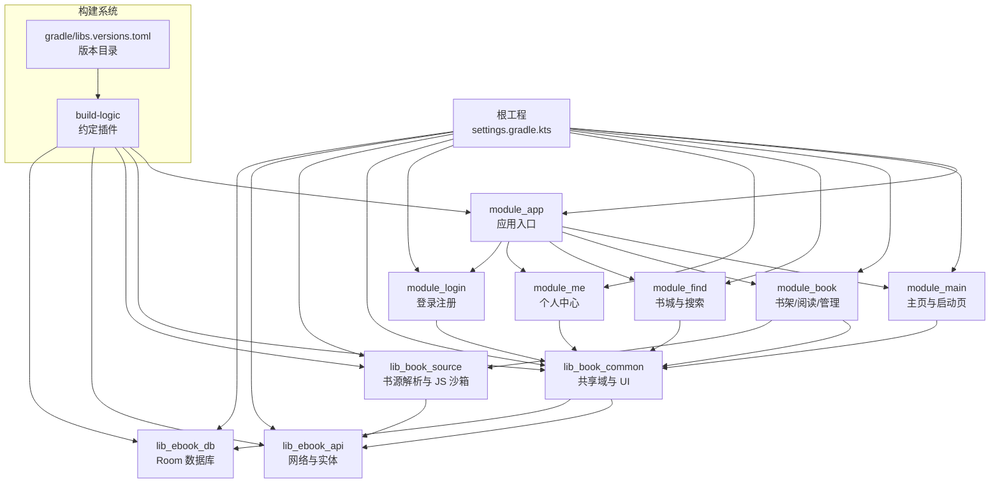
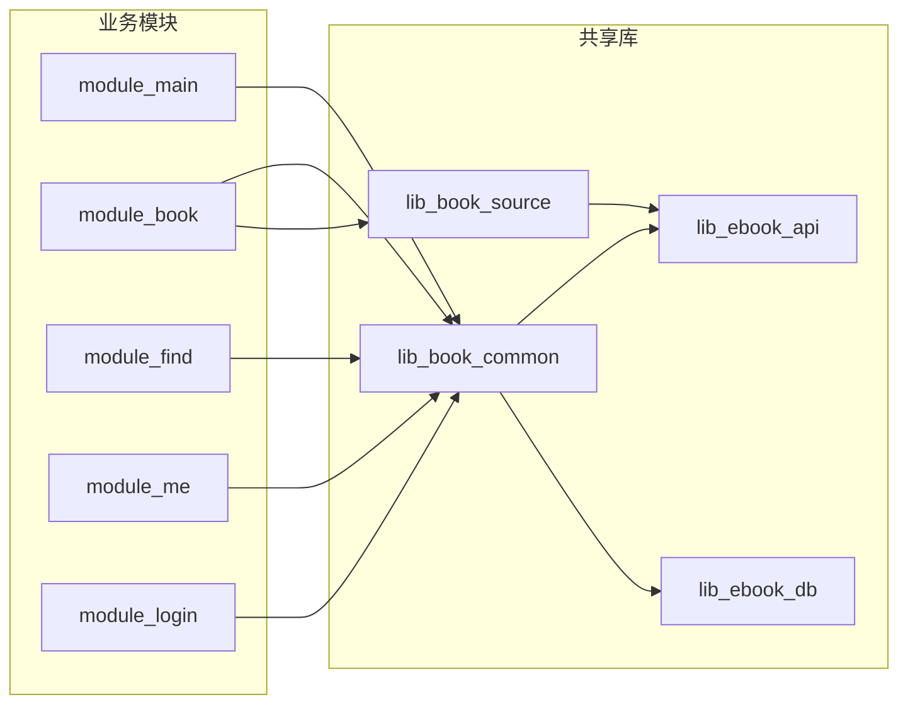
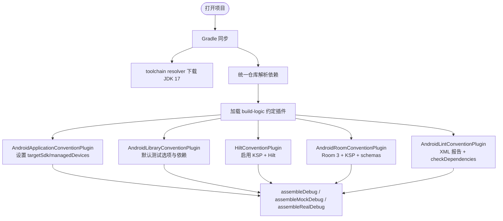
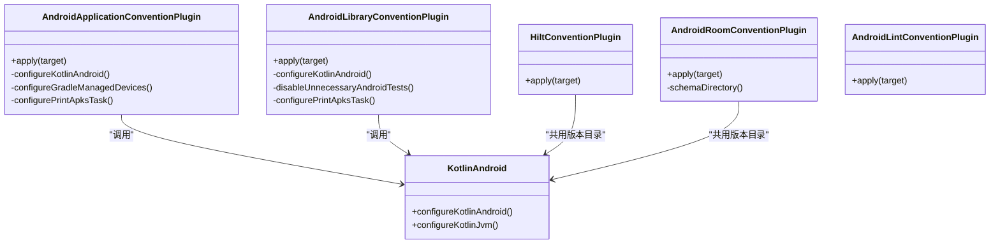
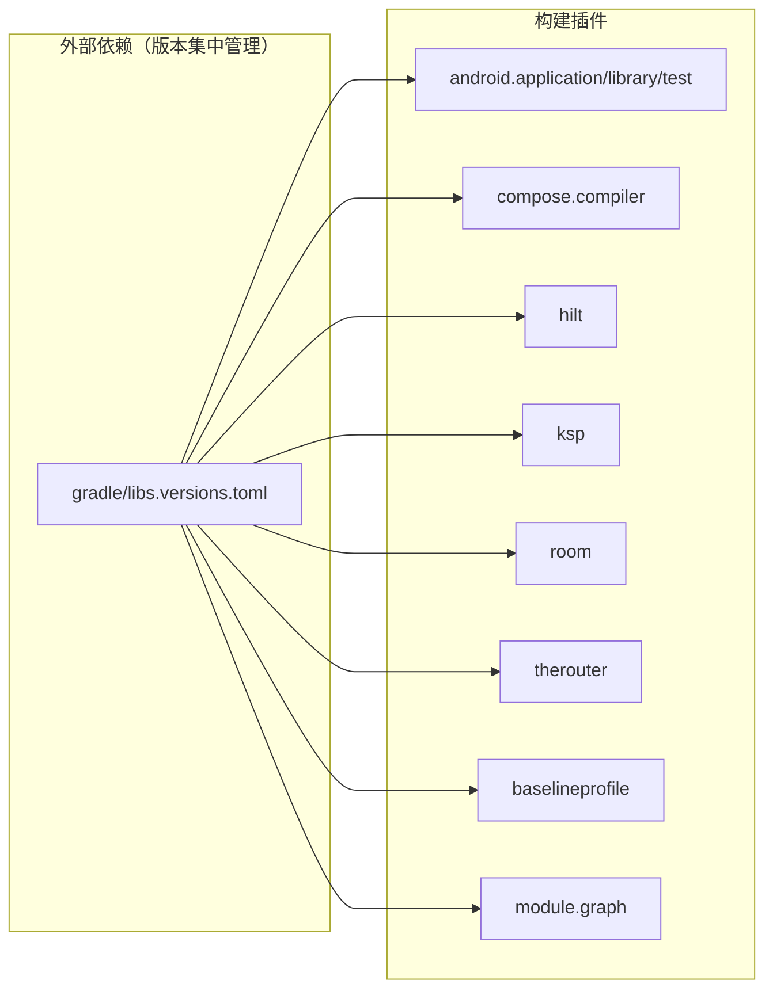
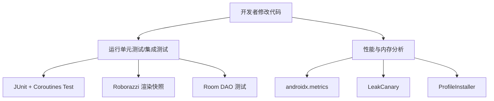
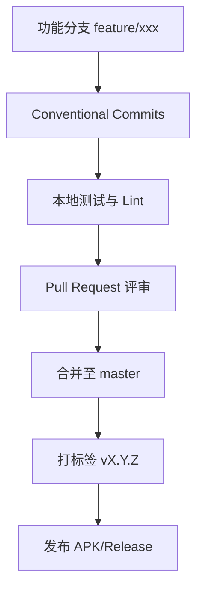

# 开发指南

<cite>
**本文引用的文件**   
- [README.MD](file://README.MD)
- [settings.gradle.kts](file://settings.gradle.kts)
- [build.gradle.kts](file://build.gradle.kts)
- [gradle.properties](file://gradle.properties)
- [gradle/gradle-daemon-jvm.properties](file://gradle/gradle-daemon-jvm.properties)
- [gradle/libs.versions.toml](file://gradle/libs.versions.toml)
- [gradle/wrapper/gradle-wrapper.properties](file://gradle/wrapper/gradle-wrapper.properties)
- [docs/versioning-practice.md](file://docs/versioning-practice.md)
- [AndroidApplicationConventionPlugin.kt](file://build-logic/convention/src/main/kotlin/AndroidApplicationConventionPlugin.kt)
- [AndroidLibraryConventionPlugin.kt](file://build-logic/convention/src/main/kotlin/AndroidLibraryConventionPlugin.kt)
- [KotlinAndroid.kt](file://build-logic/convention/src/main/kotlin/com/xrn1997/convention/KotlinAndroid.kt)
- [ProjectExtensions.kt](file://build-logic/convention/src/main/kotlin/com/xrn1997/convention/ProjectExtensions.kt)
- [HiltConventionPlugin.kt](file://build-logic/convention/src/main/kotlin/HiltConventionPlugin.kt)
- [AndroidRoomConventionPlugin.kt](file://build-logic/convention/src/main/kotlin/AndroidRoomConventionPlugin.kt)
- [AndroidLintConventionPlugin.kt](file://build-logic/convention/src/main/kotlin/AndroidLintConventionPlugin.kt)
</cite>

## 目录
1. [引言](#引言)
2. [项目结构](#项目结构)
3. [核心组件](#核心组件)
4. [架构总览](#架构总览)
5. [详细组件分析](#详细组件分析)
6. [依赖关系分析](#依赖关系分析)
7. [性能与构建优化](#性能与构建优化)
8. [调试与测试指南](#调试与测试指南)
9. [代码规范与审查](#代码规范与审查)
10. [Git 工作流与提交规范](#git-工作流与提交规范)
11. [常见问题排查](#常见问题排查)
12. [结论](#结论)

## 引言
本项目是一个完全使用 Kotlin 开发的 Android 小说阅读器，采用 MVVM + 多模块架构，界面已全面迁移到 Jetpack Compose。项目提供 real/mock 双构建变体，支持无后端本地开发；同时内置书源解析引擎、阅读恢复、下载服务、账号体系、书城搜索、章节评论与个人中心等功能。仓库文档和 ADR 记录了技术选型、数据迁移、认证现代化、沙箱执行器与 UI 迁移等关键决策。

## 项目结构
根工程通过 Gradle settings 声明所有模块，包含应用入口、功能模块（主页、书籍、书城、我的、登录）、共享库（book_common、book_source）以及基础设施库（ebook_api、ebook_db）。构建系统集中在 build-logic 约定插件中，统一 Android 应用/库配置、Kotlin 编译选项、Compose、Hilt、Room、Lint 等能力。

**图表来源**  
- [settings.gradle.kts:1-65](file://settings.gradle.kts#L1-L65)
- [README.MD:1-212](file://README.MD#L1-L212)

**分节来源**  
- [settings.gradle.kts:1-65](file://settings.gradle.kts#L1-L65)
- [README.MD:1-212](file://README.MD#L1-L212)

## 核心组件
- 应用与业务模块：module_app、module_main、module_book、module_find、module_me、module_login。
- 共享与基础设施库：lib_book_common、lib_book_source、lib_ebook_api、lib_ebook_db。
- 构建系统与约定插件：build-logic 中的 Android 应用/库、Compose、Hilt、Room、Lint 等插件，以及 gradle/libs.versions.toml 版本目录。
- 工具链与脚本：Gradle Wrapper、foojay toolchain resolver、NDK/CMake、QuickJS C 源码与 JNI 桥。

**分节来源**  
- [README.MD:1-212](file://README.MD#L1-L212)
- [settings.gradle.kts:1-65](file://settings.gradle.kts#L1-L65)

## 架构总览
从运行时视角，业务模块通过 TheRouter 与 Provider 接口解耦，调用 lib_book_common 的领域能力；lib_book_common 再依赖 lib_ebook_api 的网络层与 lib_ebook_db 的数据层。lib_book_source 为书源解析专用层，包含原生解析器、脚本解释器与 QuickJS 沙箱执行器。

**图表来源**  
- [README.MD:1-212](file://README.MD#L1-L212)

**分节来源**  
- [README.MD:1-212](file://README.MD#L1-L212)

## 详细组件分析

### 开发环境与工具链
- JDK：项目要求 JDK 17，并通过 AGP 9 的 toolchain auto-provisioning 自动获取；gradle-daemon-jvm.properties 列出了 foojay 下载地址与 Toolchain 版本。
- Android Studio：建议 >= 2025.1.3；AGP 9.2.1、Kotlin 2.4.10、Gradle 9.4.1 由 wrapper 管理，无需本地安装 Gradle。
- SDK：compileSdk/targetSdk 37，minSdk 26。
- NDK/CMake/QuickJS：lib_book_source 包含 C++ 与 CMakeLists.txt，并 vendored QuickJS C 源码；NDK 版本在 libs.versions.toml 中钉死以避免不同机器产出差异。
- 后端基址：通过 local.properties 注入 ebook.server.host，默认模拟器访问宿主机 10.0.2.2。

**分节来源**  
- [README.MD:1-212](file://README.MD#L1-L212)
- [gradle/libs.versions.toml:1-60](file://gradle/libs.versions.toml#L1-L60)
- [gradle/gradle-daemon-jvm.properties:1-12](file://gradle/gradle-daemon-jvm.properties#L1-L12)

### 构建系统与 Gradle 多模块
- 根 build.gradle.kts 仅声明插件别名，AGP 9 内置 Kotlin，不再需要单独声明 kotlin.android。
- settings.gradle.kts 集中声明所有模块，并使用 org.gradle.toolchains.foojay-resolver-convention 插件以支持 Gradle 9 的 toolchain 自动下载；repositoriesMode 设为 FAIL_ON_PROJECT_REPOS，强制统一仓库源。
- build-logic 是 includeBuild 的独立子工程，内含约定插件，统一应用/库/Compose/Hilt/Room/Lint 配置。
- 版本目录 gradle/libs.versions.toml 集中管理依赖版本；wrapper 锁定 Gradle 9.4.1。

**图表来源**  
- [build.gradle.kts:1-15](file://build.gradle.kts#L1-L15)
- [settings.gradle.kts:1-65](file://settings.gradle.kts#L1-L65)
- [AndroidApplicationConventionPlugin.kt:1-49](file://build-logic/convention/src/main/kotlin/AndroidApplicationConventionPlugin.kt#L1-L49)
- [AndroidLibraryConventionPlugin.kt:1-69](file://build-logic/convention/src/main/kotlin/AndroidLibraryConventionPlugin.kt#L1-L69)
- [HiltConventionPlugin.kt:1-49](file://build-logic/convention/src/main/kotlin/HiltConventionPlugin.kt#L1-L49)
- [AndroidRoomConventionPlugin.kt:1-52](file://build-logic/convention/src/main/kotlin/AndroidRoomConventionPlugin.kt#L1-L52)
- [AndroidLintConventionPlugin.kt:1-47](file://build-logic/convention/src/main/kotlin/AndroidLintConventionPlugin.kt#L1-L47)

**分节来源**  
- [build.gradle.kts:1-15](file://build.gradle.kts#L1-L15)
- [settings.gradle.kts:1-65](file://settings.gradle.kts#L1-L65)
- [gradle/libs.versions.toml:1-60](file://gradle/libs.versions.toml#L1-L60)
- [gradle/wrapper/gradle-wrapper.properties:1-6](file://gradle/wrapper/gradle-wrapper.properties#L1-L6)

### 约定插件详解
- Android 应用插件：统一 targetSdk=37、applicationId=namespace、禁用动画测试、配置 Gradle Managed Devices，并打印测试 APK 信息。
- Android 库插件：统一 minSdk=26、JDK 17、coreLibraryDesugaring、单元测试返回默认 Log 值、注入 tracing-ktx 与测试依赖；若存在 androidTest 才注入 androidTestImplementation。
- Kotlin 配置：JVM target 17，warningsAsErrors 可由 gradle.properties 控制，启用协程实验 API opt-in。
- Hilt：对 JVM 与 Android 模块分别注入 Hilt core/android，统一使用 KSP 生成代码。
- Room：启用 Room 3 插件与 KSP，生成 Kotlin，schemas 目录用于自动迁移。
- Lint：统一开启 XML 报告与检查依赖。

**图表来源**  
- [AndroidApplicationConventionPlugin.kt:1-49](file://build-logic/convention/src/main/kotlin/AndroidApplicationConventionPlugin.kt#L1-L49)
- [AndroidLibraryConventionPlugin.kt:1-69](file://build-logic/convention/src/main/kotlin/AndroidLibraryConventionPlugin.kt#L1-L69)
- [KotlinAndroid.kt:1-91](file://build-logic/convention/src/main/kotlin/com/xrn1997/convention/KotlinAndroid.kt#L1-L91)
- [HiltConventionPlugin.kt:1-49](file://build-logic/convention/src/main/kotlin/HiltConventionPlugin.kt#L1-L49)
- [AndroidRoomConventionPlugin.kt:1-52](file://build-logic/convention/src/main/kotlin/AndroidRoomConventionPlugin.kt#L1-L52)
- [AndroidLintConventionPlugin.kt:1-47](file://build-logic/convention/src/main/kotlin/AndroidLintConventionPlugin.kt#L1-L47)

**分节来源**  
- [AndroidApplicationConventionPlugin.kt:1-49](file://build-logic/convention/src/main/kotlin/AndroidApplicationConventionPlugin.kt#L1-L49)
- [AndroidLibraryConventionPlugin.kt:1-69](file://build-logic/convention/src/main/kotlin/AndroidLibraryConventionPlugin.kt#L1-L69)
- [KotlinAndroid.kt:1-91](file://build-logic/convention/src/main/kotlin/com/xrn1997/convention/KotlinAndroid.kt#L1-L91)
- [HiltConventionPlugin.kt:1-49](file://build-logic/convention/src/main/kotlin/HiltConventionPlugin.kt#L1-L49)
- [AndroidRoomConventionPlugin.kt:1-52](file://build-logic/convention/src/main/kotlin/AndroidRoomConventionPlugin.kt#L1-L52)
- [AndroidLintConventionPlugin.kt:1-47](file://build-logic/convention/src/main/kotlin/AndroidLintConventionPlugin.kt#L1-L47)

### 快速上手与构建命令
- 克隆仓库后，优先运行 mock 构建以无后端验证流程：`./gradlew :module_app:assembleMockDebug`。
- 真实后端构建需先启动 ebook-server，并将后端基址配置到 local.properties。
- 单模块独立调试：将 gradle.properties 中的 isModule 临时改为 true，各功能模块可作为独立 App 运行。

**分节来源**  
- [README.MD:1-212](file://README.MD#L1-L212)
- [gradle.properties:1-35](file://gradle.properties#L1-L35)

## 依赖关系分析
- 模块间依赖方向：业务模块 → lib_book_common → lib_ebook_api / lib_ebook_db；lib_book_source 对 lib_ebook_api 并列依赖；功能模块互不依赖，跨模块通过 TheRouter 与 Provider 通信。
- 外部依赖集中于 libs.versions.toml，涵盖 Compose BOM、Material3、Hilt、Retrofit、OkHttp、Room、Coil、Jsoup、Protobuf、Roborazzi、Turbine 等。
- 构建期依赖：AGP 9.2.1、Kotlin 2.4.10、KSP、Room3 插件、Therouter 插件、BaselineProfile、Module Graph。

**图表来源**  
- [gradle/libs.versions.toml:1-60](file://gradle/libs.versions.toml#L1-L60)
- [build.gradle.kts:1-15](file://build.gradle.kts#L1-L15)

**分节来源**  
- [gradle/libs.versions.toml:1-60](file://gradle/libs.versions.toml#L1-L60)
- [build.gradle.kts:1-15](file://build.gradle.kts#L1-L15)

## 性能与构建优化
- Gradle 与 AGP：AGP 9 内置 Kotlin，减少插件数量；wrapper 锁定 Gradle 9.4.1，配合 foojay toolchain resolver 自动拉取 JDK 17。
- 增量编译：KSP 开启 incremental 与 intermodule，提升多模块编译速度。
- R8 规则：关闭 strictFullModeForKeepRules，避免误删保留规则导致的构建问题。
- 资源压缩：optimizedResourceShrinking 在 AGP 9.2 已弃用，直接采用默认值。
- 内存与守护进程：gradle.properties 设置 daemon JVM 堆大小，避免大型工程 OOM。

**分节来源**  
- [gradle.properties:1-35](file://gradle.properties#L1-L35)
- [gradle/gradle-daemon-jvm.properties:1-12](file://gradle/gradle-daemon-jvm.properties#L1-L12)
- [settings.gradle.kts:1-65](file://settings.gradle.kts#L1-L65)

## 调试与测试指南
- 日志输出：建议使用 Android 标准日志通道；库模块单元测试中 Log 返回默认值，便于纯 JVM 测试。
- 性能分析：项目引入 androidx.metrics、benchmark macro 与 profileinstaller，可用于性能指标采集与基准测试。
- 内存泄漏检测：LeakCanary Android 依赖已定义在版本目录中，可在 debug 变体启用。
- 单元测试：JUnit + kotlinx-coroutines-test；UI 渲染测试使用 Roborazzi 与 Turbine；Room DAO 有对应测试类。
- 设备与真机：通过 Gradle Managed Devices 与自定义 PrintTestApks 任务辅助测试。

**图表来源**  
- [gradle/libs.versions.toml:1-60](file://gradle/libs.versions.toml#L1-L60)
- [AndroidLibraryConventionPlugin.kt:1-69](file://build-logic/convention/src/main/kotlin/AndroidLibraryConventionPlugin.kt#L1-L69)

**分节来源**  
- [gradle/libs.versions.toml:1-60](file://gradle/libs.versions.toml#L1-L60)
- [AndroidLibraryConventionPlugin.kt:1-69](file://build-logic/convention/src/main/kotlin/AndroidLibraryConventionPlugin.kt#L1-L69)

## 代码规范与审查
- Kotlin 编码风格：全 Kotlin 工程，KGP 由 AGP 提供；JVM target 17，可通过 warningsAsErrors 开关把警告视为错误。
- 命名约定：遵循 Kotlin 官方命名规范；模块包名以 com.ebook 为基础划分 domain、mvvm、page、repository、service 等。
- 注释规范：公共 API 与关键逻辑应添加说明性注释；复杂算法或边界条件建议在 ADR 或行内注释中记录原因。
- 代码审查标准：遵循 Conventional Commits 中文描述；提交前确保 lint 通过、测试用例覆盖变更点；涉及架构变化需补充或更新 ADR。

**分节来源**  
- [KotlinAndroid.kt:1-91](file://build-logic/convention/src/main/kotlin/com/xrn1997/convention/KotlinAndroid.kt#L1-L91)
- [AndroidLintConventionPlugin.kt:1-47](file://build-logic/convention/src/main/kotlin/AndroidLintConventionPlugin.kt#L1-L47)
- [README.MD:1-212](file://README.MD#L1-L212)

## Git 工作流与提交规范
- 分支策略：推荐基于 master 的功能分支，合并前完成自测与 PR 评审；重大架构变更需在 docs/adr 下新增 ADR。
- 提交规范：遵循 Conventional Commits，中文描述变更；提交消息类型包括 feat、fix、docs、build、refactor、perf、test、chore 等。
- 版本号实践：SemVer 2.0.0 三段式为主；tag 前缀建议小写 v；versionCode 必须单调递增且不超过上限；当前仓库采用从 versionName 反解 versionCode 的实践，详见版本实践文档。

**图表来源**  
- [docs/versioning-practice.md:1-200](file://docs/versioning-practice.md#L1-L200)
- [README.MD:1-212](file://README.MD#L1-L212)

**分节来源**  
- [docs/versioning-practice.md:1-200](file://docs/versioning-practice.md#L1-L200)
- [README.MD:1-212](file://README.MD#L1-L212)

## 常见问题排查
- 无法同步或找不到 toolchain：确保已启用 foojay resolver 并等待 Gradle 9 自动下载 JDK；必要时清理 Gradle 缓存与 .gradle/caches。
- 后端连接失败：检查 local.properties 中的 ebook.server.host，模拟器默认 10.0.2.2；局域网真机需改为宿主机 IP。
- 单模块调试异常：确认 gradle.properties 中 isModule=false；不要使用命令行 -PisModule=true 覆盖，以免 settings 联动失效。
- Room 迁移失败：检查 schemas 目录下是否包含目标版本的 schema 文件；Room 3 自动迁移依赖 schema 完整性。
- 依赖冲突或版本不一致：统一在 libs.versions.toml 中维护版本，避免在模块 build.gradle.kts 硬编码。
- 构建慢或 OOM：调整 gradle.properties 的 daemon JVM 堆大小，启用 KSP 增量与 intermodule，避免并行构建带来的内存压力。

**分节来源**  
- [settings.gradle.kts:1-65](file://settings.gradle.kts#L1-L65)
- [gradle.properties:1-35](file://gradle.properties#L1-L35)
- [AndroidRoomConventionPlugin.kt:1-52](file://build-logic/convention/src/main/kotlin/AndroidRoomConventionPlugin.kt#L1-L52)
- [gradle/libs.versions.toml:1-60](file://gradle/libs.versions.toml#L1-L60)

## 结论
本指南覆盖了环境搭建、构建系统、代码规范、调试测试、Git 流程与问题排查。项目以现代 Android 技术栈为核心，通过 build-logic 统一构建配置、版本目录统一管理依赖、ADR 沉淀架构决策，形成可维护、可扩展的小说阅读器工程。新加入的开发者可先从 mock 构建入手，逐步熟悉模块职责与约定插件，再通过 ADR 与文档理解历史演进与设计取舍。