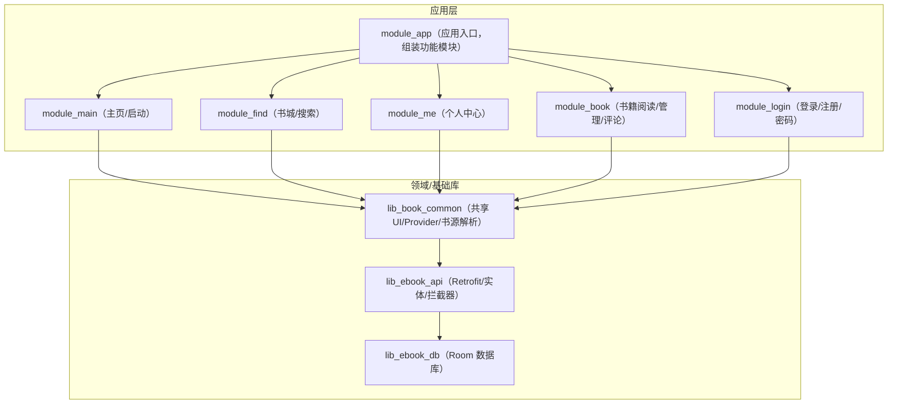
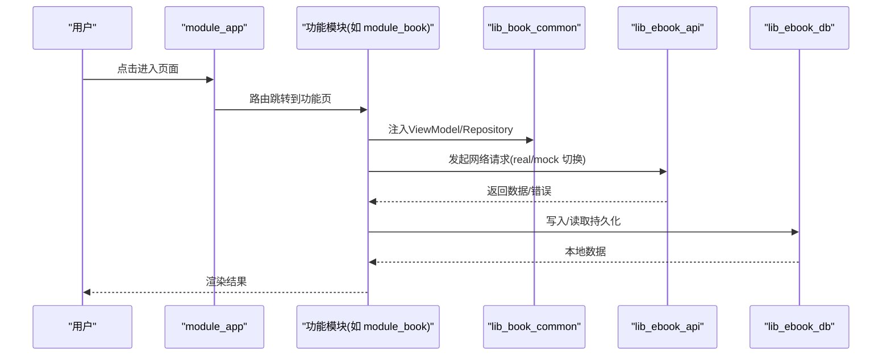
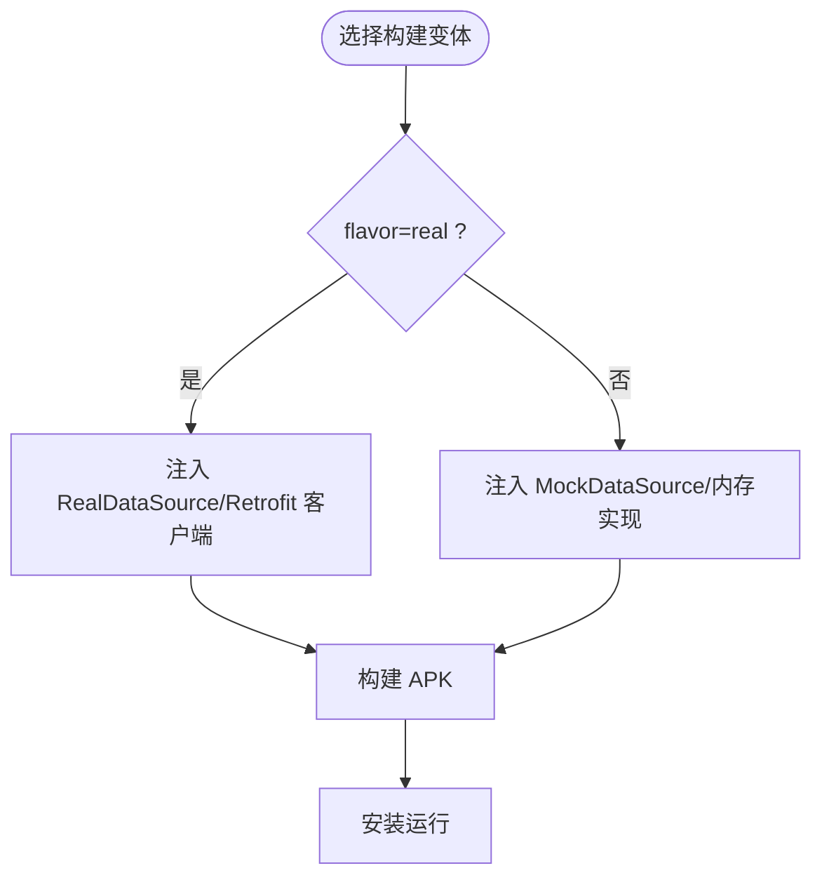
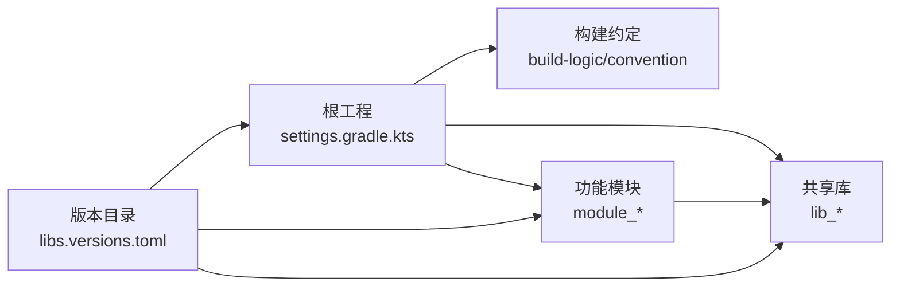

# 快速开始

<cite>
**本文引用的文件**
- [README.md](file://README.md)
- [AGENTS.md](file://AGENTS.md)
- [settings.gradle.kts](file://settings.gradle.kts)
- [gradle.properties](file://gradle.properties)
- [gradle/libs.versions.toml](file://gradle/libs.versions.toml)
- [module_app/build.gradle.kts](file://module_app/build.gradle.kts)
- [build-logic/convention/src/main/kotlin/com/xrn1997/convention/KotlinAndroid.kt](file://build-logic/convention/src/main/kotlin/com/xrn1997/convention/KotlinAndroid.kt)
- [build-logic/convention/src/main/kotlin/com/xrn1997/convention/AndroidApplicationConventionPlugin.kt](file://build-logic/convention/src/main/kotlin/com/xrn1997/convention/AndroidApplicationConventionPlugin.kt)
- [lib_book_common/src/main/AndroidManifest.xml](file://lib_book_common/src/main/AndroidManifest.xml)
- [module_app/src/main/AndroidManifest.xml](file://module_app/src/main/AndroidManifest.xml)
</cite>

## 目录
1. [简介](#简介)
2. [项目结构](#项目结构)
3. [核心组件](#核心组件)
4. [架构总览](#架构总览)
5. [详细组件分析](#详细组件分析)
6. [依赖关系分析](#依赖关系分析)
7. [性能与构建优化](#性能与构建优化)
8. [故障排查指南](#故障排查指南)
9. [结论](#结论)

## 简介
本项目是一个 100% Kotlin 开发的 Android 小说阅读器，采用 MVVM + 多模块架构，界面全部使用 Jetpack Compose。提供 real/mock 两种构建 flavor，无需后端即可完整开发与调试（mock 模式），适合新成员与外部贡献者快速上手。

本快速开始指南将帮助你：
- 准备开发环境（Android Studio、JDK、Gradle、目标设备）
- 克隆并构建项目
- 运行 mock 版和真实后端版
- 常用构建命令速查
- 理解 product flavor 与独立模块开发模式
- 完成首次运行的验证
- 排解常见问题（权限、网络等）

## 项目结构
项目为多模块 Gradle 工程，根工程统一管理版本与插件，业务按功能拆分 module，共享能力下沉到库。

说明：
- 依赖方向统一为：业务模块 → lib_book_common → lib_ebook_api → lib_ebook_db
- 模块间通过 TheRouter + Provider 进行跨模块交互
- 插件与通用构建配置集中于 build-logic

图表来源
- [settings.gradle.kts:55-64](file://settings.gradle.kts#L55-L64)
- [module_app/build.gradle.kts:47-63](file://module_app/build.gradle.kts#L47-L63)

章节来源
- [README.md:86-103](file://README.md#L86-L103)
- [AGENTS.md](file://AGENTS.md)

## 核心组件
- 构建与版本管理：Gradle 9.4.1 + AGP 9.2.1，Kotlin 2.4.10，KSP；版本通过 gradle/libs.versions.toml 集中管理
- 多模块组织：app 聚合各业务模块，库提供共享能力
- 双构建 flavor：real（真实后端）、mock（内存数据）以 network 维度划分
- 约定插件：build-logic 下提供统一 Android/Kotlin/Compose/Room/Hilt 等配置，确保多模块一致

章节来源
- [gradle/libs.versions.toml:1-70](file://gradle/libs.versions.toml#L1-L70)
- [module_app/build.gradle.kts:1-45](file://module_app/build.gradle.kts#L1-L45)
- [settings.gradle.kts:1-27](file://settings.gradle.kts#L1-L27)

## 架构总览
整体由“应用入口 → 功能模块 → 领域库 → 基础设施库”组成；数据通路在模块内通过 Repository → DataSource/Network/Database，UI 侧使用 Compose + ViewModel；跨模块路由与通信走 TheRouter/Provider。

图表来源
- [module_app/build.gradle.kts:47-63](file://module_app/build.gradle.kts#L47-L63)
- [settings.gradle.kts:55-64](file://settings.gradle.kts#L55-L64)

## 详细组件分析

### 环境准备
- Android Studio：需要 2025.1.3 或更高版本（旧版无法兼容当前 Gradle）
- JDK：17（字节码目标与工具链均为 17；构建守护进程 JVM 由 Gradle toolchain 自动拉取）
- Gradle：9.4.1（由 wrapper 自带，无需本地安装）
- AGP：9.2.1（Kotlin 内置，Android 模块不再单独引入 Kotlin 插件）
- 目标设备：compileSdk/targetSdk 37，minSdk 26（Android 8.0+）

校验要点：
- Gradle Wrapper：gradle/wrapper/gradle-wrapper.properties
- 版本目录：gradle/libs.versions.toml（AGP/Kotlin/Compose/BOM 等）
- 插件与仓库镜像：settings.gradle.kts（含阿里/腾讯/GitHub/中央仓等）

章节来源
- [README.md:51-59](file://README.md#L51-L59)
- [gradle/wrapper/gradle-wrapper.properties:1-7](file://gradle/wrapper/gradle-wrapper.properties#L1-L7)
- [gradle/libs.versions.toml:1-200](file://gradle/libs.versions.toml#L1-L200)
- [build-logic/convention/src/main/kotlin/com/xrn1997/convention/KotlinAndroid.kt:38-43](file://build-logic/convention/src/main/kotlin/com/xrn1997/convention/KotlinAndroid.kt#L38-L43)
- [build-logic/convention/src/main/kotlin/com/xrn1997/convention/AndroidApplicationConventionPlugin.kt:35-42](file://build-logic/convention/src/main/kotlin/com/xrn1997/convention/AndroidApplicationConventionPlugin.kt#L35-L42)
- [settings.gradle.kts:1-27](file://settings.gradle.kts#L1-L27)

### 克隆与构建步骤
- 克隆项目
- 首次同步（Android Studio 会自动根据 settings 配置导入 build-logic 与子模块）
- 构建 Mock 版（无需后端服务器）
- 构建 Real 版（需先启动 ebook-server 并使用 local.properties 设置 base URL）

常用命令（Windows PowerShell 用 .\gradlew 替代 ./gradlew）：
- 构建 mock debug APK：./gradlew :module_app:assembleMockDebug
- 构建 real debug APK：./gradlew :module_app:assembleRealDebug
- 清理并构建：./gradlew clean build
- 全量单元测试：./gradlew test
- 指定模块测试：./gradlew :module_book:testDebugUnitTest
- 集成测试（需连接设备/模拟器）：./gradlew connectedAndroidTest
- Lint 检查：./gradlew lint

章节来源
- [README.md:60-84](file://README.md#L60-L84)
- [AGENTS.md](file://AGENTS.md)

### Product Flavor（real/mock）机制
- flavor dimension：network
- flavors：real（真实后端）、mock（内存数据，applicationId 加后缀便于并存）
- 构建变体：debug/release × real/mock（例如 assembleRealDebug、assembleMockRelease）
- source set：mock flavor 的 NetworkModule 在 module_app/src/mock，real 在 module_app/src/real；通过 Hilt 绑定不同 DataSource 实现
- 适用场景：无后端也可完整联调 UI/流程；有后端时可切到 real

图表：Flavor 选择与数据源绑定

图表来源
- [module_app/build.gradle.kts:17-39](file://module_app/build.gradle.kts#L17-L39)
- [README.md:62-84](file://README.md#L62-L84)

章节来源
- [module_app/build.gradle.kts:1-45](file://module_app/build.gradle.kts#L1-L45)
- [README.md:60-84](file://README.md#L60-L84)

### Module 独立开发模式
- isModule=true（在 gradle.properties 中设置）时，各功能模块可作为独立 App 运行，默认使用 mock 数据源，便于单模块独立调试
- isModule=false（默认值）时为集成构建，module_app 依赖所有功能模块形成完整应用
- 注意：仅直接修改 gradle.properties 中的 isModule，不要通过命令行 -PisModule=true 覆盖，以避免 includeBuild(lib-common-build) 场景下的插件冲突
- 清单替换：isModule=true 时，模块主清单会被重写至 src/main/module/AndroidManifest.xml，两处清单为替换关系

步骤建议：
- 如需独立开发某功能模块，临时在 gradle.properties 把 isModule 改为 true，完成后务必改回 false
- 对模块新增的 Activity/Route 等在独立模式下需要占位声明，避免 TheRouter 找不到路径静默失败

章节来源
- [gradle.properties:14-29](file://gradle.properties#L14-L29)
- [AGENTS.md](file://AGENTS.md)

### 首次运行验证
- 构建 mock 版后安装到模拟器/真机，打开应用应可正常显示首页、书城、个人中心等核心页面
- 若涉及网络能力（即便 mock 也包含部分 HTTP 行为），确认网络权限可用且未被系统拦截
- 如需真实后端，请设置 local.properties 的 ebook.server.host，并按 README 指引启动服务端

常见现象与建议：
- 首次运行慢属正常（依赖下载、首次编译）
- 若报错 Toolchain 相关，确认 Android Studio 允许自动下载 JBR 或手动指向 JDK 17

章节来源
- [README.md:51-84](file://README.md#L51-L84)

## 依赖关系分析
- 根级依赖约束：settings.gradle.kts 启用 repositoriesMode = FAIL_ON_PROJECT_REPOS，强制各子项目通过版本目录与集中仓库解析
- 构建逻辑：build-logic/convention 统一 Kotlin 与 Android 配置（如 compileSdk/targetSdk/minSdk 默认值）
- 版本管理：gradle/libs.versions.toml 提供统一的版本号、库分组与 bundle
- 仓库镜像：settings.gradle.kts 与 pluginManagement/dependencyResolutionManagement 中配置了阿里云镜像，改善国内构建稳定性

图表来源
- [settings.gradle.kts:1-43](file://settings.gradle.kts#L1-L43)
- [gradle/libs.versions.toml:1-200](file://gradle/libs.versions.toml#L1-L200)
- [build-logic/convention/src/main/kotlin/com/xrn1997/convention/KotlinAndroid.kt:38-43](file://build-logic/convention/src/main/kotlin/com/xrn1997/convention/KotlinAndroid.kt#L38-L43)

章节来源
- [settings.gradle.kts:28-43](file://settings.gradle.kts#L28-L43)

## 性能与构建优化
- Gradle 守护进程与并行：gradle.properties 已开启并发、增大 JVM 堆大小以提升构建速度
- KSP 增量：KSP 增量日志与跨模块增量已启用，有助于缩短增量构建时间
- 仓库镜像：使用阿里云镜像减少下载失败与超时
- 建议实践：
  - 增量开发时使用特定任务（如 assembleMockDebug 而非全量 build）
  - 首次构建后可配合 --parallel 与 Gradle 缓存加速
  - 关注构建输出，遇到重复依赖或版本冲突优先在版本目录与仓库镜像处定位

章节来源
- [gradle.properties:14-35](file://gradle.properties#L14-L35)
- [settings.gradle.kts:6-26](file://settings.gradle.kts#L6-L26)

## 故障排查指南

### 权限相关问题
- 应用清单仅声明最少权限：INTERNET、ACCESS_NETWORK_STATE、FOREGROUND_SERVICE
- 相机特性标记为非必须（uses-feature required=false），仅借系统相机拍照不要求本机硬件
- 前台服务使用 dataSync 类型，需注意 Android 15+（targetSdk 35+）配额限制与后台启动限制（具体逻辑在服务端实现中）

排查建议：
- 如遇网络异常，先在模拟器/真机授予 INTERNET 权限并检查网络连通性
- 如涉及前台服务启动被拒，参考模块内服务的调用约定（通过封装方法拉起，内部处理异常提示）

章节来源
- [module_app/src/main/AndroidManifest.xml:16-43](file://module_app/src/main/AndroidManifest.xml#L16-L43)
- [lib_book_common/src/main/AndroidManifest.xml:1-10](file://lib_book_common/src/main/AndroidManifest.xml#L1-L10)
- [AGENTS.md](file://AGENTS.md)

### 网络连接问题（本地后端）
- local.properties 中的 ebook.server.host 缺省值为 10.0.2.2（模拟器访问宿主机）
- 真机局域网调试需设置为宿主 IP；或在支持的环境下使用 adb reverse + 127.0.0.1
- targetSdk 37 起，访问某些本地网段可能需要运行时权限，本项目未申请该权限；建议使用回环地址或通过反向代理方式绕过

排查建议：
- 使用 curl/curl-like 工具从设备侧探测后端可达性
- 检查防火墙/代理影响
- 查看 logcat 中网络错误日志定位域名/IP/端口

章节来源
- [README.md:78-84](file://README.md#L78-L84)
- [AGENTS.md](file://AGENTS.md)

### 构建与同步失败
- Toolchain 下载或仓库不可达：确认网络、代理、镜像配置正确；Android Studio 设置中允许自动下载 JDK
- 首次同步较慢：等待依赖下载完成
- Gradle 版本不匹配：使用项目自带 wrapper（gradle/wrapper/gradle-wrapper.properties）

章节来源
- [settings.gradle.kts:1-27](file://settings.gradle.kts#L1-L27)
- [gradle/wrapper/gradle-wrapper.properties:1-7](file://gradle/wrapper/gradle-wrapper.properties#L1-L7)

## 结论
通过本快速开始指南，你应该已完成：
- 环境与项目搭建
- 成功构建并运行 mock/real 版本
- 理解 flavor 与独立模块开发模式
- 具备常见问题的基本定位能力

建议在团队内部遵循 AGENTS.md 的工程约定（构建命令、提交规范、架构约束）以保持团队协作一致性。若后续接入新功能或升级依赖，请务必在版本目录中统一定义并进行充分验证。