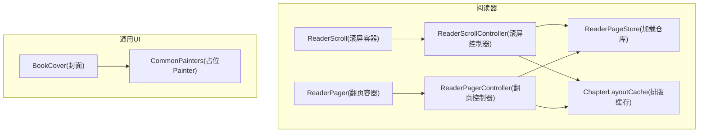
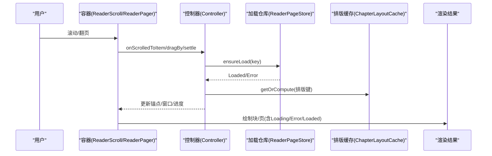
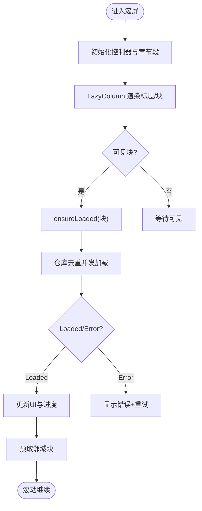
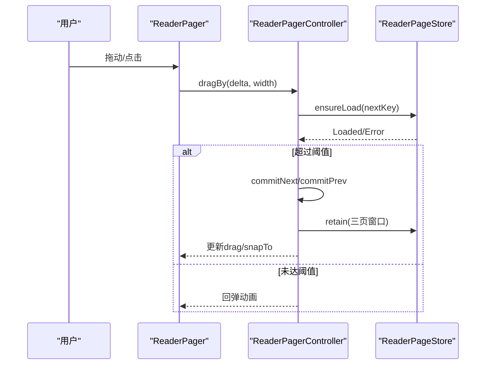
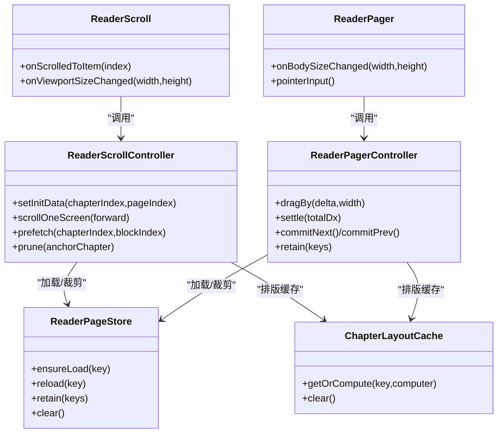

# UI渲染优化

<cite>
**本文引用的文件**
- [ReaderScroll.kt](file://module_book/src/main/java/com/ebook/book/reader/ReaderScroll.kt)
- [ReaderPager.kt](file://module_book/src/main/java/com/ebook/book/reader/ReaderPager.kt)
- [ReaderPageStore.kt](file://module_book/src/main/java/com/ebook/book/reader/ReaderPageStore.kt)
- [ChapterLayoutCache.kt](file://module_book/src/main/java/com/ebook/book/reader/ChapterLayoutCache.kt)
- [ReaderScrollController.kt](file://module_book/src/main/java/com/ebook/book/reader/ReaderScrollController.kt)
- [BookCover.kt](file://lib_book_common/src/main/java/com/ebook/common/ui/BookCover.kt)
- [CommonPainters.kt](file://lib_book_common/src/main/java/com/ebook/common/ui/CommonPainters.kt)
- [compose_compiler_config.conf](file://compose_compiler_config.conf)
</cite>

## 目录
1. [简介](#简介)
2. [项目结构](#项目结构)
3. [核心组件](#核心组件)
4. [架构总览](#架构总览)
5. [详细组件分析](#详细组件分析)
6. [依赖关系分析](#依赖关系分析)
7. [性能考量](#性能考量)
8. [故障排查指南](#故障排查指南)
9. [结论](#结论)

## 简介
本文聚焦阅读器在 Compose 下的 UI 渲染优化，覆盖翻页与滚屏两种模式的分页加载、视图复用、滚动性能；布局树优化（重组抑制、状态提升、条件渲染）；图片加载优化（占位图、缓存策略）；动画与过渡优化；内存使用优化；以及监控与分析方法。文档基于仓库中阅读器与通用 UI 模块的实现进行梳理与总结，并给出可落地的实践建议与问题定位思路。

## 项目结构
- 阅读器 UI 集中在 module_book 的 reader 包，包含滚屏容器、翻页容器、控制器与加载仓库等关键实现。
- 通用 UI 能力集中在 lib_book_common 的 ui 包，提供封面组件与占位 Painter。
- Compose 编译器稳定性配置位于根目录的配置文件。

**图表来源**
- [ReaderScroll.kt:72-233](file://module_book/src/main/java/com/ebook/book/reader/ReaderScroll.kt#L72-L233)
- [ReaderPager.kt:335-479](file://module_book/src/main/java/com/ebook/book/reader/ReaderPager.kt#L335-L479)
- [ReaderScrollController.kt:89-397](file://module_book/src/main/java/com/ebook/book/reader/ReaderScrollController.kt#L89-L397)
- [ReaderPageStore.kt:29-98](file://module_book/src/main/java/com/ebook/book/reader/ReaderPageStore.kt#L29-L98)
- [ChapterLayoutCache.kt:38-61](file://module_book/src/main/java/com/ebook/book/reader/ChapterLayoutCache.kt#L38-L61)
- [BookCover.kt:26-41](file://lib_book_common/src/main/java/com/ebook/common/ui/BookCover.kt#L26-L41)
- [CommonPainters.kt:26-38](file://lib_book_common/src/main/java/com/ebook/common/ui/CommonPainters.kt#L26-L38)

**章节来源**
- [ReaderScroll.kt:72-233](file://module_book/src/main/java/com/ebook/book/reader/ReaderScroll.kt#L72-L233)
- [ReaderPager.kt:335-479](file://module_book/src/main/java/com/ebook/book/reader/ReaderPager.kt#L335-L479)
- [ReaderScrollController.kt:89-397](file://module_book/src/main/java/com/ebook/book/reader/ReaderScrollController.kt#L89-L397)
- [ReaderPageStore.kt:29-98](file://module_book/src/main/java/com/ebook/book/reader/ReaderPageStore.kt#L29-L98)
- [ChapterLayoutCache.kt:38-61](file://module_book/src/main/java/com/ebook/book/reader/ChapterLayoutCache.kt#L38-L61)
- [BookCover.kt:26-41](file://lib_book_common/src/main/java/com/ebook/common/ui/BookCover.kt#L26-L41)
- [CommonPainters.kt:26-38](file://lib_book_common/src/main/java/com/ebook/common/ui/CommonPainters.kt#L26-L38)

## 核心组件
- ReaderScroll：基于 LazyColumn 的跨章连续滚屏容器，按“块”分页，块高由排版实测值决定，保证无缝拼接与稳定滚动位置。
- ReaderPager：三页窗口的横向翻页容器，通过控制器管理拖拽、阈值判定与窗口收敛。
- ReaderScrollController / ReaderPagerController：分别维护滚屏与翻页的几何、状态机、预取与裁剪策略。
- ReaderPageStore：统一的页面加载仓库，负责去重、重试、保留集裁剪，避免重复请求与内存泄漏。
- ChapterLayoutCache：整章排版偏移的内存缓存，同章翻页只重排一次。
- BookCover + CommonPainters：统一封面加载与占位图，减少重复组合，提供稳定的 placeholder/error 表现。

**章节来源**
- [ReaderScroll.kt:72-233](file://module_book/src/main/java/com/ebook/book/reader/ReaderScroll.kt#L72-L233)
- [ReaderPager.kt:335-479](file://module_book/src/main/java/com/ebook/book/reader/ReaderPager.kt#L335-L479)
- [ReaderScrollController.kt:89-397](file://module_book/src/main/java/com/ebook/book/reader/ReaderScrollController.kt#L89-L397)
- [ReaderPageStore.kt:29-98](file://module_book/src/main/java/com/ebook/book/reader/ReaderPageStore.kt#L29-L98)
- [ChapterLayoutCache.kt:38-61](file://module_book/src/main/java/com/ebook/book/reader/ChapterLayoutCache.kt#L38-L61)
- [BookCover.kt:26-41](file://lib_book_common/src/main/java/com/ebook/common/ui/BookCover.kt#L26-L41)
- [CommonPainters.kt:26-38](file://lib_book_common/src/main/java/com/ebook/common/ui/CommonPainters.kt#L26-L38)

## 架构总览
阅读器以“控制器 + 容器 + 仓库 + 缓存”的分层组织渲染流程：
- 容器（ReaderScroll/ReaderPager）负责组合与交互（手势、尺寸上报、占位与错误态）。
- 控制器（ReaderScrollController/ReaderPagerController）维护窗口或列表的锚点、预取、裁剪与跳转。
- 加载仓库（ReaderPageStore）集中处理并发加载、去重、重试与保留集清理。
- 排版缓存（ChapterLayoutCache）降低同章翻页的重排成本。
- 通用图片组件（BookCover）统一加载策略与占位图。

**图表来源**
- [ReaderScroll.kt:107-111](file://module_book/src/main/java/com/ebook/book/reader/ReaderScroll.kt#L107-L111)
- [ReaderPager.kt:359-437](file://module_book/src/main/java/com/ebook/book/reader/ReaderPager.kt#L359-L437)
- [ReaderScrollController.kt:243-261](file://module_book/src/main/java/com/ebook/book/reader/ReaderScrollController.kt#L243-L261)
- [ReaderPageStore.kt:47-77](file://module_book/src/main/java/com/ebook/book/reader/ReaderPageStore.kt#L47-L77)
- [ChapterLayoutCache.kt:47-53](file://module_book/src/main/java/com/ebook/book/reader/ChapterLayoutCache.kt#L47-L53)

## 详细组件分析

### 滚屏模式（LazyColumn 分页与滚动优化）
- 连续列表模型：将每章标题与正文块作为项，章界无特殊处理，仅一个标题分隔；块高来自排版实测，确保无缝拼接。
- 懒加载与预取：可见块进入组合时触发 ensureLoaded；同时控制器对锚点邻域块进行预取，平滑 fling 时的视觉体验。
- 位置上报与锚定：firstVisibleItemIndex 原样上报，由控制器换算为语义值；item 必须带稳定且全局唯一的 key，LazyColumn 据此在上方插入项时保持视觉锚点。
- 常驻位置行：页码行置于视口外底部，高度固定，保证 Loading/Error 不塌陷，与翻页模式的页码行口径一致。
- 点击分区：左右三分区滚一屏，中间唤菜单；不接管竖向拖拽，避免与 LazyColumn 手势冲突。

**图表来源**
- [ReaderScroll.kt:154-207](file://module_book/src/main/java/com/ebook/book/reader/ReaderScroll.kt#L154-L207)
- [ReaderScrollController.kt:248-261](file://module_book/src/main/java/com/ebook/book/reader/ReaderScrollController.kt#L248-L261)
- [ReaderPageStore.kt:47-77](file://module_book/src/main/java/com/ebook/book/reader/ReaderPageStore.kt#L47-L77)

**章节来源**
- [ReaderScroll.kt:72-233](file://module_book/src/main/java/com/ebook/book/reader/ReaderScroll.kt#L72-L233)
- [ReaderScrollController.kt:89-397](file://module_book/src/main/java/com/ebook/book/reader/ReaderScrollController.kt#L89-L397)
- [ReaderPageStore.kt:29-98](file://module_book/src/main/java/com/ebook/book/reader/ReaderPageStore.kt#L29-L98)

### 翻页模式（三页窗口与手势动画）
- 三页窗口：当前页、上一页、下一页按 z 序堆叠，通过 offset 应用布局期位移，动画期间零重组。
- 手势与阈值：记录拖拽增量与总位移，超过阈值提交翻页，否则回弹；程序化翻页（音量键/点击分区）与手势对齐。
- 窗口收敛：目标页非 Loaded 时，保留来路页作为相邻方向之一，避免死页；翻页提交后裁剪到三页窗口，控制内存增长。
- 尺寸测量：仅在当前页回调正文区尺寸，用于计算每页行数；页码行固定高度，避免三态间高度漂移导致溢出。

**图表来源**
- [ReaderPager.kt:359-437](file://module_book/src/main/java/com/ebook/book/reader/ReaderPager.kt#L359-L437)
- [ReaderPager.kt:110-323](file://module_book/src/main/java/com/ebook/book/reader/ReaderPager.kt#L110-L323)
- [ReaderPageStore.kt:86-97](file://module_book/src/main/java/com/ebook/book/reader/ReaderPageStore.kt#L86-L97)

**章节来源**
- [ReaderPager.kt:110-479](file://module_book/src/main/java/com/ebook/book/reader/ReaderPager.kt#L110-L479)
- [ReaderPageStore.kt:29-98](file://module_book/src/main/java/com/ebook/book/reader/ReaderPageStore.kt#L29-L98)

### 布局树优化（重组抑制、状态提升、条件渲染）
- 重组抑制：
  - 布局期位移：翻页动画通过 offset 读取 drag，仅触发重布局不重组。
  - derivedStateOf：滚屏容器用派生状态上报 firstVisibleItemIndex，减少不必要重组。
- 状态提升：
  - 控制器持有窗口/锚点状态，容器只消费状态并呈现，职责清晰，降低状态散乱导致的重组。
- 条件渲染：
  - 块/页的 Loading/Error/Loaded 三态互斥；页码行固定高度，避免空内容塌陷造成高度变化。
  - 滚屏模式下，块高由排版实测值给定，Loading/Error 也占满一屏，滚动位置不塌陷。

**章节来源**
- [ReaderPager.kt:447-479](file://module_book/src/main/java/com/ebook/book/reader/ReaderPager.kt#L447-L479)
- [ReaderScroll.kt:154-233](file://module_book/src/main/java/com/ebook/book/reader/ReaderScroll.kt#L154-L233)
- [ReaderScroll.kt:266-373](file://module_book/src/main/java/com/ebook/book/reader/ReaderScroll.kt#L266-L373)

### 图片加载优化（压缩、占位符、缓存）
- 统一封面组件：BookCover 封装 AsyncImage，固定缩放模式为 Crop，避免拉伸变形；placeholder/error 使用统一占位 Painter。
- 占位 Painter：CommonPainters 提供 NinePatch 转 Bitmap 的占位图，失败回退到语义色，避免资源解析异常。
- 缓存策略：Coil 内部自带磁盘/内存缓存；结合 App 网络层拦截器与客户端配置（不在本文展开），可减少重复下载与解码开销。

**章节来源**
- [BookCover.kt:26-41](file://lib_book_common/src/main/java/com/ebook/common/ui/BookCover.kt#L26-L41)
- [CommonPainters.kt:26-38](file://lib_book_common/src/main/java/com/ebook/common/ui/CommonPainters.kt#L26-L38)

### 动画与过渡效果优化
- 手势动画：
  - 翻页拖拽使用 Animatable，达到阈值后执行翻页动画，未达阈值回弹；动画期间锁定手势，避免并发冲突。
- 硬件加速：
  - 阅读器启用 fitsSystemWindows=false，内容铺满屏幕边缘，避免系统栏遮挡；配合 windowInsetsPadding 做避让，减少额外图层叠加。
- 布局期位移：
  - 翻页使用 offset 而非重组驱动位移，降低重组开销。

**章节来源**
- [ReaderPager.kt:359-437](file://module_book/src/main/java/com/ebook/book/reader/ReaderPager.kt#L359-L437)
- [ReaderPager.kt:505-654](file://module_book/src/main/java/com/ebook/book/reader/ReaderPager.kt#L505-L654)
- [ReaderScroll.kt:113-147](file://module_book/src/main/java/com/ebook/book/reader/ReaderScroll.kt#L113-L147)

### 内存使用优化（生命周期、释放、防泄漏）
- 加载仓库保留集：
  - 翻页模式保留三页窗口；滚屏模式按章距裁剪（锚点章±2章），避免同章内回滚丢块与跨章累积导致内存膨胀。
- 任务取消：
  - clear 取消全部在途任务并清空状态；retain 移除超出保留集的 job 与页面状态，防止孤儿任务与内存泄漏。
- 排版缓存容量：
  - ChapterLayoutCache 使用 LRU 链表，默认容量覆盖“当前章±两章”，平衡命中率与内存占用。

**章节来源**
- [ReaderPageStore.kt:79-97](file://module_book/src/main/java/com/ebook/book/reader/ReaderPageStore.kt#L79-L97)
- [ReaderScrollController.kt:350-369](file://module_book/src/main/java/com/ebook/book/reader/ReaderScrollController.kt#L350-L369)
- [ChapterLayoutCache.kt:38-61](file://module_book/src/main/java/com/ebook/book/reader/ChapterLayoutCache.kt#L38-L61)

### 响应式 UI（状态管理、数据绑定、实时更新）
- 状态驱动：
  - 控制器持有锚点、窗口、拖拽等状态；容器消费状态并渲染，变更通过 LaunchedEffect 与 derivedStateOf 联动。
- 数据绑定：
  - 块/页的 UI 状态由 ReaderPageStore 提供（Loading/Error/Loaded），容器根据 key 查询并渲染对应状态。
- 实时更新：
  - 滚动位置上报→控制器更新锚点→必要时物化相邻章与预取→仓库返回 Loaded→容器刷新，形成闭环。

**章节来源**
- [ReaderScrollController.kt:243-318](file://module_book/src/main/java/com/ebook/book/reader/ReaderScrollController.kt#L243-L318)
- [ReaderPageStore.kt:44-77](file://module_book/src/main/java/com/ebook/book/reader/ReaderPageStore.kt#L44-L77)
- [ReaderScroll.kt:107-111](file://module_book/src/main/java/com/ebook/book/reader/ReaderScroll.kt#L107-L111)

### 具体优化案例与性能提升要点
- 滚屏分块：块高取自排版实测，避免心算行数导致溢出；Loading/Error 占满一屏，滚动位置稳定。
- 预取邻域：锚点前后若干块提前加载，fling 时视觉连续，减少首帧白屏。
- 三页窗口裁剪：翻页模式严格限制保留集，避免长文阅读时内存无限增长。
- 排版缓存：同章翻页仅一次整章重排，后续翻页命中缓存，显著降低 CPU 与时间消耗。
- 图片占位：统一占位 Painter，避免资源解析异常与闪烁；Crop 缩放保证封面比例稳定。

**章节来源**
- [ReaderScroll.kt:154-207](file://module_book/src/main/java/com/ebook/book/reader/ReaderScroll.kt#L154-L207)
- [ReaderScrollController.kt:338-348](file://module_book/src/main/java/com/ebook/book/reader/ReaderScrollController.kt#L338-L348)
- [ReaderPageStore.kt:86-97](file://module_book/src/main/java/com/ebook/book/reader/ReaderPageStore.kt#L86-L97)
- [ChapterLayoutCache.kt:47-53](file://module_book/src/main/java/com/ebook/book/reader/ChapterLayoutCache.kt#L47-L53)
- [BookCover.kt:26-41](file://lib_book_common/src/main/java/com/ebook/common/ui/BookCover.kt#L26-L41)

## 依赖关系分析
- 容器依赖控制器：ReaderScroll/ReaderPager 消费控制器的状态与方法，实现解耦。
- 控制器依赖仓库：两者共用 ReaderPageStore，统一加载去重、重试与保留集策略。
- 控制器依赖排版缓存：ChapterLayoutCache 降低同章重排成本。
- 通用图片组件独立：BookCover 与 CommonPainters 被业务模块复用，不耦合阅读器逻辑。

**图表来源**
- [ReaderScroll.kt:72-233](file://module_book/src/main/java/com/ebook/book/reader/ReaderScroll.kt#L72-L233)
- [ReaderPager.kt:335-479](file://module_book/src/main/java/com/ebook/book/reader/ReaderPager.kt#L335-L479)
- [ReaderScrollController.kt:89-397](file://module_book/src/main/java/com/ebook/book/reader/ReaderScrollController.kt#L89-L397)
- [ReaderPageStore.kt:29-98](file://module_book/src/main/java/com/ebook/book/reader/ReaderPageStore.kt#L29-L98)
- [ChapterLayoutCache.kt:38-61](file://module_book/src/main/java/com/ebook/book/reader/ChapterLayoutCache.kt#L38-L61)

**章节来源**
- [ReaderScroll.kt:72-233](file://module_book/src/main/java/com/ebook/book/reader/ReaderScroll.kt#L72-L233)
- [ReaderPager.kt:335-479](file://module_book/src/main/java/com/ebook/book/reader/ReaderPager.kt#L335-L479)
- [ReaderScrollController.kt:89-397](file://module_book/src/main/java/com/ebook/book/reader/ReaderScrollController.kt#L89-L397)
- [ReaderPageStore.kt:29-98](file://module_book/src/main/java/com/ebook/book/reader/ReaderPageStore.kt#L29-L98)
- [ChapterLayoutCache.kt:38-61](file://module_book/src/main/java/com/ebook/book/reader/ChapterLayoutCache.kt#L38-L61)

## 性能考量
- 重组最小化：
  - 使用 derivedStateOf 包裹易变索引，减少无关重组。
  - 布局期位移（offset）替代重组驱动动画，避免频繁重组。
- 列表性能：
  - LazyColumn 的 key 稳定且全局唯一，保障锚点与滚动位置稳定。
  - 预取邻域块，平滑滚动体验，降低首帧白屏概率。
- 内存控制：
  - 保留集裁剪（翻页三页、滚屏按章距），避免长文阅读时内存膨胀。
  - 任务取消与状态清理，防止孤儿协程与内存泄漏。
- 图片优化：
  - 统一占位图与缩放策略，减少解码与绘制开销。
- Compose 编译器稳定性：
  - 通过配置文件声明稳定类型，减少不必要的重组（见根配置）。

**章节来源**
- [ReaderScroll.kt:107-111](file://module_book/src/main/java/com/ebook/book/reader/ReaderScroll.kt#L107-L111)
- [ReaderScroll.kt:154-207](file://module_book/src/main/java/com/ebook/book/reader/ReaderScroll.kt#L154-L207)
- [ReaderScrollController.kt:338-369](file://module_book/src/main/java/com/ebook/book/reader/ReaderScrollController.kt#L338-L369)
- [ReaderPageStore.kt:79-97](file://module_book/src/main/java/com/ebook/book/reader/ReaderPageStore.kt#L79-L97)
- [ChapterLayoutCache.kt:47-53](file://module_book/src/main/java/com/ebook/book/reader/ChapterLayoutCache.kt#L47-L53)
- [compose_compiler_config.conf:1-11](file://compose_compiler_config.conf#L1-L11)

## 故障排查指南
- 滚动位置错乱：
  - 检查 item key 是否稳定且全局唯一；确认 LazyColumn 的 key 生成逻辑仅由 (章, 块) 构成。
  - 验证首次上报顺序：先落点再上报滚动位置，避免初始进度写偏。
- 页面状态闪烁：
  - 确认 Loading/Error 块/页占满一屏，避免高度塌陷导致滚动抖动。
  - 检查保留集裁剪半径是否合理（翻页三页、滚屏按章距）。
- 图片异常：
  - 确认占位 Painter 能正确构造；若资源加载失败，应回退到语义色。
  - 核对网络客户端与拦截器配置，避免错误解码或缓存失效。
- 动画卡顿：
  - 检查是否在重组中执行昂贵操作；优先使用布局期位移与 Animatable。
  - 确认手势事件未与列表滚动冲突（滚屏模式不接管竖向拖拽）。

**章节来源**
- [ReaderScroll.kt:107-111](file://module_book/src/main/java/com/ebook/book/reader/ReaderScroll.kt#L107-L111)
- [ReaderScroll.kt:154-207](file://module_book/src/main/java/com/ebook/book/reader/ReaderScroll.kt#L154-L207)
- [ReaderScrollController.kt:197-207](file://module_book/src/main/java/com/ebook/book/reader/ReaderScrollController.kt#L197-L207)
- [ReaderPager.kt:359-437](file://module_book/src/main/java/com/ebook/book/reader/ReaderPager.kt#L359-L437)
- [CommonPainters.kt:26-38](file://lib_book_common/src/main/java/com/ebook/common/ui/CommonPainters.kt#L26-L38)

## 结论
本项目阅读器通过分层设计（容器/控制器/仓库/缓存）与多项优化策略，实现了翻页与滚屏两种模式的高效渲染：
- 滚屏模式利用 LazyColumn 的稳定 key、预取与块高分片，保障流畅滚动与位置稳定。
- 翻页模式通过三页窗口、布局期位移与阈值判定，实现低重组、低内存的翻页体验。
- 统一的加载仓库与排版缓存，兼顾去重、重试与重排成本。
- 通用图片组件提供一致的占位与缩放策略，减少重复实现与异常风险。
- Compose 编译器稳定性配置与重组抑制技巧进一步降低渲染开销。

建议在新增功能时遵循上述原则：控制器集中状态、容器专注呈现、仓库统一管理加载、缓存按需命中；同时结合测试与监控手段持续评估性能表现。