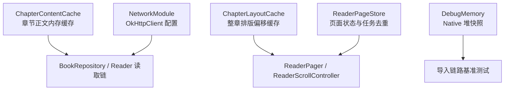
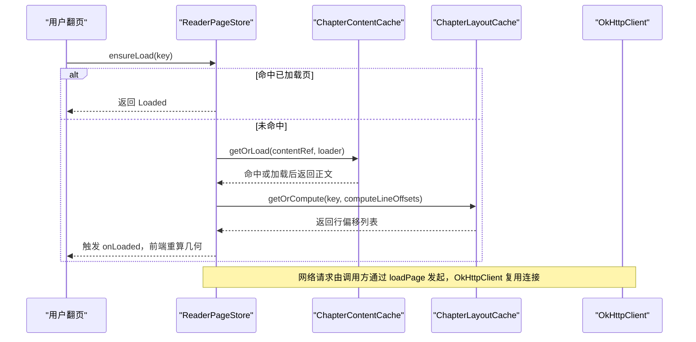
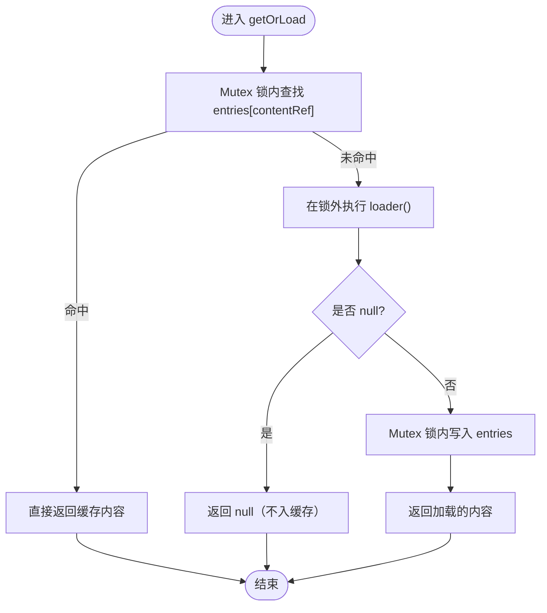
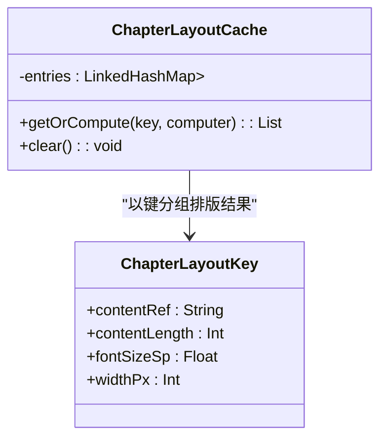
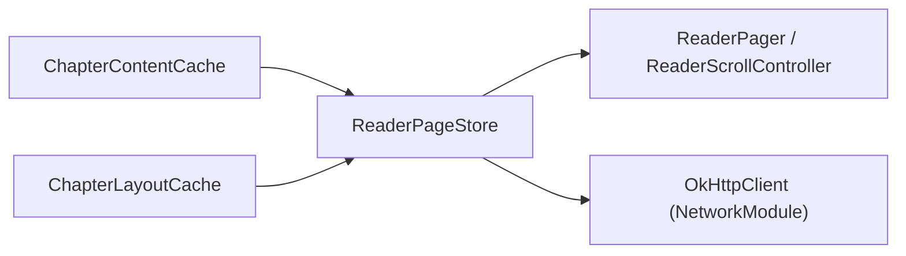

# 内存优化

<cite>
**本文引用的文件**   
- [ChapterContentCache.kt](file://lib_book_common/src/main/java/com/ebook/common/store/ChapterContentCache.kt)
- [ChapterLayoutCache.kt](file://module_book/src/main/java/com/ebook/book/reader/ChapterLayoutCache.kt)
- [ReaderPageStore.kt](file://module_book/src/main/java/com/ebook/book/reader/ReaderPageStore.kt)
- [NetworkModule.kt](file://lib_ebook_api/src/main/java/com/ebook/api/utils/NetworkModule.kt)
- [DebugMemory.kt](file://module_book/src/androidTest/java/com/ebook/book/DebugMemory.kt)
- [ChapterContentCacheTest.kt](file://lib_book_common/src/test/java/com/ebook/common/store/ChapterContentCacheTest.kt)
</cite>

## 目录
1. [简介](#简介)
2. [项目结构](#项目结构)
3. [核心组件](#核心组件)
4. [架构总览](#架构总览)
5. [详细组件分析](#详细组件分析)
6. [依赖关系分析](#依赖关系分析)
7. [性能与内存考量](#性能与内存考量)
8. [故障排查指南](#故障排查指南)
9. [结论](#结论)
10. [附录](#附录)

## 简介
本章节聚焦阅读器的内存管理策略与最佳实践，覆盖章节内容缓存、排版布局缓存、页面存储管理、对象池化与连接池配置、弱/软引用使用原则、内存泄漏预防与检测，以及内存监控与 OOM 定位方法。目标是帮助读者在保障流畅翻页与滚动体验的同时，控制内存峰值、降低 GC 压力并避免长期驻留导致的 OOM。

## 项目结构
围绕阅读器内存的关键实现分布在以下模块：
- lib_book_common：章节正文内存缓存（LRU）
- module_book：排版布局缓存、页面加载仓库（任务去重/保留集裁剪）
- lib_ebook_api：网络客户端与超时配置（连接池相关）
- 测试辅助：native 堆快照工具用于导入链路内存基线测量



**图示来源**
- [ChapterContentCache.kt:1-63](file://lib_book_common/src/main/java/com/ebook/common/store/ChapterContentCache.kt#L1-L63)
- [ChapterLayoutCache.kt:1-61](file://module_book/src/main/java/com/ebook/book/reader/ChapterLayoutCache.kt#L1-L61)
- [ReaderPageStore.kt:1-98](file://module_book/src/main/java/com/ebook/book/reader/ReaderPageStore.kt#L1-L98)
- [NetworkModule.kt:1-76](file://lib_ebook_api/src/main/java/com/ebook/api/utils/NetworkModule.kt#L1-L76)
- [DebugMemory.kt:1-16](file://module_book/src/androidTest/java/com/ebook/book/DebugMemory.kt#L1-L16)

**节内来源**
- [ChapterContentCache.kt:1-63](file://lib_book_common/src/main/java/com/ebook/common/store/ChapterContentCache.kt#L1-L63)
- [ChapterLayoutCache.kt:1-61](file://module_book/src/main/java/com/ebook/book/reader/ChapterLayoutCache.kt#L1-L61)
- [ReaderPageStore.kt:1-98](file://module_book/src/main/java/com/ebook/book/reader/ReaderPageStore.kt#L1-L98)
- [NetworkModule.kt:1-76](file://lib_ebook_api/src/main/java/com/ebook/api/utils/NetworkModule.kt#L1-L76)
- [DebugMemory.kt:1-16](file://module_book/src/androidTest/java/com/ebook/book/DebugMemory.kt#L1-L16)

## 核心组件
- 章节内容缓存 ChapterContentCache：基于 LinkedHashMap 的 LRU 内存缓存，容量默认 3（当前章 + 前后各一章），按 content_ref 作为键，支持按书失效与清空；并发通过协程 Mutex 保护。
- 排版布局缓存 ChapterLayoutCache：以 ChapterLayoutKey（contentRef、contentLength、fontSizeSp、widthPx）为键缓存“整章行偏移”，避免同章多次重排；并发通过 Collections.synchronizedMap 包装的 LinkedHashMap 保护。
- 页面存储 ReaderPageStore：统一管理 ReaderPageKey → ReaderPageUi 的状态，负责任务去重、错误重试、clear 取消全部在途任务、retain 按几何半径裁剪保留集，防止内存累积。
- 网络客户端 NetworkModule：提供多 OkHttpClient 实例（源站、发布检查），统一超时与拦截器，连接复用由 OkHttp 内部池化承担。
- 调试工具 DebugMemory：native 堆快照，便于评估导入等链路的内存增量。

**节内来源**
- [ChapterContentCache.kt:1-63](file://lib_book_common/src/main/java/com/ebook/common/store/ChapterContentCache.kt#L1-L63)
- [ChapterLayoutCache.kt:1-61](file://module_book/src/main/java/com/ebook/book/reader/ChapterLayoutCache.kt#L1-L61)
- [ReaderPageStore.kt:1-98](file://module_book/src/main/java/com/ebook/book/reader/ReaderPageStore.kt#L1-L98)
- [NetworkModule.kt:1-76](file://lib_ebook_api/src/main/java/com/ebook/api/utils/NetworkModule.kt#L1-L76)
- [DebugMemory.kt:1-16](file://module_book/src/androidTest/java/com/ebook/book/DebugMemory.kt#L1-L16)

## 架构总览
阅读器的内存管理采用分层缓存 + 状态仓库的模式：
- 数据层：章节正文经 ChapterContentCache 以 LRU 方式驻留内存，减少重复 I/O 与解码。
- 渲染层：排版结果经 ChapterLayoutCache 缓存整章偏移，降低 O(章长) 的重排开销。
- 视图层：ReaderPageStore 集中维护页级 UI 状态与在途任务，保证翻页/滚屏两端的一致性并主动释放不再需要的状态。
- 网络层：OkHttpClient 共享连接池，短超时快速失败，避免资源长时间占用。



**图示来源**
- [ReaderPageStore.kt:47-71](file://module_book/src/main/java/com/ebook/book/reader/ReaderPageStore.kt#L47-L71)
- [ChapterContentCache.kt:41-46](file://lib_book_common/src/main/java/com/ebook/common/store/ChapterContentCache.kt#L41-L46)
- [ChapterLayoutCache.kt:47-53](file://module_book/src/main/java/com/ebook/book/reader/ChapterLayoutCache.kt#L47-L53)
- [NetworkModule.kt:48-71](file://lib_ebook_api/src/main/java/com/ebook/api/utils/NetworkModule.kt#L48-L71)

## 详细组件分析

### 章节内容缓存 ChapterContentCache（LRU 容量控制与失效）
- 缓存键：content_ref（持久定位符，包含书目录名片段），按 bookId 派生的 marker 进行按书失效。
- LRU 策略：LinkedHashMap accessOrder=true，重写 removeEldestEntry 在超出 capacity 时逐出最久未使用的项；默认容量 3，覆盖当前章与相邻两章。
- 并发安全：getOrLoad 与失效操作通过协程 Mutex 串行访问 entries，避免并发写导致结构损坏。
- 失效机制：
  - invalidateBook：按 marker 过滤并移除该书的条目，应对删书/合并来源/重抓等场景。
  - clear：清空全部缓存。
- 设计要点：loader 在锁外执行，避免读盘阻塞其他章；null 不缓存，利于注册表补齐后自然恢复。



**图示来源**
- [ChapterContentCache.kt:41-46](file://lib_book_common/src/main/java/com/ebook/common/store/ChapterContentCache.kt#L41-L46)
- [ChapterContentCache.kt:48-57](file://lib_book_common/src/main/java/com/ebook/common/store/ChapterContentCache.kt#L48-L57)

**节内来源**
- [ChapterContentCache.kt:1-63](file://lib_book_common/src/main/java/com/ebook/common/store/ChapterContentCache.kt#L1-L63)
- [ChapterContentCacheTest.kt:18-65](file://lib_book_common/src/test/java/com/ebook/common/store/ChapterContentCacheTest.kt#L18-L65)

### 排版布局缓存 ChapterLayoutCache（键设计与并发安全）
- 缓存键：ChapterLayoutKey = (contentRef, contentLength, fontSizeSp, widthPx)。contentLength 用于“强制刷新缓存”后的失效判断（长度不等即重排）。
- 作用：缓存整章行偏移，避免同章翻页多次 O(章长) 重排。
- 并发安全：底层 LinkedHashMap 通过 Collections.synchronizedMap 包装；getOrCompute 在 synchronizedMap 的锁内完成 check-then-act，防止并发预加载同时 miss 导致重复计算。
- 容量：默认 5，覆盖“当前章 + 前后各两章”的两屏余量。



**图示来源**
- [ChapterLayoutCache.kt:18-23](file://module_book/src/main/java/com/ebook/book/reader/ChapterLayoutCache.kt#L18-L23)
- [ChapterLayoutCache.kt:38-61](file://module_book/src/main/java/com/ebook/book/reader/ChapterLayoutCache.kt#L38-L61)

**节内来源**
- [ChapterLayoutCache.kt:1-61](file://module_book/src/main/java/com/ebook/book/reader/ChapterLayoutCache.kt#L1-L61)

### 页面存储管理 ReaderPageStore（任务去重、状态清理、保留集裁剪）
- 职责：维护 ReaderPageKey → ReaderPageUi 的状态图（Loading/Loaded/Error），封装加载流程与回调。
- 任务去重：ensureLoad 先检查 jobs 中是否存在同 key 的在途任务；若 pages 已有 Loaded，则短路避免重复加载。
- 状态清理：clear 取消全部在途 Job 并清空 pages/jobs；reload 仅对 Error 态重试。
- 保留集裁剪：retain(keep) 将不在 keep 中的键从 pages 移除，并取消对应 jobs，防止内存累积；翻页模式保留三页窗口，滚屏模式按锚点章 ±2 章半径裁剪。
- 并发与生命周期：使用 CoroutineScope.launch 异步加载；完成后校验 myJob 仍活跃且仍为该 key 的登记任务才注销 job，避免误删后继任务。

```mermaid
sequenceDiagram
    participant UI as "阅读器前端"
    participant Store as "ReaderPageStore"
    participant Load as "loadPage(...)"
    UI->>Store: ensureLoad(key)
    alt 已在 jobs 中
        Store-->>UI: 忽略重复任务
    else 已 Loaded
        Store-->>UI: 直接返回 Loaded
    else 新任务
        Store->>Store: pages[key]=Loading; jobs[key]=launch
        Store->>Load: 异步加载
        Load-->>Store: 返回 Loaded?
        Store->>Store: 若成功则 pages[key]=Loaded; onLoaded
        Store->>Store: 若失败则 pages[key]=Error
        Store-->>UI: 回调通知重算几何
    end
```

**图示来源**
- [ReaderPageStore.kt:47-97](file://module_book/src/main/java/com/ebook/book/reader/ReaderPageStore.kt#L47-L97)

**节内来源**
- [ReaderPageStore.kt:1-98](file://module_book/src/main/java/com/ebook/book/reader/ReaderPageStore.kt#L1-L98)

### 对象池化与连接池配置
- 连接池：OkHttpClient 作为单例提供，内部自带连接池与请求复用；本项目通过 NetworkModule 分别提供“书源”和“发布检查”两个客户端，设置合理的 connect/read/write 超时（如 10s），避免资源长期占用。
- 对象池化：代码库未引入通用对象池框架；大对象复用建议遵循现有缓存策略（内容缓存、排版缓存）与页面状态裁剪（retain/clear），以降低分配频率与峰值内存。
- 沙箱与原生堆：脚本沙箱与 QuickJS 运行在隔离进程；导入链路内存增量主要落在 native 堆（SQLite/BundledSQLiteDriver），可用 DebugMemory 进行前后对比。

**节内来源**
- [NetworkModule.kt:48-71](file://lib_ebook_api/src/main/java/com/ebook/api/utils/NetworkModule.kt#L48-L71)
- [DebugMemory.kt:12-16](file://module_book/src/androidTest/java/com/ebook/book/DebugMemory.kt#L12-L16)

### 弱引用与软引用的使用建议
- 在本项目中未发现显式使用 WeakReference/SoftReference 的内存管理实现。对于易随页面销毁的对象，优先通过 ReaderPageStore.clear/retain 与缓存生命周期（ChapterContentCache.invalidateBook/clear、ChapterLayoutCache.clear）进行显式管理。
- 避免在静态/全局持有 Activity/Context 引用；必要时使用 Application Context 或依赖注入容器管理的单例。
- 针对第三方库的回调或监听器，确保在合适时机（如页面销毁、服务停止）解除绑定，防止隐式强引用导致泄漏。

**节内来源**
- [ReaderPageStore.kt:79-97](file://module_book/src/main/java/com/ebook/book/reader/ReaderPageStore.kt#L79-L97)
- [ChapterContentCache.kt:48-57](file://lib_book_common/src/main/java/com/ebook/common/store/ChapterContentCache.kt#L48-L57)
- [ChapterLayoutCache.kt:55-55](file://module_book/src/main/java/com/ebook/book/reader/ChapterLayoutCache.kt#L55-L55)

### 内存泄漏检测与预防
- 预防：
  - 所有跨页调用的缓存均为页面级或受控单例，失效入口清晰（invalidateBook/clear/retain）。
  - 任务去重与 cancel 保证在跳转/换页时及时释放在途任务。
  - 网络客户端统一超时与拦截器，避免长时间持连。
- 检测：
  - 使用 Android Profiler 观察 Java Heap 与 Native Heap 变化趋势，重点关注导入、解析、批量翻页等路径。
  - 结合单元测试与基线测试（如 ImportBaselineTest）使用 DebugMemory 记录 native 堆快照差值，评估改动影响。
  - 借助 LeakCanary（如需）验证页面退出后无残留引用；关注 ViewModel、Activity、Fragment、Service 的生命周期绑定。

**节内来源**
- [DebugMemory.kt:12-16](file://module_book/src/androidTest/java/com/ebook/book/DebugMemory.kt#L12-L16)
- [ReaderPageStore.kt:79-97](file://module_book/src/main/java/com/ebook/book/reader/ReaderPageStore.kt#L79-L97)

## 依赖关系分析
- 章节内容与排版缓存解耦：ChapterContentCache 负责正文，ChapterLayoutCache 负责排版偏移，二者通过 ReaderPageStore 协调。
- 页面状态与渲染控制器解耦：ReaderPageStore 只关心“哪一页是什么状态”，具体几何由 ReaderPager/ReaderScrollController 决定，并在需要时调用 retain/clear。
- 网络与业务解耦：NetworkModule 提供 OkHttpClient，业务侧通过 Repository/Reader 发起请求，连接复用由 OkHttp 内部实现。



**图示来源**
- [ChapterContentCache.kt:41-57](file://lib_book_common/src/main/java/com/ebook/common/store/ChapterContentCache.kt#L41-L57)
- [ChapterLayoutCache.kt:47-55](file://module_book/src/main/java/com/ebook/book/reader/ChapterLayoutCache.kt#L47-L55)
- [ReaderPageStore.kt:47-97](file://module_book/src/main/java/com/ebook/book/reader/ReaderPageStore.kt#L47-L97)
- [NetworkModule.kt:48-71](file://lib_ebook_api/src/main/java/com/ebook/api/utils/NetworkModule.kt#L48-L71)

**节内来源**
- [ChapterContentCache.kt:41-57](file://lib_book_common/src/main/java/com/ebook/common/store/ChapterContentCache.kt#L41-L57)
- [ChapterLayoutCache.kt:47-55](file://module_book/src/main/java/com/ebook/book/reader/ChapterLayoutCache.kt#L47-L55)
- [ReaderPageStore.kt:47-97](file://module_book/src/main/java/com/ebook/book/reader/ReaderPageStore.kt#L47-L97)
- [NetworkModule.kt:48-71](file://lib_ebook_api/src/main/java/com/ebook/api/utils/NetworkModule.kt#L48-L71)

## 性能与内存考量
- LRU 容量选择：
  - 章节内容缓存默认 3：平衡命中率与内存占用，适合“当前章+前后各一章”的预读场景。
  - 排版布局缓存默认 5：覆盖两屏余量，减少频繁重排。
- 并发与锁粒度：
  - ChapterContentCache 使用协程 Mutex，尽量将 loader 放在锁外执行，减少阻塞。
  - ChapterLayoutCache 使用 synchronizedMap 的内置锁，在 getOrPut 期间保持原子性。
- 任务去重与及时释放：
  - ReaderPageStore 在跳转/换页时 clear 取消全部在途任务并清空状态，避免冗余计算与内存堆积。
  - retain 按几何半径裁剪，保证不同翻页模式下都不会无限增长。
- 网络资源：
  - OkHttpClient 短超时配置，避免慢响应占用连接；通过拦截器统一编码处理，减少异常分支。

**节内来源**
- [ChapterContentCache.kt:25-63](file://lib_book_common/src/main/java/com/ebook/common/store/ChapterContentCache.kt#L25-L63)
- [ChapterLayoutCache.kt:38-61](file://module_book/src/main/java/com/ebook/book/reader/ChapterLayoutCache.kt#L38-L61)
- [ReaderPageStore.kt:47-97](file://module_book/src/main/java/com/ebook/book/reader/ReaderPageStore.kt#L47-L97)
- [NetworkModule.kt:48-71](file://lib_ebook_api/src/main/java/com/ebook/api/utils/NetworkModule.kt#L48-L71)

## 故障排查指南
- 症状：翻页卡顿或 CPU 飙升
  - 检查 ChapterLayoutCache 是否被有效命中（同一章多次翻页应只重排一次）。
  - 确认 ChapterContentCache 是否因失效策略不当导致重复加载。
- 症状：内存持续增长
  - 检查 ReaderPageStore.retain 是否被正确调用，确保按几何半径裁剪。
  - 确认 clear/reload 逻辑未被绕过，避免在跳转时遗留任务与状态。
- 症状：OOM 或 native 堆暴涨
  - 使用 DebugMemory 在导入/解析前后取 native 堆快照，定位增量热点。
  - 检查网络请求超时与失败重试是否合理，避免大量并发或重试风暴。
- 症状：重刷后内容错位
  - 核对 ChapterLayoutKey 的 contentLength 是否更新；长度不等应触发重排。
  - 核对 ChapterContentCache 的 invalidateBook 是否正确按书失效。

**节内来源**
- [ChapterLayoutCache.kt:6-16](file://module_book/src/main/java/com/ebook/book/reader/ChapterLayoutCache.kt#L6-L16)
- [ChapterContentCache.kt:15-23](file://lib_book_common/src/main/java/com/ebook/common/store/ChapterContentCache.kt#L15-L23)
- [ReaderPageStore.kt:86-97](file://module_book/src/main/java/com/ebook/book/reader/ReaderPageStore.kt#L86-L97)
- [DebugMemory.kt:12-16](file://module_book/src/androidTest/java/com/ebook/book/DebugMemory.kt#L12-L16)

## 结论
本项目通过三层内存管理机制（内容缓存、排版缓存、页面状态仓库）与合理的并发控制，实现了高效且可控的阅读体验。配合短超时的网络连接与严格的保留集裁剪，能够在复杂翻页/滚动场景下维持稳定的内存占用与性能表现。建议在后续迭代中持续使用 Profiler 与基线测试跟踪内存变化，确保新增功能不会引入新的内存风险。

## 附录
- 参考实现路径：
  - 章节内容缓存：[ChapterContentCache.kt](file://lib_book_common/src/main/java/com/ebook/common/store/ChapterContentCache.kt)
  - 排版布局缓存：[ChapterLayoutCache.kt](file://module_book/src/main/java/com/ebook/book/reader/ChapterLayoutCache.kt)
  - 页面存储管理：[ReaderPageStore.kt](file://module_book/src/main/java/com/ebook/book/reader/ReaderPageStore.kt)
  - 网络客户端配置：[NetworkModule.kt](file://lib_ebook_api/src/main/java/com/ebook/api/utils/NetworkModule.kt)
  - 内存基线工具：[DebugMemory.kt](file://module_book/src/androidTest/java/com/ebook/book/DebugMemory.kt)
- 行为验证用例：
  - 章节内容缓存单测：[ChapterContentCacheTest.kt](file://lib_book_common/src/test/java/com/ebook/common/store/ChapterContentCacheTest.kt)