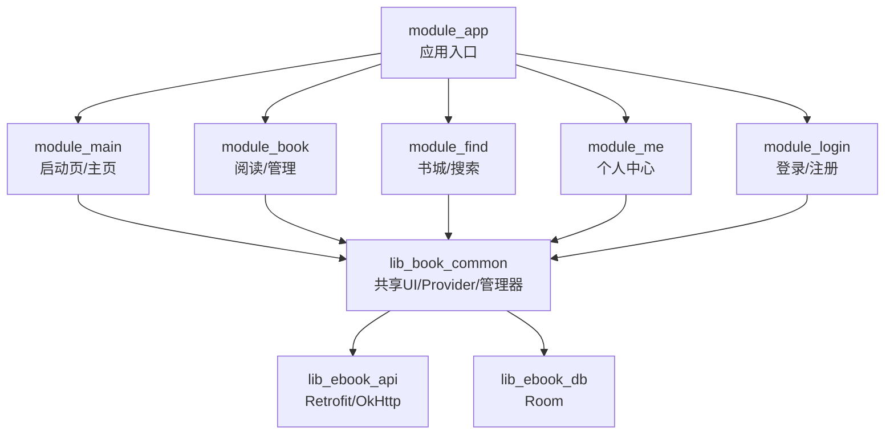
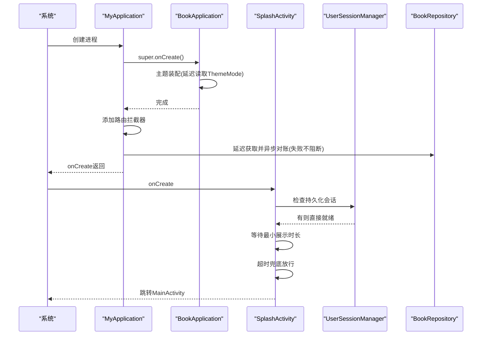
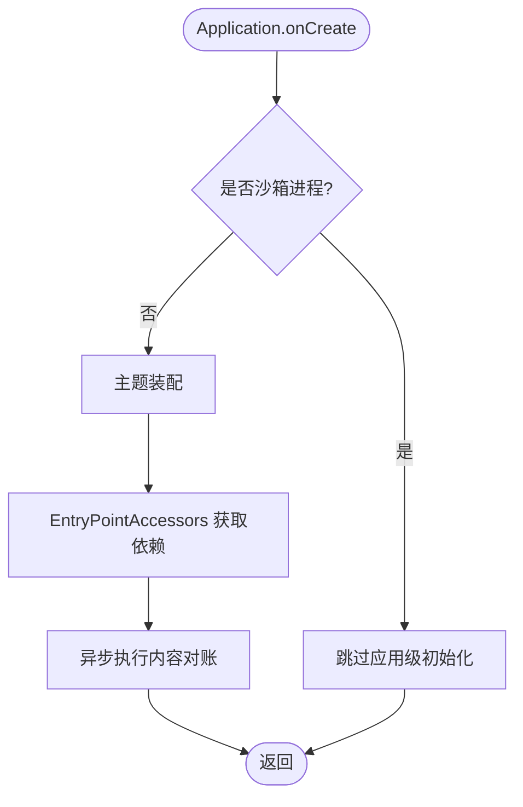
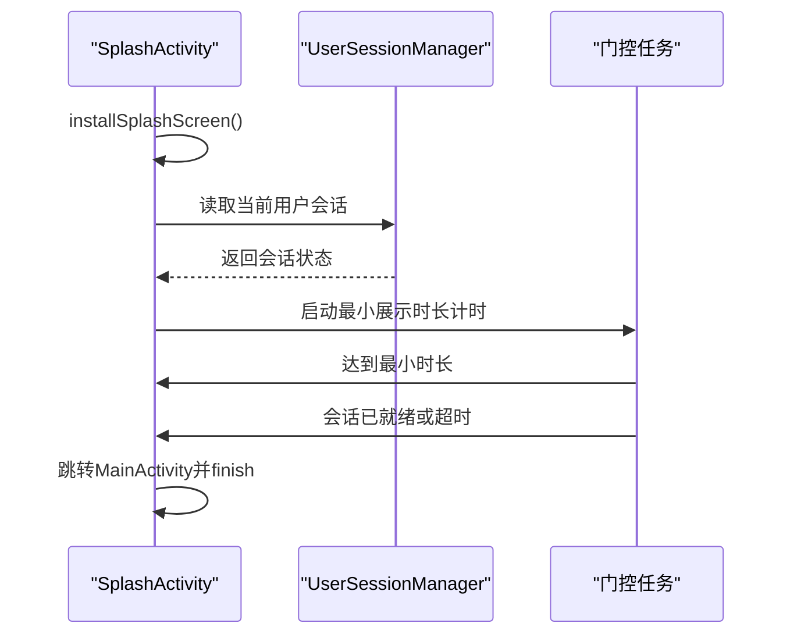
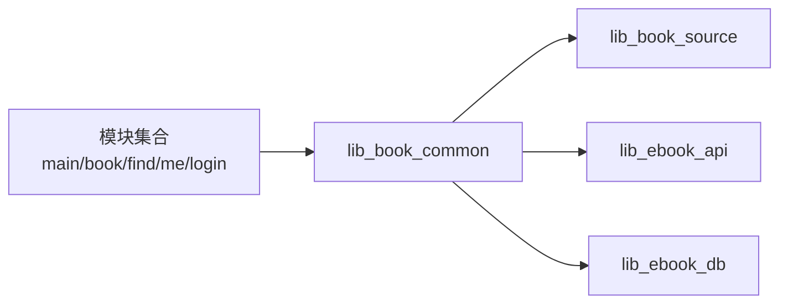

# 启动速度优化

<cite>
**本文引用的文件**   
- [README.MD](file://README.MD)
- [MyApplication.kt](file://module_app/src/main/java/com/ebook/MyApplication.kt)
- [BookApplication.kt](file://lib_book_common/src/main/java/com/ebook/common/BookApplication.kt)
- [SplashActivity.kt](file://module_main/src/main/java/com/ebook/main/SplashActivity.kt)
- [HiltConventionPlugin.kt](file://build-logic/convention/src/main/kotlin/HiltConventionPlugin.kt)
- [AndroidComponentConventionPlugin.kt](file://build-logic/convention/src/main/kotlin/AndroidComponentConventionPlugin.kt)
- [KotlinAndroid.kt](file://build-logic/convention/src/main/kotlin/KotlinAndroid.kt)
- [libs.versions.toml](file://gradle/libs.versions.toml)
- [gradle.properties](file://gradle.properties)
- [settings.gradle.kts](file://settings.gradle.kts)
- [module_app/build.gradle.kts](file://module_app/build.gradle.kts)
- [module_app/proguard-rules.pro](file://module_app/proguard-rules.pro)
- [module_app/consumer-rules.pro](file://module_app/consumer-rules.pro)
- [module_book/consumer-rules.pro](file://module_book/consumer-rules.pro)
- [module_find/consumer-rules.pro](file://module_find/consumer-rules.pro)
- [module_me/consumer-rules.pro](file://module_me/consumer-rules.pro)
- [module_login/consumer-rules.pro](file://module_login/consumer-rules.pro)
- [AGENTS.md](file://AGENTS.md)
- [0002-agp-built-in-kotlin.md](file://docs/adr/0002-agp-built-in-kotlin.md)
</cite>

## 目录
1. [引言](#引言)
2. [项目结构](#项目结构)
3. [核心组件](#核心组件)
4. [架构总览](#架构总览)
5. [详细组件分析](#详细组件分析)
6. [依赖关系分析](#依赖关系分析)
7. [性能考量](#性能考量)
8. [故障排查指南](#故障排查指南)
9. [结论](#结论)
10. [附录](#附录)

## 引言
本文件面向冷启动与热启动的端到端加速，覆盖应用初始化流程、预加载机制、构建配置优化、依赖注入策略、资源加载优化以及启动监控与分析方法。内容严格基于仓库现有实现与文档，给出可落地的实践路径与定位瓶颈的方法论，并附带具体代码位置引用以便复现与验证。

## 项目结构
本项目采用多模块 MVVM 架构，应用入口在 module_app，主界面与启动页在 module_main，功能模块（book/find/me/login）通过 TheRouter + Provider 接入；通用能力下沉到 lib_book_common，网络与数据分别位于 lib_ebook_api 与 lib_ebook_db；构建配置集中在 build-logic 约定插件与 Gradle 版本目录。

图表来源
- [README.MD:86-104](file://README.MD#L86-L104)

章节来源
- [README.MD:86-104](file://README.MD#L86-L104)

## 核心组件
- 应用进程与主题装配：BookApplication 负责主题装配与沙箱进程门控；MyApplication 扩展应用行为，使用 EntryPointAccessors 延迟获取 BookRepository 做内容对账，避免 Application 字段注入导致沙箱进程崩溃。
- 启动页：SplashActivity 承担最小展示时长与会话预载，超时兜底放行，确保主页首帧就绪。
- 构建与混淆：AGP 内置 Kotlin、KSP、R8 混淆规则集中管理；功能模块独立态开启混淆以尽早暴露缺口。
- 依赖注入：Hilt 通过约定插件统一装配；业务层通过 @HiltViewModel + @Inject 按需注入，Application 禁止 eager 字段注入。
- 预加载：自动登录恢复会话，弱网/无网不阻塞启动；内容仓库对账在后台协程执行，失败不影响启动。

章节来源
- [MyApplication.kt:19-66](file://module_app/src/main/java/com/ebook/MyApplication.kt#L19-L66)
- [BookApplication.kt:17-63](file://lib_book_common/src/main/java/com/ebook/common/BookApplication.kt#L17-L63)
- [SplashActivity.kt:69-170](file://module_main/src/main/java/com/ebook/main/SplashActivity.kt#L69-L170)

## 架构总览
冷启动关键路径：进程启动 → Application.onCreate（主题装配、沙箱进程门控）→ SplashActivity.onCreate（安装闪屏、会话预载、最小展示时长）→ MainActivity（路由与首屏）。关键优化点在于“尽量把耗时工作后移或并行”，同时保证用户感知流畅。

图表来源
- [MyApplication.kt:24-43](file://module_app/src/main/java/com/ebook/MyApplication.kt#L24-L43)
- [BookApplication.kt:18-49](file://lib_book_common/src/main/java/com/ebook/common/BookApplication.kt#L18-L49)
- [SplashActivity.kt:83-107](file://module_main/src/main/java/com/ebook/main/SplashActivity.kt#L83-L107)

## 详细组件分析

### 应用初始化与延迟加载
- 主题装配：BookApplication 在 onCreate 中通过 AppTheme.install 将主题模式与 Compose 主题绑定，深色模式依据 ThemeModeManager 状态动态决定。该过程在 Application 生命周期早期完成，但不阻塞后续逻辑。
- 沙箱进程门控：隔离进程内跳过应用级初始化，避免不必要的 IO 和权限访问。
- 延迟依赖注入：MyApplication 不使用 eager @Inject 字段，而是通过 EntryPointAccessors 在需要时取 BookRepository，仅在非隔离进程且 super.onCreate() 之后进行，从而避免 :js 沙箱进程崩溃。
- 后台任务：内容仓库对账在独立协程中运行，失败仅记录日志，确保启动不受影响。

图表来源
- [BookApplication.kt:18-49](file://lib_book_common/src/main/java/com/ebook/common/BookApplication.kt#L18-L49)
- [MyApplication.kt:24-43](file://module_app/src/main/java/com/ebook/MyApplication.kt#L24-L43)

章节来源
- [BookApplication.kt:18-49](file://lib_book_common/src/main/java/com/ebook/common/BookApplication.kt#L18-L49)
- [MyApplication.kt:24-43](file://module_app/src/main/java/com/ebook/MyApplication.kt#L24-L43)

### 启动页与会话预载
- 最小展示时长：SplashActivity 强制至少显示指定时长，提升视觉连贯性。
- 会话预载：优先检查本地持久化会话，存在即认为就绪，不再发起网络请求；不存在则立即视为就绪，不阻塞启动。
- 超时兜底：设置自动登录超时，防止弱网/无网无限阻塞；支持“跳过”按钮旁路进入主页。
- 防重复跳转：通过 savedState 标志与 finish 控制，避免旋转重建导致的二次跳转。

图表来源
- [SplashActivity.kt:83-107](file://module_main/src/main/java/com/ebook/main/SplashActivity.kt#L83-L107)
- [SplashActivity.kt:122-137](file://module_main/src/main/java/com/ebook/main/SplashActivity.kt#L122-L137)

章节来源
- [SplashActivity.kt:69-170](file://module_main/src/main/java/com/ebook/main/SplashActivity.kt#L69-L170)

### 构建配置优化
- AGP 内置 Kotlin：遵循仓库约定，Android 模块不再单独应用 KGP，由 AGP 提供 Kotlin 支持；顶层 kotlin {} 块仍可用。
- 编译时优化：启用 KSP 替代 KAPT，减少注解处理开销；按约定插件统一配置各模块编译选项。
- R8 混淆与消费者规则：module_app release 恒开混淆；功能模块独立态开启混淆以尽早暴露缺口；consumer-rules.pro 作为唯一规则源随 AAR 传播；proguard-rules.pro 仅包含 include 避免重复。
- 版本目录与工具链：依赖版本集中管理于 libs.versions.toml；JDK 17 目标字节码；Gradle 守护进程 JVM 自动拉取。

章节来源
- [0002-agp-built-in-kotlin.md](file://docs/adr/0002-agp-built-in-kotlin.md)
- [libs.versions.toml](file://gradle/libs.versions.toml)
- [gradle.properties](file://gradle.properties)
- [module_app/proguard-rules.pro](file://module_app/proguard-rules.pro)
- [module_app/consumer-rules.pro](file://module_app/consumer-rules.pro)
- [module_book/consumer-rules.pro](file://module_book/consumer-rules.pro)
- [module_find/consumer-rules.pro](file://module_find/consumer-rules.pro)
- [module_me/consumer-rules.pro](file://module_me/consumer-rules.pro)
- [module_login/consumer-rules.pro](file://module_login/consumer-rules.pro)

### 依赖注入优化策略
- 按需注入：业务层通过 @HiltViewModel + @Inject 按需获取依赖，避免全局 eager 初始化。
- 延迟解析：Application 上禁用 eager @Inject 字段，改用 EntryPointAccessors 在真正使用时取单例，避免隔离进程提前实例化导致崩溃。
- 循环依赖处理：通过分层解耦与 Provider 接口，跨模块不直接依赖，降低循环风险；依赖方向遵循 README 中的层级约束。

章节来源
- [MyApplication.kt:46-61](file://module_app/src/main/java/com/ebook/MyApplication.kt#L46-L61)
- [AGENTS.md](file://AGENTS.md)
- [README.MD:86-104](file://README.MD#L86-L104)

### 资源加载优化
- 图片加载：统一使用 Coil，避免引入 Glide；Compose 中通过 painterResource 与 Image 组合，减少额外开销。
- 资源分包：按模块组织 res 与 assets，减少主包体积；第三方库自带 consumer 规则，无需重复维护。
- 动态加载：书源规则与脚本引擎按需加载，解析器惰性到首次求值才运行，避免启动期重计算。

章节来源
- [SplashActivity.kt:199-205](file://module_main/src/main/java/com/ebook/main/SplashActivity.kt#L199-L205)
- [AGENTS.md](file://AGENTS.md)

### 启动时间测量与基准测试
- 测量方法：
  - 使用 Android Studio Profiler 的 Cold Start 指标观察 Application.onCreate 到首帧渲染的时间线。
  - 通过 adb shell am start -W 统计 launch time，结合 logcat 过滤关键字（如“会话预载完成”“内容仓库对账失败”）定位耗时点。
  - 在 SplashActivity 的门控任务前后埋点，记录最小展示时长与会话预载耗时。
- 瓶颈识别：
  - 若 Application.onCreate 过长，重点审查主题装配与异步任务触发时机。
  - 若 SplashActivity 卡顿，检查会话预载是否误发起网络请求或阻塞主线程。
  - 若构建产物过大，核查混淆与资源分包是否生效。
- 基准测试：
  - 建立基线版本与优化版本对比，采集多次启动平均时间，关注 P95/P99 指标。
  - 在不同设备档位（低端机/旗舰机）和网络条件（弱网/无网）下复测，确保优化鲁棒性。

[本节为方法论说明，不直接分析具体代码文件]

## 依赖关系分析
依赖方向严格遵循 README 描述：业务模块 → lib_book_common → lib_book_source → lib_ebook_api / lib_ebook_db。这种分层减少了冷启动时的类加载与初始化压力，并通过约定插件统一构建行为。

图表来源
- [README.MD:86-104](file://README.MD#L86-L104)

章节来源
- [README.MD:86-104](file://README.MD#L86-L104)

## 性能考量
- 冷启动优化要点：
  - 将非必要初始化推迟到首帧之后或使用协程异步执行。
  - 会话预载优先走本地持久化，避免启动期网络请求。
  - 使用最小展示时长保证视觉连贯，同时设置超时兜底。
- 热启动优化要点：
  - 复用已创建的组件与单例，避免重复初始化。
  - 利用 Compose 重组机制，减少不必要重建。
- 构建期优化：
  - 启用 R8 混淆与资源压缩，减少 APK 体积。
  - 使用 KSP 替代 KAPT，缩短编译时间。
- 资源优化：
  - 图片使用 Coil，按需加载与缓存。
  - 按模块拆分资源，减少主包膨胀。

[本节为通用指导，不直接分析具体代码文件]

## 故障排查指南
- 启动卡死：检查 SplashActivity 的超时设置是否合理，确认未在主线程执行阻塞操作。
- 主题异常：确认 BookApplication 的主题装配是否被误跳过，检查沙箱进程门控逻辑。
- 会话未恢复：查看 UserSessionManager 的持久化逻辑，确认 TokenHolder 是否正确恢复。
- 构建问题：核对 consumer-rules.pro 是否遗漏必要规则，确认混淆是否影响反射面。
- 沙箱进程崩溃：确保 Application 无 eager @Inject 字段，依赖通过 EntryPointAccessors 延迟获取。

章节来源
- [MyApplication.kt:46-61](file://module_app/src/main/java/com/ebook/MyApplication.kt#L46-L61)
- [BookApplication.kt:18-49](file://lib_book_common/src/main/java/com/ebook/common/BookApplication.kt#L18-L49)
- [SplashActivity.kt:122-137](file://module_main/src/main/java/com/ebook/main/SplashActivity.kt#L122-L137)

## 结论
本项目通过延迟依赖注入、会话预载、最小展示时长、超时兜底、构建期混淆与资源分包等手段，有效提升了冷启动与热启动性能。建议持续监控启动指标，结合 Profiler 与日志定位瓶颈，并在不同设备与网络条件下验证优化效果。对于新增功能，应遵循“启动期只做必要初始化，其余延后或异步”的原则，保持启动链路简洁高效。

## 附录
- 相关 ADR 与文档：AGENTS.md 提供了详细的构建约定、混淆规则、MVVM 架构与依赖注入规范，可作为实施参考。
- 版本与工具链：libs.versions.toml 统一管理依赖版本，确保构建一致性。

章节来源
- [AGENTS.md](file://AGENTS.md)
- [libs.versions.toml](file://gradle/libs.versions.toml)