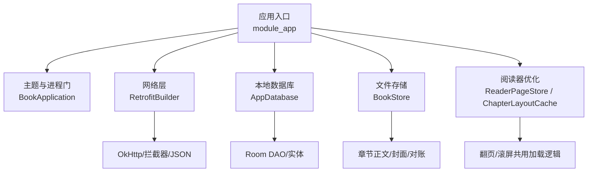
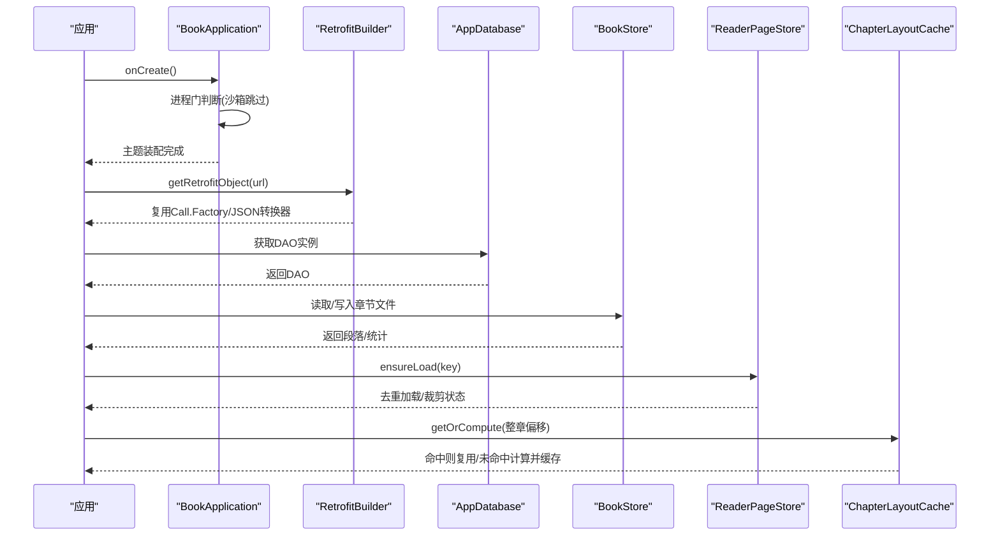
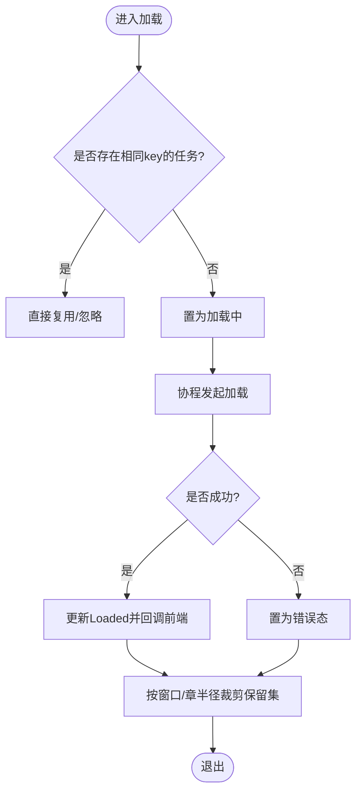
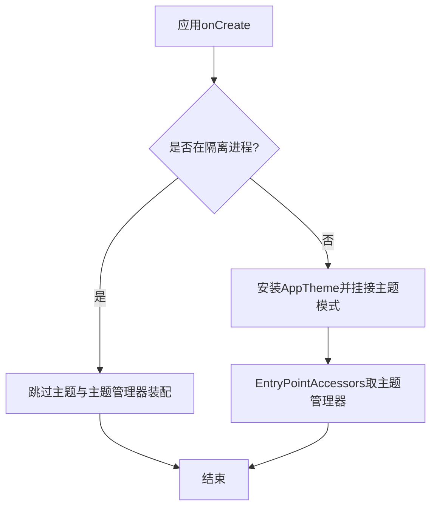
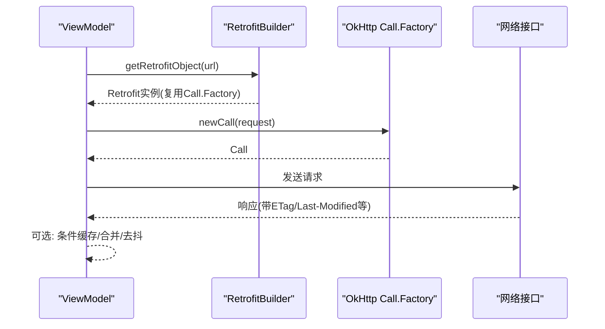
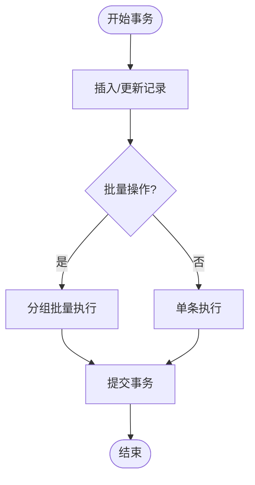
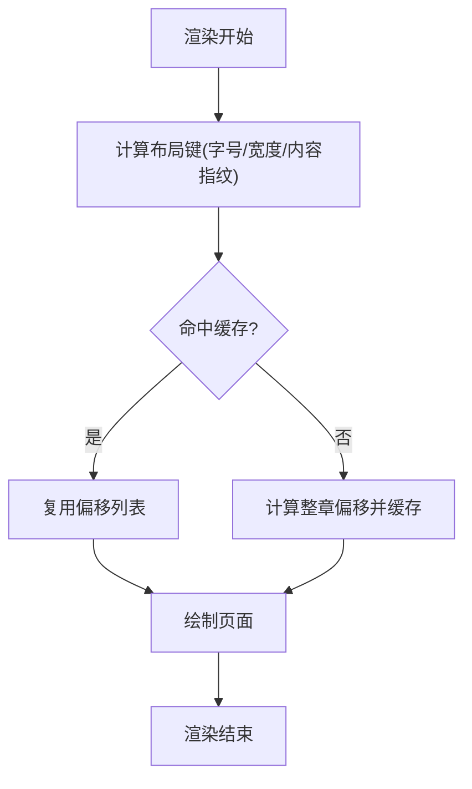
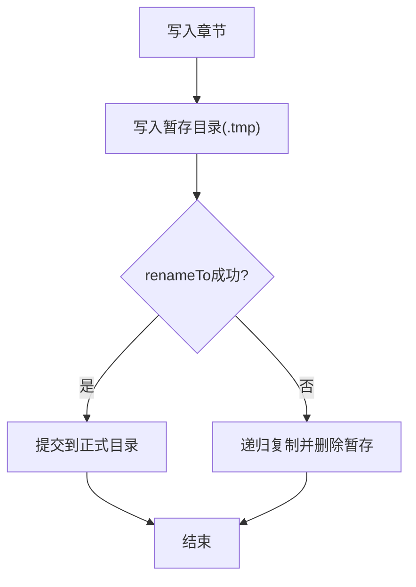
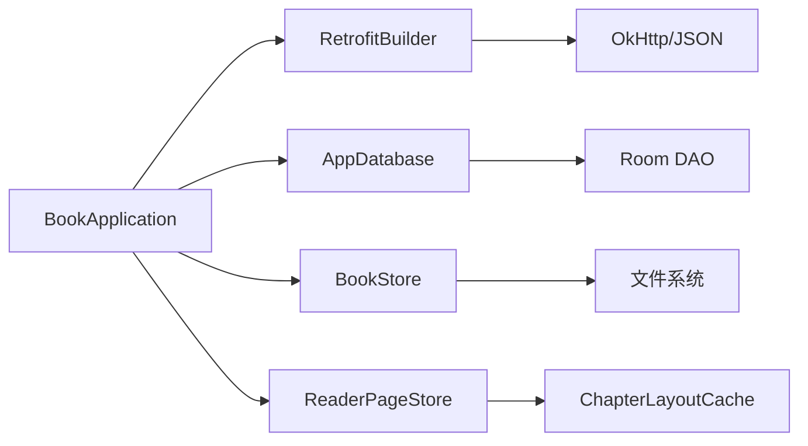

# 性能优化

<cite>
**本文引用的文件**
- [README.MD](file://README.MD)
- [BookApplication.kt](file://lib_book_common/src/main/java/com/ebook/common/BookApplication.kt)
- [RetrofitBuilder.kt](file://lib_ebook_api/src/main/java/com/ebook/api/RetrofitBuilder.kt)
- [AppDatabase.kt](file://lib_ebook_db/src/main/java/com/ebook/db/AppDatabase.kt)
- [ReaderPageStore.kt](file://module_book/src/main/java/com/ebook/book/reader/ReaderPageStore.kt)
- [ChapterLayoutCache.kt](file://module_book/src/main/java/com/ebook/book/reader/ChapterLayoutCache.kt)
- [BookStore.kt](file://lib_book_common/src/main/java/com/ebook/common/store/BookStore.kt)
- [ChapterContentCache.kt](file://lib_book_common/src/main/java/com/ebook/common/store/ChapterContentCache.kt)
</cite>

## 目录
1. [简介](#简介)
2. [项目结构](#项目结构)
3. [核心组件](#核心组件)
4. [架构总览](#架构总览)
5. [详细组件分析](#详细组件分析)
6. [依赖关系分析](#依赖关系分析)
7. [性能考量](#性能考量)
8. [故障排查指南](#故障排查指南)
9. [结论](#结论)
10. [附录](#附录)

## 简介
本文件面向读者与贡献者，系统梳理本项目在内存、启动速度、网络、数据库、UI 渲染、文件 I/O、电池与监控方面的性能策略与最佳实践。内容基于仓库现有实现与约定，给出可落地的优化思路、流程图示与定位方法，帮助在保持功能正确性的前提下持续降低时延与资源占用。

## 项目结构
项目采用多模块 MVVM + Compose 架构，核心分层如下：
- 应用入口与主题装配：module_app 组装各业务模块；BookApplication 负责主题装配与进程门控制，避免沙箱进程做无用初始化。
- 网络层：lib_ebook_api 通过 RetrofitBuilder 复用 OkHttp Call.Factory（含认证拦截器与调试脱敏），统一 JSON 转换器。
- 数据层：lib_ebook_db 以 Room 提供本地持久化；lib_book_common 的 BookStore 管理章节正文与封面等文件存储。
- 阅读与 UI：module_book 阅读器包含页面加载去重与几何裁剪（ReaderPageStore）、排版偏移缓存（ChapterLayoutCache）等关键优化点。

**图表来源**
- [BookApplication.kt:17-49](file://lib_book_common/src/main/java/com/ebook/common/BookApplication.kt#L17-L49)
- [RetrofitBuilder.kt:24-44](file://lib_ebook_api/src/main/java/com/ebook/api/RetrofitBuilder.kt#L24-L44)
- [AppDatabase.kt:8-76](file://lib_ebook_db/src/main/java/com/ebook/db/AppDatabase.kt#L8-L76)
- [BookStore.kt:18-216](file://lib_book_common/src/main/java/com/ebook/common/store/BookStore.kt#L18-L216)
- [ReaderPageStore.kt:9-98](file://module_book/src/main/java/com/ebook/book/reader/ReaderPageStore.kt#L9-L98)

**章节来源**
- [README.MD:86-120](file://README.MD#L86-L120)
- [BookApplication.kt:17-49](file://lib_book_common/src/main/java/com/ebook/common/BookApplication.kt#L17-L49)
- [RetrofitBuilder.kt:24-44](file://lib_ebook_api/src/main/java/com/ebook/api/RetrofitBuilder.kt#L24-L44)
- [AppDatabase.kt:8-76](file://lib_ebook_db/src/main/java/com/ebook/db/AppDatabase.kt#L8-L76)
- [BookStore.kt:18-216](file://lib_book_common/src/main/java/com/ebook/common/store/BookStore.kt#L18-L216)
- [ReaderPageStore.kt:9-98](file://module_book/src/main/java/com/ebook/book/reader/ReaderPageStore.kt#L9-L98)

## 核心组件
- 主题与进程门（BookApplication）：在隔离进程跳过 UI 与主题初始化，减少无关 IO 与异常日志，缩短冷启动路径。
- 网络构建器（RetrofitBuilder）：复用共享 Call.Factory，集中注入 JSON 转换器，避免重复创建客户端导致的连接池与解析开销。
- 数据库装配（AppDatabase）：声明表与 DAO，约束迁移与主键策略，确保读写路径清晰、事务语义明确。
- 阅读器加载去重（ReaderPageStore）：以键去重在途任务、按窗口/章半径裁剪状态，防止重复请求与内存膨胀。
- 排版偏移缓存（ChapterLayoutCache）：缓存整章行起始偏移，同章翻页仅一次重排，显著降低 CPU 峰值。
- 内容仓库（BookStore）：章文件原子写入与对账，单次遍历统计占用，避免重复 IO。
- 正文内存缓存（ChapterContentCache）：当前章及前后章常驻内存，避免每页重复读盘与解码。

**章节来源**
- [BookApplication.kt:17-49](file://lib_book_common/src/main/java/com/ebook/common/BookApplication.kt#L17-L49)
- [RetrofitBuilder.kt:24-44](file://lib_ebook_api/src/main/java/com/ebook/api/RetrofitBuilder.kt#L24-L44)
- [AppDatabase.kt:8-76](file://lib_ebook_db/src/main/java/com/ebook/db/AppDatabase.kt#L8-L76)
- [ReaderPageStore.kt:9-98](file://module_book/src/main/java/com/ebook/book/reader/ReaderPageStore.kt#L9-L98)
- [ChapterLayoutCache.kt:5-61](file://module_book/src/main/java/com/ebook/book/reader/ChapterLayoutCache.kt#L5-L61)
- [BookStore.kt:18-216](file://lib_book_common/src/main/java/com/ebook/common/store/BookStore.kt#L18-L216)
- [ChapterContentCache.kt:7-63](file://lib_book_common/src/main/java/com/ebook/common/store/ChapterContentCache.kt#L7-L63)

## 架构总览
下图展示从启动到阅读的核心链路，标注了关键性能节点：进程门短路、网络客户端复用、数据库装配、文件读取与排版缓存。

**图表来源**
- [BookApplication.kt:17-49](file://lib_book_common/src/main/java/com/ebook/common/BookApplication.kt#L17-L49)
- [RetrofitBuilder.kt:24-44](file://lib_ebook_api/src/main/java/com/ebook/api/RetrofitBuilder.kt#L24-L44)
- [AppDatabase.kt:40-76](file://lib_ebook_db/src/main/java/com/ebook/db/AppDatabase.kt#L40-L76)
- [BookStore.kt:50-139](file://lib_book_common/src/main/java/com/ebook/common/store/BookStore.kt#L50-L139)
- [ReaderPageStore.kt:29-98](file://module_book/src/main/java/com/ebook/book/reader/ReaderPageStore.kt#L29-L98)
- [ChapterLayoutCache.kt:38-61](file://module_book/src/main/java/com/ebook/book/reader/ChapterLayoutCache.kt#L38-L61)

## 详细组件分析

### 内存优化：对象复用、缓存与泄漏防护
- 对象池化与缓存
  - 章节正文内存缓存（ChapterContentCache）：容量为“当前章+前后各一章”，避免每页重复打开/解码文件，降低 GC 压力与 IO 延迟。
  - 排版偏移缓存（ChapterLayoutCache）：缓存整章行起始偏移，同章翻页只重排一次；容量覆盖“当前章+前后两章”的余量。
  - 阅读器加载去重（ReaderPageStore）：以键去重在途任务与已就绪页，按窗口/章半径裁剪状态，避免重复请求与内存堆积。
- 弱引用与生命周期
  - 阅读器组件的生命周期由页面级实例承载，避免全局单例长期持有大对象；跳转或换模式时调用 clear/retain 主动释放。
- 泄漏检测与预防
  - 使用协程作用域与 Job 跟踪任务，clear 时取消全部在途任务；ensureLoad 中用 Job 身份比对避免误删后继任务。
  - 线程安全：并发预加载场景下，缓存访问经同步保护，避免结构损坏导致不可预测行为。

**图表来源**
- [ReaderPageStore.kt:29-98](file://module_book/src/main/java/com/ebook/book/reader/ReaderPageStore.kt#L29-L98)
- [ChapterLayoutCache.kt:38-61](file://module_book/src/main/java/com/ebook/book/reader/ChapterLayoutCache.kt#L38-L61)
- [ChapterContentCache.kt:25-63](file://lib_book_common/src/main/java/com/ebook/common/store/ChapterContentCache.kt#L25-L63)

**章节来源**
- [ReaderPageStore.kt:9-98](file://module_book/src/main/java/com/ebook/book/reader/ReaderPageStore.kt#L9-L98)
- [ChapterLayoutCache.kt:5-61](file://module_book/src/main/java/com/ebook/book/reader/ChapterLayoutCache.kt#L5-L61)
- [ChapterContentCache.kt:7-63](file://lib_book_common/src/main/java/com/ebook/common/store/ChapterContentCache.kt#L7-L63)

### 启动速度优化：进程门、懒加载与依赖注入
- 进程门短路：在隔离进程跳过主题装配与主题管理器挂载，避免无意义 IO 与潜在异常，缩短沙箱进程冷启动时间。
- 懒加载：Hilt 通过 EntryPointAccessors 按需取主题管理器，避免 Application 构造期强依赖造成启动阻塞。
- 依赖注入优化：Retrofit 使用 Lazy<Call.Factory> 避免循环依赖，保证首次使用时再建立连接。

**图表来源**
- [BookApplication.kt:17-49](file://lib_book_common/src/main/java/com/ebook/common/BookApplication.kt#L17-L49)
- [RetrofitBuilder.kt:24-44](file://lib_ebook_api/src/main/java/com/ebook/api/RetrofitBuilder.kt#L24-L44)

**章节来源**
- [BookApplication.kt:17-49](file://lib_book_common/src/main/java/com/ebook/common/BookApplication.kt#L17-L49)
- [RetrofitBuilder.kt:24-44](file://lib_ebook_api/src/main/java/com/ebook/api/RetrofitBuilder.kt#L24-L44)

### 网络请求优化：复用客户端、超时与缓存
- 客户端复用：RetrofitBuilder 复用共享 Call.Factory（含认证拦截器与调试脱敏），减少连接创建与握手开销。
- JSON 转换器：显式注册 kotlinx 转换器，避免运行时解析失败带来的重试与额外请求。
- 连接与超时：通过统一的 Call.Factory 集中配置，便于后续接入连接池大小、超时策略与重试规则。
- 缓存策略：建议在拦截器层结合响应头进行条件缓存（如短时效 SWR），减少重复请求；具体实现需结合后端契约与业务场景。

**图表来源**
- [RetrofitBuilder.kt:24-44](file://lib_ebook_api/src/main/java/com/ebook/api/RetrofitBuilder.kt#L24-L44)

**章节来源**
- [RetrofitBuilder.kt:24-44](file://lib_ebook_api/src/main/java/com/ebook/api/RetrofitBuilder.kt#L24-L44)

### 数据库优化：查询、索引与批量操作
- 装配与职责：AppDatabase 声明表与 DAO，读写经上层仓库发起，职责清晰，便于事务管理与批量操作封装。
- 主键策略：自然键用于稳定实体（书架、书籍、章节、书源、暂停标记），自增键用于流水型数据（下载队列、搜索历史），去重责任上移到仓库层，避免重复插入。
- 迁移与一致性：改实体必须 version+1、追加紧邻迁移、提交新 schema JSON，禁止破坏性回退，保证升级性能与一致性。

**图表来源**
- [AppDatabase.kt:8-76](file://lib_ebook_db/src/main/java/com/ebook/db/AppDatabase.kt#L8-L76)

**章节来源**
- [AppDatabase.kt:8-76](file://lib_ebook_db/src/main/java/com/ebook/db/AppDatabase.kt#L8-L76)

### UI 渲染优化：布局、绘制与滚动
- 排版偏移缓存：ChapterLayoutCache 缓存整章行起始偏移，同章翻页仅一次重排，降低 CPU 峰值与掉帧风险。
- 页面加载去重：ReaderPageStore 以键去重在途任务，按窗口/章半径裁剪状态，避免频繁重算与重绘。
- 滚动性能：滚屏模式下按章半径裁剪，避免小块半径导致的重复加载与闪动；锚点与 key 设计保障列表插入时的稳定性。

**图表来源**
- [ChapterLayoutCache.kt:18-61](file://module_book/src/main/java/com/ebook/book/reader/ChapterLayoutCache.kt#L18-L61)
- [ReaderPageStore.kt:29-98](file://module_book/src/main/java/com/ebook/book/reader/ReaderPageStore.kt#L29-L98)

**章节来源**
- [ChapterLayoutCache.kt:5-61](file://module_book/src/main/java/com/ebook/book/reader/ChapterLayoutCache.kt#L5-L61)
- [ReaderPageStore.kt:9-98](file://module_book/src/main/java/com/ebook/book/reader/ReaderPageStore.kt#L9-L98)

### 文件 I/O 优化：读写策略、缓冲与异步
- 原子写入与对账：BookStore 使用暂存目录与 renameTo 原子提交，避免半写状态被读到；reconcile 清理无主目录与散落文件。
- 单次遍历统计：storageUsage 一次遍历得到字节与册数，避免多次 IO 造成的卡顿。
- UTF-8 规范化：章节正文以 UTF-8 规范化存储，读取侧无需再处理编码，降低解码分支与错误率。

**图表来源**
- [BookStore.kt:62-96](file://lib_book_common/src/main/java/com/ebook/common/store/BookStore.kt#L62-L96)

**章节来源**
- [BookStore.kt:50-139](file://lib_book_common/src/main/java/com/ebook/common/store/BookStore.kt#L50-L139)
- [BookStore.kt:141-160](file://lib_book_common/src/main/java/com/ebook/common/store/BookStore.kt#L141-L160)

### 电池优化：后台任务与频率控制
- 前台服务：下载服务声明 dataSync 类型，遵循配额与启动限制；任务入队后统一拉起服务，避免后台唤醒过多。
- 任务调度：下载任务按章顺序出队，失败耗尽重试后再出队，避免长时间驻留与无效唤醒；暂停中断不立即出队，减少反复重启。
- 频率控制：网络请求可通过拦截器进行节流与重试退避，减少不必要的唤醒与电量消耗。

[本节为通用指导，不直接分析具体文件]

### 性能监控与分析工具
- Profiler 使用：优先关注 UI 线程耗时、CPU 峰值与 GC 事件；阅读器翻页时观察排版与 IO 热点。
- 指标收集：埋点关键路径（冷启动、首屏、翻页、网络请求、数据库读写）的耗时与成功率，形成趋势看板。
- 瓶颈定位：利用 ReaderPageStore 的去重与裁剪能力，对比开启/关闭缓存的差值，量化优化收益。

[本节为通用指导，不直接分析具体文件]

## 依赖关系分析
- 组件耦合：
  - BookApplication 与主题管理器松耦合（通过 EntryPointAccessors 取单例）。
  - RetrofitBuilder 与 OkHttp 解耦，通过 Call.Factory 注入。
  - AppDatabase 与 DAO 分离，读写集中在仓库层。
  - 阅读器组件通过键与缓存协同，降低跨组件耦合。
- 外部依赖：
  - Retrofit/OkHttp/Kotlinx Serialization 集中于网络层。
  - Room 集中于数据层。
  - Coil 图片加载（见 README 技术栈），建议在 Compose 中启用占位图与渐进式加载以减少抖动。

**图表来源**
- [BookApplication.kt:17-49](file://lib_book_common/src/main/java/com/ebook/common/BookApplication.kt#L17-L49)
- [RetrofitBuilder.kt:24-44](file://lib_ebook_api/src/main/java/com/ebook/api/RetrofitBuilder.kt#L24-L44)
- [AppDatabase.kt:40-76](file://lib_ebook_db/src/main/java/com/ebook/db/AppDatabase.kt#L40-L76)
- [BookStore.kt:18-216](file://lib_book_common/src/main/java/com/ebook/common/store/BookStore.kt#L18-L216)
- [ReaderPageStore.kt:29-98](file://module_book/src/main/java/com/ebook/book/reader/ReaderPageStore.kt#L29-L98)
- [ChapterLayoutCache.kt:38-61](file://module_book/src/main/java/com/ebook/book/reader/ChapterLayoutCache.kt#L38-L61)

**章节来源**
- [README.MD:106-120](file://README.MD#L106-L120)
- [BookApplication.kt:17-49](file://lib_book_common/src/main/java/com/ebook/common/BookApplication.kt#L17-L49)
- [RetrofitBuilder.kt:24-44](file://lib_ebook_api/src/main/java/com/ebook/api/RetrofitBuilder.kt#L24-L44)
- [AppDatabase.kt:40-76](file://lib_ebook_db/src/main/java/com/ebook/db/AppDatabase.kt#L40-L76)
- [BookStore.kt:18-216](file://lib_book_common/src/main/java/com/ebook/common/store/BookStore.kt#L18-L216)
- [ReaderPageStore.kt:29-98](file://module_book/src/main/java/com/ebook/book/reader/ReaderPageStore.kt#L29-L98)
- [ChapterLayoutCache.kt:38-61](file://module_book/src/main/java/com/ebook/book/reader/ChapterLayoutCache.kt#L38-L61)

## 性能考量
- 内存：
  - 使用 LRU 缓存（ChapterLayoutCache、ChapterContentCache）控制容量，避免 OOM。
  - 及时取消在途任务与清理状态（ReaderPageStore.clear/retain），防止内存累积。
- 启动速度：
  - 进程门短路、懒加载主题管理器与网络客户端，减少冷启动阻塞。
- 网络：
  - 复用 Call.Factory、统一 JSON 转换器，减少连接与解析开销；建议结合响应头做条件缓存。
- 数据库：
  - 合理主键与迁移策略，批量操作减少事务次数；仓库层承担去重与一致性。
- UI：
  - 排版偏移缓存与页面加载去重，显著提升翻页流畅度；滚屏模式按章半径裁剪，避免频繁重排。
- 文件 I/O：
  - 原子写入与对账，单次遍历统计，UTF-8 规范化减少解码分支。
- 电池：
  - 前台服务与任务调度遵循平台限制，避免过度唤醒；网络请求节流与重试退避降低能耗。

[本节为通用指导，不直接分析具体文件]

## 故障排查指南
- 启动问题：
  - 检查进程门是否正确跳过沙箱初始化；确认主题装配仅在主进程生效。
- 网络问题：
  - 确认 RetrofitBuilder 使用了共享 Call.Factory 与正确的 JSON 转换器；检查拦截器链路与超时设置。
- 数据库问题：
  - 核对迁移链与 schema 版本；确认主键策略与去重逻辑一致，避免重复插入。
- 渲染卡顿：
  - 验证排版缓存是否命中；检查 ReaderPageStore 的 retain/clear 是否按预期工作。
- 文件 I/O：
  - 检查暂存目录与 renameTo 流程；确认 storageUsage 与 reconcile 的正确性。

**章节来源**
- [BookApplication.kt:17-49](file://lib_book_common/src/main/java/com/ebook/common/BookApplication.kt#L17-L49)
- [RetrofitBuilder.kt:24-44](file://lib_ebook_api/src/main/java/com/ebook/api/RetrofitBuilder.kt#L24-L44)
- [AppDatabase.kt:8-76](file://lib_ebook_db/src/main/java/com/ebook/db/AppDatabase.kt#L8-L76)
- [ReaderPageStore.kt:29-98](file://module_book/src/main/java/com/ebook/book/reader/ReaderPageStore.kt#L29-L98)
- [BookStore.kt:50-139](file://lib_book_common/src/main/java/com/ebook/common/store/BookStore.kt#L50-L139)

## 结论
本项目在内存、启动、网络、数据库、UI 渲染与文件 I/O 方面已形成一套清晰的优化基线：进程门短路、客户端复用、缓存与去重、原子写入与对账、排版偏移缓存等。建议在此基础上继续完善网络条件缓存、节流与重试策略，并结合监控指标持续量化优化效果，确保在复杂书源与大数据量场景下的稳定与流畅。

## 附录
- 术语与约定：参考 README 中的技术栈与架构说明，确保团队对齐。
- 测试与验证：涉及 UI/启动链路的改动需在设备或模拟器上验证，确保编译通过不等于可运行。

[本节为通用指导，不直接分析具体文件]