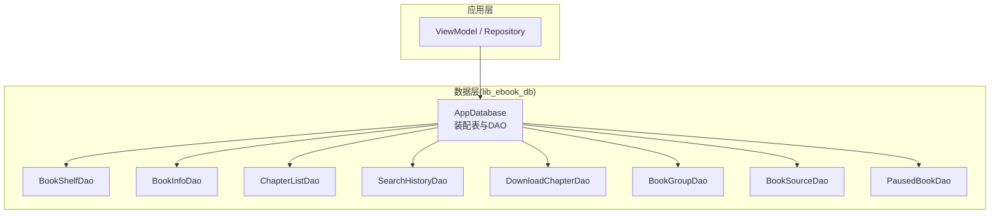
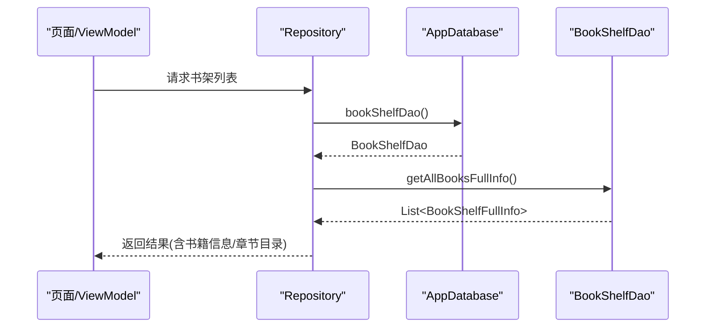
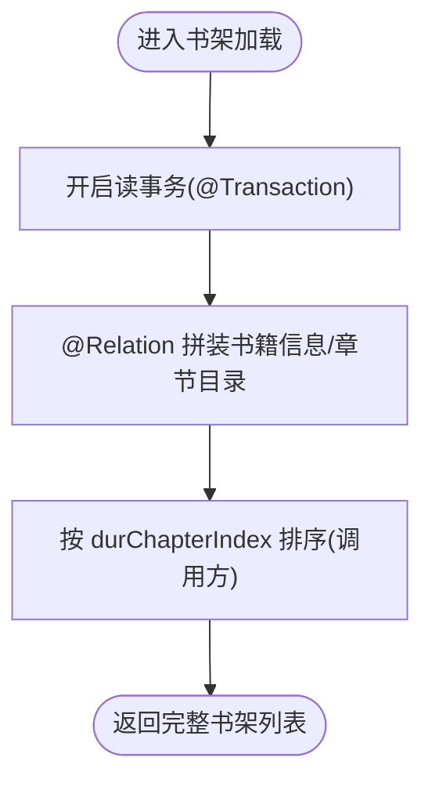
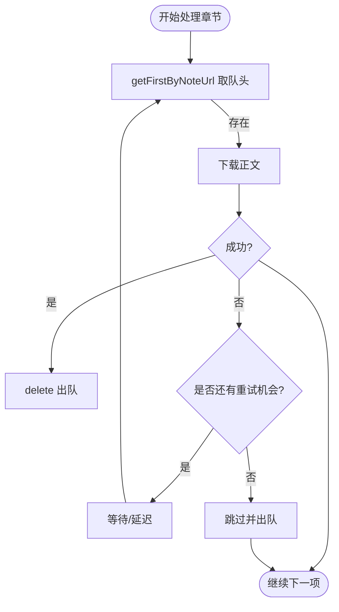
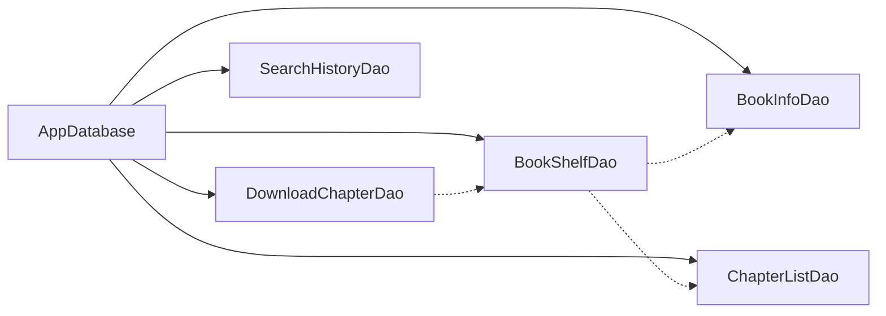

# 数据库优化

<cite>
**本文引用的文件**   
- [AppDatabase.kt](file://lib_ebook_db/src/main/java/com/ebook/db/AppDatabase.kt)
- [BookInfoDao.kt](file://lib_ebook_db/src/main/java/com/ebook/db/dao/BookInfoDao.kt)
- [BookShelfDao.kt](file://lib_ebook_db/src/main/java/com/ebook/db/dao/BookShelfDao.kt)
- [ChapterListDao.kt](file://lib_ebook_db/src/main/java/com/ebook/db/dao/ChapterListDao.kt)
- [DownloadChapterDao.kt](file://lib_ebook_db/src/main/java/com/ebook/db/dao/DownloadChapterDao.kt)
- [SearchHistoryDao.kt](file://lib_ebook_db/src/main/java/com/ebook/db/dao/SearchHistoryDao.kt)
- [BookSourceMigration6To7Test.kt](file://lib_ebook_db/src/test/java/com/ebook/db/BookSourceMigration6To7Test.kt)
- [AppDatabaseSchemaTest.kt](file://lib_ebook_db/src/test/java/com/ebook/db/AppDatabaseSchemaTest.kt)
- [AndroidRoomConventionPlugin.kt](file://build-logic/build-logic/convention/src/main/kotlin/AndroidRoomConventionPlugin.kt)
- [0003-objectbox-to-room.md](file://docs/adr/0003-objectbox-to-room.md)
- [0018-download-foreground-service-data-sync-quota.md](file://docs/adr/0018-download-foreground-service-data-sync-quota.md)
</cite>

## 目录
1. [简介](#简介)
2. [项目结构与数据层总览](#项目结构与数据层总览)
3. [核心组件与职责](#核心组件与职责)
4. [架构总览](#架构总览)
5. [详细组件分析](#详细组件分析)
6. [依赖关系与耦合分析](#依赖关系与耦合分析)
7. [性能优化策略与实践](#性能优化策略与实践)
8. [事务管理与一致性](#事务管理与一致性)
9. [缓存策略结合使用](#缓存策略结合使用)
10. [数据迁移与版本管理](#数据迁移与版本管理)
11. [监控与分析方法](#监控与分析方法)
12. [故障排查指南](#故障排查指南)
13. [结论](#结论)
14. [附录：关键查询与索引建议](#附录：关键查询与索引建议)

## 简介
本文档围绕本项目中的 Room 数据层，系统阐述数据库连接、查询、事务、迁移与缓存等维度的优化策略与最佳实践。内容基于仓库内实际实现（DAO、实体装配、测试与 ADR）进行归纳，并结合 Android 平台特性给出可落地的调优建议与排障指引。

## 项目结构与数据层总览
- 数据层集中在 lib_ebook_db 模块，通过 AppDatabase 统一装配八张表与 DAO；读写由上层仓库经 DAO 访问。
- Schema 演进受严格约束：禁止破坏性降级迁移，必须维护完整迁移链并导出 schema JSON。
- 主键策略区分自然键（稳定业务键）与自增流水键（下载队列），不同策略对应不同的 upsert 语义与去重责任。

图表来源
- [AppDatabase.kt:40-75](file://lib_ebook_db/src/main/java/com/ebook/db/AppDatabase.kt#L40-L75)

章节来源
- [AppDatabase.kt:8-39](file://lib_ebook_db/src/main/java/com/ebook/db/AppDatabase.kt#L8-L39)
- [AppDatabase.kt:40-75](file://lib_ebook_db/src/main/java/com/ebook/db/AppDatabase.kt#L40-L75)

## 核心组件与职责
- AppDatabase：声明实体集合、版本与导出开关；暴露各 DAO 的工厂方法。
- BookShelfDao：书架列表与阅读进度，提供全量/Flow/按书聚合读取与批量写入。
- BookInfoDao：书籍元数据 upsert、定向更新最后刷新时间戳、按 URL 删除。
- ChapterListDao：章节目录 upsert、按书获取目录、按 URL 取单章。
- DownloadChapterDao：下载队列入队/出队、按书队头/队尾查询、全局队头、计数与 Flow 观察。
- SearchHistoryDao：搜索历史增删查，支持按类型全量展示与精确查重。
- BookGroupDao/BookSourceDao/PausedBookDao：分别承载作品分组、书源规则、按书暂停标记。

章节来源
- [BookShelfDao.kt:21-109](file://lib_ebook_db/src/main/java/com/ebook/db/dao/BookShelfDao.kt#L21-L109)
- [BookInfoDao.kt:15-50](file://lib_ebook_db/src/main/java/com/ebook/db/dao/BookInfoDao.kt#L15-L50)
- [ChapterListDao.kt:14-44](file://lib_ebook_db/src/main/java/com/ebook/db/dao/ChapterListDao.kt#L14-L44)
- [DownloadChapterDao.kt:22-131](file://lib_ebook_db/src/main/java/com/ebook/db/dao/DownloadChapterDao.kt#L22-L131)
- [SearchHistoryDao.kt:17-66](file://lib_ebook_db/src/main/java/com/ebook/db/dao/SearchHistoryDao.kt#L17-L66)
- [AppDatabase.kt:40-75](file://lib_ebook_db/src/main/java/com/ebook/db/AppDatabase.kt#L40-L75)

## 架构总览
- 调用路径：业务层 → DAO → Room → SQLite。
- 关联拼装：书架全量通过 @Relation 组装书籍信息与章节目录，读事务保证一致性。
- 响应式：Flow 观察书架与下载剩余数，UI 自动刷新。
- 迁移：严格版本递增、紧邻迁移、schema 导出，禁用破坏性回退。

图表来源
- [AppDatabase.kt:55-70](file://lib_ebook_db/src/main/java/com/ebook/db/AppDatabase.kt#L55-L70)
- [BookShelfDao.kt:21-33](file://lib_ebook_db/src/main/java/com/ebook/db/dao/BookShelfDao.kt#L21-L33)

章节来源
- [AppDatabase.kt:55-70](file://lib_ebook_db/src/main/java/com/ebook/db/AppDatabase.kt#L55-L70)
- [BookShelfDao.kt:21-33](file://lib_ebook_db/src/main/java/com/ebook/db/dao/BookShelfDao.kt#L21-L33)

## 详细组件分析

### 书架与书籍信息（BookShelfDao / BookInfoDao）
- 书架全量读取使用 @Transaction + @Relation，避免子查询跨事务导致的中间态。
- 书籍元数据采用自然键 note_url 的 REPLACE 插入，实现幂等 upsert。
- 仅更新 final_refresh_data 列使用定向 UPDATE，避免整行 REPLACE 导致字段被默认值覆盖。

图表来源
- [BookShelfDao.kt:21-33](file://lib_ebook_db/src/main/java/com/ebook/db/dao/BookShelfDao.kt#L21-L33)
- [BookShelfDao.kt:44-51](file://lib_ebook_db/src/main/java/com/ebook/db/dao/BookShelfDao.kt#L44-L51)
- [BookInfoDao.kt:19-39](file://lib_ebook_db/src/main/java/com/ebook/db/dao/BookInfoDao.kt#L19-L39)

章节来源
- [BookShelfDao.kt:21-109](file://lib_ebook_db/src/main/java/com/ebook/db/dao/BookShelfDao.kt#L21-L109)
- [BookInfoDao.kt:15-50](file://lib_ebook_db/src/main/java/com/ebook/db/dao/BookInfoDao.kt#L15-L50)

### 章节目录（ChapterListDao）
- 按 note_url 取目录需显式 ORDER BY 以保证稳定顺序。
- 批量 upsert 使用 content_ref 作为主键，重复抓取不堆积。
- 删除目录时不级联删除章文件与下载任务，清理责任在调用方。

章节来源
- [ChapterListDao.kt:14-44](file://lib_ebook_db/src/main/java/com/ebook/db/dao/ChapterListDao.kt#L14-L44)

### 下载队列（DownloadChapterDao）
- 队头/队尾查询用于服务逐章推进与 UI 状态判断。
- 入队前查重回填 id，避免“先删后插”带来的唯一索引冲突与额外开销。
- 失败章必须出队，否则队头不动会导致无限重试与前台配额浪费。
- 计数与 Flow 观察用于角标与通知进度。

图表来源
- [DownloadChapterDao.kt:33-42](file://lib_ebook_db/src/main/java/com/ebook/db/dao/DownloadChapterDao.kt#L33-L42)
- [DownloadChapterDao.kt:112-130](file://lib_ebook_db/src/main/java/com/ebook/db/dao/DownloadChapterDao.kt#L112-L130)

章节来源
- [DownloadChapterDao.kt:22-131](file://lib_ebook_db/src/main/java/com/ebook/db/dao/DownloadChapterDao.kt#L22-L131)

### 搜索历史（SearchHistoryDao）
- 按类型全量展示，不做子串过滤，避免 LIKE 通配符转义成本。
- 精确匹配查重，重搜只更新时间戳，不产生重复记录。
- 清除操作与展示范围一致，避免“显示多、删得少”的歧义。

章节来源
- [SearchHistoryDao.kt:17-66](file://lib_ebook_db/src/main/java/com/ebook/db/dao/SearchHistoryDao.kt#L17-L66)

## 依赖关系与耦合分析
- AppDatabase 集中装配 DAO，DAO 之间无直接依赖，解耦清晰。
- 表间未使用外键级联，数据完整性由调用方在仓库层协调（如移除书架时清理关联表）。
- 响应式 Flow 降低 UI 刷新耦合，减少手动失效与脏读风险。

图表来源
- [AppDatabase.kt:40-75](file://lib_ebook_db/src/main/java/com/ebook/db/AppDatabase.kt#L40-L75)

章节来源
- [AppDatabase.kt:40-75](file://lib_ebook_db/src/main/java/com/ebook/db/AppDatabase.kt#L40-L75)

## 性能优化策略与实践

### 连接池与实例化
- Room 默认以单例模式持有底层 SQLiteConnectionPool，避免频繁创建/销毁连接。建议在应用启动处通过 Room.databaseBuilder 构建单例数据库实例，复用该实例进行所有 DAO 调用。
- 注意：本项目中 AppDatabase 仅声明表与 DAO，具体实例化与配置位于 Hilt/DI 或约定插件中，请确保单例生命周期与应用一致。

章节来源
- [AppDatabase.kt:8-24](file://lib_ebook_db/src/main/java/com/ebook/db/AppDatabase.kt#L8-L24)
- [AppDatabase.kt:40-75](file://lib_ebook_db/src/main/java/com/ebook/db/AppDatabase.kt#L40-L75)

### 查询优化
- 利用自然键与唯一索引进行 O(1)/O(logN) 查找：note_url、content_ref、dur_chapter_url 唯一索引用于精准定位与去重。
- 批量写入优先使用 insertAll，减少事务边界切换与磁盘同步次数。
- 避免 SELECT * 在大表场景下的不必要开销（当前表体量较小，仍可遵循按需选择列的最佳习惯）。
- Flow 观察替代轮询：对书架列表、下载剩余数等使用 Flow，减少无效查询。

章节来源
- [BookShelfDao.kt:53-59](file://lib_ebook_db/src/main/java/com/ebook/db/dao/BookShelfDao.kt#L53-L59)
- [DownloadChapterDao.kt:81-96](file://lib_ebook_db/src/main/java/com/ebook/db/dao/DownloadChapterDao.kt#L81-L96)
- [ChapterListDao.kt:28-34](file://lib_ebook_db/src/main/java/com/ebook/db/dao/ChapterListDao.kt#L28-L34)

### 事务管理
- 复杂关联读取使用 @Transaction 包裹，确保 @Relation 子查询在同一读事务内执行，避免中间态。
- 写操作尽量合并到单一事务中，减少 WAL 切换与 fsync 次数。

章节来源
- [BookShelfDao.kt:21-33](file://lib_ebook_db/src/main/java/com/ebook/db/dao/BookShelfDao.kt#L21-L33)
- [BookShelfDao.kt:44-51](file://lib_ebook_db/src/main/java/com/ebook/db/dao/BookShelfDao.kt#L44-L51)

### 数据迁移与版本管理
- 每次实体变更需 version +1、追加紧邻 MIGRATION_n_n+1、提交新 schema JSON，禁止 fallbackToDestructiveMigration。
- 通过单元测试校验迁移行为，确保增量升级的数据完整性。

章节来源
- [AppDatabase.kt:35-39](file://lib_ebook_db/src/main/java/com/ebook/db/AppDatabase.kt#L35-L39)
- [BookSourceMigration6To7Test.kt](file://lib_ebook_db/src/test/java/com/ebook/db/BookSourceMigration6To7Test.kt)

### 存储与 I/O
- 大段文本（如正文）已迁至文件存储（BookStore），数据库仅保留轻量引用与元数据，降低数据库体积与锁竞争。
- 下载队列仅保留未完成任务，天然控制表规模。

章节来源
- [AppDatabase.kt:23-25](file://lib_ebook_db/src/main/java/com/ebook/db/AppDatabase.kt#L23-L25)
- [DownloadChapterDao.kt:7-20](file://lib_ebook_db/src/main/java/com/ebook/db/dao/DownloadChapterDao.kt#L7-L20)

## 事务管理与一致性
- 读事务：书架全量读取包含 @Relation，必须在同一事务中完成，防止边读边写导致的“书已删、章节仍在”的中间态。
- 写事务：批量 upsert（insertAll）将多次写入合并为一次事务，减少磁盘 IO 与锁粒度。
- 幂等写入：自然键表的 REPLACE 实现幂等更新，避免重复插入与竞态条件。
- 调用方一致性：因未使用外键级联，删除书架时必须由调用方清理关联表，保持数据一致性。

章节来源
- [BookShelfDao.kt:21-33](file://lib_ebook_db/src/main/java/com/ebook/db/dao/BookShelfDao.kt#L21-L33)
- [BookShelfDao.kt:85-104](file://lib_ebook_db/src/main/java/com/ebook/db/dao/BookShelfDao.kt#L85-L104)
- [BookInfoDao.kt:19-39](file://lib_ebook_db/src/main/java/com/ebook/db/dao/BookInfoDao.kt#L19-L39)

## 缓存策略结合使用
- 内存缓存：ViewModel/Repository 侧可对热点数据（如首页分类、搜索结果页）做短期缓存，配合 Flow 自动失效。
- 磁盘缓存：书城库缓存（cacheDir 文件版）由独立仓储负责，解析器不碰缓存，避免污染解析链路。
- 多级缓存：网络 → 磁盘缓存 → 内存缓存 → UI，逐级命中减少网络压力与首屏延迟。
- 失效策略：明确 TTL、SWR 与强刷入口（如下拉刷新），确保数据新鲜度与性能平衡。

章节来源
- [0018-download-foreground-service-data-sync-quota.md](file://docs/adr/0018-download-foreground-service-data-sync-quota.md)

## 数据迁移与版本管理
- 版本递增：version 每次 +1，严禁跳版。
- 迁移链：仅追加紧邻 MIGRATION_n_n+1，不得删除旧迁移，保证可回溯。
- Schema 导出：exportSchema = true，由约定插件输出到 schemas 目录，便于 CI 校验与评审。
- 禁止破坏性回退：fallbackToDestructiveMigration 禁用，防止用户数据丢失。
- 迁移测试：通过迁移测试用例验证增量升级后的数据正确性。

章节来源
- [AppDatabase.kt:35-39](file://lib_ebook_db/src/main/java/com/ebook/db/AppDatabase.kt#L35-L39)
- [BookSourceMigration6To7Test.kt](file://lib_ebook_db/src/test/java/com/ebook/db/BookSourceMigration6To7Test.kt)
- [AndroidRoomConventionPlugin.kt](file://build-logic/build-logic/convention/src/main/kotlin/AndroidRoomConventionPlugin.kt)

## 监控与分析方法
- 慢查询分析：使用 Room 的 SQL 日志或数据库调试工具捕获慢查询，关注全表扫描与缺失索引。
- 锁竞争检测：在高并发写入（批量 upsert）时观察 WAL 切换频率与锁等待；合理合并事务、分批写入。
- 存储空间管理：定期统计数据库大小与表行数，清理无用数据（如已完成下载的任务已出队，保持表轻量）。
- Flow 观察：对下载剩余数、书架列表等使用 Flow，避免轮询导致的 CPU 与 IO 浪费。

章节来源
- [DownloadChapterDao.kt:81-96](file://lib_ebook_db/src/main/java/com/ebook/db/dao/DownloadChapterDao.kt#L81-L96)
- [BookShelfDao.kt:53-59](file://lib_ebook_db/src/main/java/com/ebook/db/dao/BookShelfDao.kt#L53-L59)

## 故障排查指南
- 书架数据不一致：检查是否使用 @Transaction 包裹关联读取；确认调用方在删除书架时清理了关联表。
- 下载无限重试：确认失败章已出队；队头不变会导致服务阻塞与前台配额耗尽。
- 迁移失败：检查是否遗漏 MIGRATION_n_n+1 或未提交新 schema JSON；确认未启用破坏性回退。
- Flow 未触发刷新：确认查询返回的是 Flow 而非一次性快照；检查是否在合适的作用域收集。

章节来源
- [BookShelfDao.kt:21-33](file://lib_ebook_db/src/main/java/com/ebook/db/dao/BookShelfDao.kt#L21-L33)
- [DownloadChapterDao.kt:33-42](file://lib_ebook_db/src/main/java/com/ebook/db/dao/DownloadChapterDao.kt#L33-L42)
- [AppDatabase.kt:35-39](file://lib_ebook_db/src/main/java/com/ebook/db/AppDatabase.kt#L35-L39)

## 结论
本项目数据层通过清晰的 DAO 分层、严格的迁移策略、合理的索引与主键设计，以及 Flow 响应式能力，实现了高效、稳定且易维护的本地数据存储。结合文件存储与多级缓存，进一步提升了性能与用户体验。后续优化应聚焦于：
- 持续审视查询计划与索引有效性
- 合并批量写事务以降低 IO 开销
- 完善监控与测试覆盖，保障迁移与升级的可靠性

## 附录：关键查询与索引建议
- 常用查询
  - 书架全量：SELECT * FROM book_shelf ORDER BY final_date DESC（配合 @Relation）
  - 章节目录：SELECT * FROM chapter_list WHERE note_url = ? ORDER BY dur_chapter_index ASC
  - 下载队头：SELECT * FROM download_chapter WHERE note_url = ? ORDER BY dur_chapter_index ASC LIMIT 1
  - 搜索历史：SELECT * FROM search_history WHERE type = ? ORDER BY date DESC
- 索引建议
  - note_url：书架与书籍关联键，已作为自然键参与 JOIN/WHERE
  - content_ref：章节目录主键，快速定位章节
  - dur_chapter_url：下载队列唯一索引，保证一章一任务
  - final_date/dur_chapter_index/date：排序键，已在查询中显式 ORDER BY

章节来源
- [BookShelfDao.kt:21-33](file://lib_ebook_db/src/main/java/com/ebook/db/dao/BookShelfDao.kt#L21-L33)
- [ChapterListDao.kt:14-22](file://lib_ebook_db/src/main/java/com/ebook/db/dao/ChapterListDao.kt#L14-L22)
- [DownloadChapterDao.kt:33-42](file://lib_ebook_db/src/main/java/com/ebook/db/dao/DownloadChapterDao.kt#L33-L42)
- [SearchHistoryDao.kt:24-36](file://lib_ebook_db/src/main/java/com/ebook/db/dao/SearchHistoryDao.kt#L24-L36)