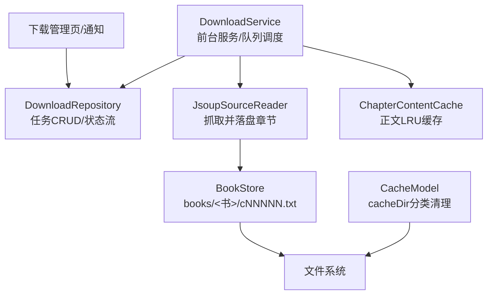
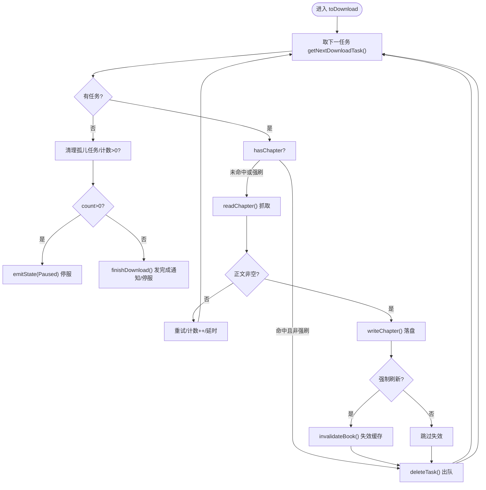
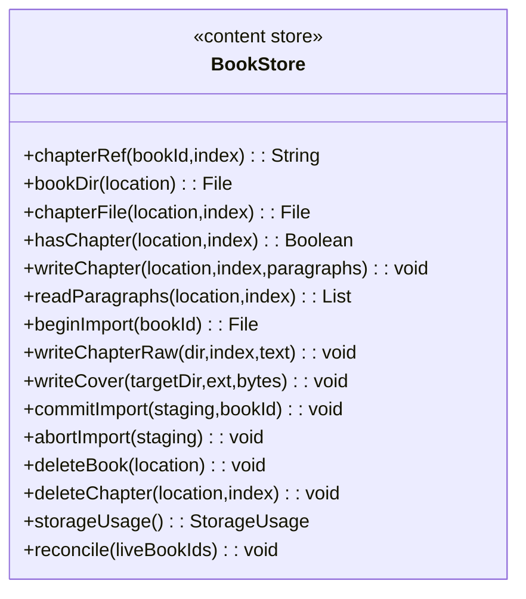
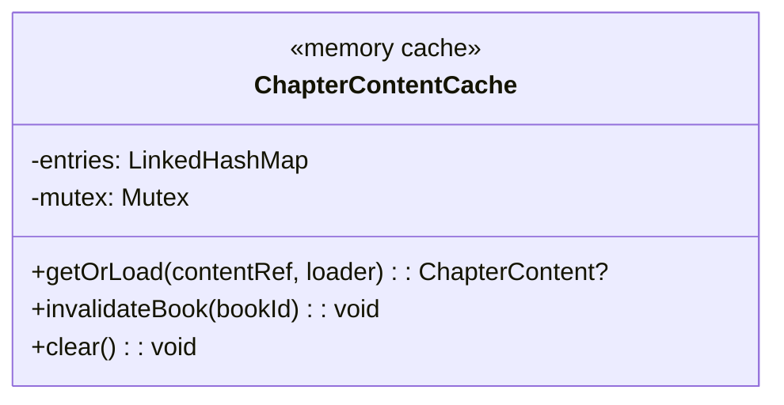
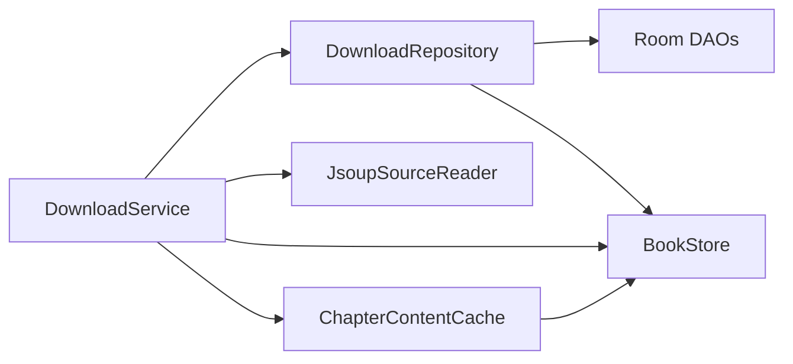

# 文件I/O优化

<cite>
**本文引用的文件**
- [DownloadService.kt](file://module_book/src/main/java/com/ebook/book/service/DownloadService.kt)
- [DownloadRepository.kt](file://module_book/src/main/java/com/ebook/book/repository/DownloadRepository.kt)
- [BookStore.kt](file://lib_book_common/src/main/java/com/ebook/common/store/BookStore.kt)
- [ChapterContentCache.kt](file://lib_book_common/src/main/java/com/ebook/common/store/ChapterContentCache.kt)
- [CacheModel.kt](file://module_me/src/main/java/com/ebook/me/repository/CacheModel.kt)
- [0038-content-store-book-dir-name.md](file://docs/adr/0038-content-store-book-dir-name.md)
- [0018-download-foreground-service-data-sync-quota.md](file://docs/adr/0018-download-foreground-service-data-sync-quota.md)
- [JsoupSourceReader.kt](file://lib_book_common/src/main/java/com/ebook/common/analyze/source/JsoupSourceReader.kt)
</cite>

## 目录
1. [简介](#简介)
2. [项目结构](#项目结构)
3. [核心组件](#核心组件)
4. [架构总览](#架构总览)
5. [关键组件详解](#关键组件详解)
6. [依赖关系分析](#依赖关系分析)
7. [性能考量](#性能考量)
8. [故障排查指南](#故障排查指南)
9. [结论](#结论)
10. [附录：I/O优化清单与最佳实践](#附录io优化清单与最佳实践)

## 简介
本文件聚焦本项目在文件I/O层面的优化策略与最佳实践，覆盖下载服务、书籍内容存储、缓存管理、大文件处理与I/O监控等方面。通过代码级分析，提炼出可复用的模式与注意事项，帮助读者在类似项目中高效落地高性能、高可靠的文件I/O方案。

## 项目结构
围绕文件I/O的关键模块分布如下：
- 下载与任务编排：DownloadService（前台服务）+ DownloadRepository（队列与状态）
- 书籍内容存储：BookStore（章节文件组织、导入原子提交、对账清理）
- 正文内存缓存：ChapterContentCache（LRU，按content_ref键，书级失效）
- 应用缓存管理：CacheModel（cacheDir分类统计与清理）
- 文档与决策：ADR-0038（书目录名派生规则）、ADR-0018（dataSync配额与启动限制）



**图表来源**
- [DownloadService.kt:40-750](file://module_book/src/main/java/com/ebook/book/service/DownloadService.kt#L40-L750)
- [DownloadRepository.kt:30-289](file://module_book/src/main/java/com/ebook/book/repository/DownloadRepository.kt#L30-L289)
- [BookStore.kt:18-215](file://lib_book_common/src/main/java/com/ebook/common/store/BookStore.kt#L18-L215)
- [ChapterContentCache.kt:7-63](file://lib_book_common/src/main/java/com/ebook/common/store/ChapterContentCache.kt#L7-L63)
- [CacheModel.kt:10-144](file://module_me/src/main/java/com/ebook/me/repository/CacheModel.kt#L10-L144)

**章节来源**
- [DownloadService.kt:40-750](file://module_book/src/main/java/com/ebook/book/service/DownloadService.kt#L40-L750)
- [DownloadRepository.kt:30-289](file://module_book/src/main/java/com/ebook/book/repository/DownloadRepository.kt#L30-L289)
- [BookStore.kt:18-215](file://lib_book_common/src/main/java/com/ebook/common/store/BookStore.kt#L18-L215)
- [ChapterContentCache.kt:7-63](file://lib_book_common/src/main/java/com/ebook/common/store/ChapterContentCache.kt#L7-L63)
- [CacheModel.kt:10-144](file://module_me/src/main/java/com/ebook/me/repository/CacheModel.kt#L10-L144)

## 核心组件
- 下载服务（DownloadService）：前台数据同步服务，逐章抓取、重试、间隔控制、通知与进度上报；处理Android 15+ dataSync配额超时与启动被拒。
- 下载仓库（DownloadRepository）：下载任务持久化、去重入库、暂停/继续策略、覆盖率计算、状态流（replay=1）。
- 书籍存储（BookStore）：章节文件写入/读取、封面写入、导入暂存→原子提交、对账清理、占用统计、目录名派生。
- 正文缓存（ChapterContentCache）：进程内LRU缓存，按content_ref命中，支持书级失效。
- 缓存管理（CacheModel）：cacheDir分类统计（图片/临时/其他），一次遍历分档累加，提供清理入口。

**章节来源**
- [DownloadService.kt:40-750](file://module_book/src/main/java/com/ebook/book/service/DownloadService.kt#L40-L750)
- [DownloadRepository.kt:30-289](file://module_book/src/main/java/com/ebook/book/repository/DownloadRepository.kt#L30-L289)
- [BookStore.kt:18-215](file://lib_book_common/src/main/java/com/ebook/common/store/BookStore.kt#L18-L215)
- [ChapterContentCache.kt:7-63](file://lib_book_common/src/main/java/com/ebook/common/store/ChapterContentCache.kt#L7-L63)
- [CacheModel.kt:10-144](file://module_me/src/main/java/com/ebook/me/repository/CacheModel.kt#L10-L144)

## 架构总览
下载链路从页面发起，经仓库入队，服务消费任务，调用解析器抓取正文并写入章节文件，更新缓存与UI状态。

```mermaid
sequenceDiagram
    participant UI as "下载管理页"
    participant Repo as "DownloadRepository"
    participant Svc as "DownloadService"
    participant Net as "JsoupSourceReader"
    participant Store as "BookStore"
    participant Cache as "ChapterContentCache"

    UI->>Repo: startDownload(章节列表)
    Repo->>Repo: addTasks(去重入库)
    Repo->>Svc: start(context, Intent)
    Svc->>Svc: onStartCommand/前台初始化
    loop 逐章
        Svc->>Repo: getNextDownloadTask()
        alt 有任务
            Svc->>Store: hasChapter(location,index)?
            opt 已存在且非强制刷新
                Svc->>Repo: deleteTask(直接出队)
            else 需要抓取
                Svc->>Net: readChapter(entry, location)
                Net-->>Svc: 段落文本
                Svc->>Store: writeChapter(location,index,paragraphs)
                Svc->>Cache: invalidateBook(若强制刷新)
                Svc->>Repo: deleteTask
            end
            Svc->>UI: emitState(Progress) + 通知更新
        else 无任务
            Svc->>Repo: countTasks()/deleteTasksOutsideShelf()
            Svc->>UI: emitState(Finished/Paused)
        end
    end
```

**图表来源**
- [DownloadService.kt:212-378](file://module_book/src/main/java/com/ebook/book/service/DownloadService.kt#L212-L378)
- [DownloadRepository.kt:121-173](file://module_book/src/main/java/com/ebook/book/repository/DownloadRepository.kt#L121-L173)
- [BookStore.kt:48-74](file://lib_book_common/src/main/java/com/ebook/common/store/BookStore.kt#L48-L74)
- [ChapterContentCache.kt:41-53](file://lib_book_common/src/main/java/com/ebook/common/store/ChapterContentCache.kt#L41-L53)

**章节来源**
- [DownloadService.kt:212-378](file://module_book/src/main/java/com/ebook/book/service/DownloadService.kt#L212-L378)
- [DownloadRepository.kt:121-173](file://module_book/src/main/java/com/ebook/book/repository/DownloadRepository.kt#L121-L173)

## 关键组件详解

### 下载服务（DownloadService）：断点续传、并发控制与配额处理
- 断点续传：任务持久化到数据库，冷启动或START_STICKY重启后从库取篇继续执行；“暂停”仅置标志位保留任务，“取消”才清空队列。
- 并发控制：单章串行下载，章节间postDelayed间隔（默认约800ms）降低站点压力；失败重试上限（默认3次）避免死循环。
- 配额与启动限制：onTimeout只做数秒收尾；start()统一捕获“前台服务不允许启动”异常，返回false提示用户；前台化失败时自动续跑分支直接收尾，避免空转。
- 强制刷新：删除旧章文件并失效对应书的正文内存缓存，确保阅读器不再命中旧正文。



**图表来源**
- [DownloadService.kt:212-378](file://module_book/src/main/java/com/ebook/book/service/DownloadService.kt#L212-L378)

**章节来源**
- [DownloadService.kt:96-124](file://module_book/src/main/java/com/ebook/book/service/DownloadService.kt#L96-L124)
- [DownloadService.kt:126-206](file://module_book/src/main/java/com/ebook/book/service/DownloadService.kt#L126-L206)
- [DownloadService.kt:249-378](file://module_book/src/main/java/com/ebook/book/service/DownloadService.kt#L249-L378)
- [0018-download-foreground-service-data-sync-quota.md:1-47](file://docs/adr/0018-download-foreground-service-data-sync-quota.md#L1-L47)

### 书籍内容存储（BookStore）：章节组织、导入原子性与对账清理
- 章节文件组织：`filesDir/books/<书目录名>/cNNNNN.txt`，一章一文件；段落以单个LF连接，UTF-8存储，去除表现层缩进。
- 目录名派生：合法单段名原样使用，否则MD5，避免网络URL路径导致嵌套目录破坏“第一层=一本书”的不变式。
- 导入原子性：beginImport创建.tmp暂存目录，commitImportrenameTo原子替换，abortImport清理半产物。
- 对账清理：删除DB中不存在的书目录、所有.tmp残留目录与根散落文件，保证磁盘整洁。
- 占用统计：一次遍历得到字节总数与册数，避免重复IO。



**图表来源**
- [BookStore.kt:18-215](file://lib_book_common/src/main/java/com/ebook/common/store/BookStore.kt#L18-L215)

**章节来源**
- [BookStore.kt:18-215](file://lib_book_common/src/main/java/com/ebook/common/store/BookStore.kt#L18-L215)
- [0038-content-store-book-dir-name.md:1-16](file://docs/adr/0038-content-store-book-dir-name.md#L1-L16)

### 正文内存缓存（ChapterContentCache）：LRU与书级失效
- 容量与键：容量默认3（当前章+前后各一），键为content_ref（自包含持久定位符），读时锁外加载避免阻塞。
- 失效策略：按书级marker（含目录名片段）剔除，配合BookStore.cacheMarker，确保删书/强刷后新正文生效。
- 线程安全：Mutex保护读写，防止并发下脏读。



**图表来源**
- [ChapterContentCache.kt:7-63](file://lib_book_common/src/main/java/com/ebook/common/store/ChapterContentCache.kt#L7-L63)

**章节来源**
- [ChapterContentCache.kt:7-63](file://lib_book_common/src/main/java/com/ebook/common/store/ChapterContentCache.kt#L7-L63)

### 应用缓存管理（CacheModel）：分类统计与空间回收
- 分类口径：IMAGE（Coil image_cache及遗留Glide目录）、TEMP（cacheDir根松散文件）、OTHER（其余子目录）。
- 统计策略：一次遍历分档累加，总量恒等于三档之和，避免差值法负数与重复遍历。
- 清理能力：分别支持图片缓存、临时文件、其他缓存清理；明细条目按大小降序展示。

**章节来源**
- [CacheModel.kt:10-144](file://module_me/src/main/java/com/ebook/me/repository/CacheModel.kt#L10-L144)

### 下载仓库（DownloadRepository）：任务管理与覆盖率
- 任务CRUD：添加去重、删除、清空、按书删除；暂停/继续通过PausedBookDao标记实现。
- 任务取篇：遍历书架（排除本地书与暂停书），按书取首/末任务，支持“待下载”判断。
- 覆盖率：基于BookStore.hasChapter判定章文件存在性，计算已缓存/总章节比例。
- 状态流：replay=1的SharedFlow，晚开订阅者也能对齐当前进度；提供tryEmitState用于服务收尾场景。

**章节来源**
- [DownloadRepository.kt:30-289](file://module_book/src/main/java/com/ebook/book/repository/DownloadRepository.kt#L30-L289)

## 依赖关系分析
- DownloadService依赖DownloadRepository进行任务存取与状态广播，依赖JsoupSourceReader抓取正文，依赖BookStore落盘与检测，依赖ChapterContentCache进行正文缓存失效。
- DownloadRepository依赖Room DAO（download_chapter/paused_book/chapter_list）与BookStore进行覆盖率计算。
- BookStore与ChapterContentCache共同维护“磁盘真相”与“内存缓存”的一致性：强制刷新时先写盘再失效缓存。
- CacheModel独立于业务内容，仅操作cacheDir，便于通用缓存清理。



**图表来源**
- [DownloadService.kt:40-750](file://module_book/src/main/java/com/ebook/book/service/DownloadService.kt#L40-L750)
- [DownloadRepository.kt:30-289](file://module_book/src/main/java/com/ebook/book/repository/DownloadRepository.kt#L30-L289)
- [BookStore.kt:18-215](file://lib_book_common/src/main/java/com/ebook/common/store/BookStore.kt#L18-L215)
- [ChapterContentCache.kt:7-63](file://lib_book_common/src/main/java/com/ebook/common/store/ChapterContentCache.kt#L7-L63)

**章节来源**
- [DownloadService.kt:40-750](file://module_book/src/main/java/com/ebook/book/service/DownloadService.kt#L40-L750)
- [DownloadRepository.kt:30-289](file://module_book/src/main/java/com/ebook/book/repository/DownloadRepository.kt#L30-L289)

## 性能考量
- 缓冲与批量写入：章节段落以单个LF拼接后一次性写入，减少系统调用次数；导入期使用.tmp暂存目录，commitImport原子替换，避免中间态被读取。
- 异步与后台：下载在协程作用域内执行，通知更新与状态发射尽量非阻塞；onTimeout严格限定在数秒内完成的收尾逻辑。
- 缓存命中率：ChapterContentCache容量3覆盖翻页预取；BookStore.storageUsage一次遍历获取占用与册数，避免重复IO。
- 站点限流：章节间postDelayed间隔，失败重试前延时，避免瞬时峰值触发反爬。
- 内存映射与大文件：当前实现以流式读写为主；如需更大文件随机访问，可考虑在后续版本引入分段读取或内存映射（需评估平台兼容性与内存占用）。

[本节为通用指导，无需具体文件引用]

## 故障排查指南
- 下载“全部完成”但实际有跳过章节：检查downloading中的skippedCount与finishDownload文案分支；确认重试耗尽后出队逻辑是否生效。
- 强制刷新无效：确认是否先删除章文件并调用invalidateBook；注意缓存键由content_ref决定，目录名需经dirName派生。
- 前台服务配额用尽：查看onTimeout是否及时stopSelf；确认tryEmitState同步写入replay缓冲；通知渠道与ID是否正确。
- 启动被拒：检查DownloadService.start()返回值，若false需提示用户；确认manifest声明dataSync类型与权限。
- 缓存管理误删：确认CacheModel只清理cacheDir，不碰filesDir/books；BooksStore.reconcile只在启动对账清理无主目录。

**章节来源**
- [DownloadService.kt:354-378](file://module_book/src/main/java/com/ebook/book/service/DownloadService.kt#L354-L378)
- [DownloadService.kt:646-666](file://module_book/src/main/java/com/ebook/book/service/DownloadService.kt#L646-L666)
- [BookStore.kt:141-160](file://lib_book_common/src/main/java/com/ebook/common/store/BookStore.kt#L141-L160)
- [0018-download-foreground-service-data-sync-quota.md:20-47](file://docs/adr/0018-download-foreground-service-data-sync-quota.md#L20-L47)

## 结论
本项目在文件I/O方面形成了清晰的职责边界与稳健的实现模式：下载服务负责任务调度与合规性（配额/启动限制），书籍存储保障章节文件的原子性与一致性，正文缓存提升阅读流畅度，缓存管理提供安全的空间回收手段。通过一次遍历统计、LRU缓存、原子提交与对账清理等机制，系统在大规模章节与多书场景下仍保持良好性能与可靠性。

[本节为总结性内容，无需具体文件引用]

## 附录：I/O优化清单与最佳实践
- 文件命名规范
  - 章节文件统一格式：cNNNNN.txt，序号零填充保证字典序等于数值序。
  - 书目录名派生：合法单段名原样使用，否则MD5，避免嵌套目录破坏“第一层=一本书”。
- 目录结构优化
  - booksRoot下每本书一个子目录；导入期使用.tmp暂存目录，commitImport原子替换。
  - 定期reconcile清理无主目录与散落文件，避免磁盘膨胀。
- 权限与安全
  - 前台服务dataSync类型与权限在manifest声明；通知渠道区分进行中与完成。
  - 缓存清理仅限cacheDir，书籍内容不在缓存管理页删除。
- 大文件与流式处理
  - 段落拼接后一次性写入，减少IO次数；必要时可引入分段读取与内存映射（需评估）。
- I/O监控与分析
  - 使用BookStore.storageUsage一次遍历获取字节与册数；CacheModel.cacheBreakdown一次遍历分档。
  - 下载过程通过通知与状态流反馈剩余量与进度；日志记录失败与重试次数。
- 性能提升案例
  - 章节间间隔与失败重试前延时，降低站点压力与瞬时限流风险。
  - 正文LRU缓存容量3，覆盖翻页预取，显著减少重复读盘。
  - 导入原子提交避免半本污染，提高健壮性。

[本节为通用指导，无需具体文件引用]