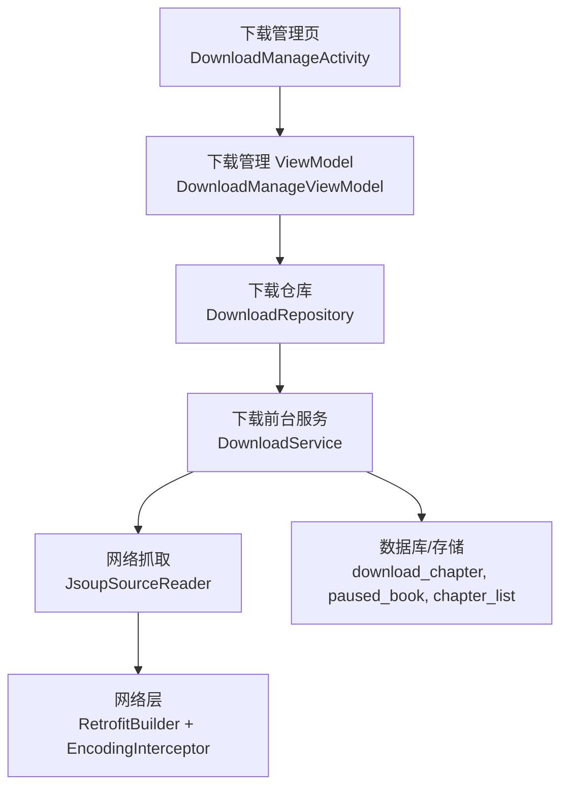
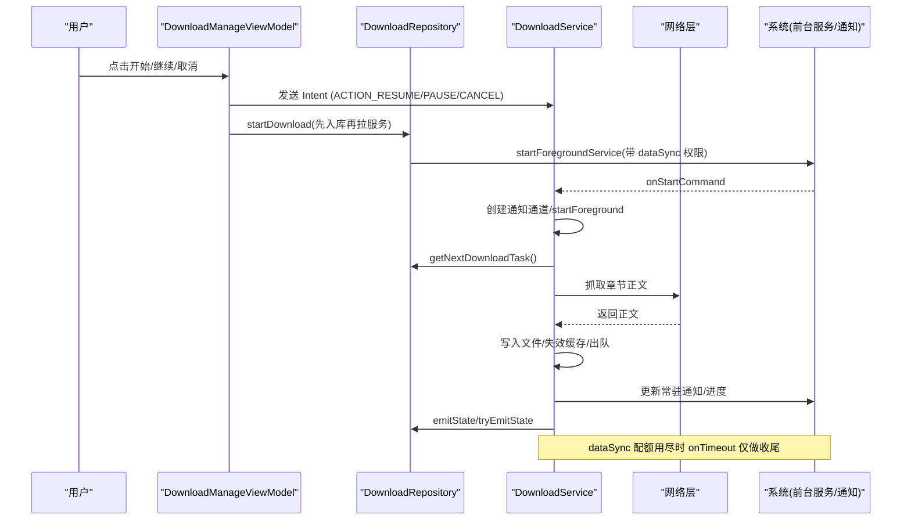
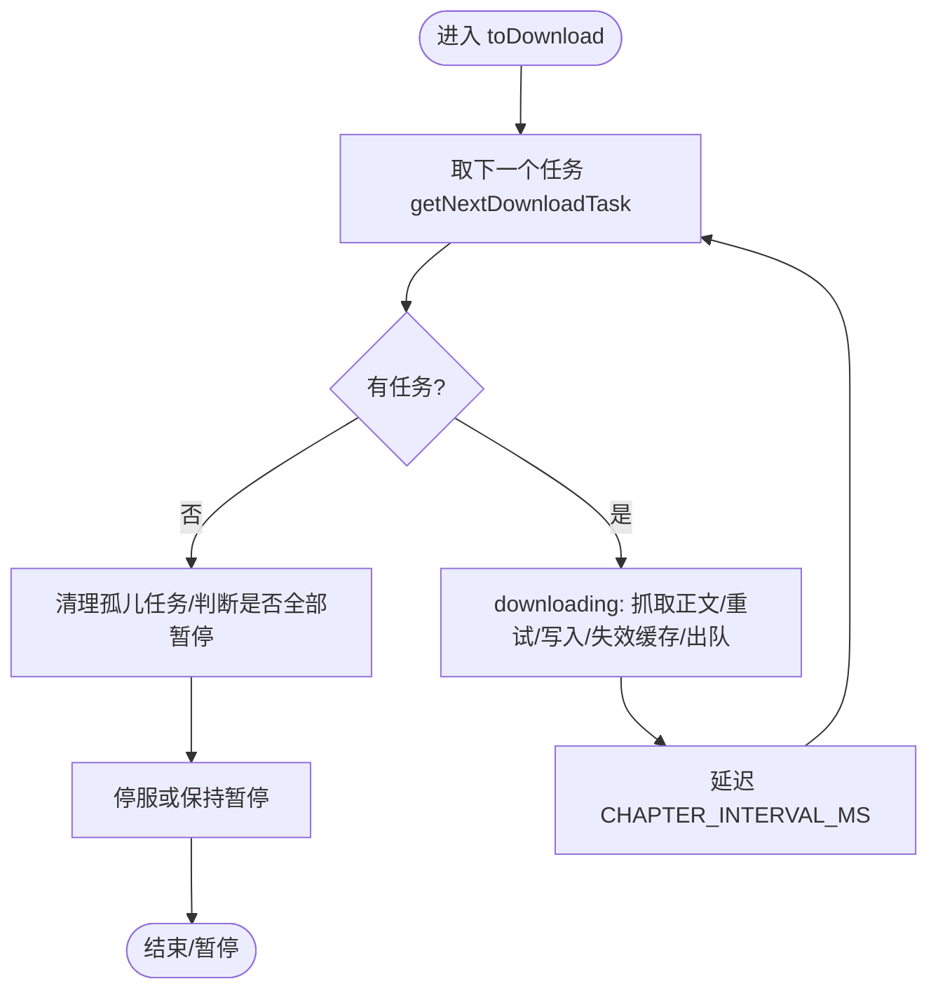
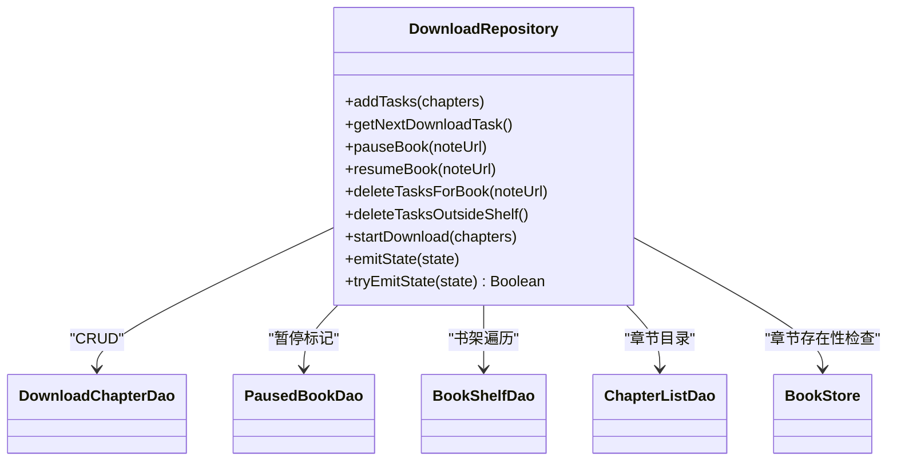
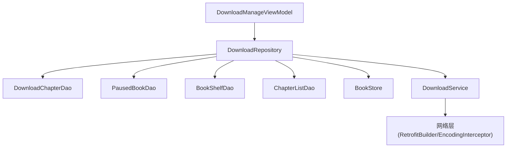

# 电池优化

<cite>
**本文引用的文件**
- [DownloadService.kt](file://module_book/src/main/java/com/ebook/book/service/DownloadService.kt)
- [AndroidManifest.xml（书籍模块）](file://module_book/src/main/AndroidManifest.xml)
- [DownloadRepository.kt](file://module_book/src/main/java/com/ebook/book/repository/DownloadRepository.kt)
- [DownloadManageViewModel.kt](file://module_book/src/main/java/com/ebook/book/mvvm/viewmodel/DownloadManageViewModel.kt)
- [RetrofitBuilder.kt](file://lib_ebook_api/src/main/java/com/ebook/api/RetrofitBuilder.kt)
- [EncodingInterceptor.kt](file://lib_ebook_api/src/main/java/com/ebook/api/intercepter/EncodingInterceptor.kt)
- [0018-download-foreground-service-data-sync-quota.md](file://docs/adr/0018-download-foreground-service-data-sync-quota.md)
</cite>

## 目录
1. [简介](#简介)
2. [项目结构与定位](#项目结构与定位)
3. [核心组件与职责](#核心组件与职责)
4. [架构总览](#架构总览)
5. [详细组件分析](#详细组件分析)
6. [依赖关系与耦合分析](#依赖关系与耦合分析)
7. [性能与功耗特性](#性能与功耗特性)
8. [故障排查指南](#故障排查指南)
9. [结论与建议](#结论与建议)
10. [附录：实践清单与案例](#附录：实践清单与案例)

## 简介
本章节面向电子书应用的“后台任务调度、网络请求控制、前台服务与通知、资源使用”等关键路径，给出系统化的电池优化策略与落地实践。重点覆盖：
- 后台任务调度与批处理
- 唤醒锁与前台服务的生命周期管理
- 网络请求频率控制与合并
- 传感器与定位的节能策略（通用指导）
- 省电模式适配与功能降级
- 电池用量监控与分析方法
- 具体案例与可量化收益预期

## 项目结构与定位
本项目采用多模块结构，下载与后台任务相关能力集中在书籍模块与网络层：
- 书籍模块：提供前台下载服务、下载仓库、下载管理视图模型
- 网络层：统一 Retrofit 构建与编码拦截器，服务于书源抓取与内容读取
- 文档与 ADR：明确前台服务类型、配额限制与启动被拒的处理策略

图表来源
- [DownloadManageViewModel.kt:121-155](file://module_book/src/main/java/com/ebook/book/mvvm/viewmodel/DownloadManageViewModel.kt#L121-L155)
- [DownloadRepository.kt:256-289](file://module_book/src/main/java/com/ebook/book/repository/DownloadRepository.kt#L256-L289)
- [DownloadService.kt:40-124](file://module_book/src/main/java/com/ebook/book/service/DownloadService.kt#L40-L124)
- [RetrofitBuilder.kt:24-44](file://lib_ebook_api/src/main/java/com/ebook/api/RetrofitBuilder.kt#L24-L44)
- [EncodingInterceptor.kt:20-51](file://lib_ebook_api/src/main/java/com/ebook/api/intercepter/EncodingInterceptor.kt#L20-L51)

章节来源
- [AndroidManifest.xml（书籍模块）:14-42](file://module_book/src/main/AndroidManifest.xml#L14-L42)
- [0018-download-foreground-service-data-sync-quota.md:1-59](file://docs/adr/0018-download-foreground-service-data-sync-quota.md#L1-L59)

## 核心组件与职责
- 下载前台服务（DownloadService）
  - 负责逐章抓取、写入本地文件、维护下载队列、状态回传与通知更新
  - 处理 Android 15+ dataSync 前台服务配额超时与启动被拒
  - 通过通知按钮实现暂停/继续/取消等全局动作
- 下载仓库（DownloadRepository）
  - 统一管理下载任务的入库、查询、去重、暂停/继续标记、清理孤儿任务
  - 暴露下载状态流（SharedFlow），供 UI 实时显示进度与终态
  - 统一下发入口：先入库再拉起前台服务，避免启动被拒导致任务丢失
- 下载管理视图模型（DownloadManageViewModel）
  - 聚合按书分组数据、缓存覆盖率、当前活跃章节
  - 发送控制动作（RESUME/PAUSE/CANCEL），并提示启动受限
- 网络层（RetrofitBuilder + EncodingInterceptor）
  - 统一 Retrofit 实例构建与 JSON/Scalars 转换器装配
  - 强制响应体编码，避免站点错误 charset 导致的乱码与无效正文

章节来源
- [DownloadService.kt:40-124](file://module_book/src/main/java/com/ebook/book/service/DownloadService.kt#L40-L124)
- [DownloadRepository.kt:44-119](file://module_book/src/main/java/com/ebook/book/repository/DownloadRepository.kt#L44-L119)
- [DownloadManageViewModel.kt:121-228](file://module_book/src/main/java/com/ebook/book/mvvm/viewmodel/DownloadManageViewModel.kt#L121-L228)
- [RetrofitBuilder.kt:24-44](file://lib_ebook_api/src/main/java/com/ebook/api/RetrofitBuilder.kt#L24-L44)
- [EncodingInterceptor.kt:20-51](file://lib_ebook_api/src/main/java/com/ebook/api/intercepter/EncodingInterceptor.kt#L20-L51)

## 架构总览
下图展示了从用户操作到后台任务执行的全链路，以及关键电池优化点：

图表来源
- [DownloadManageViewModel.kt:212-228](file://module_book/src/main/java/com/ebook/book/mvvm/viewmodel/DownloadManageViewModel.kt#L212-L228)
- [DownloadRepository.kt:256-289](file://module_book/src/main/java/com/ebook/book/repository/DownloadRepository.kt#L256-L289)
- [DownloadService.kt:126-206](file://module_book/src/main/java/com/ebook/book/service/DownloadService.kt#L126-L206)
- [DownloadService.kt:274-378](file://module_book/src/main/java/com/ebook/book/service/DownloadService.kt#L274-L378)
- [AndroidManifest.xml（书籍模块）:27-42](file://module_book/src/main/AndroidManifest.xml#L27-L42)

## 详细组件分析

### 前台服务与任务调度（DownloadService）
- 使用 dataSync 类型前台服务，声明在 Manifest，具备 FOREGROUND_SERVICE_DATA_SYNC 权限
- 启动流程：onStartCommand 中创建通知通道、startForeground，并通过 Intent action 接收控制命令
- 任务循环：按章抓取→校验正文→写入文件→失效缓存→出队→延迟间隔→下一章节
- 失败重试：每章最多重试 N 次，重试前等待以规避瞬时抖动与限流
- 配额与启动限制：onTimeout 只做数秒内可完成的收尾；start() 内部捕获启动被拒异常并返回 false 给调用方
- 通知与状态：常驻通知 LOW 重要性，完成通知 DEFAULT 允许横幅；状态通过 SharedFlow replay=1 同步

图表来源
- [DownloadService.kt:212-247](file://module_book/src/main/java/com/ebook/book/service/DownloadService.kt#L212-L247)
- [DownloadService.kt:274-378](file://module_book/src/main/java/com/ebook/book/service/DownloadService.kt#L274-L378)
- [DownloadService.kt:115-124](file://module_book/src/main/java/com/ebook/book/service/DownloadService.kt#L115-L124)

章节来源
- [DownloadService.kt:40-124](file://module_book/src/main/java/com/ebook/book/service/DownloadService.kt#L40-L124)
- [DownloadService.kt:126-206](file://module_book/src/main/java/com/ebook/book/service/DownloadService.kt#L126-L206)
- [DownloadService.kt:274-378](file://module_book/src/main/java/com/ebook/book/service/DownloadService.kt#L274-L378)
- [AndroidManifest.xml（书籍模块）:27-42](file://module_book/src/main/AndroidManifest.xml#L27-L42)
- [0018-download-foreground-service-data-sync-quota.md:20-38](file://docs/adr/0018-download-foreground-service-data-sync-quota.md#L20-L38)

### 下载仓库与队列策略（DownloadRepository）
- 任务入库去重：按章节 URL 去重，避免重复请求
- 暂停/继续：插入/删除暂停标记，服务取篇时跳过暂停书
- 孤儿清理：当取篇为空时清理不在书架的任务，避免空转耗电
- 状态回传：replay=1 的 SharedFlow，确保晚开页面也能对齐当前进度
- 统一下发入口：先 addTasks 再 startForegroundService，启动被拒不丢任务

图表来源
- [DownloadRepository.kt:44-119](file://module_book/src/main/java/com/ebook/book/repository/DownloadRepository.kt#L44-L119)
- [DownloadRepository.kt:121-205](file://module_book/src/main/java/com/ebook/book/repository/DownloadRepository.kt#L121-L205)
- [DownloadRepository.kt:256-289](file://module_book/src/main/java/com/ebook/book/repository/DownloadRepository.kt#L256-L289)

章节来源
- [DownloadRepository.kt:44-119](file://module_book/src/main/java/com/ebook/book/repository/DownloadRepository.kt#L44-L119)
- [DownloadRepository.kt:121-205](file://module_book/src/main/java/com/ebook/book/repository/DownloadRepository.kt#L121-L205)
- [DownloadRepository.kt:256-289](file://module_book/src/main/java/com/ebook/book/repository/DownloadRepository.kt#L256-L289)

### 网络层与编码处理（RetrofitBuilder + EncodingInterceptor）
- RetrofitBuilder：复用 Hilt 注入的 Call.Factory，装配 JSON/Scalars 转换器，避免自建 OkHttpClient
- EncodingInterceptor：强制响应体 Content-Type 为指定 charset，流式透传避免全量缓冲，减少内存与 CPU 开销

图表来源
- [RetrofitBuilder.kt:24-44](file://lib_ebook_api/src/main/java/com/ebook/api/RetrofitBuilder.kt#L24-L44)
- [EncodingInterceptor.kt:20-51](file://lib_ebook_api/src/main/java/com/ebook/api/intercepter/EncodingInterceptor.kt#L20-L51)

章节来源
- [RetrofitBuilder.kt:24-44](file://lib_ebook_api/src/main/java/com/ebook/api/RetrofitBuilder.kt#L24-L44)
- [EncodingInterceptor.kt:20-51](file://lib_ebook_api/src/main/java/com/ebook/api/intercepter/EncodingInterceptor.kt#L20-L51)

### 通知与状态回传（DownloadService）
- 常驻通知：LOW 重要性，setOngoing=true，setOnlyAlertOnce=true，避免频繁提醒
- 完成通知：DEFAULT 重要性，允许弹一次横幅，便于用户知晓结果
- 状态回传：Progress/Paused/Finished，replay=1 保证晚开页面立即对齐
- 通知不可用兜底：跳过通知发送但不中断下载流程

章节来源
- [DownloadService.kt:466-600](file://module_book/src/main/java/com/ebook/book/service/DownloadService.kt#L466-L600)
- [DownloadService.kt:557-600](file://module_book/src/main/java/com/ebook/book/service/DownloadService.kt#L557-L600)

## 依赖关系与耦合分析
- DownloadManageViewModel 依赖 DownloadRepository 进行数据聚合与控制动作下发
- DownloadRepository 依赖多个 DAO 与 BookStore，形成下载任务的事实源与缓存判据
- DownloadService 依赖 DownloadRepository 获取任务与状态，依赖网络层抓取内容
- 网络层通过 RetrofitBuilder 与 EncodingInterceptor 统一构建与处理响应，降低耦合

图表来源
- [DownloadManageViewModel.kt:121-228](file://module_book/src/main/java/com/ebook/book/mvvm/viewmodel/DownloadManageViewModel.kt#L121-L228)
- [DownloadRepository.kt:44-119](file://module_book/src/main/java/com/ebook/book/repository/DownloadRepository.kt#L44-L119)
- [DownloadService.kt:274-378](file://module_book/src/main/java/com/ebook/book/service/DownloadService.kt#L274-L378)
- [RetrofitBuilder.kt:24-44](file://lib_ebook_api/src/main/java/com/ebook/api/RetrofitBuilder.kt#L24-L44)

章节来源
- [DownloadManageViewModel.kt:121-228](file://module_book/src/main/java/com/ebook/book/mvvm/viewmodel/DownloadManageViewModel.kt#L121-L228)
- [DownloadRepository.kt:44-119](file://module_book/src/main/java/com/ebook/book/repository/DownloadRepository.kt#L44-L119)
- [DownloadService.kt:274-378](file://module_book/src/main/java/com/ebook/book/service/DownloadService.kt#L274-L378)

## 性能与功耗特性
- 任务批处理与频率控制
  - 章节间延迟间隔（CHAPTER_INTERVAL_MS）降低对站点的请求压力，减少 CPU 与网络占用
  - 单章失败重试（RETRY_TIMES）配合重试延迟（RETRY_DELAY_MS），避开瞬时抖动与限流
- 前台服务与通知优化
  - dataSync 类型前台服务，受系统配额限制（24h 累计 6h），onTimeout 快速收尾避免异常
  - 通知分通道：进行中 LOW、完成 DEFAULT，减少打扰与电量消耗
- 网络请求优化
  - 编码拦截器强制 charset，避免乱码导致的无效正文与重复请求
  - 流式响应体，避免全量缓冲，降低内存峰值与 GC 压力
- 缓存与失效
  - 强制刷新时失效进程级章节缓存，避免旧内容命中，减少冗余读取
  - 已缓存章节直接出队，避免重复抓取

章节来源
- [DownloadService.kt:274-378](file://module_book/src/main/java/com/ebook/book/service/DownloadService.kt#L274-L378)
- [DownloadService.kt:115-124](file://module_book/src/main/java/com/ebook/book/service/DownloadService.kt#L115-L124)
- [EncodingInterceptor.kt:20-51](file://lib_ebook_api/src/main/java/com/ebook/api/intercepter/EncodingInterceptor.kt#L20-L51)
- [0018-download-foreground-service-data-sync-quota.md:20-38](file://docs/adr/0018-download-foreground-service-data-sync-quota.md#L20-L38)

## 故障排查指南
- 前台服务启动被拒
  - 现象：点击“开始/继续”无响应或闪退
  - 原因：dataSync 配额用尽或后台启动限制
  - 处理：DownloadService.start() 捕获异常返回 false，UI 提示用户；任务已在库中，稍后重试
- 配额超时
  - 现象：下载运行一段时间后停止
  - 原因：Android 15+ dataSync 24h 累计 6h 上限
  - 处理：onTimeout 快速收尾，恢复前台后从下载管理页继续
- 通知不可用
  - 现象：无法看到进度或完成通知
  - 处理：代码会跳过通知发送但不中断下载；建议用户开启通知权限
- 正文解析失败
  - 现象：章节内容为空或乱码
  - 处理：编码拦截器强制 charset；空正文判定为失败并触发重试；重试耗尽则出队并记录跳过

章节来源
- [DownloadService.kt:115-124](file://module_book/src/main/java/com/ebook/book/service/DownloadService.kt#L115-L124)
- [DownloadService.kt:274-378](file://module_book/src/main/java/com/ebook/book/service/DownloadService.kt#L274-L378)
- [DownloadRepository.kt:256-289](file://module_book/src/main/java/com/ebook/book/repository/DownloadRepository.kt#L256-L289)
- [EncodingInterceptor.kt:20-51](file://lib_ebook_api/src/main/java/com/ebook/api/intercepter/EncodingInterceptor.kt#L20-L51)

## 结论与建议
- 使用 dataSync 前台服务承载长耗时下载，结合 onTimeout 快速收尾，避免异常耗电与崩溃
- 通过章节间隔与重试延迟控制网络请求频率，降低服务器压力与设备功耗
- 利用通知通道与状态回传提升用户体验，同时避免不必要的提醒与资源占用
- 网络层统一编码与流式处理，减少内存与 CPU 开销，提高稳定性
- 建议在后续版本中评估 WorkManager 迁移条件（如单批次下载常超 6h 的真实反馈）

## 附录：实践清单与案例

### 后台任务调度优化
- 使用前台服务（dataSync）而非普通后台服务，符合系统配额与生命周期管理
- 任务入库优先于服务启动，避免启动被拒导致任务丢失
- 章节间隔与重试延迟控制请求频率，避免瞬时抖动与限流

章节来源
- [AndroidManifest.xml（书籍模块）:27-42](file://module_book/src/main/AndroidManifest.xml#L27-L42)
- [DownloadRepository.kt:256-289](file://module_book/src/main/java/com/ebook/book/repository/DownloadRepository.kt#L256-L289)
- [DownloadService.kt:274-378](file://module_book/src/main/java/com/ebook/book/service/DownloadService.kt#L274-L378)

### 唤醒锁与前台服务
- 使用 dataSync 类型前台服务，遵守系统配额限制
- onTimeout 仅做数秒内可完成的收尾，禁止 IO 或网络操作
- 通知不可用时不中断下载流程，确保任务继续执行

章节来源
- [DownloadService.kt:115-124](file://module_book/src/main/java/com/ebook/book/service/DownloadService.kt#L115-L124)
- [DownloadService.kt:466-600](file://module_book/src/main/java/com/ebook/book/service/DownloadService.kt#L466-L600)

### 网络请求频率控制
- 章节间隔（CHAPTER_INTERVAL_MS）与重试延迟（RETRY_DELAY_MS）降低请求频率
- 编码拦截器强制 charset，避免乱码导致的无效请求
- 流式响应体减少内存占用与 GC 压力

章节来源
- [DownloadService.kt:274-378](file://module_book/src/main/java/com/ebook/book/service/DownloadService.kt#L274-L378)
- [EncodingInterceptor.kt:20-51](file://lib_ebook_api/src/main/java/com/ebook/api/intercepter/EncodingInterceptor.kt#L20-L51)

### 传感器与定位服务（通用指导）
- 精度调整：根据需求选择高精度或低功耗模式，避免不必要的高精度定位
- 频率控制：合理设置采样频率，避免高频采样导致电量快速消耗
- 条件启用：仅在需要时启用传感器与定位，使用后及时关闭

### 前台服务的影响与管理
- 通知优化：使用 LOW 重要性常驻通知，完成通知允许横幅，减少打扰
- 任务效率：章节间隔与重试延迟降低网络压力，提升整体效率
- 生命周期管理：onTimeout 快速收尾，避免异常耗电与崩溃

章节来源
- [DownloadService.kt:466-600](file://module_book/src/main/java/com/ebook/book/service/DownloadService.kt#L466-L600)
- [DownloadService.kt:115-124](file://module_book/src/main/java/com/ebook/book/service/DownloadService.kt#L115-L124)

### 电池监控与分析工具
- 使用系统电池用量统计：查看应用耗电占比与后台活动
- 耗电应用分析：识别异常耗电行为，如频繁网络请求或长时间前台服务
- 性能指标收集：监控 CPU、内存、网络请求频率与时长

### 省电模式适配
- 功能降级：在低电量模式下减少后台任务频率或暂停非关键任务
- 限制后台活动：避免在后台进行高耗电操作，如大量网络请求
- 优化资源使用：减少不必要的计算与 I/O，提升能效

### 电池优化案例与收益预期
- 章节间隔与重试延迟：显著降低网络请求频率，减少服务器压力与设备功耗
- 前台服务配额管理：避免长时间前台服务导致的电量快速消耗
- 编码拦截器：减少乱码导致的无效请求，提升解析成功率与能效

章节来源
- [DownloadService.kt:274-378](file://module_book/src/main/java/com/ebook/book/service/DownloadService.kt#L274-L378)
- [0018-download-foreground-service-data-sync-quota.md:20-38](file://docs/adr/0018-download-foreground-service-data-sync-quota.md#L20-L38)