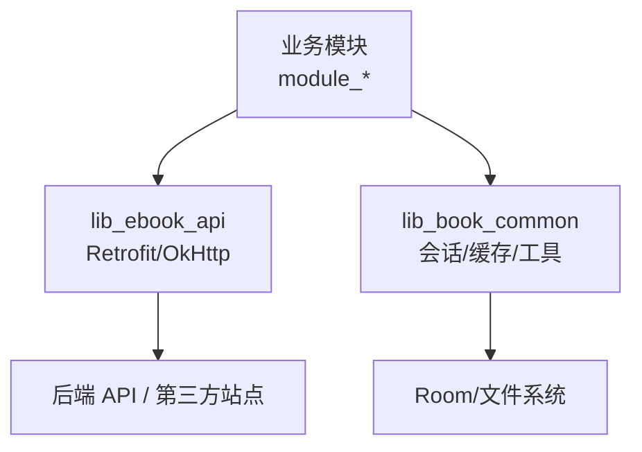
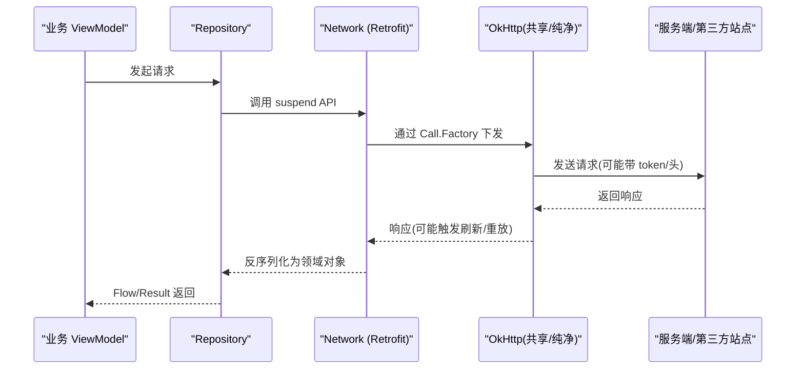
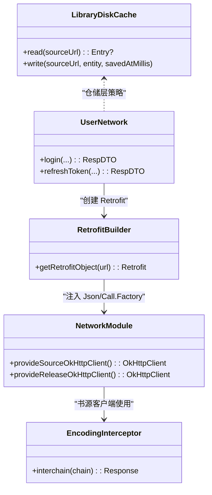

# 网络请求优化

<cite>
**本文引用的文件**
- [RetrofitBuilder.kt](file://lib_ebook_api/src/main/java/com/ebook/api/RetrofitBuilder.kt)
- [NetworkModule.kt](file://lib_ebook_api/src/main/java/com/ebook/api/utils/NetworkModule.kt)
- [EncodingInterceptor.kt](file://lib_ebook_api/src/main/java/com/ebook/api/intercepter/EncodingInterceptor.kt)
- [BookSourceService.kt](file://lib_ebook_api/src/main/java/com/ebook/api/service/source/BookSourceService.kt)
- [UserNetwork.kt](file://lib_ebook_api/src/main/java/com/ebook/api/service/user/UserNetwork.kt)
- [LibraryDiskCache.kt](file://lib_book_common/src/main/java/com/ebook/common/analyze/source/LibraryDiskCache.kt)
- [SessionTokenRefresher.kt](file://lib_book_common/src/main/java/com/ebook/common/domain/SessionTokenRefresher.kt)
- [AndroidUserSessionManager.kt](file://lib_book_common/src/main/java/com/ebook/common/domain/AndroidUserSessionManager.kt)
- [ReleaseRepository.kt](file://module_me/src/main/java/com/ebook/me/repository/ReleaseRepository.kt)
- [ReleaseNetworkTest.kt](file://lib_ebook_api/src/main/java/com/ebook/api/service/release/ReleaseNetworkTest.kt)
- [ReleaseDataSource.kt](file://lib_ebook_api/src/main/java/com/ebook/api/service/release/ReleaseDataSource.kt)
</cite>

## 目录
1. [引言](#引言)
2. [项目结构](#项目结构)
3. [核心组件](#核心组件)
4. [架构总览](#架构总览)
5. [详细组件分析](#详细组件分析)
6. [依赖关系分析](#依赖关系分析)
7. [性能考量](#性能考量)
8. [故障排查指南](#故障排查指南)
9. [结论](#结论)

## 引言
本文件聚焦项目的网络层优化策略与最佳实践，覆盖 Retrofit 与 OkHttp 的配置优化、连接池与超时、重试与退避、拦截器（编码/认证/日志）的性能考量、请求合并与批量处理、缓存体系（HTTP 与应用层）、并发控制与限流、错误处理与熔断思路，以及监控与分析方法。内容基于仓库内实际代码与配置进行说明，避免臆测，确保可落地执行。

## 项目结构
网络能力集中在 lib_ebook_api（Retrofit/OkHttp 构建与服务接口）与 lib_book_common（会话刷新、通用存储），业务模块通过 Repository/ViewModel 调用网络服务。书源解析在 lib_book_source，其网络访问受沙箱与白名单约束。应用层缓存位于 lib_book_common 的磁盘缓存实现。

图表来源
- [RetrofitBuilder.kt:24-44](file://lib_ebook_api/src/main/java/com/ebook/api/RetrofitBuilder.kt#L24-L44)
- [NetworkModule.kt:48-71](file://lib_ebook_api/src/main/java/com/ebook/api/utils/NetworkModule.kt#L48-L71)
- [LibraryDiskCache.kt:35-113](file://lib_book_common/src/main/java/com/ebook/common/analyze/source/LibraryDiskCache.kt#L35-L113)

章节来源
- [RetrofitBuilder.kt:24-44](file://lib_ebook_api/src/main/java/com/ebook/api/RetrofitBuilder.kt#L24-L44)
- [NetworkModule.kt:19-71](file://lib_ebook_api/src/main/java/com/ebook/api/utils/NetworkModule.kt#L19-L71)

## 核心组件
- Retrofit 构建器：统一注入 kotlinx-serialization 转换器与共享 Call.Factory，避免重复创建 OkHttpClient；每个 Network 类可按需构造独立 Retrofit 实例。
- OkHttp 客户端：区分“认证客户端”（由共享库提供，含认证拦截器、白名单、调试脱敏日志）与“纯净客户端”（书源 release 与发布检查专用，不带 token）。
- 编码拦截器：以公开 API 改写响应体 Content-Type，保证第三方站点乱码场景下的正确解码，且保持流式读取避免全量缓冲。
- 会话刷新：在认证链路中集中处理 access token 过期后的静默刷新与重放，失败时上报会话过期事件，由上层统一处置。
- 书库磁盘缓存：按源分区落盘 JSON，读写原子化，损坏自愈，TTL 策略由仓库层决定，存储层只负责存取。

章节来源
- [RetrofitBuilder.kt:13-44](file://lib_ebook_api/src/main/java/com/ebook/api/RetrofitBuilder.kt#L13-L44)
- [NetworkModule.kt:35-71](file://lib_ebook_api/src/main/java/com/ebook/api/utils/NetworkModule.kt#L35-L71)
- [EncodingInterceptor.kt:10-51](file://lib_ebook_api/src/main/java/com/ebook/api/intercepter/EncodingInterceptor.kt#L10-L51)
- [SessionTokenRefresher.kt](file://lib_book_common/src/main/java/com/ebook/common/domain/SessionTokenRefresher.kt)
- [AndroidUserSessionManager.kt](file://lib_book_common/src/main/java/com/ebook/common/domain/AndroidUserSessionManager.kt)
- [LibraryDiskCache.kt:13-113](file://lib_book_common/src/main/java/com/ebook/common/analyze/source/LibraryDiskCache.kt#L13-L113)

## 架构总览
网络层采用“分层 + 多客户端”设计：
- 认证链路与安全策略下沉到共享库（token 注入、白名单、debug 脱敏日志），业务侧无需关心细节。
- 书源与发布检查使用独立纯净客户端，隔离凭证与超时策略。
- Retrofit 作为声明式 HTTP 客户端，配合 Kotlinx Serialization 统一序列化；Scalars 用于原始文本（如书源 HTML）。
- 应用层缓存（书库数据）与 HTTP 缓存解耦：仓储层负责 TTL 与 SWR 策略，存储层仅负责可靠落盘与读取。

图表来源
- [RetrofitBuilder.kt:34-44](file://lib_ebook_api/src/main/java/com/ebook/api/RetrofitBuilder.kt#L34-L44)
- [NetworkModule.kt:35-71](file://lib_ebook_api/src/main/java/com/ebook/api/utils/NetworkModule.kt#L35-L71)
- [UserNetwork.kt:20-67](file://lib_ebook_api/src/main/java/com/ebook/api/service/user/UserNetwork.kt#L20-L67)

## 详细组件分析

### Retrofit 与 OkHttp 配置优化
- 连接池与超时
  - 书源客户端：connect/read/write 均为 10s，快速失败，减少第三方站点的长尾等待。
  - 发布检查客户端：同样 10s 超时，面向公开 API，稳定短请求。
  - 认证客户端：由共享库提供（默认约 30s 超时），承载登录/鉴权等敏感链路。
- 转换器
  - 优先注册 kotlinx-serialization 转换器，复用 Hilt 注入的 Json 配置（忽略未知字段等），保证与 mock 链路一致。
  - 追加 Scalars 转换器以支持 String 返回类型（如书源 HTML）。
- 客户端复用
  - 通过 Call.Factory 注入共享 OkHttp，避免重复创建导致连接池失效。
  - 不同信任域使用不同命名客户端（@Named("source"/"release")），杜绝 token 泄漏给第三方站点。

章节来源
- [NetworkModule.kt:48-71](file://lib_ebook_api/src/main/java/com/ebook/api/utils/NetworkModule.kt#L48-L71)
- [RetrofitBuilder.kt:24-44](file://lib_ebook_api/src/main/java/com/ebook/api/RetrofitBuilder.kt#L24-L44)

### 拦截器：编码、认证、日志
- 编码拦截器
  - 将第三方站点响应体的 Content-Type 强制改写为 rss+xml;charset=指定编码，正文流式透传不缓冲，避免全量内存占用。
  - 使用 OkHttp 公开 API 包装 ResponseBody，避免反射私有字段导致的兼容性与混淆问题。
- 认证拦截器
  - 由共享库提供的 Call.Factory 注入，仅在白名单 host 附加 Authorization 头；冷启动为空，首个请求后补 token。
- 日志拦截器
  - debug 模式下脱敏日志，记录关键路径而不暴露敏感信息。

章节来源
- [EncodingInterceptor.kt:10-51](file://lib_ebook_api/src/main/java/com/ebook/api/intercepter/EncodingInterceptor.kt#L10-L51)
- [NetworkModule.kt:35-43](file://lib_ebook_api/src/main/java/com/ebook/api/utils/NetworkModule.kt#L35-L43)

### 请求合并与批量处理
- 当前仓库未实现统一的请求合并/批量框架。建议：
  - 对同源同键的短时并发读请求，使用 Flow/StateFlow 合并或单飞机制，避免重复拉取。
  - 列表页分页加载结合本地缓存，先返回旧数据再静默刷新（SWR）。
  - 对非关键路径的请求做节流与去重（如搜索防抖、列表滚动中的预取）。

[本节为概念性建议，无直接文件引用]

### 缓存策略：HTTP 缓存与应用层缓存
- HTTP 缓存
  - 仓库未在全局 OkHttp 中启用内置磁盘缓存；对于纯静态资源或第三方站点，可在对应客户端按需启用并设置 Cache-Control 头。
- 应用层缓存
  - 书库数据采用磁盘 JSON 缓存（按源分区，文件名 MD5 化），写入使用临时文件+原子替换，读取失败自动清理损坏文件。
  - 缓存策略（TTL 6 小时、SWR、下拉强刷）由仓储层（BookSourceRepository）决定，存储层不持有策略常量，避免口径不一致。
- 缓存失效
  - 写操作覆盖旧文件；读取异常删除损坏文件自愈；策略层根据时间戳判定新鲜度并决定是否回源。

章节来源
- [LibraryDiskCache.kt:13-113](file://lib_book_common/src/main/java/com/ebook/common/analyze/source/LibraryDiskCache.kt#L13-L113)

### 并发控制与限流
- 当前仓库未在 OkHttp 层集中实现令牌桶/漏桶限流。建议：
  - 使用协程调度器限制并发度（如 `Dispatchers.IO.limitedParallelism`）。
  - 针对热点接口加全局锁或信号量，避免瞬时风暴。
  - 书源解析端点可引入指数退避的重试，防止对第三方站点造成压力。
- 下载与后台任务遵循前台服务配额约定，避免被系统限制。

[本节为概念性建议，无直接文件引用]

### 错误处理与重试逻辑
- 会话过期处理
  - 首个请求发现 token 过期时，尝试静默刷新；成功则重放原请求；失败则发出会话过期事件，由上层统一跳转登录与清会话。
- 指数退避与熔断
  - 建议在公共重试封装中加入指数退避与最大重试次数；对频繁失败的远端节点加入熔断（短路）与半开探测，避免雪崩。
- 书源解析容错
  - 解析失败应抛出类型化异常，由上层统一收集与降级（如切换源、提示用户）。

章节来源
- [SessionTokenRefresher.kt](file://lib_book_common/src/main/java/com/ebook/common/domain/SessionTokenRefresher.kt)
- [AndroidUserSessionManager.kt](file://lib_book_common/src/main/java/com/ebook/common/domain/AndroidUserSessionManager.kt)

### 监控与分析
- 建议采集指标
  - 请求耗时（首字节、端到端）、成功率、失败分类（超时/4xx/5xx/网络错误）、带宽消耗、重试次数、缓存命中率。
- 实现方式
  - 通过 OkHttp 拦截器统一埋点，区分认证/书源/发布三类客户端。
  - 与崩溃/性能平台对接，按端点聚合指标；对慢接口告警。
- 回归验证
  - 借助测试资产与 MockNetworkModule，在不连后端的情况下验证拦截器、序列化与缓存路径。

[本节为概念性建议，无直接文件引用]

## 依赖关系分析
- 认证链路：业务 → Retrofit → 共享 Call.Factory（AuthInterceptor/白名单/日志）→ 服务端。
- 书源链路：业务 → BookSourceService（动态 URL）→ @Named("source") 纯净客户端 → 第三方站点。
- 发布检查：业务 → @Named("release") 客户端 → GitHub/Gitcode Releases API。
- 缓存链路：仓储层决策 → LibraryDiskCache 读写 → 文件系统。

图表来源
- [RetrofitBuilder.kt:24-44](file://lib_ebook_api/src/main/java/com/ebook/api/RetrofitBuilder.kt#L24-L44)
- [NetworkModule.kt:48-71](file://lib_ebook_api/src/main/java/com/ebook/api/utils/NetworkModule.kt#L48-L71)
- [EncodingInterceptor.kt:20-51](file://lib_ebook_api/src/main/java/com/ebook/api/intercepter/EncodingInterceptor.kt#L20-L51)
- [UserNetwork.kt:20-67](file://lib_ebook_api/src/main/java/com/ebook/api/service/user/UserNetwork.kt#L20-L67)
- [LibraryDiskCache.kt:35-113](file://lib_book_common/src/main/java/com/ebook/common/analyze/source/LibraryDiskCache.kt#L35-L113)

章节来源
- [RetrofitBuilder.kt:24-44](file://lib_ebook_api/src/main/java/com/ebook/api/RetrofitBuilder.kt#L24-L44)
- [NetworkModule.kt:48-71](file://lib_ebook_api/src/main/java/com/ebook/api/utils/NetworkModule.kt#L48-L71)
- [UserNetwork.kt:20-67](file://lib_ebook_api/src/main/java/com/ebook/api/service/user/UserNetwork.kt#L20-L67)
- [LibraryDiskCache.kt:35-113](file://lib_book_common/src/main/java/com/ebook/common/analyze/source/LibraryDiskCache.kt#L35-L113)

## 性能考量
- 连接复用
  - 通过共享 Call.Factory 复用 OkHttp 实例，确保连接池生效，减少握手开销。
- 超时配置
  - 书源与发布检查均 10s 超时，避免第三方站点拖垮主流程。
- 流式响应
  - 编码拦截器保持 contentLength=-1，下游按流读取，避免大响应体驻留内存。
- 序列化优化
  - 使用 kotlinx-serialization 并忽略未知字段，提高兼容性同时减少解析失败成本。
- 缓存命中
  - 书库数据走磁盘缓存，仓储层控制 TTL/SWR，降低网络往返。

章节来源
- [RetrofitBuilder.kt:34-44](file://lib_ebook_api/src/main/java/com/ebook/api/RetrofitBuilder.kt#L34-L44)
- [NetworkModule.kt:48-71](file://lib_ebook_api/src/main/java/com/ebook/api/utils/NetworkModule.kt#L48-L71)
- [EncodingInterceptor.kt:36-51](file://lib_ebook_api/src/main/java/com/ebook/api/intercepter/EncodingInterceptor.kt#L36-L51)
- [LibraryDiskCache.kt:64-94](file://lib_book_common/src/main/java/com/ebook/common/analyze/source/LibraryDiskCache.kt#L64-L94)

## 故障排查指南
- 乱码问题
  - 确认是否经过编码拦截器；检查第三方站点返回的 Content-Type 与 charset 是否与预期一致。
- 页面不加载/空数据
  - 检查是否因本地网络权限限制导致直连本机失败；建议使用 adb reverse 与回环地址调试。
  - 核对仓储层缓存 TTL 与 SWR 策略，必要时清除缓存重新拉取。
- 会话过期
  - 观察是否触发静默刷新与重放；若刷新失败，确认会话过期事件是否被上层正确处理。
- 第三方站点超时
  - 书源客户端超时较短，关注网络质量与站点稳定性；必要时在上层增加重试与退避。

章节来源
- [EncodingInterceptor.kt:20-51](file://lib_ebook_api/src/main/java/com/ebook/api/intercepter/EncodingInterceptor.kt#L20-L51)
- [SessionTokenRefresher.kt](file://lib_book_common/src/main/java/com/ebook/common/domain/SessionTokenRefresher.kt)
- [AndroidUserSessionManager.kt](file://lib_book_common/src/main/java/com/ebook/common/domain/AndroidUserSessionManager.kt)
- [LibraryDiskCache.kt:51-62](file://lib_book_common/src/main/java/com/ebook/common/analyze/source/LibraryDiskCache.kt#L51-L62)

## 结论
本项目在网络层采用了清晰的“共享认证链 + 多客户端隔离 + 应用层缓存”的方案：通过共享 Call.Factory 统一安全与日志，按信任域拆分客户端以避免凭证泄露，用流式响应与合理超时提升鲁棒性，书库数据以磁盘缓存配合仓储层策略提升体验。未来可在请求合并、全局限流、统一重试/熔断与监控埋点方面继续增强，进一步提升在高并发与不稳定网络下的可用性与性能。