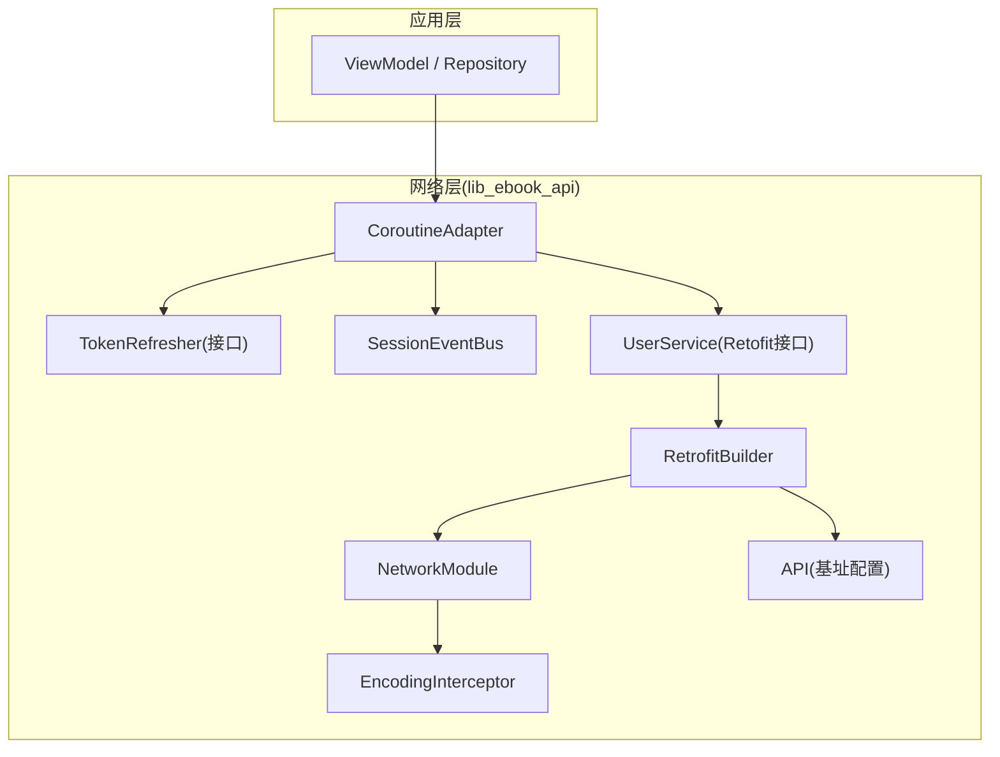
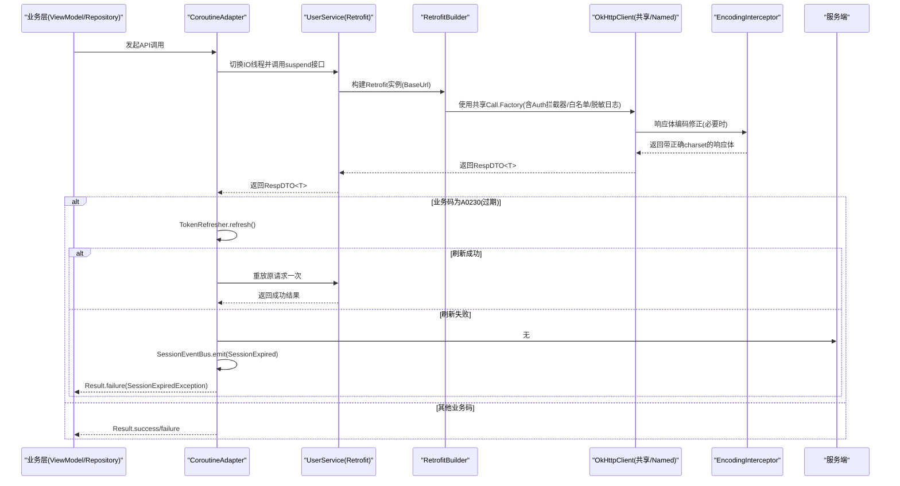
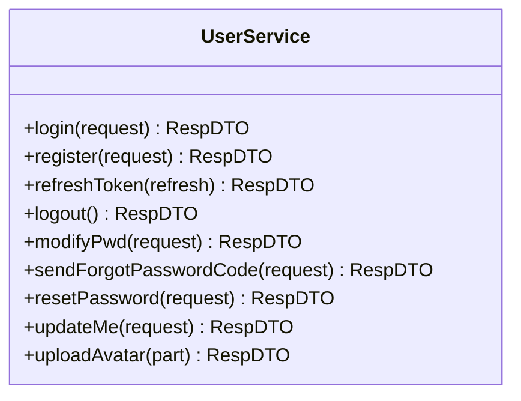
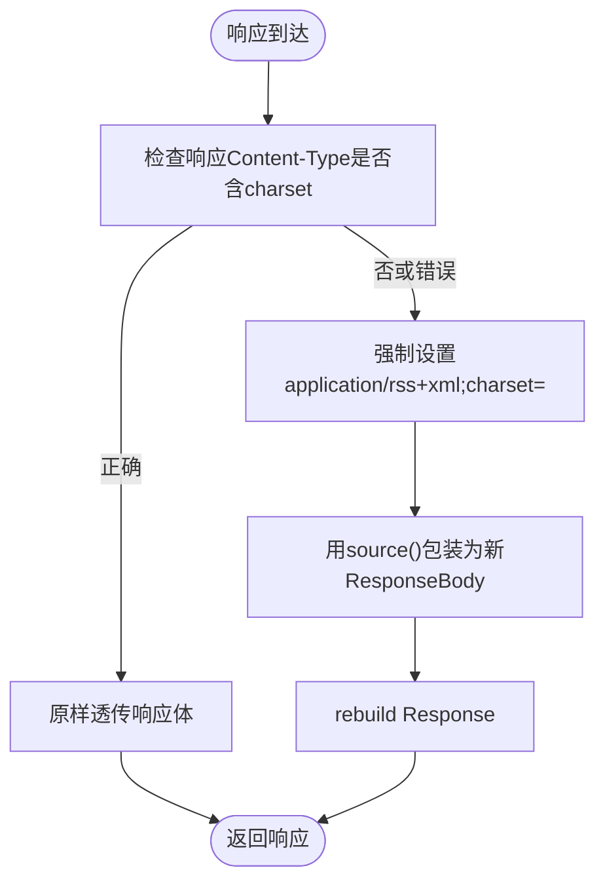
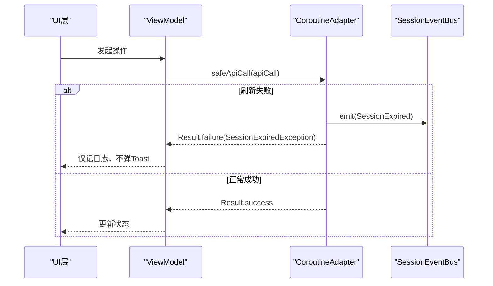
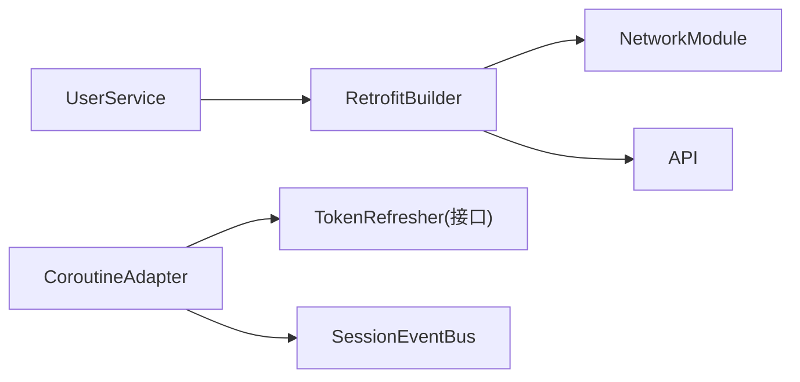

# API集成

<cite>
**本文引用的文件**   
- [RetrofitBuilder.kt](file://lib_ebook_api/src/main/java/com/ebook/api/RetrofitBuilder.kt)
- [NetworkModule.kt](file://lib_ebook_api/src/main/java/com/ebook/api/utils/NetworkModule.kt)
- [API.kt](file://lib_ebook_api/src/main/java/com/ebook/api/config/API.kt)
- [EncodingInterceptor.kt](file://lib_ebook_api/src/main/java/com/ebook/api/intercepter/EncodingInterceptor.kt)
- [CoroutineAdapter.kt](file://lib_ebook_api/src/main/java/com/ebook/api/utils/CoroutineAdapter.kt)
- [TokenRefresher.kt](file://lib_ebook_api/src/main/java/com/ebook/api/auth/TokenRefresher.kt)
- [SessionEventBus.kt](file://lib_ebook_api/src/main/java/com/ebook/api/auth/SessionEventBus.kt)
- [UserService.kt](file://lib_ebook_api/src/main/java/com/ebook/api/service/user/UserService.kt)
</cite>

## 目录
1. [简介](#简介)
2. [项目结构](#项目结构)
3. [核心组件](#核心组件)
4. [架构总览](#架构总览)
5. [详细组件分析](#详细组件分析)
6. [依赖关系分析](#依赖关系分析)
7. [性能与可靠性](#性能与可靠性)
8. [故障排查指南](#故障排查指南)
9. [结论](#结论)
10. [附录：示例调用清单](#附录示例调用清单)

## 简介
本指南面向需要在项目中集成第三方服务与SDK的开发者，聚焦网络层的Retrofit服务定义、OkHttp拦截器开发、网络客户端配置、异步数据处理、数据序列化配置、以及安全与版本兼容性策略。本项目基于Kotlin协程与Flow，采用MVVM与Hilt依赖注入，网络层通过统一的适配器封装错误与认证刷新逻辑，保证上层业务代码简洁且健壮。

## 项目结构
网络相关能力集中在 lib_ebook_api 模块中，关键职责划分如下：
- Retrofit构建与转换器装配：RetrofitBuilder
- OkHttp客户端与拦截器：NetworkModule（提供多个Named客户端）、EncodingInterceptor
- API服务接口：UserService等（以Retrofit注解声明端点）
- 统一请求适配与错误处理：CoroutineAdapter
- 会话与认证：TokenRefresher、SessionEventBus
- 基础URL配置：API常量对象

图表来源
- [RetrofitBuilder.kt:13-45](file://lib_ebook_api/src/main/java/com/ebook/api/RetrofitBuilder.kt#L13-L45)
- [NetworkModule.kt:19-72](file://lib_ebook_api/src/main/java/com/ebook/api/utils/NetworkModule.kt#L19-L72)
- [EncodingInterceptor.kt:10-51](file://lib_ebook_api/src/main/java/com/ebook/api/intercepter/EncodingInterceptor.kt#L10-L51)
- [CoroutineAdapter.kt:17-150](file://lib_ebook_api/src/main/java/com/ebook/api/utils/CoroutineAdapter.kt#L17-L150)
- [TokenRefresher.kt:1-27](file://lib_ebook_api/src/main/java/com/ebook/api/auth/TokenRefresher.kt#L1-L27)
- [SessionEventBus.kt:9-44](file://lib_ebook_api/src/main/java/com/ebook/api/auth/SessionEventBus.kt#L9-L44)
- [UserService.kt:22-72](file://lib_ebook_api/src/main/java/com/ebook/api/service/user/UserService.kt#L22-L72)
- [API.kt:5-25](file://lib_ebook_api/src/main/java/com/ebook/api/config/API.kt#L5-L25)

章节来源
- [RetrofitBuilder.kt:13-45](file://lib_ebook_api/src/main/java/com/ebook/api/RetrofitBuilder.kt#L13-L45)
- [NetworkModule.kt:19-72](file://lib_ebook_api/src/main/java/com/ebook/api/utils/NetworkModule.kt#L19-L72)
- [API.kt:5-25](file://lib_ebook_api/src/main/java/com/ebook/api/config/API.kt#L5-L25)

## 核心组件
- Retrofit构建器：负责组装Base URL、JSON转换器、Scalars转换器与共享Call.Factory，避免重复创建OkHttpClient，确保debug日志脱敏与白名单控制由共享链路提供。
- 网络模块：集中提供Json配置、不同用途的OkHttpClient（书源纯净客户端、发布检查纯净客户端），并绑定允许附加认证头的白名单主机。
- 编码拦截器：针对第三方站点响应体Content-Type缺省或错误的情况，强制设置正确的字符集，并以流式方式透传正文，避免全量缓冲。
- 统一适配器：将网络调用切换到IO线程、把RespDTO的业务码转换为Result、对A0230过期进行静默刷新并重放一次请求、对会话不可恢复事件统一上抛给UI层处置。
- 会话与认证：TokenRefresher为可替换的刷新接口；SessionEventBus通过SharedFlow发射“会话已过期”事件，由上层订阅后执行清会话与跳转登录。
- 服务接口：使用Retrofit注解声明RESTful端点，包含JSON Body、Multipart上传等常见形态。

章节来源
- [RetrofitBuilder.kt:13-45](file://lib_ebook_api/src/main/java/com/ebook/api/RetrofitBuilder.kt#L13-L45)
- [NetworkModule.kt:19-72](file://lib_ebook_api/src/main/java/com/ebook/api/utils/NetworkModule.kt#L19-L72)
- [EncodingInterceptor.kt:10-51](file://lib_ebook_api/src/main/java/com/ebook/api/intercepter/EncodingInterceptor.kt#L10-L51)
- [CoroutineAdapter.kt:17-150](file://lib_ebook_api/src/main/java/com/ebook/api/utils/CoroutineAdapter.kt#L17-L150)
- [TokenRefresher.kt:1-27](file://lib_ebook_api/src/main/java/com/ebook/api/auth/TokenRefresher.kt#L1-L27)
- [SessionEventBus.kt:9-44](file://lib_ebook_api/src/main/java/com/ebook/api/auth/SessionEventBus.kt#L9-L44)
- [UserService.kt:22-72](file://lib_ebook_api/src/main/java/com/ebook/api/service/user/UserService.kt#L22-L72)

## 架构总览
下图展示了从业务层到网络层的完整调用链，包括认证拦截、编码处理、异常转换与会话过期处理流程。

图表来源
- [CoroutineAdapter.kt:17-150](file://lib_ebook_api/src/main/java/com/ebook/api/utils/CoroutineAdapter.kt#L17-L150)
- [RetrofitBuilder.kt:13-45](file://lib_ebook_api/src/main/java/com/ebook/api/RetrofitBuilder.kt#L13-L45)
- [NetworkModule.kt:19-72](file://lib_ebook_api/src/main/java/com/ebook/api/utils/NetworkModule.kt#L19-L72)
- [EncodingInterceptor.kt:10-51](file://lib_ebook_api/src/main/java/com/ebook/api/intercepter/EncodingInterceptor.kt#L10-L51)
- [TokenRefresher.kt:1-27](file://lib_ebook_api/src/main/java/com/ebook/api/auth/TokenRefresher.kt#L1-L27)
- [SessionEventBus.kt:9-44](file://lib_ebook_api/src/main/java/com/ebook/api/auth/SessionEventBus.kt#L9-L44)

## 详细组件分析

### Retrofit服务定义
- 接口设计：使用@POST/@PUT/@Multipart等注解声明RESTful端点，Body参数使用请求DTO，返回值统一为RespDTO<T>，便于统一业务码封装。
- 请求参数：JSON Body字段通过DTO描述；文件上传使用MultipartBody.Part。
- 响应处理：统一通过CoroutineAdapter将RespDTO转为Result，并在业务码为A0230时触发静默刷新与重放。
- 错误处理：非业务异常经统一处理器转换；业务异常封装为ApiException并携带原始消息；会话过期异常标记为已全局处置，调用方仅记日志不再提示。

图表来源
- [UserService.kt:22-72](file://lib_ebook_api/src/main/java/com/ebook/api/service/user/UserService.kt#L22-L72)

章节来源
- [UserService.kt:22-72](file://lib_ebook_api/src/main/java/com/ebook/api/service/user/UserService.kt#L22-L72)
- [CoroutineAdapter.kt:17-150](file://lib_ebook_api/src/main/java/com/ebook/api/utils/CoroutineAdapter.kt#L17-L150)

### OkHttp拦截器开发
- 请求拦截：由共享Call.Factory提供（来自lib_common），内置AuthInterceptor与白名单控制、调试日志脱敏，避免在库内重复实现。
- 响应拦截：EncodingInterceptor针对第三方站点的响应体Content-Type缺失或错误场景，强制设置正确的字符集，并使用流式ResponseBody避免全量缓冲。
- 日志记录：通过共享Call.Factory注入的拦截器完成，保持debug模式下的安全输出。
- 认证处理：认证头仅在白名单主机附加，第三方书源请求走@Named("source")纯净客户端，不泄露用户token。

图表来源
- [EncodingInterceptor.kt:10-51](file://lib_ebook_api/src/main/java/com/ebook/api/intercepter/EncodingInterceptor.kt#L10-L51)

章节来源
- [EncodingInterceptor.kt:10-51](file://lib_ebook_api/src/main/java/com/ebook/api/intercepter/EncodingInterceptor.kt#L10-L51)
- [NetworkModule.kt:35-72](file://lib_ebook_api/src/main/java/com/ebook/api/utils/NetworkModule.kt#L35-L72)

### 网络客户端配置
- 连接池与超时：
  - 书源客户端：连接/写入/读取超时均为10秒，快速失败以适配第三方站点。
  - 发布检查客户端：连接/读取超时10秒，纯公开API。
  - 认证客户端：复用共享Call.Factory（由lib_common提供），具备统一超时与拦截器。
- SSL证书管理：通过共享OkHttp配置，建议在生产环境按平台规范配置信任域与证书固定；当前仓库未在此处暴露自定义TrustManager，如需定制应在上层装配点统一注入。
- Base URL：通过API对象注入BuildConfig中的主机地址，端口与服务端对齐，避免硬编码。

章节来源
- [NetworkModule.kt:35-72](file://lib_ebook_api/src/main/java/com/ebook/api/utils/NetworkModule.kt#L35-L72)
- [API.kt:5-25](file://lib_ebook_api/src/main/java/com/ebook/api/config/API.kt#L5-L25)
- [RetrofitBuilder.kt:13-45](file://lib_ebook_api/src/main/java/com/ebook/api/RetrofitBuilder.kt#L13-L45)

### 异步数据处理
- 协程封装：所有API调用使用suspend函数，通过CoroutineAdapter在IO调度器执行，避免阻塞主线程。
- Flow流式处理：会话事件通过SharedFlow发射，UI层订阅后统一处理会话过期事件。
- 取消机制：CancellationException不被吞掉，确保页面销毁或任务取消时不会误发会话过期事件或产生副作用。

图表来源
- [CoroutineAdapter.kt:17-150](file://lib_ebook_api/src/main/java/com/ebook/api/utils/CoroutineAdapter.kt#L17-L150)
- [SessionEventBus.kt:9-44](file://lib_ebook_api/src/main/java/com/ebook/api/auth/SessionEventBus.kt#L9-L44)

章节来源
- [CoroutineAdapter.kt:17-150](file://lib_ebook_api/src/main/java/com/ebook/api/utils/CoroutineAdapter.kt#L17-L150)
- [SessionEventBus.kt:9-44](file://lib_ebook_api/src/main/java/com/ebook/api/auth/SessionEventBus.kt#L9-L44)

### 数据序列化配置
- JSON格式化：启用prettyPrint便于调试，ignoreUnknownKeys提升向后兼容性。
- 日期处理：默认由kotlinx.serialization处理；如需自定义日期格式，可在上层提供的Json配置中扩展，或通过@Serializable字段类型约定。
- 自定义转换器：Retrofit优先注册kotlinx序列化转换器，随后注册Scalars转换器以支持String返回类型（如HTML）。

章节来源
- [NetworkModule.kt:19-27](file://lib_ebook_api/src/main/java/com/ebook/api/utils/NetworkModule.kt#L19-L27)
- [RetrofitBuilder.kt:13-45](file://lib_ebook_api/src/main/java/com/ebook/api/RetrofitBuilder.kt#L13-L45)

### 具体API集成示例
- RESTful API调用：参考UserService中的登录、注册、刷新token、登出、修改密码、发送验证码、重置密码、更新用户信息等方法。
- WebSocket连接：当前仓库未提供WebSocket实现；若需接入，建议在共享OkHttp装配点增加WebSocket相关配置，并通过Hilt注入到业务层。
- 文件上传下载：头像上传使用MultipartBody.Part；大文件下载建议在业务层结合协程与Flow分块处理，注意取消与重试策略。

章节来源
- [UserService.kt:22-72](file://lib_ebook_api/src/main/java/com/ebook/api/service/user/UserService.kt#L22-L72)

### 网络层安全考虑
- HTTPS配置：Base URL应使用HTTPS；如需自签证书或私有CA，请在上层共享OkHttp装配点统一配置。
- 证书固定：建议在可信域内实施证书固定，防止中间人攻击；具体策略由上层网络装配点决定。
- 敏感信息保护：认证头仅在白名单主机附加，第三方书源请求走纯净客户端，避免token泄露。

章节来源
- [NetworkModule.kt:35-72](file://lib_ebook_api/src/main/java/com/ebook/api/utils/NetworkModule.kt#L35-L72)
- [RetrofitBuilder.kt:13-45](file://lib_ebook_api/src/main/java/com/ebook/api/RetrofitBuilder.kt#L13-L45)

### API版本管理与兼容性处理
- 向后兼容：JSON忽略未知键，降低服务端新增字段对客户端的影响。
- 废弃API处理：通过服务接口版本化或路由路径前缀区分；旧接口逐步下线时保留过渡期兼容。
- 降级策略：当后端不可用时，可结合本地缓存与离线数据展示；对于A0230过期，尝试静默刷新，失败则引导重新登录。

章节来源
- [NetworkModule.kt:19-27](file://lib_ebook_api/src/main/java/com/ebook/api/utils/NetworkModule.kt#L19-L27)
- [CoroutineAdapter.kt:17-150](file://lib_ebook_api/src/main/java/com/ebook/api/utils/CoroutineAdapter.kt#L17-L150)

## 依赖关系分析
- 耦合与内聚：
  - RetrofitBuilder与NetworkModule解耦：前者专注Retrofit装配，后者提供OkHttp与Json配置。
  - CoroutineAdapter与TokenRefresher/SessionEventBus低耦合：通过接口与事件总线解耦刷新实现与事件消费。
- 外部依赖：
  - 共享Call.Factory来自lib_common，承担认证、白名单与日志脱敏。
  - kotlinx.serialization用于JSON解析。
  - Retrofit与Scalars转换器用于HTTP与字符串响应。
- 循环依赖防护：RetrofitBuilder通过Lazy注入Call.Factory，避免Hilt循环依赖。

图表来源
- [RetrofitBuilder.kt:13-45](file://lib_ebook_api/src/main/java/com/ebook/api/RetrofitBuilder.kt#L13-L45)
- [NetworkModule.kt:19-72](file://lib_ebook_api/src/main/java/com/ebook/api/utils/NetworkModule.kt#L19-L72)
- [CoroutineAdapter.kt:17-150](file://lib_ebook_api/src/main/java/com/ebook/api/utils/CoroutineAdapter.kt#L17-L150)
- [TokenRefresher.kt:1-27](file://lib_ebook_api/src/main/java/com/ebook/api/auth/TokenRefresher.kt#L1-L27)
- [SessionEventBus.kt:9-44](file://lib_ebook_api/src/main/java/com/ebook/api/auth/SessionEventBus.kt#L9-L44)
- [UserService.kt:22-72](file://lib_ebook_api/src/main/java/com/ebook/api/service/user/UserService.kt#L22-L72)

章节来源
- [RetrofitBuilder.kt:13-45](file://lib_ebook_api/src/main/java/com/ebook/api/RetrofitBuilder.kt#L13-L45)
- [NetworkModule.kt:19-72](file://lib_ebook_api/src/main/java/com/ebook/api/utils/NetworkModule.kt#L19-L72)
- [CoroutineAdapter.kt:17-150](file://lib_ebook_api/src/main/java/com/ebook/api/utils/CoroutineAdapter.kt#L17-L150)

## 性能与可靠性
- 连接池与超时：书源客户端短超时快速失败，避免拖慢用户体验；认证客户端复用共享配置，减少资源开销。
- 流式响应：EncodingInterceptor以流式方式处理响应体，避免大文件内存压力。
- 并发控制：TokenRefresher单飞刷新，避免刷新风暴；SessionEventBus缓冲容量为1，丢弃重复事件，降低UI抖动。
- 错误收敛：统一异常处理与业务码转换，减少分散的错误分支，提高可维护性。

[本节为通用指导，无需特定文件引用]

## 故障排查指南
- 现象：页面不闪退但数据永远加载不出来
  - 可能原因：JSON资产与返回类型不匹配、编码错误导致乱码、A0230刷新失败未触发全局处置。
  - 排查步骤：
    - 检查ApiResponse业务码是否为A0230，确认静默刷新是否被调用。
    - 校验JSON资产与DTO字段一致，特别是分页包裹结构。
    - 查看EncodingInterceptor是否正确设置charset。
- 现象：第三方站点中文乱码
  - 可能原因：响应Content-Type未声明charset或声明错误。
  - 解决：确认EncodingInterceptor生效，或使用@Named("source")客户端。
- 现象：登录后仍提示会话过期
  - 可能原因：刷新失败或服务端拒绝refresh token。
  - 解决：检查TokenRefresher实现与后端刷新接口；确认SessionEventBus事件已被订阅并触发登录页跳转。

章节来源
- [CoroutineAdapter.kt:17-150](file://lib_ebook_api/src/main/java/com/ebook/api/utils/CoroutineAdapter.kt#L17-L150)
- [EncodingInterceptor.kt:10-51](file://lib_ebook_api/src/main/java/com/ebook/api/intercepter/EncodingInterceptor.kt#L10-L51)
- [SessionEventBus.kt:9-44](file://lib_ebook_api/src/main/java/com/ebook/api/auth/SessionEventBus.kt#L9-L44)

## 结论
本项目网络层通过Retrofit与OkHttp的组合，配合统一的适配器与拦截器，实现了简洁、安全、可靠的API集成方案。开发者只需关注业务接口定义与调用，无需关心底层细节。未来如需扩展WebSocket或更复杂的传输协议，可在共享OkHttp装配点统一接入，保持架构一致性。

[本节为总结性内容，无需特定文件引用]

## 附录：示例调用清单
- 登录：POST /api/auth/login，Body为邮箱+密码，返回RespDTO<LoginDTO>
- 注册：POST /api/auth/register，Body为邮箱+验证码+密码，返回RespDTO<Unit>
- 刷新token：POST /api/auth/refresh，Body为RefreshTokenRequest，返回RespDTO<LoginDTO>
- 登出：POST /api/auth/logout，返回RespDTO<Unit>
- 修改密码：PUT /api/users/me/password，Body为ModifyPwdRequest，返回RespDTO<Unit>
- 发送验证码：POST /api/auth/send-code 或 /api/auth/forgot-password/send-code，返回RespDTO<Unit>
- 重置密码：POST /api/auth/forgot-password/reset，Body为ResetPasswordRequest，返回RespDTO<Unit>
- 更新用户信息：PUT /api/users/me，Body为UpdateUserRequest，返回RespDTO<User>
- 上传头像：POST /api/uploads/avatar，Multipart，Part名为avatar，返回RespDTO<UploadResponse>

章节来源
- [UserService.kt:22-72](file://lib_ebook_api/src/main/java/com/ebook/api/service/user/UserService.kt#L22-L72)