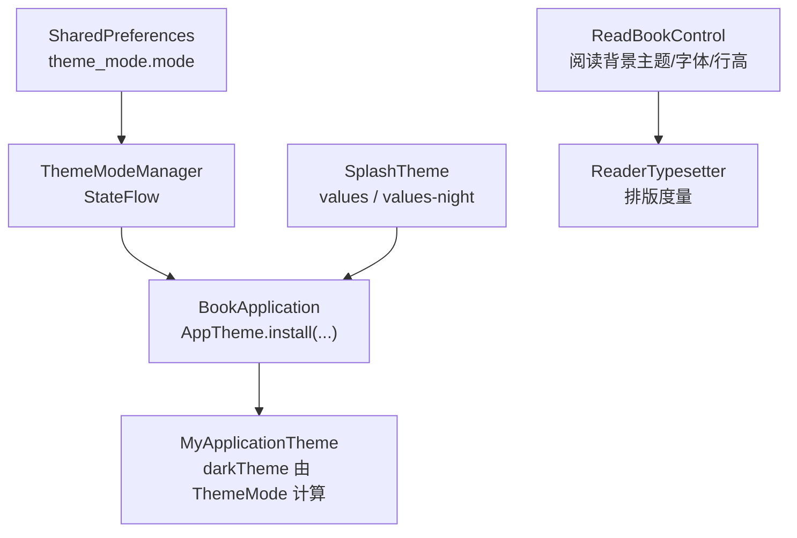
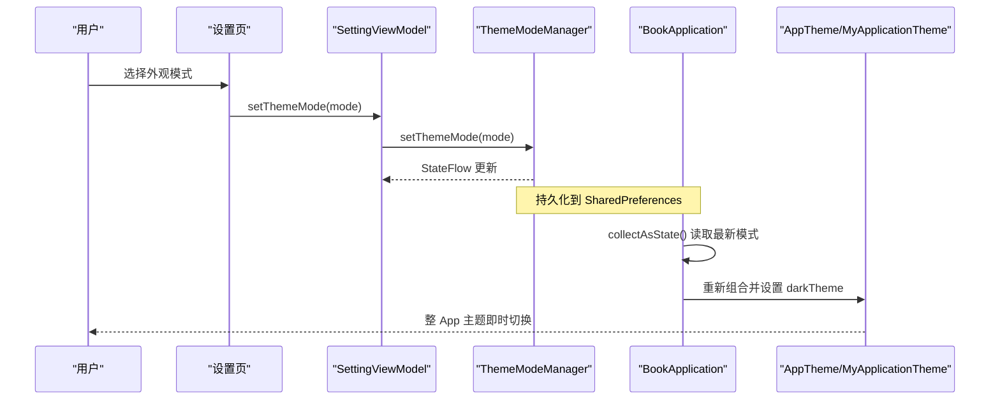
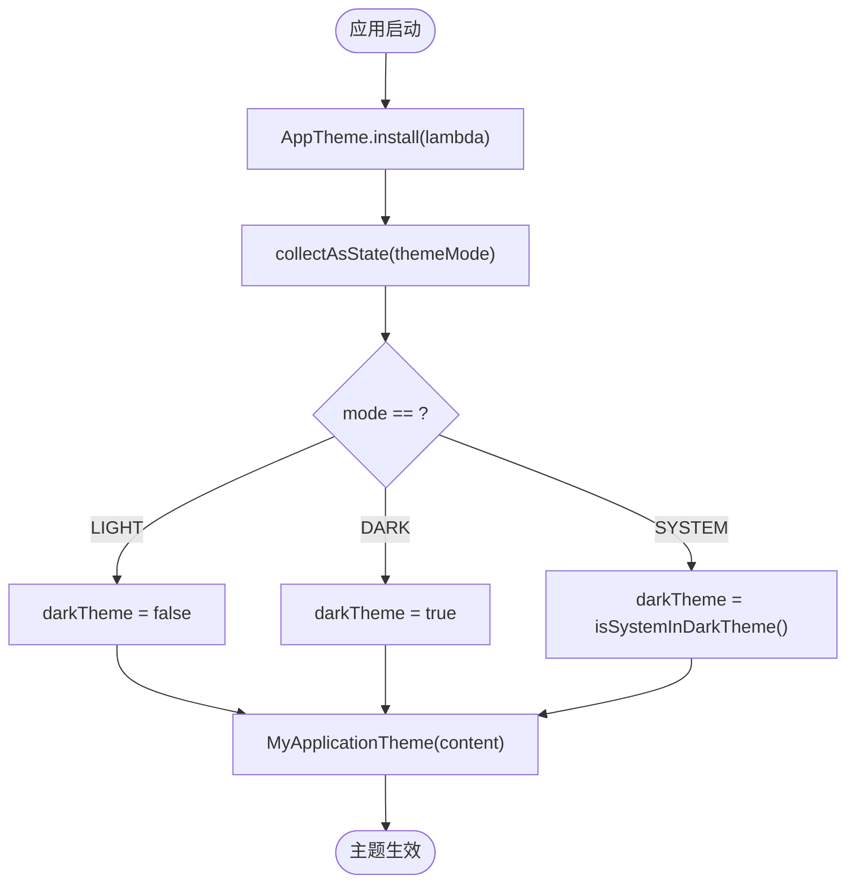
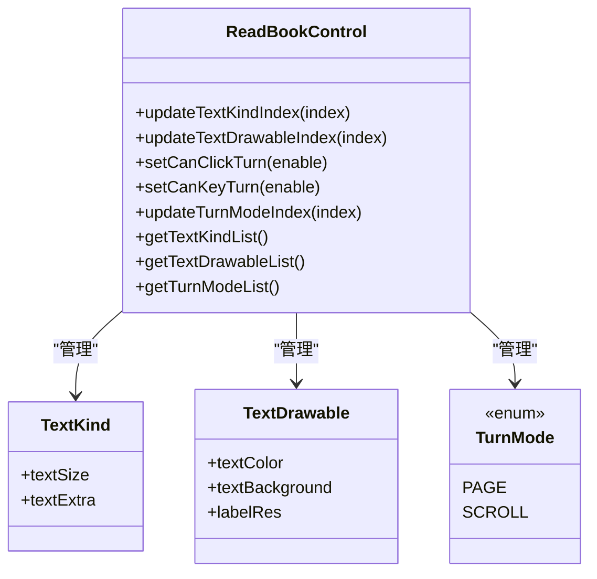
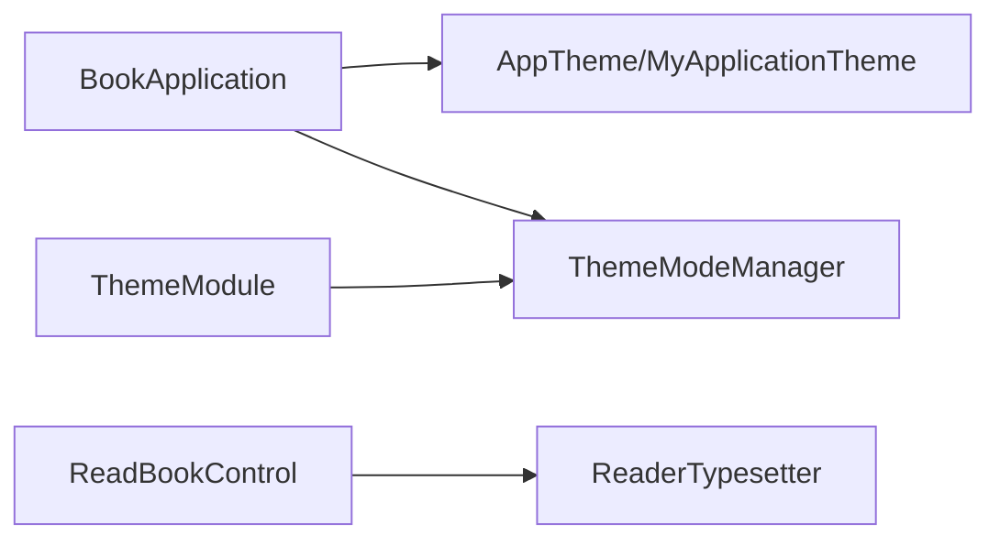

# 主题定制

<cite>
**本文引用的文件**
- [ThemeModeManager.kt](file://lib_book_common/src/main/java/com/ebook/common/domain/ThemeModeManager.kt)
- [ThemeModule.kt](file://lib_book_common/src/main/java/com/ebook/common/di/ThemeModule.kt)
- [BookApplication.kt](file://lib_book_common/src/main/java/com/ebook/common/BookApplication.kt)
- [theme.xml](file://module_main/src/main/res/values/theme.xml)
- [theme.xml (night)](file://module_main/src/main/res/values-night/theme.xml)
- [ReadBookControl.kt](file://module_book/src/main/java/com/ebook/book/view/ReadBookControl.kt)
- [ReaderTypesetter.kt](file://module_book/src/main/java/com/ebook/book/reader/ReaderTypesetter.kt)
- [SettingActivity.kt](file://module_me/src/main/java/com/ebook/me/view/SettingActivity.kt)
- [SettingViewModel.kt](file://module_me/src/main/java/com/ebook/me/mvvm/viewmodel/SettingViewModel.kt)
</cite>

## 目录
1. [简介](#简介)
2. [项目结构](#项目结构)
3. [核心组件](#核心组件)
4. [架构总览](#架构总览)
5. [详细组件分析](#详细组件分析)
6. [依赖关系分析](#依赖关系分析)
7. [性能考量](#性能考量)
8. [故障排查指南](#故障排查指南)
9. [结论](#结论)
10. [附录](#附录)

## 简介
本指南面向开发者，系统化说明如何在本工程中自定义应用的外观与风格，覆盖 Material Design 主题扩展、Compose 主题系统、图标资源管理、暗色模式支持、阅读界面主题定制、示例实践、测试方法与性能优化。内容以仓库内实现为依据，确保可直接落地。

## 项目结构
- 全局主题装配在 Application 层完成：通过 lib_common 的 AppTheme 装配点，将 MyApplicationTheme 注入到整个 Compose 树，并根据用户选择的 ThemeMode（浅色/深色/跟随系统）决定 darkTheme。
- 用户偏好持久化由 ThemeModeManager 负责，使用 SharedPreferences 保存 theme_mode.mode；其 StateFlow 暴露当前值，配合 Compose 重组即时生效。
- 启动屏 SplashTheme 在 values 与 values-night 分别提供不同背景与动画图标，保证启动体验与明暗主题一致。
- 阅读界面拥有独立的“阅读背景主题”体系，由 ReadBookControl 维护纸张色与字体样式列表，并通过 ReaderTypesetter 统一排版度量，避免分页与渲染不一致。

**图表来源**
- [BookApplication.kt:29-48](file://lib_book_common/src/main/java/com/ebook/common/BookApplication.kt#L29-L48)
- [ThemeModeManager.kt:44-92](file://lib_book_common/src/main/java/com/ebook/common/domain/ThemeModeManager.kt#L44-L92)
- [theme.xml](file://module_main/src/main/res/values/theme.xml#L1-L14)
- [theme.xml (night)](file://module_main/src/main/res/values-night/theme.xml#L1-L12)
- [ReadBookControl.kt:20-67](file://module_book/src/main/java/com/ebook/book/view/ReadBookControl.kt#L20-L67)
- [ReaderTypesetter.kt:18-28](file://module_book/src/main/java/com/ebook/book/reader/ReaderTypesetter.kt#L18-L28)

**章节来源**
- [BookApplication.kt:17-49](file://lib_book_common/src/main/java/com/ebook/common/BookApplication.kt#L17-L49)
- [ThemeModeManager.kt:10-92](file://lib_book_common/src/main/java/com/ebook/common/domain/ThemeModeManager.kt#L10-L92)
- [theme.xml:1-14](file://module_main/src/main/res/values/theme.xml#L1-L14)
- [theme.xml (night):1-12](file://module_main/src/main/res/values-night/theme.xml#L1-L12)
- [ReadBookControl.kt:1-157](file://module_book/src/main/java/com/ebook/book/view/ReadBookControl.kt#L1-L157)
- [ReaderTypesetter.kt:1-80](file://module_book/src/main/java/com/ebook/book/reader/ReaderTypesetter.kt#L1-L80)

## 核心组件
- 外观主题模式与持久化：ThemeModeManager 提供三态主题（LIGHT/DARK/SYSTEM），并暴露 StateFlow；默认跟随系统。
- Hilt 模块：ThemeModule 将 ThemeModeManager 以单例形式提供。
- 应用级主题装配：BookApplication 在 onCreate 中安装 AppTheme，根据 ThemeModeManager 当前值设置 darkTheme，使全局主题即时切换。
- 启动屏主题：SplashTheme 在 values 与 values-night 中分别定义背景与动画图标，postSplashScreenTheme 指向通用主题。
- 阅读界面主题：ReadBookControl 维护字体样式与纸张背景主题，ReaderTypesetter 统一排版度量，保证分页与渲染一致性。

**章节来源**
- [ThemeModeManager.kt:10-92](file://lib_book_common/src/main/java/com/ebook/common/domain/ThemeModeManager.kt#L10-L92)
- [ThemeModule.kt:10-26](file://lib_book_common/src/main/java/com/ebook/common/di/ThemeModule.kt#L10-L26)
- [BookApplication.kt:17-49](file://lib_book_common/src/main/java/com/ebook/common/BookApplication.kt#L17-L49)
- [theme.xml:1-14](file://module_main/src/main/res/values/theme.xml#L1-L14)
- [theme.xml (night):1-12](file://module_main/src/main/res/values-night/theme.xml#L1-L12)
- [ReadBookControl.kt:1-157](file://module_book/src/main/java/com/ebook/book/view/ReadBookControl.kt#L1-L157)
- [ReaderTypesetter.kt:1-80](file://module_book/src/main/java/com/ebook/book/reader/ReaderTypesetter.kt#L1-L80)

## 架构总览
应用主题分为两层：
- 全局主题层：由 BookApplication 装配 MyApplicationTheme，darkTheme 依据 ThemeMode 决定（强制浅色/强制深色/跟随系统）。
- 阅读界面层：正文背景主题由 ReadBookControl 管理四档纸张色与字体样式，不受全局深浅色切换影响；控制器层（顶栏、底栏、面板、弹窗）继承全局主题。

**图表来源**
- [ThemeModeManager.kt:44-92](file://lib_book_common/src/main/java/com/ebook/common/domain/ThemeModeManager.kt#L44-L92)
- [BookApplication.kt:29-48](file://lib_book_common/src/main/java/com/ebook/common/BookApplication.kt#L29-L48)

**章节来源**
- [SettingActivity.kt](file://module_me/src/main/java/com/ebook/me/view/SettingActivity.kt)
- [SettingViewModel.kt](file://module_me/src/main/java/com/ebook/me/mvvm/viewmodel/SettingViewModel.kt)
- [ThemeModeManager.kt:44-92](file://lib_book_common/src/main/java/com/ebook/common/domain/ThemeModeManager.kt#L44-L92)
- [BookApplication.kt:29-48](file://lib_book_common/src/main/java/com/ebook/common/BookApplication.kt#L29-L48)

## 详细组件分析

### 全局主题装配与暗色模式
- 三态主题：LIGHT、DARK、SYSTEM，默认 SYSTEM（跟随系统）。
- 持久化：SharedPreferences 中 theme_mode 文件键 mode 保存当前枚举名。
- 装配时机：BookApplication.onCreate 中通过 AppTheme.install 包裹 MyApplicationTheme，并在 Compose 重组时读取最新的 StateFlow 值来决定 darkTheme。
- 入口：设置页调用 ThemeModeManager.setThemeMode 写入并推进状态流，触发重组。

**图表来源**
- [BookApplication.kt:29-48](file://lib_book_common/src/main/java/com/ebook/common/BookApplication.kt#L29-L48)
- [ThemeModeManager.kt:44-92](file://lib_book_common/src/main/java/com/ebook/common/domain/ThemeModeManager.kt#L44-L92)

**章节来源**
- [ThemeModeManager.kt:10-92](file://lib_book_common/src/main/java/com/ebook/common/domain/ThemeModeManager.kt#L10-L92)
- [BookApplication.kt:17-49](file://lib_book_common/src/main/java/com/ebook/common/BookApplication.kt#L17-L49)

### 启动屏主题与多密度适配
- values/theme.xml 与 values-night/theme.xml 分别定义 SplashTheme 的背景色与动画图标，postSplashScreenTheme 指向通用主题，确保启动过渡自然。
- 通过 Android 资源限定符（如 drawable-v24、mipmap-anydpi-v26）进行图标多密度适配，保证在不同 DPI 设备上显示清晰。

**章节来源**
- [theme.xml:1-14](file://module_main/src/main/res/values/theme.xml#L1-L14)
- [theme.xml (night):1-12](file://module_main/src/main/res/values-night/theme.xml#L1-L12)

### 阅读界面主题定制
- 纸张背景主题：ReadBookControl 内置四档纸张主题（白/黄/绿/黑），每档包含文本颜色与背景颜色，并提供展示标签资源索引，用于设置面板色卡匹配。
- 字体样式：内置多档字号与行距组合，按索引持久化；默认值保证老用户升级后行为不变。
- 翻页方式：左右翻页（PAGE）与上下滚屏（SCROLL），通过 TurnModeIndex 持久化，默认 PAGE。
- 排版度量：ReaderTypesetter 提供统一的 TextStyle、TextMeasurer 与 Density，保证分页与渲染同源，避免断行差异导致的丢行或页数错乱。

**图表来源**
- [ReadBookControl.kt:20-67](file://module_book/src/main/java/com/ebook/book/view/ReadBookControl.kt#L20-L67)
- [ReadBookControl.kt:70-157](file://module_book/src/main/java/com/ebook/book/view/ReadBookControl.kt#L70-L157)

**章节来源**
- [ReadBookControl.kt:1-157](file://module_book/src/main/java/com/ebook/book/view/ReadBookControl.kt#L1-L157)
- [ReaderTypesetter.kt:18-80](file://module_book/src/main/java/com/ebook/book/reader/ReaderTypesetter.kt#L18-L80)

### 图标资源管理
- 矢量图标：建议使用 VectorDrawable 以减少资源体积并提升缩放质量；在项目各模块 res 下按规范放置，并通过命名空间访问。
- 多密度适配：使用 mipmap-*/drawable-* 等限定符为不同 DPI 提供位图资源；矢量图标自动适配密度。
- 主题图标切换：通过 values/values-night 资源目录区分不同主题的图标或颜色，或在代码中根据当前主题动态选择 painterResource。

[本节为通用指导，不直接分析具体文件]

### 暗色模式支持与用户偏好存储
- 用户偏好：ThemeModeManager 以 SharedPreferences 存储 theme_mode.mode，默认 SYSTEM。
- 自动切换：当 mode 为 SYSTEM 时，依据系统 isSystemInDarkTheme() 决定暗色。
- 即时生效：StateFlow 变化触发 Compose 重组，AppTheme 重新计算 darkTheme，整 App 主题切换无延迟。

**章节来源**
- [ThemeModeManager.kt:44-92](file://lib_book_common/src/main/java/com/ebook/common/domain/ThemeModeManager.kt#L44-L92)
- [BookApplication.kt:29-48](file://lib_book_common/src/main/java/com/ebook/common/BookApplication.kt#L29-L48)

### 主题定制示例
- 品牌色彩应用：在 lib_common 的 AppTheme 装配点替换 dynamicColor 或 colorScheme 配置即可全局生效；页面无需改动。
- 自定义控件样式：基于 Material Theme 语义色与 typography 调整组件样式，避免硬编码颜色。
- 动画效果实现：在主题切换时结合 Compose 动画，对关键 UI 元素做过渡，提升视觉连贯性。

[本节为通用指导，不直接分析具体文件]

## 依赖关系分析
- BookApplication 依赖 lib_common 的 AppTheme 装配点，注入 MyApplicationTheme。
- ThemeModeManager 被 ThemeModule 以 Singleton 提供，并在 Application 初始化完成后挂入伴生对象供 Compose 组装读取。
- 阅读界面通过 ReadBookControl 与 ReaderTypesetter 解耦“样式”和“排版”，保证分页与渲染一致性。

**图表来源**
- [BookApplication.kt:29-48](file://lib_book_common/src/main/java/com/ebook/common/BookApplication.kt#L29-L48)
- [ThemeModule.kt:10-26](file://lib_book_common/src/main/java/com/ebook/common/di/ThemeModule.kt#L10-L26)
- [ReadBookControl.kt:1-157](file://module_book/src/main/java/com/ebook/book/view/ReadBookControl.kt#L1-L157)
- [ReaderTypesetter.kt:18-80](file://module_book/src/main/java/com/ebook/book/reader/ReaderTypesetter.kt#L18-L80)

**章节来源**
- [ThemeModule.kt:10-26](file://lib_book_common/src/main/java/com/ebook/common/di/ThemeModule.kt#L10-L26)
- [BookApplication.kt:17-49](file://lib_book_common/src/main/java/com/ebook/common/BookApplication.kt#L17-L49)
- [ReadBookControl.kt:1-157](file://module_book/src/main/java/com/ebook/book/view/ReadBookControl.kt#L1-L157)
- [ReaderTypesetter.kt:18-80](file://module_book/src/main/java/com/ebook/book/reader/ReaderTypesetter.kt#L18-L80)

## 性能考量
- 主题切换开销：ThemeModeManager 通过 StateFlow 减少不必要的重组范围；仅在必要作用域收集状态，避免全树重建。
- 阅读界面排版：ReaderTypesetter 的 lineStartOffsets 会按章测量，超长章节可能产生 N×CPU 开销；建议在调用侧按“章节+字号”粒度缓存偏移，降低重复重排成本。
- 资源加载：SplashTheme 与图标资源应尽量使用矢量或合理密度位图，减少解码与内存占用；按需加载图片资源，避免首帧阻塞。
- 内存控制：避免在主题相关逻辑中持有大对象引用；使用 remember 缓存排版与测量结果，防止重组时重复分配。

**章节来源**
- [ReaderTypesetter.kt:35-41](file://module_book/src/main/java/com/ebook/book/reader/ReaderTypesetter.kt#L35-L41)
- [ReadBookControl.kt:95-113](file://module_book/src/main/java/com/ebook/book/view/ReadBookControl.kt#L95-L113)

## 故障排查指南
- 主题未生效：确认 ThemeModeManager.instance 已安装且 StateFlow 有值；检查 BookApplication 是否在 setContent 之前完成装配。
- 启动屏主题异常：核对 values 与 values-night 中的 SplashTheme 配置是否正确，postSplashScreenTheme 是否指向通用主题。
- 阅读界面字体或行高异常：确认 ReadBookControl 的 textKindIndex/textDrawableIndex 是否越界；检查 ReaderTypesetter 的样式与测量宽度是否一致。
- 暗色模式切换卡顿：确认 StateFlow 收集位置与重组边界，避免在高频重组处执行耗时操作。

**章节来源**
- [BookApplication.kt:29-48](file://lib_book_common/src/main/java/com/ebook/common/BookApplication.kt#L29-L48)
- [theme.xml:1-14](file://module_main/src/main/res/values/theme.xml#L1-L14)
- [theme.xml (night):1-12](file://module_main/src/main/res/values-night/theme.xml#L1-L12)
- [ReadBookControl.kt:95-113](file://module_book/src/main/java/com/ebook/book/view/ReadBookControl.kt#L95-L113)
- [ReaderTypesetter.kt:35-41](file://module_book/src/main/java/com/ebook/book/reader/ReaderTypesetter.kt#L35-L41)

## 结论
本项目通过 Application 层的 AppTheme 装配与 ThemeModeManager 的状态驱动，实现了全局主题的统一管理与即时切换；阅读界面采用独立的背景主题与排版引擎，保证内容与控制的视觉一致性。遵循 Material Theme 语义与资源组织规范，可实现品牌色彩、字体样式、形状定义与暗色模式的灵活定制，同时兼顾性能与可维护性。

## 附录
- 主题测试方法建议：
  - 视觉效果验证：在不同设备与系统版本上切换 LIGHT/DARK/SYSTEM，观察全局与阅读界面配色是否符合预期。
  - 跨设备兼容性测试：覆盖不同 DPI、屏幕尺寸与方向，确保图标与排版无溢出或错位。
  - 无障碍支持检查：对比度满足 WCAG 标准，字体大小可调且可读性良好。
- 主题性能调优建议：
  - 使用 remember 缓存排版与测量结果，避免重复计算。
  - 合理使用资源限定符与矢量图标，减少内存占用。
  - 在设置页与主题切换路径中避免阻塞主线程。

[本节为通用指导，不直接分析具体文件]