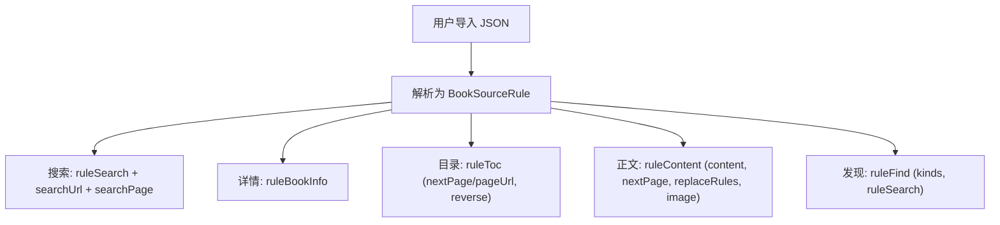
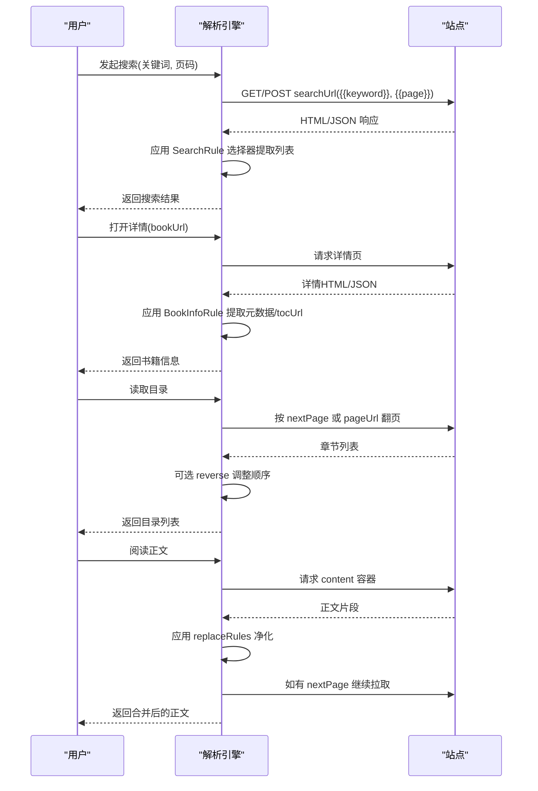
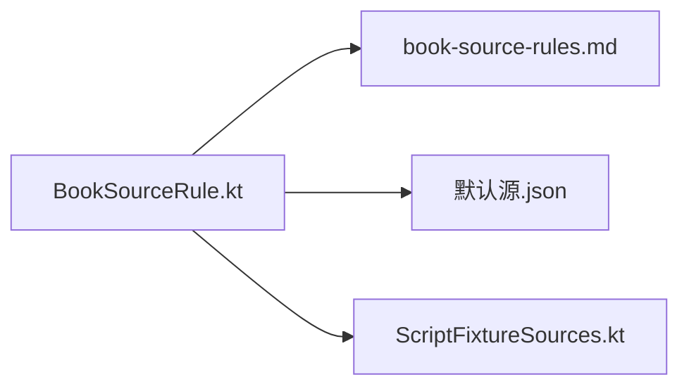
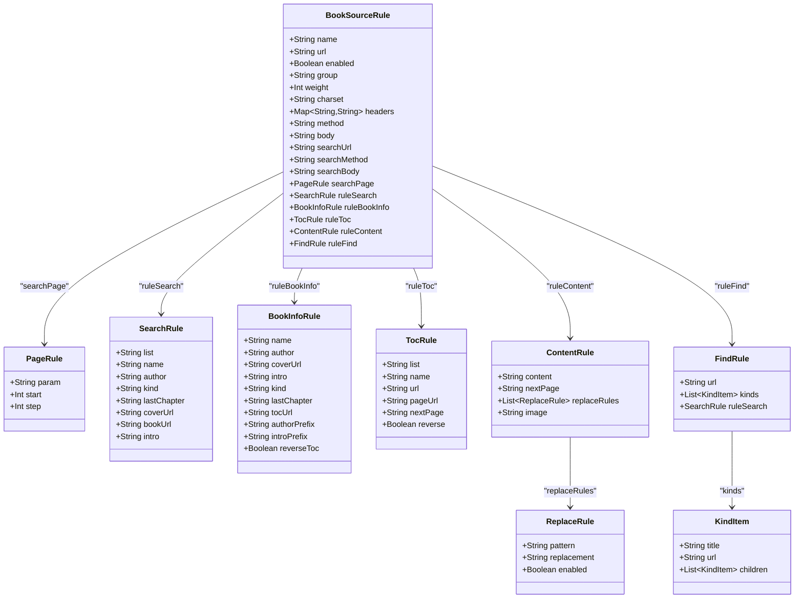

# JSON规则规范

<cite>
**本文引用的文件**
- [BookSourceRule.kt](file://lib_ebook_api/src/main/java/com/ebook/api/entity/BookSourceRule.kt)
- [book-source-rules.md](file://docs/book-source-rules.md)
- [默认源.json](file://lib_book_source/src/test/resources/book_source/默认源.json)
- [ScriptFixtureSources.kt](file://lib_book_source/src/test/java/com/ebook/source/script/ScriptFixtureSources.kt)
</cite>

## 目录
1. [简介](#简介)
2. [项目结构](#项目结构)
3. [核心组件](#核心组件)
4. [架构总览](#架构总览)
5. [详细组件分析](#详细组件分析)
6. [依赖关系分析](#依赖关系分析)
7. [性能注意事项](#性能注意事项)
8. [故障排查指南](#故障排查指南)
9. [结论](#结论)
10. [附录](#附录)

## 简介
本规范面向“原生书源的JSON配置格式”，围绕 BookSourceRule 及其五大核心规则对象（搜索、详情、目录、内容、发现）给出字段定义、语法规则与使用示例，重点说明：
- 基础信息与请求配置（name、url、enabled、group、weight、charset、headers、method、body）
- 搜索规则 ruleSearch 的选择器集合
- 书籍详情规则 ruleBookInfo 的提取项
- 目录规则 ruleToc 的分页机制（nextPage 与 pageUrl）、反转顺序 reverse
- 正文规则 ruleContent 的内容容器、下一页链接、ReplaceRule 清理、图片模式
- 发现规则 ruleFind 的分类页面与 kinds 嵌套结构
- PageRule 分页参数与 PageRule.start/step 的页码换算
- 复杂场景示例（多级分类、正则替换、变量替换等）

## 项目结构
与原生书源规则相关的代码集中在实体定义与用户文档中：
- 实体定义：BookSourceRule.kt 定义了完整的 JSON 映射结构与字段语义
- 用户文档：book-source-rules.md 提供完整示例与字段说明
- 测试资源：默认源.json 展示真实站点可用的最小可用配置形态
- 脚本侧参考：ScriptFixtureSources.kt 展示了脚本格式的对比用例，便于理解原生规则在工程中的位置

图示来源
- [BookSourceRule.kt:1-210](file://lib_ebook_api/src/main/java/com/ebook/api/entity/BookSourceRule.kt#L1-L210)

章节来源
- [BookSourceRule.kt:1-210](file://lib_ebook_api/src/main/java/com/ebook/api/entity/BookSourceRule.kt#L1-L210)
- [book-source-rules.md:59-242](file://docs/book-source-rules.md#L59-L242)

## 核心组件
- BookSourceRule：顶层书源配置，承载基础信息、请求配置以及五大规则对象
- PageRule：分页参数与页码生成规则（param、start、step）
- SearchRule：搜索结果列表及字段选择器
- BookInfoRule：书籍详情页字段选择器与前缀处理
- TocRule：章节目录列表、URL、分页模板与下一页选择器、顺序反转
- ContentRule：正文容器、下一页、清理规则、图片模式
- ReplaceRule：正则匹配与替换文本
- FindRule：发现/分类页 URL、kinds 分类树、结果复用 SearchRule
- KindItem：分类项（title/url/children），支持多级分类

章节来源
- [BookSourceRule.kt:1-210](file://lib_ebook_api/src/main/java/com/ebook/api/entity/BookSourceRule.kt#L1-L210)

## 架构总览
原生书源 JSON 经解析后，由解析引擎按规则对象分工执行：
- 搜索阶段：searchUrl + searchMethod/searchBody + searchPage + ruleSearch
- 详情阶段：ruleBookInfo 提取元数据与 tocUrl
- 目录阶段：ruleToc 通过 nextPage 或 pageUrl 翻页获取章节列表，可 reverse
- 正文阶段：ruleContent 提取正文，支持多容器、下一页、replaceRules 净化、image 模式
- 发现阶段：ruleFind 渲染分类页 URL（{{kind}}/{{page}}），用 ruleSearch 抽取书库条目

图示来源
- [BookSourceRule.kt:1-210](file://lib_ebook_api/src/main/java/com/ebook/api/entity/BookSourceRule.kt#L1-L210)
- [book-source-rules.md:148-225](file://docs/book-source-rules.md#L148-L225)

## 详细组件分析

### 基础信息与请求配置
- name/url/enabled/group/weight：标识与排序分组
- charset：字符编码（影响响应解码）
- headers：自定义请求头
- method/body：默认请求方法与 POST 请求体模板，支持占位符（如 {{keyword}}）
- searchUrl/searchMethod/searchBody：覆盖默认方法/请求体的搜索专用配置
- searchPage：分页参数名、起始页、步长

要点
- 搜索 URL 模板以 /{{page}} 结尾时，首页会裁掉页码段（避免裸路径首页带 /1 导致 404）
- body 模板用于 POST 搜索，支持占位符替换

章节来源
- [BookSourceRule.kt:11-46](file://lib_ebook_api/src/main/java/com/ebook/api/entity/BookSourceRule.kt#L11-L46)
- [book-source-rules.md:134-170](file://docs/book-source-rules.md#L134-L170)

### 搜索规则（ruleSearch）
- list：搜索结果列表项选择器
- name/author/kind/lastChapter/coverUrl/bookUrl/intro：各字段选择器（支持属性取值如 @src/@href）
- 适用场景：聚合搜索、书城搜索页

示例要点
- 使用 CSS 选择器定位列表与字段
- 封面/链接通过属性选择器取值（如 img@src、a@href）

章节来源
- [BookSourceRule.kt:77-95](file://lib_ebook_api/src/main/java/com/ebook/api/entity/BookSourceRule.kt#L77-L95)
- [book-source-rules.md:148-160](file://docs/book-source-rules.md#L148-L160)

### 详情规则（ruleBookInfo）
- name/author/coverUrl/intro/kind/lastChapter：字段选择器
- tocUrl：目录页 URL（为空则沿用详情页 URL）
- authorPrefix/introPrefix：去除前缀（如“作者：”）
- reverseToc：是否反转章节顺序（注意与 ruleToc.reverse 的区别）

章节来源
- [BookSourceRule.kt:100-122](file://lib_ebook_api/src/main/java/com/ebook/api/entity/BookSourceRule.kt#L100-L122)
- [book-source-rules.md:172-186](file://docs/book-source-rules.md#L172-L186)

### 目录规则（ruleToc）
- list：章节列表选择器（支持多级，用 || 分隔）
- name/url：章节名与 URL 选择器
- pageUrl：分页 URL 模板（支持 {{page}}），相对路径按目录页 URL 所在目录解析；以 / 开头按源根解析，http(s) 开头原样
- nextPage：下一页链接选择器（优先于 pageUrl）
- reverse：是否反转章节顺序

分页机制
- 二选一：nextPage（优先）或 pageUrl
- 若 nextPage 为空，视为不分页（大多数站点整本目录在一页）

章节来源
- [BookSourceRule.kt:127-149](file://lib_ebook_api/src/main/java/com/ebook/api/entity/BookSourceRule.kt#L127-L149)
- [book-source-rules.md:187-200](file://docs/book-source-rules.md#L187-L200)

### 正文规则（ruleContent）
- content：正文容器选择器（支持多页，用 || 分隔）
- nextPage：下一页 URL 选择器（为空则不分页）
- replaceRules：正文清理规则数组（正则匹配与替换）
- image：正文图片选择器（适用于图片站）

ReplaceRule
- pattern：匹配正则
- replacement：替换文本（空串表示删除）
- enabled：是否启用

章节来源
- [BookSourceRule.kt:154-177](file://lib_ebook_api/src/main/java/com/ebook/api/entity/BookSourceRule.kt#L154-L177)
- [book-source-rules.md:202-218](file://docs/book-source-rules.md#L202-L218)

### 发现规则（ruleFind）
- url：分类页 URL 模板（必须包含 {{page}}）
- kinds：分类列表，支持嵌套 children 实现多级分类
- ruleSearch：复用搜索规则对象抽取分类结果

多级分类
- kinds.children 可无限嵌套，用于表达层级分类
- 分类项通过 url 替换模板中的 {{kind}}

章节来源
- [BookSourceRule.kt:182-209](file://lib_ebook_api/src/main/java/com/ebook/api/entity/BookSourceRule.kt#L182-L209)
- [book-source-rules.md:219-225](file://docs/book-source-rules.md#L219-L225)

### PageRule 分页机制
- param：分页参数名（如 page、p）
- start：起始页码
- step：页码步长

结合搜索/发现 URL 模板使用，负责将 {{page}} 渲染为实际页码。

章节来源
- [BookSourceRule.kt:64-72](file://lib_ebook_api/src/main/java/com/ebook/api/entity/BookSourceRule.kt#L64-L72)
- [book-source-rules.md:161-170](file://docs/book-source-rules.md#L161-L170)

### 完整 JSON 示例（原生规则）
以下示例来自仓库文档与测试资源，覆盖基础字段、搜索、详情、目录、正文、发现与替换规则等常见用法：
- 完整示例结构参见：[示例段落](file://docs/book-source-rules.md#L63-L130)
- 实战示例（笔趣阁风格）参见：[默认源.json](file://lib_book_source/src/test/resources/book_source/默认源.json#L1-L118)

关键说明
- 搜索 URL 模板支持 {{keyword}}/{{page}}，并以 /{{page}} 结尾时首页自动裁掉页码段
- 正文 replaceRules 使用正则表达式清理广告、跳转提示等噪声
- 发现 ruleFind.url 必须包含 {{page}}，否则“加载更多”无法翻页
- kinds 支持多级嵌套（children）表达复杂分类树

章节来源
- [book-source-rules.md:63-130](file://docs/book-source-rules.md#L63-L130)
- [默认源.json:1-118](file://lib_book_source/src/test/resources/book_source/默认源.json#L1-L118)

### 复杂场景示例与最佳实践
- 多级分类：在 ruleFind.kinds 中使用 children 构建层次化分类树
- 正则表达式匹配：在 ruleContent.replaceRules 中使用 pattern 精准剔除噪声
- 变量替换：searchUrl/body 使用 {{keyword}}/{{page}}；ruleFind.url 使用 {{kind}}/{{page}}
- 多选择器回退：list/content 支持用 || 分隔多个选择器，优先取第一个有结果的
- 正文图片站：设置 ruleContent.image 选择器，跳过文本提取直接拉取图片序列

章节来源
- [book-source-rules.md:202-242](file://docs/book-source-rules.md#L202-L242)
- [默认源.json:1-118](file://lib_book_source/src/test/resources/book_source/默认源.json#L1-L118)

## 依赖关系分析
- 实体层：BookSourceRule.kt 作为 JSON 与内部对象的映射核心
- 文档层：book-source-rules.md 提供用户可见的规则语法与示例
- 测试资源：默认源.json 验证实际站点的最小可用配置
- 脚本侧参考：ScriptFixtureSources.kt 展示脚本格式对照，帮助理解原生规则在整体工程中的角色

图示来源
- [BookSourceRule.kt:1-210](file://lib_ebook_api/src/main/java/com/ebook/api/entity/BookSourceRule.kt#L1-L210)
- [book-source-rules.md:59-242](file://docs/book-source-rules.md#L59-L242)
- [默认源.json:1-118](file://lib_book_source/src/test/resources/book_source/默认源.json#L1-L118)
- [ScriptFixtureSources.kt:24-58](file://lib_book_source/src/test/java/com/ebook/source/script/ScriptFixtureSources.kt#L24-L58)

章节来源
- [BookSourceRule.kt:1-210](file://lib_ebook_api/src/main/java/com/ebook/api/entity/BookSourceRule.kt#L1-L210)
- [book-source-rules.md:59-242](file://docs/book-source-rules.md#L59-L242)
- [默认源.json:1-118](file://lib_book_source/src/test/resources/book_source/默认源.json#L1-L118)
- [ScriptFixtureSources.kt:24-58](file://lib_book_source/src/test/java/com/ebook/source/script/ScriptFixtureSources.kt#L24-L58)

## 性能注意事项
- 选择器尽量精确，避免全局扫描导致的解析开销
- 正文清理规则（replaceRules）数量与复杂度会影响正文渲染时间，建议精简且有序
- 目录/正文分页应合理设置 nextPage/pageUrl，避免无效请求
- 多级分类（kinds.children）过深会增加首屏渲染与缓存体积，需权衡

[本节为通用指导，不直接分析具体文件]

## 故障排查指南
常见问题与定位建议：
- 搜索无结果：检查 searchUrl 是否包含 {{keyword}}/{{page}}；确认 ruleSearch.list 与字段选择器正确
- 详情字段缺失：核对 ruleBookInfo 各字段选择器；必要时设置 authorPrefix/introPrefix 去除前缀
- 目录不全：确认 ruleToc.nextPage 或 pageUrl 是否正确；如需反转顺序设置 reverse=true
- 正文含广告/噪声：补充或优化 ruleContent.replaceRules 的正则匹配
- 发现页无法翻页：确保 ruleFind.url 包含 {{page}}；kinds.url 能正确替换 {{kind}}
- 字符编码问题：调整 charset 为站点实际编码（如 gbk）

章节来源
- [book-source-rules.md:349-395](file://docs/book-source-rules.md#L349-L395)

## 结论
原生书源 JSON 通过 BookSourceRule 将站点适配抽象为声明式规则，覆盖搜索、详情、目录、正文、发现五大环节。配合 PageRule 分页与 ReplaceRule 清理，能够以纯配置方式适配大量站点。编写时应遵循：
- URL 模板必须包含必要占位符（{{page}}/{{kind}}/{{keyword}}）
- 选择器精确、简洁，必要时用 || 回退
- 正文净化规则有序、克制
- 多级分类合理组织，避免过度嵌套
- 遇到站点改版优先更新规则而非硬编码

[本节为总结性内容，不直接分析具体文件]

## 附录
- 类关系图（代码级）

图示来源
- [BookSourceRule.kt:1-210](file://lib_ebook_api/src/main/java/com/ebook/api/entity/BookSourceRule.kt#L1-L210)