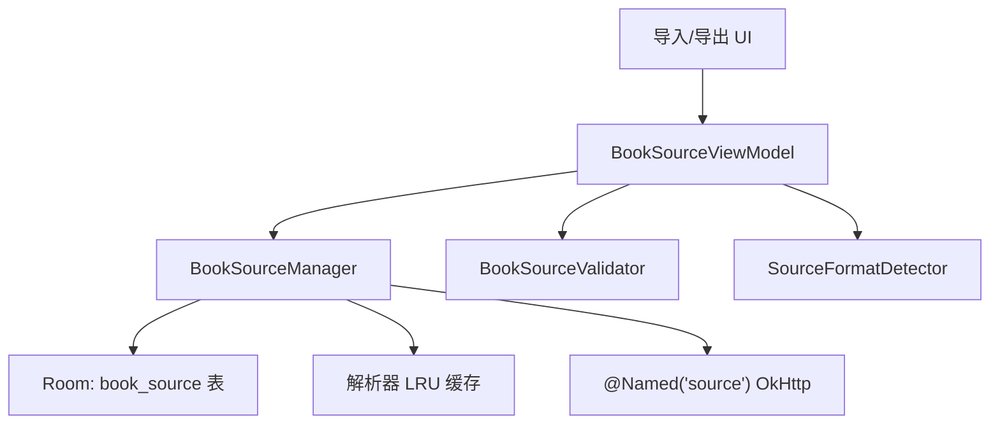
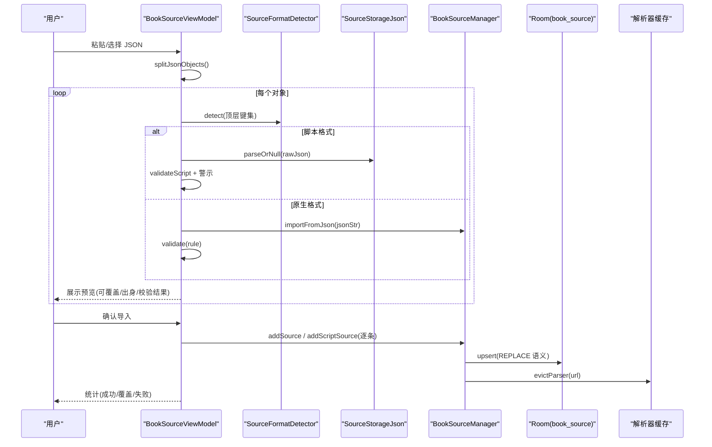
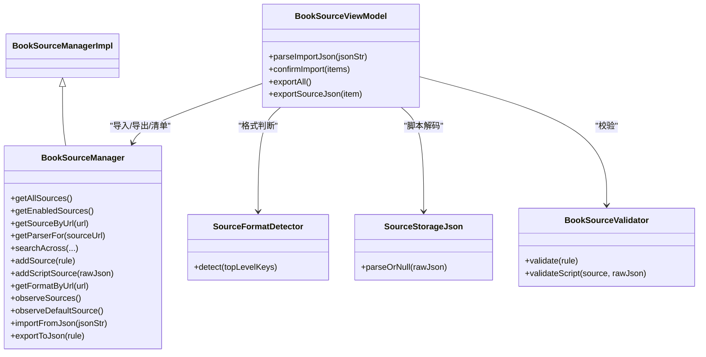

# 书源导入导出

<cite>
**本文引用的文件**
- [lib_ebook_api/src/main/java/com/ebook/api/entity/SourceFormat.kt](file://lib_ebook_api/src/main/java/com/ebook/api/entity/SourceFormat.kt)
- [lib_ebook_api/src/main/java/com/ebook/api/entity/BookSourceRule.kt](file://lib_ebook_api/src/main/java/com/ebook/api/entity/BookSourceRule.kt)
- [lib_book_common/src/main/java/com/ebook/common/analyze/source/BookSourceManager.kt](file://lib_book_common/src/main/java/com/ebook/common/analyze/source/BookSourceManager.kt)
- [lib_book_common/src/main/java/com/ebook/common/analyze/source/BookSourceManagerImpl.kt](file://lib_book_common/src/main/java/com/ebook/common/analyze/source/BookSourceManagerImpl.kt)
- [lib_book_common/src/main/java/com/ebook/common/analyze/source/SourceStorageJson.kt](file://lib_book_common/src/main/java/com/ebook/common/analyze/source/SourceStorageJson.kt)
- [module_me/src/main/java/com/ebook/me/mvvm/viewmodel/BookSourceViewModel.kt](file://module_me/src/main/java/com/ebook/me/mvvm/viewmodel/BookSourceViewModel.kt)
- [module_me/src/main/java/com/ebook/me/domain/BookSourceValidator.kt](file://module_me/src/main/java/com/ebook/me/domain/BookSourceValidator.kt)
- [lib_ebook_api/src/test/java/com/ebook/api/entity/SourceFormatDetectorTest.kt](file://lib_ebook_api/src/test/java/com/ebook/api/entity/SourceFormatDetectorTest.kt)
</cite>

## 目录
1. [简介](#简介)
2. [项目结构与职责边界](#项目结构与职责边界)
3. [核心组件](#核心组件)
4. [架构总览](#架构总览)
5. [详细流程与实现](#详细流程与实现)
6. [依赖关系分析](#依赖关系分析)
7. [性能与并发特性](#性能与并发特性)
8. [故障排查与用户反馈](#故障排查与用户反馈)
9. [结论](#结论)
10. [附录：关键数据模型与接口](#附录：关键数据模型与接口)

## 简介
本文件面向“书源导入导出”能力，覆盖以下目标：
- 说明格式检测机制（原生规则 vs 脚本规则）
- 详述导入流程：JSON 解析、格式判断、规则校验、数据库存储、缓存刷新
- 解释预览校验机制：语法检查、网络连通性策略、解析结果预演
- 说明错误处理与用户反馈：常见失败原因、提示文案来源、重试建议
- 详述导出功能：规则序列化、美化输出、社区分享支持
- 提供批量导入导出方案：多文件处理、进度显示、错误汇总
- 高级特性：版本兼容性、冲突解决、备份恢复

## 项目结构与职责边界
- lib_ebook_api：定义书源格式枚举与格式检测器、原生规则数据结构
- lib_book_common：书源管理器（读写 Room、LRU 解析器缓存）、存储 JSON 编解码、导入导出入口
- module_me：书源管理页 ViewModel，负责导入预览、校验、确认落库、批量统计、单个/全部导出
- module_find/module_book 等模块通过 BookSourceManager 订阅清单与默认源，不直接操作 DAO

图表来源
- [module_me/src/main/java/com/ebook/me/mvvm/viewmodel/BookSourceViewModel.kt](file://module_me/src/main/java/com/ebook/me/mvvm/viewmodel/BookSourceViewModel.kt)
- [lib_book_common/src/main/java/com/ebook/common/analyze/source/BookSourceManagerImpl.kt](file://lib_book_common/src/main/java/com/ebook/common/analyze/source/BookSourceManagerImpl.kt)
- [lib_ebook_api/src/main/java/com/ebook/api/entity/SourceFormat.kt](file://lib_ebook_api/src/main/java/com/ebook/api/entity/SourceFormat.kt)

章节来源
- [lib_book_common/src/main/java/com/ebook/common/analyze/source/BookSourceManager.kt](file://lib_book_common/src/main/java/com/ebook/common/analyze/source/BookSourceManager.kt)
- [module_me/src/main/java/com/ebook/me/mvvm/viewmodel/BookSourceViewModel.kt](file://module_me/src/main/java/com/ebook/me/mvvm/viewmodel/BookSourceViewModel.kt)

## 核心组件
- SourceFormatDetector：基于顶层键集识别脚本/原生格式，仅以脚本特征键为准，未知回落为原生
- BookSourceManager/Impl：唯一书源读写面，负责导入/导出、默认源收敛、解析器缓存失效、聚合搜索
- SourceStorageJson：统一存储侧 JSON 解码器，保证预览与落库接受集一致
- BookSourceValidator：导入前最小可用判定（结构校验），脚本源额外给出知情警示
- BookSourceViewModel：导入预览、逐条分流、确认导入统计、导出全部/单个

章节来源
- [lib_ebook_api/src/main/java/com/ebook/api/entity/SourceFormat.kt](file://lib_ebook_api/src/main/java/com/ebook/api/entity/SourceFormat.kt)
- [lib_book_common/src/main/java/com/ebook/common/analyze/source/BookSourceManagerImpl.kt](file://lib_book_common/src/main/java/com/ebook/common/analyze/source/BookSourceManagerImpl.kt)
- [lib_book_common/src/main/java/com/ebook/common/analyze/source/SourceStorageJson.kt](file://lib_book_common/src/main/java/com/ebook/common/analyze/source/SourceStorageJson.kt)
- [module_me/src/main/java/com/ebook/me/domain/BookSourceValidator.kt](file://module_me/src/main/java/com/ebook/me/domain/BookSourceValidator.kt)
- [module_me/src/main/java/com/ebook/me/mvvm/viewmodel/BookSourceViewModel.kt](file://module_me/src/main/java/com/ebook/me/mvvm/viewmodel/BookSourceViewModel.kt)

## 架构总览
导入导出链路的关键点：
- 导入入口：VM 将文本切分为顶层对象 → 按格式分流 → 校验 → 预览 → 确认后写库
- 写库路径：原生走 addSource；脚本走 addScriptSource（原文原样入库）
- 格式检测：SourceFormatDetector.detect(topLevelKeys)
- 默认源收敛：写后现算默认源并持久化，避免“无默认源”的中间态
- 缓存失效：所有可能改变解析结果的写操作后，evictParser(url)
- 导出：exportAll 使用美化 JSON；exportSourceJson 限制仅原生

图表来源
- [module_me/src/main/java/com/ebook/me/mvvm/viewmodel/BookSourceViewModel.kt](file://module_me/src/main/java/com/ebook/me/mvvm/viewmodel/BookSourceViewModel.kt)
- [lib_book_common/src/main/java/com/ebook/common/analyze/source/BookSourceManagerImpl.kt](file://lib_book_common/src/main/java/com/ebook/common/analyze/source/BookSourceManagerImpl.kt)
- [lib_ebook_api/src/main/java/com/ebook/api/entity/SourceFormat.kt](file://lib_ebook_api/src/main/java/com/ebook/api/entity/SourceFormat.kt)

## 详细流程与实现

### 格式检测机制（SourceFormatDetector）
- 判别依据：顶层键集中是否存在脚本特征键（如 bookSourceUrl）
- 未知/空键集：回落到 NATIVE，保证既有校验生效，报错对用户更友好
- 测试用例覆盖：含脚本键判 script；纯原生键集判 native；空键集判 native

章节来源
- [lib_ebook_api/src/main/java/com/ebook/api/entity/SourceFormat.kt](file://lib_ebook_api/src/main/java/com/ebook/api/entity/SourceFormat.kt)
- [lib_ebook_api/src/test/java/com/ebook/api/entity/SourceFormatDetectorTest.kt](file://lib_ebook_api/src/test/java/com/ebook/api/entity/SourceFormatDetectorTest.kt)

### 导入流程
- JSON 切分：支持数组与单对象两种形态，异常收敛为空列表（不可读）
- 格式分流：
  - 脚本：用 SourceStorageJson 解析最小模型 + 原始 JSON 全文，进行 validateScript（名称/地址必填；警示：可执行代码/需登录/非文本类）
  - 原生：调用 BookSourceManager.importFromJson 解码规则，再进行 validate（名称/地址/入口/解析规则四条）
- 覆盖判断：对每条 URL 查询 getFormatByUrl，返回已有行格式，用于“将覆盖”文案
- 确认导入：
  - 脚本：addScriptSource(rawJson)，原样写入 rule_json，format=script
  - 原生：addSource(rule)，写入 BookSourceRule 序列化的 rule_json，format=native
  - 写成功后 evictParser(url) 失效对应解析器缓存
  - 若写前无可用默认源或覆盖的是当前默认源，则 syncDefaultAfterWrite 收敛默认源
- 结果统计：success（含覆盖）、overwritten、failed（校验未通过+写库失败）

章节来源
- [module_me/src/main/java/com/ebook/me/mvvm/viewmodel/BookSourceViewModel.kt](file://module_me/src/main/java/com/ebook/me/mvvm/viewmodel/BookSourceViewModel.kt)
- [lib_book_common/src/main/java/com/ebook/common/analyze/source/BookSourceManagerImpl.kt](file://lib_book_common/src/main/java/com/ebook/common/analyze/source/BookSourceManagerImpl.kt)
- [lib_book_common/src/main/java/com/ebook/common/analyze/source/SourceStorageJson.kt](file://lib_book_common/src/main/java/com/ebook/common/analyze/source/SourceStorageJson.kt)
- [module_me/src/main/java/com/ebook/me/domain/BookSourceValidator.kt](file://module_me/src/main/java/com/ebook/me/domain/BookSourceValidator.kt)

### 预览校验机制
- 规则语法检查：
  - 原生：名称/地址/入口/解析规则四项必检
  - 脚本：名称/地址两项必检；同时扫描原始 JSON 是否包含可执行代码片段
- 网络连通性测试：
  - 当前阶段不做网络测试（代价高、易误判），由用户在书城/搜索中自行验证
- 解析结果预演：
  - 导入阶段只做“可解析/可存储”的最小可用判定，不进行真实网络请求与解析结果预演

章节来源
- [module_me/src/main/java/com/ebook/me/domain/BookSourceValidator.kt](file://module_me/src/main/java/com/ebook/me/domain/BookSourceValidator.kt)
- [module_me/src/main/java/com/ebook/me/mvvm/viewmodel/BookSourceViewModel.kt](file://module_me/src/main/java/com/ebook/me/mvvm/viewmodel/BookSourceViewModel.kt)

### 数据库存储与缓存刷新
- 存储：
  - 原生：rule_json = BookSourceRule 序列化串，format=native
  - 脚本：rule_json = 原始 JSON，format=script
- 默认源收敛：
  - 写前判断是否有可用默认源；写后根据 SP 命中与条目面重新计算并持久化
- 缓存失效：
  - 任何可能改变解析结果的写操作后调用 evictParser(url)，确保 LRU 不会持有旧后端实例

章节来源
- [lib_book_common/src/main/java/com/ebook/common/analyze/source/BookSourceManagerImpl.kt](file://lib_book_common/src/main/java/com/ebook/common/analyze/source/BookSourceManagerImpl.kt)

### 错误处理与用户反馈
- 导入失败常见原因：
  - JSON 不可读（非对象/数组）
  - 脚本最小模型无法解析（键值类型不符/声明键为 null）
  - 规则缺失必填字段（名称/地址/入口/解析规则）
  - URL 非 http(s) 开头
- 提示文案：
  - 结构化原因枚举（ValidationReason/ScriptWarning）交由 UI 层映射到字符串资源
  - 一次性通知通过 Notice 流传递（ImportUnreadable/DeleteMissing/Imported 统计）
- 重试机制：
  - 单条失败不影响其他条目继续导入；UI 可在确认后再次尝试整包导入

章节来源
- [module_me/src/main/java/com/ebook/me/domain/BookSourceValidator.kt](file://module_me/src/main/java/com/ebook/me/domain/BookSourceValidator.kt)
- [module_me/src/main/java/com/ebook/me/mvvm/viewmodel/BookSourceViewModel.kt](file://module_me/src/main/java/com/ebook/me/mvvm/viewmodel/BookSourceViewModel.kt)

### 导出功能
- 全部导出：
  - getAllSources() 获取原生规则列表，逐一 exportToJson 并用美化 JSON 拼接数组
  - 禁用项一并导出（enabled 字段保留，便于对方导入后保持本地开关状态）
- 单个导出：
  - 仅允许导出原生规则；脚本源拒绝并记录日志，防止导出一份空规则文件
- 社区分享：
  - 美化输出便于人工阅读与修改，配合 importFromJson 完成社区交换

章节来源
- [module_me/src/main/java/com/ebook/me/mvvm/viewmodel/BookSourceViewModel.kt](file://module_me/src/main/java/com/ebook/me/mvvm/viewmodel/BookSourceViewModel.kt)
- [lib_book_common/src/main/java/com/ebook/common/analyze/source/BookSourceManagerImpl.kt](file://lib_book_common/src/main/java/com/ebook/common/analyze/source/BookSourceManagerImpl.kt)

### 批量导入导出方案
- 多文件处理：
  - 将多个 JSON 文本合并为一个输入流，重复上述“切分→分流→校验→预览→确认”的流程
- 进度显示：
  - 在 confirmImport 循环中按条目计数 success/overwritten/failed，结合 UI 进度条
- 错误汇总：
  - 最终通过 Notice.Imported 返回三项统计，UI 据此汇总展示

章节来源
- [module_me/src/main/java/com/ebook/me/mvvm/viewmodel/BookSourceViewModel.kt](file://module_me/src/main/java/com/ebook/me/mvvm/viewmodel/BookSourceViewModel.kt)

### 高级特性
- 版本兼容：
  - storageJson 开启 ignoreUnknownKeys，老行在新代码下仍可解；新字段扩展不影响旧数据
- 冲突解决：
  - 同 URL 导入采用 REPLACE 语义，覆盖旧规则；重导时保留 addedAt 与 weight 等元信息
- 备份恢复：
  - 导出全部原生规则为 JSON 数组即备份；恢复时作为普通导入流程即可

章节来源
- [lib_book_common/src/main/java/com/ebook/common/analyze/source/SourceStorageJson.kt](file://lib_book_common/src/main/java/com/ebook/common/analyze/source/SourceStorageJson.kt)
- [lib_book_common/src/main/java/com/ebook/common/analyze/source/BookSourceManagerImpl.kt](file://lib_book_common/src/main/java/com/ebook/common/analyze/source/BookSourceManagerImpl.kt)

## 依赖关系分析
- BookSourceManagerImpl 依赖：
  - Room DAO（读取/写入 book_source）
  - @Named("source") OkHttpClient（纯净客户端，不带 token）
  - JsoupBookParser/ScriptBookParser（通过工厂按 SourceDefinition 分发）
  - LRU 缓存与互斥锁保证解析器构造一致性
- BookSourceViewModel 依赖：
  - BookSourceManager（导入/导出/默认源/清单）
  - SourceFormatDetector（格式判断）
  - SourceStorageJson（脚本最小模型解码）
  - BookSourceValidator（结构校验）

图表来源
- [lib_book_common/src/main/java/com/ebook/common/analyze/source/BookSourceManager.kt](file://lib_book_common/src/main/java/com/ebook/common/analyze/source/BookSourceManager.kt)
- [lib_book_common/src/main/java/com/ebook/common/analyze/source/BookSourceManagerImpl.kt](file://lib_book_common/src/main/java/com/ebook/common/analyze/source/BookSourceManagerImpl.kt)
- [module_me/src/main/java/com/ebook/me/mvvm/viewmodel/BookSourceViewModel.kt](file://module_me/src/main/java/com/ebook/me/mvvm/viewmodel/BookSourceViewModel.kt)
- [lib_ebook_api/src/main/java/com/ebook/api/entity/SourceFormat.kt](file://lib_ebook_api/src/main/java/com/ebook/api/entity/SourceFormat.kt)
- [lib_book_common/src/main/java/com/ebook/common/analyze/source/SourceStorageJson.kt](file://lib_book_common/src/main/java/com/ebook/common/analyze/source/SourceStorageJson.kt)
- [module_me/src/main/java/com/ebook/me/domain/BookSourceValidator.kt](file://module_me/src/main/java/com/ebook/me/domain/BookSourceValidator.kt)

章节来源
- [lib_book_common/src/main/java/com/ebook/common/analyze/source/BookSourceManager.kt](file://lib_book_common/src/main/java/com/ebook/common/analyze/source/BookSourceManager.kt)
- [lib_book_common/src/main/java/com/ebook/common/analyze/source/BookSourceManagerImpl.kt](file://lib_book_common/src/main/java/com/ebook/common/analyze/source/BookSourceManagerImpl.kt)
- [module_me/src/main/java/com/ebook/me/mvvm/viewmodel/BookSourceViewModel.kt](file://module_me/src/main/java/com/ebook/me/mvvm/viewmodel/BookSourceViewModel.kt)

## 性能与并发特性
- 解析器 LRU 缓存：容量固定，避免频繁创建解析器；并发通过互斥锁串行化构建
- 聚合搜索并发上限：默认 5，避免对第三方站点造成风控压力
- 导入/导出：
  - 导入为一次性操作，逐条写库并统计，适合 UI 进度与错误汇总
  - 导出为纯函数式序列化，无网络 IO，性能开销低

章节来源
- [lib_book_common/src/main/java/com/ebook/common/analyze/source/BookSourceManagerImpl.kt](file://lib_book_common/src/main/java/com/ebook/common/analyze/source/BookSourceManagerImpl.kt)

## 故障排查与用户反馈
- 导入失败定位：
  - JSON 不可读：检查是否为合法 JSON 对象/数组
  - 脚本不可解析：检查最小模型键类型与 null 值
  - 规则不完整：补全名称/地址/入口/解析规则
  - URL 非法：必须以 http:// 或 https:// 开头
- 常见现象与处置：
  - “无可用书源”：书城应展示引导态，引导用户导入/启用书源
  - “删除失败”：若清单仍显示该行，则为写库异常；否则视为已不存在
- 重试建议：
  - 修正错误后重新执行导入；批量导入会汇总成功/覆盖/失败数，方便二次处理

章节来源
- [module_me/src/main/java/com/ebook/me/domain/BookSourceValidator.kt](file://module_me/src/main/java/com/ebook/me/domain/BookSourceValidator.kt)
- [module_me/src/main/java/com/ebook/me/mvvm/viewmodel/BookSourceViewModel.kt](file://module_me/src/main/java/com/ebook/me/mvvm/viewmodel/BookSourceViewModel.kt)

## 结论
本项目实现了安全、可扩展的书源导入导出体系：
- 通过 SourceFormatDetector 明确区分原生与脚本规则
- 导入流程严格遵循“只读不落库”的预览阶段，再经确认落库，保证幂等与可控
- 统一存储侧 JSON 解码器确保预览与落库接受集一致，避免“两边各说一套”
- 导出支持美化 JSON，便于社区分享；批量导入提供进度与错误汇总
- 默认源收敛与解析器缓存失效保证状态一致性与解析正确性

[本节为总结，不引用具体文件]

## 附录：关键数据模型与接口
- SourceFormat：NATIVE/SCRIPT，raw 列值小写，fromRaw 兜底 NATIVE
- BookSourceRule：声明式规则（搜索/详情/目录/正文/发现）
- BookSourceManager 接口：导入/导出/清单/默认源/搜索/解析器获取
- BookSourceViewModel：导入预览/确认/导出全部/单个导出

章节来源
- [lib_ebook_api/src/main/java/com/ebook/api/entity/SourceFormat.kt](file://lib_ebook_api/src/main/java/com/ebook/api/entity/SourceFormat.kt)
- [lib_ebook_api/src/main/java/com/ebook/api/entity/BookSourceRule.kt](file://lib_ebook_api/src/main/java/com/ebook/api/entity/BookSourceRule.kt)
- [lib_book_common/src/main/java/com/ebook/common/analyze/source/BookSourceManager.kt](file://lib_book_common/src/main/java/com/ebook/common/analyze/source/BookSourceManager.kt)
- [module_me/src/main/java/com/ebook/me/mvvm/viewmodel/BookSourceViewModel.kt](file://module_me/src/main/java/com/ebook/me/mvvm/viewmodel/BookSourceViewModel.kt)