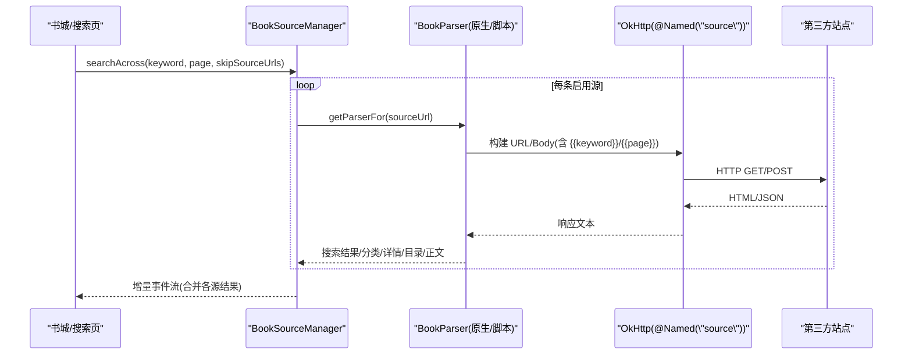
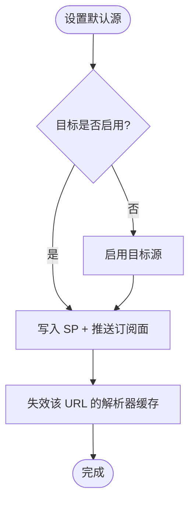

# 书源扩展

<cite>
**本文引用的文件**
- [lib_ebook_api/src/main/java/com/ebook/api/entity/BookSourceRule.kt](file://lib_ebook_api/src/main/java/com/ebook/api/entity/BookSourceRule.kt)
- [lib_ebook_api/src/main/java/com/ebook/api/entity/ScriptSourceRule.kt](file://lib_ebook_api/src/main/java/com/ebook/api/entity/ScriptSourceRule.kt)
- [lib_book_common/src/main/java/com/ebook/common/analyze/source/BookSourceManager.kt](file://lib_book_common/src/main/java/com/ebook/common/analyze/source/BookSourceManager.kt)
- [lib_book_common/src/main/java/com/ebook/common/analyze/source/BookSourceManagerImpl.kt](file://lib_book_common/src/main/java/com/ebook/common/analyze/source/BookSourceManagerImpl.kt)
- [lib_book_source/src/main/java/com/ebook/source/script/ScriptRuleSet.kt](file://lib_book_source/src/main/java/com/ebook/source/script/ScriptRuleSet.kt)
- [lib_book_source/src/main/java/com/ebook/source/analyze/JsoupBookParser.kt](file://lib_book_source/src/main/java/com/ebook/source/analyze/JsoupBookParser.kt)
- [lib_book_common/src/main/java/com/ebook/common/analyze/source/SourceStorageJson.kt](file://lib_book_common/src/main/java/com/ebook/common/analyze/source/SourceStorageJson.kt)
- [module_me/src/main/java/com/ebook/me/domain/BookSourceValidator.kt](file://module_me/src/main/java/com/ebook/me/domain/BookSourceValidator.kt)
</cite>

## 目录
1. [简介](#简介)
2. [项目结构](#项目结构)
3. [核心组件](#核心组件)
4. [架构总览](#架构总览)
5. [详细组件分析](#详细组件分析)
6. [依赖关系分析](#依赖关系分析)
7. [性能考量](#性能考量)
8. [故障排查指南](#故障排查指南)
9. [结论](#结论)
10. [附录](#附录)

## 简介
本指南面向希望为阅读器添加新“书源”的开发者，目标是让你通过 JSON 规则或脚本规则快速适配任意小说网站，实现搜索、详情、目录、正文与发现（分类/书库）的全链路解析。文档覆盖：
- JSON 规则格式规范（搜索、详情、目录、内容、发现）
- 脚本规则开发方法（沙箱执行、URL 模板、变量替换、请求头）
- 多书源共存机制（优先级、默认源、切换逻辑）
- 书源验证与测试（语法检查、网络调试、结果校验）
- 导入导出流程（JSON 格式、预览校验、错误提示）
- 性能优化建议（缓存、并发控制、重试策略）

## 项目结构
与书源能力直接相关的代码分布在以下模块：
- lib_ebook_api：定义书源规则的实体模型（原生 JSON 规则、脚本最小模型）
- lib_book_common：书源管理接口与实现（清单、默认源、聚合搜索、导入导出）
- lib_book_source：解析器与脚本规则装载（原生 Jsoup 解析器、脚本规则集）
- module_me：书源校验与导入相关 UI 域逻辑

```mermaid
graph TB
    A["应用层<br/>module_*"] --> B["书源管理<br/>BookSourceManager"]
    B --> C["原生解析器<br/>JsoupBookParser"]
    B --> D["脚本规则装载<br/>ScriptRuleSet"]
    B --> E["网络层<br/>@Named(\"source\") OkHttp"]
    C --> F["站点 HTML<br/>第三方网站"]
    D --> G["脚本执行环境<br/>JS 沙箱（可选）"]
```

**图表来源**
- [lib_book_common/src/main/java/com/ebook/common/analyze/source/BookSourceManager.kt:51-277](file://lib_book_common/src/main/java/com/ebook/common/analyze/source/BookSourceManager.kt#L51-L277)
- [lib_book_source/src/main/java/com/ebook/source/analyze/JsoupBookParser.kt:23-76](file://lib_book_source/src/main/java/com/ebook/source/analyze/JsoupBookParser.kt#L23-L76)
- [lib_book_source/src/main/java/com/ebook/source/script/ScriptRuleSet.kt:12-99](file://lib_book_source/src/main/java/com/ebook/source/script/ScriptRuleSet.kt#L12-L99)

**章节来源**
- [lib_book_common/src/main/java/com/ebook/common/analyze/source/BookSourceManager.kt:51-277](file://lib_book_common/src/main/java/com/ebook/common/analyze/source/BookSourceManager.kt#L51-L277)
- [lib_book_source/src/main/java/com/ebook/source/analyze/JsoupBookParser.kt:23-76](file://lib_book_source/src/main/java/com/ebook/source/analyze/JsoupBookParser.kt#L23-L76)
- [lib_book_source/src/main/java/com/ebook/source/script/ScriptRuleSet.kt:12-99](file://lib_book_source/src/main/java/com/ebook/source/script/ScriptRuleSet.kt#L12-L99)

## 核心组件
- 书源规则实体（原生 JSON）：定义名称、URL、分组、权重、编码、请求头/方法/体、分页以及五大规则段（搜索、详情、目录、内容、发现）。
- 脚本规则最小模型：用于导入校验与落库的顶层字段（名称、URL、分组、类型、启用、登录入口等），实际规则块以原始 JSON 形式存储并由脚本解释器消费。
- 书源管理器：多书源清单的唯一入口，提供新增/删除/启用/禁用/设默认、聚合搜索、获取分类条目、导入/导出等功能。
- 解析器：基于 Jsoup 的原生解析器，按 BookSourceRule 动态拉取并解析 HTML；脚本侧由 ScriptRuleSet 装载规则对象集合。
- 存储 JSON 解码器：统一存储侧 Json 配置，保证导入预览与落库接受集一致。
- 校验器：导入前对规则进行最小可用判定（原生四条声明式判据；脚本沿用两条硬前提并附加三项不拦导入的警示）。

**章节来源**
- [lib_ebook_api/src/main/java/com/ebook/api/entity/BookSourceRule.kt:11-209](file://lib_ebook_api/src/main/java/com/ebook/api/entity/BookSourceRule.kt#L11-L209)
- [lib_ebook_api/src/main/java/com/ebook/api/entity/ScriptSourceRule.kt:11-28](file://lib_ebook_api/src/main/java/com/ebook/api/entity/ScriptSourceRule.kt#L11-L28)
- [lib_book_common/src/main/java/com/ebook/common/analyze/source/BookSourceManager.kt:51-277](file://lib_book_common/src/main/java/com/ebook/common/analyze/source/BookSourceManager.kt#L51-L277)
- [lib_book_source/src/main/java/com/ebook/source/analyze/JsoupBookParser.kt:23-76](file://lib_book_source/src/main/java/com/ebook/source/analyze/JsoupBookParser.kt#L23-L76)
- [lib_book_source/src/main/java/com/ebook/source/script/ScriptRuleSet.kt:12-99](file://lib_book_source/src/main/java/com/ebook/source/script/ScriptRuleSet.kt#L12-L99)
- [lib_book_common/src/main/java/com/ebook/common/analyze/source/SourceStorageJson.kt:8-59](file://lib_book_common/src/main/java/com/ebook/common/analyze/source/SourceStorageJson.kt#L8-L59)
- [module_me/src/main/java/com/ebook/me/domain/BookSourceValidator.kt:6-100](file://module_me/src/main/java/com/ebook/me/domain/BookSourceValidator.kt#L6-L100)

## 架构总览
书源体系采用“规则驱动 + 多后端解析”的架构：同一份清单支持原生 JSON 规则与脚本规则并存，默认源从 Room 现算，解析器按 URL 绑定到具体书源，聚合搜索并发限制避免触发风控。



**图表来源**
- [lib_book_common/src/main/java/com/ebook/common/analyze/source/BookSourceManager.kt:114-155](file://lib_book_common/src/main/java/com/ebook/common/analyze/source/BookSourceManager.kt#L114-L155)
- [lib_book_source/src/main/java/com/ebook/source/analyze/JsoupBookParser.kt:40-76](file://lib_book_source/src/main/java/com/ebook/source/analyze/JsoupBookParser.kt#L40-L76)

## 详细组件分析

### JSON 规则格式规范（原生规则）
- 基本信息：name/url/enabled/group/weight/charset/headers/method/body
- 搜索规则（ruleSearch）：list/name/author/kind/lastChapter/coverUrl/bookUrl/intro；搜索 URL 模板 searchUrl 支持 {{keyword}}、{{page}}，searchMethod/searchBody 可覆盖全局 method/body；分页 PageRule(param/start/step)
- 详情规则（ruleBookInfo）：name/author/coverUrl/intro/kind/lastChapter/tocUrl/authorPrefix/introPrefix/reverseToc
- 目录规则（ruleToc）：list/name/url/pageUrl/nextPage/reverse；pageUrl 支持索引页模板，nextPage 优先于模板
- 内容规则（ruleContent）：content/nextPage/image/replaceRules(pattern/replacement/enabled)
- 发现规则（ruleFind）：url(kinds 列表)、ruleSearch 复用搜索规则；发现页必须包含 {{page}}

要点：
- 列表与正文容器选择器缺失会导致无法解析，需在导入时拦截
- 模板必须以书源根 URL 拼接；首页裁剪行为由解析器在特定模板结尾处理

**章节来源**
- [lib_ebook_api/src/main/java/com/ebook/api/entity/BookSourceRule.kt:11-209](file://lib_ebook_api/src/main/java/com/ebook/api/entity/BookSourceRule.kt#L11-L209)
- [lib_book_source/src/main/java/com/ebook/source/analyze/JsoupBookParser.kt:40-76](file://lib_book_source/src/main/java/com/ebook/source/analyze/JsoupBookParser.kt#L40-L76)

### 脚本规则开发方法
- 最小模型：ScriptSourceRule 仅承载导入所需的顶层字段；真实规则块以原始 JSON 存储，由脚本解释器消费
- 规则对象：ScriptRuleSet 将规则分为 SEARCH/EXPLORE/BOOK_INFO/TOC/CONTENT 六类，支持不规则字段展开
- URL 模板与变量：URL 模板支持占位符（如 {{key}}），关键词会按表单百分号编码；请求头 header 为 JSON 串，供脚本读取
- 沙箱执行：含 JS 的规则段交由沙箱执行器求值；未装配执行器时抛类型化异常，已执行失败则返回内核错误信息
- 能力限制：部分能力在本仓未实现（如 LOGIN、XPATH、JS 等），会在装载期登记 unsupported，供导入报告使用

**章节来源**
- [lib_ebook_api/src/main/java/com/ebook/api/entity/ScriptSourceRule.kt:11-28](file://lib_ebook_api/src/main/java/com/ebook/api/entity/ScriptSourceRule.kt#L11-L28)
- [lib_book_source/src/main/java/com/ebook/source/script/ScriptRuleSet.kt:12-99](file://lib_book_source/src/main/java/com/ebook/source/script/ScriptRuleSet.kt#L12-L99)

### 多书源共存机制
- 清单事实源：Room 中 book_source 表是唯一事实源，每行由用户导入；无内置书源
- 默认源计算：每次现算，SP 命中项优先，否则第一条启用行；两种格式平等竞争；observeDefaultSource 订阅变化
- 解析器绑定：按书的 tag/sourceUrl 取 parser，LRU 缓存；脚本行永不 null，首次求值才加载规则
- 聚合搜索：并发上限 5，单源失败不影响整体流；到底判据由调用方按 noteUrl 去重决定
- 启用/禁用：禁用不参与聚合与书城候选，但不切断已有归属；设为默认时会顺带启用目标源



**图表来源**
- [lib_book_common/src/main/java/com/ebook/common/analyze/source/BookSourceManager.kt:213-239](file://lib_book_common/src/main/java/com/ebook/common/analyze/source/BookSourceManager.kt#L213-L239)

**章节来源**
- [lib_book_common/src/main/java/com/ebook/common/analyze/source/BookSourceManager.kt:51-277](file://lib_book_common/src/main/java/com/ebook/common/analyze/source/BookSourceManager.kt#L51-L277)

### 书源验证与测试
- 导入前校验：
  - 原生规则：名称非空、URL 为 http(s)、至少具备搜索或发现入口、列表与正文容器选择器均存在
  - 脚本规则：名称与地址非空；同时扫描原始 JSON 检测可执行代码、登录依赖、非文本类型，并给出警示（不拦截导入）
- 网络调试：解析器使用 @Named("source") 纯净客户端，不携带认证 token；日志输出请求 URL/方法
- 解析结果验证：按规则链逐步验证选择器是否能取到值；列表去重与到底判断由调用方负责

**章节来源**
- [module_me/src/main/java/com/ebook/me/domain/BookSourceValidator.kt:6-100](file://module_me/src/main/java/com/ebook/me/domain/BookSourceValidator.kt#L6-L100)
- [lib_book_source/src/main/java/com/ebook/source/analyze/JsoupBookParser.kt:40-76](file://lib_book_source/src/main/java/com/ebook/source/analyze/JsoupBookParser.kt#L40-L76)

### 导入导出流程
- 导入：
  - 原生规则：importFromJson 将 JSON 解成 BookSourceRule，需通过校验后再 addSource
  - 脚本规则：addScriptSource 原样落 rule_json，format=script；导入前可用 SourceStorageJson.parseOrNull 做预览
- 导出：exportToJson 将 BookSourceRule 美化输出，便于社区交换
- 错误提示：校验失败返回原因列表；脚本导入若含不可用能力，会在装载期记录 unsupported 并上报

**章节来源**
- [lib_book_common/src/main/java/com/ebook/common/analyze/source/BookSourceManager.kt:157-189](file://lib_book_common/src/main/java/com/ebook/common/analyze/source/BookSourceManager.kt#L157-L189)
- [lib_book_common/src/main/java/com/ebook/common/analyze/source/SourceStorageJson.kt:8-59](file://lib_book_common/src/main/java/com/ebook/common/analyze/source/SourceStorageJson.kt#L8-L59)

### 常见网站类型的适配方案
- 搜索页为简单列表：配置 ruleSearch.list 与字段选择器；注意 keyword 与 page 的 URL 模板渲染
- 详情页与目录分离：ruleBookInfo.tocUrl 指向目录页；ruleToc 配置 list/name/url 与翻页
- 正文分页：ruleContent.nextPage 为空则不分页；否则按下一页选择器继续抓取
- 发现页（分类/书库）：ruleFind.url 必须包含 {{page}}；kinds 可多级嵌套；或走脚本 exploreUrl

[本节为通用适配思路，不直接引用具体源码]

## 依赖关系分析
- 模块依赖方向：业务模块 → lib_book_common → lib_book_source → lib_ebook_api / lib_ebook_db
- 书源解析路径：BookSourceManager 根据 sourceUrl 取解析器；原生走 JsoupBookParser，脚本走 ScriptBookParser（规则由 ScriptRuleSet 装载）
- 网络层：统一使用 @Named("source") 的 OkHttpClient，不携带用户凭证，避免泄露给第三方站点

```mermaid
graph LR
    Manager["BookSourceManager"] --> ParserN["JsoupBookParser"]
    Manager --> ParserS["ScriptBookParser"]
    ParserN --> Net["@Named(\"source\") OkHttp"]
    ParserS --> Sand["JS 沙箱（可选）"]
    Net --> Site["第三方站点"]
```

**图表来源**
- [lib_book_common/src/main/java/com/ebook/common/analyze/source/BookSourceManager.kt:91-112](file://lib_book_common/src/main/java/com/ebook/common/analyze/source/BookSourceManager.kt#L91-L112)
- [lib_book_source/src/main/java/com/ebook/source/analyze/JsoupBookParser.kt:23-37](file://lib_book_source/src/main/java/com/ebook/source/analyze/JsoupBookParser.kt#L23-L37)

**章节来源**
- [lib_book_common/src/main/java/com/ebook/common/analyze/source/BookSourceManager.kt:91-112](file://lib_book_common/src/main/java/com/ebook/common/analyze/source/BookSourceManager.kt#L91-L112)
- [lib_book_source/src/main/java/com/ebook/source/analyze/JsoupBookParser.kt:23-37](file://lib_book_source/src/main/java/com/ebook/source/analyze/JsoupBookParser.kt#L23-L37)

## 性能考量
- 聚合搜索并发：默认上限 5，避免对第三方站点造成过大压力
- 解析器缓存：getParserFor 使用 LRU 缓存，减少重复构造成本
- 列表分页与到底：调用方按 noteUrl 去重判断到底，防止软 404 导致无限拉取
- 请求头与编码：统一使用 charset 显式解码响应字节，避免乱码
- 重试策略：当前聚合搜索单源失败不会中断整体流程；如需重试，应在调用层结合网络状态与错误类型实现

[本节为通用优化建议，不直接引用具体源码]

## 故障排查指南
- 导入失败：检查名称与地址是否为空、URL 是否为 http(s)、是否具备入口与解析选择器
- 搜索无结果：确认搜索 URL 模板包含 {{keyword}}/{{page}}，且 ruleSearch.list 能选中条目
- 目录为空：检查 ruleToc.list/name/url 与翻页配置（nextPage/pageUrl）
- 正文无法读取：检查 ruleContent.content 选择器与 replaceRules 清理规则
- 脚本执行失败：查看 unsupported 能力列表与沙箱执行错误信息；未装配执行器会抛出待执行异常
- 网络问题：确认使用 @Named("source") 客户端，避免携带 token；检查站点封禁与地域限制

**章节来源**
- [module_me/src/main/java/com/ebook/me/domain/BookSourceValidator.kt:6-100](file://module_me/src/main/java/com/ebook/me/domain/BookSourceValidator.kt#L6-L100)
- [lib_book_source/src/main/java/com/ebook/source/analyze/JsoupBookParser.kt:40-76](file://lib_book_source/src/main/java/com/ebook/source/analyze/JsoupBookParser.kt#L40-L76)
- [lib_book_source/src/main/java/com/ebook/source/script/ScriptRuleSet.kt:21-49](file://lib_book_source/src/main/java/com/ebook/source/script/ScriptRuleSet.kt#L21-L49)

## 结论
本项目的书源体系以“规则驱动 + 多后端解析”为核心，既支持声明式的 JSON 规则，也支持灵活的脚本规则。通过 Room 唯一事实源、默认源现算、聚合搜索并发控制与严格的导入校验，保证了多书源共存时的稳定性与可维护性。开发者可按本文档的规范快速适配新网站，并通过校验与调试工具高效定位问题。

## 附录
- 常用规则字段速查
  - 搜索：ruleSearch.list/name/author/kind/lastChapter/coverUrl/bookUrl/intro；searchUrl/searchMethod/searchBody/PageRule
  - 详情：ruleBookInfo.name/author/coverUrl/intro/kind/lastChapter/tocUrl/authorPrefix/introPrefix/reverseToc
  - 目录：ruleToc.list/name/url/pageUrl/nextPage/reverse
  - 内容：ruleContent.content/nextPage/image/replaceRules
  - 发现：ruleFind.url/kinds/ruleSearch
- 脚本规则关键项
  - 最小模型：ScriptSourceRule（导入校验）
  - 规则对象：ScriptRuleSet.objects（SEARCH/EXPLORE/BOOK_INFO/TOC/CONTENT）
  - 能力标记：unsupported（LOGIN/XPATH/JS 等）
- 导入导出
  - 导入：importFromJson/addScriptSource；预览：SourceStorageJson.parseOrNull
  - 导出：exportToJson

[本节为参考汇总，不直接引用具体源码]