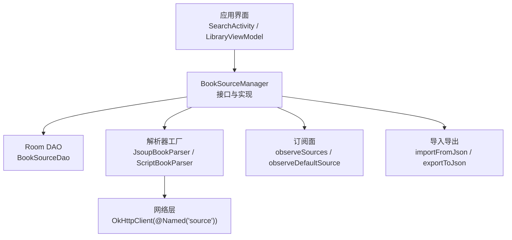
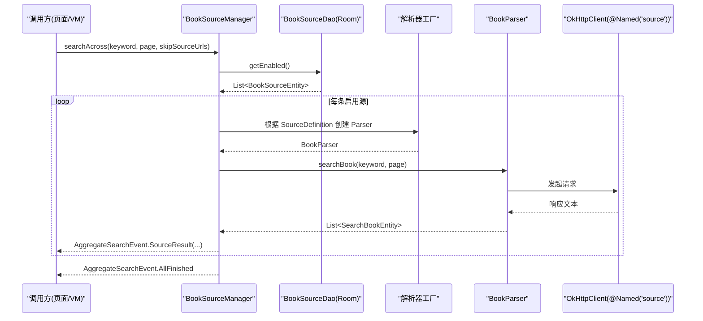
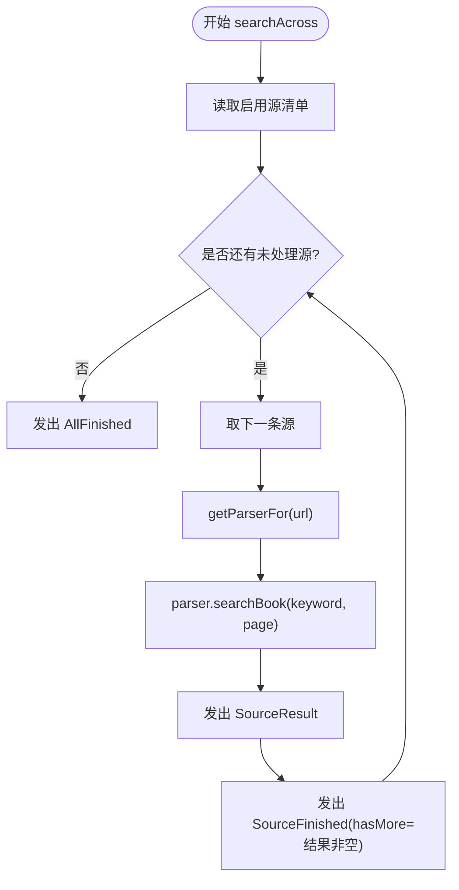
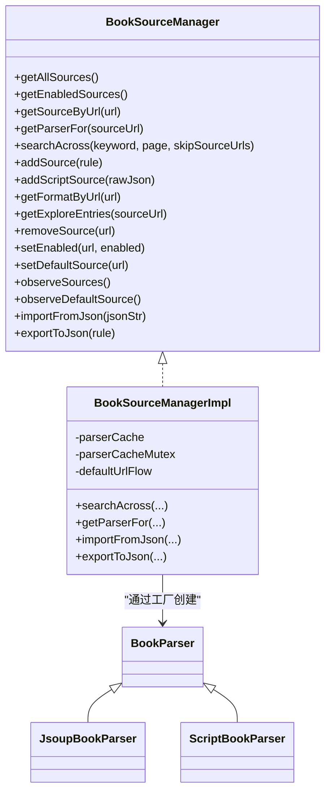

# 书源测试验证

<cite>
**本文引用的文件**
- [BookSourceManager.kt](file://lib_book_common/src/main/java/com/ebook/common/analyze/source/BookSourceManager.kt)
- [BookSourceManagerImpl.kt](file://lib_book_common/src/main/java/com/ebook/common/analyze/source/BookSourceManagerImpl.kt)
- [BookSourceManagerImplTest.kt](file://lib_book_common/src/test/java/com/ebook/common/analyze/source/BookSourceManagerImplTest.kt)
- [FakeBookSourceManager.kt](file://lib_book_common/src/test/java/com/ebook/common/analyze/source/FakeBookSourceManager.kt)
- [EncodingInterceptorTest.kt](file://lib_ebook_api/src/test/java/com/ebook/api/intercepter/EncodingInterceptorTest.kt)
- [JsoupSourceReaderTest.kt](file://lib_book_common/src/test/java/com/ebook/common/analyze/source/JsoupSourceReaderTest.kt)
- [ScriptHttpTest.kt](file://lib_book_source/src/test/java/com/ebook/source/script/ScriptHttpTest.kt)
- [SandboxScriptJsTest.kt](file://lib_book_source/src/test/java/com/ebook/source/sandbox/SandboxScriptJsTest.kt)
- [SearchViewModelTest.kt](file://module_find/src/test/java/com/ebook/find/mvvm/viewmodel/SearchViewModelTest.kt)
- [SourceDefinitionTest.kt](file://lib_ebook_api/src/test/java/com/ebook/api/entity/SourceDefinitionTest.kt)
- [test-coverage-todo.md](file://docs/test-coverage-todo.md)
</cite>

## 目录
1. [简介](#简介)
2. [项目结构](#项目结构)
3. [核心组件](#核心组件)
4. [架构总览](#架构总览)
5. [详细组件分析](#详细组件分析)
6. [依赖关系分析](#依赖关系分析)
7. [性能考量](#性能考量)
8. [故障排查指南](#故障排查指南)
9. [结论](#结论)
10. [附录](#附录)

## 简介
本指南面向“新开发书源的测试与验证”，围绕 BookSourceManager 提供的工具与方法，系统说明如何完成导入导出、聚合搜索、规则语法检查、网络请求调试、解析结果校验、自动化测试框架使用以及性能测试要点。文档以代码事实为依据，配合流程图与类图帮助读者快速上手并建立稳定的验收标准。

## 项目结构
与书源测试强相关的模块与文件：
- lib_book_common：书源管理接口与实现、管理器测试、Jsoup 读取器测试等
- lib_book_source：脚本书源 HTTP 与沙箱执行相关测试
- lib_ebook_api：网络层拦截器测试、书源定义测试
- module_find：书城搜索视图模型集成测试（聚合搜索端到端）

图示来源
- [BookSourceManager.kt:51-277](file://lib_book_common/src/main/java/com/ebook/common/analyze/source/BookSourceManager.kt#L51-L277)
- [BookSourceManagerImpl.kt:84-119](file://lib_book_common/src/main/java/com/ebook/common/analyze/source/BookSourceManagerImpl.kt#L84-L119)

章节来源
- [BookSourceManager.kt:51-277](file://lib_book_common/src/main/java/com/ebook/common/analyze/source/BookSourceManager.kt#L51-L277)
- [BookSourceManagerImpl.kt:84-119](file://lib_book_common/src/main/java/com/ebook/common/analyze/source/BookSourceManagerImpl.kt#L84-L119)

## 核心组件
- BookSourceManager：多书源清单的唯一入口，提供：
  - importFromJson：将一段书源 JSON 解成规则对象，不落库、不改变状态
  - exportToJson：将规则对象导出为美化 JSON
  - searchAcross：对启用中的书源并发聚合搜索，按事件流增量产出
  - getParserFor：按 URL 取解析器（LRU 缓存），支持原生与脚本两种后端
  - observeSources/observeDefaultSource：清单与默认源的响应式读取
- BookSourceManagerImpl：实现上述能力，含 LRU 缓存、默认源现算、格式路由、写路径收敛等
- FakeBookSourceManager：轻量替身，用于上层模块测试中按 tag 获取解析器的契约测试
- 网络层与沙箱：
  - OkHttp 纯净客户端 @Named("source") 用于书源请求
  - 脚本书源通过 ScriptBookParser + 沙箱执行器执行 JS 段
  - 编码拦截器测试确保内容类型与正文可读性

章节来源
- [BookSourceManager.kt:51-277](file://lib_book_common/src/main/java/com/ebook/common/analyze/source/BookSourceManager.kt#L51-L277)
- [BookSourceManagerImpl.kt:84-119](file://lib_book_common/src/main/java/com/ebook/common/analyze/source/BookSourceManagerImpl.kt#L84-L119)
- [FakeBookSourceManager.kt:35-129](file://lib_book_common/src/test/java/com/ebook/common/analyze/source/FakeBookSourceManager.kt#L35-L129)
- [EncodingInterceptorTest.kt:22-51](file://lib_ebook_api/src/test/java/com/ebook/api/intercepter/EncodingInterceptorTest.kt#L22-L51)

## 架构总览

图示来源
- [BookSourceManagerImpl.kt:464-510](file://lib_book_common/src/main/java/com/ebook/common/analyze/source/BookSourceManagerImpl.kt#L464-L510)
- [BookSourceManagerImpl.kt:109-118](file://lib_book_common/src/main/java/com/ebook/common/analyze/source/BookSourceManagerImpl.kt#L109-L118)

## 详细组件分析

### 导入导出与数据交换
- importFromJson(jsonStr): 纯函数解码，要求 name/url 非空；失败返回 null
- exportToJson(rule): 将规则对象序列化为带缩进的 JSON，便于社区交换与人工编辑
- 建议用例
  - 正向：给定合法 JSON，断言解析出的 rule.name/rule.url 非空
  - 反向：从规则对象导出 JSON，再反解回 rule，字段一致
  - 边界：空字符串、缺失关键字段、非法 JSON 均不应抛异常到调用栈

章节来源
- [BookSourceManager.kt:267-276](file://lib_book_common/src/main/java/com/ebook/common/analyze/source/BookSourceManager.kt#L267-L276)
- [BookSourceManagerImpl.kt:856-865](file://lib_book_common/src/main/java/com/ebook/common/analyze/source/BookSourceManagerImpl.kt#L856-L865)

### 聚合搜索 searchAcross
- 并发上限：AGGREGATE_SEARCH_CONCURRENCY = 5，避免对第三方站点触发风控
- 单源失败隔离：任何一条源抛异常仅记录该源的 Failed 与 Finished(hasMore=false)，其它源继续
- 取消语义：CancellationException 原样上抛，不视为失败
- 到底判定：由调用方依据 noteUrl 去重与 hasMore 推进，Manager 不持有会话状态
- 事件流：Started → Result → Finished（或 Failed→Finished），最终 AllFinished

图示来源
- [BookSourceManagerImpl.kt:464-510](file://lib_book_common/src/main/java/com/ebook/common/analyze/source/BookSourceManagerImpl.kt#L464-L510)

章节来源
- [BookSourceManagerImpl.kt:147-167](file://lib_book_common/src/main/java/com/ebook/common/analyze/source/BookSourceManagerImpl.kt#L147-L167)
- [BookSourceManagerImpl.kt:464-510](file://lib_book_common/src/main/java/com/ebook/common/analyze/source/BookSourceManagerImpl.kt#L464-L510)
- [BookSourceManagerImplTest.kt:1162-1399](file://lib_book_common/src/test/java/com/ebook/common/analyze/source/BookSourceManagerImplTest.kt#L1162-L1399)

### 规则语法检查与能力检测
- 脚本书源装载期登记 unsupported 集合（能力缺失），尚未上 UI，但可作为逐项警示的数据源
- irregularFields：当社区 JSON 的键名与原生 BookSourceRule 同形不同义时，会被规则类型化读面挡下，避免空规则被误用
- 建议用例
  - 针对社区常见冲突键（如 headers 数组 vs Map、weight 可为 null）构造样本，断言不会导致整行丢失
  - 对坏 JSON 的脚本源，断言在首次求值（search/getBookInfo/fetchLibraryData）抛出类型化装载失败，消息包含可进文案的提示

章节来源
- [BookSourceManagerImplTest.kt:524-706](file://lib_book_common/src/test/java/com/ebook/common/analyze/source/BookSourceManagerImplTest.kt#L524-L706)
- [BookSourceManagerImplTest.kt:734-760](file://lib_book_common/src/test/java/com/ebook/common/analyze/source/BookSourceManagerImplTest.kt#L734-L760)

### 网络请求调试
- 书源请求走 @Named("source") 的纯净 OkHttpClient，不携带用户 token
- 编码拦截器保障 contentType 强制与正文可读性
- 脚本书源通过 ScriptHttp 进行 URL 与请求构建，配合沙箱执行器执行 JS 段
- 建议调试手段
  - 使用 EncodingInterceptorTest 的思路构造响应体，断言 contentType 与 body.string() 正确
  - 对脚本书源，结合 SandboxScriptJsTest 验证 JS 回调与外呼行为
  - 对 URL/JSONPath/分页模板，使用 ScriptHttpTest 覆盖关键分支

章节来源
- [EncodingInterceptorTest.kt:22-51](file://lib_ebook_api/src/test/java/com/ebook/api/intercepter/EncodingInterceptorTest.kt#L22-L51)
- [ScriptHttpTest.kt](file://lib_book_source/src/test/java/com/ebook/source/script/ScriptHttpTest.kt)
- [SandboxScriptJsTest.kt](file://lib_book_source/src/test/java/com/ebook/source/sandbox/SandboxScriptJsTest.kt)

### 解析结果验证流程
- 搜索结果校验
  - 断言每个源的事件顺序：Started → Result → Finished（或 Failed→Finished）
  - 断言结果的归属：tag=源 URL，origin=源名（由解析器写入）
  - 空页即该源到底，hasMore=false
- 详情页数据提取验证
  - 对 getBookInfo 与 fetchLibraryData 的失败场景，断言类型化异常而非静默空结果
- 目录结构完整性检查
  - 对目录/分类条目，断言返回形状统一（原生 kinds 与脚本 exploreUrl 映射为同一数据结构）

章节来源
- [BookSourceManagerImplTest.kt:1162-1399](file://lib_book_common/src/test/java/com/ebook/common/analyze/source/BookSourceManagerImplTest.kt#L1162-L1399)
- [BookSourceManagerImplTest.kt:845-883](file://lib_book_common/src/test/java/com/ebook/common/analyze/source/BookSourceManagerImplTest.kt#L845-L883)

### 自动化测试框架使用方法
- 单元测试
  - 使用 Robolectric 运行需要 Android 环境的测试（如 SharedPreferences）
  - 使用协程测试工具 runTest、虚拟时间 delay 控制并发时序
  - 注入假 parser 工厂，避免真实网络请求
- 集成测试用例
  - SearchViewModelTest 验证书城搜索与聚合事件的端到端对接
  - 使用 FakeBookSourceManager 验证按 tag 取 parser 的契约
- Mock 数据准备
  - 内存 DAO 假件（FakeBookSourceDao）对齐真 DAO 排序与 REPLACE 语义
  - FakeSearchParser 按页码返回固定结果，并可配置失败与挂起时长

章节来源
- [BookSourceManagerImplTest.kt:44-79](file://lib_book_common/src/test/java/com/ebook/common/analyze/source/BookSourceManagerImplTest.kt#L44-L79)
- [BookSourceManagerImplTest.kt:1435-1580](file://lib_book_common/src/test/java/com/ebook/common/analyze/source/BookSourceManagerImplTest.kt#L1435-L1580)
- [SearchViewModelTest.kt](file://module_find/src/test/java/com/ebook/find/mvvm/viewmodel/SearchViewModelTest.kt)
- [FakeBookSourceManager.kt:35-129](file://lib_book_common/src/test/java/com/ebook/common/analyze/source/FakeBookSourceManager.kt#L35-L129)

### 性能测试要点
- 并发请求控制
  - 聚合搜索并发上限为 5，需通过计数器断言同时运行的任务数不超过阈值
- 超时处理
  - 对慢站点引入虚拟延迟（delay），避免真实等待；必要时为网络层配置合理超时
- 内存使用监控
  - LRU 容量为 3，覆盖“第四个源淘汰最久未用”的场景
  - 注意脚本解析器实例按 URL 各建一份进入缓存，避免共享可变状态

章节来源
- [BookSourceManagerImplTest.kt:400-416](file://lib_book_common/src/test/java/com/ebook/common/analyze/source/BookSourceManagerImplTest.kt#L400-L416)
- [BookSourceManagerImplTest.kt:1259-1284](file://lib_book_common/src/test/java/com/ebook/common/analyze/source/BookSourceManagerImplTest.kt#L1259-L1284)

## 依赖关系分析

图示来源
- [BookSourceManager.kt:51-277](file://lib_book_common/src/main/java/com/ebook/common/analyze/source/BookSourceManager.kt#L51-L277)
- [BookSourceManagerImpl.kt:84-119](file://lib_book_common/src/main/java/com/ebook/common/analyze/source/BookSourceManagerImpl.kt#L84-L119)

章节来源
- [BookSourceManager.kt:51-277](file://lib_book_common/src/main/java/com/ebook/common/analyze/source/BookSourceManager.kt#L51-L277)
- [BookSourceManagerImpl.kt:84-119](file://lib_book_common/src/main/java/com/ebook/common/analyze/source/BookSourceManagerImpl.kt#L84-L119)

## 性能考量
- 聚合搜索并发度控制在 5，避免对第三方站点造成压力
- LRU 解析器缓存容量为 3，保证活跃书籍的解析器复用
- 单源失败不中断整体流，减少无效重试与资源浪费
- 脚本解析器惰性装载，构造期不解析，首次求值才暴露规则问题

[本节为通用指导，无需特定文件引用]

## 故障排查指南
- 导入失败
  - importFromJson 返回 null：检查 JSON 结构与关键字段
  - addScriptSource 失败：检查 bookSourceName/bookSourceUrl 与 JSON 合法性
- 解析失败
  - 脚本源求值抛类型化异常：检查 rule_json 是否损坏或缺少必要能力
  - 原生规则解码失败：脏行应跳过，不影响其他源
- 网络问题
  - 编码拦截器：确认 contentType 强制与正文可读性
  - 脚本外呼：通过沙箱执行器与白名单检查定位问题
- 聚合搜索异常
  - 单源失败会发 Failed+Finished，检查具体源的错误信息
  - 取消异常原样上抛，避免把取消当成失败

章节来源
- [BookSourceManagerImplTest.kt:485-519](file://lib_book_common/src/test/java/com/ebook/common/analyze/source/BookSourceManagerImplTest.kt#L485-L519)
- [BookSourceManagerImplTest.kt:734-760](file://lib_book_common/src/test/java/com/ebook/common/analyze/source/BookSourceManagerImplTest.kt#L734-L760)
- [EncodingInterceptorTest.kt:22-51](file://lib_ebook_api/src/test/java/com/ebook/api/intercepter/EncodingInterceptorTest.kt#L22-L51)

## 结论
通过 BookSourceManager 提供的 importFromJson、exportToJson、searchAcross 等方法，结合完善的单元测试与集成测试，可以对新开发的书源进行全面的测试与验证。重点包括：规则语法检查、网络请求调试、解析结果校验、并发与缓存控制、以及脚本书源的惰性装载与能力检测。遵循本指南的测试策略与最佳实践，可显著提升书源质量与稳定性。

[本节为总结，无需特定文件引用]

## 附录
- 测试覆盖率待办见 docs/test-coverage-todo.md
- 推荐新增用例
  - 导入导出闭环：JSON ↔ Rule 双向一致性
  - 聚合搜索端到端：事件顺序、失败隔离、到底判定
  - 脚本书源能力检测：unsupported 集合与异常消息
  - 网络层编码与内容类型：拦截器行为验证

章节来源
- [test-coverage-todo.md](file://docs/test-coverage-todo.md)