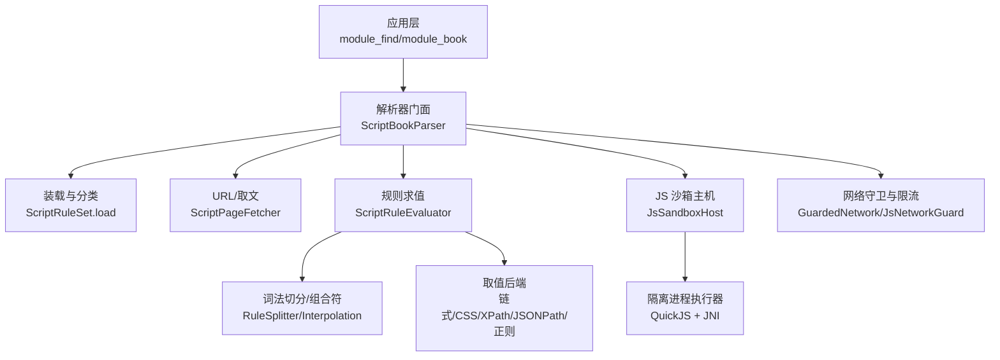
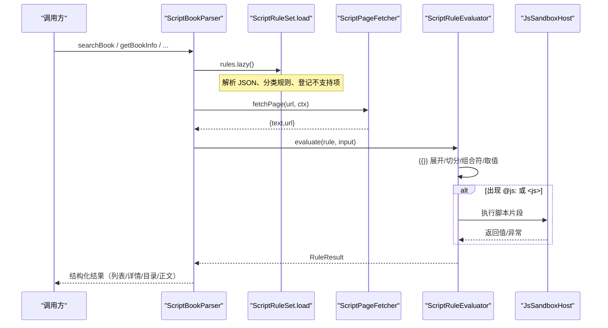
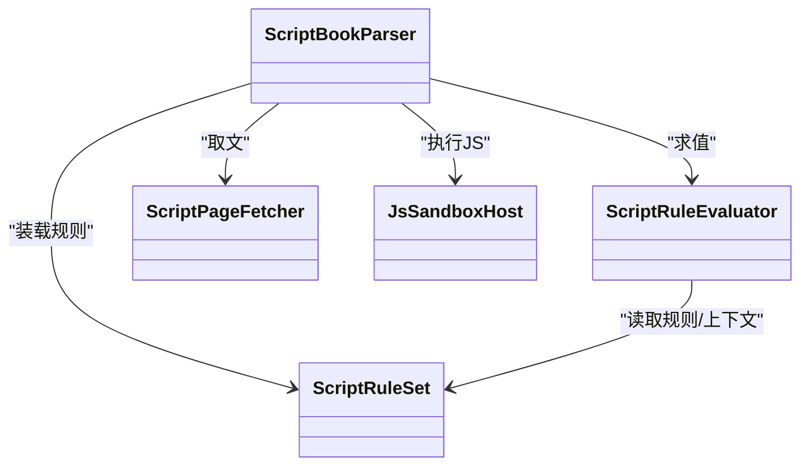

# 脚本规则开发

<cite>
**本文引用的文件**   
- [脚本书源格式：规则语言的行为与语法规格（清洁室）](file://docs/superpowers/specs/2026-09-08-script-source-rule-grammar.md)
- [ScriptRuleSet.kt](file://lib_book_source/src/main/java/com/ebook/source/script/ScriptRuleSet.kt)
- [ScriptBookParser.kt](file://lib_book_source/src/main/java/com/ebook/source/analyze/ScriptBookParser.kt)
- [ScriptRuleEvaluator.kt](file://lib_book_source/src/main/java/com/ebook/source/script/ScriptRuleEvaluator.kt)
- [JsSandboxHost.kt](file://lib_book_source/src/main/java/com/ebook/source/sandbox/JsSandboxHost.kt)
</cite>

## 目录
1. [简介](#简介)
2. [项目结构与定位](#项目结构与定位)
3. [核心组件总览](#核心组件总览)
4. [架构概览](#架构概览)
5. [详细组件分析](#详细组件分析)
6. [依赖关系分析](#依赖关系分析)
7. [性能与资源约束](#性能与资源约束)
8. [故障排查指南](#故障排查指南)
9. [结论与最佳实践](#结论与最佳实践)
10. [附录：能力矩阵与不支持项速查](#附录：能力矩阵与不支持项速查)

## 简介
本指南面向需要编写“脚本化书源”的开发者，围绕仓库内已落地的脚本规则体系，系统说明以下内容：
- 脚本规则的装载过程：从原始 JSON 解析到规则对象分类、能力检测。
- JavaScript 语法规则的执行方式：@js: 模式、<js> 内联标签、init 初始化、webJs 等。
- 脚本变量系统：source.getVariable()、{{key}} 模板替换、header 头部配置、loginUrl 等源级字段。
- JavaScript API 接口：网络请求、HTML 解析、数据提取、状态管理等宿主方法调用。
- 沙箱安全机制：白名单限制、权限控制、异常处理。
- 实战示例与调试优化建议、常见陷阱避免。

## 项目结构与定位
脚本规则相关实现集中在 lib_book_source 模块，负责词法切分、求值、取文与沙箱执行；与上层业务通过 BookParser 五面（搜索/详情/目录/发现/正文）对接。规格文档位于 docs/superpowers/specs，是规则行为的权威事实源。

图表来源
- [ScriptBookParser.kt:57-118](file://lib_book_source/src/main/java/com/ebook/source/analyze/ScriptBookParser.kt#L57-L118)
- [ScriptRuleSet.kt:139-237](file://lib_book_source/src/main/java/com/ebook/source/script/ScriptRuleSet.kt#L139-L237)
- [ScriptRuleEvaluator.kt:18-41](file://lib_book_source/src/main/java/com/ebook/source/script/ScriptRuleEvaluator.kt#L18-L41)
- [JsSandboxHost.kt:21-60](file://lib_book_source/src/main/java/com/ebook/source/sandbox/JsSandboxHost.kt#L21-L60)

章节来源
- [脚本书源格式：规则语言的行为与语法规格（清洁室）](file://docs/superpowers/specs/2026-09-08-script-source-rule-grammar.md)
- [ScriptBookParser.kt:57-118](file://lib_book_source/src/main/java/com/ebook/source/analyze/ScriptBookParser.kt#L57-L118)
- [ScriptRuleSet.kt:139-237](file://lib_book_source/src/main/java/com/ebook/source/script/ScriptRuleSet.kt#L139-L237)

## 核心组件总览
- ScriptRuleSet：负责将原始 JSON 装载为可求值的规则表，并登记不支持/延后能力。
- ScriptBookParser：装配装载、取文、求值与沙箱，暴露 BookParser 五面。
- ScriptRuleEvaluator：执行规则串求值，处理插值、组合符、取值器与正则替换。
- JsSandboxHost：主进程侧的沙箱装配与任务桥接，提供安全外呼与 cookie 会话管理。

章节来源
- [ScriptRuleSet.kt:12-99](file://lib_book_source/src/main/java/com/ebook/source/script/ScriptRuleSet.kt#L12-L99)
- [ScriptBookParser.kt:57-118](file://lib_book_source/src/main/java/com/ebook/source/analyze/ScriptBookParser.kt#L57-L118)
- [ScriptRuleEvaluator.kt:18-41](file://lib_book_source/src/main/java/com/ebook/source/script/ScriptRuleEvaluator.kt#L18-L41)
- [JsSandboxHost.kt:21-60](file://lib_book_source/src/main/java/com/ebook/source/sandbox/JsSandboxHost.kt#L21-L60)

## 架构概览
脚本规则的整体流程如下：
- 装载期：原始 JSON → ScriptRuleSet.load → 规则对象分类 + 能力检测（标记 JS/XPath/不支持项）。
- 运行期：按页面场景（搜索/详情/目录/发现/正文）构建 EvalContext → 取文 → 规则求值 → 结果落位 → 翻页链。
- 执行期：遇到 @js:/<js> 时进入沙箱，通过 JsSandboxHost 在隔离进程执行，并通过 GuardedNetwork 与 SourceCookieJar 进行安全外呼与会话管理。

图表来源
- [ScriptBookParser.kt:183-199](file://lib_book_source/src/main/java/com/ebook/source/analyze/ScriptBookParser.kt#L183-L199)
- [ScriptRuleSet.kt:139-237](file://lib_book_source/src/main/java/com/ebook/source/script/ScriptRuleSet.kt#L139-L237)
- [ScriptRuleEvaluator.kt:18-41](file://lib_book_source/src/main/java/com/ebook/source/script/ScriptRuleEvaluator.kt#L18-L41)
- [JsSandboxHost.kt:21-60](file://lib_book_source/src/main/java/com/ebook/source/sandbox/JsSandboxHost.kt#L21-L60)

## 详细组件分析

### 脚本规则装载：原始 JSON 解析、规则对象分类、能力检测
- 入口：ScriptRuleSet.load(rawJson) 解析顶层 JSON，保留字符串型规则字段至 objects，非字符串形态记录到 irregularFields，供后续展开使用。
- 能力检测：对每个规则串进行模式判定（JS/XPath/@cache:），登记到 unsupported 集合；同时检测源级字段如 loginUrl/jsLib/webJs 等，标记为不支持/延后。
- 输出：提供 rule(kind, field) 取规则串、jsonField(kind, field) 取原始节点用于数组展开、nextUrlArray 取 URL 数组（目录/正文翻页）。

章节来源
- [ScriptRuleSet.kt:51-99](file://lib_book_source/src/main/java/com/ebook/source/script/ScriptRuleSet.kt#L51-L99)
- [ScriptRuleSet.kt:139-237](file://lib_book_source/src/main/java/com/ebook/source/script/ScriptRuleSet.kt#L139-L237)
- [脚本书源格式：规则语言的行为与语法规格（清洁室）](file://docs/superpowers/specs/2026-09-08-script-source-rule-grammar.md)

### JavaScript 语法规则执行：@js:、<js>、init、webJs
- @js: 段：整条规则以标志开头即进入 JS 分支，交由沙箱执行。
- <js>…</js> 内联段：可在任意位置出现并充当分隔符；无闭合时按“整条规则写成 JS”处置。
- init 初始化：详情页预处理，支持 AllInOne 首个匹配为上下文；JS 分支返回对象时按对象键取值（Plan 3 对齐）。
- webJs：明确延后，导入时如实报告不支持；当前不消费。

章节来源
- [脚本书源格式：规则语言的行为与语法规格（清洁室）](file://docs/superpowers/specs/2026-09-08-script-source-rule-grammar.md)
- [ScriptRuleEvaluator.kt:76-85](file://lib_book_source/src/main/java/com/ebook/source/script/ScriptRuleEvaluator.kt#L76-L85)

### 脚本变量系统：source.getVariable()、{{key}}、header、loginUrl
- source 对象数据面：装载期快照，包含 bookSourceUrl/name/group/comment/variable/header/loginUrl/lastUpdateTime 等可选键（仅声明过才占位）。
- 变量作用域：@put:/@get: 与 java.put/java.get 折叠到任务级变量表；source.getVariable()/setVariable(s) 作为整串变量，初值来自规则 variable 键。
- {{key}} 模板：在 URL 中 key/page 可用；{{}} 内若无标志则按 JS 求值，标量回填文本，undefined/null 展开为空串，对象/数组抛类型化异常。
- header 与 loginUrl：源级字段可读；本项目不消费源级默认头，登录相关字段仅作配置展示。

章节来源
- [ScriptRuleSet.kt:100-121](file://lib_book_source/src/main/java/com/ebook/source/script/ScriptRuleSet.kt#L100-L121)
- [脚本书源格式：规则语言的行为与语法规格（清洁室）](file://docs/superpowers/specs/2026-09-08-script-source-rule-grammar.md)

### JavaScript API 接口：网络、HTML 解析、数据提取、状态管理
- 网络：java.ajax/load/post 走守门客户端，带 host 白名单与私网拒绝；cookie 面（get/set/remove）落在源级会话罐。
- HTML 解析：链式选择器、CSS 模式、XPath（延后）、JSONPath、正则 AllInOne；取值器包括 text/html/href/src/all/ownText/textNodes 等。
- 数据提取：索引语法、组合符（&&/||/%%）、正则净化/OnlyOne、URL 选项尾段。
- 状态管理：EvalContext.variables 跨多次沙箱调用可见；globalThis 随单次执行重建；cookie 会话不落盘。

章节来源
- [脚本书源格式：规则语言的行为与语法规格（清洁室）](file://docs/superpowers/specs/2026-09-08-script-source-rule-grammar.md)
- [JsSandboxHost.kt:21-60](file://lib_book_source/src/main/java/com/ebook/source/sandbox/JsSandboxHost.kt#L21-L60)

### 沙箱安全机制：白名单、权限、异常
- 白名单：从规则原文导出 SourceHostAllowlist，仅允许可信域名；未知域名一律拒绝。
- 权限：沙箱进程零权限，网络必须经 GuardedNetwork；禁用代理与私网访问。
- 异常：未装配执行器抛「需脚本沙箱执行器」；执行失败抛「脚本执行失败」并携带内核原文；语法错误按「未取到值」参与 || 短路但全部失败时抛出最后错误。

章节来源
- [ScriptBookParser.kt:86-111](file://lib_book_source/src/main/java/com/ebook/source/analyze/ScriptBookParser.kt#L86-L111)
- [脚本书源格式：规则语言的行为与语法规格（清洁室）](file://docs/superpowers/specs/2026-09-08-script-source-rule-grammar.md)

## 依赖关系分析
- 模块依赖方向：业务模块 → lib_book_common → lib_book_source（脚本解析与沙箱）→ lib_ebook_api/lib_ebook_db（数据实体与网络）。
- 内部耦合：
  - ScriptBookParser 依赖 ScriptRuleSet（装载）、ScriptRuleEvaluator（求值）、ScriptPageFetcher（取文）、JsSandboxHost（执行）。
  - ScriptRuleEvaluator 依赖词法切分与取值后端，组合符逻辑集中于此。
  - JsSandboxHost 封装隔离进程执行与回调路由，确保任务级安全与一致性。

图表来源
- [ScriptBookParser.kt:57-118](file://lib_book_source/src/main/java/com/ebook/source/analyze/ScriptBookParser.kt#L57-L118)
- [ScriptRuleSet.kt:139-237](file://lib_book_source/src/main/java/com/ebook/source/script/ScriptRuleSet.kt#L139-L237)
- [ScriptRuleEvaluator.kt:18-41](file://lib_book_source/src/main/java/com/ebook/source/script/ScriptRuleEvaluator.kt#L18-L41)
- [JsSandboxHost.kt:21-60](file://lib_book_source/src/main/java/com/ebook/source/sandbox/JsSandboxHost.kt#L21-L60)

章节来源
- [ScriptBookParser.kt:57-118](file://lib_book_source/src/main/java/com/ebook/source/analyze/ScriptBookParser.kt#L57-L118)
- [ScriptRuleSet.kt:139-237](file://lib_book_source/src/main/java/com/ebook/source/script/ScriptRuleSet.kt#L139-L237)
- [ScriptRuleEvaluator.kt:18-41](file://lib_book_source/src/main/java/com/ebook/source/script/ScriptRuleEvaluator.kt#L18-L41)
- [JsSandboxHost.kt:21-60](file://lib_book_source/src/main/java/com/ebook/source/sandbox/JsSandboxHost.kt#L21-L60)

## 性能与资源约束
- 执行时机：所有 JS 片段必须在非主线程执行；回调回主进程需经 binder 线程池，避免死锁。
- 超时与配额：单帧受限（wall-clock 超时、堆/栈限制），超限销毁该帧；外呼受配额与白名单限制。
- 缓存与序列化：字节材料通过令牌过边界，减少跨进程开销；JSONPath 切片按标准半开方言，避免误用闭区间。
- 翻页链防御：目录/正文翻页有上限与回环检测，防止无限循环与串章。

章节来源
- [脚本书源格式：规则语言的行为与语法规格（清洁室）](file://docs/superpowers/specs/2026-09-08-script-source-rule-grammar.md)

## 故障排查指南
- 症状：页面不闪退但数据永远加载不出来
  - 可能原因：关键字未编码导致非法 URL、charset 乱码、白名单拒绝、规则语法错误被 || 短路吞掉。
  - 排查步骤：检查 {{key}} 是否按表单百分号编码；确认 charset 设置；核对域名是否在白名单；查看日志中的类型化异常消息。
- 症状：脚本执行失败但不报错
  - 可能原因：未装配执行器、执行器超时、返回值类型不符（对象/数组抛异常）。
  - 排查步骤：确认 jsHost 已装配；查看执行器日志；简化 JS 片段逐步定位问题。
- 症状：cookie 失效或会话丢失
  - 可能原因：会话不落盘、冷启动后读到空串；声明式链路不带罐。
  - 排查步骤：确认使用 @js: 发起登录；检查 cookie.getCookie/setCookie 调用；理解会话生命周期。

章节来源
- [脚本书源格式：规则语言的行为与语法规格（清洁室）](file://docs/superpowers/specs/2026-09-08-script-source-rule-grammar.md)
- [ScriptBookParser.kt:86-111](file://lib_book_source/src/main/java/com/ebook/source/analyze/ScriptBookParser.kt#L86-L111)

## 结论与最佳实践
- 优先使用声明式规则（链式/CSS/JSONPath/正则），仅在必要时引入 JS。
- 严格遵循 URL 选项与字符集设置，避免乱码与非法请求。
- 善用组合符 &&/||/%% 提高鲁棒性，注意短路语义与合并策略。
- 使用白名单与守门客户端，避免绕过安全检查。
- 谨慎使用变量与作用域，避免跨任务污染；优先使用任务级变量表。
- 遇到问题先读规格与日志，定位到具体阶段（装载/求值/执行/取文）。

[无需来源：本节为总结性内容]

## 附录：能力矩阵与不支持项速查
- 已实现：链式/CSS/JSONPath/正则 AllInOne、组合符、索引语法、变量系统、URL 选项、POST 请求、charset、headers、timeout/retry、nextTocUrl/nextContentUrl、exploreUrl（文本格式一）。
- 延后/不支持：webJs/XPath/内容批量 contentBatch、发现页脚本程序形态、登录相关字段、段评 ruleReview、WebView 嗅探等。
- 导入提示：对不支持项逐条报告，避免静默坏源。

章节来源
- [脚本书源格式：规则语言的行为与语法规格（清洁室）](file://docs/superpowers/specs/2026-09-08-script-source-rule-grammar.md)