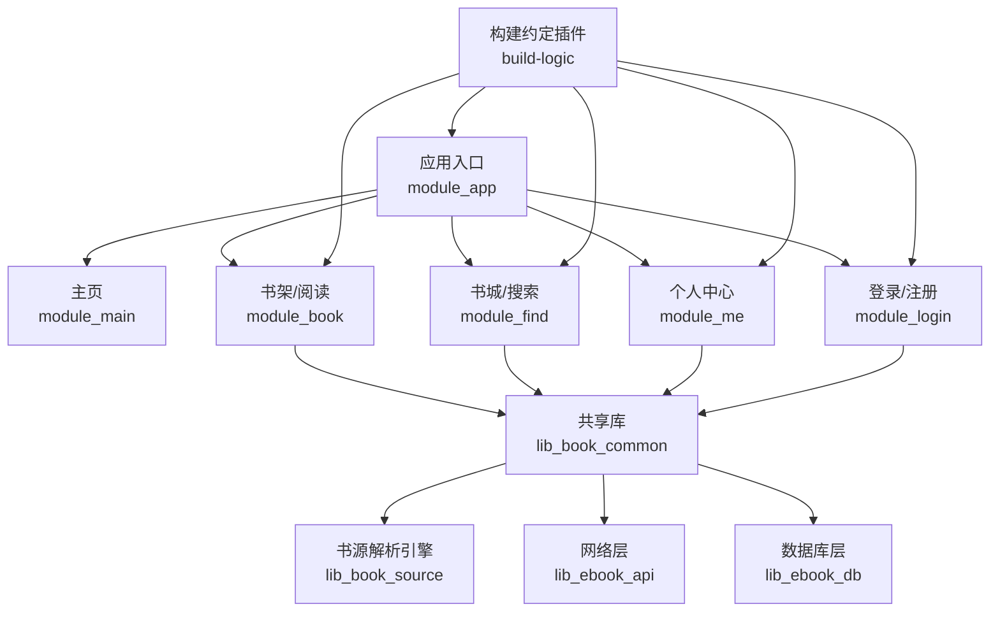
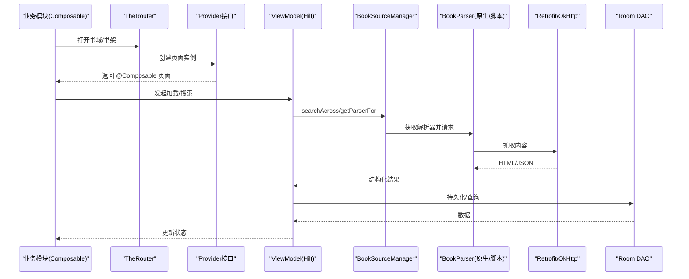
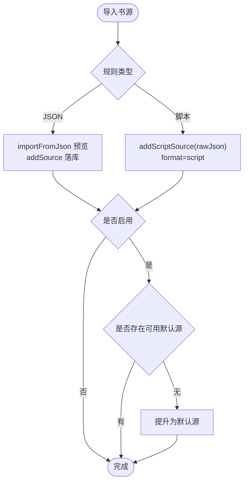
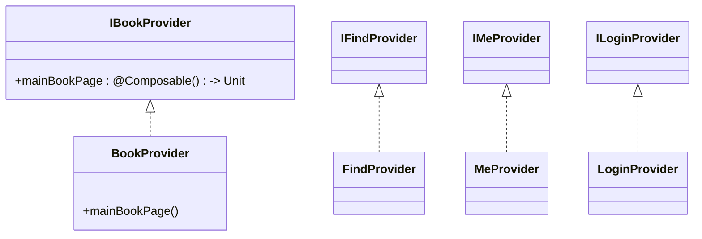
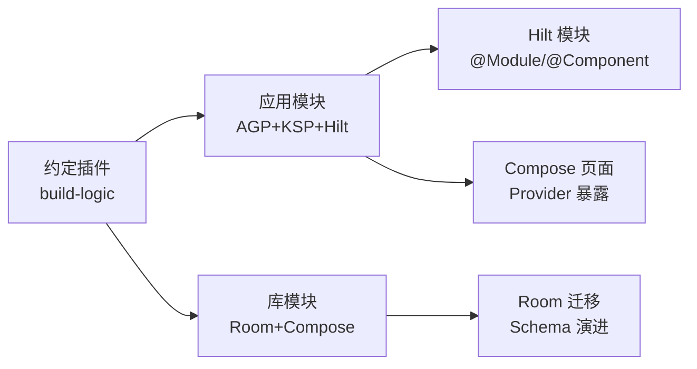
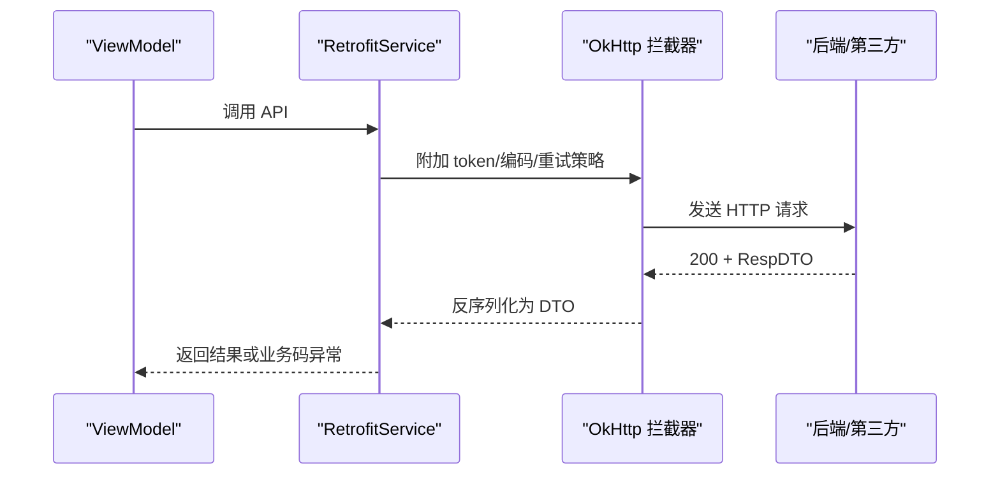
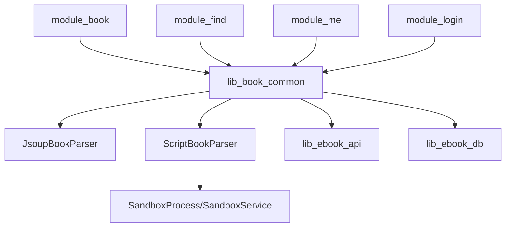

# 扩展开发

<cite>
**本文引用的文件**
- [README.MD](file://README.MD)
- [settings.gradle.kts](file://settings.gradle.kts)
- [build.gradle.kts](file://build.gradle.kts)
- [gradle/libs.versions.toml](file://gradle/libs.versions.toml)
- [lib_book_common/src/main/java/com/ebook/common/provider/IBookProvider.kt](file://lib_book_common/src/main/java/com/ebook/common/provider/IBookProvider.kt)
- [module_book/src/main/java/com/ebook/book/provider/BookProvider.kt](file://module_book/src/main/java/com/ebook/book/provider/BookProvider.kt)
- [module_find/src/main/java/com/ebook/find/provider/FindProvider.kt](file://module_find/src/main/java/com/ebook/find/provider/FindProvider.kt)
- [module_me/src/main/java/com/ebook/me/provider/MeProvider.kt](file://module_me/src/main/java/com/ebook/me/provider/MeProvider.kt)
- [module_login/src/main/java/com/ebook/login/provider/LoginProvider.kt](file://module_login/src/main/java/com/ebook/login/provider/LoginProvider.kt)
- [lib_book_common/src/main/java/com/ebook/common/analyze/source/BookSourceManager.kt](file://lib_book_common/src/main/java/com/ebook/common/analyze/source/BookSourceManager.kt)
- [lib_book_source/src/main/java/com/ebook/source/analyze/BookParser.kt](file://lib_book_source/src/main/java/com/ebook/source/analyze/BookParser.kt)
- [lib_book_source/src/main/java/com/ebook/source/analyze/JsoupBookParser.kt](file://lib_book_source/src/main/java/com/ebook/source/analyze/JsoupBookParser.kt)
- [lib_book_source/src/main/java/com/ebook/source/analyze/ScriptBookParser.kt](file://lib_book_source/src/main/java/com/ebook/source/analyze/ScriptBookParser.kt)
- [lib_book_source/src/main/java/com/ebook/source/script/ScriptRuleSet.kt](file://lib_book_source/src/main/java/com/ebook/source/script/ScriptRuleSet.kt)
- [lib_book_source/src/main/java/com/ebook/source/script/ScriptRuleEvaluator.kt](file://lib_book_source/src/main/java/com/ebook/source/script/ScriptRuleEvaluator.kt)
- [lib_book_source/src/main/java/com/ebook/source/sandbox/SandboxProcess.kt](file://lib_book_source/src/main/java/com/ebook/source/sandbox/SandboxProcess.kt)
- [lib_book_source/src/main/java/com/ebook/source/sandbox/SandboxService.kt](file://lib_book_source/src/main/java/com/ebook/source/sandbox/SandboxService.kt)
- [lib_ebook_api/src/main/java/com/ebook/api/RetrofitBuilder.kt](file://lib_ebook_api/src/main/java/com/ebook/api/RetrofitBuilder.kt)
- [lib_ebook_db/src/main/java/com/ebook/db/AppDatabase.kt](file://lib_ebook_db/src/main/java/com/ebook/db/AppDatabase.kt)
- [build-logic/convention/build-logic/convention/src/main/kotlin/HiltConventionPlugin.kt](file://build-logic/convention/build-logic/convention/src/main/kotlin/HiltConventionPlugin.kt)
- [build-logic/convention/build-logic/convention/src/main/kotlin/AndroidApplicationConventionPlugin.kt](file://build-logic/convention/build-logic/convention/src/main/kotlin/AndroidApplicationConventionPlugin.kt)
- [build-logic/convention/build-logic/convention/src/main/kotlin/AndroidLibraryConventionPlugin.kt](file://build-logic/convention/build-logic/convention/src/main/kotlin/AndroidLibraryConventionPlugin.kt)
- [build-logic/convention/build-logic/convention/src/main/kotlin/AndroidComposeConventionPlugin.kt](file://build-logic/convention/build-logic/convention/src/main/kotlin/AndroidComposeConventionPlugin.kt)
- [build-logic/convention/build-logic/convention/src/main/kotlin/AndroidRoomConventionPlugin.kt](file://build-logic/convention/build-logic/convention/src/main/kotlin/AndroidRoomConventionPlugin.kt)
</cite>

## 目录
1. [引言](#引言)
2. [项目结构](#项目结构)
3. [核心扩展点总览](#核心扩展点总览)
4. [架构总览](#架构总览)
5. [详细组件与扩展示例](#详细组件与扩展示例)
6. [依赖关系分析](#依赖关系分析)
7. [性能与稳定性建议](#性能与稳定性建议)
8. [调试与测试指南](#调试与测试指南)
9. [发布与维护](#发布与维护)
10. [结论](#结论)

## 引言
本指南面向希望扩展该 Android 电子书阅读器的开发者，覆盖“新增书源（JSON 规则与脚本规则）、模块扩展（Provider、路由、依赖注入）、插件化（Gradle 约定插件、Hilt 模块、Composable 页面）、API 集成（第三方服务、SDK、协议适配）、主题定制、配置扩展、调试与测试、以及发布维护”的全流程。文档以仓库事实为准，结合代码结构与约定插件进行说明，并提供可操作的步骤与图示。

## 项目结构
该项目采用多模块 MVVM + Compose 架构，功能模块通过 TheRouter + Provider 解耦，解析层集中在 lib_book_source，网络与数据分别在 lib_ebook_api 与 lib_ebook_db，构建与统一规范在 build-logic。

图表来源
- [settings.gradle.kts:55-65](file://settings.gradle.kts#L55-L65)
- [build.gradle.kts:1-15](file://build.gradle.kts#L1-L15)

章节来源
- [README.MD:86-104](file://README.MD#L86-L104)
- [settings.gradle.kts:55-65](file://settings.gradle.kts#L55-L65)
- [build.gradle.kts:1-15](file://build.gradle.kts#L1-L15)

## 核心扩展点总览
- 书源扩展：JSON 规则与脚本规则两条路径，均通过 BookSourceManager 管理并由解析器执行。
- 模块扩展：通过 Provider 暴露 Composable 页面，TheRouter 负责路由装配；Hilt 提供依赖注入。
- 插件扩展：使用自定义 Gradle 约定插件统一 AGP/KSP/Room/Hilt/Compose/Native 配置；可按需新增。
- API 集成：Retrofit 服务、拦截器、实体定义集中管理；支持多客户端命名隔离。
- 主题与样式：Material Design 3 全局主题，阅读背景主题独立于深浅色；图标资源按 Mipmap/drawable 组织。
- 配置扩展：版本目录 libs.versions.toml 管理依赖版本；构建属性 gradle.properties 控制行为；运行时配置由 Room/DataStore/SharedPreferences 承担。
- 调试与测试：JUnit 单元测试、Robolectric/Compose UI 测试、设备端 instrumented 测试；沙箱进程与原生桥接测试完备。

章节来源
- [gradle/libs.versions.toml:214-237](file://gradle/libs.versions.toml#L214-L237)
- [lib_book_common/src/main/java/com/ebook/common/provider/IBookProvider.kt:1-14](file://lib_book_common/src/main/java/com/ebook/common/provider/IBookProvider.kt#L1-L14)
- [lib_book_common/src/main/java/com/ebook/common/analyze/source/BookSourceManager.kt:10-50](file://lib_book_common/src/main/java/com/ebook/common/analyze/source/BookSourceManager.kt#L10-L50)

## 架构总览
系统分层清晰：UI 层（各 module）→ 领域层（lib_book_common）→ 解析与存储（lib_book_source/lib_ebook_api/lib_ebook_db）。跨模块通信通过 TheRouter + Provider；依赖注入通过 Hilt；解析引擎支持原生 Jsoup 与脚本 JS（QuickJS 沙箱）。

图表来源
- [lib_book_common/src/main/java/com/ebook/common/provider/IBookProvider.kt:1-14](file://lib_book_common/src/main/java/com/ebook/common/provider/IBookProvider.kt#L1-L14)
- [lib_book_common/src/main/java/com/ebook/common/analyze/source/BookSourceManager.kt:115-155](file://lib_book_common/src/main/java/com/ebook/common/analyze/source/BookSourceManager.kt#L115-L155)
- [lib_book_source/src/main/java/com/ebook/source/analyze/BookParser.kt](file://lib_book_source/src/main/java/com/ebook/source/analyze/BookParser.kt)
- [lib_ebook_api/src/main/java/com/ebook/api/RetrofitBuilder.kt](file://lib_ebook_api/src/main/java/com/ebook/api/RetrofitBuilder.kt)
- [lib_ebook_db/src/main/java/com/ebook/db/AppDatabase.kt](file://lib_ebook_db/src/main/java/com/ebook/db/AppDatabase.kt)

## 详细组件与扩展示例

### 一、新增书源（JSON 规则与脚本规则）
- JSON 规则：使用内置规则模型，通过 BookSourceManager.importFromJson 导入预览，addSource 落库；默认源与启用态由 Manager 统一处理。
- 脚本规则：将社区 JSON 作为 rawJson 调用 addScriptSource 存入；解析时由 ScriptBookParser 惰性装载规则，首次求值失败会抛出类型化异常。
- 规则校验与评估：规则词法与求值由 script 包完成；URL 解析、分页、聚合搜索等能力由解析器统一管理。

图表来源
- [lib_book_common/src/main/java/com/ebook/common/analyze/source/BookSourceManager.kt:157-180](file://lib_book_common/src/main/java/com/ebook/common/analyze/source/BookSourceManager.kt#L157-L180)
- [lib_book_common/src/main/java/com/ebook/common/analyze/source/BookSourceManager.kt:229-239](file://lib_book_common/src/main/java/com/ebook/common/analyze/source/BookSourceManager.kt#L229-L239)
- [lib_book_source/src/main/java/com/ebook/source/analyze/ScriptBookParser.kt](file://lib_book_source/src/main/java/com/ebook/source/analyze/ScriptBookParser.kt)

章节来源
- [lib_book_common/src/main/java/com/ebook/common/analyze/source/BookSourceManager.kt:51-277](file://lib_book_common/src/main/java/com/ebook/common/analyze/source/BookSourceManager.kt#L51-L277)
- [lib_book_source/src/main/java/com/ebook/source/script/ScriptRuleSet.kt](file://lib_book_source/src/main/java/com/ebook/source/script/ScriptRuleSet.kt)
- [lib_book_source/src/main/java/com/ebook/source/script/ScriptRuleEvaluator.kt](file://lib_book_source/src/main/java/com/ebook/source/script/ScriptRuleEvaluator.kt)

### 二、模块扩展（Provider、路由、依赖注入）
- Provider 接口：在 lib_book_common 中定义，如 IBookProvider、IFindProvider、IMeProvider、ILoginProvider，暴露 Composable 页面入口。
- 模块实现：各功能模块实现对应 Provider，例如 BookProvider、FindProvider、MeProvider、LoginProvider。
- 路由注册：TheRouter 自动扫描注解生成路由表，模块内 assets/therouter/routeMap.json 由构建期回写。
- 依赖注入：Hilt 在各模块装配 ViewModel、Repository、DataSource；Application 标记 @HiltAndroidApp，Activity/Fragment 标记 @AndroidEntryPoint。

图表来源
- [lib_book_common/src/main/java/com/ebook/common/provider/IBookProvider.kt:1-14](file://lib_book_common/src/main/java/com/ebook/common/provider/IBookProvider.kt#L1-L14)
- [module_book/src/main/java/com/ebook/book/provider/BookProvider.kt](file://module_book/src/main/java/com/ebook/book/provider/BookProvider.kt)
- [module_find/src/main/java/com/ebook/find/provider/FindProvider.kt](file://module_find/src/main/java/com/ebook/find/provider/FindProvider.kt)
- [module_me/src/main/java/com/ebook/me/provider/MeProvider.kt](file://module_me/src/main/java/com/ebook/me/provider/MeProvider.kt)
- [module_login/src/main/java/com/ebook/login/provider/LoginProvider.kt](file://module_login/src/main/java/com/ebook/login/provider/LoginProvider.kt)

章节来源
- [lib_book_common/src/main/java/com/ebook/common/provider/IBookProvider.kt:1-14](file://lib_book_common/src/main/java/com/ebook/common/provider/IBookProvider.kt#L1-L14)
- [module_book/src/main/java/com/ebook/book/provider/BookProvider.kt](file://module_book/src/main/java/com/ebook/book/provider/BookProvider.kt)
- [module_find/src/main/java/com/ebook/find/provider/FindProvider.kt](file://module_find/src/main/java/com/ebook/find/provider/FindProvider.kt)
- [module_me/src/main/java/com/ebook/me/provider/MeProvider.kt](file://module_me/src/main/java/com/ebook/me/provider/MeProvider.kt)
- [module_login/src/main/java/com/ebook/login/provider/LoginProvider.kt](file://module_login/src/main/java/com/ebook/login/provider/LoginProvider.kt)

### 三、插件扩展（Gradle 约定插件、Hilt 模块、Composable 组件）
- 约定插件：build-logic 提供 xrn1997.android.application/library/compose/lint/room/component/native 等插件 ID，用于统一 AGP、KSP、Room、Hilt、Compose 与 Native 编译配置。
- Hilt 模块：在业务模块中声明 @Module 并通过 Hilt 装配 Repository、DataSource、Network 客户端；通过 @Named("source") 或 @Named("release") 区分不同信任域客户端。
- Composable 组件：公共 UI 收敛到 lib_book_common 的 com.ebook.common.ui；新功能页以 @Composable 暴露，通过 Provider + TheRouter 接入。

图表来源
- [gradle/libs.versions.toml:214-237](file://gradle/libs.versions.toml#L214-L237)
- [build-logic/convention/build-logic/convention/src/main/kotlin/HiltConventionPlugin.kt](file://build-logic/convention/build-logic/convention/src/main/kotlin/HiltConventionPlugin.kt)
- [build-logic/convention/build-logic/convention/src/main/kotlin/AndroidApplicationConventionPlugin.kt](file://build-logic/convention/build-logic/convention/src/main/kotlin/AndroidApplicationConventionPlugin.kt)
- [build-logic/convention/build-logic/convention/src/main/kotlin/AndroidLibraryConventionPlugin.kt](file://build-logic/convention/build-logic/convention/src/main/kotlin/AndroidLibraryConventionPlugin.kt)
- [build-logic/convention/build-logic/convention/src/main/kotlin/AndroidComposeConventionPlugin.kt](file://build-logic/convention/build-logic/convention/src/main/kotlin/AndroidComposeConventionPlugin.kt)
- [build-logic/convention/build-logic/convention/src/main/kotlin/AndroidRoomConventionPlugin.kt](file://build-logic/convention/build-logic/convention/src/main/kotlin/AndroidRoomConventionPlugin.kt)

章节来源
- [gradle/libs.versions.toml:214-237](file://gradle/libs.versions.toml#L214-L237)
- [build-logic/convention/build-logic/convention/src/main/kotlin/HiltConventionPlugin.kt](file://build-logic/convention/build-logic/convention/src/main/kotlin/HiltConventionPlugin.kt)
- [build-logic/convention/build-logic/convention/src/main/kotlin/AndroidApplicationConventionPlugin.kt](file://build-logic/convention/build-logic/convention/src/main/kotlin/AndroidApplicationConventionPlugin.kt)
- [build-logic/convention/build-logic/convention/src/main/kotlin/AndroidLibraryConventionPlugin.kt](file://build-logic/convention/build-logic/convention/src/main/kotlin/AndroidLibraryConventionPlugin.kt)
- [build-logic/convention/build-logic/convention/src/main/kotlin/AndroidComposeConventionPlugin.kt](file://build-logic/convention/build-logic/convention/src/main/kotlin/AndroidComposeConventionPlugin.kt)
- [build-logic/convention/build-logic/convention/src/main/kotlin/AndroidRoomConventionPlugin.kt](file://build-logic/convention/build-logic/convention/src/main/kotlin/AndroidRoomConventionPlugin.kt)

### 四、API 集成（第三方服务、SDK、协议适配）
- Retrofit 服务：在 lib_ebook_api 中定义 Service 接口与实体 DTO；通过 RetrofitBuilder 构建客户端，拦截器统一处理编码、认证、重试。
- 多客户端隔离：使用 @Named("source") 与 @Named("release") 隔离书源请求与版本检查请求，避免 token 泄露或信封污染。
- 协议适配：服务端响应恒 200 + RespDTO 信封，业务码分三层（传输/业务/客户端），异常在 Adapter 层收口；第三方原始 JSON 不走通用适配器时直接映射实体。

图表来源
- [lib_ebook_api/src/main/java/com/ebook/api/RetrofitBuilder.kt](file://lib_ebook_api/src/main/java/com/ebook/api/RetrofitBuilder.kt)

章节来源
- [lib_ebook_api/src/main/java/com/ebook/api/RetrofitBuilder.kt](file://lib_ebook_api/src/main/java/com/ebook/api/RetrofitBuilder.kt)

### 五、主题定制（Material Design、样式、图标）
- 主题基线：Material Design 3 颜色与排版；全局主题由 Application 装配，页面不得重复包裹 MaterialTheme。
- 阅读背景主题：正文背景独立于深浅色模式，支持四档纸张色；控制器层随全局主题切换。
- 图标与资源：按 drawable/mipmap 多密度存放；公共图标收敛到 lib_book_common，避免业务模块重复。

章节来源
- [README.MD:106-121](file://README.MD#L106-L121)

### 六、配置扩展（配置文件、动态加载、验证）
- 依赖版本：通过 gradle/libs.versions.toml 统一管理，禁止硬编码版本号。
- 构建开关：gradle.properties 中的 isModule 控制模块独立运行；local.properties 注入后端基址 ebook.server.host。
- 运行时配置：Room Schema 演进必须添加迁移链；DataStore/SharedPreferences 管理用户偏好；默认源由 Room 现算，无同步初值。

章节来源
- [gradle/libs.versions.toml:1-71](file://gradle/libs.versions.toml#L1-L71)
- [lib_ebook_db/src/main/java/com/ebook/db/AppDatabase.kt](file://lib_ebook_db/src/main/java/com/ebook/db/AppDatabase.kt)
- [README.MD:62-84](file://README.MD#L62-L84)

## 依赖关系分析
- 模块依赖方向：业务模块 → lib_book_common → lib_book_source / lib_ebook_api / lib_ebook_db。
- 解析器契约：BookParser 抽象原生与脚本两种解析；JsoupBookParser 与 ScriptBookParser 分别实现。
- 沙箱执行：脚本规则在隔离进程中执行，通过 SandboxProcess/SandboxService 与主进程通信。

图表来源
- [lib_book_source/src/main/java/com/ebook/source/analyze/BookParser.kt](file://lib_book_source/src/main/java/com/ebook/source/analyze/BookParser.kt)
- [lib_book_source/src/main/java/com/ebook/source/analyze/JsoupBookParser.kt](file://lib_book_source/src/main/java/com/ebook/source/analyze/JsoupBookParser.kt)
- [lib_book_source/src/main/java/com/ebook/source/analyze/ScriptBookParser.kt](file://lib_book_source/src/main/java/com/ebook/source/analyze/ScriptBookParser.kt)
- [lib_book_source/src/main/java/com/ebook/source/sandbox/SandboxProcess.kt](file://lib_book_source/src/main/java/com/ebook/source/sandbox/SandboxProcess.kt)
- [lib_book_source/src/main/java/com/ebook/source/sandbox/SandboxService.kt](file://lib_book_source/src/main/java/com/ebook/source/sandbox/SandboxService.kt)

章节来源
- [settings.gradle.kts:55-65](file://settings.gradle.kts#L55-L65)
- [lib_book_source/src/main/java/com/ebook/source/analyze/BookParser.kt](file://lib_book_source/src/main/java/com/ebook/source/analyze/BookParser.kt)
- [lib_book_source/src/main/java/com/ebook/source/analyze/JsoupBookParser.kt](file://lib_book_source/src/main/java/com/ebook/source/analyze/JsoupBookParser.kt)
- [lib_book_source/src/main/java/com/ebook/source/analyze/ScriptBookParser.kt](file://lib_book_source/src/main/java/com/ebook/source/analyze/ScriptBookParser.kt)
- [lib_book_source/src/main/java/com/ebook/source/sandbox/SandboxProcess.kt](file://lib_book_source/src/main/java/com/ebook/source/sandbox/SandboxProcess.kt)
- [lib_book_source/src/main/java/com/ebook/source/sandbox/SandboxService.kt](file://lib_book_source/src/main/java/com/ebook/source/sandbox/SandboxService.kt)

## 性能与稳定性建议
- 并发与限流：聚合搜索并发上限为 5，避免对第三方站点造成压力。
- 缓存策略：书库分类条目走 LibraryDiskCache，TTL 6 小时；正文章节缓存由 BookStore 管理。
- 沙箱隔离：脚本规则在主线程之外执行，回调经 binder 线程池；禁止主线程阻塞。
- 网络优化：拦截器统一编码与错误处理；白名单限制私网访问；版本检查走专用客户端不带 token。

章节来源
- [lib_book_common/src/main/java/com/ebook/common/analyze/source/BookSourceManager.kt:115-155](file://lib_book_common/src/main/java/com/ebook/common/analyze/source/BookSourceManager.kt#L115-L155)
- [lib_book_source/src/main/java/com/ebook/source/sandbox/SandboxProcess.kt](file://lib_book_source/src/main/java/com/ebook/source/sandbox/SandboxProcess.kt)
- [lib_book_source/src/main/java/com/ebook/source/sandbox/SandboxService.kt](file://lib_book_source/src/main/java/com/ebook/source/sandbox/SandboxService.kt)

## 调试与测试指南
- 单元测试：JUnit 4，位于各模块 src/test/java；针对解析器、规则评估、网络拦截器、数据库 DAO 编写用例。
- 集成测试：instrumented 测试位于 src/androidTest/java；验证沙箱连接、QuickJS 桥接、网络连通性。
- UI 测试：Compose UI 测试配合 Roborazzi；验证页面渲染与交互。
- Mock 数据源：real/mock 双 flavor；mock 资产位于 lib_ebook_api/src/main/assets；新增接口需同步 mock 实现与资产。
- 调试命令：./gradlew test、connectedAndroidTest、lint；独立模块运行 ./gradlew :module_xxx:assembleDebug。

章节来源
- [README.MD:62-84](file://README.MD#L62-L84)
- [lib_ebook_api/src/main/java/com/ebook/api/RetrofitBuilder.kt](file://lib_ebook_api/src/main/java/com/ebook/api/RetrofitBuilder.kt)
- [lib_book_source/src/androidTest/java/com/ebook/source/sandbox/SandboxConnectionTest.kt](file://lib_book_source/src/androidTest/java/com/ebook/source/sandbox/SandboxConnectionTest.kt)

## 发布与维护
- 版本发布：遵循 Conventional Commits；type 决定 bump（fix→PATCH、feat→MINOR、BREAKING CHANGE→MAJOR）。
- 混淆与签名：consumer-rules.pro 统一管理；release 开启混淆；模块级 proguard-rules.pro 仅包含 -include consumer-rules.pro。
- 数据库迁移：实体升级必须追加 MIGRATION_n_n+1，提交 Room 生成的 schema JSON；禁止 fallbackToDestructiveMigration。
- 文档同步：ADR 记录重大决策；规格文件（specs）为事实源；代码/注释/文档保持一致。

章节来源
- [README.MD:180-208](file://README.MD#L180-L208)
- [lib_ebook_db/src/main/java/com/ebook/db/AppDatabase.kt](file://lib_ebook_db/src/main/java/com/ebook/db/AppDatabase.kt)

## 结论
本项目提供了完善的扩展体系：书源（JSON/脚本）通过统一管理器与解析器接入；模块通过 Provider + TheRouter 解耦；构建通过约定插件统一；网络与数据层职责清晰；主题与配置可扩展；调试与测试工具链完备。遵循本文档的步骤与约定，开发者可以安全、高效地扩展功能并保持系统稳定。