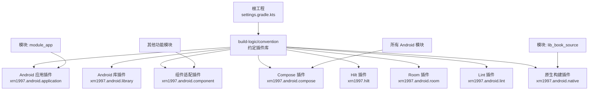
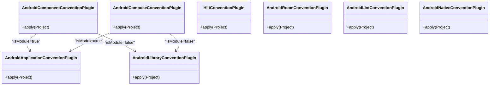
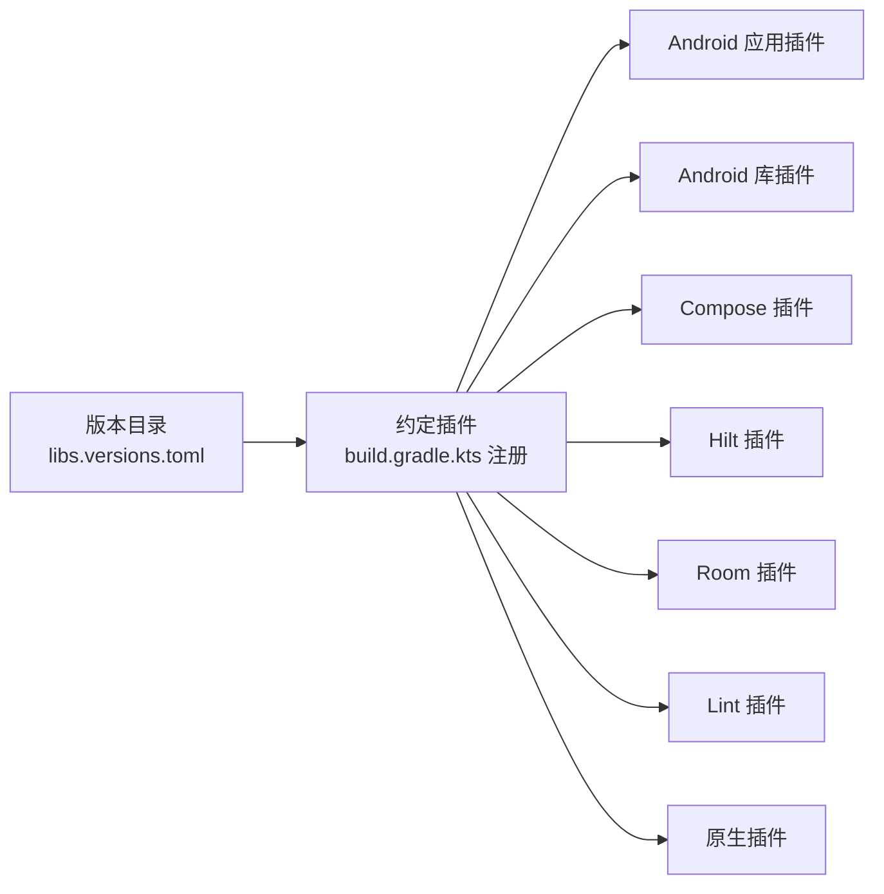
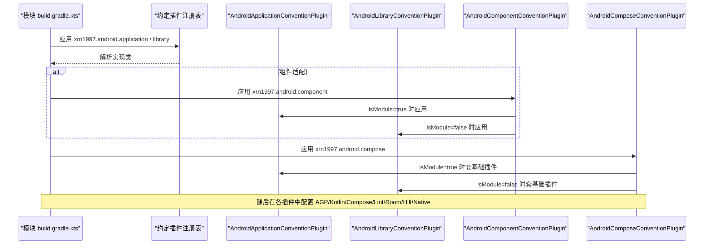

# 插件开发

<cite>
**本文引用的文件**
- [build.gradle.kts](file://build-logic/convention/build.gradle.kts)
- [AndroidApplicationConventionPlugin.kt](file://build-logic/convention/src/main/kotlin/AndroidApplicationConventionPlugin.kt)
- [AndroidLibraryConventionPlugin.kt](file://build-logic/convention/src/main/kotlin/AndroidLibraryConventionPlugin.kt)
- [AndroidComponentConventionPlugin.kt](file://build-logic/convention/src/main/kotlin/AndroidComponentConventionPlugin.kt)
- [AndroidComposeConventionPlugin.kt](file://build-logic/convention/src/main/kotlin/AndroidComposeConventionPlugin.kt)
- [AndroidNativeConventionPlugin.kt](file://build-logic/convention/src/main/kotlin/AndroidNativeConventionPlugin.kt)
- [AndroidLintConventionPlugin.kt](file://build-logic/convention/src/main/kotlin/AndroidLintConventionPlugin.kt)
- [HiltConventionPlugin.kt](file://build-logic/convention/src/main/kotlin/HiltConventionPlugin.kt)
- [AndroidRoomConventionPlugin.kt](file://build-logic/convention/src/main/kotlin/AndroidRoomConventionPlugin.kt)
- [ProjectExtensions.kt](file://build-logic/convention/src/main/kotlin/com/xrn1997/convention/ProjectExtensions.kt)
- [KotlinAndroid.kt](file://build-logic/convention/src/main/kotlin/com/xrn1997/convention/KotlinAndroid.kt)
- [GradleManagedDevices.kt](file://build-logic/convention/src/main/kotlin/com/xrn1997/convention/GradleManagedDevices.kt)
- [PrintTestApks.kt](file://build-logic/convention/src/main/kotlin/com/xrn1997/convention/PrintTestApks.kt)
- [libs.versions.toml](file://gradle/libs.versions.toml)
- [compose_compiler_config.conf](file://compose_compiler_config.conf)
- [settings.gradle.kts](file://settings.gradle.kts)
- [module_app/build.gradle.kts](file://module_app/build.gradle.kts)
- [lib_book_source/build.gradle.kts](file://lib_book_source/build.gradle.kts)
</cite>

## 目录
1. [简介](#简介)
2. [项目结构](#项目结构)
3. [核心组件](#核心组件)
4. [架构总览](#架构总览)
5. [详细组件分析](#详细组件分析)
6. [依赖关系分析](#依赖关系分析)
7. [性能与构建优化](#性能与构建优化)
8. [故障排查](#故障排查)
9. [结论](#结论)
10. [附录](#附录)

## 简介
本指南面向希望为本项目扩展或新建 Gradle 约定插件的开发者，聚焦 Convention Plugin 架构、配置抽象、任务编排，以及 Android 应用/库、Compose、原生（NDK/CMake）等场景的落地实践。文档以仓库内 build-logic 的实现为事实源，结合模块级调用点，给出可操作的步骤、常见陷阱与最佳实践。

## 项目结构
仓库使用独立的 build-logic 子工程集中维护约定插件，并通过版本目录 libs.versions.toml 统一管理工具链与依赖版本。各业务/功能模块通过 apply 约定插件获得一致的构建行为。

图表来源
- [build.gradle.kts:40-78](file://build-logic/convention/build.gradle.kts#L40-L78)
- [AndroidComponentConventionPlugin.kt:10-33](file://build-logic/convention/src/main/kotlin/AndroidComponentConventionPlugin.kt#L10-L33)
- [AndroidComposeConventionPlugin.kt:37-57](file://build-logic/convention/src/main/kotlin/AndroidComposeConventionPlugin.kt#L37-L57)
- [AndroidNativeConventionPlugin.kt:22-43](file://build-logic/convention/src/main/kotlin/AndroidNativeConventionPlugin.kt#L22-L43)

章节来源
- [build.gradle.kts:1-79](file://build-logic/convention/build.gradle.kts#L1-L79)
- [settings.gradle.kts](file://settings.gradle.kts)

## 核心组件
- Android 应用约定插件：统一 AGP application 配置、目标 SDK、应用 ID 策略、受管设备、APK 打印任务等。
- Android 库约定插件：统一 library 配置、测试选项、测试依赖注入、禁用不必要 androidTest 等。
- 组件适配插件：根据 isModule 在 application 与 library 之间切换，并调整 Manifest 与 Kotlin 源码目录。
- Compose 约定插件：自动按 isModule 套入基础插件，启用 org.jetbrains.kotlin.plugin.compose 并统一 Compose 配置入口。
- Hilt 约定插件：按需注入 KSP、Hilt 编译期与运行期依赖，兼容 JVM 与 Android 模块。
- Room 约定插件：启用 androidx.room3 + KSP，生成 Kotlin，输出 schema 目录，注入运行时与 sqlite-bundled。
- Lint 约定插件：在 application/library 或非 Android 环境下统一配置 lint XML 报告与依赖检查。
- 原生构建约定插件：固定 NDK/CMake 版本，限定 release ABI 过滤，指向 CMakeLists.txt。

章节来源
- [AndroidApplicationConventionPlugin.kt:28-48](file://build-logic/convention/src/main/kotlin/AndroidApplicationConventionPlugin.kt#L28-L48)
- [AndroidLibraryConventionPlugin.kt:30-68](file://build-logic/convention/src/main/kotlin/AndroidLibraryConventionPlugin.kt#L30-L68)
- [AndroidComponentConventionPlugin.kt:7-33](file://build-logic/convention/src/main/kotlin/AndroidComponentConventionPlugin.kt#L7-L33)
- [AndroidComposeConventionPlugin.kt:37-57](file://build-logic/convention/src/main/kotlin/AndroidComposeConventionPlugin.kt#L37-L57)
- [HiltConventionPlugin.kt:24-48](file://build-logic/convention/src/main/kotlin/HiltConventionPlugin.kt#L24-L48)
- [AndroidRoomConventionPlugin.kt:26-51](file://build-logic/convention/src/main/kotlin/AndroidRoomConventionPlugin.kt#L26-L51)
- [AndroidLintConventionPlugin.kt:25-47](file://build-logic/convention/src/main/kotlin/AndroidLintConventionPlugin.kt#L25-L47)
- [AndroidNativeConventionPlugin.kt:22-48](file://build-logic/convention/src/main/kotlin/AndroidNativeConventionPlugin.kt#L22-L48)

## 架构总览
约定插件通过 gradlePlugin.plugins.register 暴露统一 ID，模块仅以语义化 ID 应用，避免重复配置。插件内部遵循“先应用基础插件，再扩展配置”的顺序，利用 Extension 与 withPlugin 钩子完成能力装配。

图表来源
- [AndroidComponentConventionPlugin.kt:10-33](file://build-logic/convention/src/main/kotlin/AndroidComponentConventionPlugin.kt#L10-L33)
- [AndroidComposeConventionPlugin.kt:37-57](file://build-logic/convention/src/main/kotlin/AndroidComposeConventionPlugin.kt#L37-L57)

章节来源
- [build.gradle.kts:40-78](file://build-logic/convention/build.gradle.kts#L40-L78)

## 详细组件分析

### Android 应用约定插件
- 职责：应用 com.android.application，统一 targetSdk、applicationId=namespace、动画禁用、受管设备、APK 产物打印任务。
- 关键点：AGP 9 内置 Kotlin，无需单独应用 KGP；lint 由 xrn1997.android.lint 统一提供。

章节来源
- [AndroidApplicationConventionPlugin.kt:28-48](file://build-logic/convention/src/main/kotlin/AndroidApplicationConventionPlugin.kt#L28-L48)

### Android 库约定插件
- 职责：应用 com.android.library，统一 testOptions、instrumentation runner、动画禁用、受管设备、APK 打印任务；在存在 androidTest 时注入 androidTestImplementation，否则避免触发 AGP 警告。
- 关键点：统一注入 tracing 依赖；资源前缀注释保留以便后续开启。

章节来源
- [AndroidLibraryConventionPlugin.kt:30-68](file://build-logic/convention/src/main/kotlin/AndroidLibraryConventionPlugin.kt#L30-L68)

### 组件适配插件（模块化开关）
- 职责：读取 isModule 属性，动态选择 application 或 library 基础插件；调整 manifest 路径；在独立模式下将 src/main/test 加入 kotlin.directories，使 mock/调试宿主参与编译。
- 关键点：必须配合 settings.gradle.kts 中 includeBuild 与 isModule 的使用约定，避免混合态导致冲突。

章节来源
- [AndroidComponentConventionPlugin.kt:7-33](file://build-logic/convention/src/main/kotlin/AndroidComponentConventionPlugin.kt#L7-L33)

### Compose 约定插件
- 职责：根据 isModule 自动套入 application 或 library 基础插件，启用 org.jetbrains.kotlin.plugin.compose，并通过 CommonExtension 统一 Compose 配置。
- 关键点：ID 与外部 android-practice 对齐，实现差异由 isModule 分支承担；module_main 同时应用 component 与 compose 不会冲突（幂等）。

章节来源
- [AndroidComposeConventionPlugin.kt:37-57](file://build-logic/convention/src/main/kotlin/AndroidComposeConventionPlugin.kt#L37-L57)

### Hilt 约定插件
- 职责：应用 KSP，注入 Hilt 编译器与元数据依赖；在 JVM 模块注入 hilt-core；在 Android 模块应用 dagger.hilt.android.plugin 并注入 hilt-android。
- 关键点：通过 pluginManager.withPlugin 条件注入，保证多类型模块复用。

章节来源
- [HiltConventionPlugin.kt:24-48](file://build-logic/convention/src/main/kotlin/HiltConventionPlugin.kt#L24-L48)

### Room 约定插件
- 职责：应用 androidx.room3 与 KSP，设置 room.generateKotlin=true，指定 schemas 目录，注入 runtime、compiler 与 sqlite-bundled。
- 关键点：schema 目录用于自动迁移，需随版本升级提交新 JSON。

章节来源
- [AndroidRoomConventionPlugin.kt:26-51](file://build-logic/convention/src/main/kotlin/AndroidRoomConventionPlugin.kt#L26-L51)

### Lint 约定插件
- 职责：在 application/library 上配置 lint 为 XML 报告并检查依赖；非 Android 模块则直接应用 com.android.lint 并配置。
- 关键点：统一 lint 行为，避免模块遗漏配置。

章节来源
- [AndroidLintConventionPlugin.kt:25-47](file://build-logic/convention/src/main/kotlin/AndroidLintConventionPlugin.kt#L25-L47)

### 原生构建约定插件
- 职责：强制要求 Android 插件已应用，否则立即失败；固定 NDK/CMake 版本；release 只包含 arm64-v8a；CMakeLists 路径相对模块 src/main/cpp。
- 关键点：ABI 策略作为安全与产品约束，debug 放宽 ABI 应放在模块自身 build.gradle.kts，便于审计变更。

章节来源
- [AndroidNativeConventionPlugin.kt:22-48](file://build-logic/convention/src/main/kotlin/AndroidNativeConventionPlugin.kt#L22-L48)

### Kotlin 与受管设备（通用能力）
- KotlinAndroid：封装 Kotlin 编译选项与 Android 扩展配置，供多个插件复用。
- GradleManagedDevices：为 Android 变体注册受管设备，提升测试可复现性。
- PrintTestApks：在构建完成后打印测试 APK 路径，便于定位产物。

章节来源
- [KotlinAndroid.kt](file://build-logic/convention/src/main/kotlin/com/xrn1997/convention/KotlinAndroid.kt)
- [GradleManagedDevices.kt](file://build-logic/convention/src/main/kotlin/com/xrn1997/convention/GradleManagedDevices.kt)
- [PrintTestApks.kt](file://build-logic/convention/src/main/kotlin/com/xrn1997/convention/PrintTestApks.kt)
- [ProjectExtensions.kt](file://build-logic/convention/src/main/kotlin/com/xrn1997/convention/ProjectExtensions.kt)

## 依赖关系分析
- 版本目录集中管理：androidNdk、cmake、hilt、room、ksp、compose 等均在 gradle/libs.versions.toml 定义，插件通过 VersionCatalogs 读取，避免硬编码。
- 插件注册表：build-logic/convention/build.gradle.kts 中的 gradlePlugin.plugins.register 将约定插件映射到统一 ID，供模块以稳定 ID 引用。

图表来源
- [build.gradle.kts:40-78](file://build-logic/convention/build.gradle.kts#L40-L78)
- [AndroidNativeConventionPlugin.kt:24-41](file://build-logic/convention/src/main/kotlin/AndroidNativeConventionPlugin.kt#L24-L41)
- [HiltConventionPlugin.kt:24-48](file://build-logic/convention/src/main/kotlin/HiltConventionPlugin.kt#L24-L48)
- [AndroidRoomConventionPlugin.kt:26-51](file://build-logic/convention/src/main/kotlin/AndroidRoomConventionPlugin.kt#L26-L51)

章节来源
- [libs.versions.toml](file://gradle/libs.versions.toml)
- [build.gradle.kts:40-78](file://build-logic/convention/build.gradle.kts#L40-L78)

## 性能与构建优化
- 受管设备与动画禁用：减少 UI 相关开销，加速测试执行。
- 条件注入依赖：仅在存在 androidTest 时才注入 androidTestImplementation，避免无意义依赖与告警。
- ABI 最小化：release 仅包含 arm64-v8a，减小产物体积与攻击面；模拟器所需 ABI 在模块 debug 显式放宽，确保可见性。
- 统一 lint 报告：XML 输出便于 CI 集成与问题追踪。

章节来源
- [AndroidLibraryConventionPlugin.kt:55-66](file://build-logic/convention/src/main/kotlin/AndroidLibraryConventionPlugin.kt#L55-L66)
- [AndroidNativeConventionPlugin.kt:34-41](file://build-logic/convention/src/main/kotlin/AndroidNativeConventionPlugin.kt#L34-L41)
- [AndroidLintConventionPlugin.kt:44-47](file://build-logic/convention/src/main/kotlin/AndroidLintConventionPlugin.kt#L44-L47)

## 故障排查
- 原生插件必须在 Android 插件之后应用：若找不到 CommonExtension，会在配置阶段抛错，优先检查插件应用顺序。
- isModule 模式下的源码目录：独立模式下需将 src/main/test 加入 kotlin.directories，否则 mock 宿主不参与编译。
- Compose 插件 ID 与实现差异：与 android-practice 共用 ID，但实现因 isModule 不同，注意不要误以为两者完全一致。
- Room schema 同步：新增实体需更新 schema JSON，避免迁移失败。
- Hilt 在多类型模块：JVM 与 Android 分支分别注入对应依赖，漏加会导致编译期注解处理失败。

章节来源
- [AndroidNativeConventionPlugin.kt:24-33](file://build-logic/convention/src/main/kotlin/AndroidNativeConventionPlugin.kt#L24-L33)
- [AndroidComponentConventionPlugin.kt:19-30](file://build-logic/convention/src/main/kotlin/AndroidComponentConventionPlugin.kt#L19-L30)
- [AndroidComposeConventionPlugin.kt:37-57](file://build-logic/convention/src/main/kotlin/AndroidComposeConventionPlugin.kt#L37-L57)
- [AndroidRoomConventionPlugin.kt:38-43](file://build-logic/convention/src/main/kotlin/AndroidRoomConventionPlugin.kt#L38-L43)
- [HiltConventionPlugin.kt:33-46](file://build-logic/convention/src/main/kotlin/HiltConventionPlugin.kt#L33-L46)

## 结论
本项目的约定插件体系以“统一 ID、统一实现、按场景扩展”为核心原则，将 Android 应用/库、Compose、Hilt、Room、Lint、原生构建等横切关注点收敛至 build-logic，模块侧只需应用少量语义化插件即可复用完整构建能力。通过版本目录管理工具链、严格 ABI 策略与条件依赖注入，兼顾了可维护性与构建性能。

## 附录

### 常用流程与时序

#### 应用插件加载时序

图表来源
- [AndroidComponentConventionPlugin.kt:10-33](file://build-logic/convention/src/main/kotlin/AndroidComponentConventionPlugin.kt#L10-L33)
- [AndroidComposeConventionPlugin.kt:37-57](file://build-logic/convention/src/main/kotlin/AndroidComposeConventionPlugin.kt#L37-L57)

#### Compose 编译器配置要点
- 配置文件位置：compose_compiler_config.conf
- 建议：通过 Compose 约定插件的统一入口进行配置，保持与模块无关的通用策略；如需指标收集与报告，可在模块层按需叠加 Compose 配置项。

章节来源
- [compose_compiler_config.conf](file://compose_compiler_config.conf)
- [AndroidComposeConventionPlugin.kt:52-56](file://build-logic/convention/src/main/kotlin/AndroidComposeConventionPlugin.kt#L52-L56)

#### 原生构建（NDK/CMake）配置要点
- 固定 NDK/CMake 版本：由版本目录提供，确保跨机器一致性。
- ABI 筛选：release 仅 arm64-v8a；debug 可于模块 build.gradle.kts 增加 x86_64 以满足模拟器需求。
- CMake 入口：src/main/cpp/CMakeLists.txt。

章节来源
- [AndroidNativeConventionPlugin.kt:34-41](file://build-logic/convention/src/main/kotlin/AndroidNativeConventionPlugin.kt#L34-L41)
- [lib_book_source/build.gradle.kts](file://lib_book_source/build.gradle.kts)

#### 模块如何应用插件（示例路径）
- 应用应用插件：参考 module_app 的 build.gradle.kts 中对 xrn1997.android.application 的应用方式。
- 应用原生插件：参考 lib_book_source 的 build.gradle.kts 中对 xrn1997.android.native 的应用方式。

章节来源
- [module_app/build.gradle.kts](file://module_app/build.gradle.kts)
- [lib_book_source/build.gradle.kts](file://lib_book_source/build.gradle.kts)