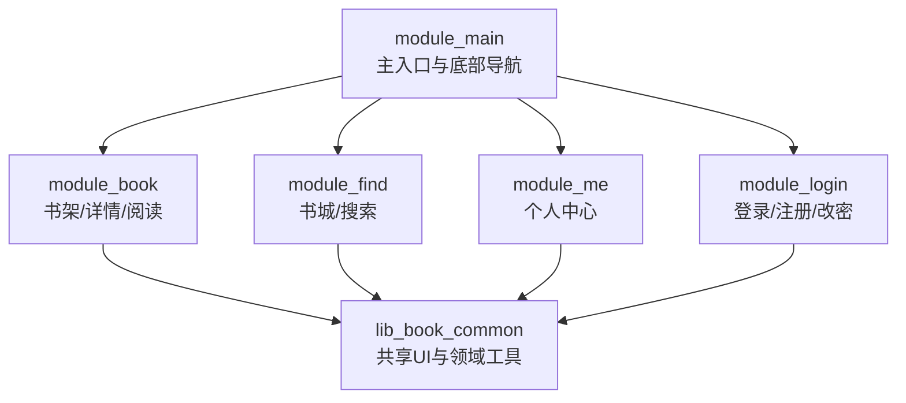
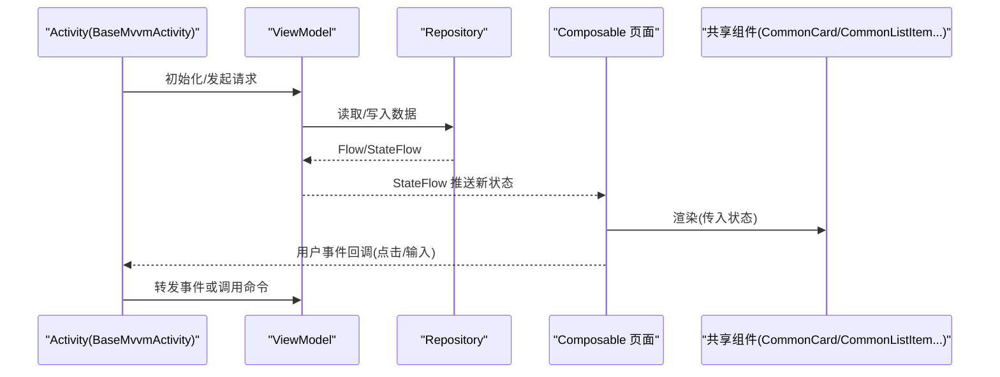
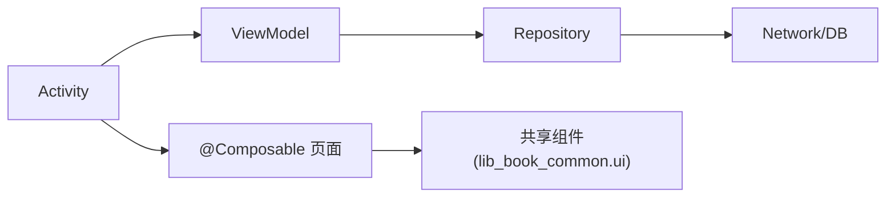

# Compose组件扩展

<cite>
**本文引用的文件**
- [MainActivity.kt](file://module_main/src/main/java/com/ebook/main/MainActivity.kt)
- [BookDetailActivity.kt](file://module_book/src/main/java/com/ebook/book/BookDetailActivity.kt)
- [CommonUiComponents.kt](file://lib_book_common/src/main/java/com/ebook/common/ui/CommonUiComponents.kt)
- [BookShelfPage.kt](file://module_book/src/main/java/com/ebook/book/page/BookShelfPage.kt)
- [BookstorePage.kt](file://module_find/src/main/java/com/ebook/find/page/BookstorePage.kt)
- [MePage.kt](file://module_me/src/main/java/com/ebook/me/page/MePage.kt)
- [SearchActivity.kt](file://module_find/src/main/java/com/ebook/find/SearchActivity.kt)
- [LoginActivity.kt](file://module_login/src/main/java/com/ebook/login/LoginActivity.kt)
- [RegisterActivity.kt](file://module_login/src/main/java/com/ebook/login/RegisterActivity.kt)
- [ModifyPwdActivity.kt](file://module_login/src/main/java/com/ebook/login/ModifyPwdActivity.kt)
- [BookDetailViewModel.kt](file://module_book/src/main/java/com/ebook/book/mvvm/viewmodel/BookDetailViewModel.kt)
- [LibraryViewModel.kt](file://module_find/src/main/java/com/ebook/find/mvvm/viewmodel/LibraryViewModel.kt)
- [MePageViewModel.kt](file://module_me/src/main/java/com/ebook/me/mvvm/viewmodel/MePageViewModel.kt)
- [0031-theme-mode-three-state-companion-singleton.md](file://docs/adr/0031-theme-mode-three-state-companion-singleton.md)
- [0006-shared-ui-components-in-lib-book-common.md](file://docs/adr/0006-shared-ui-components-in-lib-book-common.md)
- [AndroidComposeConventionPlugin.kt](file://build-logic/convention/src/main/kotlin/AndroidComposeConventionPlugin.kt)
- [AGENTS.md](file://AGENTS.md)
</cite>

## 目录
1. [简介](#简介)
2. [项目结构](#项目结构)
3. [核心组件](#核心组件)
4. [架构总览](#架构总览)
5. [详细组件分析](#详细组件分析)
6. [依赖关系分析](#依赖关系分析)
7. [性能考虑](#性能考虑)
8. [故障排查指南](#故障排查指南)
9. [结论](#结论)
10. [附录](#附录)

## 简介
本指南面向在现有架构中添加新的 Compose UI 组件与功能页面的开发者。内容覆盖：
- BaseActivity/BaseMvvmActivity 的使用方式（状态栏、主题继承、覆盖层管理）
- Composable 页面开发模式（状态管理、事件处理、数据流绑定）
- 共享 UI 组件的使用与扩展（CommonCard、CommonListItem 等）
- 响应式状态管理（StateFlow、状态提升、副作用处理）
- 常见页面扩展示例（列表页、详情页、表单页）
- 性能优化技巧（LazyColumn、图片加载、内存管理）

## 项目结构
仓库采用多模块架构，业务界面集中在各功能模块的 Activity/Composable 页面中；共享 UI 组件沉淀在 lib_book_common 的 com.ebook.common.ui；构建侧通过 build-logic 的约定插件统一配置 Compose。

图示来源
- [MainActivity.kt:139-197](file://module_main/src/main/java/com/ebook/main/MainActivity.kt#L139-L197)
- [CommonUiComponents.kt:33-77](file://lib_book_common/src/main/java/com/ebook/common/ui/CommonUiComponents.kt#L33-L77)

章节来源
- [MainActivity.kt:45-115](file://module_main/src/main/java/com/ebook/main/MainActivity.kt#L45-L115)
- [AndroidComposeConventionPlugin.kt](file://build-logic/convention/src/main/kotlin/AndroidComposeConventionPlugin.kt)

## 核心组件
- 基类与宿主
  - 业务页面统一继承 lib_common 提供的 Compose 基类，由基类提供主题装配、状态栏 insets 处理、Loading/空态/错误覆盖层以及一次性命令通道（Toast/Finish/Navigate）。
  - 持有 ViewModel 的页面应继承 BaseMvvmActivity（而非裸 BaseActivity），以确保命令通道与覆盖层正确消费。

- 共享 UI 组件
  - 统一沉淀于 lib_book_common 的 com.ebook.common.ui，包含 CommonCard、CommonItemCard、CommonListItem、SectionLabel、InfoChip、BookCover、Avatar 等，配合 CommonUiTokens 的设计常量，保证全 App 视觉一致。

- 页面组织
  - 主 Tab 容器使用 Navigation + NavHost，Tab 页以 Provider 暴露的 @Composable() -> Unit 形式直接组合，避免 Fragment 嵌套。
  - 详情页、列表页、表单页遵循“Activity 负责路由与注入，Composable 仅负责渲染与事件回调”的模式。

章节来源
- [AGENTS.md:141-178](file://AGENTS.md#L141-L178)
- [CommonUiComponents.kt:33-98](file://lib_book_common/src/main/java/com/ebook/common/ui/CommonUiComponents.kt#L33-L98)
- [MainActivity.kt:139-197](file://module_main/src/main/java/com/ebook/main/MainActivity.kt#L139-L197)

## 架构总览
下图展示了从 Activity 到 ViewModel、再到 Composable 的状态驱动流程，以及共享 UI 组件在页面中的复用。

图示来源
- [BookDetailActivity.kt:53-121](file://module_book/src/main/java/com/ebook/book/BookDetailActivity.kt#L53-L121)
- [BookDetailViewModel.kt:25-73](file://module_book/src/main/java/com/ebook/book/mvvm/viewmodel/BookDetailViewModel.kt#L25-L73)
- [CommonUiComponents.kt:85-98](file://lib_book_common/src/main/java/com/ebook/common/ui/CommonUiComponents.kt#L85-L98)

## 详细组件分析

### BaseActivity / BaseMvvmActivity 使用要点
- 主题与系统栏
  - 基类负责应用主题装配与状态栏 insets 处理；子类可通过 enableToolbar()/enableFitsSystemWindows() 控制是否显示 Toolbar 以及是否启用系统栏偏移。
  - 当不需要 Toolbar 时，需自行在各页面处理 insets（如 TopAppBar 自带避让、NavigationBar 自带手势条避让）。

- 覆盖层与命令通道
  - BaseMvvmActivity 内置 MvvmBinder，消费来自 ViewModel 的一次性命令（提示、结束、跳转）。持有 ViewModel 的页面必须继承 BaseMvvmActivity，否则命令无法被消费。

- 示例参考
  - 主页 MainActivity 关闭了基类默认 insets 消费，将顶部/底部避让下沉至各 Tab 页面，保持沉浸式效果。
  - BookDetailActivity 继承 BaseMvvmActivity，通过 PageContent 组合详情 Composable，并在 initData 中设置标题与初始数据。

章节来源
- [MainActivity.kt:68-97](file://module_main/src/main/java/com/ebook/main/MainActivity.kt#L68-L97)
- [BookDetailActivity.kt:53-91](file://module_book/src/main/java/com/ebook/book/BookDetailActivity.kt#L53-L91)
- [AGENTS.md:141-178](file://AGENTS.md#L141-L178)

### Composable 页面开发模式
- 状态管理
  - 页面内部局部状态使用 mutableStateOf；跨作用域/跨重组共享状态使用 StateFlow（由 ViewModel 暴露），页面侧 collectAsState 订阅并触发重组。
  - 列表数据使用 LazyColumn + items/itemsIndexed，确保 key 稳定且具语义。

- 事件处理与数据流绑定
  - Activity 接收用户交互，调用 ViewModel 方法；ViewModel 更新 StateFlow；页面收集状态变化后刷新 UI。
  - 对于一次性操作（Toast/Finish/Navigate），通过 BaseMvvmActivity 的命令通道统一处理。

- 示例参考
  - BookShelfPage：使用 hiltViewModel 注入 ViewModel，collectAsState 收集列表与解析进度，通过 RefreshableList 与 MvvmBinder 绑定刷新信号。
  - BookDetailScreen：收集 detailState，根据 loading/loadError/inBookShelf 等状态渲染不同分支。

章节来源
- [BookShelfPage.kt:76-100](file://module_book/src/main/java/com/ebook/book/page/BookShelfPage.kt#L76-L100)
- [BookDetailActivity.kt:93-121](file://module_book/src/main/java/com/ebook/book/BookDetailActivity.kt#L93-L121)
- [BookDetailViewModel.kt:52-73](file://module_book/src/main/java/com/ebook/book/mvvm/viewmodel/BookDetailViewModel.kt#L52-L73)

### 共享 UI 组件的使用与扩展
- 设计语言
  - 所有尺寸、圆角、间距统一引用 CommonUiTokens，禁止硬编码魔法值。
  - 卡片层级：分组容器使用 CommonCard（较大圆角+surfaceContainer），条目卡使用 CommonItemCard（较小圆角），形成两级层次。

- 常用组件
  - CommonCard：通用分组卡片容器，承载 SectionLabel、列表区块等。
  - CommonListItem/CommonItemCard：列表项容器，便于统一样式与交互。
  - InfoChip/SectionLabel/BookCover/Avatar：信息标签、分组标题、封面、头像等。

- 扩展建议
  - 新增跨模块复用的 UI 元素优先放入 lib_book_common 的 com.ebook.common.ui；若仅为单模块使用，则放在对应模块的 view 包下。
  - 图标仅使用 material-icons-core 核心集，扩展图标由业务模块自行引入 iconsExtended。

章节来源
- [CommonUiComponents.kt:33-98](file://lib_book_common/src/main/java/com/ebook/common/ui/CommonUiComponents.kt#L33-L98)
- [0006-shared-ui-components-in-lib-book-common.md](file://docs/adr/0006-shared-ui-components-in-lib-book-common.md)

### 响应式状态管理（StateFlow、状态提升、副作用）
- StateFlow 作为单向数据源
  - ViewModel 维护可观察状态（如 detailState、list、parsingBooks），页面通过 collectAsState 订阅并重组。
  - 避免在页面内重复拉取数据，统一在 ViewModel 中发起网络/数据库操作。

- 状态提升
  - 将需要跨组件共享的状态提升到父级或 ViewModel，子组件仅接收只读状态与回调函数。
  - 例如详情页的 inBookShelf、loading、loadError 全部收敛到 detailState。

- 副作用处理
  - LaunchedEffect 用于生命周期相关的副作用（如首次加载、参数变更时重新获取数据）。
  - 对一次性事件（如书架事件导致关闭详情页）通过 sendFinish 等命令统一处理。

章节来源
- [BookDetailViewModel.kt:25-100](file://module_book/src/main/java/com/ebook/book/mvvm/viewmodel/BookDetailViewModel.kt#L25-L100)
- [BookShelfPage.kt:76-100](file://module_book/src/main/java/com/ebook/book/page/BookShelfPage.kt#L76-L100)

### 页面扩展示例

#### 列表页（书架/书城）
- 使用 LazyColumn 展示列表，items 指定稳定 key（如 noteUrl、id）。
- 下拉刷新通过 RefreshableList 与 MvvmBinder 绑定，完成后 finishRefresh。
- 顶部 Action 通过 TopAppBar 添加，注意 insets 与主题色一致性。

章节来源
- [BookShelfPage.kt:76-100](file://module_book/src/main/java/com/ebook/book/page/BookShelfPage.kt#L76-L100)
- [BookstorePage.kt](file://module_find/src/main/java/com/ebook/find/page/BookstorePage.kt)

#### 详情页（书籍详情）
- 使用 BaseMvvmActivity + hiltViewModel 注入 ViewModel。
- 通过 detailState 驱动渲染：封面/简介/章节信息/操作按钮。
- 按钮点击回调在 Activity 层处理路由与跳转（如进入阅读器）。

章节来源
- [BookDetailActivity.kt:53-121](file://module_book/src/main/java/com/ebook/book/BookDetailActivity.kt#L53-L121)
- [BookDetailViewModel.kt:52-73](file://module_book/src/main/java/com/ebook/book/mvvm/viewmodel/BookDetailViewModel.kt#L52-L73)

#### 表单页（登录/注册/修改密码）
- 表单状态使用 mutableStateOf 管理输入字段，提交时调用 ViewModel 执行业务逻辑。
- 错误提示通过 BaseMvvmActivity 的命令通道（sendToast）统一弹出。
- 成功后可调用 sendFinish 返回或跳转到下一个页面。

章节来源
- [LoginActivity.kt](file://module_login/src/main/java/com/ebook/login/LoginActivity.kt)
- [RegisterActivity.kt](file://module_login/src/main/java/com/ebook/login/RegisterActivity.kt)
- [ModifyPwdActivity.kt](file://module_login/src/main/java/com/ebook/login/ModifyPwdActivity.kt)

## 依赖关系分析
- 模块依赖方向：业务模块 → lib_book_common → 领域库（lib_ebook_api/lib_ebook_db）
- 页面与 ViewModel：Activity 持有 ViewModel 引用，ViewModel 依赖 Repository 与领域服务
- 共享组件：所有页面通过 lib_book_common 的 com.ebook.common.ui 复用 UI 组件

图示来源
- [AGENTS.md:69-100](file://AGENTS.md#L69-L100)
- [CommonUiComponents.kt:33-77](file://lib_book_common/src/main/java/com/ebook/common/ui/CommonUiComponents.kt#L33-L77)

章节来源
- [AGENTS.md:69-100](file://AGENTS.md#L69-L100)

## 性能考虑
- LazyColumn 使用
  - 为 items 设置稳定且唯一的 key（建议使用实体主键或业务唯一标识），避免重排与锚点失效。
  - 避免在 item 内执行昂贵计算，必要时使用 remember 缓存。

- 图片加载优化
  - 使用 Coil（Compose）加载图片，结合合适的占位图与错误图。
  - 对大图进行缩放与缓存策略配置，减少内存占用。

- 内存管理
  - 避免在 Composable 内创建大对象，使用 remember 缓存计算结果。
  - 及时取消协程（viewModelScope 自动管理），避免泄漏。

- 主题与渲染
  - 遵循 Material Theme 语义色，避免硬编码颜色导致重绘开销。
  - 主题切换通过 StateFlow 驱动，减少不必要的重组。

[本节为通用指导，不直接分析具体文件]

## 故障排查指南
- 页面不弹提示、该关的页不关
  - 原因：未继承 BaseMvvmActivity，导致命令通道未被消费。
  - 解决：继承 BaseMvvmActivity 并确保 ViewModel 通过 hiltViewModel 注入。

- 列表数据不刷新
  - 原因：未在 ViewModel 中更新 StateFlow，或页面未 collectAsState。
  - 解决：检查 ViewModel 状态更新逻辑与页面收集逻辑。

- 主题不一致
  - 原因：页面内重复包裹 MaterialTheme 或绕过基类主题装配。
  - 解决：移除页面内的 MaterialTheme 包裹，使用基类提供的主题。

- 会话过期未跳转
  - 原因：未订阅 SessionEventBus 或未调用 clearSession。
  - 解决：在主 Activity 中订阅会话过期事件并处理跳转。

章节来源
- [AGENTS.md:141-178](file://AGENTS.md#L141-L178)
- [MainActivity.kt:68-79](file://module_main/src/main/java/com/ebook/main/MainActivity.kt#L68-L79)

## 结论
通过在现有架构中遵循 BaseMvvmActivity/ViewModel/StateFlow 的统一模式，并使用 lib_book_common 的共享 UI 组件，可以快速、一致地扩展新的 Compose 页面与组件。建议在新页面开发时：
- 继承 BaseMvvmActivity，使用 hiltViewModel 注入 ViewModel
- 使用 StateFlow 管理状态，页面侧 collectAsState 订阅
- 复用共享 UI 组件，遵循 CommonUiTokens 设计语言
- 遵循性能最佳实践，合理使用 LazyColumn、图片加载与内存管理

## 附录
- 主题三态机制：通过 ThemeModeManager 实现浅色/深色/跟随系统的持久化与实时切换。
- 共享 UI 组件规范：统一沉淀于 lib_book_common，避免重复实现与视觉漂移。

章节来源
- [0031-theme-mode-three-state-companion-singleton.md](file://docs/adr/0031-theme-mode-three-state-companion-singleton.md)
- [0006-shared-ui-components-in-lib-book-common.md](file://docs/adr/0006-shared-ui-components-in-lib-book-common.md)