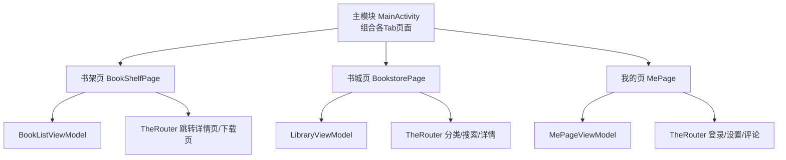
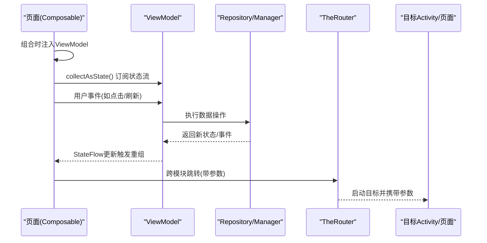
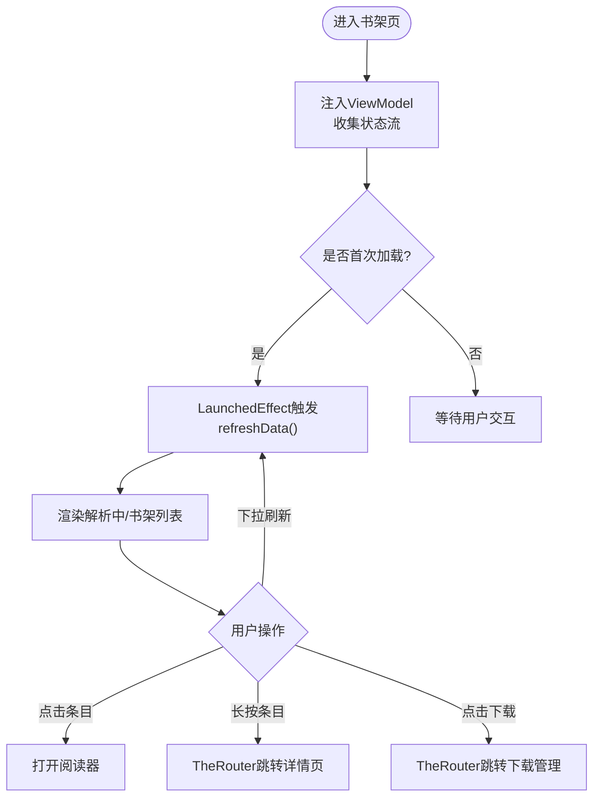
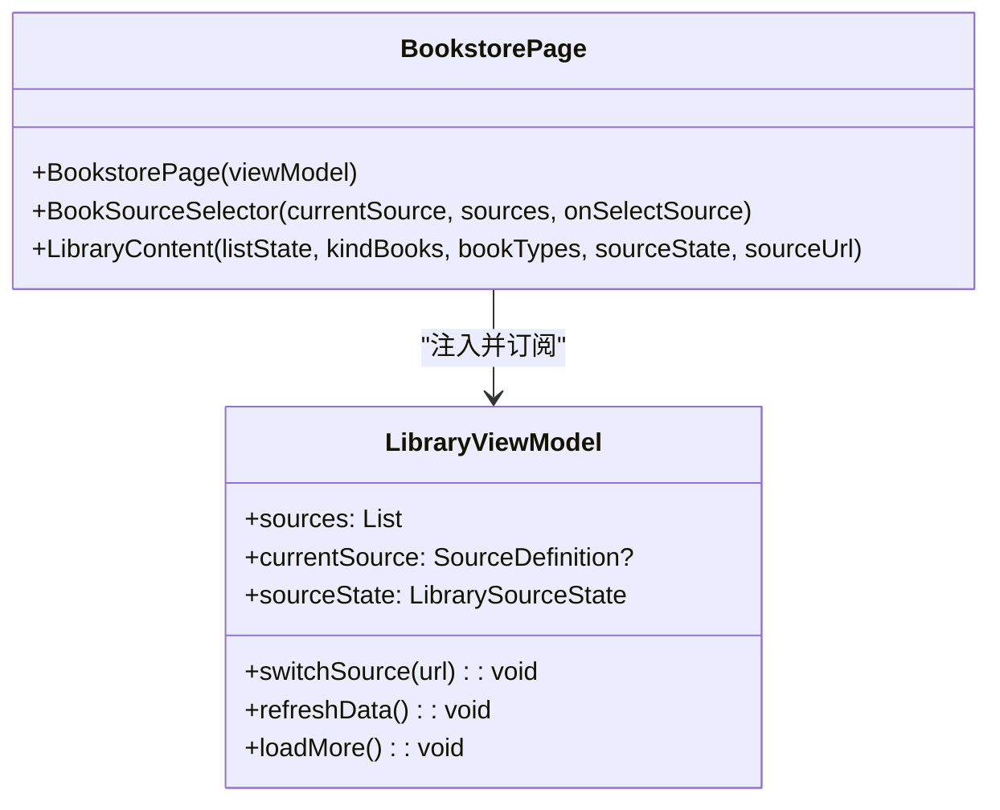
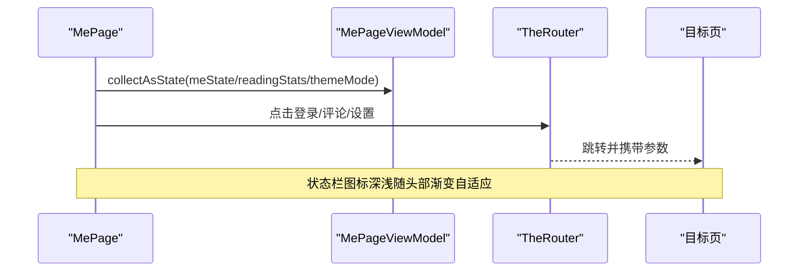
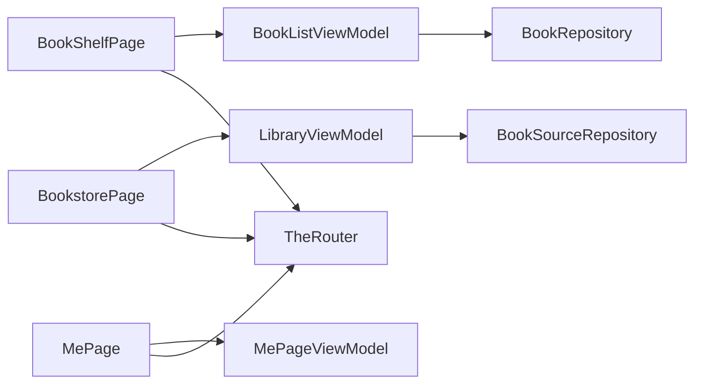

# Compose页面开发模式

<cite>
**本文引用的文件**
- [BookShelfPage.kt](file://module_book/src/main/java/com/ebook/book/page/BookShelfPage.kt)
- [BookstorePage.kt](file://module_find/src/main/java/com/ebook/find/page/BookstorePage.kt)
- [MePage.kt](file://module_me/src/main/java/com/ebook/me/page/MePage.kt)
- [BookListViewModel.kt](file://module_book/src/main/java/com/ebook/book/mvvm/viewmodel/BookListViewModel.kt)
- [LibraryViewModel.kt](file://module_find/src/main/java/com/ebook/find/mvvm/viewmodel/LibraryViewModel.kt)
- [MainActivity.kt](file://module_main/src/main/java/com/ebook/main/MainActivity.kt)
- [AGENTS.md](file://AGENTS.md)
</cite>

## 目录
1. [简介](#简介)
2. [项目结构](#项目结构)
3. [核心组件](#核心组件)
4. [架构总览](#架构总览)
5. [详细组件分析](#详细组件分析)
6. [依赖关系分析](#依赖关系分析)
7. [性能注意事项](#性能注意事项)
8. [故障排查指南](#故障排查指南)
9. [结论](#结论)
10. [附录](#附录)

## 简介
本指南基于仓库实际代码，总结Compose页面在该项目中的标准开发模式，覆盖：
- BaseMvvmActivity与BaseActivity的使用方式（状态栏、主题、覆盖层）
- Composable页面的标准结构（ViewModel注入、状态收集、事件处理）
- 生命周期管理（LaunchedEffect、副作用、资源释放）
- 响应式数据绑定（StateFlow.collectAsState、状态提升、父子通信）
- 典型页面实现（书架页、书城页、我的页）
- 页面导航（TheRouter路由、参数传递、路由配置）
- 性能优化（LazyColumn使用、图片加载、内存管理）

## 项目结构
本项目采用多模块架构，功能模块通过Provider接口暴露Compose页面，由主模块的NavHost组合。页面遵循MVVM：页面（Composable）→ ViewModel → Repository/Manager。跨模块跳转统一通过TheRouter。

图表来源
- [MainActivity.kt:59-...](file://module_main/src/main/java/com/ebook/main/MainActivity.kt#L59-L...)
- [BookShelfPage.kt:66-177](file://module_book/src/main/java/com/ebook/book/page/BookShelfPage.kt#L66-L177)
- [BookstorePage.kt:73-139](file://module_find/src/main/java/com/ebook/find/page/BookstorePage.kt#L73-L139)
- [MePage.kt:61-94](file://module_me/src/main/java/com/ebook/me/page/MePage.kt#L61-L94)

章节来源
- [AGENTS.md](file://AGENTS.md)

## 核心组件
- 基类与主题
  - 业务页面统一继承lib_common提供的BaseActivity/BaseMvvmActivity；主题、状态栏insets、覆盖层等由基类集中装配，避免页面重复包裹MaterialTheme导致配色分裂。
- ViewModel与刷新
  - 列表型页面继承BaseRefreshViewModel，提供refreshData/loadMore/停止刷新等能力；通过StateFlow暴露UI状态。
- 刷新容器与命令通道
  - 页面使用RefreshableList承载下拉刷新/上拉加载；通过MvvmBinder将IBaseRefreshView与ViewModel的刷新信号绑定。
- 导航
  - 跨模块跳转使用TheRouter.build(...).withXxx(...).navigation(context)。

章节来源
- [AGENTS.md](file://AGENTS.md)
- [BookShelfPage.kt:89-104](file://module_book/src/main/java/com/ebook/book/page/BookShelfPage.kt#L89-L104)
- [BookstorePage.kt:93-102](file://module_find/src/main/java/com/ebook/find/page/BookstorePage.kt#L93-L102)

## 架构总览
页面侧以“可组合函数”为入口，通过Hilt注入ViewModel；ViewModel聚合Repository/Manager，暴露StateFlow供页面collectAsState订阅；用户操作在页面触发后调用ViewModel方法，再由ViewModel驱动数据更新。跨模块跳转通过TheRouter完成。

图表来源
- [BookShelfPage.kt:78-177](file://module_book/src/main/java/com/ebook/book/page/BookShelfPage.kt#L78-L177)
- [BookstorePage.kt:84-139](file://module_find/src/main/java/com/ebook/find/page/BookstorePage.kt#L84-L139)
- [MePage.kt:77-94](file://module_me/src/main/java/com/ebook/me/page/MePage.kt#L77-L94)

## 详细组件分析

### 基类与主题、状态栏、覆盖层
- 页面应继承BaseMvvmActivity（需要ViewModel和命令通道）或BaseActivity（纯展示），由基类负责：
  - 主题装配（全局AppTheme），页面内不再重复包裹MaterialTheme
  - 状态栏insets自动处理（enableFitsSystemWindows开关）
  - 加载/空态/网络错误覆盖层（通过MvvmBinder消费命令）
- 独立宿主或特殊场景需自行对齐基类行为（主题、insets、覆盖层）。

章节来源
- [AGENTS.md](file://AGENTS.md)

### 书架页（BookShelfPage）
- 页面职责
  - 顶栏：标题+导入本地书按钮+下载管理入口（带角标）
  - 列表：解析中占位行 + 书架条目（点击阅读、长按详情）
  - 刷新：下拉刷新走RefreshableList；首次进入用LaunchedEffect触发一次刷新
- 状态与事件
  - 使用hiltViewModel注入BookListViewModel与DownloadManageViewModel
  - 通过collectAsState订阅books/parsingBooks/remainingCount
  - 通过MvvmBinder.bindRefresh绑定刷新回调
- 导航
  - 阅读器：直接Intent启动（同模块）
  - 详情页：TheRouter.build(KeyCode.Book.DETAIL_PATH).withInt/.withString(...)
- 状态栏处理
  - Scaffold的contentWindowInsets设为0dp，避免与TopAppBar自带的insets叠加造成双重偏移

图表来源
- [BookShelfPage.kt:78-177](file://module_book/src/main/java/com/ebook/book/page/BookShelfPage.kt#L78-L177)

章节来源
- [BookShelfPage.kt:66-177](file://module_book/src/main/java/com/ebook/book/page/BookShelfPage.kt#L66-L177)
- [BookListViewModel.kt:16-68](file://module_book/src/main/java/com/ebook/book/mvvm/viewmodel/BookListViewModel.kt#L16-L68)

### 书城页（BookstorePage）
- 页面职责
  - 顶部：标题+书源切换胶囊（当前源名+下拉选择）
  - 内容：书籍类型胶囊+搜索入口+分类区块列表
  - 刷新：RefreshableList承载下拉刷新；不主动发起首屏刷新，由currentSource驱动
- 状态与事件
  - 注入LibraryViewModel，收集list/bookTypeList/sources/currentSource/sourceState
  - 书源切换：onSelectSource -> viewModel.switchSource（持久化默认源）
  - 引导态：根据sourceState显示不同文案与动作（无源/坏源/未知/就绪）
- 导航
  - 分类选择：TheRouter.build(KeyCode.Find.CHOICE_PATH).withString("url"/"title"/"source_url")
  - 搜索：TheRouter.build(KeyCode.Find.SEARCH_PATH)
  - 详情：TheRouter.build(KeyCode.Book.DETAIL_PATH)

图表来源
- [LibraryViewModel.kt:27-100](file://module_find/src/main/java/com/ebook/find/mvvm/viewmodel/LibraryViewModel.kt#L27-L100)
- [BookstorePage.kt:84-139](file://module_find/src/main/java/com/ebook/find/page/BookstorePage.kt#L84-L139)

章节来源
- [BookstorePage.kt:73-139](file://module_find/src/main/java/com/ebook/find/page/BookstorePage.kt#L73-L139)
- [LibraryViewModel.kt:27-100](file://module_find/src/main/java/com/ebook/find/mvvm/viewmodel/LibraryViewModel.kt#L27-L100)

### 我的页（MePage）
- 页面职责
  - 渐变沉浸式头部（头像、昵称/账号、右侧编辑/登录按钮）
  - 阅读概览卡片（藏书数、最近在读）
  - 功能菜单卡片（评论、设置）
- 状态与事件
  - 注入MePageViewModel，收集meState/readingStats/themeMode
  - 主题模式经VM读取，避免页面直接读单例
  - 渐变头部动态调整状态栏图标深浅（AdaptStatusBarIcons）
- 导航
  - 登录/评论/设置均通过TheRouter.build(KeyCode.*).navigation(context)

图表来源
- [MePage.kt:77-94](file://module_me/src/main/java/com/ebook/me/page/MePage.kt#L77-L94)
- [MePage.kt:160-301](file://module_me/src/main/java/com/ebook/me/page/MePage.kt#L160-L301)

章节来源
- [MePage.kt:61-94](file://module_me/src/main/java/com/ebook/me/page/MePage.kt#L61-L94)
- [MePage.kt:160-301](file://module_me/src/main/java/com/ebook/me/page/MePage.kt#L160-L301)

### 响应式数据绑定模式
- 状态收集
  - 页面通过collectAsState订阅ViewModel暴露的StateFlow，确保UI与数据同步
- 状态提升
  - 可组合函数通过回调（onClick/onSelectSource）将用户事件向上传递到父级或ViewModel
- 父子通信
  - 列表项通过传入onItemClick/onItemLongClick回调，避免在子组件内直接访问外部上下文

章节来源
- [BookShelfPage.kt:78-177](file://module_book/src/main/java/com/ebook/book/page/BookShelfPage.kt#L78-L177)
- [BookstorePage.kt:84-139](file://module_find/src/main/java/com/ebook/find/page/BookstorePage.kt#L84-L139)
- [MePage.kt:77-94](file://module_me/src/main/java/com/ebook/me/page/MePage.kt#L77-L94)

### 生命周期管理与副作用
- LaunchedEffect
  - 书架页首次进入触发一次刷新（LaunchedEffect(Unit)），避免重复请求
- 副作用处理
  - 书城页不主动发起首屏刷新，交由currentSource变化驱动，避免并发重复请求
- 资源释放
  - 刷新绑定使用remember保证稳定引用，避免组合期间重复创建导致孤儿collector

章节来源
- [BookShelfPage.kt:89-104](file://module_book/src/main/java/com/ebook/book/page/BookShelfPage.kt#L89-L104)
- [BookstorePage.kt:93-102](file://module_find/src/main/java/com/ebook/find/page/BookstorePage.kt#L93-L102)

### 页面间导航机制（TheRouter）
- 路由构建
  - TheRouter.build(path).withXxx(key, value).navigation(context)
- 参数传递
  - 常用键：from、data_key、url、title、source_url等
- 路由配置
  - 各模块assets/therouter/routeMap.json由TheRouter transform生成，新增/改动@Route后需重新构建APK

章节来源
- [BookShelfPage.kt:126-172](file://module_book/src/main/java/com/ebook/book/page/BookShelfPage.kt#L126-L172)
- [BookstorePage.kt:309-342](file://module_find/src/main/java/com/ebook/find/page/BookstorePage.kt#L309-L342)
- [MePage.kt:89-93](file://module_me/src/main/java/com/ebook/me/page/MePage.kt#L89-L93)

## 依赖关系分析
- 页面依赖ViewModel，ViewModel依赖Repository/Manager
- 跨模块导航通过TheRouter解耦
- 共享UI组件集中于lib_book_common（封面、卡片、分割线等）

图表来源
- [BookShelfPage.kt:78-177](file://module_book/src/main/java/com/ebook/book/page/BookShelfPage.kt#L78-L177)
- [BookstorePage.kt:84-139](file://module_find/src/main/java/com/ebook/find/page/BookstorePage.kt#L84-L139)
- [MePage.kt:77-94](file://module_me/src/main/java/com/ebook/me/page/MePage.kt#L77-L94)

章节来源
- [AGENTS.md](file://AGENTS.md)

## 性能注意事项
- LazyColumn/LazyRow
  - 列表项需提供稳定且唯一的key（如noteUrl、index），避免重排与锚点失效
  - 书城分类列表使用itemsIndexed以避免空标题撞key导致崩溃
- 图片加载
  - 使用Coil（BookCover/Avatar），避免引入Glide
- 内存管理
  - 避免在组合体内持有长生命周期对象；使用remember缓存稳定引用
  - 刷新绑定使用remember确保IBaseRefreshView实例稳定，防止重复collector
- 主题与颜色
  - 统一使用MaterialTheme.colorScheme语义色，禁止硬编码颜色（阅读背景主题除外）

章节来源
- [BookstorePage.kt:344-355](file://module_find/src/main/java/com/ebook/find/page/BookstorePage.kt#L344-L355)
- [AGENTS.md](file://AGENTS.md)

## 故障排查指南
- 页面不弹提示/该关的页不关
  - 检查是否继承BaseMvvmActivity并使用MvvmBinder消费命令通道
- 书城页冷启动闪白屏或误报“无可用书源”
  - 确认sourceState.Unknown首帧整片留空，不画引导语或切换器
- 列表崩溃（Key已使用）
  - 检查LazyColumn的key是否唯一；分类列表使用itemsIndexed
- 状态栏图标不可见
  - 检查AdaptStatusBarIcons是否正确设置；确保宿主未覆盖默认值
- 跨模块路由无效
  - 确认routeMap已重新生成；独立模式下是否有占位路由

章节来源
- [AGENTS.md](file://AGENTS.md)
- [BookstorePage.kt:283-293](file://module_find/src/main/java/com/ebook/find/page/BookstorePage.kt#L283-L293)
- [MePage.kt:278-301](file://module_me/src/main/java/com/ebook/me/page/MePage.kt#L278-L301)

## 结论
本项目Compose页面开发遵循统一的MVVM与基类约定：页面通过Hilt注入ViewModel，使用StateFlow.collectAsState进行响应式状态管理；刷新与覆盖层由基类与MvvmBinder统一管理；跨模块导航通过TheRouter解耦；性能方面强调Lazy列表key稳定性、图片加载与内存管理。按此模式开发可确保一致性与可维护性。

## 附录
- 示例页面路径
  - 书架页：[BookShelfPage.kt](file://module_book/src/main/java/com/ebook/book/page/BookShelfPage.kt)
  - 书城页：[BookstorePage.kt](file://module_find/src/main/java/com/ebook/find/page/BookstorePage.kt)
  - 我的页：[MePage.kt](file://module_me/src/main/java/com/ebook/me/page/MePage.kt)
- 相关ViewModel
  - 书架：[BookListViewModel.kt](file://module_book/src/main/java/com/ebook/book/mvvm/viewmodel/BookListViewModel.kt)
  - 书城：[LibraryViewModel.kt](file://module_find/src/main/java/com/ebook/find/mvvm/viewmodel/LibraryViewModel.kt)
- 主模块入口
  - [MainActivity.kt](file://module_main/src/main/java/com/ebook/main/MainActivity.kt)