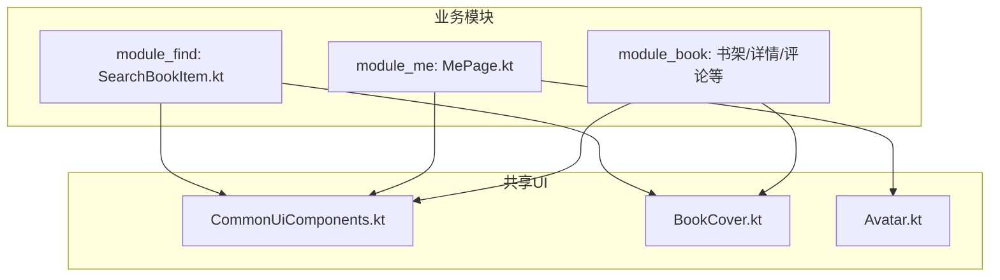
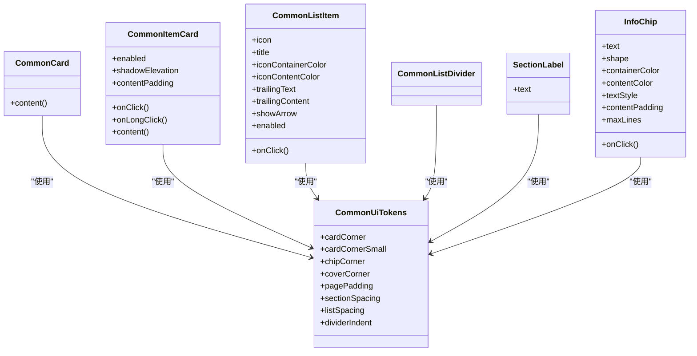
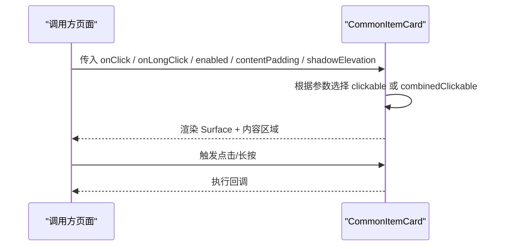
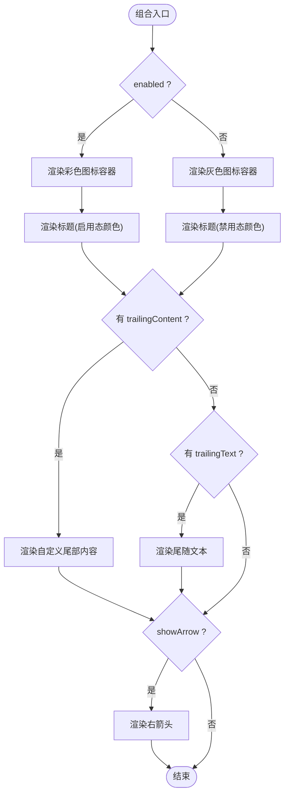
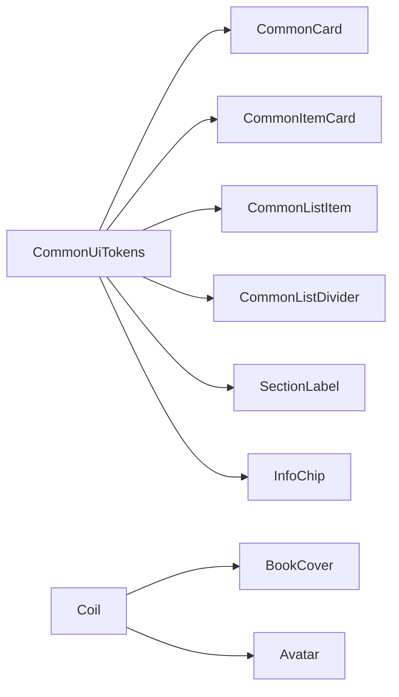

# 共享UI组件库

<cite>
**本文引用的文件**
- [CommonUiComponents.kt](file://lib_book_common/src/main/java/com/ebook/common/ui/CommonUiComponents.kt)
- [BookCover.kt](file://lib_book_common/src/main/java/com/ebook/common/ui/BookCover.kt)
- [Avatar.kt](file://lib_book_common/src/main/java/com/ebook/common/ui/Avatar.kt)
- [0006-shared-ui-components-in-lib-book-common.md](file://docs/adr/0006-shared-ui-components-in-lib-book-common.md)
- [SearchBookItem.kt](file://module_find/src/main/java/com/ebook/find/view/SearchBookItem.kt)
- [MePage.kt](file://module_me/src/main/java/com/ebook/me/page/MePage.kt)
</cite>

## 目录
1. [简介](#简介)
2. [项目结构](#项目结构)
3. [核心组件](#核心组件)
4. [架构总览](#架构总览)
5. [详细组件分析](#详细组件分析)
6. [依赖关系分析](#依赖关系分析)
7. [性能考量](#性能考量)
8. [故障排查指南](#故障排查指南)
9. [结论](#结论)
10. [附录：使用示例与最佳实践](#附录使用示例与最佳实践)

## 简介
本仓库在 lib_book_common 中沉淀了跨模块复用的 Compose UI 组件与设计常量，统一了卡片、列表项、标签、封面、头像等通用视觉元素，并通过 Material Design 3 语义色与排版规范保证全应用一致的观感。该体系以 CommonUiTokens 为设计常数唯一事实来源，以 CommonCard、CommonItemCard、CommonListItem、InfoChip、SectionLabel、CommonListDivider 等组件为构建块，配合 BookCover、Avatar 完成常见媒体展示需求。业务模块（如 module_find、module_me、module_book）通过复用这些组件实现统一的“轻卡片 + 语义色 + Material typography”的视觉语言。

## 项目结构
- 共享 UI 组件集中在 lib_book_common 的 com.ebook.common.ui 包下，包含：
  - CommonUiComponents.kt：定义设计常量与通用容器/列表项/分割线/分组标题/信息标签
  - BookCover.kt：书籍封面统一封装（Coil + 占位图 + 圆角裁剪）
  - Avatar.kt：用户头像统一封装（三态兜底、圆形裁剪）
- 业务模块通过引用上述组件，形成统一的卡片层级与视觉风格：
  - module_find：搜索结果条目、书城页面等使用 CommonItemCard、BookCover、InfoChip
  - module_me：个人中心功能菜单使用 CommonListItem、CommonCard、CommonListDivider
  - module_book：书架、详情页、评论区等使用共享卡片与标签

图表来源
- [CommonUiComponents.kt:47-77](file://lib_book_common/src/main/java/com/ebook/common/ui/CommonUiComponents.kt#L47-L77)
- [BookCover.kt:11-41](file://lib_book_common/src/main/java/com/ebook/common/ui/BookCover.kt#L11-L41)
- [Avatar.kt:15-62](file://lib_book_common/src/main/java/com/ebook/common/ui/Avatar.kt#L15-L62)
- [SearchBookItem.kt:33-138](file://module_find/src/main/java/com/ebook/find/view/SearchBookItem.kt#L33-L138)
- [MePage.kt:61-100](file://module_me/src/main/java/com/ebook/me/page/MePage.kt#L61-L100)

章节来源
- [CommonUiComponents.kt:47-77](file://lib_book_common/src/main/java/com/ebook/common/ui/CommonUiComponents.kt#L47-L77)
- [BookCover.kt:11-41](file://lib_book_common/src/main/java/com/ebook/common/ui/BookCover.kt#L11-L41)
- [Avatar.kt:15-62](file://lib_book_common/src/main/java/com/ebook/common/ui/Avatar.kt#L15-L62)
- [SearchBookItem.kt:33-138](file://module_find/src/main/java/com/ebook/find/view/SearchBookItem.kt#L33-L138)
- [MePage.kt:61-100](file://module_me/src/main/java/com/ebook/me/page/MePage.kt#L61-L100)

## 核心组件
- CommonUiTokens：集中管理圆角、间距、缩进等设计常量，作为全仓唯一事实来源，避免各模块出现“魔法值”。
- CommonCard：分组容器卡片，采用 16dp 圆角与 surfaceContainer 语义色，承载一组相关条目，形成外层容器层次。
- CommonItemCard：条目卡容器，采用 12dp 圆角与 surfaceContainer 语义色，用于搜索结果、评论、设置项等具体条目；支持点击/长按、禁用态、阴影高度、内边距可配。
- CommonListItem：菜单/设置项的标准行，包含彩色图标容器、标题、可选尾随文本或自定义内容、右侧箭头；支持 enabled 禁用态，并在不可用时整体保持可见但不可交互。
- CommonListDivider：从图标列起始处缩进的分割线，比通栏分割线更轻量。
- SectionLabel：分组小标题，弱化文字用于区块分隔。
- InfoChip：信息小标签/胶囊，支持形状、颜色、排版、内边距、最大行数、点击回调等，覆盖“小标签”和“胶囊”两类形态。

章节来源
- [CommonUiComponents.kt:47-77](file://lib_book_common/src/main/java/com/ebook/common/ui/CommonUiComponents.kt#L47-L77)
- [CommonUiComponents.kt:85-98](file://lib_book_common/src/main/java/com/ebook/common/ui/CommonUiComponents.kt#L85-L98)
- [CommonUiComponents.kt:114-146](file://lib_book_common/src/main/java/com/ebook/common/ui/CommonUiComponents.kt#L114-L146)
- [CommonUiComponents.kt:164-228](file://lib_book_common/src/main/java/com/ebook/common/ui/CommonUiComponents.kt#L164-L228)
- [CommonUiComponents.kt:230-239](file://lib_book_common/src/main/java/com/ebook/common/ui/CommonUiComponents.kt#L230-L239)
- [CommonUiComponents.kt:241-255](file://lib_book_common/src/main/java/com/ebook/common/ui/CommonUiComponents.kt#L241-L255)
- [CommonUiComponents.kt:276-308](file://lib_book_common/src/main/java/com/ebook/common/ui/CommonUiComponents.kt#L276-L308)

## 架构总览
共享UI组件库遵循“容器-条目”两级卡片层次：
- 外层分组容器使用 CommonCard（16dp 圆角），内部再放置多个 CommonItemCard（12dp 圆角），形成清晰的视觉层级与区分。
- 所有颜色来自 MaterialTheme.colorScheme，字号走 MaterialTypography，避免硬编码颜色与字号，确保主题一致性与可读性。
- 图标约束：仅使用 material-icons-core 核心集图标，扩展图标由业务模块自行声明依赖，控制基础库体积。

图表来源
- [CommonUiComponents.kt:47-77](file://lib_book_common/src/main/java/com/ebook/common/ui/CommonUiComponents.kt#L47-L77)
- [CommonUiComponents.kt:85-98](file://lib_book_common/src/main/java/com/ebook/common/ui/CommonUiComponents.kt#L85-L98)
- [CommonUiComponents.kt:114-146](file://lib_book_common/src/main/java/com/ebook/common/ui/CommonUiComponents.kt#L114-L146)
- [CommonUiComponents.kt:164-228](file://lib_book_common/src/main/java/com/ebook/common/ui/CommonUiComponents.kt#L164-L228)
- [CommonUiComponents.kt:230-239](file://lib_book_common/src/main/java/com/ebook/common/ui/CommonUiComponents.kt#L230-L239)
- [CommonUiComponents.kt:241-255](file://lib_book_common/src/main/java/com/ebook/common/ui/CommonUiComponents.kt#L241-L255)
- [CommonUiComponents.kt:276-308](file://lib_book_common/src/main/java/com/ebook/common/ui/CommonUiComponents.kt#L276-L308)

## 详细组件分析

### CommonCard（分组容器）
- 职责：提供统一的外层分组容器，使用 16dp 圆角与 surfaceContainer 语义色，轻微阴影提升层级。
- 使用场景：包裹一组相关的条目（如设置分组、分类区块）。
- 定制点：可通过 Modifier 追加尺寸、边距、背景等；默认使用 MaterialTheme.colorScheme.surfaceContainer 与 RoundedCornerShape(16.dp)。
- 注意事项：容器不处理内容布局，具体布局由各页决定。

章节来源
- [CommonUiComponents.kt:85-98](file://lib_book_common/src/main/java/com/ebook/common/ui/CommonUiComponents.kt#L85-L98)

### CommonItemCard（条目容器）
- 职责：条目级容器，使用 12dp 圆角与 surfaceContainer 语义色，提供点击/长按、禁用态、阴影高度、内边距等能力。
- 使用场景：搜索结果条目、评论行、菜单项等。
- 行为说明：
  - 同时存在 onClick 与 onLongClick 时，使用 combinedClickable 保留长按手势。
  - 无交互回调时不挂点击面，仅做展示。
  - enabled=false 时仍渲染，但不响应交互。
- 定制点：shadowElevation、contentPadding 均可配置；圆角固定为 12dp。

图表来源
- [CommonUiComponents.kt:114-146](file://lib_book_common/src/main/java/com/ebook/common/ui/CommonUiComponents.kt#L114-L146)

章节来源
- [CommonUiComponents.kt:114-146](file://lib_book_common/src/main/java/com/ebook/common/ui/CommonUiComponents.kt#L114-L146)

### CommonListItem（菜单/设置项）
- 职责：标准化的行项，包含彩色图标容器、标题、尾随文本/内容、右侧箭头。
- 使用场景：设置页、个人中心功能菜单等。
- 行为说明：
  - enabled=false 时整行仍可点击命中但不会触发回调，并将标题与图标置灰，表达“看得见但不可操作”的语义。
  - 图标容器使用 36dp 尺寸与圆角，图标大小 20dp。
  - showArrow 控制是否显示右侧箭头。
- 定制点：iconContainerColor、iconContentColor、trailingText、trailingContent、showArrow、enabled。

图表来源
- [CommonUiComponents.kt:164-228](file://lib_book_common/src/main/java/com/ebook/common/ui/CommonUiComponents.kt#L164-L228)

章节来源
- [CommonUiComponents.kt:164-228](file://lib_book_common/src/main/java/com/ebook/common/ui/CommonUiComponents.kt#L164-L228)

### CommonListDivider（缩进分割线）
- 职责：从图标列起始处缩进的分割线，视觉上避开左侧图标列，更轻量。
- 使用场景：分组内条目之间的分隔。
- 定制点：颜色采用 outlineVariant，缩进基于 dividerIndent 常量。

章节来源
- [CommonUiComponents.kt:230-239](file://lib_book_common/src/main/java/com/ebook/common/ui/CommonUiComponents.kt#L230-L239)

### SectionLabel（分组小标题）
- 职责：分组上方左对齐的弱化标签，用于区分不同区块（如“通用”“关于”）。
- 使用场景：设置分组、分类区块标题。
- 定制点：默认 labelMedium 样式与 onSurfaceVariant 颜色，支持外部 modifier 追加边距。

章节来源
- [CommonUiComponents.kt:241-255](file://lib_book_common/src/main/java/com/ebook/common/ui/CommonUiComponents.kt#L241-L255)

### InfoChip（信息标签/胶囊）
- 职责：弱化背景的标签/胶囊，用于状态、分类、字数、来源等信息展示，可点击。
- 使用场景：搜索结果的来源/状态/分类标签、书型标签、历史词条等。
- 定制点：shape（默认小圆角，胶囊传 50dp）、containerColor/contentColor、textStyle、contentPadding、maxLines、onClick。
- 注意：非按钮型控件，主要用于展示；需要选中/分段控件时应在调用方自绘。

章节来源
- [CommonUiComponents.kt:276-308](file://lib_book_common/src/main/java/com/ebook/common/ui/CommonUiComponents.kt#L276-L308)

### BookCover（书籍封面）
- 职责：统一封面加载，含占位图与错误回退，使用 Crop 缩放避免拉伸变形。
- 使用场景：书城横向书卡、搜索结果条目、书架等。
- 定制点：url、modifier（尺寸）、contentDescription、shape（默认 coverCorner，条目内可用更小圆角）。

章节来源
- [BookCover.kt:11-41](file://lib_book_common/src/main/java/com/ebook/common/ui/BookCover.kt#L11-L41)

### Avatar（用户头像）
- 职责：统一头像加载与三态兜底（空URL直接默认图、加载中中性色块、失败回落默认图），圆形裁剪。
- 使用场景：个人中心、评论作者头像等。
- 定制点：url、modifier（尺寸）、contentDescription。

章节来源
- [Avatar.kt:15-62](file://lib_book_common/src/main/java/com/ebook/common/ui/Avatar.kt#L15-L62)

## 依赖关系分析
- 设计常量依赖：所有组件均依赖 CommonUiTokens 提供的圆角、间距、缩进等常量，确保视觉一致性。
- 主题与排版依赖：颜色使用 MaterialTheme.colorScheme，字号使用 MaterialTheme.typography，确保主题适配与无障碍支持。
- 图标约束：仅使用 material-icons-core 核心集图标，扩展图标需业务模块自行引入。
- 媒体依赖：BookCover 与 Avatar 使用 Coil 进行网络图片加载与占位图管理。

图表来源
- [CommonUiComponents.kt:47-77](file://lib_book_common/src/main/java/com/ebook/common/ui/CommonUiComponents.kt#L47-L77)
- [BookCover.kt:11-41](file://lib_book_common/src/main/java/com/ebook/common/ui/BookCover.kt#L11-L41)
- [Avatar.kt:15-62](file://lib_book_common/src/main/java/com/ebook/common/ui/Avatar.kt#L15-L62)

章节来源
- [CommonUiComponents.kt:47-77](file://lib_book_common/src/main/java/com/ebook/common/ui/CommonUiComponents.kt#L47-L77)
- [BookCover.kt:11-41](file://lib_book_common/src/main/java/com/ebook/common/ui/BookCover.kt#L11-L41)
- [Avatar.kt:15-62](file://lib_book_common/src/main/java/com/ebook/common/ui/Avatar.kt#L15-L62)

## 性能考量
- 避免重复创建对象：例如搜索结果条目中的格式化器实例化于顶层，避免每次组合都新建高成本对象。
- 图片加载优化：BookCover 与 Avatar 使用 Coil 的占位与错误回退，减少空白闪烁与无效请求。
- 列表滚动性能：CommonItemCard 将点击面挂在 Surface 上并裁剪圆角，提高命中效率与渲染一致性。
- 主题与排版：通过 MaterialTheme 统一读取颜色与字号，减少运行时计算差异。

章节来源
- [SearchBookItem.kt:140-155](file://module_find/src/main/java/com/ebook/find/view/SearchBookItem.kt#L140-L155)
- [BookCover.kt:11-41](file://lib_book_common/src/main/java/com/ebook/common/ui/BookCover.kt#L11-L41)
- [Avatar.kt:15-62](file://lib_book_common/src/main/java/com/ebook/common/ui/Avatar.kt#L15-L62)

## 故障排查指南
- 卡片点击无响应：检查 CommonItemCard 是否同时传入了 onClick 与 onLongClick；若未传入任一回调则不会挂点击面。
- 禁用态误显可点击：确保在 CommonListItem 中正确设置 enabled=false，组件会在禁用态置灰并保持不可交互。
- 图片显示异常：确认 BookCover/Avatar 的 url 是否为空；空 URL 会直接展示默认图，非空但失败也会回退到默认图。
- 主题不一致：确保所有颜色与字号来自 MaterialTheme，避免硬编码导致深浅色切换异常。
- 图标缺失：若需要使用 iconsExtended 的图标，需在对应业务模块声明依赖；共享组件本身只允许 core 图标。

章节来源
- [CommonUiComponents.kt:114-146](file://lib_book_common/src/main/java/com/ebook/common/ui/CommonUiComponents.kt#L114-L146)
- [CommonUiComponents.kt:164-228](file://lib_book_common/src/main/java/com/ebook/common/ui/CommonUiComponents.kt#L164-L228)
- [BookCover.kt:11-41](file://lib_book_common/src/main/java/com/ebook/common/ui/BookCover.kt#L11-L41)
- [Avatar.kt:15-62](file://lib_book_common/src/main/java/com/ebook/common/ui/Avatar.kt#L15-L62)

## 结论
共享UI组件库通过 CommonUiTokens 统一管理设计常量，结合 CommonCard、CommonItemCard、CommonListItem、InfoChip、SectionLabel、CommonListDivider 以及 BookCover、Avatar 等组件，实现了跨模块一致的视觉语言与行为模型。该体系遵循 Material Design 3 语义色与排版规范，确保了主题适配、可访问性与一致性。业务模块只需关注内容与交互，无需重复实现通用容器与样式，降低了维护成本并提升了开发效率。

## 附录：使用示例与最佳实践
- 搜索结果条目（module_find）：
  - 使用 CommonItemCard 作为条目容器，BookCover 展示封面，InfoChip 显示来源/状态/分类/字数，MaterialTypography 控制字号。
  - 参考路径：[SearchBookItem.kt:33-138](file://module_find/src/main/java/com/ebook/find/view/SearchBookItem.kt#L33-L138)
- 个人中心菜单（module_me）：
  - 使用 CommonCard 包裹功能区块，CommonListItem 表示菜单项，CommonListDivider 分隔分组，SectionLabel 标注分组标题。
  - 参考路径：[MePage.kt:61-100](file://module_me/src/main/java/com/ebook/me/page/MePage.kt#L61-L100)
- 设计常量与组件收敛策略：
  - 通过 ADR 文档明确共享组件的收录判据与约束，确保新增组件符合“跨模块复用”的标准。
  - 参考路径：[0006-shared-ui-components-in-lib-book-common.md:1-27](file://docs/adr/0006-shared-ui-components-in-lib-book-common.md#L1-L27)

章节来源
- [SearchBookItem.kt:33-138](file://module_find/src/main/java/com/ebook/find/view/SearchBookItem.kt#L33-L138)
- [MePage.kt:61-100](file://module_me/src/main/java/com/ebook/me/page/MePage.kt#L61-L100)
- [0006-shared-ui-components-in-lib-book-common.md:1-27](file://docs/adr/0006-shared-ui-components-in-lib-book-common.md#L1-L27)