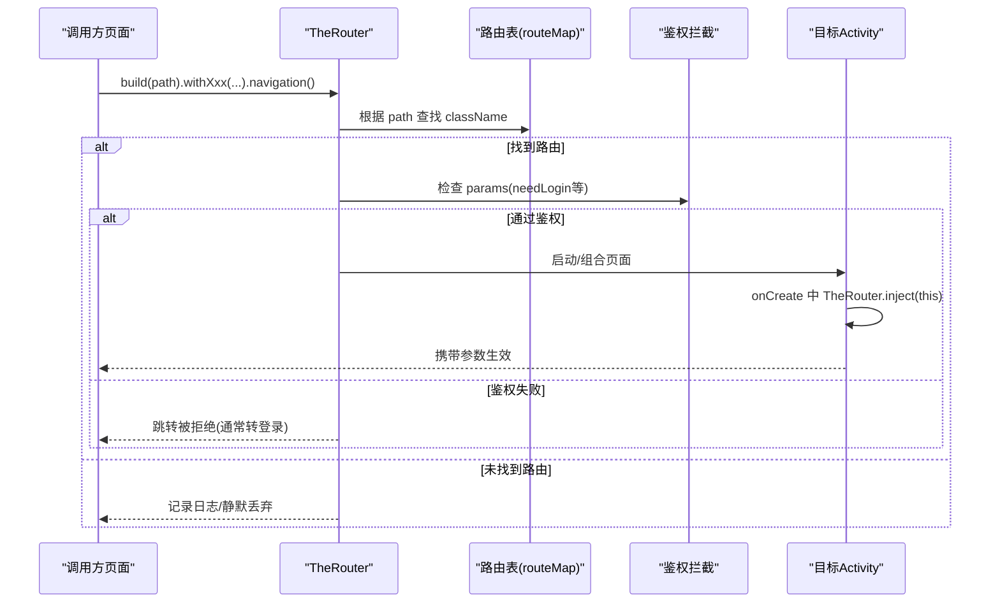
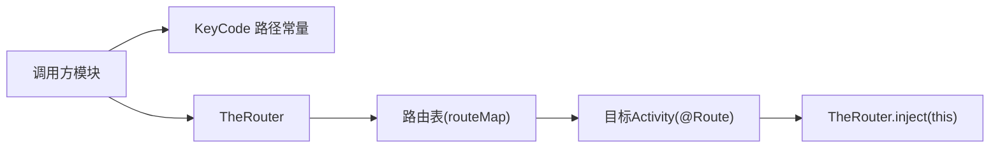

# 导航与路由系统

<cite>
**本文引用的文件**
- [module_app/src/main/assets/therouter/routeMap.json](file://module_app/src/main/assets/therouter/routeMap.json)
- [module_book/src/main/assets/therouter/routeMap.json](file://module_book/src/main/assets/therouter/routeMap.json)
- [module_find/src/main/assets/therouter/routeMap.json](file://module_find/src/main/assets/therouter/routeMap.json)
- [module_login/src/main/assets/therouter/routeMap.json](file://module_login/src/main/assets/therouter/routeMap.json)
- [module_main/src/main/assets/therouter/routeMap.json](file://module_main/src/main/assets/therouter/routeMap.json)
- [module_me/src/main/assets/therouter/routeMap.json](file://module_me/src/main/assets/therouter/routeMap.json)
- [lib_book_common/src/main/java/com/ebook/common/event/KeyCode.kt](file://lib_book_common/src/main/java/com/ebook/common/event/KeyCode.kt)
- [module_book/src/main/java/com/ebook/book/BookDetailActivity.kt](file://module_book/src/main/java/com/ebook/book/BookDetailActivity.kt)
- [module_find/src/main/java/com/ebook/find/SearchActivity.kt](file://module_find/src/main/java/com/ebook/find/SearchActivity.kt)
- [module_find/src/main/java/com/ebook/find/page/BookstorePage.kt](file://module_find/src/main/java/com/ebook/find/page/BookstorePage.kt)
- [module_book/src/main/java/com/ebook/book/page/BookShelfPage.kt](file://module_book/src/main/java/com/ebook/book/page/BookShelfPage.kt)
- [module_book/src/main/java/com/ebook/book/ReadBookActivity.kt](file://module_book/src/main/java/com/ebook/book/ReadBookActivity.kt)
- [module_me/src/main/java/com/ebook/me/view/SettingActivity.kt](file://module_me/src/main/java/com/ebook/me/view/SettingActivity.kt)
- [module_me/src/main/java/com/ebook/me/view/AboutActivity.kt](file://module_me/src/main/java/com/ebook/me/view/AboutActivity.kt)
- [module_me/src/main/java/com/ebook/me/view/ModifyInformationActivity.kt](file://module_me/src/main/java/com/ebook/me/view/ModifyInformationActivity.kt)
- [module_main/src/main/java/com/ebook/main/MainActivity.kt](file://module_main/src/main/java/com/ebook/main/MainActivity.kt)
</cite>

## 目录
1. [简介](#简介)
2. [项目结构与路由装配](#项目结构与路由装配)
3. [核心组件](#核心组件)
4. [架构总览](#架构总览)
5. [详细组件分析](#详细组件分析)
6. [依赖关系分析](#依赖关系分析)
7. [性能考虑](#性能考虑)
8. [故障排查指南](#故障排查指南)
9. [结论](#结论)
10. [附录：典型跳转场景](#附录典型跳转场景)

## 简介
本模块文档聚焦于项目中使用 TheRouter 实现的跨模块导航与路由体系。内容涵盖路由配置（routeMap.json）、路径定义（KeyCode）、页面跳转模式（简单跳转、带参跳转、条件跳转）、参数传递与处理、模块化最佳实践、调试与测试方法，以及导航性能优化策略。读者可据此理解并安全地扩展跨模块导航链路。

## 项目结构与路由装配
- 多模块各自在 assets/therouter/routeMap.json 中声明自身暴露的路由项，TheRouter 在构建期汇总为全局路由表。各模块的 routeMap 覆盖以下路径段：
  - /ebook/main/*：主容器与入口
  - /ebook/user/*：登录、注册、密码相关
  - /ebook/book/*：书籍详情、评论、下载管理、元数据编辑
  - /ebook/find/*：书城分类选择、搜索
  - /ebook/me/*：个人中心设置、缓存、关于、文档、书源管理等
- 路径常量统一在 KeyCode 接口内集中维护，避免散落的字符串字面量。
- 独立运行模式下，若某模块未参与集成，则其路由不可用；为保持开发体验，可在对应模块的 debug 占位 Activity 中提供同名路由占位，避免跳转静默失败。

```mermaid
graph TB
  subgraph "模块路由注册"
    A["module_app<br/>routeMap.json"] --> R["TheRouter 路由表"]
    B["module_book<br/>routeMap.json"] --> R
    C["module_find<br/>routeMap.json"] --> R
    D["module_login<br/>routeMap.json"] --> R
    E["module_main<br/>routeMap.json"] --> R
    F["module_me<br/>routeMap.json"] --> R
  end

  subgraph "调用方"
    X["业务模块/页面"]
  end

  X -->|TheRouter.build(path)| R
  R -->|匹配到 className| X
```

图示来源
- [module_app/src/main/assets/therouter/routeMap.json:1-150](file://module_app/src/main/assets/therouter/routeMap.json#L1-L150)
- [module_book/src/main/assets/therouter/routeMap.json:1-39](file://module_book/src/main/assets/therouter/routeMap.json#L1-L39)
- [module_find/src/main/assets/therouter/routeMap.json:1-30](file://module_find/src/main/assets/therouter/routeMap.json#L1-L30)
- [module_login/src/main/assets/therouter/routeMap.json:1-46](file://module_login/src/main/assets/therouter/routeMap.json#L1-L46)
- [module_main/src/main/assets/therouter/routeMap.json:1-9](file://module_main/src/main/assets/therouter/routeMap.json#L1-L9)
- [module_me/src/main/assets/therouter/routeMap.json:1-71](file://module_me/src/main/assets/therouter/routeMap.json#L1-L71)

章节来源
- [module_app/src/main/assets/therouter/routeMap.json:1-150](file://module_app/src/main/assets/therouter/routeMap.json#L1-L150)
- [lib_book_common/src/main/java/com/ebook/common/event/KeyCode.kt:1-105](file://lib_book_common/src/main/java/com/ebook/common/event/KeyCode.kt#L1-L105)

## 核心组件
- 路由常量中心：KeyCode 定义了各模块路由路径前缀与具体路径，确保调用方与目标端使用一致字符串。
- 路由表：每个模块的 routeMap.json 将 path 映射到目标 Activity 类名，并支持 params 字段声明该路由的参数约束或前置条件（如 needLogin）。
- 路由调用：业务代码通过 TheRouter.build(path).withXxx(...).navigation(...) 发起跳转；目标 Activity 通过 @Route 注解与 TheRouter.inject(this) 完成注入。
- 鉴权拦截：部分路由在 params 中标注 needLogin=true，配合鉴权逻辑实现条件跳转。

章节来源
- [lib_book_common/src/main/java/com/ebook/common/event/KeyCode.kt:1-105](file://lib_book_common/src/main/java/com/ebook/common/event/KeyCode.kt#L1-L105)
- [module_me/src/main/assets/therouter/routeMap.json:1-71](file://module_me/src/main/assets/therouter/routeMap.json#L1-L71)
- [module_book/src/main/java/com/ebook/book/BookDetailActivity.kt:53-69](file://module_book/src/main/java/com/ebook/book/BookDetailActivity.kt#L53-L69)

## 架构总览
下图展示了从调用方到目标页面的完整导航序列，包括参数附加、路由解析、鉴权校验与页面注入。



图示来源
- [module_main/src/main/java/com/ebook/main/MainActivity.kt:76-79](file://module_main/src/main/java/com/ebook/main/MainActivity.kt#L76-L79)
- [module_book/src/main/java/com/ebook/book/BookDetailActivity.kt:53-69](file://module_book/src/main/java/com/ebook/book/BookDetailActivity.kt#L53-L69)
- [module_me/src/main/assets/therouter/routeMap.json:1-71](file://module_me/src/main/assets/therouter/routeMap.json#L1-L71)

## 详细组件分析

### 路由配置与路径定义
- 路径组织
  - 以 /ebook/{module}/... 分段命名，便于按模块划分与维护。
  - 路径常量集中在 KeyCode，调用方一律引用常量，避免硬编码字符串。
- 路由表结构
  - path：唯一路由地址
  - className：目标类全限定名
  - action：预留字段（当前为空）
  - description：描述（当前为空）
  - params：键值对，用于声明参数约束或行为标记（如 needLogin）

章节来源
- [lib_book_common/src/main/java/com/ebook/common/event/KeyCode.kt:1-105](file://lib_book_common/src/main/java/com/ebook/common/event/KeyCode.kt#L1-L105)
- [module_app/src/main/assets/therouter/routeMap.json:1-150](file://module_app/src/main/assets/therouter/routeMap.json#L1-L150)

### 路由注册机制
- 编译期/构建期扫描各模块 assets/therouter/routeMap.json，合并为全局路由表。
- 新增路由需在目标模块 routeMap 中添加条目，并在调用侧通过 KeyCode 引用路径常量。
- 独立运行模式下的占位路由：当某模块独立运行时，为避免路由丢失导致静默失败，可在 src/main/test/debug 下提供同名路由占位 Activity，仅参与独立模式编译。

章节来源
- [module_book/src/main/assets/therouter/routeMap.json:1-39](file://module_book/src/main/assets/therouter/routeMap.json#L1-L39)
- [module_find/src/main/assets/therouter/routeMap.json:1-30](file://module_find/src/main/assets/therouter/routeMap.json#L1-L30)
- [module_login/src/main/assets/therouter/routeMap.json:1-46](file://module_login/src/main/assets/therouter/routeMap.json#L1-L46)
- [module_main/src/main/assets/therouter/routeMap.json:1-9](file://module_main/src/main/assets/therouter/routeMap.json#L1-L9)
- [module_me/src/main/assets/therouter/routeMap.json:1-71](file://module_me/src/main/assets/therouter/routeMap.json#L1-L71)

### 页面跳转模式

#### 简单跳转
- 无需参数的页面跳转直接使用 TheRouter.build(path).navigation(context)。
- 示例：设置页跳转到缓存管理、关于页、文档页等。

章节来源
- [module_me/src/main/java/com/ebook/me/view/SettingActivity.kt:123-131](file://module_me/src/main/java/com/ebook/me/view/SettingActivity.kt#L123-L131)
- [module_me/src/main/java/com/ebook/me/view/AboutActivity.kt:86-92](file://module_me/src/main/java/com/ebook/me/view/AboutActivity.kt#L86-L92)

#### 带参数跳转
- 通过 .withXxx(...) 链式添加参数，支持基础类型与对象序列化。
- 常见用法：
  - withInt("from", value)
  - withString("data_key", key)
  - withObject("data", entity)
- 目标端通过 @Autowired(name = "...") 注入，或在 onCreate 中调用 TheRouter.inject(this) 后读取。

章节来源
- [module_find/src/main/java/com/ebook/find/page/BookstorePage.kt:314-317](file://module_find/src/main/java/com/ebook/find/page/BookstorePage.kt#L314-L317)
- [module_find/src/main/java/com/ebook/find/page/BookstorePage.kt:510-513](file://module_find/src/main/java/com/ebook/find/page/BookstorePage.kt#L510-L513)
- [module_book/src/main/java/com/ebook/book/page/BookShelfPage.kt:168-171](file://module_book/src/main/java/com/ebook/book/page/BookShelfPage.kt#L168-L171)
- [module_book/src/main/java/com/ebook/book/BookDetailActivity.kt:53-69](file://module_book/src/main/java/com/ebook/book/BookDetailActivity.kt#L53-L69)

#### 条件跳转（鉴权）
- 路由 params 中声明 needLogin=true，表示需要登录态才能访问。
- 调用方可结合当前会话状态进行条件判断；若未登录，先跳转登录页，成功后再进入目标页。
- 部分页面直接通过路由参数控制行为，例如阅读页跳转到评论页时附带上下文参数。

章节来源
- [module_me/src/main/assets/therouter/routeMap.json:10-35](file://module_me/src/main/assets/therouter/routeMap.json#L10-L35)
- [module_book/src/main/assets/therouter/routeMap.json:31-38](file://module_book/src/main/assets/therouter/routeMap.json#L31-L38)
- [module_book/src/main/java/com/ebook/book/ReadBookActivity.kt:232-235](file://module_book/src/main/java/com/ebook/book/ReadBookActivity.kt#L232-L235)

### 路由参数传递与处理
- 基本类型：withInt、withString、withBoolean 等，适合轻量标识、来源标记、开关等。
- 对象类型：withObject 支持可序列化对象，常用于跨模块传递实体数据（如 SearchBookEntity）。
- 复杂数据：建议拆分为“关键键 + 缓存/仓库”方式，避免 Intent 载荷过大；或使用稳定的 data_key 指向共享存储中的大对象。
- 参数接收：目标 Activity 使用 @Autowired(name="...") 注入，并在 onCreate 中执行 TheRouter.inject(this)。

章节来源
- [module_find/src/main/java/com/ebook/find/page/BookstorePage.kt:314-317](file://module_find/src/main/java/com/ebook/find/page/BookstorePage.kt#L314-L317)
- [module_book/src/main/java/com/ebook/book/page/BookShelfPage.kt:168-171](file://module_book/src/main/java/com/ebook/book/page/BookShelfPage.kt#L168-L171)
- [module_book/src/main/java/com/ebook/book/BookDetailActivity.kt:53-69](file://module_book/src/main/java/com/ebook/book/BookDetailActivity.kt#L53-L69)

### 模块化导航最佳实践
- 模块间解耦：通过 TheRouter 抽象导航契约，模块只依赖 KeyCode 与路由协议，不直接依赖对方 Activity。
- 依赖最小化：调用方仅需引入 TheRouter 与 KeyCode；目标模块负责注册路由。
- 接口抽象：跨模块服务通过 Provider 接口暴露；页面级 Composable 通过 Provider 返回，由宿主组合。
- 路径规范：统一采用 /ebook/{module}/... 的层级命名，便于管理与排查。

章节来源
- [lib_book_common/src/main/java/com/ebook/common/event/KeyCode.kt:1-105](file://lib_book_common/src/main/java/com/ebook/common/event/KeyCode.kt#L1-L105)
- [module_main/src/main/java/com/ebook/main/MainActivity.kt:76-79](file://module_main/src/main/java/com/ebook/main/MainActivity.kt#L76-L79)

### 典型跳转场景

#### 书架到详情页
- 触发点：书架列表点击书籍
- 参数：from=FROM_BOOKSHELF、data_key=稳定键
- 目标：BookDetailActivity，通过 @Autowired 注入 from 与 data_key，再从共享存储取 BookShelfEntity

章节来源
- [module_book/src/main/java/com/ebook/book/page/BookShelfPage.kt:168-171](file://module_book/src/main/java/com/ebook/book/page/BookShelfPage.kt#L168-L171)
- [module_book/src/main/java/com/ebook/book/BookDetailActivity.kt:53-69](file://module_book/src/main/java/com/ebook/book/BookDetailActivity.kt#L53-L69)

#### 书城到搜索页
- 触发点：书城顶部搜索按钮
- 参数：无或轻量上下文
- 目标：SearchActivity

章节来源
- [module_find/src/main/java/com/ebook/find/page/BookstorePage.kt:333-336](file://module_find/src/main/java/com/ebook/find/page/BookstorePage.kt#L333-L336)

#### 个人中心设置页
- 触发点：设置菜单
- 参数：无
- 目标：SettingActivity，并可进一步跳转到缓存管理、书源管理、关于页等

章节来源
- [module_me/src/main/java/com/ebook/me/view/SettingActivity.kt:123-131](file://module_me/src/main/java/com/ebook/me/view/SettingActivity.kt#L123-L131)

#### 阅读页到评论页
- 触发点：阅读器评论区入口
- 参数：上下文信息（如 bookId）
- 目标：BookCommentsActivity

章节来源
- [module_book/src/main/java/com/ebook/book/ReadBookActivity.kt:232-235](file://module_book/src/main/java/com/ebook/book/ReadBookActivity.kt#L232-L235)

## 依赖关系分析
- 调用方依赖：TheRouter、KeyCode
- 路由表来源：各模块 assets/therouter/routeMap.json
- 目标页面：@Route 注解声明路径；onCreate 中 TheRouter.inject(this) 完成参数注入
- 鉴权依赖：params.needLogin 与登录态判定逻辑（通常在调用方或拦截器层）



图示来源
- [lib_book_common/src/main/java/com/ebook/common/event/KeyCode.kt:1-105](file://lib_book_common/src/main/java/com/ebook/common/event/KeyCode.kt#L1-L105)
- [module_book/src/main/java/com/ebook/book/BookDetailActivity.kt:53-69](file://module_book/src/main/java/com/ebook/book/BookDetailActivity.kt#L53-L69)

章节来源
- [module_app/src/main/assets/therouter/routeMap.json:1-150](file://module_app/src/main/assets/therouter/routeMap.json#L1-L150)
- [module_book/src/main/java/com/ebook/book/BookDetailActivity.kt:53-69](file://module_book/src/main/java/com/ebook/book/BookDetailActivity.kt#L53-L69)

## 性能考虑
- 预加载：对高频目标页（如详情页）可在后台预热必要资源，减少首屏等待。
- 懒加载：大对象通过 data_key 延迟加载，避免一次性装载过多数据。
- 内存管理：合理拆分参数，避免在 Intent 中传递超大对象；及时清理共享存储中的临时数据。
- 路由命中：尽量复用已有路由，避免重复创建相同目的地的实例；必要时使用 FLAG_ACTIVITY_CLEAR_TOP 清理栈。
- 网络与渲染：详情页在进入前尽可能准备数据，但避免阻塞 UI；首次请求失败时给出友好降级。

[本节为通用指导，不直接分析具体文件]

## 故障排查指南
- 路由未命中
  - 现象：跳转无响应或静默丢弃
  - 排查：确认目标模块已包含 routeMap 条目；检查 path 是否拼写错误；独立模式下是否缺少占位路由
- 参数未注入
  - 现象：目标页拿不到 from/data_key 等参数
  - 排查：确保目标页 onCreate 中调用了 TheRouter.inject(this)；@Autowired 名称与发送方一致
- 鉴权失败
  - 现象：needLogin 路由无法进入
  - 排查：检查登录态；必要时在调用方做条件跳转，先引导至登录页
- 独立模式路由丢失
  - 现象：功能模块独立运行时跳转失败
  - 排查：在 src/main/test/debug 增加同名占位路由，保证独立模式可运行

章节来源
- [module_me/src/main/assets/therouter/routeMap.json:10-35](file://module_me/src/main/assets/therouter/routeMap.json#L10-L35)
- [module_book/src/main/assets/therouter/routeMap.json:31-38](file://module_book/src/main/assets/therouter/routeMap.json#L31-L38)
- [module_book/src/main/java/com/ebook/book/BookDetailActivity.kt:53-69](file://module_book/src/main/java/com/ebook/book/BookDetailActivity.kt#L53-L69)

## 结论
本项目通过 TheRouter 实现了清晰、可维护的跨模块导航体系：以 KeyCode 统一路径常量、以 routeMap.json 声明路由表、以 @Route 与 TheRouter.inject 完成目标注入，并结合 params.needLogin 实现条件跳转。遵循模块化最佳实践与参数传递规范，可有效降低耦合、提升可测性与可维护性。在生产环境中，建议配合预加载、懒加载与内存管理策略，进一步优化用户体验。

## 附录：典型跳转场景
- 书架 → 详情：from=FROM_BOOKSHELF, data_key=稳定键
- 书城 → 搜索：无参或轻量上下文
- 设置 → 缓存/关于/文档：无参
- 阅读 → 评论：附带书籍上下文
- 登录态保护：needLogin=true 的路由需先验证登录

章节来源
- [module_book/src/main/java/com/ebook/book/page/BookShelfPage.kt:168-171](file://module_book/src/main/java/com/ebook/book/page/BookShelfPage.kt#L168-L171)
- [module_find/src/main/java/com/ebook/find/page/BookstorePage.kt:314-317](file://module_find/src/main/java/com/ebook/find/page/BookstorePage.kt#L314-L317)
- [module_me/src/main/java/com/ebook/me/view/SettingActivity.kt:123-131](file://module_me/src/main/java/com/ebook/me/view/SettingActivity.kt#L123-L131)
- [module_book/src/main/java/com/ebook/book/ReadBookActivity.kt:232-235](file://module_book/src/main/java/com/ebook/book/ReadBookActivity.kt#L232-L235)