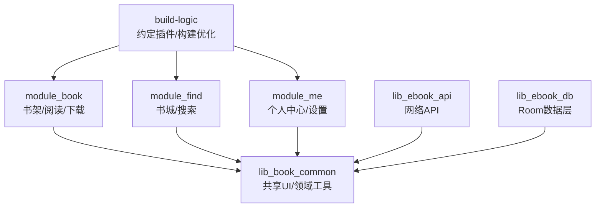
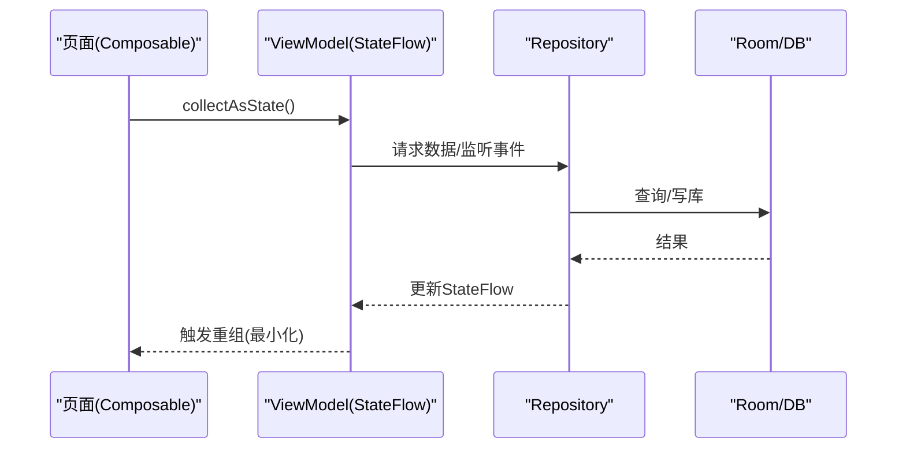
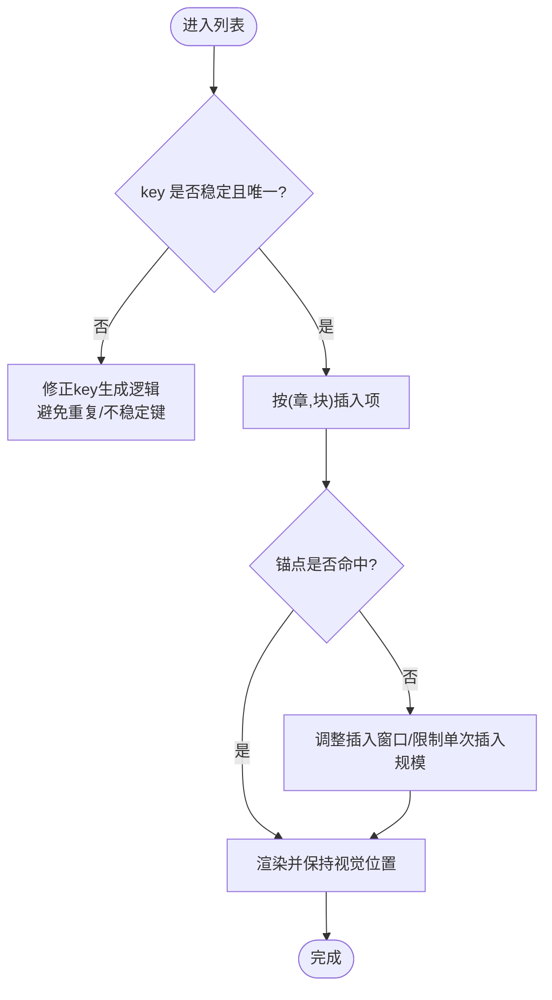
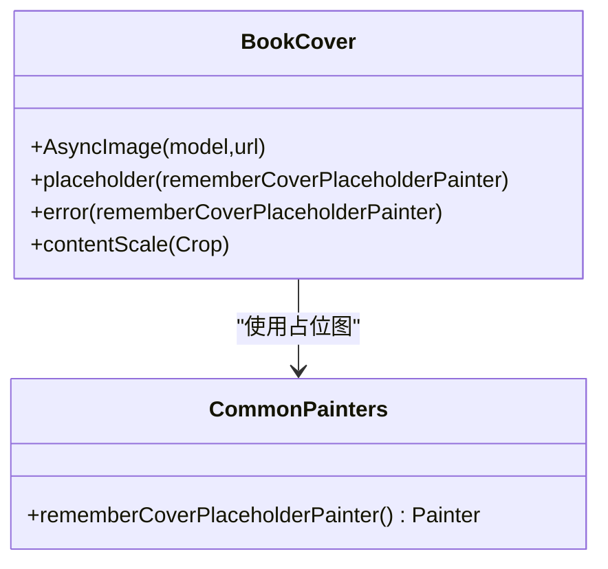
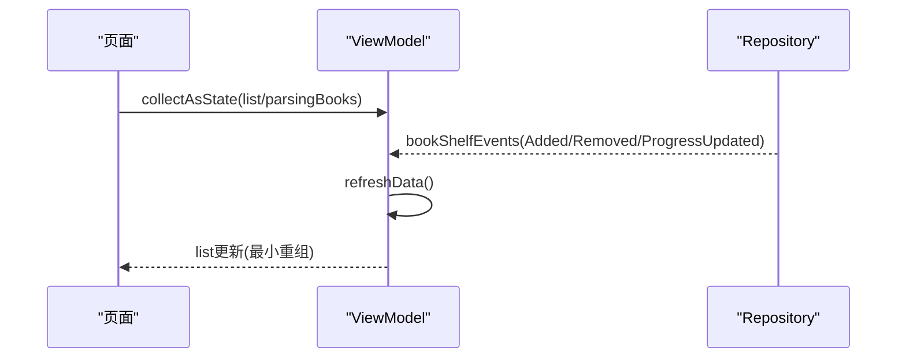
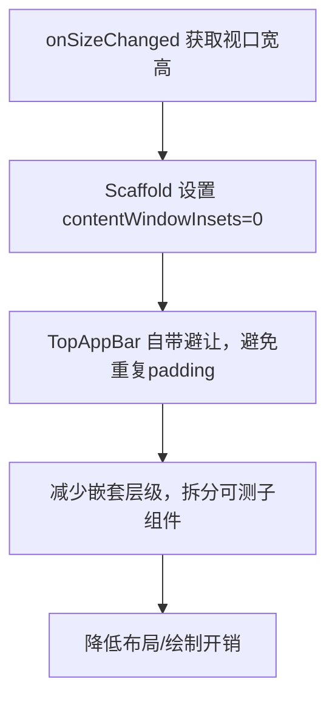
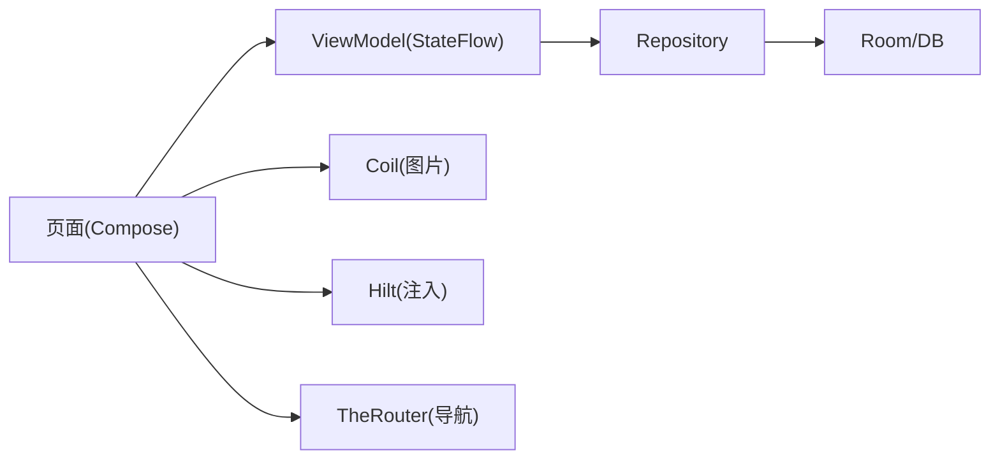

# 性能优化策略

<cite>
**本文引用的文件**
- [compose_compiler_config.conf](file://compose_compiler_config.conf)
- [ReaderScroll.kt](file://module_book/src/main/java/com/ebook/book/reader/ReaderScroll.kt)
- [BookShelfPage.kt](file://module_book/src/main/java/com/ebook/book/page/BookShelfPage.kt)
- [BookCover.kt](file://lib_book_common/src/main/java/com/ebook/common/ui/BookCover.kt)
- [CommonPainters.kt](file://lib_book_common/src/main/java/com/ebook/common/ui/CommonPainters.kt)
- [Avatar.kt](file://lib_book_common/src/main/java/com/ebook/common/ui/Avatar.kt)
- [BookListViewModel.kt](file://module_book/src/main/java/com/ebook/book/mvvm/viewmodel/BookListViewModel.kt)
- [LibraryViewModel.kt](file://module_find/src/main/java/com/ebook/find/mvvm/viewmodel/LibraryViewModel.kt)
- [SearchViewModel.kt](file://module_find/src/main/java/com/ebook/find/mvvm/viewmodel/SearchViewModel.kt)
- [SettingViewModel.kt](file://module_me/src/main/java/com/ebook/me/mvvm/viewmodel/SettingViewModel.kt)
- [AndroidUserSessionManager.kt](file://lib_book_common/src/main/java/com/ebook/common/domain/AndroidUserSessionManager.kt)
- [ProfileRepository.kt](file://lib_book_common/src/main/java/com/ebook/common/repository/ProfileRepository.kt)
- [proguard-rules.pro](file://module_app/proguard-rules.pro)
- [consumer-rules.pro](file://module_book/consumer-rules.pro)
- [AGENTS.md](file://AGENTS.md)
</cite>

## 目录
1. [简介](#简介)
2. [项目结构](#项目结构)
3. [核心组件](#核心组件)
4. [架构总览](#架构总览)
5. [详细组件分析](#详细组件分析)
6. [依赖分析](#依赖分析)
7. [性能考量](#性能考量)
8. [故障排查指南](#故障排查指南)
9. [结论](#结论)
10. [附录](#附录)

## 简介
本指南围绕项目在 Compose UI、图片加载、状态管理、布局与构建方面的实际实现，总结可复用的性能优化实践。内容聚焦以下目标：
- LazyColumn/LazyRow 的 key 使用、项重组优化与内存管理
- 图片加载优化（Coil 配置、缓存策略、占位图处理）
- 状态管理优化（StateFlow/SharedFlow 合理使用、避免不必要重组、状态提升）
- 布局优化（测量、绘制、嵌套层级控制）
- 性能监控与分析（Profiler 指标收集、瓶颈定位）
- 内存泄漏防护（协程生命周期、监听器清理、资源释放）
- 构建优化（ProGuard/R8 规则、分包策略）

## 项目结构
项目采用多模块 MVVM + Compose 架构：业务页面集中在 module_* 模块，通用 UI 与领域能力在 lib_book_common/lib_ebook_* 中沉淀。UI 层大量使用 Compose 列表与 Coil 图片组件；状态通过 ViewModel + Flow 驱动；构建侧统一由 build-logic 约定插件管理，并启用 R8/混淆与稳定类配置。

图表来源
- [AGENTS.md](file://AGENTS.md)

章节来源
- [AGENTS.md](file://AGENTS.md)

## 核心组件
- 滚动阅读器与书架列表：使用 LazyColumn 承载连续滚屏与书架条目，强调 key 稳定性与锚点语义，避免重组抖动与位置跳变。
- 图片组件：统一封装 BookCover 与 Avatar，基于 Coil 的 AsyncImage，提供占位图与错误回退，减少重复组合与不当缩放。
- 状态管理：ViewModel 暴露 StateFlow/SharedFlow，页面 collectAsState 订阅；事件驱动刷新避免手动轮询。
- 构建与稳定性：Compose Compiler 稳定类配置、R8/ProGuard 规则与版本目录集中管理，降低编译开销与包体积。

章节来源
- [ReaderScroll.kt:1-120](file://module_book/src/main/java/com/ebook/book/reader/ReaderScroll.kt#L1-L120)
- [BookShelfPage.kt:1-180](file://module_book/src/main/java/com/ebook/book/page/BookShelfPage.kt#L1-L180)
- [BookCover.kt:1-42](file://lib_book_common/src/main/java/com/ebook/common/ui/BookCover.kt#L1-L42)
- [CommonPainters.kt:1-39](file://lib_book_common/src/main/java/com/ebook/common/ui/CommonPainters.kt#L1-L39)
- [BookListViewModel.kt:1-68](file://module_book/src/main/java/com/ebook/book/mvvm/viewmodel/BookListViewModel.kt#L1-L68)

## 架构总览
以“列表渲染 → 状态流 → 数据源”为主线，结合图片加载与构建优化形成闭环：
- 列表渲染：LazyColumn 以稳定 key 组织 item，控制器提供项序列与锚点信息，避免插入时索引漂移。
- 状态流：ViewModel 将仓库/服务的事件合并为 StateFlow，页面只读订阅，命令通过基类通道下发。
- 图片加载：BookCover/Avatar 统一调用 Coil，占位图与错误图收敛到单一 Painter，减少重复解码与内存分配。
- 构建优化：Compose Compiler 稳定类配置减少重组粒度；R8/ProGuard 移除冗余代码与资源，缩短打包时间。

图表来源
- [BookListViewModel.kt:28-68](file://module_book/src/main/java/com/ebook/book/mvvm/viewmodel/BookListViewModel.kt#L28-L68)
- [BookShelfPage.kt:76-177](file://module_book/src/main/java/com/ebook/book/page/BookShelfPage.kt#L76-L177)

## 详细组件分析

### LazyColumn/LazyRow 性能优化
- 稳定的全局唯一 key：滚屏模式下 item 由「章段」组成，key 仅由 (章, 块) 构成，保证在上方插入项时锚点不偏移，避免视觉跳动与重新布局。
- 项重组优化：列表项尽量保持不可变数据引用；使用 itemsIndexed 或自定义 key 函数避免重复 key 导致的冲突。
- 内存管理：控制单次插入项数量，避免一次性物化过多项导致内存峰值；合理设置懒加载阈值与回收策略。
- 滚动性能：使用 rememberLazyListState 保存滚动位置；对跳转与恢复采用瞬移与动画滚动分离，确保首帧稳定。

图表来源
- [ReaderScroll.kt:53-120](file://module_book/src/main/java/com/ebook/book/reader/ReaderScroll.kt#L53-L120)
- [BookShelfPage.kt:146-177](file://module_book/src/main/java/com/ebook/book/page/BookShelfPage.kt#L146-L177)

章节来源
- [ReaderScroll.kt:53-120](file://module_book/src/main/java/com/ebook/book/reader/ReaderScroll.kt#L53-L120)
- [BookShelfPage.kt:146-177](file://module_book/src/main/java/com/ebook/book/page/BookShelfPage.kt#L146-L177)

### 图片加载优化（Coil）
- 统一封装：BookCover 与 Avatar 均基于 AsyncImage，集中处理 placeholder/error 与裁剪策略（Crop），避免各页面重复组合导致的性能损耗与不一致。
- 占位图处理：使用 rememberCoverPlaceholderPainter 将 NinePatch 转为 BitmapPainter，失败时回退到语义色，减少资源解析异常与运行时崩溃。
- 缓存策略：Coil 默认开启磁盘/内存缓存；通过统一组件复用可减少重复下载与解码，提升冷启动与列表滑动时的帧率。
- 尺寸与缩放：固定 ContentScale.Crop 避免封面拉伸变形，减少不必要的重绘。

图表来源
- [BookCover.kt:1-42](file://lib_book_common/src/main/java/com/ebook/common/ui/BookCover.kt#L1-L42)
- [CommonPainters.kt:1-39](file://lib_book_common/src/main/java/com/ebook/common/ui/CommonPainters.kt#L1-L39)

章节来源
- [BookCover.kt:1-42](file://lib_book_common/src/main/java/com/ebook/common/ui/BookCover.kt#L1-L42)
- [CommonPainters.kt:1-39](file://lib_book_common/src/main/java/com/ebook/common/ui/CommonPainters.kt#L1-L39)

### 状态管理优化（StateFlow/SharedFlow）
- 事件驱动刷新：ViewModel 收集 SharedFlow（如书架变化事件），统一触发 refreshData，避免页面侧重复拉取与竞态。
- 状态提升：页面仅负责展示与交互，状态与副作用放在 ViewModel；通过 collectAsState 将状态提升到 UI 层，减少重组范围。
- 避免不必要重组：使用 remember 稳定引用回调与视图对象；对复杂计算使用 derivedStateOf 延迟求值。
- 会话与主题：Session/Theme 状态通过 Repository/Manager 暴露 StateFlow，页面订阅后按需重组，避免全局频繁刷新。

图表来源
- [BookListViewModel.kt:28-68](file://module_book/src/main/java/com/ebook/book/mvvm/viewmodel/BookListViewModel.kt#L28-L68)
- [BookShelfPage.kt:76-177](file://module_book/src/main/java/com/ebook/book/page/BookShelfPage.kt#L76-L177)

章节来源
- [BookListViewModel.kt:28-68](file://module_book/src/main/java/com/ebook/book/mvvm/viewmodel/BookListViewModel.kt#L28-L68)
- [BookShelfPage.kt:76-177](file://module_book/src/main/java/com/ebook/book/page/BookShelfPage.kt#L76-L177)

### 布局优化技巧
- 测量优化：容器通过 onSizeChanged 上报视口宽高，供排版测算一屏行高与块高，避免心算导致的错位与多余重排。
- 绘制优化：顶层 Scaffold 仅承担底色与 insets 归零，避免内边距叠加造成额外布局层；顶栏自带 windowInsets，防止重复避让。
- 嵌套层级控制：将常用组合（如下载入口角标）拆分为独立 Composable，便于测试与复用；减少无意义的 Box/Column 嵌套。

图表来源
- [ReaderScroll.kt:53-120](file://module_book/src/main/java/com/ebook/book/reader/ReaderScroll.kt#L53-L120)
- [BookShelfPage.kt:106-177](file://module_book/src/main/java/com/ebook/book/page/BookShelfPage.kt#L106-L177)

章节来源
- [ReaderScroll.kt:53-120](file://module_book/src/main/java/com/ebook/book/reader/ReaderScroll.kt#L53-L120)
- [BookShelfPage.kt:106-177](file://module_book/src/main/java/com/ebook/book/page/BookShelfPage.kt#L106-L177)

### 性能监控与分析方法
- Android Profiler：关注 CPU/Memory/Network 三大面板；在列表滑动、图片加载、下拉刷新等场景录制火焰图与 Allocation Tracker，定位热点函数与 GC 压力。
- 指标采集：统计重组次数（Layout Inspector）、图片解码耗时（Coil 日志）、网络请求频率与失败率；对关键路径埋点（如 refreshData、jump）。
- 瓶颈定位：优先检查 LazyColumn key 稳定性、图片重复下载、StateFlow 高频推送导致的过度重组；通过断言与单元测试锁定回归。

[本节为通用指导，无需特定文件来源]

### 内存泄漏防护
- 协程生命周期：在 viewModelScope 内发起异步任务，页面销毁时自动取消；避免在 Application 上 eager 注入引发沙箱进程初始化问题。
- 监听器清理：collectAsState 随组合生命周期绑定/解绑，防止孤儿 collector；事件收集统一在 ViewModel init 中完成。
- 资源释放：图片组件由 Coil 管理缓存；自定义资源（如 NinePatch 转 Bitmap）仅在 remember 作用域内创建，避免重复分配。
- 会话清理：清会话走统一管理器，同步覆盖 SP 镜像与内存 StateFlow，避免残留用户标识导致界面状态不一致。

章节来源
- [BookListViewModel.kt:36-68](file://module_book/src/main/java/com/ebook/book/mvvm/viewmodel/BookListViewModel.kt#L36-L68)
- [CommonPainters.kt:25-39](file://lib_book_common/src/main/java/com/ebook/common/ui/CommonPainters.kt#L25-L39)
- [AndroidUserSessionManager.kt](file://lib_book_common/src/main/java/com/ebook/common/domain/AndroidUserSessionManager.kt)
- [ProfileRepository.kt](file://lib_book_common/src/main/java/com/ebook/common/repository/ProfileRepository.kt)

### 构建优化（ProGuard/R8/分包）
- ProGuard/R8：release 开启混淆；consumer-rules.pro 作为规则唯一来源，功能模块通过 include 避免重复；第三方库自带规则已覆盖，不随意添加 -dontwarn/-keep。
- 分包策略：按模块职责划分（module_* 与 lib_*），避免循环依赖；构建脚本通过版本目录统一管理依赖版本，减少升级成本。
- Compose Compiler 稳定类：通过 compose_compiler_config.conf 声明稳定类型，减少重组粒度，提高渲染性能。

章节来源
- [proguard-rules.pro](file://module_app/proguard-rules.pro)
- [consumer-rules.pro](file://module_book/consumer-rules.pro)
- [compose_compiler_config.conf:1-12](file://compose_compiler_config.conf#L1-L12)

## 依赖分析
- 组件耦合：页面依赖 ViewModel 暴露的状态流；ViewModel 依赖 Repository；Repository 依赖 Room/网络层。UI 层通过共享组件（BookCover/Avatar）降低重复实现。
- 外部依赖：Coil 负责图片加载；Hilt 提供依赖注入；TheRouter 负责跨模块导航；Compose 提供声明式 UI。
- 潜在环依赖：通过模块化边界与 Provider 接口隔离；避免在 lib_book_common 中引入业务模块具体实现。

图表来源
- [AGENTS.md](file://AGENTS.md)
- [BookListViewModel.kt:28-68](file://module_book/src/main/java/com/ebook/book/mvvm/viewmodel/BookListViewModel.kt#L28-L68)

章节来源
- [AGENTS.md](file://AGENTS.md)
- [BookListViewModel.kt:28-68](file://module_book/src/main/java/com/ebook/book/mvvm/viewmodel/BookListViewModel.kt#L28-L68)

## 性能考量
- 列表性能：确保 item key 稳定且唯一；控制单次插入规模；避免在 item 内执行昂贵计算。
- 图片性能：统一使用 BookCover/Avatar；利用 Coil 缓存；避免大图直出，必要时缩略图加载。
- 状态性能：使用 StateFlow/SharedFlow 聚合事件；页面侧用 collectAsState 订阅；避免在重组中做重计算。
- 布局性能：减少嵌套层级；使用 onSizeChanged 精确测量；避免重复 insets 处理。
- 构建性能：稳定类配置减少重组；R8/ProGuard 去除冗余；版本目录集中管理依赖。

[本节为通用指导，无需特定文件来源]

## 故障排查指南
- 列表错位/跳动：检查 LazyColumn 的 key 是否稳定且唯一；确认锚点存储为 (章, 块) 而非扁平序号；限制单次插入项数量。
- 图片显示异常：确认 BookCover/Avatar 的 placeholder/error 已正确设置；NinePatch 转 Bitmap 失败时回退到语义色；检查网络连接与超时。
- 状态不更新：检查 ViewModel 是否正确收集 SharedFlow；页面是否在组合生命周期内 collectAsState；是否存在重复刷新逻辑。
- 构建失败/运行崩溃：核对 consumer-rules.pro 与 proguard-rules.pro 的包含关系；避免无证据的 -keep/-dontwarn；检查 AGP/Kotlin 版本兼容性。

章节来源
- [ReaderScroll.kt:53-120](file://module_book/src/main/java/com/ebook/book/reader/ReaderScroll.kt#L53-L120)
- [BookCover.kt:1-42](file://lib_book_common/src/main/java/com/ebook/common/ui/BookCover.kt#L1-L42)
- [CommonPainters.kt:25-39](file://lib_book_common/src/main/java/com/ebook/common/ui/CommonPainters.kt#L25-L39)
- [BookListViewModel.kt:36-68](file://module_book/src/main/java/com/ebook/book/mvvm/viewmodel/BookListViewModel.kt#L36-L68)

## 结论
本项目在 Compose 列表、图片加载、状态管理与构建方面形成了系统化优化实践：通过稳定 key 与锚点机制保障列表性能；统一图片组件与占位图策略降低重复开销；以 StateFlow/SharedFlow 驱动最小化重组；借助构建配置与规则提升编译与运行效率。遵循上述指南可在新功能开发中持续保持高性能与可维护性。

[本节为总结，无需特定文件来源]

## 附录
- 参考文档与规范：AGENTS.md 中的构建与架构约定；ADR 文档记录重大决策；specs/plans 用于设计契约与施工计划。
- 工具链：Gradle 版本目录、AGP 内置 Kotlin、Hilt 注入、Coil 图片加载、Compose Compiler 稳定类配置。

章节来源
- [AGENTS.md](file://AGENTS.md)