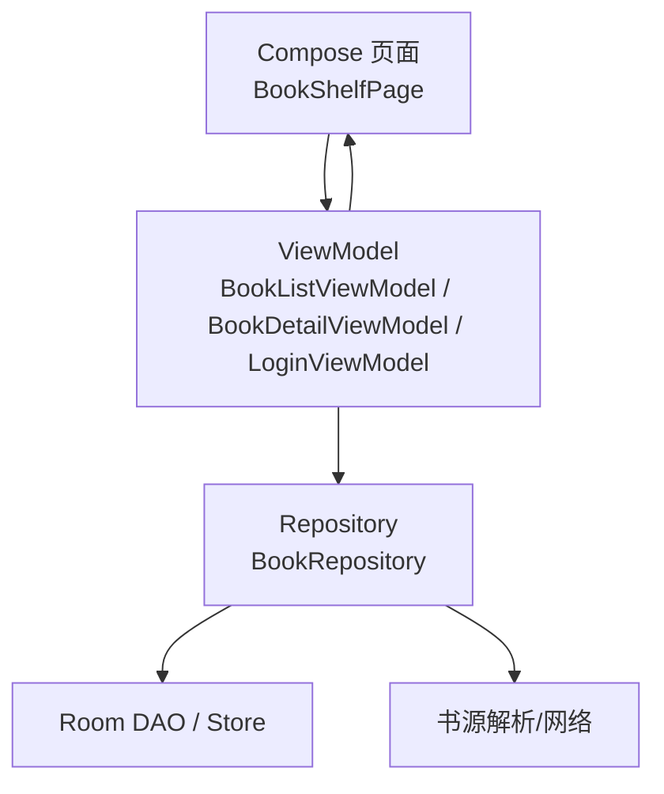
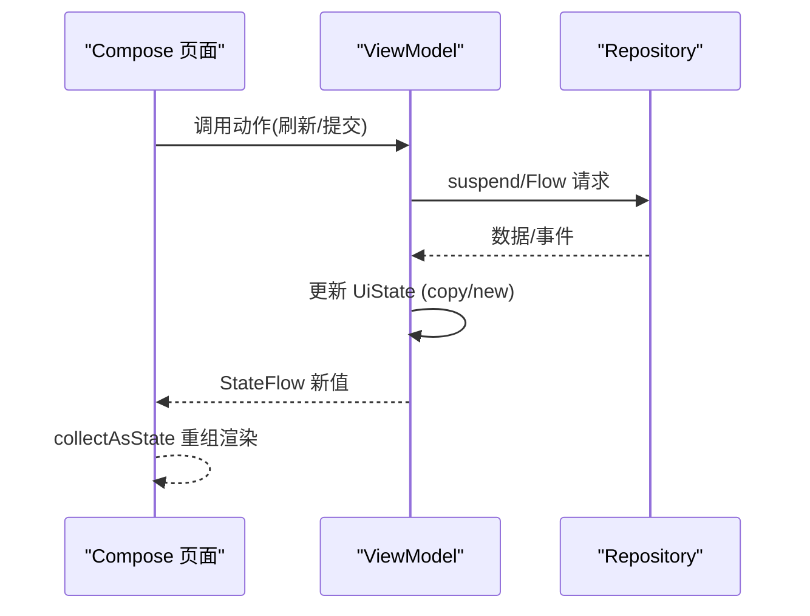
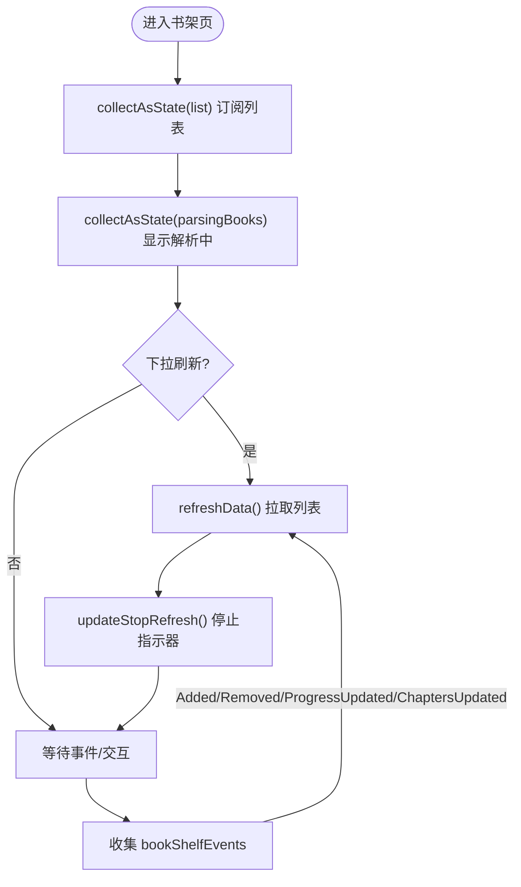
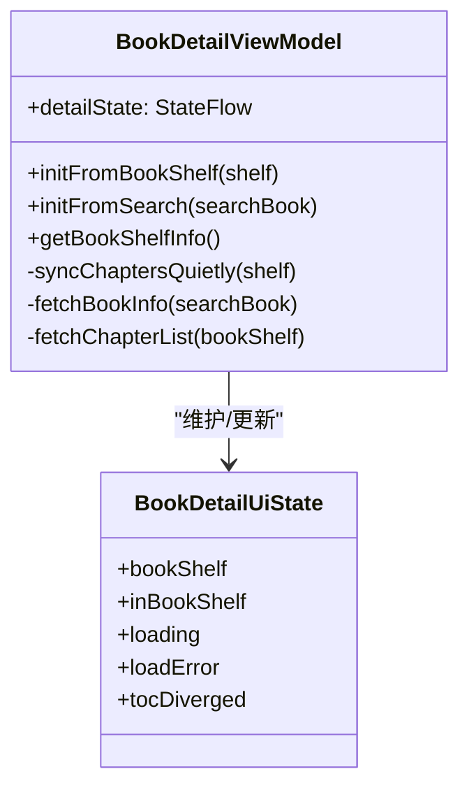
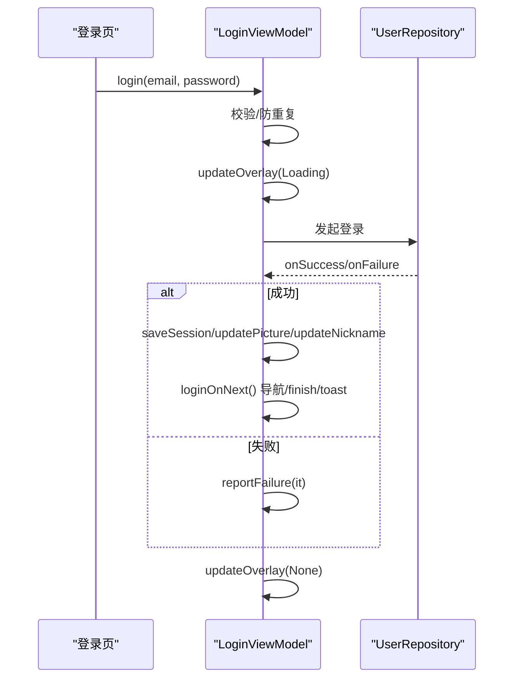
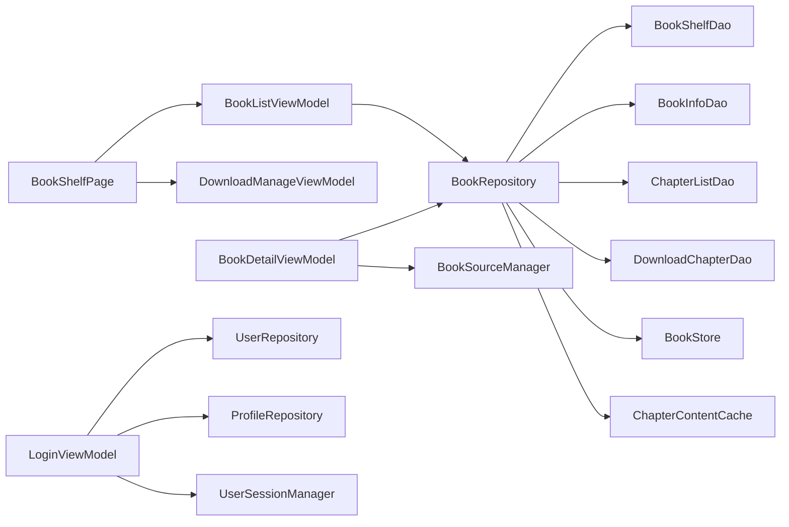

# 状态管理模式

<cite>
**本文引用的文件**   
- [BookListViewModel.kt](file://module_book/src/main/java/com/ebook/book/mvvm/viewmodel/BookListViewModel.kt)
- [BookShelfPage.kt](file://module_book/src/main/java/com/ebook/book/page/BookShelfPage.kt)
- [BookDetailViewModel.kt](file://module_book/src/main/java/com/ebook/book/mvvm/viewmodel/BookDetailViewModel.kt)
- [LoginViewModel.kt](file://module_login/src/main/java/com/ebook/login/mvvm/viewmodel/LoginViewModel.kt)
- [BookRepository.kt](file://lib_book_common/src/main/java/com/ebook/common/repository/BookRepository.kt)
- [LibraryViewModelTest.kt](file://module_find/src/test/java/com/ebook/find/mvvm/viewmodel/LibraryViewModelTest.kt)
</cite>

## 目录
1. [简介](#简介)
2. [项目结构](#项目结构)
3. [核心组件](#核心组件)
4. [架构总览](#架构总览)
5. [详细组件分析](#详细组件分析)
6. [依赖关系分析](#依赖关系分析)
7. [性能与优化](#性能与优化)
8. [故障排查指南](#故障排查指南)
9. [结论](#结论)
10. [附录：常见场景示例](#附录常见场景示例)

## 简介
本文基于仓库中实际的 ViewModel、Repository 与 Compose 页面实现，总结并沉淀一套可复用的 Compose 状态管理模式。重点覆盖：
- StateFlow 在 Compose 中的订阅（collectAsState）与性能要点
- 状态提升（父子组件间传递与事件冒泡）与数据流设计
- 复杂状态管理：多状态组合、派生状态、异步处理
- 错误状态统一处理：网络错误、本地错误、用户错误的收敛策略
- 典型场景：列表、表单、分页的状态组织
- 持久化同步：SharedPreferences、Room 到 UI 的桥接
- 调试与监控：如何定位状态问题

本说明以代码为事实源，避免空泛描述；每个关键实践均对应仓库中的实际实现位置，便于读者对照查阅。

## 项目结构
- 业务模块按功能划分：module_book（书架/阅读）、module_find（书城/搜索）、module_me（个人中心）、module_login（登录注册）等
- 共享层 lib_book_common 提供领域仓库 BookRepository、通用基类与工具
- ViewModel 位于各模块 mvvm/viewmodel 包下，使用 Hilt 注入；Compose 页面位于 page 包或 Activity 内
- 数据通过 Repository 暴露 Flow/StateFlow，ViewModel 负责聚合、转换与命令通道；UI 用 collectAsState 订阅

**图表来源**
- [BookShelfPage.kt:78-104](file://module_book/src/main/java/com/ebook/book/page/BookShelfPage.kt#L78-L104)
- [BookListViewModel.kt:28-67](file://module_book/src/main/java/com/ebook/book/mvvm/viewmodel/BookListViewModel.kt#L28-L67)
- [BookDetailViewModel.kt:52-67](file://module_book/src/main/java/com/ebook/book/mvvm/viewmodel/BookDetailViewModel.kt#L52-L67)
- [BookRepository.kt:51-77](file://lib_book_common/src/main/java/com/ebook/common/repository/BookRepository.kt#L51-L77)

**章节来源**
- [BookShelfPage.kt:78-104](file://module_book/src/main/java/com/ebook/book/page/BookShelfPage.kt#L78-L104)
- [BookListViewModel.kt:28-67](file://module_book/src/main/java/com/ebook/book/mvvm/viewmodel/BookListViewModel.kt#L28-L67)
- [BookDetailViewModel.kt:52-67](file://module_book/src/main/java/com/ebook/book/mvvm/viewmodel/BookDetailViewModel.kt#L52-L67)
- [BookRepository.kt:51-77](file://lib_book_common/src/main/java/com/ebook/common/repository/BookRepository.kt#L51-L77)

## 核心组件
- ViewModel 作为状态所有者：集中封装 UI 状态（StateFlow/data class），对外暴露不可变视图状态与变更方法
- Repository 作为数据源与事件总线：暴露 Flow/SharedFlow，统一管理网络、数据库、缓存与跨模块事件
- Compose 页面仅消费状态：通过 collectAsState 订阅，不持有业务逻辑；事件通过回调或命令通道上报 ViewModel

关键点：
- 列表页通过 BaseRefreshViewModel 抽象刷新流程，配合 MvvmBinder 绑定刷新信号
- 详情页将分散字段收敛为单一 UiState（data class），避免普通字段无法触发重组的问题
- 登录页采用一次性命令通道（loading/finish/toast/navigate）由基类统一消费

**章节来源**
- [BookListViewModel.kt:16-67](file://module_book/src/main/java/com/ebook/book/mvvm/viewmodel/BookListViewModel.kt#L16-L67)
- [BookDetailViewModel.kt:25-67](file://module_book/src/main/java/com/ebook/book/mvvm/viewmodel/BookDetailViewModel.kt#L25-L67)
- [LoginViewModel.kt:22-73](file://module_login/src/main/java/com/ebook/login/mvvm/viewmodel/LoginViewModel.kt#L22-L73)

## 架构总览
MVVM + Flow 驱动 Compose：
- UI 层：Composable 通过 hiltViewModel() 获取 VM，collectAsState 订阅 StateFlow
- 状态层：ViewModel 维护 UiState，合并多个数据源、处理错误与加载态
- 数据层：Repository 暴露 Flow/SharedFlow，封装 Room、网络、缓存与事件
- 事件流：SharedFlow 用于一次性事件（如书架变化、通知），StateFlow 用于持续状态

**图表来源**
- [BookShelfPage.kt:82-104](file://module_book/src/main/java/com/ebook/book/page/BookShelfPage.kt#L82-L104)
- [BookListViewModel.kt:36-67](file://module_book/src/main/java/com/ebook/book/mvvm/viewmodel/BookListViewModel.kt#L36-L67)
- [BookRepository.kt:75-100](file://lib_book_common/src/main/java/com/ebook/common/repository/BookRepository.kt#L75-L100)

## 详细组件分析

### 列表状态：书架页（BookListViewModel + BookShelfPage）
- 列表数据：BaseRefreshViewModel<BookShelfEntity, BookRepository> 暴露 list Flow，页面 collectAsState 订阅
- 导入占位：parsingBooks 是进程级协调器的 StateFlow，显示“解析中”条目
- 事件驱动刷新：收集 BookRepository.bookShelfEvents（Added/Removed/ProgressUpdated/ChaptersUpdated）触发 refreshData
- 刷新生命周期：MvvmBinder.bindRefresh 绑定刷新信号，LaunchedEffect 触发首次加载

**图表来源**
- [BookShelfPage.kt:82-104](file://module_book/src/main/java/com/ebook/book/page/BookShelfPage.kt#L82-L104)
- [BookListViewModel.kt:36-67](file://module_book/src/main/java/com/ebook/book/mvvm/viewmodel/BookListViewModel.kt#L36-L67)

**章节来源**
- [BookShelfPage.kt:78-104](file://module_book/src/main/java/com/ebook/book/page/BookShelfPage.kt#L78-L104)
- [BookListViewModel.kt:16-67](file://module_book/src/main/java/com/ebook/book/mvvm/viewmodel/BookListViewModel.kt#L16-L67)

### 详情状态：书籍详情页（BookDetailViewModel）
- 状态收敛：BookDetailUiState 包含 bookShelf、inBookShelf、loading、loadError、tocDiverged，避免多字段不同步
- 事件同步：init 中收集书架事件，自动修正 inBookShelf 与关闭详情页
- 静默重抓：syncChaptersQuietly 仅在追加成功提示条数，分叉时设置 tocDiverged 供 UI 展示
- 搜索入口：先展示基本信息，再拉详情；失败置 loadError，不清空已有实体，保证已读路径不断链

**图表来源**
- [BookDetailViewModel.kt:39-67](file://module_book/src/main/java/com/ebook/book/mvvm/viewmodel/BookDetailViewModel.kt#L39-L67)
- [BookDetailViewModel.kt:113-154](file://module_book/src/main/java/com/ebook/book/mvvm/viewmodel/BookDetailViewModel.kt#L113-L154)
- [BookDetailViewModel.kt:156-209](file://module_book/src/main/java/com/ebook/book/mvvm/viewmodel/BookDetailViewModel.kt#L156-L209)

**章节来源**
- [BookDetailViewModel.kt:25-67](file://module_book/src/main/java/com/ebook/book/mvvm/viewmodel/BookDetailViewModel.kt#L25-L67)
- [BookDetailViewModel.kt:113-154](file://module_book/src/main/java/com/ebook/book/mvvm/viewmodel/BookDetailViewModel.kt#L113-L154)
- [BookDetailViewModel.kt:156-209](file://module_book/src/main/java/com/ebook/book/mvvm/viewmodel/BookDetailViewModel.kt#L156-L209)

### 表单状态：登录页（LoginViewModel）
- 防重复提交：isLoggingIn 标记，避免并发登录
- 输入校验：邮箱/密码为空时直接 sendToast
- 会话建立：成功后保存会话、更新资料、导航回原目标页
- 命令通道：updateOverlay/ sendFinish/sendToast 由基类统一消费，页面无需手动控制 UI 细节

**图表来源**
- [LoginViewModel.kt:45-73](file://module_login/src/main/java/com/ebook/login/mvvm/viewmodel/LoginViewModel.kt#L45-L73)
- [LoginViewModel.kt:88-106](file://module_login/src/main/java/com/ebook/login/mvvm/viewmodel/LoginViewModel.kt#L88-L106)

**章节来源**
- [LoginViewModel.kt:22-73](file://module_login/src/main/java/com/ebook/login/mvvm/viewmodel/LoginViewModel.kt#L22-L73)
- [LoginViewModel.kt:88-106](file://module_login/src/main/java/com/ebook/login/mvvm/viewmodel/LoginViewModel.kt#L88-L106)

### 复杂状态管理：多状态组合、派生、异步
- 多状态组合：BookDetailUiState 将加载、错误、数据、分支提示组合为一个不可变快照，减少状态漂移
- 派生状态：inBookShelf 由书架事件与当前实体推导；searchBook.add 作为初始态
- 异步处理：所有 I/O 在 viewModelScope.launch 中执行，异常统一记录并通过 sendToast/reportFailure 上报
- 事件驱动：BookRepository.bookShelfEvents 使用 SharedFlow 推送一次性的书架变更事件，VM 在 init 中收集，避免页面重建重复收集

**章节来源**
- [BookDetailViewModel.kt:61-100](file://module_book/src/main/java/com/ebook/book/mvvm/viewmodel/BookDetailViewModel.kt#L61-L100)
- [BookRepository.kt:75-77](file://lib_book_common/src/main/java/com/ebook/common/repository/BookRepository.kt#L75-L77)

### 错误状态处理：统一收敛
- 网络错误：Repository/VM 捕获异常后，设置 loadError 或通过 reportFailure 上报，避免吞错导致页面永远 loading
- 本地错误：导入/删除失败时 sendToast 提示用户，保持 UI 可恢复
- 用户错误：表单校验失败立即反馈，阻止无效请求
- 特殊错误：书源失效抛 BookSourceNotFoundException，经 reportFailure 提示并返回 null，调用方据此置错误态

**章节来源**
- [BookDetailViewModel.kt:248-297](file://module_book/src/main/java/com/ebook/book/mvvm/viewmodel/BookDetailViewModel.kt#L248-L297)
- [LoginViewModel.kt:55-73](file://module_login/src/main/java/com/ebook/login/mvvm/viewmodel/LoginViewModel.kt#L55-L73)

### 状态持久化：SharedPreferences、Room 到 UI
- Room：BookRepository.observeBookShelf() 返回 Flow<List<BookShelfEntity>>，UI 直接订阅，DB 变更即刷新
- SharedPreferences：会话信息（头像/昵称）由 ProfileRepository 维护内存 StateFlow 镜像，清会话由 UserSessionManager 集中清理
- 同步策略：写路径先落库/SP，再通过 Flow/StateFlow 推送到 UI；读路径优先从内存快照提升首帧体验，后台静默重刷

**章节来源**
- [BookRepository.kt:87-100](file://lib_book_common/src/main/java/com/ebook/common/repository/BookRepository.kt#L87-L100)
- [LoginViewModel.kt:60-67](file://module_login/src/main/java/com/ebook/login/mvvm/viewmodel/LoginViewModel.kt#L60-L67)

## 依赖关系分析
- ViewModel 依赖 Repository：BookListViewModel/BookDetailViewModel 依赖 BookRepository；LoginViewModel 依赖 UserRepository
- Repository 依赖 DAO/Store/Network：BookRepository 组合 BookShelfDao、BookInfoDao、ChapterListDao、DownloadChapterDao、BookStore、ChapterContentCache、BookSourceManager
- Compose 页面依赖 ViewModel：通过 hiltViewModel() 注入，collectAsState 订阅

**图表来源**
- [BookShelfPage.kt:78-84](file://module_book/src/main/java/com/ebook/book/page/BookShelfPage.kt#L78-L84)
- [BookListViewModel.kt:28-31](file://module_book/src/main/java/com/ebook/book/mvvm/viewmodel/BookListViewModel.kt#L28-L31)
- [BookDetailViewModel.kt:52-56](file://module_book/src/main/java/com/ebook/book/mvvm/viewmodel/BookDetailViewModel.kt#L52-L56)
- [LoginViewModel.kt:30-34](file://module_login/src/main/java/com/ebook/login/mvvm/viewmodel/LoginViewModel.kt#L30-L34)
- [BookRepository.kt:52-74](file://lib_book_common/src/main/java/com/ebook/common/repository/BookRepository.kt#L52-L74)

**章节来源**
- [BookShelfPage.kt:78-84](file://module_book/src/main/java/com/ebook/book/page/BookShelfPage.kt#L78-L84)
- [BookListViewModel.kt:28-31](file://module_book/src/main/java/com/ebook/book/mvvm/viewmodel/BookListViewModel.kt#L28-L31)
- [BookDetailViewModel.kt:52-56](file://module_book/src/main/java/com/ebook/book/mvvm/viewmodel/BookDetailViewModel.kt#L52-L56)
- [LoginViewModel.kt:30-34](file://module_login/src/main/java/com/ebook/login/mvvm/viewmodel/LoginViewModel.kt#L30-L34)
- [BookRepository.kt:52-74](file://lib_book_common/src/main/java/com/ebook/common/repository/BookRepository.kt#L52-L74)

## 性能与优化
- collectAsState 订阅：仅在 state 值改变时重组，避免不必要的 recomposition
- 稳定 key：LazyColumn items(key=...) 使用稳定唯一键（如 noteUrl/id），防止锚点错位与重复渲染
- 状态不可变：使用 data class copy 更新 StateFlow，确保对象引用变化触发下游重组
- 事件去抖与限频：章节同步结果根据 Throttled/UpToDate 等状态控制 UI 行为，避免频繁刷新
- 首帧优化：详情页先本地填充再静默检查，避免白屏转圈
- 单例/作用域：Repository 为 Singleton，ViewModel 随页面生命周期；协程在 viewModelScope 中运行，避免泄漏

**章节来源**
- [BookShelfPage.kt:223-244](file://module_book/src/main/java/com/ebook/book/page/BookShelfPage.kt#L223-L244)
- [BookDetailViewModel.kt:113-116](file://module_book/src/main/java/com/ebook/book/mvvm/viewmodel/BookDetailViewModel.kt#L113-L116)
- [BookListViewModel.kt:54-67](file://module_book/src/main/java/com/ebook/book/mvvm/viewmodel/BookListViewModel.kt#L54-L67)

## 故障排查指南
- 页面不刷新：检查是否使用 StateFlow 而非普通字段；确认每次更新都产生新引用（data class copy）
- 列表项错位：检查 LazyColumn items 的 key 是否稳定且唯一
- 永远 loading：检查异常分支是否正确设置 loadError 或 finish；确认 finally 中重置 overlay/loading
- 事件丢失：确保在 VM init 中收集 SharedFlow，避免页面重建重复收集
- 书源失效：查看 BookSourceNotFoundException 处理链路，确认 reportFailure 与 UI 错误态设置

**章节来源**
- [BookDetailViewModel.kt:168-209](file://module_book/src/main/java/com/ebook/book/mvvm/viewmodel/BookDetailViewModel.kt#L168-L209)
- [BookDetailViewModel.kt:248-297](file://module_book/src/main/java/com/ebook/book/mvvm/viewmodel/BookDetailViewModel.kt#L248-L297)
- [BookListViewModel.kt:36-67](file://module_book/src/main/java/com/ebook/book/mvvm/viewmodel/BookListViewModel.kt#L36-L67)

## 结论
本项目采用 MVVM + Flow 的状态管理模式，以 ViewModel 为中心聚合状态、处理异步与错误，Repository 暴露响应式数据源，Compose 页面通过 collectAsState 订阅并只关注渲染。该模式具备以下优势：
- 状态集中、可预测：UiState 不可变，更新路径清晰
- 事件与状态分离：SharedFlow 处理一次性事件，StateFlow 维持持续状态
- 可测试性高：单元测试通过替换依赖验证状态流转
- 可扩展性强：新增状态/事件只需扩展 UiState 与 Repository 接口

建议在新功能中遵循：
- 使用 data class 收敛状态，避免散落字段
- 所有 I/O 放在 viewModelScope，异常统一上报
- 列表使用稳定 key，避免重排问题
- 事件驱动刷新优于轮询，减少冗余请求

## 附录：常见场景示例
- 列表状态：书架页使用 BaseRefreshViewModel + Flow 列表 + SharedFlow 事件驱动刷新
- 表单状态：登录页使用输入校验 + 防重复提交 + 命令通道（loading/toast/finish）
- 分页状态：通过 BaseRefreshViewModel 的 loadMore 与 hasMore 标志控制加载更多
- 状态持久化：Room Flow 直连 UI，SP/内存 StateFlow 镜像用户资料，清会话集中处理
- 错误处理：网络/本地/用户错误分别设置 loadError 或 sendToast，避免吞错与永久 loading

**章节来源**
- [BookListViewModel.kt:16-67](file://module_book/src/main/java/com/ebook/book/mvvm/viewmodel/BookListViewModel.kt#L16-L67)
- [LoginViewModel.kt:45-73](file://module_login/src/main/java/com/ebook/login/mvvm/viewmodel/LoginViewModel.kt#L45-L73)
- [BookRepository.kt:87-100](file://lib_book_common/src/main/java/com/ebook/common/repository/BookRepository.kt#L87-L100)
- [LibraryViewModelTest.kt:39-66](file://module_find/src/test/java/com/ebook/find/mvvm/viewmodel/LibraryViewModelTest.kt#L39-L66)