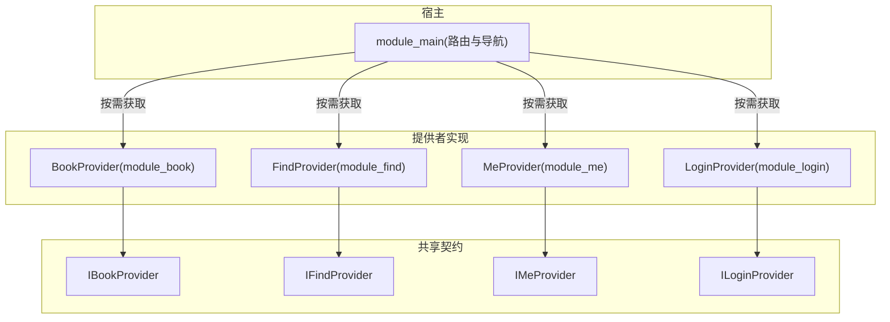
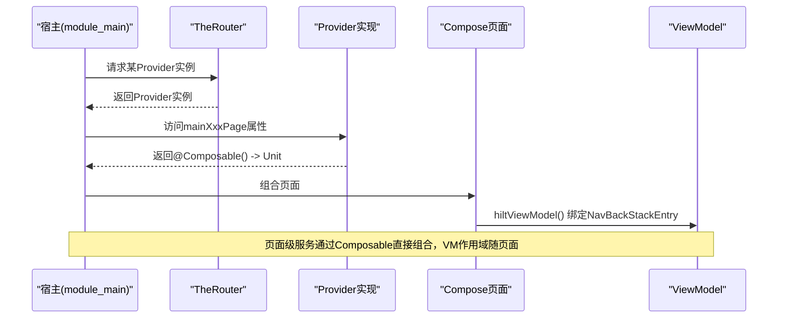
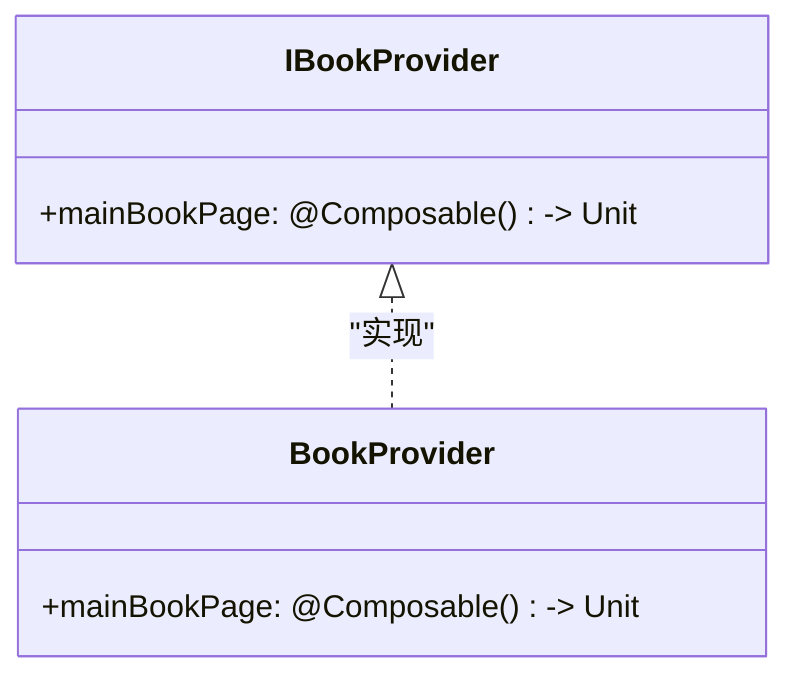
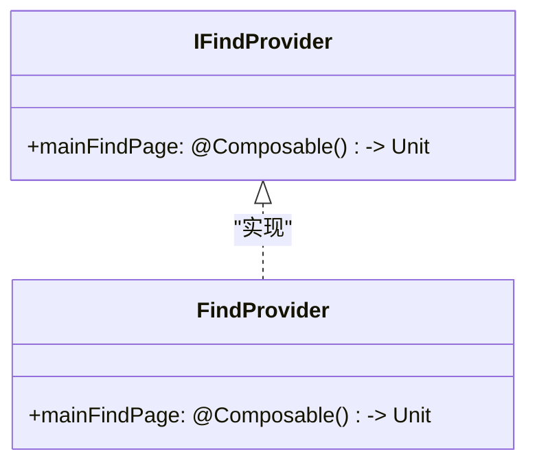
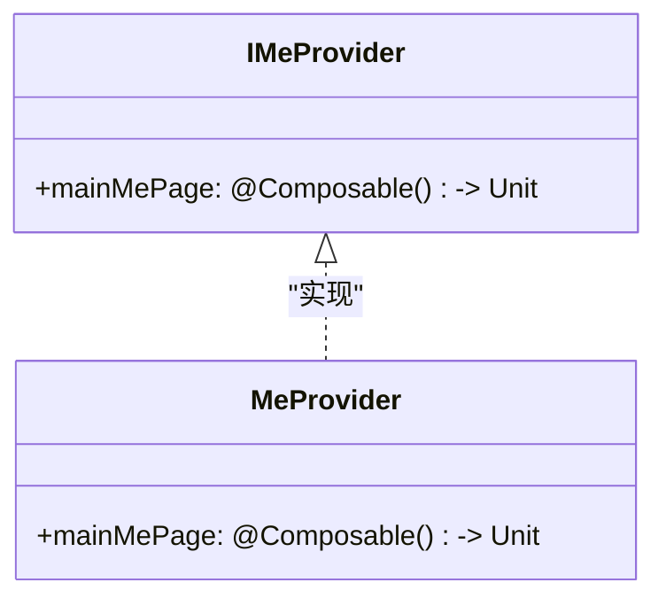
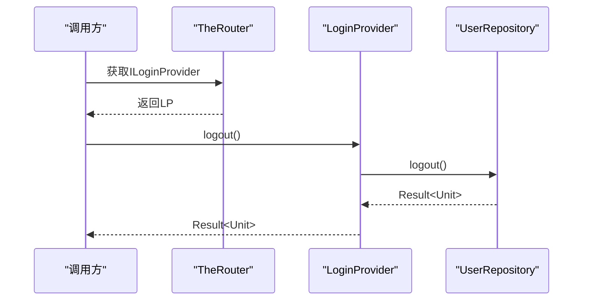
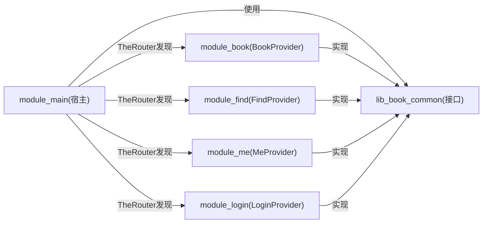

# Provider接口规范

<cite>
**本文引用的文件**
- [IBookProvider.kt](file://lib_book_common/src/main/java/com/ebook/common/provider/IBookProvider.kt)
- [IFindProvider.kt](file://lib_book_common/src/main/java/com/ebook/common/provider/IFindProvider.kt)
- [ILoginProvider.kt](file://lib_book_common/src/main/java/com/ebook/common/provider/ILoginProvider.kt)
- [IMeProvider.kt](file://lib_book_common/src/main/java/com/ebook/common/provider/IMeProvider.kt)
- [BookProvider.kt](file://module_book/src/main/java/com/ebook/book/provider/BookProvider.kt)
- [FindProvider.kt](file://module_find/src/main/java/com/ebook/find/provider/FindProvider.kt)
- [MeProvider.kt](file://module_me/src/main/java/com/ebook/me/provider/MeProvider.kt)
- [LoginProvider.kt](file://module_login/src/main/java/com/ebook/login/provider/LoginProvider.kt)
</cite>

## 目录
1. [引言](#引言)
2. [项目结构](#项目结构)
3. [核心组件](#核心组件)
4. [架构总览](#架构总览)
5. [详细组件分析](#详细组件分析)
6. [依赖关系分析](#依赖关系分析)
7. [性能与可维护性](#性能与可维护性)
8. [故障排查指南](#故障排查指南)
9. [结论](#结论)

## 引言
本规范定义跨模块通信的 Provider 接口契约与实现方式，聚焦以下目标：
- 明确 IBookProvider、IFindProvider、ILoginProvider、IMeProvider 的职责边界与设计模式。
- 说明 @Composable 返回模式的收益（相比 Fragment），以及与 ViewModel 作用域绑定的关系。
- 说明 @ServiceProvider 注解与 TheRouter SPI 注册机制的使用方式。
- 给出页面级服务暴露与服务级能力暴露的实现示例与最佳实践。
- 解释独立运行模式下空实现/降级策略（以 module_login 的 LogoutProvider 为例）。
- 阐述接口版本管理与向后兼容性保证机制。

## 项目结构
跨模块通信通过“接口定义在共享库 + 具体实现在功能模块 + 宿主按路由发现”的方式解耦：
- 接口定义集中在 lib_book_common 的 provider 包中，作为跨模块契约。
- 各业务模块在各自 provider 包内提供实现，并通过 @ServiceProvider 暴露给 TheRouter。
- 宿主（如 module_main）通过 TheRouter 获取 Provider 实例并组合其 Compose 页面。

图表来源
- [IBookProvider.kt:1-14](file://lib_book_common/src/main/java/com/ebook/common/provider/IBookProvider.kt#L1-L14)
- [IFindProvider.kt:1-14](file://lib_book_common/src/main/java/com/ebook/common/provider/IFindProvider.kt#L1-L14)
- [IMeProvider.kt:1-14](file://lib_book_common/src/main/java/com/ebook/common/provider/IMeProvider.kt#L1-L14)
- [ILoginProvider.kt:1-20](file://lib_book_common/src/main/java/com/ebook/common/provider/ILoginProvider.kt#L1-L20)
- [BookProvider.kt:1-16](file://module_book/src/main/java/com/ebook/book/provider/BookProvider.kt#L1-L16)
- [FindProvider.kt:1-20](file://module_find/src/main/java/com/ebook/find/provider/FindProvider.kt#L1-L20)
- [MeProvider.kt:1-21](file://module_me/src/main/java/com/ebook/me/provider/MeProvider.kt#L1-L21)
- [LoginProvider.kt:1-36](file://module_login/src/main/java/com/ebook/login/provider/LoginProvider.kt#L1-L36)

章节来源
- [IBookProvider.kt:1-14](file://lib_book_common/src/main/java/com/ebook/common/provider/IBookProvider.kt#L1-L14)
- [IFindProvider.kt:1-14](file://lib_book_common/src/main/java/com/ebook/common/provider/IFindProvider.kt#L1-L14)
- [IMeProvider.kt:1-14](file://lib_book_common/src/main/java/com/ebook/common/provider/IMeProvider.kt#L1-L14)
- [ILoginProvider.kt:1-20](file://lib_book_common/src/main/java/com/ebook/common/provider/ILoginProvider.kt#L1-L20)
- [BookProvider.kt:1-16](file://module_book/src/main/java/com/ebook/book/provider/BookProvider.kt#L1-L16)
- [FindProvider.kt:1-20](file://module_find/src/main/java/com/ebook/find/provider/FindProvider.kt#L1-L20)
- [MeProvider.kt:1-21](file://module_me/src/main/java/com/ebook/me/provider/MeProvider.kt#L1-L21)
- [LoginProvider.kt:1-36](file://module_login/src/main/java/com/ebook/login/provider/LoginProvider.kt#L1-L36)

## 核心组件
- IBookProvider：书架模块对外暴露的页面级服务，返回主书架 Compose 页面。
- IFindProvider：书城模块对外暴露的页面级服务，返回书城首页 Compose 页面。
- IMeProvider：个人中心模块对外暴露的页面级服务，返回“我的”页 Compose 页面。
- ILoginProvider：登录域对外暴露的服务级能力，当前仅暴露服务端登出能力；本地会话清理由统一入口负责。

职责划分原则
- 页面级服务：面向宿主导航，返回 @Composable() -> Unit，便于 NavHost 直接组合。
- 服务级能力：面向跨模块调用，暴露方法或状态，供其他模块在业务逻辑中使用。

章节来源
- [IBookProvider.kt:1-14](file://lib_book_common/src/main/java/com/ebook/common/provider/IBookProvider.kt#L1-L14)
- [IFindProvider.kt:1-14](file://lib_book_common/src/main/java/com/ebook/common/provider/IFindProvider.kt#L1-L14)
- [IMeProvider.kt:1-14](file://lib_book_common/src/main/java/com/ebook/common/provider/IMeProvider.kt#L1-L14)
- [ILoginProvider.kt:1-20](file://lib_book_common/src/main/java/com/ebook/common/provider/ILoginProvider.kt#L1-L20)

## 架构总览
Provider 体系采用“SPI + 路由发现”的模式：
- 接口在共享层声明，不感知任何具体模块。
- 各模块在自身 provider 包下提供实现，并使用 @ServiceProvider 标注。
- 宿主通过 TheRouter 在运行时解析并获取 Provider 实例，再组合页面或调用服务方法。

图表来源
- [BookProvider.kt:1-16](file://module_book/src/main/java/com/ebook/book/provider/BookProvider.kt#L1-L16)
- [FindProvider.kt:1-20](file://module_find/src/main/java/com/ebook/find/provider/FindProvider.kt#L1-L20)
- [MeProvider.kt:1-21](file://module_me/src/main/java/com/ebook/me/provider/MeProvider.kt#L1-L21)
- [IBookProvider.kt:1-14](file://lib_book_common/src/main/java/com/ebook/common/provider/IBookProvider.kt#L1-L14)
- [IFindProvider.kt:1-14](file://lib_book_common/src/main/java/com/ebook/common/provider/IFindProvider.kt#L1-L14)
- [IMeProvider.kt:1-14](file://lib_book_common/src/main/java/com/ebook/common/provider/IMeProvider.kt#L1-L14)

## 详细组件分析

### IBookProvider / BookProvider
- 职责：暴露书架主页面。
- 设计要点：
  - 以 @Composable() -> Unit 暴露页面，避免 Fragment 引入，减少生命周期管理复杂度。
  - 页面 ViewModel 由宿主侧 hiltViewModel 创建，作用域绑定到调用处的 NavBackStackEntry，确保页面销毁时 VM 自动释放。
- 实现方式：BookProvider 使用 @ServiceProvider 注册，使 TheRouter 能发现并创建实例。

图表来源
- [IBookProvider.kt:1-14](file://lib_book_common/src/main/java/com/ebook/common/provider/IBookProvider.kt#L1-L14)
- [BookProvider.kt:1-16](file://module_book/src/main/java/com/ebook/book/provider/BookProvider.kt#L1-L16)

章节来源
- [IBookProvider.kt:1-14](file://lib_book_common/src/main/java/com/ebook/common/provider/IBookProvider.kt#L1-L14)
- [BookProvider.kt:1-16](file://module_book/src/main/java/com/ebook/book/provider/BookProvider.kt#L1-L16)

### IFindProvider / FindProvider
- 职责：暴露书城主页。
- 设计要点：同 IBookProvider，强调页面级服务通过 Compose 直接组合。
- 实现方式：FindProvider 使用 @ServiceProvider 注册。

图表来源
- [IFindProvider.kt:1-14](file://lib_book_common/src/main/java/com/ebook/common/provider/IFindProvider.kt#L1-L14)
- [FindProvider.kt:1-20](file://module_find/src/main/java/com/ebook/find/provider/FindProvider.kt#L1-L20)

章节来源
- [IFindProvider.kt:1-14](file://lib_book_common/src/main/java/com/ebook/common/provider/IFindProvider.kt#L1-L14)
- [FindProvider.kt:1-20](file://module_find/src/main/java/com/ebook/find/provider/FindProvider.kt#L1-L20)

### IMeProvider / MeProvider
- 职责：暴露“我的”主页。
- 设计要点：与上述页面级 Provider 一致。
- 实现方式：MeProvider 使用 @ServiceProvider 注册。

图表来源
- [IMeProvider.kt:1-14](file://lib_book_common/src/main/java/com/ebook/common/provider/IMeProvider.kt#L1-L14)
- [MeProvider.kt:1-21](file://module_me/src/main/java/com/ebook/me/provider/MeProvider.kt#L1-L21)

章节来源
- [IMeProvider.kt:1-14](file://lib_book_common/src/main/java/com/ebook/common/provider/IMeProvider.kt#L1-L14)
- [MeProvider.kt:1-21](file://module_me/src/main/java/com/ebook/me/provider/MeProvider.kt#L1-L21)

### ILoginProvider / LoginProvider
- 职责：登录域的服务级能力，当前暴露服务端登出能力。
- 设计要点：
  - 仅暴露服务端侧登出，本地会话清理由统一入口负责，避免重复与不一致。
  - 独立运行（isModule=true）时，module_login 不在依赖图里，调用方需允许空实现或降级处理。
- 实现方式：LoginProvider 使用 @ServiceProvider 注册，并通过 Hilt EntryPointAccessors 桥接仓库实例。

图表来源
- [ILoginProvider.kt:1-20](file://lib_book_common/src/main/java/com/ebook/common/provider/ILoginProvider.kt#L1-L20)
- [LoginProvider.kt:1-36](file://module_login/src/main/java/com/ebook/login/provider/LoginProvider.kt#L1-L36)

章节来源
- [ILoginProvider.kt:1-20](file://lib_book_common/src/main/java/com/ebook/common/provider/ILoginProvider.kt#L1-L20)
- [LoginProvider.kt:1-36](file://module_login/src/main/java/com/ebook/login/provider/LoginProvider.kt#L1-L36)

### 页面级服务 vs 服务级能力
- 页面级服务：用于宿主导航，返回 Compose 页面，便于无 Fragment 的直接组合。
- 服务级能力：用于跨模块调用，暴露方法或状态，如登录域的服务端登出。

对比优势（@Composable 返回模式）
- 更轻量的生命周期管理：无需 Fragment 容器，页面由 Compose 组合树管理。
- 更自然的 ViewModel 绑定：hiltViewModel 默认绑定到调用处的 NavBackStackEntry，页面销毁即释放。
- 更好的可测试性与组合性：函数式返回值便于单元测试与组合复用。

章节来源
- [IBookProvider.kt:1-14](file://lib_book_common/src/main/java/com/ebook/common/provider/IBookProvider.kt#L1-L14)
- [IFindProvider.kt:1-14](file://lib_book_common/src/main/java/com/ebook/common/provider/IFindProvider.kt#L1-L14)
- [IMeProvider.kt:1-14](file://lib_book_common/src/main/java/com/ebook/common/provider/IMeProvider.kt#L1-L14)

## 依赖关系分析
- 接口层（lib_book_common）不依赖任何业务模块，保持契约稳定。
- 实现层（各 module_*）依赖接口，并通过 @ServiceProvider 注册。
- 宿主（module_main）依赖接口，并通过 TheRouter 动态发现实现。

图表来源
- [IBookProvider.kt:1-14](file://lib_book_common/src/main/java/com/ebook/common/provider/IBookProvider.kt#L1-L14)
- [IFindProvider.kt:1-14](file://lib_book_common/src/main/java/com/ebook/common/provider/IFindProvider.kt#L1-L14)
- [IMeProvider.kt:1-14](file://lib_book_common/src/main/java/com/ebook/common/provider/IMeProvider.kt#L1-L14)
- [ILoginProvider.kt:1-20](file://lib_book_common/src/main/java/com/ebook/common/provider/ILoginProvider.kt#L1-L20)
- [BookProvider.kt:1-16](file://module_book/src/main/java/com/ebook/book/provider/BookProvider.kt#L1-L16)
- [FindProvider.kt:1-20](file://module_find/src/main/java/com/ebook/find/provider/FindProvider.kt#L1-L20)
- [MeProvider.kt:1-21](file://module_me/src/main/java/com/ebook/me/provider/MeProvider.kt#L1-L21)
- [LoginProvider.kt:1-36](file://module_login/src/main/java/com/ebook/login/provider/LoginProvider.kt#L1-L36)

章节来源
- [IBookProvider.kt:1-14](file://lib_book_common/src/main/java/com/ebook/common/provider/IBookProvider.kt#L1-L14)
- [IFindProvider.kt:1-14](file://lib_book_common/src/main/java/com/ebook/common/provider/IFindProvider.kt#L1-L14)
- [IMeProvider.kt:1-14](file://lib_book_common/src/main/java/com/ebook/common/provider/IMeProvider.kt#L1-L14)
- [ILoginProvider.kt:1-20](file://lib_book_common/src/main/java/com/ebook/common/provider/ILoginProvider.kt#L1-L20)
- [BookProvider.kt:1-16](file://module_book/src/main/java/com/ebook/book/provider/BookProvider.kt#L1-L16)
- [FindProvider.kt:1-20](file://module_find/src/main/java/com/ebook/find/provider/FindProvider.kt#L1-L20)
- [MeProvider.kt:1-21](file://module_me/src/main/java/com/ebook/me/provider/MeProvider.kt#L1-L21)
- [LoginProvider.kt:1-36](file://module_login/src/main/java/com/ebook/login/provider/LoginProvider.kt#L1-L36)

## 性能与可维护性
- 低耦合：接口与实现分离，新增页面或服务不影响宿主与其他模块。
- 可替换：通过 TheRouter 可替换实现，便于测试与多环境部署。
- 轻量组合：@Composable 返回模式降低生命周期与内存开销。
- 作用域清晰：ViewModel 绑定到页面作用域，避免内存泄漏。

[本节为通用指导，不直接分析具体文件]

## 故障排查指南
- 独立运行缺失 Provider：当 isModule=true 时，若依赖模块未参与编译，TheRouter 无法找到对应 Provider，调用方应做降级处理（例如跳过该能力或提供空实现）。
- 路由未生效：新增或修改 @Route/@ServiceProvider 后需重新构建，确保路由表更新。
- 网络异常：ILoginProvider.logout 返回 Result，调用方应处理失败分支并提示用户。

章节来源
- [ILoginProvider.kt:1-20](file://lib_book_common/src/main/java/com/ebook/common/provider/ILoginProvider.kt#L1-L20)
- [LoginProvider.kt:1-36](file://module_login/src/main/java/com/ebook/login/provider/LoginProvider.kt#L1-L36)

## 结论
本规范通过清晰的接口契约与 SPI 注册机制，实现了跨模块的低耦合通信：
- 页面级服务通过 @Composable 返回模式简化导航与生命周期管理。
- 服务级能力通过统一接口暴露，便于复用与扩展。
- TheRouter 与 @ServiceProvider 提供灵活的发现与装配能力。
- 独立运行模式下的降级策略保证了系统的健壮性。
- 接口版本管理遵循向后兼容原则，保障演进稳定性。

[本节为总结，不直接分析具体文件]