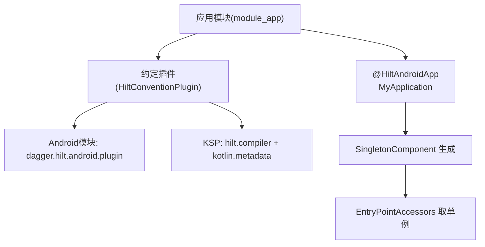
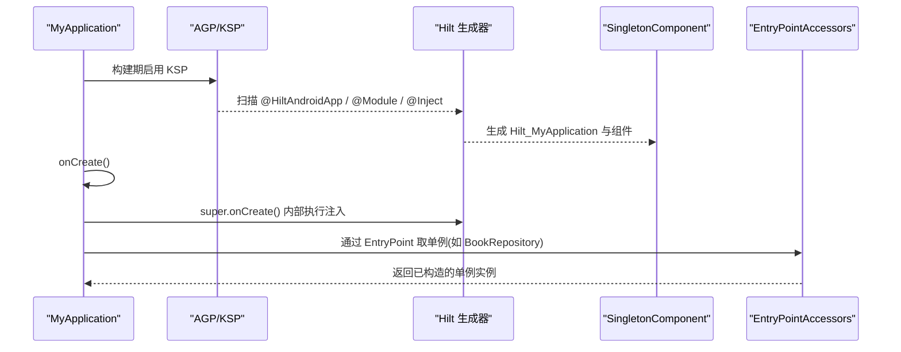
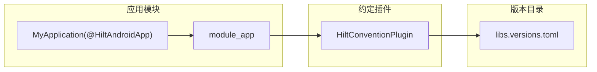

# Hilt基础配置

<cite>
**本文引用的文件**
- [HiltConventionPlugin.kt](file://build-logic/convention/src/main/kotlin/HiltConventionPlugin.kt)
- [libs.versions.toml](file://gradle/libs.versions.toml)
- [module_app/build.gradle.kts](file://module_app/build.gradle.kts)
- [MyApplication.kt](file://module_app/src/main/java/com/ebook/MyApplication.kt)
- [BookApplication.kt](file://lib_book_common/src/main/java/com/ebook/common/BookApplication.kt)
</cite>

## 目录
1. [简介](#简介)
2. [项目结构](#项目结构)
3. [核心组件](#核心组件)
4. [架构总览](#架构总览)
5. [详细组件分析](#详细组件分析)
6. [依赖关系分析](#依赖关系分析)
7. [性能与构建注意事项](#性能与构建注意事项)
8. [故障排查指南](#故障排查指南)
9. [结论](#结论)

## 简介
本文面向本项目的Hilt基础配置，聚焦应用级初始化、注解要求、Gradle插件与KSP配置、依赖版本管理、启动时机与生命周期、最佳实践以及验证方法。内容基于仓库中约定的构建脚本与应用入口实现，确保读者能准确落地并验证Hilt是否正确装配。

## 项目结构
本项目通过自定义约定插件统一管理Hilt的启用与依赖注入能力：
- build-logic 中的约定插件负责在Android模块中应用Hilt Android插件并声明运行时与编译期依赖；
- 根版本目录集中管理Hilt及其相关依赖的版本；
- 应用模块通过约定插件启用Hilt，并在Application上使用@HiltAndroidApp完成应用级图装配；
- 基类库提供应用基类以接入主题等全局能力，并通过EntryPoint从已生成的Hilt图中按需取用单例对象，避免在Application字段上直接eager注入。

图表来源
- [HiltConventionPlugin.kt:24-48](file://build-logic/convention/src/main/kotlin/HiltConventionPlugin.kt#L24-L48)
- [module_app/build.gradle.kts:3-8](file://module_app/build.gradle.kts#L3-L8)
- [MyApplication.kt:19-20](file://module_app/src/main/java/com/ebook/MyApplication.kt#L19-L20)

章节来源
- [HiltConventionPlugin.kt:24-48](file://build-logic/convention/src/main/kotlin/HiltConventionPlugin.kt#L24-L48)
- [module_app/build.gradle.kts:3-8](file://module_app/build.gradle.kts#L3-L8)

## 核心组件
- 约定插件：在Android模块上自动应用Hilt Android插件并添加KSP处理器；在JVM模块上仅添加Hilt Core依赖，便于非Android场景使用。
- 版本目录：统一声明Hilt、Dagger、KSP及Kotlin元数据版本，保证全仓一致性与可升级性。
- 应用入口：Application类标注@HiltAndroidApp，配合基类在onCreate中完成必要的进程门与主题装配，并通过EntryPoint按需获取单例，避免eager注入带来的跨进程风险。

章节来源
- [HiltConventionPlugin.kt:24-48](file://build-logic/convention/src/main/kotlin/HiltConventionPlugin.kt#L24-L48)
- [libs.versions.toml:39-42](file://gradle/libs.versions.toml#L39-L42)
- [libs.versions.toml:160-169](file://gradle/libs.versions.toml#L160-L169)
- [libs.versions.toml:221-224](file://gradle/libs.versions.toml#L221-L224)
- [MyApplication.kt:19-61](file://module_app/src/main/java/com/ebook/MyApplication.kt#L19-L61)

## 架构总览
下图展示了应用启动时Hilt的初始化时序：Gradle构建阶段启用KSP处理Hilt注解，运行阶段由@HiltAndroidApp触发生成Hilt_MyApplication并在其onCreate中完成SingletonComponent的创建与字段注入，随后业务代码通过EntryPointAccessors安全地取出所需单例。

图表来源
- [module_app/build.gradle.kts:3-8](file://module_app/build.gradle.kts#L3-L8)
- [HiltConventionPlugin.kt:24-48](file://build-logic/convention/src/main/kotlin/HiltConventionPlugin.kt#L24-L48)
- [MyApplication.kt:19-43](file://module_app/src/main/java/com/ebook/MyApplication.kt#L19-L43)

## 详细组件分析

### 约定插件：HiltConventionPlugin
职责
- 为所有引入该约定的模块统一启用KSP，并添加Hilt编译器与Kotlin元数据依赖；
- 对Android模块（com.android.base）自动应用dagger.hilt.android.plugin，并添加hilt-android依赖；
- 对JVM模块（org.jetbrains.kotlin.jvm）仅添加hilt-core依赖，满足非Android环境下的依赖注入需求。

关键点
- 使用withPlugin进行条件化启用，避免在不相关的模块引入无用依赖；
- 通过版本目录引用依赖，便于集中升级与一致性保障。

章节来源
- [HiltConventionPlugin.kt:24-48](file://build-logic/convention/src/main/kotlin/HiltConventionPlugin.kt#L24-L48)

### 应用模块：module_app
职责
- 通过约定插件xrn1997.hilt启用Hilt；
- 应用插件ksp，确保编译期注解处理生效；
- 定义应用信息、风味与混淆策略（与Hilt无直接耦合）。

要点
- 在plugins块中应用了xrn1997.hilt与ksp，使Hilt的注解处理与运行时依赖正确加入；
- 依赖项不包含Hilt库的直接声明，遵循“由约定插件统一管理”的原则。

章节来源
- [module_app/build.gradle.kts:3-8](file://module_app/build.gradle.kts#L3-L8)

### 应用入口：MyApplication 与 BookApplication
职责
- MyApplication：作为应用入口，标注@HiltAndroidApp，在onCreate中完成路由拦截与异步任务；通过EntryPointAccessors在需要时取用单例，避免eager注入；
- BookApplication：作为基类，屏蔽隔离进程的无关初始化，装配主题，并通过EntryPointAccessors将ThemeModeManager挂入共享位置。

生命周期与注入时机
- Application.onCreate中调用super.onCreate()会进入Hilt生成的初始化流程，完成字段注入与组件构建；
- 在super.onCreate之后才做业务初始化（如路由拦截），符合“先注入后业务”的要求；
- 隔离进程通过SandboxProcess.isInIsolatedProcess提前return，避免在无UI或受限环境中执行不必要的逻辑。

章节来源
- [MyApplication.kt:19-61](file://module_app/src/main/java/com/ebook/MyApplication.kt#L19-L61)
- [BookApplication.kt:17-59](file://lib_book_common/src/main/java/com/ebook/common/BookApplication.kt#L17-L59)

### Gradle构建与KSP配置
- KSP启用：通过约定插件在Android模块中应用com.google.devtools.ksp，并添加hilt.compiler与kotlin-metadata到ksp配置；
- Android插件：在Android模块上应用dagger.hilt.android.plugin，并引入hilt-android；
- JVM支持：在JVM模块引入hilt-core以满足非Android场景的依赖注入；
- 版本管理：Hilt、Dagger、KSP、Kotlin元数据版本均在gradle/libs.versions.toml中集中管理。

章节来源
- [HiltConventionPlugin.kt:24-48](file://build-logic/convention/src/main/kotlin/HiltConventionPlugin.kt#L24-L48)
- [libs.versions.toml:39-42](file://gradle/libs.versions.toml#L39-L42)
- [libs.versions.toml:160-169](file://gradle/libs.versions.toml#L160-L169)
- [libs.versions.toml:221-224](file://gradle/libs.versions.toml#L221-L224)

### 依赖版本管理与兼容性
- Hilt/Dagger：通过版本目录统一控制，保持与KSP、Kotlin版本兼容；
- KSP：版本与Kotlin主版本对齐，确保注解处理稳定；
- Kotlin元数据：使用与Kotlin版本一致的kotlin-metadata-jvm，支撑Hilt的KMP/多平台特性与反射友好性。

章节来源
- [libs.versions.toml:39-42](file://gradle/libs.versions.toml#L39-L42)
- [libs.versions.toml:160-169](file://gradle/libs.versions.toml#L160-L169)
- [libs.versions.toml:221-224](file://gradle/libs.versions.toml#L221-L224)

## 依赖关系分析

图表来源
- [module_app/build.gradle.kts:3-8](file://module_app/build.gradle.kts#L3-L8)
- [HiltConventionPlugin.kt:24-48](file://build-logic/convention/src/main/kotlin/HiltConventionPlugin.kt#L24-L48)
- [libs.versions.toml:39-42](file://gradle/libs.versions.toml#L39-L42)

章节来源
- [module_app/build.gradle.kts:3-8](file://module_app/build.gradle.kts#L3-L8)
- [HiltConventionPlugin.kt:24-48](file://build-logic/convention/src/main/kotlin/HiltConventionPlugin.kt#L24-L48)
- [libs.versions.toml:39-42](file://gradle/libs.versions.toml#L39-L42)

## 性能与构建注意事项
- 构建期：使用KSP替代传统APT可降低增量编译成本；确保仅在有Android模块时启用Hilt Android插件，减少无关模块的编译负担；
- 运行期：避免在Application中eager注入大型对象，采用EntryPointAccessors按需取用，降低冷启动开销；
- 隔离进程：通过进程门跳过不必要初始化，防止在受限进程中读取不到资源导致的异常；
- 依赖收敛：通过约定插件与版本目录统一管理依赖，减少重复声明与版本漂移风险。

[本节为通用指导，不直接分析具体文件]

## 故障排查指南
常见问题与定位步骤
- 编译期报错（找不到Hilt生成类或注解处理器）：
  - 确认应用模块已应用约定插件xrn1997.hilt与ksp；
  - 检查约定插件是否正确应用dagger.hilt.android.plugin与KSP依赖；
  - 清理并重新构建，确保KSP生成物被纳入编译。
- 运行时崩溃（Application字段注入失败或沙箱进程异常）：
  - 检查是否在Application中存在eager @Inject字段；
  - 确认super.onCreate()位于最前且未被绕过；
  - 在隔离进程中通过SandboxProcess.isInIsolatedProcess提前返回，避免执行与进程无关的逻辑。
- 无法获取单例（EntryPoint访问失败）：
  - 确认@EntryPoint与@InstallIn(SingletonComponent::class)配对；
  - 通过EntryPointAccessors.fromApplication正确传入Application上下文；
  - 确保对应Module已在Hilt图中注册（由约定插件与模块代码共同保证）。

章节来源
- [module_app/build.gradle.kts:3-8](file://module_app/build.gradle.kts#L3-L8)
- [HiltConventionPlugin.kt:24-48](file://build-logic/convention/src/main/kotlin/HiltConventionPlugin.kt#L24-L48)
- [MyApplication.kt:19-61](file://module_app/src/main/java/com/ebook/MyApplication.kt#L19-L61)
- [BookApplication.kt:17-59](file://lib_book_common/src/main/java/com/ebook/common/BookApplication.kt#L17-L59)

## 结论
本项目通过约定插件与版本目录实现了Hilt的标准化配置：在Android模块中启用KSP与Hilt Android插件，在JVM模块中引入Hilt Core；应用入口使用@HiltAndroidApp完成应用级图装配，并通过EntryPointAccessors按需取用单例，既保证了功能完备性，又兼顾了性能与安全性。按照本文的配置与排查建议，可快速验证Hilt的正确集成，并在后续迭代中保持稳定升级。