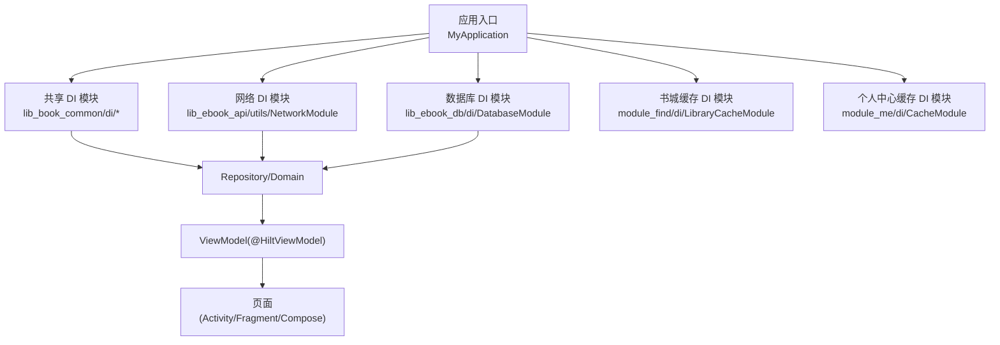
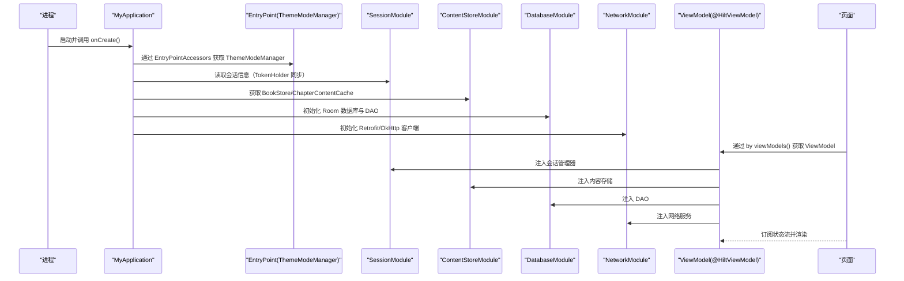
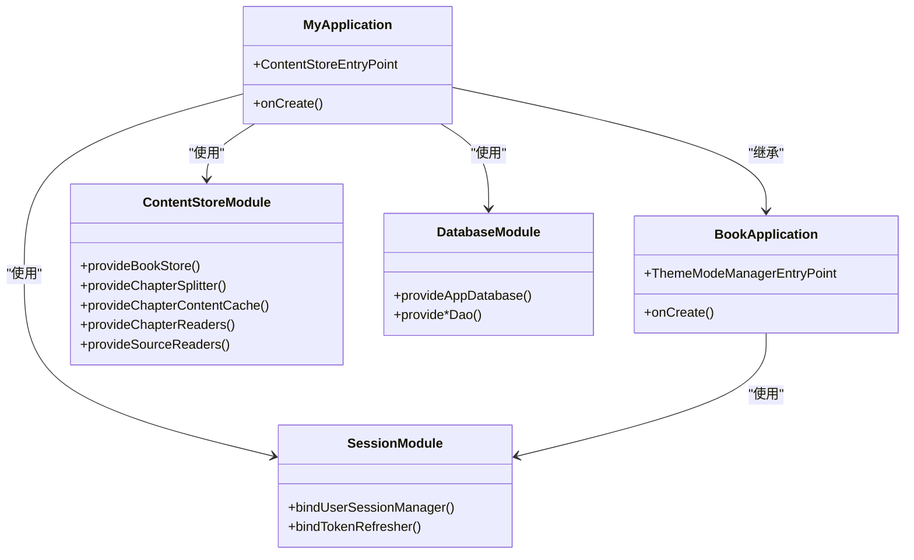
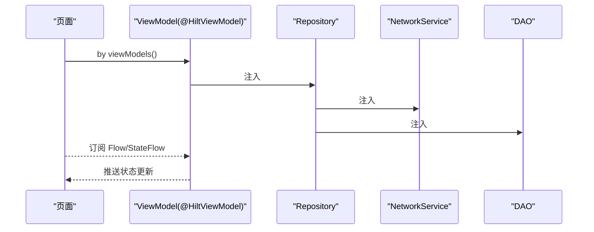
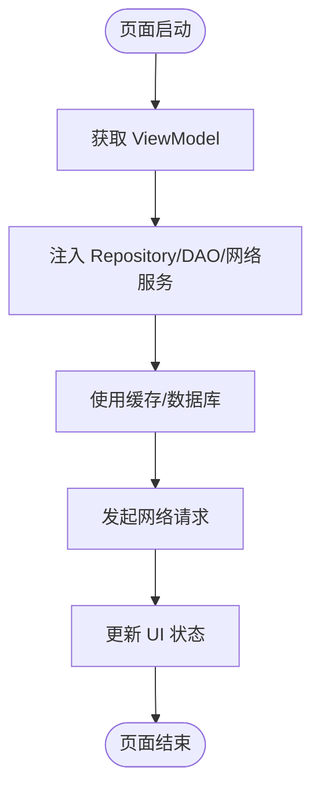

# 作用域与生命周期

<cite>
**本文引用的文件**
- [MyApplication.kt](file://module_app/src/main/java/com/ebook/MyApplication.kt)
- [BookApplication.kt](file://lib_book_common/src/main/java/com/ebook/common/BookApplication.kt)
- [SessionModule.kt](file://lib_book_common/src/main/java/com/ebook/common/di/SessionModule.kt)
- [ContentStoreModule.kt](file://lib_book_common/src/main/java/com/ebook/common/di/ContentStoreModule.kt)
- [ThemeModule.kt](file://lib_book_common/src/main/java/com/ebook/common/di/ThemeModule.kt)
- [DatabaseModule.kt](file://lib_ebook_db/src/main/java/com/ebook/db/di/DatabaseModule.kt)
- [NetworkModule.kt](file://lib_ebook_api/src/main/java/com/ebook/api/utils/NetworkModule.kt)
- [LibraryCacheModule.kt](file://module_find/src/main/java/com/ebook/find/di/LibraryCacheModule.kt)
- [CacheModule.kt](file://module_me/src/main/java/com/ebook/me/di/CacheModule.kt)
- [BookDetailViewModel.kt](file://module_book/src/main/java/com/ebook/book/mvvm/viewmodel/BookDetailViewModel.kt)
- [SearchViewModel.kt](file://module_find/src/main/java/com/ebook/find/mvvm/viewmodel/SearchViewModel.kt)
</cite>

## 目录
1. [简介](#简介)
2. [项目结构与 DI 总览](#项目结构与-di-总览)
3. [核心组件与作用域选择](#核心组件与作用域选择)
4. [架构总览](#架构总览)
5. [详细组件分析](#详细组件分析)
6. [依赖关系与跨作用域传递](#依赖关系与跨作用域传递)
7. [性能与内存管理建议](#性能与内存管理建议)
8. [故障排查指南](#故障排查指南)
9. [结论](#结论)

## 简介
本章节聚焦 Hilt 的作用域与生命周期，结合仓库中的实际模块与注入点，说明：
- @Singleton、@ActivityScoped、@FragmentScoped 等注解的适用范围与生命周期。
- ViewModel 中通过 @HiltViewModel 进行依赖注入的方式与注意事项。
- Repository 层的作用域选择与数据缓存策略。
- 不同作用域之间对象传递的方法与约束。
- 单例、页面级、组件级对象的创建与管理示例。
- 与本项目沙箱进程、入口类初始化时机相关的最佳实践。

## 项目结构与 DI 总览
项目采用多模块分层结构：应用入口在 module_app，业务模块（module_book、module_find、module_login、module_me）依赖共享库 lib_book_common，网络与数据库分别位于 lib_ebook_api 与 lib_ebook_db。DI 由 Hilt 提供，各模块通过@Module 将实现装配到相应的作用域组件中，并通过 @InstallIn 指定作用域。

**图表来源**
- [MyApplication.kt:19-65](file://module_app/src/main/java/com/ebook/MyApplication.kt#L19-L65)
- [SessionModule.kt:22-37](file://lib_book_common/src/main/java/com/ebook/common/di/SessionModule.kt#L22-L37)
- [ContentStoreModule.kt:27-87](file://lib_book_common/src/main/java/com/ebook/common/di/ContentStoreModule.kt#L27-L87)
- [DatabaseModule.kt:25-243](file://lib_ebook_db/src/main/java/com/ebook/db/di/DatabaseModule.kt#L25-L243)

**章节来源**
- [MyApplication.kt:19-65](file://module_app/src/main/java/com/ebook/MyApplication.kt#L19-L65)
- [BookApplication.kt:17-64](file://lib_book_common/src/main/java/com/ebook/common/BookApplication.kt#L17-L64)

## 核心组件与作用域选择
- 应用级单例（@Singleton + SingletonComponent）
  - 会话管理器、主题模式管理器、内容存储、数据库连接与 DAO、网络客户端等，均通过 @Module + @Provides/@Binds + @Singleton 装配到 SingletonComponent，生命周期与应用一致。
- 页面级作用域（@ActivityScoped / @FragmentScoped）
  - 适用于 Activity/Fragment 内短期存在的对象，如页面特定的 UI 控制器或临时缓存；当页面销毁时，该作用域内的依赖一并释放，避免内存泄漏。
- ViewModel 作用域
  - ViewModel 本身由 AndroidX 管理生命周期，配合 @HiltViewModel 使用，适合持有页面状态与跨配置变更的数据；通常不直接标注作用域，但可注入单例服务与 Repository。
- 模块级作用域
  - 某些模块（如 find、me）提供本地缓存对象，可按需要放入 @Singleton 或自定义作用域，确保同一模块内共享且可控的生命周期。

**章节来源**
- [SessionModule.kt:22-37](file://lib_book_common/src/main/java/com/ebook/common/di/SessionModule.kt#L22-L37)
- [ContentStoreModule.kt:27-87](file://lib_book_common/src/main/java/com/ebook/common/di/ContentStoreModule.kt#L27-L87)
- [ThemeModule.kt:17-26](file://lib_book_common/src/main/java/com/ebook/common/di/ThemeModule.kt#L17-L26)
- [DatabaseModule.kt:25-243](file://lib_ebook_db/src/main/java/com/ebook/db/di/DatabaseModule.kt#L25-L243)

## 架构总览
下图展示了从应用启动到 ViewModel 注入的关键路径，以及不同作用域之间的依赖关系。

**图表来源**
- [MyApplication.kt:24-61](file://module_app/src/main/java/com/ebook/MyApplication.kt#L24-L61)
- [BookApplication.kt:44-59](file://lib_book_common/src/main/java/com/ebook/common/BookApplication.kt#L44-L59)
- [SessionModule.kt:22-37](file://lib_book_common/src/main/java/com/ebook/common/di/SessionModule.kt#L22-L37)
- [ContentStoreModule.kt:27-87](file://lib_book_common/src/main/java/com/ebook/common/di/ContentStoreModule.kt#L27-L87)
- [DatabaseModule.kt:192-243](file://lib_ebook_db/src/main/java/com/ebook/db/di/DatabaseModule.kt#L192-L243)
- [NetworkModule.kt:1-200](file://lib_ebook_api/src/main/java/com/ebook/api/utils/NetworkModule.kt#L1-L200)

## 详细组件分析

### 应用级单例与入口初始化
- 应用入口 MyApplication 通过 @HiltAndroidApp 启用 Hilt，并在 onCreate 中执行进程门、路由拦截与内容仓库对账。为避免在隔离进程中进行不必要的 IO 或崩溃，所有重对象访问都通过 EntryPointAccessors 延迟取用。
- BookApplication 通过 EntryPoint 从 SingletonComponent 取出 ThemeModeManager 并安装到 Compose 主题系统，保证主题随用户设置变化而响应。

**图表来源**
- [MyApplication.kt:19-65](file://module_app/src/main/java/com/ebook/MyApplication.kt#L19-L65)
- [BookApplication.kt:17-64](file://lib_book_common/src/main/java/com/ebook/common/BookApplication.kt#L17-L64)
- [SessionModule.kt:22-37](file://lib_book_common/src/main/java/com/ebook/common/di/SessionModule.kt#L22-L37)
- [ContentStoreModule.kt:27-87](file://lib_book_common/src/main/java/com/ebook/common/di/ContentStoreModule.kt#L27-L87)
- [DatabaseModule.kt:25-243](file://lib_ebook_db/src/main/java/com/ebook/db/di/DatabaseModule.kt#L25-L243)

**章节来源**
- [MyApplication.kt:24-61](file://module_app/src/main/java/com/ebook/MyApplication.kt#L24-L61)
- [BookApplication.kt:44-59](file://lib_book_common/src/main/java/com/ebook/common/BookApplication.kt#L44-L59)

### ViewModel 中的作用域与注入
- ViewModel 通过 @HiltViewModel 声明并由框架管理生命周期，适合持有页面状态与跨配置变更的数据。
- ViewModel 通过构造函数注入 Repository、DAO、网络服务等依赖，保持无状态 UI 与有状态逻辑分离。
- 页面通过 by viewModels() 获取 ViewModel，从而利用 Hilt 提供的依赖图完成注入。

**图表来源**
- [BookDetailViewModel.kt:1-200](file://module_book/src/main/java/com/ebook/book/mvvm/viewmodel/BookDetailViewModel.kt#L1-L200)
- [SearchViewModel.kt:1-200](file://module_find/src/main/java/com/ebook/find/mvvm/viewmodel/SearchViewModel.kt#L1-L200)

**章节来源**
- [BookDetailViewModel.kt:1-200](file://module_book/src/main/java/com/ebook/book/mvvm/viewmodel/BookDetailViewModel.kt#L1-L200)
- [SearchViewModel.kt:1-200](file://module_find/src/main/java/com/ebook/find/mvvm/viewmodel/SearchViewModel.kt#L1-L200)

### Repository 层的作用域与缓存策略
- Repository 通常以 @Singleton 装配，负责协调网络、数据库与缓存，对外暴露统一的领域接口。
- 缓存策略包括：
  - 内存缓存：如 ChapterContentCache 用于章节正文快速命中。
  - 磁盘缓存：如 BookStore 管理书籍内容与临时文件。
  - 模块级缓存：如 LibraryCacheModule、CacheModule 针对特定功能域的缓存对象。
- 缓存键设计需稳定唯一，避免重复请求与数据错乱；TTL 与 SWR 策略应在仓库层集中管理。

**章节来源**
- [ContentStoreModule.kt:27-87](file://lib_book_common/src/main/java/com/ebook/common/di/ContentStoreModule.kt#L27-L87)
- [LibraryCacheModule.kt:1-200](file://module_find/src/main/java/com/ebook/find/di/LibraryCacheModule.kt#L1-L200)
- [CacheModule.kt:1-200](file://module_me/src/main/java/com/ebook/me/di/CacheModule.kt#L1-L200)

### 网络层的作用域与客户端隔离
- 网络客户端通过 NetworkModule 装配为 @Singleton，区分不同信任域（如书源客户端与版本检查客户端），避免携带用户凭证。
- OkHttp 拦截器统一处理编码、认证、重试等横切关注点，保证请求的一致性与安全性。

**章节来源**
- [NetworkModule.kt:1-200](file://lib_ebook_api/src/main/java/com/ebook/api/utils/NetworkModule.kt#L1-L200)

## 依赖关系与跨作用域传递
- 单例到页面级：页面通过 ViewModel 注入单例服务，无需手动传递上下文，避免泄露。
- 页面级到单例：页面可通过 Repository 间接使用单例，但不建议持有页面级对象引用到单例，防止内存泄漏。
- 跨模块传递：通过 Provider 接口与 TheRouter 进行跨模块导航与服务调用，避免直接耦合。
- 进程隔离：在隔离进程中，通过 EntryPointAccessors 延迟取用单例，避免未初始化导致的崩溃。

**图表来源**
- [BookDetailViewModel.kt:1-200](file://module_book/src/main/java/com/ebook/book/mvvm/viewmodel/BookDetailViewModel.kt#L1-L200)
- [SearchViewModel.kt:1-200](file://module_find/src/main/java/com/ebook/find/mvvm/viewmodel/SearchViewModel.kt#L1-L200)

## 性能与内存管理建议
- 优先使用 @Singleton 管理全局资源（数据库、网络客户端、主题管理器），减少重复创建开销。
- 页面级对象使用 @ActivityScoped/@FragmentScoped，确保页面销毁时及时释放，避免内存泄漏。
- ViewModel 仅持有状态与逻辑，避免持有 Context 或长生命周期对象。
- 缓存键设计需稳定唯一，避免重复请求与数据错乱；TTL 与 SWR 策略应在仓库层集中管理。
- 在隔离进程中，通过 EntryPointAccessors 延迟取用单例，避免未初始化导致的崩溃。
- 网络请求应去重与合并，避免重复请求；失败重试需考虑幂等性。

## 故障排查指南
- 启动崩溃：检查 Application 中是否有 eager @Inject 字段，改为延迟取用。
- 数据加载不出：检查缓存键是否一致，网络客户端是否正确装配，DAO 是否被正确注入。
- 内存泄漏：检查页面级对象是否被单例持有，ViewModel 是否持有 Context。
- 主题不生效：检查 ThemeModeManager 是否正确安装到 Compose 主题系统。

**章节来源**
- [MyApplication.kt:24-61](file://module_app/src/main/java/com/ebook/MyApplication.kt#L24-L61)
- [BookApplication.kt:44-59](file://lib_book_common/src/main/java/com/ebook/common/BookApplication.kt#L44-L59)

## 结论
本项目通过 Hilt 的作用域机制，清晰划分了应用级、页面级与模块级的依赖生命周期，确保了资源的合理管理与内存安全。结合 ViewModel 的注入方式与 Repository 层的缓存策略，实现了高效、可维护的 MVVM 架构。遵循本文的最佳实践，可进一步提升应用的性能与稳定性。