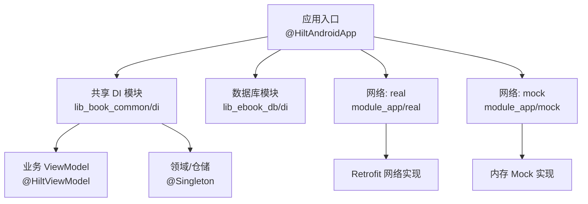
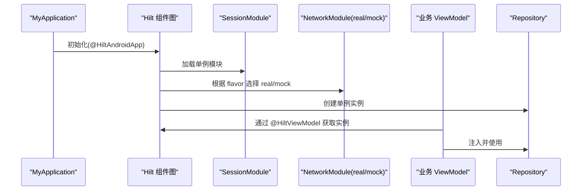
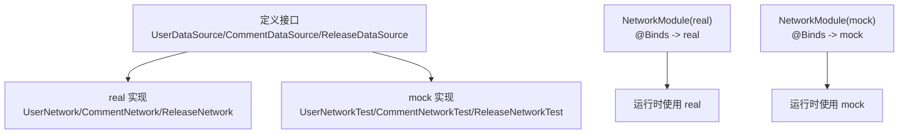
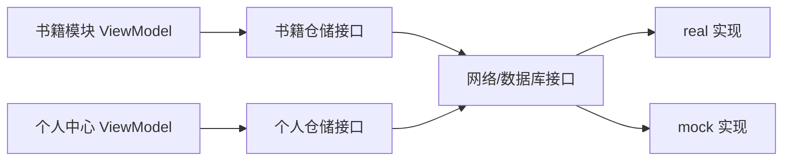
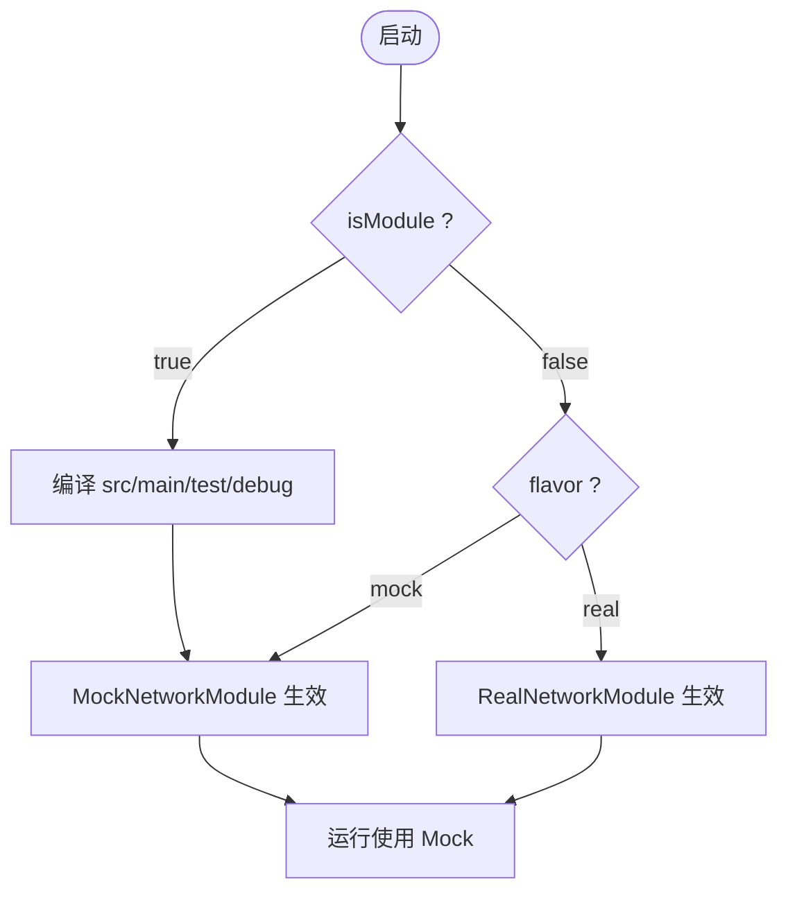
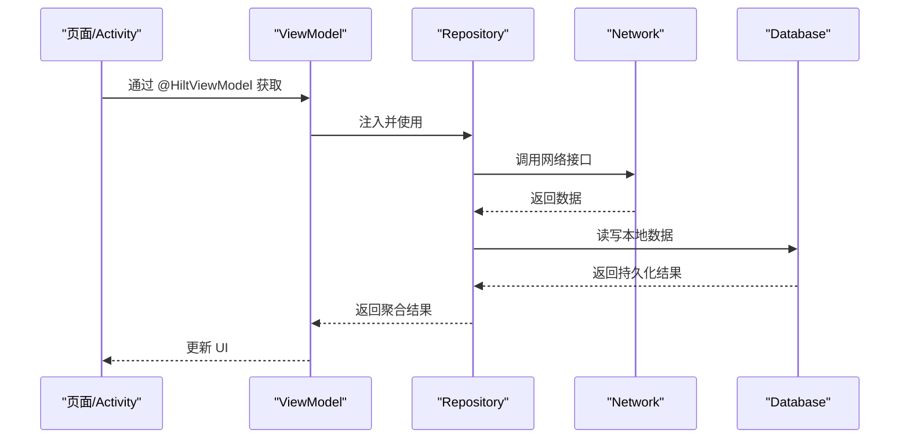
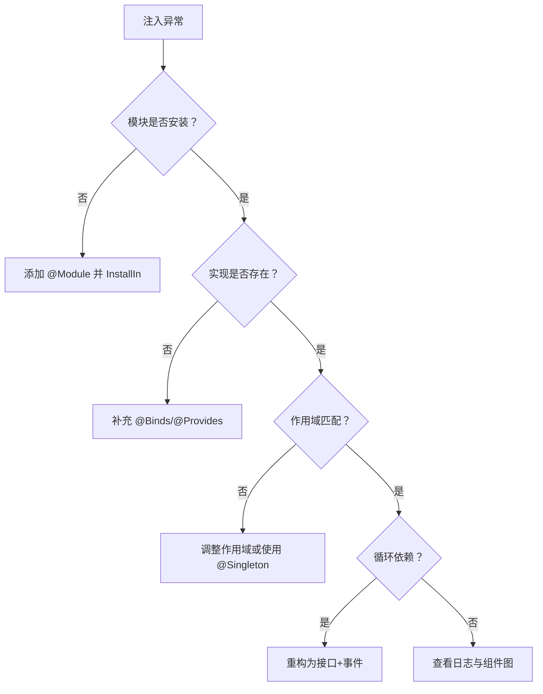

# 依赖注入

<cite>
**本文引用的文件**
- [MyApplication.kt](file://module_app/src/main/java/com/ebook/MyApplication.kt)
- [BookApplication.kt](file://lib_book_common/src/main/java/com/ebook/common/BookApplication.kt)
- [HiltConventionPlugin.kt](file://build-logic/convention/src/main/kotlin/HiltConventionPlugin.kt)
- [SessionModule.kt](file://lib_book_common/src/main/java/com/ebook/common/di/SessionModule.kt)
- [NetworkModule(集成).kt](file://module_app/src/real/java/com/ebook/di/NetworkModule.kt)
- [NetworkModule(Mock).kt](file://module_app/src/mock/java/com/ebook/di/NetworkModule.kt)
- [DatabaseModule.kt](file://lib_ebook_db/src/main/java/com/ebook/db/di/DatabaseModule.kt)
- [ContentStoreModule.kt](file://lib_book_common/src/main/java/com/ebook/common/di/ContentStoreModule.kt)
- [SandboxModule.kt](file://lib_book_common/src/main/java/com/ebook/common/di/SandboxModule.kt)
- [ThemeModule.kt](file://lib_book_common/src/main/java/com/ebook/common/di/ThemeModule.kt)
- [TransactionModule.kt](file://lib_book_common/src/main/java/com/ebook/common/di/TransactionModule.kt)
- [AnalyzeModule.kt](file://lib_book_common/src/main/java/com/ebook/common/di/AnalyzeModule.kt)
- [LibraryCacheModule.kt](file://module_find/src/main/java/com/ebook/find/di/LibraryCacheModule.kt)
- [CacheModule.kt](file://module_me/src/main/java/com/ebook/me/di/CacheModule.kt)
- [UserNetwork.kt](file://lib_ebook_api/src/main/java/com/ebook/api/service/user/UserNetwork.kt)
- [CommentNetwork.kt](file://lib_ebook_api/src/main/java/com/ebook/api/service/comment/CommentNetwork.kt)
- [ReleaseNetwork.kt](file://lib_ebook_api/src/main/java/com/ebook/api/service/release/ReleaseNetwork.kt)
- [UserNetworkTest.kt](file://lib_ebook_api/src/test/java/com/ebook/api/service/user/UserNetworkTest.kt)
- [CommentNetworkTest.kt](file://lib_ebook_api/src/test/java/com/ebook/api/service/comment/CommentNetworkTest.kt)
- [ReleaseNetworkTest.kt](file://lib_ebook_api/src/test/java/com/ebook/api/service/release/ReleaseNetworkTest.kt)
- [BookDetailViewModel.kt](file://module_book/src/main/java/com/ebook/book/mvvm/viewmodel/BookDetailViewModel.kt)
- [LoginViewModel.kt](file://module_login/src/main/java/com/ebook/login/mvvm/viewmodel/LoginViewModel.kt)
</cite>

## 目录
1. [简介](#简介)
2. [项目结构与 Hilt 装配边界](#项目结构与-hilt-装配边界)
3. [核心注解与作用域](#核心注解与作用域)
4. [模块级依赖配置与 @Module/@Provides 设计原则](#模块级依赖配置与-moduleprovides-设计原则)
5. [跨模块依赖注入最佳实践](#跨模块依赖注入最佳实践)
6. [独立运行模式下的依赖差异与 Mock 注入](#独立运行模式下的依赖差异与-mock-注入)
7. [典型依赖注入示例](#典型依赖注入示例)
8. [依赖图调试与问题排查](#依赖图调试与问题排查)
9. [性能与生命周期注意事项](#性能与生命周期注意事项)
10. [结论](#结论)

## 简介
本仓库采用 Hilt 作为依赖注入框架，配合 Gradle 约定插件统一接入 KSP、Android Hilt 插件与依赖。整体架构遵循“接口抽象 + 实现绑定 + 作用域管理”的原则：共享能力集中在 lib_book_common 的 di 包中提供；业务模块仅声明自身所需模块；网络层通过 product flavor（real/mock）在 module_app 中切换真实后端与内存 mock；数据库由 lib_ebook_db 暴露模块；ViewModel 使用 @HiltViewModel 注入；Activity/Fragment 使用 @AndroidEntryPoint 注入。

## 项目结构与 Hilt 装配边界
- 应用入口 module_app 的 MyApplication 标注 @HiltAndroidApp，负责启动 Hilt 组件图。
- 通用会话、主题、内容存储、沙箱、事务等横切能力集中在 lib_book_common 的 di 包，以 @Module + @InstallIn(SingletonComponent::class) 提供单例绑定。
- 数据库能力由 lib_ebook_db 暴露 DatabaseModule，供上层依赖。
- 功能模块按职责提供自身小范围模块（如 find 的缓存、me 的缓存）。
- 网络层通过 product flavor 在 module_app 中分别提供 real 与 mock 两套 NetworkModule，互斥绑定 DataSource 接口。

**图示来源**
- [MyApplication.kt:19-61](file://module_app/src/main/java/com/ebook/MyApplication.kt#L19-L61)
- [SessionModule.kt:22-37](file://lib_book_common/src/main/java/com/ebook/common/di/SessionModule.kt#L22-L37)
- [DatabaseModule.kt:1-200](file://lib_ebook_db/src/main/java/com/ebook/db/di/DatabaseModule.kt)
- [NetworkModule(集成).kt:24-35](file://module_app/src/real/java/com/ebook/di/NetworkModule.kt#L24-L35)
- [NetworkModule(Mock).kt:26-37](file://module_app/src/mock/java/com/ebook/di/NetworkModule.kt#L26-L37)

**章节来源**
- [MyApplication.kt:19-61](file://module_app/src/main/java/com/ebook/MyApplication.kt#L19-L61)
- [HiltConventionPlugin.kt:24-49](file://build-logic/convention/src/main/kotlin/HiltConventionPlugin.kt#L24-L49)

## 核心注解与作用域
- @HiltAndroidApp：标注在 Application，初始化 Hilt 并生成组件图入口。位于应用入口类，确保整个进程可用。
- @Singleton：定义单例作用域，用于跨请求/页面共享的生命周期对象（如 Repository、Manager、TokenRefresher）。
- @HiltViewModel：将 ViewModel 纳入 Hilt 管理，支持构造器注入；其生命周期与拥有它的 UI 宿主一致。
- @AndroidEntryPoint：允许 Activity/Fragment/Service/Receiver 等 Android 组件参与 Hilt 注入。
- @Module + @InstallIn(SingletonComponent::class)：声明模块及其作用域；通常配合 @Binds/@Provides 注册单例。
- EntryPoint + @InstallIn：在不进入常规注入路径的地方（如 Application 早期逻辑）从 SingletonComponent 取对象，避免字段注入时序问题。

**图示来源**
- [MyApplication.kt:19-61](file://module_app/src/main/java/com/ebook/MyApplication.kt#L19-L61)
- [SessionModule.kt:22-37](file://lib_book_common/src/main/java/com/ebook/common/di/SessionModule.kt#L22-L37)
- [NetworkModule(集成).kt:24-35](file://module_app/src/real/java/com/ebook/di/NetworkModule.kt#L24-L35)
- [NetworkModule(Mock).kt:26-37](file://module_app/src/mock/java/com/ebook/di/NetworkModule.kt#L26-L37)

**章节来源**
- [BookApplication.kt:17-59](file://lib_book_common/src/main/java/com/ebook/common/BookApplication.kt#L17-L59)
- [MyApplication.kt:19-61](file://module_app/src/main/java/com/ebook/MyApplication.kt#L19-L61)

## 模块级依赖配置与 @Module/@Provides 设计原则
- 单一职责：每个 @Module 聚焦一个领域或技术栈（会话、数据库、主题、内容存储、沙箱、事务、分析、缓存等）。
- 明确作用域：模块统一安装到 SingletonComponent，并通过 @Singleton 保证全局唯一实例。
- 接口优先：对外暴露接口（如 UserDataSource、CommentDataSource、ReleaseDataSource），实现类放在对应 source set（real/mock）。
- 绑定方式：优先使用 @Binds 进行接口到实现的绑定；需要复杂构造时使用 @Provides。
- 可测试性：通过 flavor 与 test/debug 源集提供 Mock 实现，使业务模块无需感知具体数据源。

**图示来源**
- [NetworkModule(集成).kt:24-35](file://module_app/src/real/java/com/ebook/di/NetworkModule.kt#L24-L35)
- [NetworkModule(Mock).kt:26-37](file://module_app/src/mock/java/com/ebook/di/NetworkModule.kt#L26-L37)
- [UserNetwork.kt:1-200](file://lib_ebook_api/src/main/java/com/ebook/api/service/user/UserNetwork.kt)
- [CommentNetwork.kt:1-200](file://lib_ebook_api/src/main/java/com/ebook/api/service/comment/CommentNetwork.kt)
- [ReleaseNetwork.kt:1-200](file://lib_ebook_api/src/main/java/com/ebook/api/service/release/ReleaseNetwork.kt)
- [UserNetworkTest.kt:1-200](file://lib_ebook_api/src/test/java/com/ebook/api/service/user/UserNetworkTest.kt)
- [CommentNetworkTest.kt:1-200](file://lib_ebook_api/src/test/java/com/ebook/api/service/comment/CommentNetworkTest.kt)
- [ReleaseNetworkTest.kt:1-200](file://lib_ebook_api/src/test/java/com/ebook/api/service/release/ReleaseNetworkTest.kt)

**章节来源**
- [SessionModule.kt:22-37](file://lib_book_common/src/main/java/com/ebook/common/di/SessionModule.kt#L22-L37)
- [DatabaseModule.kt:1-200](file://lib_ebook_db/src/main/java/com/ebook/db/di/DatabaseModule.kt)
- [ContentStoreModule.kt:1-200](file://lib_book_common/src/main/java/com/ebook/common/di/ContentStoreModule.kt)
- [SandboxModule.kt:1-200](file://lib_book_common/src/main/java/com/ebook/common/di/SandboxModule.kt)
- [ThemeModule.kt:1-200](file://lib_book_common/src/main/java/com/ebook/common/di/ThemeModule.kt)
- [TransactionModule.kt:1-200](file://lib_book_common/src/main/java/com/ebook/common/di/TransactionModule.kt)
- [AnalyzeModule.kt:1-200](file://lib_book_common/src/main/java/com/ebook/common/di/AnalyzeModule.kt)
- [LibraryCacheModule.kt:1-200](file://module_find/src/main/java/com/ebook/find/di/LibraryCacheModule.kt)
- [CacheModule.kt:1-200](file://module_me/src/main/java/com/ebook/me/di/CacheModule.kt)

## 跨模块依赖注入最佳实践
- 接口抽象：跨模块依赖一律通过接口暴露（如 DataSource 系列），实现类放置于依赖方或 flavor 源集，避免循环依赖。
- 实现分离：real/mock 实现隔离在不同 source set，通过同名 @Module 互斥绑定，业务代码零感知。
- 作用域收敛：仅在必要时使用 @Singleton；UI 相关对象（如 ViewModel）使用 @HiltViewModel，避免长生命周期污染。
- 分层清晰：lib_book_common 提供横切能力；lib_ebook_db 提供持久化；业务模块只关心接口。
- 避免循环依赖：若出现环，优先引入中间接口或事件总线，或将双向依赖改为单向。

**图示来源**
- [BookDetailViewModel.kt:1-200](file://module_book/src/main/java/com/ebook/book/mvvm/viewmodel/BookDetailViewModel.kt)
- [LoginViewModel.kt:1-200](file://module_login/src/main/java/com/ebook/login/mvvm/viewmodel/LoginViewModel.kt)
- [NetworkModule(集成).kt:24-35](file://module_app/src/real/java/com/ebook/di/NetworkModule.kt#L24-L35)
- [NetworkModule(Mock).kt:26-37](file://module_app/src/mock/java/com/ebook/di/NetworkModule.kt#L26-L37)

**章节来源**
- [SessionModule.kt:22-37](file://lib_book_common/src/main/java/com/ebook/common/di/SessionModule.kt#L22-L37)
- [NetworkModule(集成).kt:24-35](file://module_app/src/real/java/com/ebook/di/NetworkModule.kt#L24-L35)
- [NetworkModule(Mock).kt:26-37](file://module_app/src/mock/java/com/ebook/di/NetworkModule.kt#L26-L37)

## 独立运行模式下的依赖差异与 Mock 注入
- 独立运行（isModule=true）时，约定插件将 src/main/test/debug 并入 main，其中的 MockNetworkModule 自动生效，默认走 mock 数据源。
- 集成构建（isModule=false）时，通过 product flavor 选择 real 或 mock 的 NetworkModule；assembleRealDebug 连接真实后端，assembleMockDebug 使用内存 mock。
- 独立模式下，跨模块路由可能静默丢失，需在 debug 宿主中提供占位路由；依赖注入层面，mock 模块会替换相应接口实现。

**图示来源**
- [HiltConventionPlugin.kt:24-49](file://build-logic/convention/src/main/kotlin/HiltConventionPlugin.kt#L24-L49)
- [NetworkModule(Mock).kt:26-37](file://module_app/src/mock/java/com/ebook/di/NetworkModule.kt#L26-L37)
- [NetworkModule(集成).kt:24-35](file://module_app/src/real/java/com/ebook/di/NetworkModule.kt#L24-L35)

**章节来源**
- [NetworkModule(Mock).kt:26-37](file://module_app/src/mock/java/com/ebook/di/NetworkModule.kt#L26-L37)
- [NetworkModule(集成).kt:24-35](file://module_app/src/real/java/com/ebook/di/NetworkModule.kt#L24-L35)

## 典型依赖注入示例
- ViewModel 注入：使用 @HiltViewModel 并在构造器中注入仓储或服务；页面通过 viewModels() 获取。
- Repository 注入：仓储以 @Singleton 注册，供多个 ViewModel 共享。
- 第三方库集成：Retrofit 网络层封装为 DataSource 接口，通过 @Module 绑定；数据库通过 Room Module 暴露 DAO/DB。

**图示来源**
- [BookDetailViewModel.kt:1-200](file://module_book/src/main/java/com/ebook/book/mvvm/viewmodel/BookDetailViewModel.kt)
- [LoginViewModel.kt:1-200](file://module_login/src/main/java/com/ebook/login/mvvm/viewmodel/LoginViewModel.kt)
- [SessionModule.kt:22-37](file://lib_book_common/src/main/java/com/ebook/common/di/SessionModule.kt#L22-L37)
- [DatabaseModule.kt:1-200](file://lib_ebook_db/src/main/java/com/ebook/db/di/DatabaseModule.kt)

**章节来源**
- [BookDetailViewModel.kt:1-200](file://module_book/src/main/java/com/ebook/book/mvvm/viewmodel/BookDetailViewModel.kt)
- [LoginViewModel.kt:1-200](file://module_login/src/main/java/com/ebook/login/mvvm/viewmodel/LoginViewModel.kt)

## 依赖图调试与问题排查
- 组件缺失：确认对应的 @Module 是否已安装到正确作用域；检查 flavor 是否正确启用；验证接口是否有绑定实现。
- 作用域冲突：避免在非单例作用域内注入 @Singleton；ViewModel 不应持有 Application 级状态。
- 循环依赖：通过接口解耦，或将双向依赖改为事件驱动；必要时引入中间层。
- 进程隔离：Application 上禁止 eager @Inject 字段，应使用 EntryPointAccessors 延迟获取，防止沙箱进程崩溃。
- 日志定位：统一使用 Logger，结合 Hilt 生成的组件信息定位注入失败点。

**图示来源**
- [MyApplication.kt:19-61](file://module_app/src/main/java/com/ebook/MyApplication.kt#L19-L61)
- [BookApplication.kt:17-59](file://lib_book_common/src/main/java/com/ebook/common/BookApplication.kt#L17-L59)

**章节来源**
- [MyApplication.kt:19-61](file://module_app/src/main/java/com/ebook/MyApplication.kt#L19-L61)
- [BookApplication.kt:17-59](file://lib_book_common/src/main/java/com/ebook/common/BookApplication.kt#L17-L59)

## 性能与生命周期注意事项
- 单例谨慎使用：@Singleton 适用于无状态或共享资源；避免持有 UI 引用导致泄漏。
- ViewModel 生命周期：与 UI 宿主一致，适合持有页面状态与工作协程。
- 网络层优化：使用 OkHttp 拦截器与缓存策略；避免在主线程执行耗时操作。
- 数据库访问：DAO 方法尽量轻量，复杂查询使用 Room 原生 SQL 或分页 API。
- 进程隔离：Application 上延迟获取重对象，避免沙箱进程初始化失败。

[本节为通用指导，不直接分析具体文件]

## 结论
本项目通过 Hilt 实现了清晰的依赖管理与模块化装配：共享能力集中、业务模块解耦、网络层灵活切换。遵循接口抽象、作用域收敛与 Mock 替代的最佳实践，可有效提升可测试性与可维护性。在独立运行与集成构建下，通过 flavor 与 source set 机制无缝切换依赖实现，保障开发与测试效率。持续关注作用域、循环依赖与进程隔离问题，可进一步提升系统稳定性与性能。