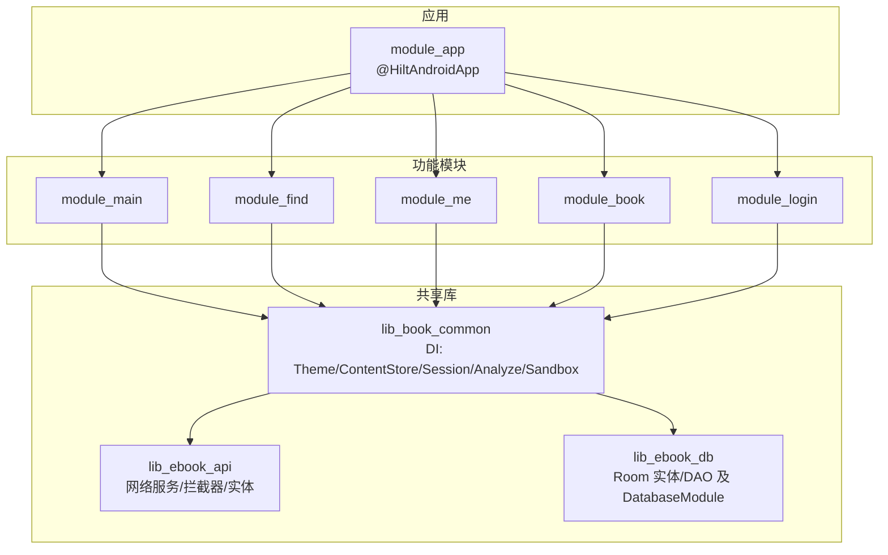
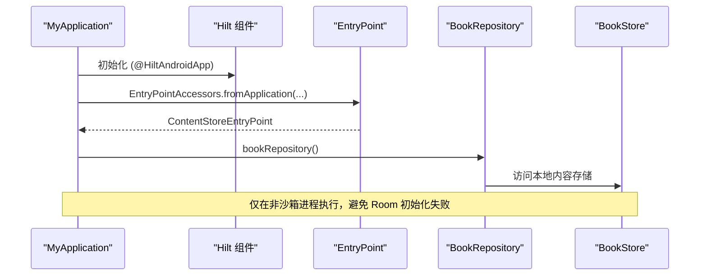
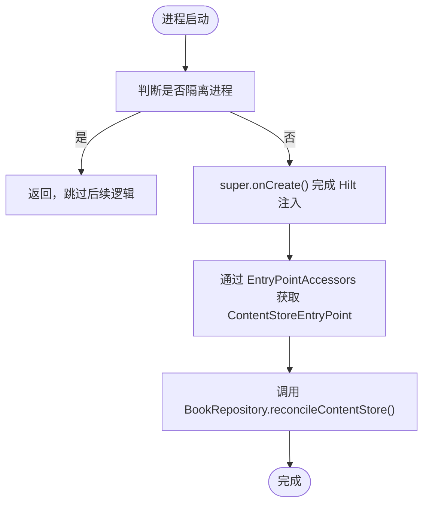
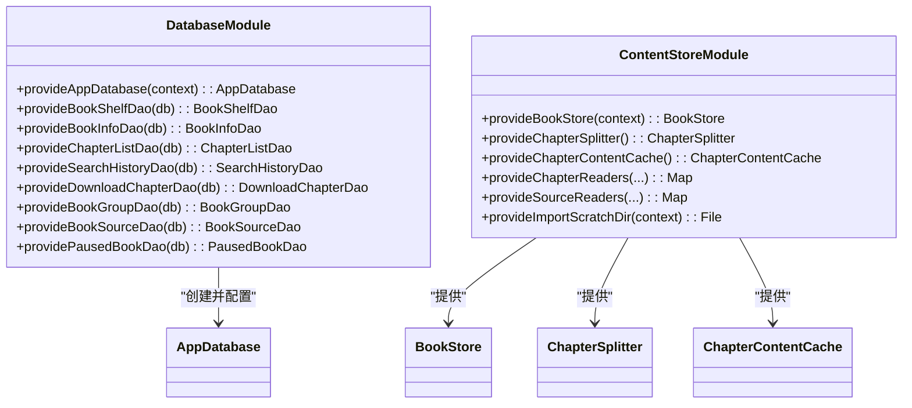
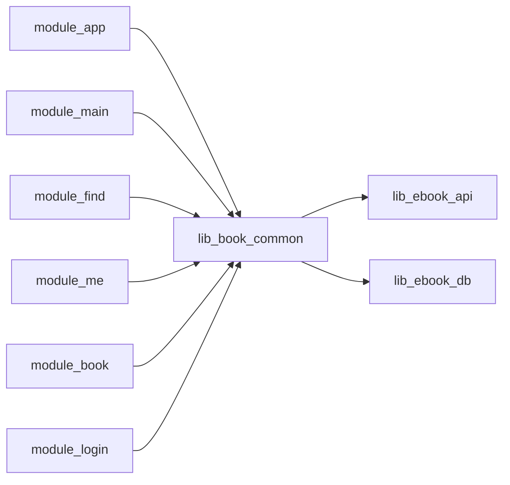

# 模块依赖管理

<cite>
**本文引用的文件**
- [MyApplication.kt](file://module_app/src/main/java/com/ebook/MyApplication.kt)
- [HiltConventionPlugin.kt](file://build-logic/convention/src/main/kotlin/HiltConventionPlugin.kt)
- [ThemeModule.kt](file://lib_book_common/src/main/java/com/ebook/common/di/ThemeModule.kt)
- [DatabaseModule.kt](file://lib_ebook_db/src/main/java/com/ebook/db/di/DatabaseModule.kt)
- [ContentStoreModule.kt](file://lib_book_common/src/main/java/com/ebook/common/di/ContentStoreModule.kt)
- [NetworkModule (real).kt](file://module_app/src/real/java/com/ebook/di/NetworkModule.kt)
- [NetworkModule (mock).kt](file://module_app/src/mock/java/com/ebook/di/NetworkModule.kt)
- [build.gradle.kts (module_app)](file://module_app/build.gradle.kts)
</cite>

## 目录
1. [引言](#引言)
2. [项目结构](#项目结构)
3. [核心组件](#核心组件)
4. [架构总览](#架构总览)
5. [详细组件分析](#详细组件分析)
6. [依赖关系与模块边界](#依赖关系与模块边界)
7. [性能与可维护性考量](#性能与可维护性考量)
8. [故障排查指南](#故障排查指南)
9. [结论](#结论)
10. [附录：配置与示例清单](#附录：配置与示例清单)

## 引言
本文件聚焦本仓库在模块化项目中的 Hilt 依赖管理实践，覆盖以下方面：
- @Module 注解的使用方式与 @Provides 方法的编写规范
- 不同模块间的依赖关系管理与接口抽象、实现分离
- 跨模块依赖注入的最佳实践（依赖图组织、命名约定）
- 如何避免循环依赖与解决依赖冲突
- 数据层、业务层、UI 层的依赖注入模式与具体模块配置示例
- 模块测试中的依赖模拟与替换策略

## 项目结构
本项目采用多模块架构：应用入口 module_app 装配功能模块；共享库 lib_book_common 提供通用能力与 DI 模块；领域库 lib_ebook_api、lib_ebook_db 分别承载网络与数据库。构建系统通过 build-logic 的约定插件统一接入 Hilt，保证各模块一致启用 KSP 与 Hilt Android 插件。

图表来源
- [HiltConventionPlugin.kt:24-48](file://build-logic/convention/src/main/kotlin/HiltConventionPlugin.kt#L24-L48)
- [build.gradle.kts (module_app):48-58](file://module_app/build.gradle.kts#L48-L58)

章节来源
- [HiltConventionPlugin.kt:24-48](file://build-logic/convention/src/main/kotlin/HiltConventionPlugin.kt#L24-L48)
- [build.gradle.kts (module_app):48-58](file://module_app/build.gradle.kts#L48-L58)

## 核心组件
- 应用级入口与进程门控：
  - MyApplication 使用 @HiltAndroidApp 启动 Hilt，并通过 EntryPointAccessors 延迟获取 BookRepository，避免在沙箱隔离进程中触发 Room 初始化导致的崩溃。
- 统一 Hilt 接入：
  - HiltConventionPlugin 为 Android/JVM 模块自动引入 KSP 与 Hilt 依赖，确保各模块一致装配。
- 数据层模块：
  - DatabaseModule 提供 AppDatabase 与各 DAO 的单例，集中管理 Room 迁移与驱动。
  - ContentStoreModule 提供 BookStore、ChapterSplitter、ChapterContentCache 等单例，并集中 Map<BookFormat, ChapterReader> 的分发装配。
- 主题与配置模块：
  - ThemeModule 提供 ThemeModeManager 的单例，依赖 Application 上下文。
- 网络层绑定：
  - NetworkModule 按 flavor（real/mock）将 DataSource 接口绑定到对应实现，解耦业务对网络实现的直接依赖。

章节来源
- [MyApplication.kt:19-61](file://module_app/src/main/java/com/ebook/MyApplication.kt#L19-L61)
- [HiltConventionPlugin.kt:24-48](file://build-logic/convention/src/main/kotlin/HiltConventionPlugin.kt#L24-L48)
- [DatabaseModule.kt:192-243](file://lib_ebook_db/src/main/java/com/ebook/db/di/DatabaseModule.kt#L192-L243)
- [ContentStoreModule.kt:21-87](file://lib_book_common/src/main/java/com/ebook/common/di/ContentStoreModule.kt#L21-L87)
- [ThemeModule.kt:10-26](file://lib_book_common/src/main/java/com/ebook/common/di/ThemeModule.kt#L10-L26)
- [NetworkModule (real).kt:14-35](file://module_app/src/real/java/com/ebook/di/NetworkModule.kt#L14-L35)

## 架构总览
Hilt 在本项目中的职责分层清晰：
- 基础设施层：Hilt 插件与 KSP 由约定插件统一装配，所有 Android 模块自动启用 Hilt Android 与 KSP。
- 数据层：DatabaseModule 暴露 AppDatabase 与各 DAO；ContentStoreModule 暴露本地存储与解析能力；ThemeModule 暴露主题状态。
- 网络层：NetworkModule 根据 flavor 绑定 DataSource 接口到真实或 Mock 实现，使上层仅依赖接口。
- 应用层：module_* 通过 ViewModel 注入仓库与服务，页面不感知网络/数据库细节。

图表来源
- [MyApplication.kt:19-61](file://module_app/src/main/java/com/ebook/MyApplication.kt#L19-L61)

## 详细组件分析

### 应用入口与延迟注入（MyApplication）
- 使用 @HiltAndroidApp 启动 Hilt。
- 通过 @EntryPoint + @InstallIn(SingletonComponent) 暴露 ContentStoreEntryPoint，仅在需要时通过 EntryPointAccessors 获取 BookRepository，避免在隔离进程触发 Room 初始化。
- 关键约束：Application 上不再放置 eager @Inject 字段，防止框架注入时机早于进程门导致崩溃。

图表来源
- [MyApplication.kt:19-61](file://module_app/src/main/java/com/ebook/MyApplication.kt#L19-L61)

章节来源
- [MyApplication.kt:19-61](file://module_app/src/main/java/com/ebook/MyApplication.kt#L19-L61)

### 统一 Hilt 接入（HiltConventionPlugin）
- 为 Android 模块自动应用 Hilt Android 插件并添加依赖。
- 为 JVM 模块添加 Hilt Core 依赖。
- 强制启用 KSP 以支持 Hilt 代码生成。

章节来源
- [HiltConventionPlugin.kt:24-48](file://build-logic/convention/src/main/kotlin/HiltConventionPlugin.kt#L24-L48)

### 数据层模块（DatabaseModule 与 ContentStoreModule）
- DatabaseModule：
  - 提供 AppDatabase 单例，集中声明迁移链与驱动设置。
  - 提供各 DAO 单例，供仓库层消费。
- ContentStoreModule：
  - 提供 BookStore、ChapterSplitter、ChapterContentCache 单例。
  - 提供 Map<BookFormat, ChapterReader> 和 Map<BookFormat, SourceReader>，以开闭原则聚合解析器，新增格式只需扩展 Map。
  - 提供导入临时目录，隔离导入期文件落点。

图表来源
- [DatabaseModule.kt:192-243](file://lib_ebook_db/src/main/java/com/ebook/db/di/DatabaseModule.kt#L192-L243)
- [ContentStoreModule.kt:21-87](file://lib_book_common/src/main/java/com/ebook/common/di/ContentStoreModule.kt#L21-L87)

章节来源
- [DatabaseModule.kt:192-243](file://lib_ebook_db/src/main/java/com/ebook/db/di/DatabaseModule.kt#L192-L243)
- [ContentStoreModule.kt:21-87](file://lib_book_common/src/main/java/com/ebook/common/di/ContentStoreModule.kt#L21-L87)

### 主题与配置模块（ThemeModule）
- 提供 ThemeModeManager 单例，依赖 Application 上下文读取持久化配置。
- 通过 @InstallIn(SingletonComponent) 保证全应用生命周期内唯一实例。

章节来源
- [ThemeModule.kt:10-26](file://lib_book_common/src/main/java/com/ebook/common/di/ThemeModule.kt#L10-L26)

### 网络层绑定（NetworkModule real/mock）
- 通过 @Binds 将 DataSource 接口绑定到具体实现，区分 real 与 mock flavor。
- 保持业务层仅依赖接口，便于测试与切换后端。

章节来源
- [NetworkModule (real).kt:14-35](file://module_app/src/real/java/com/ebook/di/NetworkModule.kt#L14-L35)
- [NetworkModule (mock).kt](file://module_app/src/mock/java/com/ebook/di/NetworkModule.kt)

## 依赖关系与模块边界
- 依赖方向遵循“功能模块 → 共享库”单向依赖，避免循环。
- 接口与实现分离：
  - 网络层通过 DataSource 接口与 NetworkModule 绑定，实现位于 module_app 的 real/mock source set。
  - 数据层通过 DAO 与 Repository 分层，DAO 由 DatabaseModule 提供。
- 命名约定：
  - 模块以功能域命名（如 module_book、module_find）。
  - DI 模块集中在各自包下的 di 目录，统一使用 @Module + @InstallIn 标注。
  - 提供者方法以 provideXxx 命名，参数尽量使用 @ApplicationContext 或类型明确的依赖。
- 避免循环依赖：
  - 共享库不反向依赖功能模块；功能模块之间互不依赖。
  - 跨模块交互通过接口与 Provider 契约（TheRouter 路由、Provider 接口）进行解耦。

图表来源
- [build.gradle.kts (module_app):48-58](file://module_app/build.gradle.kts#L48-L58)

章节来源
- [build.gradle.kts (module_app):48-58](file://module_app/build.gradle.kts#L48-L58)

## 性能与可维护性考量
- 延迟初始化：
  - 通过 EntryPointAccessors 在需要时才获取 BookRepository，避免在隔离进程触发 Room 初始化，减少冷启动成本与崩溃风险。
- 单例与资源复用：
  - DatabaseModule 与 ContentStoreModule 均提供单例对象，避免重复创建开销。
- 可扩展性：
  - ContentStoreModule 使用 Map 聚合解析器，新增格式仅需扩展映射，符合开闭原则。
- 构建一致性：
  - HiltConventionPlugin 统一启用 KSP 与 Hilt，减少各模块配置差异带来的维护成本。

[本节为通用指导，不直接引用具体文件]

## 故障排查指南
- 隔离进程崩溃：
  - 症状：在 :js 沙箱进程中出现 Room 相关异常。
  - 原因：Application 中过早注入或初始化 Room。
  - 处理：使用 EntryPointAccessors 延迟获取依赖，并在 super.onCreate() 之后做进程门判断。
- 网络依赖冲突：
  - 症状：Mock/Real 网络行为不符合预期。
  - 原因：flavor 未正确选择对应的 NetworkModule。
  - 处理：确认 productFlavors 与 source set 路径正确，保证同名模块互斥。
- 数据库迁移问题：
  - 症状：升级后无法打开数据库。
  - 原因：迁移链不完整或 DDL 与实体不一致。
  - 处理：检查 DatabaseModule 中的 addMigrations 列表，确保每个版本迁移存在且顺序正确。

章节来源
- [MyApplication.kt:19-61](file://module_app/src/main/java/com/ebook/MyApplication.kt#L19-L61)
- [DatabaseModule.kt:192-243](file://lib_ebook_db/src/main/java/com/ebook/db/di/DatabaseModule.kt#L192-L243)

## 结论
本项目通过约定插件统一接入 Hilt，结合模块化的 @Module 与 @Provides，实现了清晰的依赖边界与良好的可测试性。应用入口采用延迟注入避免隔离进程崩溃；数据层与网络层通过接口抽象与 flavor 绑定实现解耦；共享库集中管理单例与分发逻辑，提升可维护性与扩展性。遵循上述最佳实践可有效避免循环依赖与依赖冲突，保障项目在规模化后的稳定演进。

[本节为总结，不直接引用具体文件]

## 附录：配置与示例清单
- Hilt 接入：
  - 在 Android 模块中通过约定插件自动启用 Hilt 与 KSP。
  - 在 Application 类上使用 @HiltAndroidApp。
- @Module 与 @Provides：
  - 将复杂对象构造封装到 @Module，使用 @Provides 暴露单例或按需实例。
  - 优先使用 @Singleton 与 @InstallIn(SingletonComponent) 控制生命周期。
- 接口与实现分离：
  - 在网络层定义 DataSource 接口，由 NetworkModule 在不同 flavor 中绑定具体实现。
- 延迟注入：
  - 通过 @EntryPoint + EntryPointAccessors 在运行时获取依赖，避免在进程启动阶段触发重初始化。
- 测试替换：
  - 利用 mock flavor 的 NetworkModule 将 DataSource 替换为内存实现，无需改动业务代码。

章节来源
- [HiltConventionPlugin.kt:24-48](file://build-logic/convention/src/main/kotlin/HiltConventionPlugin.kt#L24-L48)
- [MyApplication.kt:19-61](file://module_app/src/main/java/com/ebook/MyApplication.kt#L19-L61)
- [NetworkModule (real).kt:14-35](file://module_app/src/real/java/com/ebook/di/NetworkModule.kt#L14-L35)
- [NetworkModule (mock).kt](file://module_app/src/mock/java/com/ebook/di/NetworkModule.kt)