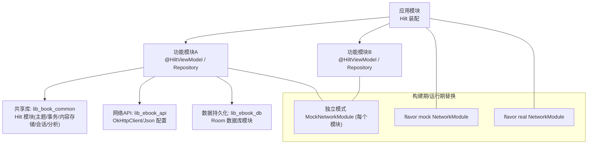
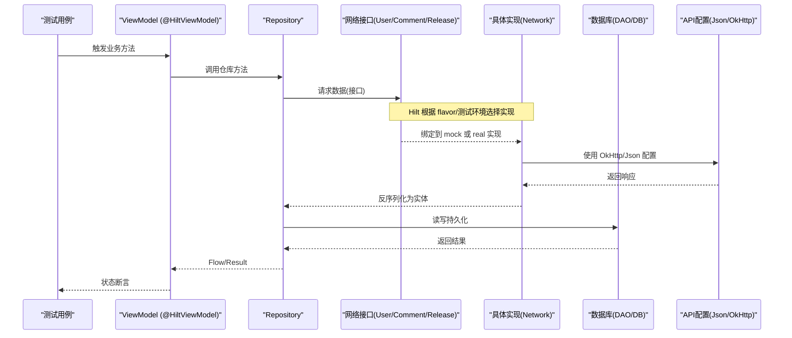
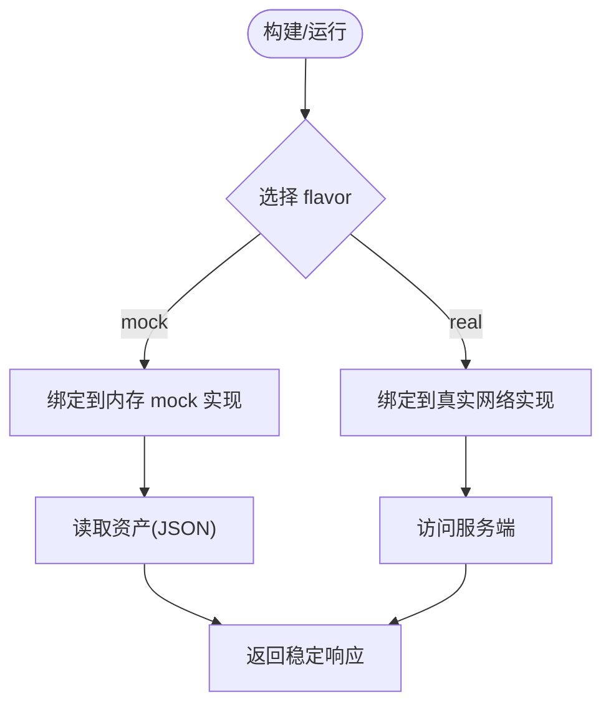
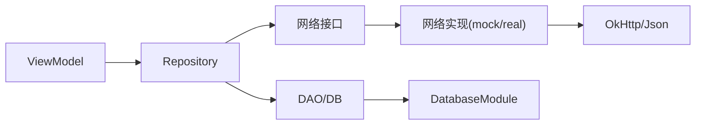

# 测试与模拟

<cite>
**本文引用的文件**   
- [module_app/src/mock/java/com/ebook/di/NetworkModule.kt](file://module_app/src/mock/java/com/ebook/di/NetworkModule.kt)
- [module_app/src/real/java/com/ebook/di/NetworkModule.kt](file://module_app/src/real/java/com/ebook/di/NetworkModule.kt)
- [lib_ebook_api/src/main/java/com/ebook/api/utils/NetworkModule.kt](file://lib_ebook_api/src/main/java/com/ebook/api/utils/NetworkModule.kt)
- [module_book/src/main/test/debug/MockNetworkModule.kt](file://module_book/src/main/test/debug/MockNetworkModule.kt)
- [module_main/src/main/test/debug/MockNetworkModule.kt](file://module_main/src/main/test/debug/MockNetworkModule.kt)
- [module_login/src/main/test/debug/MockNetworkModule.kt](file://module_login/src/main/test/debug/MockNetworkModule.kt)
- [module_find/src/main/test/debug/MockNetworkModule.kt](file://module_find/src/main/test/debug/MockNetworkModule.kt)
- [lib_book_common/src/test/java/com/ebook/common/repository/BookRepositoryTest.kt](file://lib_book_common/src/test/java/com/ebook/common/repository/BookRepositoryTest.kt)
- [module_book/src/test/java/com/ebook/book/mvvm/viewmodel/BookDetailViewModelSourceTest.kt](file://module_book/src/test/java/com/ebook/book/mvvm/viewmodel/BookDetailViewModelSourceTest.kt)
- [lib_book_common/src/main/java/com/ebook/common/di/ThemeModule.kt](file://lib_book_common/src/main/java/com/ebook/common/di/ThemeModule.kt)
- [lib_book_common/src/main/java/com/ebook/common/di/TransactionModule.kt](file://lib_book_common/src/main/java/com/ebook/common/di/TransactionModule.kt)
- [lib_book_common/src/main/java/com/ebook/common/di/ContentStoreModule.kt](file://lib_book_common/src/main/java/com/ebook/common/di/ContentStoreModule.kt)
- [lib_book_common/src/main/java/com/ebook/common/di/SandboxModule.kt](file://lib_book_common/src/main/java/com/ebook/common/di/SandboxModule.kt)
- [lib_book_common/src/main/java/com/ebook/common/di/AnalyzeModule.kt](file://lib_book_common/src/main/java/com/ebook/common/di/AnalyzeModule.kt)
- [lib_book_common/src/main/java/com/ebook/common/di/SessionModule.kt](file://lib_book_common/src/main/java/com/ebook/common/di/SessionModule.kt)
- [lib_ebook_db/src/main/java/com/ebook/db/di/DatabaseModule.kt](file://lib_ebook_db/src/main/java/com/ebook/db/di/DatabaseModule.kt)
- [build-logic/convention/src/main/kotlin/HiltConventionPlugin.kt](file://build-logic/convention/src/main/kotlin/HiltConventionPlugin.kt)
</cite>

## 目录
1. [简介](#简介)
2. [项目结构与测试布局](#项目结构与测试布局)
3. [核心组件与注入点](#核心组件与注入点)
4. [架构总览](#架构总览)
5. [详细组件分析](#详细组件分析)
6. [依赖关系分析](#依赖关系分析)
7. [性能考量](#性能考量)
8. [故障排查指南](#故障排查指南)
9. [结论](#结论)
10. [附录：测试用例清单与参考路径](#附录测试用例清单与参考路径)

## 简介
本文面向单元测试与集成测试，说明如何在当前 Android 多模块项目中基于 Hilt 进行依赖注入、Mock 替换与环境隔离。重点覆盖：
- 通过 product flavor 与 source set 切换网络层实现（mock/real）
- 在独立运行模式下为各功能模块提供测试专用 Mock 模块
- 使用假实现与内存对象替代数据库、网络、第三方服务
- 针对 ViewModel、Repository、服务层的测试组织方式
- 异步协程驱动与状态断言策略
- 测试环境的隔离与清理机制

## 项目结构与测试布局
- 应用入口与全局 Hilt 装配由应用模块负责；业务模块通过接口暴露能力，具体实现由 Hilt 模块绑定。
- 网络层通过 flavor 区分：`src/mock` 与 `src/real` 下的同名 `NetworkModule` 互斥绑定不同实现。
- 独立模块运行时，各模块的 `src/main/test/debug` 下提供测试专用 Mock 模块，参与编译并替换真实依赖。
- 单元测试集中在各模块 `src/test/java`；插桩测试在 `src/androidTest/java`。

图表来源
- [module_app/src/mock/java/com/ebook/di/NetworkModule.kt:1-37](file://module_app/src/mock/java/com/ebook/di/NetworkModule.kt#L1-L37)
- [module_app/src/real/java/com/ebook/di/NetworkModule.kt:1-35](file://module_app/src/real/java/com/ebook/di/NetworkModule.kt#L1-L35)
- [module_book/src/main/test/debug/MockNetworkModule.kt:1-27](file://module_book/src/main/test/debug/MockNetworkModule.kt#L1-L27)
- [module_main/src/main/test/debug/MockNetworkModule.kt](file://module_main/src/main/test/debug/MockNetworkModule.kt)
- [module_login/src/main/test/debug/MockNetworkModule.kt](file://module_login/src/main/test/debug/MockNetworkModule.kt)
- [module_find/src/main/test/debug/MockNetworkModule.kt](file://module_find/src/main/test/debug/MockNetworkModule.kt)
- [lib_ebook_api/src/main/java/com/ebook/api/utils/NetworkModule.kt:19-72](file://lib_ebook_api/src/main/java/com/ebook/api/utils/NetworkModule.kt#L19-L72)

章节来源
- [module_app/src/mock/java/com/ebook/di/NetworkModule.kt:1-37](file://module_app/src/mock/java/com/ebook/di/NetworkModule.kt#L1-L37)
- [module_app/src/real/java/com/ebook/di/NetworkModule.kt:1-35](file://module_app/src/real/java/com/ebook/di/NetworkModule.kt#L1-L35)
- [lib_ebook_api/src/main/java/com/ebook/api/utils/NetworkModule.kt:19-72](file://lib_ebook_api/src/main/java/com/ebook/api/utils/NetworkModule.kt#L19-L72)

## 核心组件与注入点
- 网络层：
  - `UserDataSource`、`CommentDataSource`、`ReleaseDataSource` 等接口由 Hilt 模块绑定到具体实现。
  - flavor `mock` 将接口绑定到基于 JSON 资产的测试实现；`real` 绑定到真实网络实现。
- 客户端与序列化：
  - `lib_ebook_api` 的 `NetworkModule` 提供 `Json`、`OkHttpClient`（书源纯净客户端、发布检查客户端）、以及认证允许主机集合。
- 数据库：
  - Room 相关由 `lib_ebook_db` 的 `DatabaseModule` 提供（例如 `AppDatabase`、DAO 等）。
- 共享能力：
  - `lib_book_common` 中提供主题、事务、内容存储、沙箱执行器、会话刷新、解析器等 Hilt 模块，统一装配跨模块能力。
- 独立模式测试：
  - 每个功能模块在 `src/main/test/debug` 提供 `MockNetworkModule`，用于独立调试 UI 时替换网络实现。

章节来源
- [lib_ebook_api/src/main/java/com/ebook/api/utils/NetworkModule.kt:19-72](file://lib_ebook_api/src/main/java/com/ebook/api/utils/NetworkModule.kt#L19-L72)
- [lib_ebook_db/src/main/java/com/ebook/db/di/DatabaseModule.kt](file://lib_ebook_db/src/main/java/com/ebook/db/di/DatabaseModule.kt)
- [lib_book_common/src/main/java/com/ebook/common/di/ThemeModule.kt](file://lib_book_common/src/main/java/com/ebook/common/di/ThemeModule.kt)
- [lib_book_common/src/main/java/com/ebook/common/di/TransactionModule.kt](file://lib_book_common/src/main/java/com/ebook/common/di/TransactionModule.kt)
- [lib_book_common/src/main/java/com/ebook/common/di/ContentStoreModule.kt](file://lib_book_common/src/main/java/com/ebook/common/di/ContentStoreModule.kt)
- [lib_book_common/src/main/java/com/ebook/common/di/SandboxModule.kt](file://lib_book_common/src/main/java/com/ebook/common/di/SandboxModule.kt)
- [lib_book_common/src/main/java/com/ebook/common/di/AnalyzeModule.kt](file://lib_book_common/src/main/java/com/ebook/common/di/AnalyzeModule.kt)
- [lib_book_common/src/main/java/com/ebook/common/di/SessionModule.kt](file://lib_book_common/src/main/java/com/ebook/common/di/SessionModule.kt)

## 架构总览
下图展示 Hilt 装配、flavor 替换与独立模式 Mock 的整体关系：

图表来源
- [module_app/src/mock/java/com/ebook/di/NetworkModule.kt:1-37](file://module_app/src/mock/java/com/ebook/di/NetworkModule.kt#L1-L37)
- [module_app/src/real/java/com/ebook/di/NetworkModule.kt:1-35](file://module_app/src/real/java/com/ebook/di/NetworkModule.kt#L1-L35)
- [lib_ebook_api/src/main/java/com/ebook/api/utils/NetworkModule.kt:19-72](file://lib_ebook_api/src/main/java/com/ebook/api/utils/NetworkModule.kt#L19-L72)

## 详细组件分析

### 网络层替换策略（flavor 与独立模式）
- 集成构建：
  - `mock` flavor：将网络接口绑定到内存 mock 实现（载荷来自 assets JSON），无需后端即可跑通全链路。
  - `real` flavor：将网络接口绑定到真实后端实现（基址由 BuildConfig 注入）。
- 独立模式：
  - 每个功能模块在 `src/main/test/debug` 提供 `MockNetworkModule`，仅在该模式编译时参与，使 UI 可独立调试而不依赖后端。

图表来源
- [module_app/src/mock/java/com/ebook/di/NetworkModule.kt:14-37](file://module_app/src/mock/java/com/ebook/di/NetworkModule.kt#L14-L37)
- [module_app/src/real/java/com/ebook/di/NetworkModule.kt:14-35](file://module_app/src/real/java/com/ebook/di/NetworkModule.kt#L14-L35)

章节来源
- [module_app/src/mock/java/com/ebook/di/NetworkModule.kt:14-37](file://module_app/src/mock/java/com/ebook/di/NetworkModule.kt#L14-L37)
- [module_app/src/real/java/com/ebook/di/NetworkModule.kt:14-35](file://module_app/src/real/java/com/ebook/di/NetworkModule.kt#L14-L35)
- [module_book/src/main/test/debug/MockNetworkModule.kt:12-27](file://module_book/src/main/test/debug/MockNetworkModule.kt#L12-L27)
- [module_main/src/main/test/debug/MockNetworkModule.kt](file://module_main/src/main/test/debug/MockNetworkModule.kt)
- [module_login/src/main/test/debug/MockNetworkModule.kt](file://module_login/src/main/test/debug/MockNetworkModule.kt)
- [module_find/src/main/test/debug/MockNetworkModule.kt](file://module_find/src/main/test/debug/MockNetworkModule.kt)

### 客户端与序列化配置
- `Json`：开启美化输出与忽略未知字段，便于调试与兼容。
- `OkHttpClient`：
  - 书源客户端：纯净、短超时、带编码拦截器，避免 token 泄漏给第三方站点。
  - 发布检查客户端：面向公开 Releases API，不带 token。
- 认证主机白名单：集中管理可信域名，便于拦截器生效范围控制。

章节来源
- [lib_ebook_api/src/main/java/com/ebook/api/utils/NetworkModule.kt:19-72](file://lib_ebook_api/src/main/java/com/ebook/api/utils/NetworkModule.kt#L19-L72)

### 数据库与 DAO 测试
- 数据库由 `lib_ebook_db` 的 Hilt 模块提供；DAO 可通过假实现或内存实例进行测试。
- 单元测试示例：
  - `BookRepositoryTest`：直接构造 Repository，使用假 DAO 与临时目录隔离书籍文件，验证级联写入、事件总线、补章等逻辑。
  - DAO 层测试：对 `BookInfoDao`、`BookSourceDao`、`PausedBookDao`、`SearchHistoryDao` 等进行表结构与迁移验证。

章节来源
- [lib_book_common/src/test/java/com/ebook/common/repository/BookRepositoryTest.kt:35-82](file://lib_book_common/src/test/java/com/ebook/common/repository/BookRepositoryTest.kt#L35-L82)
- [lib_ebook_db/src/main/java/com/ebook/db/di/DatabaseModule.kt](file://lib_ebook_db/src/main/java/com/ebook/db/di/DatabaseModule.kt)

### ViewModel 测试（按书绑源）
- `BookDetailViewModelSourceTest`：使用 Robolectric 提供 Context，验证详情页解析严格依据“书的 tag”选择 parser，并在失败时正确进入错误态。
- 通过注入假 BookSourceManager 与空 DAO 替身，聚焦“选源逻辑”，不重复校验仓库层行为。

章节来源
- [module_book/src/test/java/com/ebook/book/mvvm/viewmodel/BookDetailViewModelSourceTest.kt:50-100](file://module_book/src/test/java/com/ebook/book/mvvm/viewmodel/BookDetailViewModelSourceTest.kt#L50-L100)

### 共享 Hilt 模块与测试影响
- 主题、事务、内容存储、沙箱执行器、会话刷新、解析器等由共享模块提供，确保跨模块一致性。
- 测试中若需替换某项能力（如沙箱执行器、事务执行器），可在测试 source set 新增对应模块绑定，或通过假实现注入。

章节来源
- [lib_book_common/src/main/java/com/ebook/common/di/ThemeModule.kt](file://lib_book_common/src/main/java/com/ebook/common/di/ThemeModule.kt)
- [lib_book_common/src/main/java/com/ebook/common/di/TransactionModule.kt](file://lib_book_common/src/main/java/com/ebook/common/di/TransactionModule.kt)
- [lib_book_common/src/main/java/com/ebook/common/di/ContentStoreModule.kt](file://lib_book_common/src/main/java/com/ebook/common/di/ContentStoreModule.kt)
- [lib_book_common/src/main/java/com/ebook/common/di/SandboxModule.kt](file://lib_book_common/src/main/java/com/ebook/common/di/SandboxModule.kt)
- [lib_book_common/src/main/java/com/ebook/common/di/AnalyzeModule.kt](file://lib_book_common/src/main/java/com/ebook/common/di/AnalyzeModule.kt)
- [lib_book_common/src/main/java/com/ebook/common/di/SessionModule.kt](file://lib_book_common/src/main/java/com/ebook/common/di/SessionModule.kt)

## 依赖关系分析
- 耦合与内聚：
  - 业务模块依赖共享库与 API/DB 模块；网络实现通过 Hilt 模块解耦，便于替换。
  - 测试通过假实现与内存对象降低对外部系统依赖，提升稳定性与速度。
- 外部依赖与集成点：
  - Retrofit/OkHttp：通过 `NetworkModule` 提供的客户端注入。
  - Room：通过 `DatabaseModule` 注入数据库与 DAO。
  - 沙箱执行器：由共享模块装配，测试中可按需替换。

图表来源
- [lib_ebook_api/src/main/java/com/ebook/api/utils/NetworkModule.kt:19-72](file://lib_ebook_api/src/main/java/com/ebook/api/utils/NetworkModule.kt#L19-L72)
- [lib_ebook_db/src/main/java/com/ebook/db/di/DatabaseModule.kt](file://lib_ebook_db/src/main/java/com/ebook/db/di/DatabaseModule.kt)

章节来源
- [lib_ebook_api/src/main/java/com/ebook/api/utils/NetworkModule.kt:19-72](file://lib_ebook_api/src/main/java/com/ebook/api/utils/NetworkModule.kt#L19-L72)
- [lib_ebook_db/src/main/java/com/ebook/db/di/DatabaseModule.kt](file://lib_ebook_db/src/main/java/com/ebook/db/di/DatabaseModule.kt)

## 性能考量
- 单元测试优先使用假实现与内存对象，避免真实 I/O 与网络开销。
- 使用协程测试工具（如 `runTest`、`StandardTestDispatcher`）驱动异步流程，缩短测试时间。
- 资源隔离（如临时目录）避免用例间相互污染，减少清理成本。

[本节为通用指导，不直接分析具体文件]

## 故障排查指南
- 页面加载不出数据且无崩溃：
  - 检查是否使用了正确的 flavor 与网络模块绑定；确认 mock 资产形态与反序列化类型一致。
  - 核对认证主机白名单与拦截器配置，避免 token 误传或编码问题。
- 资源缺失导致异常：
  - 独立模式需要 Context 的场景（如 string 资源）应使用 Robolectric 或测试宿主提供。
- 测试不稳定：
  - 确认协程调度器设置与恢复（`setMain`/`resetMain`），避免主线程干扰。
  - 使用 `TemporaryFolder` 隔离文件系统，避免用例间互相影响。

章节来源
- [module_book/src/test/java/com/ebook/book/mvvm/viewmodel/BookDetailViewModelSourceTest.kt:64-86](file://module_book/src/test/java/com/ebook/book/mvvm/viewmodel/BookDetailViewModelSourceTest.kt#L64-L86)
- [lib_book_common/src/test/java/com/ebook/common/repository/BookRepositoryTest.kt:53-82](file://lib_book_common/src/test/java/com/ebook/common/repository/BookRepositoryTest.kt#L53-L82)

## 结论
本项目通过 Hilt 模块、flavor 与独立模式 Mock 的组合，实现了灵活的依赖替换与环境隔离。测试围绕接口与假实现展开，避免了对外部系统的强依赖，提升了速度与稳定性。结合协程测试工具与资源隔离，能够高效覆盖 ViewModel、Repository 与服务层的关键路径。

[本节为总结性内容，不直接分析具体文件]

## 附录：测试用例清单与参考路径
- 单元测试（JVM）
  - Repository：`lib_book_common/src/test/java/com/ebook/common/repository/BookRepositoryTest.kt`
  - ViewModel（按书绑源）：`module_book/src/test/java/com/ebook/book/mvvm/viewmodel/BookDetailViewModelSourceTest.kt`
  - DAO/Schema：`lib_ebook_db/src/test/java/com/ebook/db/dao/*`、`lib_ebook_db/src/test/java/com/ebook/db/AppDatabaseSchemaTest.kt`
- 插桩测试（Android）
  - 各模块 `androidTest` 目录下的基础用例与基线测试

章节来源
- [lib_book_common/src/test/java/com/ebook/common/repository/BookRepositoryTest.kt:35-82](file://lib_book_common/src/test/java/com/ebook/common/repository/BookRepositoryTest.kt#L35-L82)
- [module_book/src/test/java/com/ebook/book/mvvm/viewmodel/BookDetailViewModelSourceTest.kt:50-100](file://module_book/src/test/java/com/ebook/book/mvvm/viewmodel/BookDetailViewModelSourceTest.kt#L50-L100)