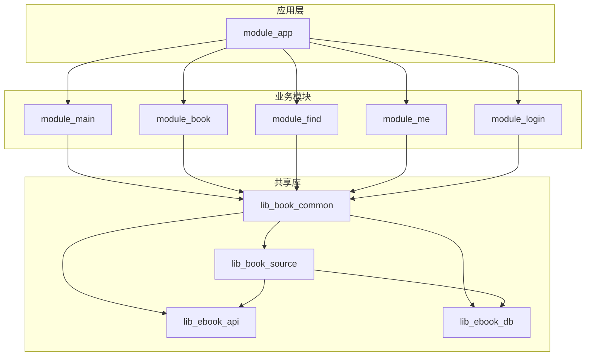
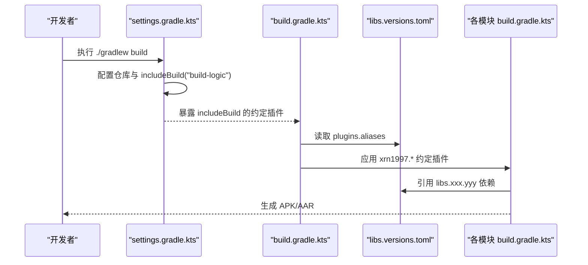
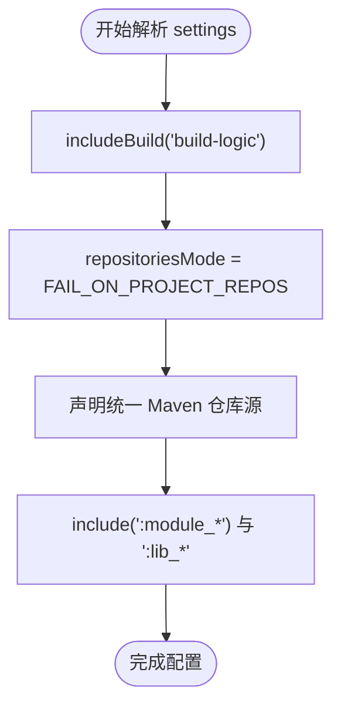
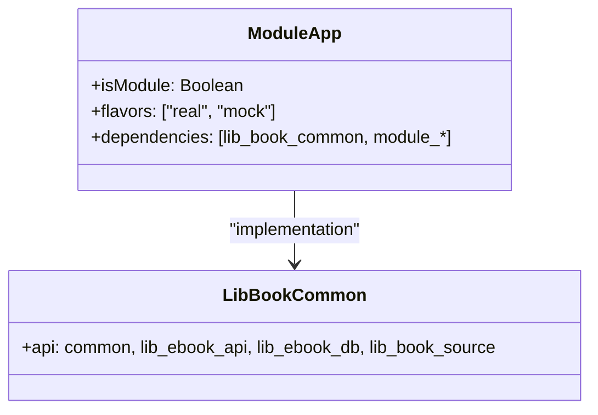
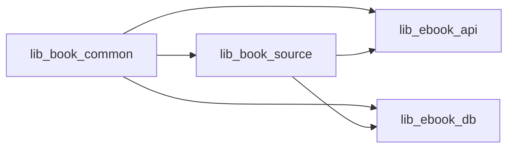
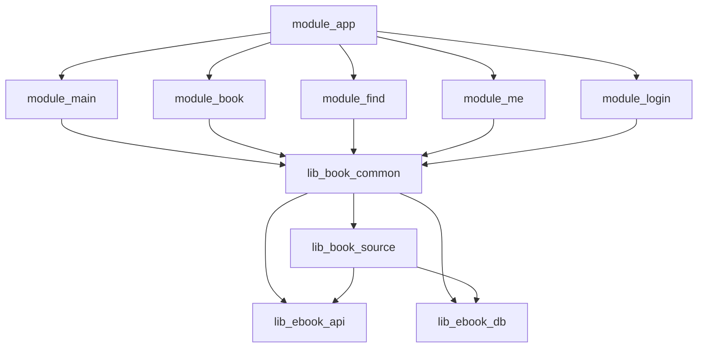

# Gradle项目结构

<cite>
**本文引用的文件**
- [settings.gradle.kts](file://settings.gradle.kts)
- [build.gradle.kts](file://build.gradle.kts)
- [gradle/libs.versions.toml](file://gradle/libs.versions.toml)
- [module_app/build.gradle.kts](file://module_app/build.gradle.kts)
- [module_main/build.gradle.kts](file://module_main/build.gradle.kts)
- [module_book/build.gradle.kts](file://module_book/build.gradle.kts)
- [lib_book_common/build.gradle.kts](file://lib_book_common/build.gradle.kts)
- [lib_book_source/build.gradle.kts](file://lib_book_source/build.gradle.kts)
- [lib_ebook_api/build.gradle.kts](file://lib_ebook_api/build.gradle.kts)
- [lib_ebook_db/build.gradle.kts](file://lib_ebook_db/build.gradle.kts)
</cite>

## 目录
1. [简介](#简介)
2. [项目结构](#项目结构)
3. [核心组件](#核心组件)
4. [架构总览](#架构总览)
5. [详细组件分析](#详细组件分析)
6. [依赖关系分析](#依赖关系分析)
7. [性能与构建优化](#性能与构建优化)
8. [故障排查指南](#故障排查指南)
9. [结论](#结论)

## 简介
本仓库是一个基于 Android 的多模块电子书阅读器项目，采用 Kotlin + Compose + Hilt + Room + Retrofit 技术栈。项目通过根级 Gradle 配置、版本目录和自定义约定插件（build-logic）实现统一的构建流程、依赖管理与多模块组织。本文将聚焦于：
- settings.gradle.kts 中的 includeBuild 机制与模块声明
- 根级 build.gradle.kts 的插件与全局配置
- gradle/libs.versions.toml 的版本统一管理策略
- 模块间的依赖传递规则与排除策略
- 最佳实践与常见问题解决方案

## 项目结构
项目采用“业务功能模块 + 共享基础库”的分层组织方式：
- 应用入口：module_app
- 业务功能模块：module_main、module_book、module_find、module_me、module_login
- 共享基础库：lib_book_common、lib_book_source、lib_ebook_api、lib_ebook_db
- 构建逻辑：build-logic（自定义约定插件）、gradle/libs.versions.toml（版本目录）

**图表来源**
- [settings.gradle.kts:56-65](file://settings.gradle.kts#L56-L65)
- [module_app/build.gradle.kts:48-58](file://module_app/build.gradle.kts#L48-L58)
- [lib_book_common/build.gradle.kts:37-44](file://lib_book_common/build.gradle.kts#L37-L44)

**章节来源**
- [settings.gradle.kts:56-65](file://settings.gradle.kts#L56-L65)

## 核心组件
- 根构建脚本：统一声明所有插件并启用模块图插件
- 版本目录：集中管理所有第三方库版本
- 约定插件：封装 Android/Compose/Hilt/Room/Native 等通用构建逻辑
- 模块依赖：遵循“业务 → 共享库 → 基础库”的单向依赖原则

**章节来源**
- [build.gradle.kts:1-15](file://build.gradle.kts#L1-L15)
- [gradle/libs.versions.toml:1-238](file://gradle/libs.versions.toml#L1-L238)

## 架构总览
下图展示了 Gradle 构建系统的核心交互：settings 管理仓库与 includeBuild，根 build 声明插件，版本目录提供版本别名，各模块通过约定插件获得统一配置。

**图表来源**
- [settings.gradle.kts:4-26](file://settings.gradle.kts#L4-L26)
- [build.gradle.kts:1-15](file://build.gradle.kts#L1-L15)
- [gradle/libs.versions.toml:214-238](file://gradle/libs.versions.toml#L214-L238)

## 详细组件分析

### settings.gradle.kts：includeBuild 与模块声明
- includeBuild("build-logic")：将 build-logic 作为独立构建包含进来，使其提供的约定插件对主工程可用
- dependencyResolutionManagement.repositoriesMode = FAIL_ON_PROJECT_REPOS：强制所有依赖解析走根仓库，禁止在子模块中重复声明仓库
- 模块声明：使用 include(":module_name") 注册所有模块，确保 Gradle 能识别它们

**图表来源**
- [settings.gradle.kts:4-43](file://settings.gradle.kts#L4-L43)
- [settings.gradle.kts:56-65](file://settings.gradle.kts#L56-L65)

**章节来源**
- [settings.gradle.kts:4-43](file://settings.gradle.kts#L4-L43)
- [settings.gradle.kts:56-65](file://settings.gradle.kts#L56-L65)

### 根级 build.gradle.kts：插件版本管理
- 使用 alias(libs.plugins.*) 声明所有插件，版本来自 libs.versions.toml
- 仅声明 apply false，避免在根级别过早应用
- 启用 module.graph 插件用于构建时模块依赖图校验

**章节来源**
- [build.gradle.kts:1-15](file://build.gradle.kts#L1-L15)
- [gradle/libs.versions.toml:214-238](file://gradle/libs.versions.toml#L214-L238)

### gradle/libs.versions.toml：版本统一管理策略
- versions 段：定义所有版本号，如 AGP、Kotlin、Compose、Hilt、Retrofit 等
- libraries 段：将 group:name 与版本关联，提供 libs.xxx.yyy 引用
- bundles 段：聚合常用依赖组，如 Compose UI 测试套件
- plugins 段：声明插件 ID 与版本，供根 build 使用
- 自定义插件 ID：xrn1997.* 指向 build-logic 提供的约定插件

升级流程建议：
1. 修改 versions 段中的版本号
2. 检查是否有 API 不兼容变更
3. 运行 ./gradlew build 验证
4. 更新相关文档或 ADR

**章节来源**
- [gradle/libs.versions.toml:1-71](file://gradle/libs.versions.toml#L1-L71)
- [gradle/libs.versions.toml:72-213](file://gradle/libs.versions.toml#L72-L213)
- [gradle/libs.versions.toml:214-238](file://gradle/libs.versions.toml#L214-L238)

### 模块依赖关系与传递规则

#### 应用模块（module_app）
- 依赖 lib_book_common
- 根据 isModule 标志决定是否依赖各业务模块
- 支持 product flavor（real/mock）切换后端

**图表来源**
- [module_app/build.gradle.kts:47-58](file://module_app/build.gradle.kts#L47-L58)
- [lib_book_common/build.gradle.kts:37-44](file://lib_book_common/build.gradle.kts#L37-L44)

**章节来源**
- [module_app/build.gradle.kts:47-58](file://module_app/build.gradle.kts#L47-L58)

#### 业务模块（module_main/module_book 等）
- 统一使用 xrn1997.android.component 约定插件
- 依赖 lib_book_common
- 根据 isModule 决定混淆策略与 consumerProguardFiles

**章节来源**
- [module_main/build.gradle.kts:10-35](file://module_main/build.gradle.kts#L10-L35)
- [module_book/build.gradle.kts:9-35](file://module_book/build.gradle.kts#L9-L35)

#### 共享库（lib_book_common/lib_book_source/lib_ebook_api/lib_ebook_db）
- lib_book_common：核心共享层，依赖其他三个库并通过 api 暴露
- lib_book_source：书源解析层，依赖 lib_ebook_api 和 lib_ebook_db
- lib_ebook_api：网络层，依赖 Retrofit、OkHttp、JSoup
- lib_ebook_db：数据层，依赖 Room、SQLite

**图表来源**
- [lib_book_common/build.gradle.kts:37-44](file://lib_book_common/build.gradle.kts#L37-L44)
- [lib_book_source/build.gradle.kts:33-52](file://lib_book_source/build.gradle.kts#L33-L52)
- [lib_ebook_api/build.gradle.kts:40-64](file://lib_ebook_api/build.gradle.kts#L40-L64)
- [lib_ebook_db/build.gradle.kts:29-51](file://lib_ebook_db/build.gradle.kts#L29-L51)

**章节来源**
- [lib_book_common/build.gradle.kts:37-44](file://lib_book_common/build.gradle.kts#L37-L44)
- [lib_book_source/build.gradle.kts:33-52](file://lib_book_source/build.gradle.kts#L33-L52)
- [lib_ebook_api/build.gradle.kts:40-64](file://lib_ebook_api/build.gradle.kts#L40-L64)
- [lib_ebook_db/build.gradle.kts:29-51](file://lib_ebook_db/build.gradle.kts#L29-L51)

### 依赖传递与排除策略
- 使用 api 暴露公共接口：lib_book_common 对 lib_ebook_api/db/source 使用 api，使业务模块可直接编译
- 使用 implementation 隐藏内部依赖：lib_book_source 对 jsoup/json 使用 implementation，避免污染下游类路径
- 通过版本目录统一管理：所有依赖版本集中在 libs.versions.toml，避免版本冲突

最佳实践：
- 公共 API 用 api，内部实现用 implementation
- 依赖版本统一通过版本目录引用
- 避免循环依赖：业务模块只依赖 lib_book_common

**章节来源**
- [lib_book_common/build.gradle.kts:37-44](file://lib_book_common/build.gradle.kts#L37-L44)
- [lib_book_source/build.gradle.kts:33-52](file://lib_book_source/build.gradle.kts#L33-L52)

## 依赖关系分析
下图展示了模块间的依赖方向，确保无环依赖且符合分层架构：

**图表来源**
- [module_app/build.gradle.kts:48-58](file://module_app/build.gradle.kts#L48-L58)
- [lib_book_common/build.gradle.kts:37-44](file://lib_book_common/build.gradle.kts#L37-L44)
- [lib_book_source/build.gradle.kts:33-36](file://lib_book_source/build.gradle.kts#L33-L36)

**章节来源**
- [module_app/build.gradle.kts:48-58](file://module_app/build.gradle.kts#L48-L58)
- [lib_book_common/build.gradle.kts:37-44](file://lib_book_common/build.gradle.kts#L37-L44)
- [lib_book_source/build.gradle.kts:33-36](file://lib_book_source/build.gradle.kts#L33-L36)

## 性能与构建优化
- 使用版本目录减少重复配置，提升维护性
- 通过约定插件统一构建选项，减少模块间差异
- 启用 R8 混淆仅在独立模式开启，避免 library 被错误剥离
- 使用 compose BOM 管理 Compose 依赖版本一致性
- 通过 includeBuild 实现本地联调，加速开发迭代

优化建议：
- 定期清理未使用的依赖
- 使用 Gradle 并行构建和守护进程
- 合理划分模块粒度，避免过度拆分

## 故障排查指南
常见问题及解决方案：
1. **仓库解析失败**：检查 settings.gradle.kts 中的仓库配置，确保网络可达
2. **版本冲突**：统一通过 libs.versions.toml 管理版本，避免硬编码
3. **依赖传递问题**：确认 api/implementation 使用正确，避免不必要暴露
4. **模块找不到**：检查 settings.gradle.kts 中的 include 声明
5. **构建速度慢**：启用 Gradle 缓存、并行构建，合理使用 includeBuild

**章节来源**
- [settings.gradle.kts:4-43](file://settings.gradle.kts#L4-L43)
- [gradle/libs.versions.toml:1-238](file://gradle/libs.versions.toml#L1-L238)

## 结论
本项目通过 Gradle 多模块架构实现了清晰的代码组织和统一的构建管理。settings.gradle.kts 中的 includeBuild 机制使得自定义构建逻辑可复用，版本目录确保了依赖的一致性，约定插件简化了模块配置。遵循依赖传递的最佳实践，项目具备良好的可维护性和扩展性。

建议团队继续：
- 保持版本目录的及时更新
- 严格遵循依赖传递规则
- 定期重构和优化模块边界
- 完善构建脚本的注释和文档