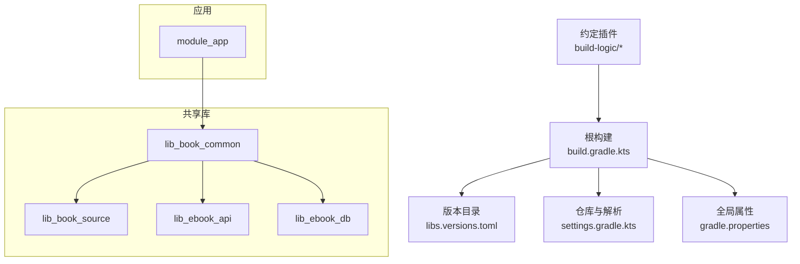
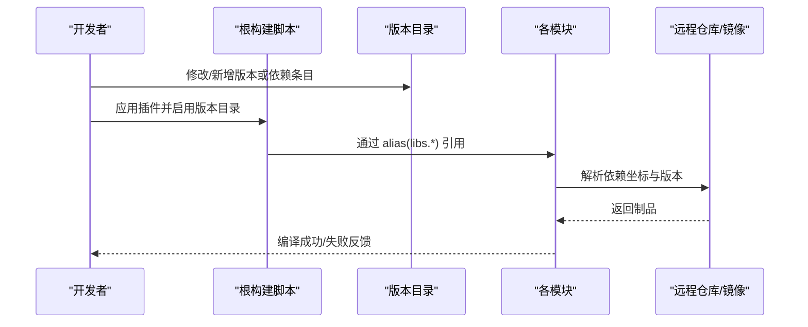
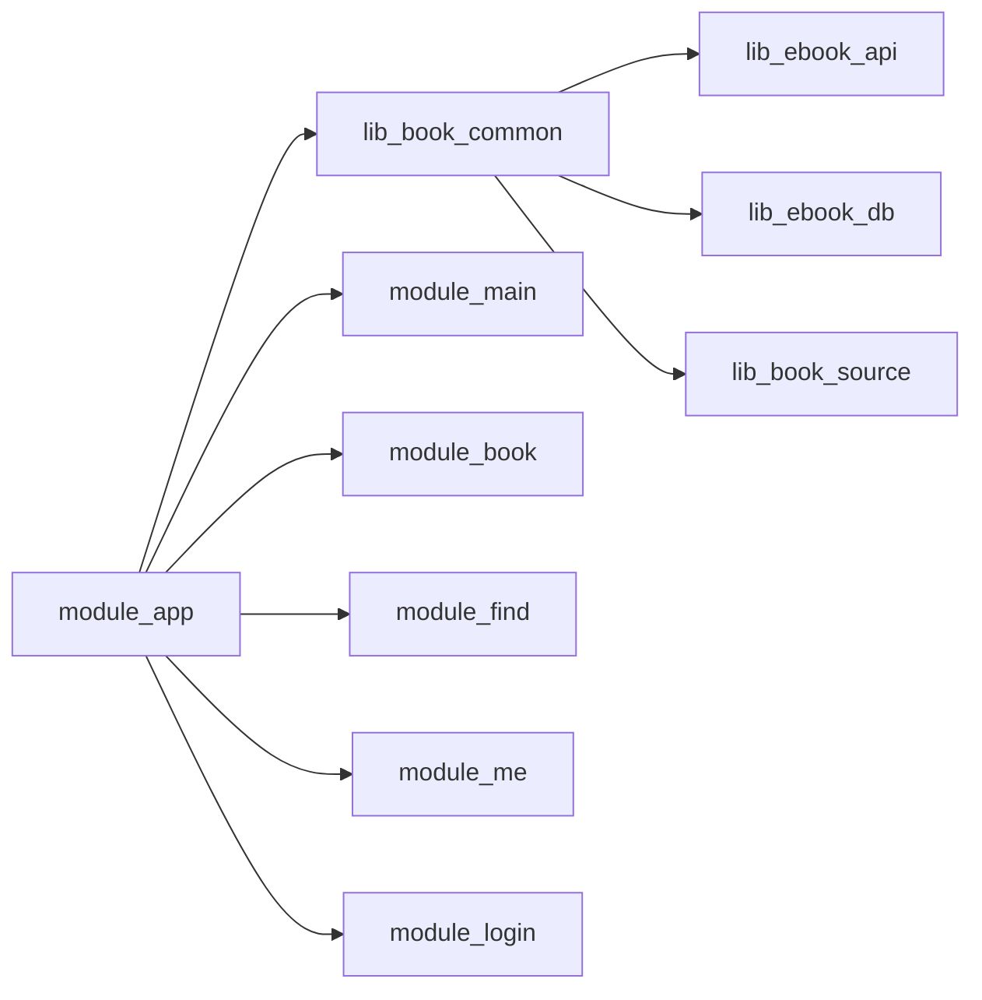

# 依赖管理

<cite>
**本文引用的文件**
- [gradle/libs.versions.toml](file://gradle/libs.versions.toml)
- [settings.gradle.kts](file://settings.gradle.kts)
- [build.gradle.kts](file://build.gradle.kts)
- [gradle.properties](file://gradle.properties)
- [module_app/build.gradle.kts](file://module_app/build.gradle.kts)
- [lib_book_common/build.gradle.kts](file://lib_book_common/build.gradle.kts)
- [lib_ebook_api/build.gradle.kts](file://lib_ebook_api/build.gradle.kts)
- [AndroidApplicationConventionPlugin.kt](file://build-logic/convention/src/main/kotlin/AndroidApplicationConventionPlugin.kt)
</cite>

## 目录
1. [简介](#简介)
2. [项目结构](#项目结构)
3. [核心组件](#核心组件)
4. [架构总览](#架构总览)
5. [详细组件分析](#详细组件分析)
6. [依赖关系分析](#依赖关系分析)
7. [性能与优化建议](#性能与优化建议)
8. [故障排查指南](#故障排查指南)
9. [结论](#结论)
10. [附录](#附录)

## 简介
本文件面向本多模块 Android 项目的依赖管理，聚焦于“统一版本、集中声明、按模块按需引入、传递依赖治理、冲突检测与解决、第三方库引入与升级流程、安全扫描”等主题。本项目采用 Gradle 版本目录（Version Catalog）统一管理所有第三方库与工具链版本，并通过约定插件收敛构建配置；模块间通过清晰的 api/implementation 边界控制可见性与传递性，从而降低耦合、提升可维护性与编译速度。

## 项目结构
- 版本与仓库定义集中在根级脚本与版本目录：
  - 版本目录：gradle/libs.versions.toml
  - 仓库源与解析策略：settings.gradle.kts
  - 根插件声明：build.gradle.kts
  - 全局构建属性：gradle.properties
- 约定插件：build-logic 提供 xrn1997.* 系列插件，统一 AGP/KSP/Compose/Hilt/Room 等工程化配置。
- 业务模块：module_app/module_main/module_book/module_find/module_me/module_login
- 共享库：lib_book_common/lib_book_source/lib_ebook_api/lib_ebook_db

图表来源
- [build.gradle.kts:1-15](file://build.gradle.kts#L1-L15)
- [settings.gradle.kts:28-43](file://settings.gradle.kts#L28-L43)
- [gradle/libs.versions.toml:1-237](file://gradle/libs.versions.toml#L1-L237)

章节来源
- [settings.gradle.kts:28-43](file://settings.gradle.kts#L28-L43)
- [build.gradle.kts:1-15](file://build.gradle.kts#L1-L15)
- [gradle/libs.versions.toml:1-237](file://gradle/libs.versions.toml#L1-L237)
- [gradle.properties:16-36](file://gradle.properties#L16-L36)

## 核心组件
- 版本目录（libs.versions.toml）
  - 统一管理版本号、依赖分组（bundles）、平台特定依赖、Gradle 插件版本与 ID。
  - 使用 ref 引用版本，避免硬编码；通过 alias(libs.xxx) 在模块中引用。
- 仓库与解析（settings.gradle.kts）
  - 通过 dependencyResolutionManagement 强制单一仓库源策略（FAIL_ON_PROJECT_REPOS），集中配置 Maven/GitHub/JitPack/阿里云镜像等。
  - 包含 build-logic 与所有子模块。
- 约定插件（build-logic）
  - 统一 AGP 目标 SDK、Kotlin/Compose/Hilt/Room 配置，屏蔽各模块差异，减少重复配置。
- 模块依赖声明
  - 模块内仅通过 libs.* 与 project(":...") 声明依赖，不写死版本；通过 api/implementation 控制传递性。

章节来源
- [gradle/libs.versions.toml:1-237](file://gradle/libs.versions.toml#L1-L237)
- [settings.gradle.kts:28-43](file://settings.gradle.kts#L28-L43)
- [AndroidApplicationConventionPlugin.kt:28-49](file://build-logic/convention/src/main/kotlin/AndroidApplicationConventionPlugin.kt#L28-L49)

## 架构总览
下图展示版本目录如何驱动整个工程的依赖解析与模块装配：

图表来源
- [build.gradle.kts:1-15](file://build.gradle.kts#L1-L15)
- [gradle/libs.versions.toml:75-227](file://gradle/libs.versions.toml#L75-L227)
- [settings.gradle.kts:28-43](file://settings.gradle.kts#L28-L43)

## 详细组件分析

### 版本目录（libs.versions.toml）
- 版本段（[versions]）
  - 集中声明 AGP、Kotlin、AndroidX、Hilt、Room、Retrofit、OkHttp、Coil、Jsoup、Protobuf 等全部版本，便于统一升级。
- 分组段（[bundles]）
  - 将测试 UI 相关 Compose 测试依赖打包为 bundle，便于在需要时整体引入。
- 库段（[libraries]）
  - 以语义化名称组织依赖，如 androidx-*、hilt-*、retrofit-*、coil-*、jsoup-*、room-* 等。
  - 支持同一库不同变体（如 sqlite-bundled vs sqlite-bundled-jvm）。
- 插件段（[plugins]）
  - 统一管理 Android/Kotlin/Compose/Hilt/KSP/Room/Router 等插件 ID 与版本。
  - 同时声明项目自定义插件 ID（xrn1997.*）。

使用方式
- 在模块中通过 alias(libs.plugins.xxx) 应用插件。
- 通过 alias(libs.libs.xxx) 或 libs.xxx.yyy 形式引用库。
- 通过 platform(libs.androidx.compose.bom) 引入 Compose BOM，确保 Compose 生态版本一致。

章节来源
- [gradle/libs.versions.toml:1-237](file://gradle/libs.versions.toml#L1-L237)

### 仓库与依赖解析策略（settings.gradle.kts）
- 使用 dependencyResolutionManagement 集中声明仓库，并设置 repositoriesMode=FAIL_ON_PROJECT_REPOS，禁止在各模块私自添加仓库，保证解析一致性。
- 优先使用国内镜像加速 Google/MavenCentral/Gradle Plugin Portal 等访问，同时保留官方仓库作为兜底。
- 包含 build-logic 与所有模块，使构建逻辑与业务解耦。

章节来源
- [settings.gradle.kts:28-43](file://settings.gradle.kts#L28-L43)

### 模块依赖声明与传递依赖策略
- module_app
  - 依赖 lib_book_common 以及若干功能模块（集成态），通过 implementation 限制传递性。
  - 使用 flavor 区分 real/mock，便于联调与离线开发。
- lib_book_common
  - 作为共享层，通过 api 暴露公共 API（AppCompat、Material、Activity/Fragment/Lifecycle、Compose 基础库、Router、Dagger/Hilt、Jsoup、Retrofit converter 等）。
  - 通过 implementation 隐藏内部实现细节（如 kotlinx-serialization-json），减少下游耦合。
  - 通过 testImplementation/androidTestImplementation 限定测试依赖范围。
- lib_ebook_api
  - 网络层公开 Retrofit/OkHttp/JSON 序列化等能力（api），同时内部使用 kotlinx-serialization-json（implementation）。

传递依赖治理要点
- 对外稳定接口使用 api，内部实现细节使用 implementation，避免不必要传递。
- 对易产生版本冲突的库（如 Kotlin 标准库、AndroidX、Compose BOM）尽量由上层统一引入或通过 BOM 锁定。
- 测试依赖严格限定在测试 source set，避免污染主构建产物。

章节来源
- [module_app/build.gradle.kts:48-64](file://module_app/build.gradle.kts#L48-L64)
- [lib_book_common/build.gradle.kts:37-95](file://lib_book_common/build.gradle.kts#L37-L95)
- [lib_ebook_api/build.gradle.kts:40-64](file://lib_ebook_api/build.gradle.kts#L40-L64)

### 平台特定依赖与原生构建
- 通过 libs.versions.toml 的同一库不同变体（如 sqlite-bundled vs sqlite-bundled-jvm）满足 Android 与 JVM 单测的不同需求。
- 原生构建（C++/QuickJS）通过 build-logic 的 native 约定插件管理 ABI 与 NDK 版本，NDK 固定以避免跨机器不一致。

章节来源
- [gradle/libs.versions.toml:197-212](file://gradle/libs.versions.toml#L197-L212)
- [AndroidApplicationConventionPlugin.kt:28-49](file://build-logic/convention/src/main/kotlin/AndroidApplicationConventionPlugin.kt#L28-L49)

### 第三方库引入流程
- 步骤
  1. 在 gradle/libs.versions.toml 的 [versions] 中新增/更新版本号。
  2. 在 [libraries] 中新增依赖条目（若为新库）。
  3. 在需要的模块中通过 alias(libs.libs.xxx) 引入，优先使用 implementation，仅在需要向上透传时使用 api。
  4. 如需新插件，在 [plugins] 中添加 id 与版本，并在模块中使用 alias(libs.plugins.xxx)。
  5. 运行 ./gradlew build 验证，必要时补充 consumer-rules.pro 混淆规则。
- 注意事项
  - 优先通过 BOM 管理（如 Compose BOM），减少版本碎片。
  - 对于可能带来体积膨胀的调试库（如 LeakCanary），使用 debugApi 或条件开关控制。

章节来源
- [gradle/libs.versions.toml:1-237](file://gradle/libs.versions.toml#L1-L237)
- [lib_book_common/build.gradle.kts:64-95](file://lib_book_common/build.gradle.kts#L64-L95)

### 依赖升级步骤
- 小版本升级（Patch/Minor）
  - 更新 libs.versions.toml 对应版本，全仓构建验证无回归。
- 大版本升级（Major）
  - 评估破坏性变更（API 变化、行为变更）。
  - 分模块逐步升级，配合测试用例与 Lint/编译检查。
  - 必要时调整依赖声明（api/implementation）或替换方案。
- 升级后检查清单
  - 编译通过、单元测试通过、UI 页面可用、Proguard/R8 规则有效、包体积未异常增长。

章节来源
- [gradle/libs.versions.toml:1-237](file://gradle/libs.versions.toml#L1-L237)

### 依赖冲突检测与解决机制
- 检测
  - 使用 Gradle 依赖报告命令生成冲突信息（例如查看重复依赖与版本分歧）。
  - 结合 Lint/编译错误提示定位问题点。
- 解决策略
  - 优先统一版本至最新版本或兼容版本（通过版本目录）。
  - 对不必要的传递依赖使用 implementation 阻断。
  - 对特定库使用 exclude 或 force（谨慎使用）。
  - 针对同库不同变体（如 sqlite-bundled/jvm）明确选择合适变体。

章节来源
- [settings.gradle.kts:28-43](file://settings.gradle.kts#L28-L43)
- [gradle/libs.versions.toml:197-212](file://gradle/libs.versions.toml#L197-L212)

### 依赖优化建议
- 按需引入
  - 使用 implementation 而非 api，减少下游耦合与编译时间。
  - 对 Compose 等重依赖使用 BOM 管理，避免重复引入。
- 避免重复依赖
  - 通过版本目录统一版本，避免多处硬编码。
  - 使用 exclude 剔除不必要的传递依赖。
- 模块化隔离
  - 测试依赖严格限定在测试 source set，不影响主构建。
  - 对大型库（如图片加载、网络栈）只在必要模块引入。

章节来源
- [lib_book_common/build.gradle.kts:37-95](file://lib_book_common/build.gradle.kts#L37-L95)
- [gradle/libs.versions.toml:72-110](file://gradle/libs.versions.toml#L72-L110)

### 依赖安全检查与漏洞扫描
- 建议实践
  - 引入依赖前审查其许可证与安全性记录。
  - 在 CI 中加入依赖安全扫描任务（如 OWASP Dependency Check），定期产出报告。
  - 对关键依赖建立白名单与升级策略，避免引入未知风险。
- 本地与 CI 联动
  - 本地先跑扫描，确认无高危漏洞后再提交。
  - CI 失败阻断合并，确保基线安全。

[本节为通用指导，不直接分析具体文件]

## 依赖关系分析
下图展示主要模块间的依赖方向与共享库职责：

图表来源
- [module_app/build.gradle.kts:48-64](file://module_app/build.gradle.kts#L48-L64)
- [lib_book_common/build.gradle.kts:37-95](file://lib_book_common/build.gradle.kts#L37-L95)

章节来源
- [module_app/build.gradle.kts:48-64](file://module_app/build.gradle.kts#L48-L64)
- [lib_book_common/build.gradle.kts:37-95](file://lib_book_common/build.gradle.kts#L37-L95)

## 性能与优化建议
- 构建性能
  - 使用 KSP 增量编译（已在 gradle.properties 开启）。
  - 通过版本目录与 BOM 减少版本冲突导致的重新解析。
  - 合理划分 api/implementation，减少不必要编译范围。
- 运行时性能
  - 图片加载使用 Coil（Compose），避免旧体系遗留带来的体积与性能问题。
  - 网络栈统一使用 Retrofit+OkHttp，复用客户端实例，避免重复初始化。
- 包体积优化
  - 仅引入必要依赖，关闭调试库在生产构建中的影响。
  - 合理使用 Proguard/R8 规则，确保无用代码被剥离。

章节来源
- [gradle.properties:16-36](file://gradle.properties#L16-L36)
- [lib_book_common/build.gradle.kts:58-95](file://lib_book_common/build.gradle.kts#L58-L95)

## 故障排查指南
- 常见问题
  - 依赖解析失败：检查 settings.gradle.kts 的仓库配置与网络连通性。
  - 版本冲突：使用依赖报告定位冲突点，统一版本目录中的版本。
  - 模块独立运行异常：确认 isModule 状态与清单同步，避免路由缺失导致静默失效。
  - 沙箱进程崩溃：确认未在 Application 构造期进行注入，遵循进程门约定。
- 排查步骤
  - 清理缓存后重新同步构建。
  - 使用最小化复现（只保留必要模块与依赖）定位问题。
  - 对照版本目录与模块依赖声明，核对是否误用 api/implementation。

章节来源
- [settings.gradle.kts:28-43](file://settings.gradle.kts#L28-L43)
- [gradle.properties:21-29](file://gradle.properties#L21-L29)

## 结论
本项目通过版本目录与约定插件实现了依赖的统一管理与版本控制，模块间通过 api/implementation 清晰划分依赖边界，降低了耦合与冲突风险。配合严格的仓库解析策略与测试依赖隔离，提升了构建稳定性与性能。未来可继续完善依赖安全扫描与自动化升级流程，进一步保障项目的长期可维护性与安全性。

[本节为总结，不直接分析具体文件]

## 附录
- 常用命令
  - 构建全量：./gradlew build
  - 构建指定模块：./gradlew :module_app:assembleDebug
  - 清理构建：./gradlew clean build
  - 单元测试：./gradlew test
  - 集成测试：./gradlew connectedAndroidTest
  - Lint 检查：./gradlew lint

章节来源
- [README.MD](file://README.MD)