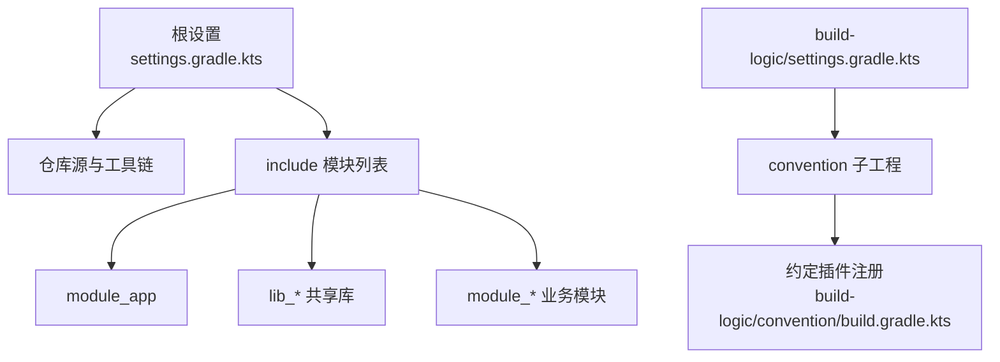
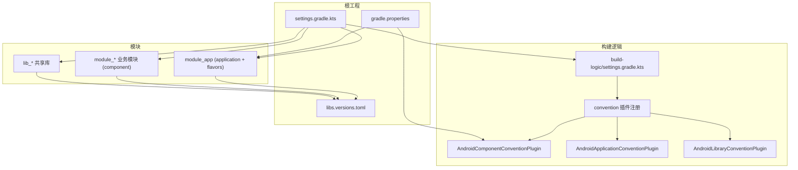
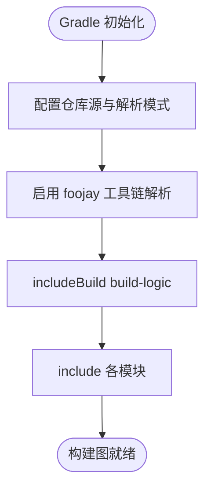
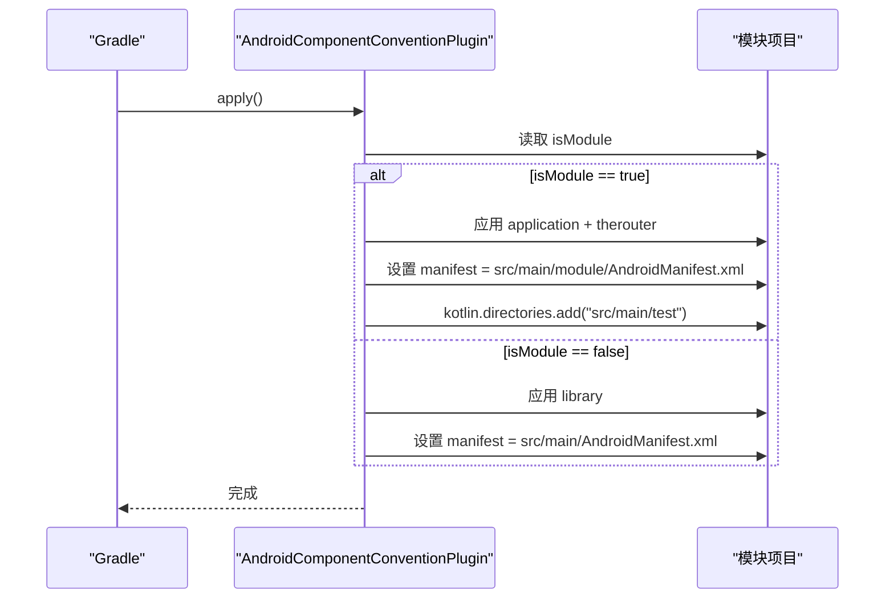
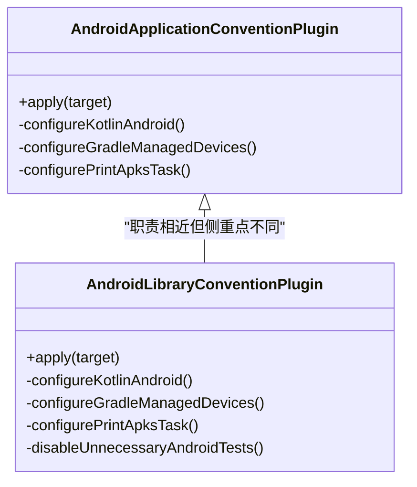
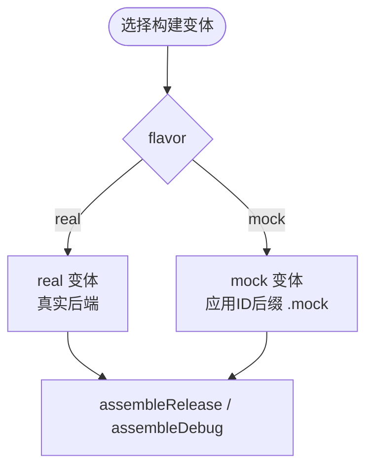
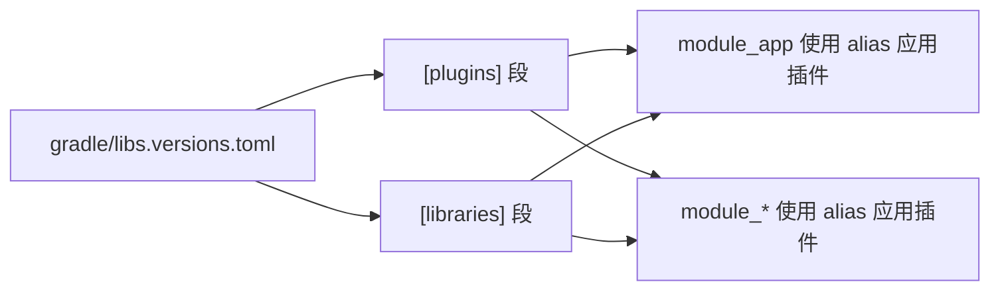
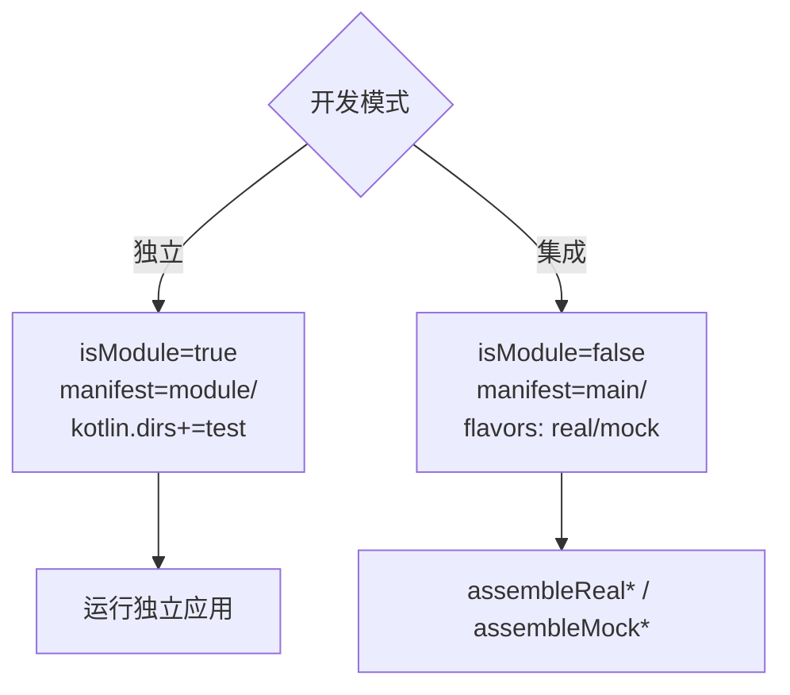
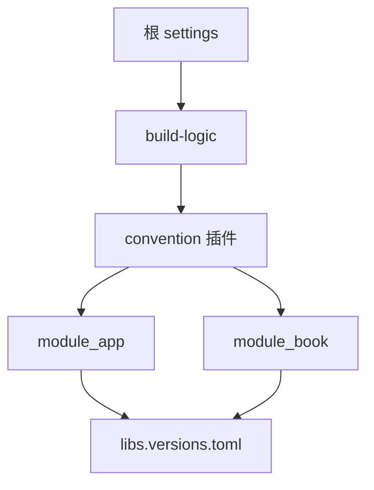

# 构建配置

<cite>
**本文引用的文件**
- [settings.gradle.kts](file://settings.gradle.kts)
- [gradle/libs.versions.toml](file://gradle/libs.versions.toml)
- [build-logic/settings.gradle.kts](file://build-logic/settings.gradle.kts)
- [build-logic/convention/build.gradle.kts](file://build-logic/convention/build.gradle.kts)
- [AndroidComponentConventionPlugin.kt](file://build-logic/convention/src/main/kotlin/AndroidComponentConventionPlugin.kt)
- [AndroidApplicationConventionPlugin.kt](file://build-logic/convention/src/main/kotlin/AndroidApplicationConventionPlugin.kt)
- [AndroidLibraryConventionPlugin.kt](file://build-logic/convention/src/main/kotlin/AndroidLibraryConventionPlugin.kt)
- [module_app/build.gradle.kts](file://module_app/build.gradle.kts)
- [module_book/build.gradle.kts](file://module_book/build.gradle.kts)
- [gradle.properties](file://gradle.properties)
</cite>

## 目录
1. [简介](#简介)
2. [项目结构](#项目结构)
3. [核心组件](#核心组件)
4. [架构总览](#架构总览)
5. [详细组件分析](#详细组件分析)
6. [依赖关系分析](#依赖关系分析)
7. [性能考虑](#性能考虑)
8. [故障排查指南](#故障排查指南)
9. [结论](#结论)
10. [附录：新模块接入步骤](#附录新模块接入步骤)

## 简介
本文件面向 Gradle 与 Android 构建体系，系统性说明该多模块项目的构建配置、约定插件使用方式、版本与依赖管理策略、产品风味（mock/real）切换机制，以及独立开发与集成开发的差异与调试要点。目标读者包括需要维护或扩展构建配置的工程师，也包含希望快速上手的新成员。

## 项目结构
- 根工程通过 settings 集中声明仓库源、工具链解析器与 includeBuild；功能模块与共享库在根 settings 中统一 include。
- build-logic 子工程以 Kotlin DSL 实现约定插件，并通过 version catalog 共享 AGP/KSP/Hilt 等插件坐标。
- 业务模块遵循统一的约定插件：应用入口 module_app 使用 application 约定插件；功能模块使用 component 约定插件，根据 isModule 开关在 application/library 之间切换。
- 版本与依赖集中在 gradle/libs.versions.toml，模块脚本仅引用别名，避免硬编码版本号。

**图示来源**
- [settings.gradle.kts:1-65](file://settings.gradle.kts#L1-L65)
- [build-logic/settings.gradle.kts:16-49](file://build-logic/settings.gradle.kts#L16-L49)
- [build-logic/convention/build.gradle.kts:40-78](file://build-logic/convention/build.gradle.kts#L40-L78)

**章节来源**
- [settings.gradle.kts:1-65](file://settings.gradle.kts#L1-L65)
- [build-logic/settings.gradle.kts:16-49](file://build-logic/settings.gradle.kts#L16-L49)

## 核心组件
- 根 settings 负责仓库镜像、工具链自动拉取、依赖解析模式与模块 inclusion。
- build-logic 提供 xrn1997.* 系列约定插件，封装 AGP 配置、Kotlin/JetBrains Compose/Lint/Hilt/Room/Native 等通用能力。
- AndroidComponentConventionPlugin 是“模块化开发”的关键：按 isModule 决定应用 application 还是 library，并动态切换 Manifest 与源码集。
- module_app 定义 productFlavor（network=real/mock），控制后端连接与包名后缀。
- libs.versions.toml 统一管理所有依赖与插件版本，模块脚本通过 alias 引用。

**章节来源**
- [settings.gradle.kts:1-65](file://settings.gradle.kts#L1-L65)
- [build-logic/convention/build.gradle.kts:40-78](file://build-logic/convention/build.gradle.kts#L40-L78)
- [AndroidComponentConventionPlugin.kt:7-34](file://build-logic/convention/src/main/kotlin/AndroidComponentConventionPlugin.kt#L7-L34)
- [module_app/build.gradle.kts:17-26](file://module_app/build.gradle.kts#L17-L26)
- [gradle/libs.versions.toml:214-237](file://gradle/libs.versions.toml#L214-L237)

## 架构总览
下图展示了根工程、build-logic、模块之间的构建关系与关键配置点。

**图示来源**
- [settings.gradle.kts:1-65](file://settings.gradle.kts#L1-L65)
- [build-logic/settings.gradle.kts:16-49](file://build-logic/settings.gradle.kts#L16-L49)
- [build-logic/convention/build.gradle.kts:40-78](file://build-logic/convention/build.gradle.kts#L40-L78)
- [AndroidComponentConventionPlugin.kt:7-34](file://build-logic/convention/src/main/kotlin/AndroidComponentConventionPlugin.kt#L7-L34)
- [AndroidApplicationConventionPlugin.kt:28-48](file://build-logic/convention/src/main/kotlin/AndroidApplicationConventionPlugin.kt#L28-L48)
- [AndroidLibraryConventionPlugin.kt:30-68](file://build-logic/convention/src/main/kotlin/AndroidLibraryConventionPlugin.kt#L30-L68)
- [module_app/build.gradle.kts:1-64](file://module_app/build.gradle.kts#L1-L64)
- [gradle/libs.versions.toml:214-237](file://gradle/libs.versions.toml#L214-L237)
- [gradle.properties:21-29](file://gradle.properties#L21-L29)

## 详细组件分析

### 多模块组织与 includeBuild
- 根 settings 使用 dependencyResolutionManagement 统一仓库源，强制 FAIL_ON_PROJECT_REPOS，避免各模块私自引入仓库造成不一致。
- 启用 org.gradle.toolchains.foojay-resolver-convention 以自动拉取 JDK toolchain，配合 Gradle 9 的 toolchain 下载机制，减少本地环境差异。
- 通过 includeBuild("build-logic") 将约定插件作为复合构建参与主工程，便于增量开发与调试。

**图示来源**
- [settings.gradle.kts:1-65](file://settings.gradle.kts#L1-L65)

**章节来源**
- [settings.gradle.kts:1-65](file://settings.gradle.kts#L1-L65)

### AndroidComponentConventionPlugin 详解
- 读取 isModule 属性（默认 false）。当为 true 时，应用 application 插件与 therouter；否则应用 library 插件。
- 通过 CommonExtension 动态调整 main source set：
  - 独立模式（isModule=true）：Manifest 指向 src/main/module/AndroidManifest.xml；并将 src/main/test 加入 Kotlin 编译目录，使独立运行时测试宿主与 mock 注入生效。
  - 集成模式（isModule=false）：Manifest 指向 src/main/AndroidManifest.xml。
- jniLibs 目录统一纳入 main，方便原生库加载。

**图示来源**
- [AndroidComponentConventionPlugin.kt:7-34](file://build-logic/convention/src/main/kotlin/AndroidComponentConventionPlugin.kt#L7-L34)

**章节来源**
- [AndroidComponentConventionPlugin.kt:7-34](file://build-logic/convention/src/main/kotlin/AndroidComponentConventionPlugin.kt#L7-L34)

### AndroidApplicationConventionPlugin 与 AndroidLibraryConventionPlugin
- Application 约定插件：应用 com.android.application、xrn1997.android.lint；统一 targetSdk、testOptions、Managed Devices、打印 APK 任务等。
- Library 约定插件：应用 com.android.library、xrn1997.android.lint；统一 targetSdk、单元测试行为、禁用不必要的 androidTest、注入公共依赖等。

**图示来源**
- [AndroidApplicationConventionPlugin.kt:28-48](file://build-logic/convention/src/main/kotlin/AndroidApplicationConventionPlugin.kt#L28-L48)
- [AndroidLibraryConventionPlugin.kt:30-68](file://build-logic/convention/src/main/kotlin/AndroidLibraryConventionPlugin.kt#L30-L68)

**章节来源**
- [AndroidApplicationConventionPlugin.kt:28-48](file://build-logic/convention/src/main/kotlin/AndroidApplicationConventionPlugin.kt#L28-L48)
- [AndroidLibraryConventionPlugin.kt:30-68](file://build-logic/convention/src/main/kotlin/AndroidLibraryConventionPlugin.kt#L30-L68)

### Product Flavor：mock 与 real 切换
- module_app 定义 flavorDimensions "network"，创建 real 与 mock 两个风味。
- mock 风味设置 applicationIdSuffix=".mock"，用于安装共存。
- 结合 isModule 与 source set，集成态可通过 assembleMockDebug 获得 mock 数据源的应用；独立态默认走 mock。

**图示来源**
- [module_app/build.gradle.kts:17-26](file://module_app/build.gradle.kts#L17-L26)

**章节来源**
- [module_app/build.gradle.kts:17-26](file://module_app/build.gradle.kts#L17-L26)

### 依赖与版本管理策略（libs.versions.toml）
- 所有依赖与插件版本集中在版本目录，模块脚本通过 alias(libs.plugins.*) 与 lib 别名引用，避免散落的版本字符串。
- 插件 ID 与版本一一对应，新增插件需先在 [plugins] 段声明，再在模块脚本中使用 alias 引用。
- 对 build-logic 自身依赖（AGP/KSP/Room/Hilt 等 Gradle 插件）也通过版本目录管理，确保主工程与 build-logic 版本一致。

**图示来源**
- [gradle/libs.versions.toml:214-237](file://gradle/libs.versions.toml#L214-L237)
- [module_app/build.gradle.kts:1-8](file://module_app/build.gradle.kts#L1-L8)
- [module_book/build.gradle.kts:1-8](file://module_book/build.gradle.kts#L1-L8)

**章节来源**
- [gradle/libs.versions.toml:214-237](file://gradle/libs.versions.toml#L214-L237)
- [module_app/build.gradle.kts:1-8](file://module_app/build.gradle.kts#L1-L8)
- [module_book/build.gradle.kts:1-8](file://module_book/build.gradle.kts#L1-L8)

### 独立开发与集成开发的差异
- 清单文件：
  - 独立模式（isModule=true）：使用 src/main/module/AndroidManifest.xml。
  - 集成模式（isModule=false）：使用 src/main/AndroidManifest.xml。
- 源码集：
  - 独立模式：将 src/main/test 并入 Kotlin 编译目录，使 debug 下的 MockNetworkModule 等宿主参与编译。
- 依赖注入：
  - 独立模式默认 mock；集成模式可按 flavor 切换 mock/real。
- 注意事项：
  - 两份清单必须保持同步（Activity 声明与属性），避免行为不一致。
  - TheRouter 路由在独立模式下若未占位会静默丢失，需在 src/main/test/debug 提供占位宿主。

**图示来源**
- [AndroidComponentConventionPlugin.kt:19-31](file://build-logic/convention/src/main/kotlin/AndroidComponentConventionPlugin.kt#L19-L31)
- [module_app/build.gradle.kts:17-26](file://module_app/build.gradle.kts#L17-L26)
- [gradle.properties:21-29](file://gradle.properties#L21-L29)

**章节来源**
- [AndroidComponentConventionPlugin.kt:19-31](file://build-logic/convention/src/main/kotlin/AndroidComponentConventionPlugin.kt#L19-L31)
- [module_app/build.gradle.kts:17-26](file://module_app/build.gradle.kts#L17-L26)
- [gradle.properties:21-29](file://gradle.properties#L21-L29)

## 依赖关系分析
- 根 settings 统一仓库源，禁止各项目私配仓库，保证依赖解析一致性。
- build-logic 通过 versionCatalogs 引用根 libs.versions.toml，使约定插件与业务模块共享同一套版本。
- 模块脚本只声明依赖别名，不出现具体版本号，升级只需修改版本目录。

**图示来源**
- [settings.gradle.kts:28-43](file://settings.gradle.kts#L28-L43)
- [build-logic/settings.gradle.kts:25-46](file://build-logic/settings.gradle.kts#L25-L46)
- [gradle/libs.versions.toml:214-237](file://gradle/libs.versions.toml#L214-L237)

**章节来源**
- [settings.gradle.kts:28-43](file://settings.gradle.kts#L28-L43)
- [build-logic/settings.gradle.kts:25-46](file://build-logic/settings.gradle.kts#L25-L46)
- [gradle/libs.versions.toml:214-237](file://gradle/libs.versions.toml#L214-L237)

## 性能考虑
- 使用 Gradle 守护进程与并行构建，合理设置 JVM 参数以提升构建速度。
- KSP 开启增量与跨模块缓存，减少重复生成成本。
- 统一仓库镜像降低网络抖动导致的解析失败与重试。
- 按需启用 androidTest 与 Robolectric，避免无关测试拖慢构建。

[本节为通用指导，无需特定文件引用]

## 故障排查指南
- 构建失败提示工具链未配置：确认已启用 foojay resolver 且 Gradle 可访问远程仓库；检查根 settings 的 pluginManagement 与 repositories。
- 独立模式无法编译 test 代码：确认 AndroidComponentConventionPlugin 已将 src/main/test 加入 Kotlin 目录；检查 AGP 新 DSL 下 kotlin.directories 的使用。
- 清单冲突或页面缺失：核对独立与集成两套清单是否同步；TheRouter 路由在独立模式需占位。
- 依赖版本不一致：确认模块脚本均通过 alias 引用版本目录；build-logic 与主工程共用同一版本目录。
- R8 混淆问题：确认 consumer-rules.pro 与 proguard-rules.pro 的使用位置；模块级 isMinifyEnabled 在集成态应为 false。

**章节来源**
- [AndroidComponentConventionPlugin.kt:19-31](file://build-logic/convention/src/main/kotlin/AndroidComponentConventionPlugin.kt#L19-L31)
- [module_book/build.gradle.kts:24-35](file://module_book/build.gradle.kts#L24-L35)
- [gradle.properties:16-35](file://gradle.properties#L16-L35)

## 结论
本项目通过根 settings 统一仓库与工具链、build-logic 提供约定插件、libs.versions.toml 集中版本管理，实现了高度一致的构建体验。AndroidComponentConventionPlugin 以 isModule 开关灵活切换独立/集成模式，配合 product flavor 实现 mock/real 无缝切换。遵循本文档的配置规范，可高效添加新模块、统一依赖版本、稳定交付构建产物。

[本节为总结性内容，无需特定文件引用]

## 附录：新模块接入步骤
- 在根 settings.gradle.kts 中添加 include(":your_module")。
- 新建 your_module 目录，并在其 build.gradle.kts 中：
  - 应用约定插件：alias(libs.plugins.xrn1997.android.component)
  - 如需 Hilt/Compose/Room/KSP，追加对应 alias
  - 设置 namespace、defaultConfig、buildTypes、compileOptions
  - 通过 implementation(project(":lib_book_common")) 接入共享库
  - 通过 libs.* 别名声明依赖，不写死版本号
- 如为应用入口模块（极少见），改用 application 约定插件并配置 flavorDimensions 与 productFlavors。
- 如需独立运行：
  - 准备 src/main/module/AndroidManifest.xml（与 src/main/AndroidManifest.xml 保持一致）
  - 在 src/main/test/debug 提供占位路由与宿主
  - 临时将 gradle.properties 中的 isModule=true 后调试，完成后改回 false
- 版本升级流程：
  - 修改 gradle/libs.versions.toml 的版本号或新增条目
  - 模块脚本通过 alias 自动生效，无需逐个替换版本字符串
- 调试技巧：
  - 使用 assembleDebug / assembleRelease 构建指定变体
  - 独立模式默认 mock；集成模式通过 flavor 切换 mock/real
  - 若遇到资源或清单合并问题，查看构建输出中的合并清单

**章节来源**
- [settings.gradle.kts:55-65](file://settings.gradle.kts#L55-L65)
- [module_book/build.gradle.kts:1-12](file://module_book/build.gradle.kts#L1-L12)
- [module_app/build.gradle.kts:17-26](file://module_app/build.gradle.kts#L17-L26)
- [AndroidComponentConventionPlugin.kt:19-31](file://build-logic/convention/src/main/kotlin/AndroidComponentConventionPlugin.kt#L19-L31)
- [gradle/libs.versions.toml:214-237](file://gradle/libs.versions.toml#L214-L237)