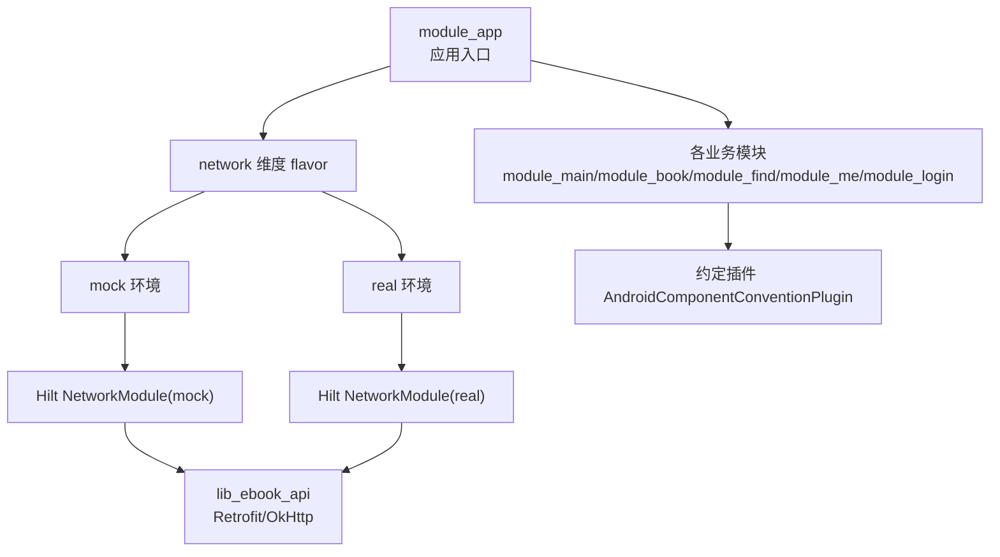
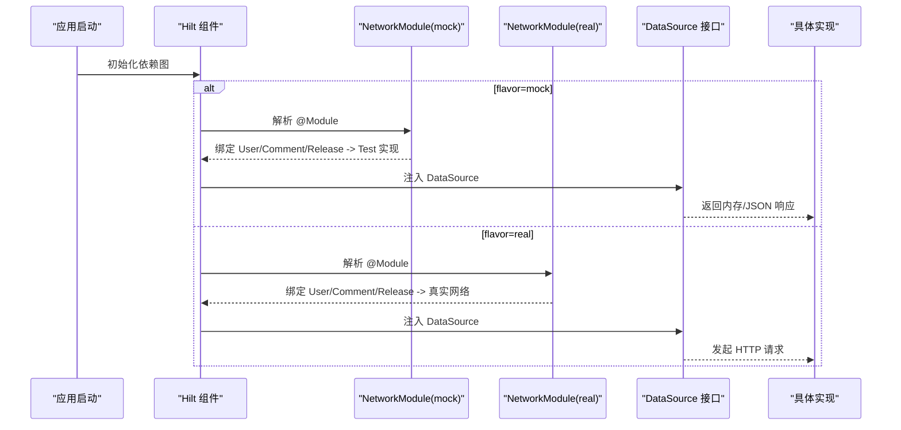

# 环境管理

<cite>
**本文引用的文件**
- [gradle.properties](file://gradle.properties)
- [module_app/build.gradle.kts](file://module_app/build.gradle.kts)
- [module_app/src/mock/java/com/ebook/di/NetworkModule.kt](file://module_app/src/mock/java/com/ebook/di/NetworkModule.kt)
- [module_app/src/real/java/com/ebook/di/NetworkModule.kt](file://module_app/src/real/java/com/ebook/di/NetworkModule.kt)
- [lib_ebook_api/build.gradle.kts](file://lib_ebook_api/build.gradle.kts)
- [build-logic/convention/src/main/kotlin/AndroidComponentConventionPlugin.kt](file://build-logic/convention/src/main/kotlin/AndroidComponentConventionPlugin.kt)
</cite>

## 目录
1. [简介](#简介)
2. [项目结构与环境总览](#项目结构与环境总览)
3. [核心概念：Product Flavor、构建变体与 Source Set](#核心概念product-flavor构建变体与-source-set)
4. [多环境配置与环境切换机制](#多环境配置与环境切换机制)
5. [依赖注入的替换机制（Mock 与 Real）](#依赖注入的替换机制mock-与-real)
6. [环境变量与资源配置策略](#环境变量与资源配置策略)
7. [不同环境的编译选项与产物差异](#不同环境的编译选项与产物差异)
8. [环境特定的测试配置与调试技巧](#环境特定的测试配置与调试技巧)
9. [最佳实践与环境迁移指南](#最佳实践与环境迁移指南)
10. [问题排查清单](#问题排查清单)
11. [结论](#结论)

## 简介
本文面向本仓库的环境管理与构建体系，重点说明如何通过 Gradle Product Flavor 与 Source Set 实现 mock/real 双环境，如何在 Hilt 中按 flavor 替换网络模块实现，以及如何在 gradle.properties、local.properties 与模块构建脚本中统一管理环境变量与构建开关。文末提供常见问题定位思路与环境迁移建议。

## 项目结构与环境总览
本项目采用多模块架构，应用入口在 module_app，通过 productFlavors 定义 network 维度的 flavor 区分（mock/real）。功能模块以约定插件统一接入；独立调试时可通过 isModule 开关让模块作为独立 Application 运行并启用内置的 debug/test 宿主与 Mock 网络绑定。

图表来源
- [module_app/build.gradle.kts:17-26](file://module_app/build.gradle.kts#L17-L26)
- [module_app/src/mock/java/com/ebook/di/NetworkModule.kt:14-37](file://module_app/src/mock/java/com/ebook/di/NetworkModule.kt#L14-L37)
- [module_app/src/real/java/com/ebook/di/NetworkModule.kt:14-35](file://module_app/src/real/java/com/ebook/di/NetworkModule.kt#L14-L35)
- [lib_ebook_api/build.gradle.kts:12-24](file://lib_ebook_api/build.gradle.kts#L12-L24)
- [build-logic/convention/src/main/kotlin/AndroidComponentConventionPlugin.kt:7-34](file://build-logic/convention/src/main/kotlin/AndroidComponentConventionPlugin.kt#L7-L34)

章节来源
- [module_app/build.gradle.kts:1-64](file://module_app/build.gradle.kts#L1-L64)
- [build-logic/convention/src/main/kotlin/AndroidComponentConventionPlugin.kt:7-34](file://build-logic/convention/src/main/kotlin/AndroidComponentConventionPlugin.kt#L7-L34)

## 核心概念：Product Flavor、构建变体与 Source Set
- 构建维度与 Flavor
  - module_app 声明了 flavorDimensions 为 network，并创建 real 与 mock 两个 flavor。
  - 每个 flavor 可与 buildTypes（debug/release）组合产生构建变体（如 realDebug、mockRelease）。
- Source Set 隔离
  - 通过 flavor source set 放置同名但实现不同的代码：例如 module_app/src/mock 与 module_app/src/real 下的 NetworkModule 互斥生效。
  - 约定插件根据 isModule 动态选择 Manifest 与 Kotlin 源码目录，使同一份业务代码能在集成态与独立态下编译装配。

关键要点
- 通过同路径同名类在不同 flavor source set 中的实现，完成运行时行为切换（无需条件分支）。
- 独立模式（isModule=true）会额外把 src/main/test 并入 main，以便本地独立调试时自动带上 Mock 宿主与路由占位。

章节来源
- [module_app/build.gradle.kts:17-26](file://module_app/build.gradle.kts#L17-L26)
- [build-logic/convention/src/main/kotlin/AndroidComponentConventionPlugin.kt:19-31](file://build-logic/convention/src/main/kotlin/AndroidComponentConventionPlugin.kt#L19-L31)

## 多环境配置与环境切换机制
- 环境类型
  - real：连接真实后端服务，用于联调与发布前验证。
  - mock：使用内存 mock 数据源与静态 JSON 资产，离线可开发全链路流程。
- 切换方式
  - 在 IDE 或命令行选择构建变体：assembleRealDebug、assembleMockDebug 等。
  - 独立调试（isModule=true）默认走 mock 宿主与 Mock 网络绑定，无需后端即可运行。
- 应用包名
  - mock flavor 使用 applicationIdSuffix = .mock，避免与 real 安装冲突。

章节来源
- [module_app/build.gradle.kts:11-25](file://module_app/build.gradle.kts#L11-L25)

## 依赖注入的替换机制（Mock 与 Real）
Hilt 模块按 flavor 提供不同实现：
- mock 环境：NetworkModule 将 UserDataSource、CommentDataSource、ReleaseDataSource 绑定到对应的 Test 实现（内存 mock + 静态 JSON 资产）。
- real 环境：NetworkModule 将上述接口绑定到真实网络实现（UserNetwork、CommentNetwork、ReleaseNetwork），基址由 lib_ebook_api 的 BuildConfig 注入。

图表来源
- [module_app/src/mock/java/com/ebook/di/NetworkModule.kt:14-37](file://module_app/src/mock/java/com/ebook/di/NetworkModule.kt#L14-L37)
- [module_app/src/real/java/com/ebook/di/NetworkModule.kt:14-35](file://module_app/src/real/java/com/ebook/di/NetworkModule.kt#L14-L35)
- [lib_ebook_api/build.gradle.kts:12-24](file://lib_ebook_api/build.gradle.kts#L12-L24)

章节来源
- [module_app/src/mock/java/com/ebook/di/NetworkModule.kt:14-37](file://module_app/src/mock/java/com/ebook/di/NetworkModule.kt#L14-L37)
- [module_app/src/real/java/com/ebook/di/NetworkModule.kt:14-35](file://module_app/src/real/java/com/ebook/di/NetworkModule.kt#L14-L35)

## 环境变量与资源配置策略
- gradle.properties
  - 构建期开关：isModule=false（默认，集成构建）；临时单模块调试改为 true，不要提交。
  - 构建性能与兼容项：android.nonTransitiveRClass、android.useAndroidX、ksp.incremental.*、org.gradle.jvmargs 等。
- local.properties
  - 服务端地址：ebook.server.host（缺省 10.0.2.2，模拟器映射宿主机 localhost），仅本机有效，不进版本库。
  - 该值会被注入 lib_ebook_api 的 BuildConfig，供网络层使用。
- 模块构建脚本
  - lib_ebook_api 读取 local.properties 生成 BuildConfig 字段，集中管理服务端基址。
  - module_app 声明 flavorDimensions 与 productFlavors，控制应用 ID 后缀与构建变体。

注意事项
- 不要把敏感信息写入版本库；通过 local.properties 与私有配置文件管理。
- 独立调试时，isModule 修改仅限本地，提交前务必恢复默认。

章节来源
- [gradle.properties:14-35](file://gradle.properties#L14-L35)
- [lib_ebook_api/build.gradle.kts:12-24](file://lib_ebook_api/build.gradle.kts#L12-L24)
- [module_app/build.gradle.kts:17-25](file://module_app/build.gradle.kts#L17-L25)

## 不同环境的编译选项与产物差异
- 通用编译选项
  - Java/Kotlin 目标版本 17。
  - KSP 增量编译开启以提升构建速度。
- 混淆与资源优化
  - release 构建开启 R8 混淆（module_app），功能模块在独立态也开启混淆以尽早暴露规则缺口。
- 清单与资源
  - 集成态与独立态使用不同 Manifest：集成态用 src/main/AndroidManifest.xml；独立态用 src/main/module/AndroidManifest.xml。
  - 独立态会将 src/main/test 加入 Kotlin 源码目录，使 debug/test 宿主参与编译。
- 产物差异
  - mock 应用包名带 .mock 后缀，便于与 real 同时安装。
  - real 应用直接连接后端；mock 应用走内存 mock 与静态 JSON，适合离线开发与 CI。

章节来源
- [module_app/build.gradle.kts:27-40](file://module_app/build.gradle.kts#L27-L40)
- [build-logic/convention/src/main/kotlin/AndroidComponentConventionPlugin.kt:19-31](file://build-logic/convention/src/main/kotlin/AndroidComponentConventionPlugin.kt#L19-L31)

## 环境特定的测试配置与调试技巧
- 单元测试
  - 位于各模块 src/test/java，覆盖领域逻辑与工具方法。
- 插桩测试
  - 位于 src/androidTest/java，需要设备/模拟器。
- 独立调试
  - 设置 isModule=true 后，模块可作为独立 Application 运行；src/main/test/debug 下的宿主与 MockNetworkModule 自动参与编译。
- 调试技巧
  - 优先使用 mock 环境进行全链路自测，减少对外部服务依赖。
  - 检查实际运行的 flavor：确认 applicationId 是否含 .mock，确认日志中使用的服务端基址是否符合预期。
  - 独立模式下跨模块路由可能静默丢失，需在 test/debug 宿主补充占位路由。

章节来源
- [build-logic/convention/src/main/kotlin/AndroidComponentConventionPlugin.kt:19-31](file://build-logic/convention/src/main/kotlin/AndroidComponentConventionPlugin.kt#L19-L31)
- [module_app/build.gradle.kts:17-25](file://module_app/build.gradle.kts#L17-L25)

## 最佳实践与环境迁移指南
- 新增 flavor 或新环境
  - 在 module_app 的 flavorDimensions 中添加维度，并在 productFlavors 中声明新 flavor。
  - 在对应 flavor source set 中提供 Hilt Module 或其他差异化实现。
- 迁移 to/from 独立调试
  - 修改 gradle.properties 的 isModule，调试完成后立即恢复默认。
  - 确保两份 Manifest 同步更新（权限、Activity 声明等），避免集成态与独立态行为不一致。
- 环境变量管理
  - 所有外部地址、密钥等一律放入 local.properties 或受保护的配置文件，禁止硬编码进代码。
  - 通过模块构建脚本读取并生成 BuildConfig，保证只读不写。
- 依赖注入替换
  - 保持接口稳定，仅在 flavor source set 内替换实现；避免在业务代码中写 if(flavor) 分支。
- 测试与发布
  - 新功能先在 mock 环境验证；release 前在 real 环境回归。
  - 发布前确认混淆规则与资源裁剪无异常。

## 问题排查清单
- 无法连接后端
  - 检查 lib_ebook_api 的 BuildConfig 中服务端地址是否正确（来自 local.properties）。
  - 真机联调需 adb reverse 或使用回环地址；注意 Android 17+ 对本地网络的权限限制。
- 页面不加载数据
  - 确认当前运行的是 mock 还是 real flavor；检查是否误用了旧的路由表或过时的 host。
- 崩溃或空数据
  - 检查 mock 资产形态是否与接口契约一致；检查序列化异常是否被上层吞掉。
- 独立模式路由失效
  - 在 src/main/test/debug 宿主补充占位路由；重新构建一次以刷新 TheRouter 路由表。
- 构建失败或行为异常
  - 核对 isModule 是否为 false（提交态）；确认 flavorDimensions 与 productFlavors 配置无误。
  - 对比集成态与独立态的合并清单，确保 Activity、权限声明一致。

## 结论
本项目通过 Gradle 的 flavorDimensions 与 source set 实现了清晰的 mock/real 环境分离，配合 Hilt 的模块绑定在编译期决定运行时行为。环境变量集中在 gradle.properties 与 local.properties 管理，模块构建脚本负责注入与装配。遵循本文的最佳实践与排查清单，可在保证开发效率的同时降低环境切换带来的风险。