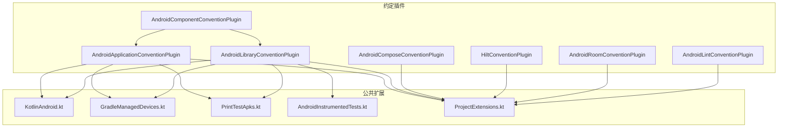
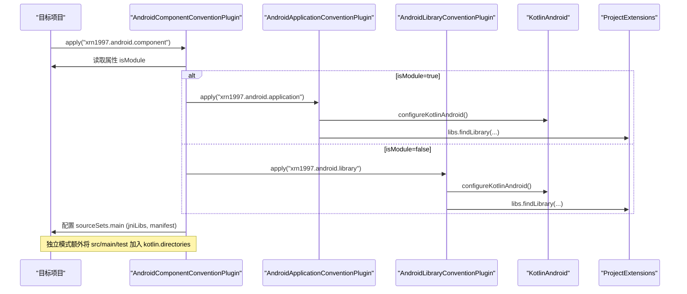
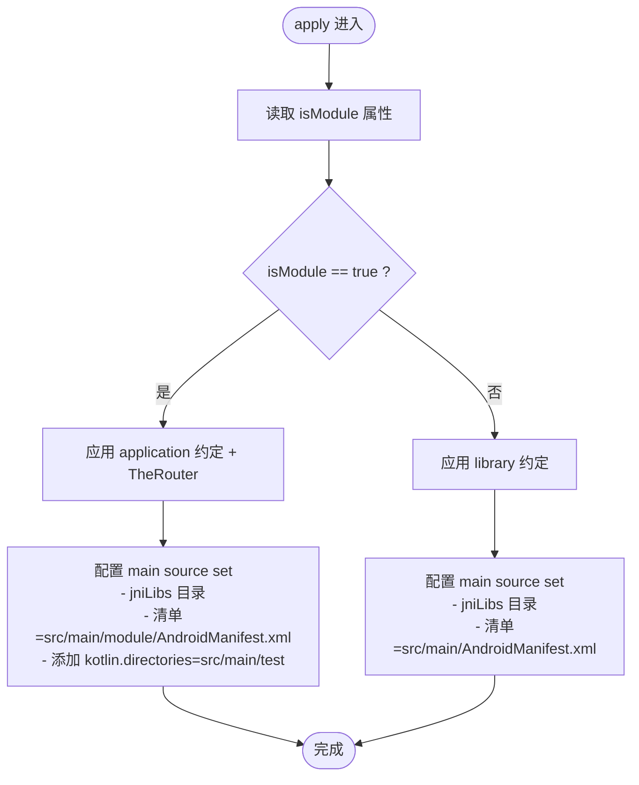
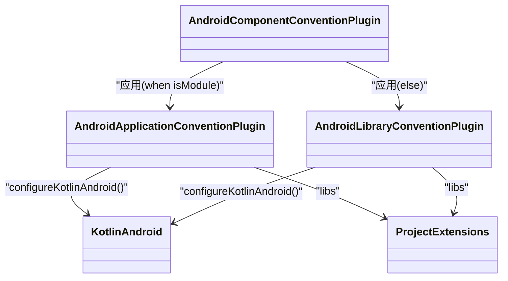

# 约定插件系统

<cite>
**本文引用的文件**
- [AndroidComponentConventionPlugin.kt](file://build-logic/convention/src/main/kotlin/AndroidComponentConventionPlugin.kt)
- [AndroidApplicationConventionPlugin.kt](file://build-logic/convention/src/main/kotlin/AndroidApplicationConventionPlugin.kt)
- [AndroidLibraryConventionPlugin.kt](file://build-logic/convention/src/main/kotlin/AndroidLibraryConventionPlugin.kt)
- [KotlinAndroid.kt](file://build-logic/convention/src/main/kotlin/com/xrn1997/convention/KotlinAndroid.kt)
- [ProjectExtensions.kt](file://build-logic/convention/src/main/kotlin/com/xrn1997/convention/ProjectExtensions.kt)
- [AndroidComposeConventionPlugin.kt](file://build-logic/convention/src/main/kotlin/AndroidComposeConventionPlugin.kt)
- [HiltConventionPlugin.kt](file://build-logic/convention/src/main/kotlin/HiltConventionPlugin.kt)
- [AndroidRoomConventionPlugin.kt](file://build-logic/convention/src/main/kotlin/AndroidRoomConventionPlugin.kt)
- [AndroidLintConventionPlugin.kt](file://build-logic/convention/src/main/kotlin/AndroidLintConventionPlugin.kt)
- [GradleManagedDevices.kt](file://build-logic/convention/src/main/kotlin/com/xrn1997/convention/GradleManagedDevices.kt)
- [PrintTestApks.kt](file://build-logic/convention/src/main/kotlin/com/xrn1997/convention/PrintTestApks.kt)
- [AndroidInstrumentedTests.kt](file://build-logic/convention/src/main/kotlin/com/xrn1997/convention/AndroidInstrumentedTests.kt)
- [settings.gradle.kts](file://settings.gradle.kts)
- [gradle.properties](file://gradle.properties)
</cite>

## 目录
1. [简介](#简介)
2. [项目结构](#项目结构)
3. [核心组件](#核心组件)
4. [架构总览](#架构总览)
5. [详细组件分析](#详细组件分析)
6. [依赖分析](#依赖分析)
7. [性能考量](#性能考量)
8. [故障排查指南](#故障排查指南)
9. [结论](#结论)
10. [附录：使用模板与最佳实践](#附录使用模板与最佳实践)

## 简介
本仓库通过 build-logic 提供一套“约定优先”的 Gradle 构建体系，将 Android 模块的通用构建配置抽取为可复用的约定插件。其目标是在多模块、多形态（application/library、集成态/独立态）下保持构建一致性与可维护性，同时降低业务模块的构建脚本复杂度。

核心要点：
- 统一应用 AGP 插件并集中配置 Kotlin、SDK、测试等基础能力
- 通过 isModule 开关灵活切换“功能模块可独立运行”和“作为 library 被集成”两种模式
- 自动管理 source set、资源前缀、清单替换、原生库目录等常见需求
- 提供 Hilt、Compose、Room、Lint、受管设备等扩展点，按需组合

## 项目结构
约定插件集中在 build-logic/convention 中，按职责拆分为多个 Plugin 与工具扩展：
- 入口型约定插件：AndroidComponentConventionPlugin、AndroidApplicationConventionPlugin、AndroidLibraryConventionPlugin
- 能力型约定插件：AndroidComposeConventionPlugin、HiltConventionPlugin、AndroidRoomConventionPlugin、AndroidLintConventionPlugin
- 公共扩展：KotlinAndroid.kt（Kotlin/AGP 基础配置）、GradleManagedDevices.kt、PrintTestApks.kt、AndroidInstrumentedTests.kt、ProjectExtensions.kt

图表来源
- [AndroidComponentConventionPlugin.kt:7-34](file://build-logic/convention/src/main/kotlin/AndroidComponentConventionPlugin.kt#L7-L34)
- [AndroidApplicationConventionPlugin.kt:28-49](file://build-logic/convention/src/main/kotlin/AndroidApplicationConventionPlugin.kt#L28-L49)
- [AndroidLibraryConventionPlugin.kt:30-69](file://build-logic/convention/src/main/kotlin/AndroidLibraryConventionPlugin.kt#L30-L69)
- [KotlinAndroid.kt:34-56](file://build-logic/convention/src/main/kotlin/com/xrn1997/convention/KotlinAndroid.kt#L34-L56)
- [ProjectExtensions.kt:24-25](file://build-logic/convention/src/main/kotlin/com/xrn1997/convention/ProjectExtensions.kt#L24-L25)

章节来源
- [AndroidComponentConventionPlugin.kt:7-34](file://build-logic/convention/src/main/kotlin/AndroidComponentConventionPlugin.kt#L7-L34)
- [AndroidApplicationConventionPlugin.kt:28-49](file://build-logic/convention/src/main/kotlin/AndroidApplicationConventionPlugin.kt#L28-L49)
- [AndroidLibraryConventionPlugin.kt:30-69](file://build-logic/convention/src/main/kotlin/AndroidLibraryConventionPlugin.kt#L30-L69)

## 核心组件
- AndroidComponentConventionPlugin：统一入口，根据 isModule 决定应用 application 或 library 子约定；配置 main source set 的 jniLibs 与清单路径，并在独立模式下将 test 源码并入 main 以支持独立宿主。
- AndroidApplicationConventionPlugin：应用 com.android.application，统一 Kotlin/SDK/测试选项，启用受管设备与打印 APK 任务。
- AndroidLibraryConventionPlugin：应用 com.android.library，统一 Kotlin/SDK/测试选项，禁用不必要的 androidTest 变体，注入常用测试与追踪依赖。
- KotlinAndroid.kt：封装 compileSdk/minSdk/JavaVersion/JvmTarget/编译器参数等基础配置，供 application/library 复用。
- ProjectExtensions.kt：暴露 VersionCatalog 访问器 libs，用于集中式版本管理。
- 其他约定插件：Compose、Hilt、Room、Lint、受管设备、测试 APKS 打印、instrumented tests 控制等，按需组合。

章节来源
- [AndroidComponentConventionPlugin.kt:7-34](file://build-logic/convention/src/main/kotlin/AndroidComponentConventionPlugin.kt#L7-L34)
- [AndroidApplicationConventionPlugin.kt:28-49](file://build-logic/convention/src/main/kotlin/AndroidApplicationConventionPlugin.kt#L28-L49)
- [AndroidLibraryConventionPlugin.kt:30-69](file://build-logic/convention/src/main/kotlin/AndroidLibraryConventionPlugin.kt#L30-L69)
- [KotlinAndroid.kt:34-56](file://build-logic/convention/src/main/kotlin/com/xrn1997/convention/KotlinAndroid.kt#L34-L56)
- [ProjectExtensions.kt:24-25](file://build-logic/convention/src/main/kotlin/com/xrn1997/convention/ProjectExtensions.kt#L24-L25)

## 架构总览
约定插件以“组合优于继承”的方式工作：
- AndroidComponentConventionPlugin 作为“门面”，根据 isModule 选择具体应用类型
- Application/Library 约定插件负责应用 AGP 插件并调用 KotlinAndroid 进行基础配置
- 各能力插件通过 apply 方式叠加到目标项目中，形成统一的构建契约

图表来源
- [AndroidComponentConventionPlugin.kt:7-34](file://build-logic/convention/src/main/kotlin/AndroidComponentConventionPlugin.kt#L7-L34)
- [AndroidApplicationConventionPlugin.kt:28-49](file://build-logic/convention/src/main/kotlin/AndroidApplicationConventionPlugin.kt#L28-L49)
- [AndroidLibraryConventionPlugin.kt:30-69](file://build-logic/convention/src/main/kotlin/AndroidLibraryConventionPlugin.kt#L30-L69)
- [KotlinAndroid.kt:34-56](file://build-logic/convention/src/main/kotlin/com/xrn1997/convention/KotlinAndroid.kt#L34-L56)
- [ProjectExtensions.kt:24-25](file://build-logic/convention/src/main/kotlin/com/xrn1997/convention/ProjectExtensions.kt#L24-L25)

## 详细组件分析

### AndroidComponentConventionPlugin：isModule 与 Source Set 管理
- isModule 开关作用
  - true：应用 application 约定与 TheRouter，并将 src/main/module/AndroidManifest.xml 作为清单；同时将 src/main/test 作为额外 Kotlin 源码目录并入 main，使独立运行的 mock 宿主参与编译。
  - false：应用 library 约定，使用 src/main/AndroidManifest.xml 作为清单。
- source set 自动配置
  - 设置 jniLibs 目录为 jniLibs，便于原生库打包。
  - 根据 isModule 切换清单来源，避免集成态与独立态的 Manifest 冲突。
  - 在 AGP 9 新 DSL 下，使用 CommonExtension.sourceSets.getByName("main") 进行配置。
- 资源文件管理
  - 通过固定 jniLibs 目录确保原生库正确打包。
  - 清单替换机制保证两种模式的 Activity/权限声明一致性（需在两份清单同步）。

图表来源
- [AndroidComponentConventionPlugin.kt:7-34](file://build-logic/convention/src/main/kotlin/AndroidComponentConventionPlugin.kt#L7-L34)

章节来源
- [AndroidComponentConventionPlugin.kt:7-34](file://build-logic/convention/src/main/kotlin/AndroidComponentConventionPlugin.kt#L7-L34)

### AndroidApplicationConventionPlugin vs AndroidLibraryConventionPlugin
- 共同点
  - 都调用 configureKotlinAndroid 统一 Kotlin/SDK/编译选项
  - 都接入 PrintTestApks 输出任务，便于定位产物
  - 都接入 Gradle Managed Devices 以便在无设备时运行测试
- 差异点
  - 应用类型：application 与 library
  - Library 额外禁用不必要的 androidTest 变体，减少无关依赖与警告
  - Library 默认注入常用测试依赖（kotlin.test、junit）与 tracing 依赖
  - Application 侧重 targetSdk/applicationId/动画禁用等应用级默认值

适用场景
- AndroidApplicationConventionPlugin：module_app 及需要独立运行的 application 模块
- AndroidLibraryConventionPlugin：lib_* 与 module_*（集成态）等 library 模块

章节来源
- [AndroidApplicationConventionPlugin.kt:28-49](file://build-logic/convention/src/main/kotlin/AndroidApplicationConventionPlugin.kt#L28-L49)
- [AndroidLibraryConventionPlugin.kt:30-69](file://build-logic/convention/src/main/kotlin/AndroidLibraryConventionPlugin.kt#L30-L69)
- [KotlinAndroid.kt:34-56](file://build-logic/convention/src/main/kotlin/com/xrn1997/convention/KotlinAndroid.kt#L34-L56)

### 扩展点机制与新增构建逻辑
- 扩展点形式
  - 通过 apply(plugin = "...") 组合多个约定插件
  - 通过 extensions.configure<T>() 对 AGP 扩展进行细粒度配置
  - 通过 dependencies { ... } 注入依赖
- 如何添加新的构建逻辑
  - 新建一个约定插件类实现 Plugin<Project>
  - 在 apply 中使用 extensions.configure<T>() 配置对应扩展
  - 将新插件 ID 暴露给 settings 与根 build 脚本，供模块按需 apply
  - 若涉及版本管理，使用 ProjectExtensions.kt 暴露的 libs 访问 VersionCatalog

章节来源
- [ProjectExtensions.kt:24-25](file://build-logic/convention/src/main/kotlin/com/xrn1997/convention/ProjectExtensions.kt#L24-L25)
- [AndroidApplicationConventionPlugin.kt:28-49](file://build-logic/convention/src/main/kotlin/AndroidApplicationConventionPlugin.kt#L28-L49)
- [AndroidLibraryConventionPlugin.kt:30-69](file://build-logic/convention/src/main/kotlin/AndroidLibraryConventionPlugin.kt#L30-L69)

### 生命周期钩子与任务配置
- 生命周期
  - Plugin.apply 在配置阶段执行，适合配置 sourceSets、extensions、dependencies
  - 通过 extensions.configure 绑定到 AGP 的 DSL 对象（如 ApplicationExtension、LibraryExtension）
- 任务配置
  - PrintTestApks：在 Application/Library 变体上注册任务，输出 APK 信息
  - Gradle Managed Devices：在变体上配置受管设备以运行 UI 测试
  - disableUnnecessaryAndroidTests：在 library 中禁用不必要的 androidTest 变体以减少构建开销

章节来源
- [AndroidApplicationConventionPlugin.kt:28-49](file://build-logic/convention/src/main/kotlin/AndroidApplicationConventionPlugin.kt#L28-L49)
- [AndroidLibraryConventionPlugin.kt:30-69](file://build-logic/convention/src/main/kotlin/AndroidLibraryConventionPlugin.kt#L30-L69)
- [PrintTestApks.kt](file://build-logic/convention/src/main/kotlin/com/xrn1997/convention/PrintTestApks.kt)
- [GradleManagedDevices.kt](file://build-logic/convention/src/main/kotlin/com/xrn1997/convention/GradleManagedDevices.kt)
- [AndroidInstrumentedTests.kt](file://build-logic/convention/src/main/kotlin/com/xrn1997/convention/AndroidInstrumentedTests.kt)

### Compose、Hilt、Room、Lint 约定插件
- AndroidComposeConventionPlugin：统一 Compose 编译与实验特性开关
- HiltConventionPlugin：统一 Hilt 依赖与编译期生成配置
- AndroidRoomConventionPlugin：统一 Room schema 生成与迁移策略
- AndroidLintConventionPlugin：统一 Lint 规则与报告输出

这些插件通过 apply 方式与主约定插件组合，使模块只需引入少量约定即可获得一致的构建体验。

章节来源
- [AndroidComposeConventionPlugin.kt](file://build-logic/convention/src/main/kotlin/AndroidComposeConventionPlugin.kt)
- [HiltConventionPlugin.kt](file://build-logic/convention/src/main/kotlin/HiltConventionPlugin.kt)
- [AndroidRoomConventionPlugin.kt](file://build-logic/convention/src/main/kotlin/AndroidRoomConventionPlugin.kt)
- [AndroidLintConventionPlugin.kt](file://build-logic/convention/src/main/kotlin/AndroidLintConventionPlugin.kt)

## 依赖分析
约定插件之间的依赖关系清晰且低耦合：
- AndroidComponentConventionPlugin 依赖 Application/Library 约定
- Application/Library 约定依赖 KotlinAndroid 与若干工具扩展
- 能力型约定插件通过 ProjectExtensions 访问版本目录，解耦版本号

图表来源
- [AndroidComponentConventionPlugin.kt:7-34](file://build-logic/convention/src/main/kotlin/AndroidComponentConventionPlugin.kt#L7-L34)
- [AndroidApplicationConventionPlugin.kt:28-49](file://build-logic/convention/src/main/kotlin/AndroidApplicationConventionPlugin.kt#L28-L49)
- [AndroidLibraryConventionPlugin.kt:30-69](file://build-logic/convention/src/main/kotlin/AndroidLibraryConventionPlugin.kt#L30-L69)
- [KotlinAndroid.kt:34-56](file://build-logic/convention/src/main/kotlin/com/xrn1997/convention/KotlinAndroid.kt#L34-L56)
- [ProjectExtensions.kt:24-25](file://build-logic/convention/src/main/kotlin/com/xrn1997/convention/ProjectExtensions.kt#L24-L25)

章节来源
- [AndroidComponentConventionPlugin.kt:7-34](file://build-logic/convention/src/main/kotlin/AndroidComponentConventionPlugin.kt#L7-L34)
- [AndroidApplicationConventionPlugin.kt:28-49](file://build-logic/convention/src/main/kotlin/AndroidApplicationConventionPlugin.kt#L28-L49)
- [AndroidLibraryConventionPlugin.kt:30-69](file://build-logic/convention/src/main/kotlin/AndroidLibraryConventionPlugin.kt#L30-L69)

## 性能考量
- 通过 disableUnnecessaryAndroidTests 减少 library 的 androidTest 变体构建开销
- 通过 PrintTestApks 快速定位产物，减少重复构建
- 使用 Gradle Managed Devices 在无真机环境下稳定运行 UI 测试
- 统一 Kotlin/SDK 版本与编译选项，提升增量编译命中率
- 在独立模式下仅编译必要源码集，避免多余代码参与构建

[本节为一般性指导，不直接分析具体文件]

## 故障排查指南
- isModule 配置错误导致空壳 App
  - 现象：集成态构建后缺少功能模块页面
  - 原因：提交态误将 isModule 设置为 true，导致 module_app 不依赖功能模块
  - 处理：确保提交态 isModule=false；临时独立调试后再改回
- 独立模式路由丢失
  - 现象：跨模块导航静默失败
  - 原因：独立模式下未提供占位 @Route
  - 处理：在 src/main/test/debug 提供同名占位路由
- 清单不一致
  - 现象：集成/独立行为不一致
  - 原因：两份 Manifest 不同步
  - 处理：同步两处 Activity/权限声明
- 源目录错位（AGP 9）
  - 现象：KSP 生成了代码但 Kotlin 未编译
  - 原因：使用 java.srcDirs 而非 kotlin.directories
  - 处理：改用 kotlin.directories.add(...)

章节来源
- [AndroidComponentConventionPlugin.kt:7-34](file://build-logic/convention/src/main/kotlin/AndroidComponentConventionPlugin.kt#L7-L34)
- [AndroidLibraryConventionPlugin.kt:30-69](file://build-logic/convention/src/main/kotlin/AndroidLibraryConventionPlugin.kt#L30-L69)

## 结论
本项目的约定插件体系通过“门面+能力组合”的模式，实现了高度一致的 Android 构建配置。isModule 开关让同一模块既能独立运行又能无缝集成；source set 与资源管理的自动化降低了重复配置成本；KotlinAndroid 与各类能力插件确保了 Kotlin、Compose、Hilt、Room、Lint 等能力的统一落地。按照本文的最佳实践与排障指引，团队可以高效扩展新的构建逻辑并保持长期可维护性。

[本节为总结性内容，不直接分析具体文件]

## 附录：使用模板与最佳实践

### 模块如何引入约定插件
- 应用入口：AndroidComponentConventionPlugin
  - 在模块 build.gradle.kts 中应用 xrn1997.android.component
  - 通过 gradle.properties 的 isModule 控制独立/集成模式
- 应用类型：AndroidApplicationConventionPlugin / AndroidLibraryConventionPlugin
  - 通常由 AndroidComponentConventionPlugin 自动选择
  - 也可直接在模块中应用以获取应用/库的通用配置
- 能力叠加：Compose/Hilt/Room/Lint
  - 按需 apply 相应约定插件

章节来源
- [AndroidComponentConventionPlugin.kt:7-34](file://build-logic/convention/src/main/kotlin/AndroidComponentConventionPlugin.kt#L7-L34)
- [AndroidApplicationConventionPlugin.kt:28-49](file://build-logic/convention/src/main/kotlin/AndroidApplicationConventionPlugin.kt#L28-L49)
- [AndroidLibraryConventionPlugin.kt:30-69](file://build-logic/convention/src/main/kotlin/AndroidLibraryConventionPlugin.kt#L30-L69)

### isModule 使用规范
- 提交态必须为 false
- 临时独立调试可改为 true，完成后立即改回
- 不要通过命令行 -PisModule=true 覆盖，以免污染 includeBuild 上下文

章节来源
- [gradle.properties](file://gradle.properties)
- [settings.gradle.kts](file://settings.gradle.kts)

### 新增约定插件步骤
- 新建 Kotlin 文件实现 Plugin<Project>
- 在 apply 中使用 extensions.configure<T>() 配置目标扩展
- 如需版本管理，使用 ProjectExtensions.kt 的 libs 访问 VersionCatalog
- 在 settings 或根构建脚本中注册插件 ID，供模块 apply

章节来源
- [ProjectExtensions.kt:24-25](file://build-logic/convention/src/main/kotlin/com/xrn1997/convention/ProjectExtensions.kt#L24-L25)

### 调试方法
- 使用 PrintTestApks 快速查看 APK 输出位置
- 使用 Gradle Managed Devices 在无设备环境运行 UI 测试
- 通过 Gradle Task 树定位任务依赖与执行顺序
- 结合 lint 与单元测试尽早发现问题

章节来源
- [PrintTestApks.kt](file://build-logic/convention/src/main/kotlin/com/xrn1997/convention/PrintTestApks.kt)
- [GradleManagedDevices.kt](file://build-logic/convention/src/main/kotlin/com/xrn1997/convention/GradleManagedDevices.kt)