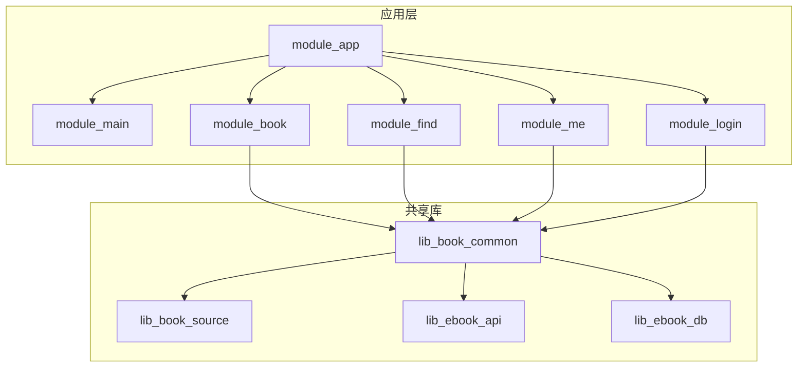
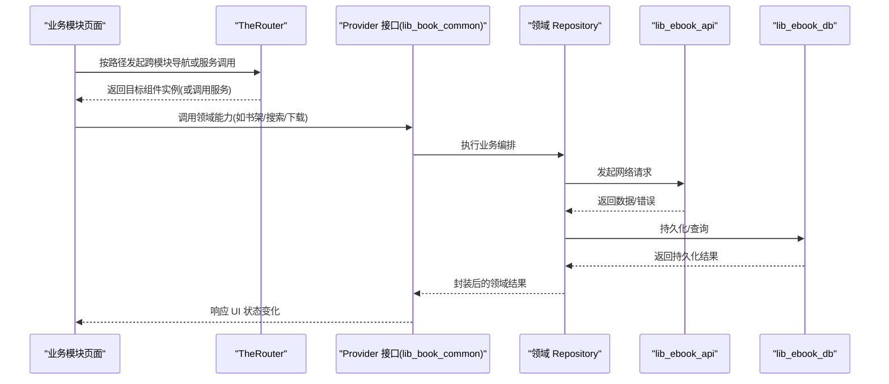
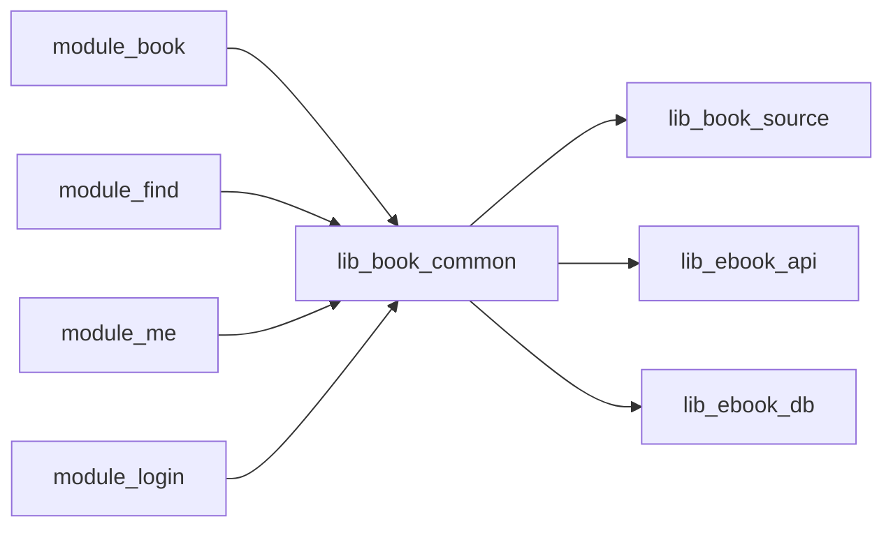

# 模块开发指南

<cite>
**本文引用的文件**
- [README.MD](file://README.MD)
- [settings.gradle.kts](file://settings.gradle.kts)
- [gradle/libs.versions.toml](file://gradle/libs.versions.toml)
- [module_app/build.gradle.kts](file://module_app/build.gradle.kts)
- [module_book/build.gradle.kts](file://module_book/build.gradle.kts)
- [AndroidComponentConventionPlugin.kt](file://build-logic/convention/src/main/kotlin/AndroidComponentConventionPlugin.kt)
- [MyApplication.kt](file://module_app/src/main/java/com/ebook/MyApplication.kt)
- [routeMap.json](file://module_app/src/main/assets/therouter/routeMap.json)
</cite>

## 目录
1. [简介](#简介)
2. [项目结构](#项目结构)
3. [核心组件](#核心组件)
4. [架构总览](#架构总览)
5. [详细组件分析](#详细组件分析)
6. [依赖关系分析](#依赖关系分析)
7. [性能注意事项](#性能注意事项)
8. [故障排查指南](#故障排查指南)
9. [结论](#结论)
10. [附录：新模块创建模板与规范清单](#附录新模块创建模板与规范清单)

## 简介
本指南面向需要在当前 Android 多模块项目中新增或扩展现有功能模块的开发者。文档围绕标准模块的结构组织、模块间通信最佳实践、测试策略与测试环境搭建、新模块创建模板（Gradle 配置、依赖声明、路由注册、依赖注入配置）、代码规范与提交要求，以及调试与故障排除方法展开，帮助你在保持架构一致性的前提下高效扩展能力。

## 项目结构
本项目采用 MVVM + 多模块架构，依赖方向为“业务模块 → lib_book_common → lib_book_source → lib_ebook_api / lib_ebook_db”，功能模块互不直接依赖，跨模块通过 TheRouter 与 Provider 接口进行解耦。应用入口 module_app 组装所有功能模块，并通过 product flavor（real/mock）切换数据源。

图表来源
- [settings.gradle.kts:55-65](file://settings.gradle.kts#L55-L65)
- [README.MD:86-104](file://README.MD#L86-L104)

章节来源
- [README.MD:86-104](file://README.MD#L86-L104)
- [settings.gradle.kts:55-65](file://settings.gradle.kts#L55-L65)

## 核心组件
- 约定插件与构建系统
  - 使用 build-logic 中的自定义约定插件统一配置 Android 模块、Compose、Hilt、Room、Lint 等；其中 xrn1997.android.component 支持“独立 App 模式”与“Library 模式”双态构建。
  - 版本管理通过 gradle/libs.versions.toml 集中维护。

- 应用装配与数据源切换
  - module_app 通过 productFlavors（real/mock）切换网络数据源；独立模块模式下可单独运行并自带 mock。
  - 应用启动时初始化 Hilt、TheRouter 拦截器、沙箱进程门控、内容仓库对账等。

- 路由与服务发现
  - 各模块通过 TheRouter 暴露页面与服务，路由表由 assets/therouter/routeMap.json 汇总；跨模块导航通过路径而非类名耦合。

- 依赖注入
  - 全仓采用 Hilt；Activity/ViewModel/Repository 通过 @Inject/@HiltViewModel 注入；Application 上避免 eager 注入，防止在隔离进程引发崩溃。

章节来源
- [AndroidComponentConventionPlugin.kt:7-34](file://build-logic/convention/src/main/kotlin/AndroidComponentConventionPlugin.kt#L7-L34)
- [gradle/libs.versions.toml:214-237](file://gradle/libs.versions.toml#L214-L237)
- [module_app/build.gradle.kts:1-64](file://module_app/build.gradle.kts#L1-L64)
- [MyApplication.kt:19-65](file://module_app/src/main/java/com/ebook/MyApplication.kt#L19-L65)
- [routeMap.json:1-149](file://module_app/src/main/assets/therouter/routeMap.json#L1-L149)

## 架构总览
下图展示模块间的依赖与运行时协作：业务模块通过 lib_book_common 暴露的 Provider 接口访问领域能力；网络与存储分别由 lib_ebook_api 与 lib_ebook_db 提供；书源解析由 lib_book_source 提供；模块间通过 TheRouter 进行页面跳转与服务调用。

图表来源
- [README.MD:86-104](file://README.MD#L86-L104)
- [module_app/src/main/assets/therouter/routeMap.json:1-149](file://module_app/src/main/assets/therouter/routeMap.json#L1-L149)

## 详细组件分析

### 构建系统与约定插件
- AndroidComponentConventionPlugin
  - 根据 isModule 属性动态选择 application/library 插件；独立模式下将 src/main/test 作为额外 Kotlin 源码目录并入 main，以便独立运行时代码参与编译。
  - 独立模式使用 src/main/module/AndroidManifest.xml，集成模式使用 src/main/AndroidManifest.xml，两份清单需保持一致性。

- 版本与插件
  - 所有依赖与插件版本集中在 libs.versions.toml；插件通过 alias 引用，避免硬编码版本号。

章节来源
- [AndroidComponentConventionPlugin.kt:7-34](file://build-logic/convention/src/main/kotlin/AndroidComponentConventionPlugin.kt#L7-L34)
- [gradle/libs.versions.toml:214-237](file://gradle/libs.versions.toml#L214-L237)

### 应用装配与数据源切换
- module_app
  - 定义 network flavor 维度（real/mock），mock 变体 applicationId 带后缀以区分安装标识。
  - 非独立模式下依赖所有功能模块；独立模式下仅依赖自身，便于单模块开发调试。
  - release 开启混淆，并指定 proguard-rules.pro。

- MyApplication
  - 使用 @HiltAndroidApp 装配依赖图；在 super.onCreate() 之后设置路由拦截器与内容仓库对账任务。
  - 通过 EntryPointAccessors 延迟获取 BookRepository，避免在沙箱进程触发不必要的初始化。

章节来源
- [module_app/build.gradle.kts:1-64](file://module_app/build.gradle.kts#L1-L64)
- [MyApplication.kt:19-65](file://module_app/src/main/java/com/ebook/MyApplication.kt#L19-L65)

### 模块内结构与示例（以 module_book 为例）
- 模块配置
  - 使用 xrn1997.android.component 插件；启用 Compose；独立模式开启 R8 以尽早暴露规则缺口；集成模式关闭以避免对 library 执行 R8。
  - 引入 Hilt、KSP、Router APT；testOptions 包含 Robolectric 资源合并；androidTest 中配置 hilt-android-testing。

- 典型分层
  - page（页面）、mvvm/viewmodel（状态与逻辑）、repository（领域聚合）、reader（阅读器相关）、service（后台服务）、provider（对外接口）。

章节来源
- [module_book/build.gradle.kts:1-96](file://module_book/build.gradle.kts#L1-L96)

### 跨模块通信与解耦原则
- 路由解耦
  - 所有跨模块页面跳转通过 TheRouter 路径调用，避免直接依赖对方 Activity/Fragment；路由表由 routeMap.json 统一管理。

- Provider 接口
  - 领域能力以 Provider 接口形式在 lib_book_common 暴露，业务模块仅依赖接口而不感知实现细节。

- 循环依赖避免
  - 功能模块之间无直接依赖；若需要复用逻辑，优先下沉到 lib_book_common；禁止业务模块互相引用。

章节来源
- [routeMap.json:1-149](file://module_app/src/main/assets/therouter/routeMap.json#L1-L149)
- [README.MD:86-104](file://README.MD#L86-L104)

### 依赖注入配置要点
- Hilt 装配点
  - Application 上避免 eager 字段注入；通过 EntryPoint 延迟取用重型对象（如 BookRepository），防止在沙箱进程崩溃。
  - ViewModel 使用 @HiltViewModel 构造注入；Activity 通过 hiltNavigationCompose 的 hiltViewModel() 组合注入。

章节来源
- [MyApplication.kt:19-65](file://module_app/src/main/java/com/ebook/MyApplication.kt#L19-L65)
- [module_book/build.gradle.kts:66-96](file://module_book/build.gradle.kts#L66-L96)

## 依赖关系分析
- Gradle 子模块
  - settings.gradle.kts 显式 include 所有模块，保证构建时可见。

- 依赖方向
  - 业务模块依赖 lib_book_common；lib_book_common 依赖 lib_book_source、lib_ebook_api、lib_ebook_db；lib_book_source 与 lib_ebook_api/lib_ebook_db 并列依赖，避免环。

图表来源
- [settings.gradle.kts:55-65](file://settings.gradle.kts#L55-L65)
- [README.MD:86-104](file://README.MD#L86-L104)

章节来源
- [settings.gradle.kts:55-65](file://settings.gradle.kts#L55-L65)

## 性能注意事项
- 渲染与状态
  - 列表项 key 必须稳定且唯一，锚点语义值应为领域键而非扁平序号，避免滚动时位置跳变。
  - 排版块高应取自实测测量值，避免心算导致分页误差。

- 异步与事件
  - 统一使用 Coroutines + Flow；事件总线采用 SharedFlow，避免 RxJava 残留。
  - 长耗时操作（如内容仓库对账）应在独立协程作用域执行，不影响主线程。

- 网络与缓存
  - 书源请求走纯净客户端，避免携带用户 token；缓存策略集中于仓储层，避免解析器内聚缓存逻辑。

[本节为通用指导，不直接分析具体文件]

## 故障排查指南
- 构建与运行
  - 确认 isModule 开关正确：提交态必须为 false；临时独立运行改为 true 后务必改回。
  - 两份 Manifest 同步修改，避免独立/集成模式行为不一致。

- 路由与跳转
  - 新增/改动路由后需重新构建生成 routeMap，否则当次 APK 仍为旧路由表。
  - 独立模式下跨模块路由可能静默丢失，需在 debug 宿主添加占位路由。

- 依赖注入
  - 避免在 Application 上 eager 注入；如需重型对象，使用 EntryPoint 延迟获取。
  - androidTest 中需自行声明 kspAndroidTest 与 hilt-android-testing，否则注入点为空。

- 日志与异常
  - 统一使用 Logger，禁止直接调用 android.util.Log；会话过期统一上报，避免重复提示。

章节来源
- [AndroidComponentConventionPlugin.kt:7-34](file://build-logic/convention/src/main/kotlin/AndroidComponentConventionPlugin.kt#L7-L34)
- [module_app/build.gradle.kts:1-64](file://module_app/build.gradle.kts#L1-L64)
- [MyApplication.kt:19-65](file://module_app/src/main/java/com/ebook/MyApplication.kt#L19-L65)
- [module_book/build.gradle.kts:66-96](file://module_book/build.gradle.kts#L66-L96)

## 结论
通过约定插件、版本目录、product flavor 与 TheRouter/Provider 的组合，项目在保持模块解耦的同时提供了高效的独立开发与集成构建体验。遵循本指南的模块结构、通信方式、测试策略与代码规范，可以显著降低回归风险、提升可维护性与可扩展性。

[本节为总结，不直接分析具体文件]

## 附录：新模块创建模板与规范清单

### 一、模块结构建议
- 包结构
  - page：页面容器与导航
  - mvvm/viewmodel：状态管理与业务编排
  - repository：领域聚合与数据协调
  - service：后台服务（如下载、同步）
  - provider：对外暴露的接口（放入 lib_book_common 或本模块）
  - entity：领域实体（必要时）
  - util：工具函数（尽量下沉到 lib_book_common）

- 文件命名
  - 类名 PascalCase，文件名与类名一致
  - ViewModel 以 XxxViewModel 命名
  - Repository 以 XxxRepository 命名
  - Provider 接口以 I 前缀或 XxxProvider 命名

### 二、Gradle 配置要点
- 插件
  - 使用 xrn1997.android.component 插件（或 application/library 对应插件）
  - 启用 compose、ksp、hilt、room（按需）

- 变体与清单
  - 独立模式：src/main/module/AndroidManifest.xml
  - 集成模式：src/main/AndroidManifest.xml
  - 确保两份清单声明一致（Activity、权限、Service）

- 混淆与资源
  - consumer-rules.pro 用于集成传播；proguard-rules.pro 用于独立运行
  - testOptions 按需启用 includeAndroidResources（Robolectric）

章节来源
- [module_book/build.gradle.kts:1-96](file://module_book/build.gradle.kts#L1-L96)
- [AndroidComponentConventionPlugin.kt:7-34](file://build-logic/convention/src/main/kotlin/AndroidComponentConventionPlugin.kt#L7-L34)

### 三、依赖声明
- 业务模块依赖
  - implementation(project(":lib_book_common"))
  - 按需添加 androidx、hilt、router、compose 依赖
  - 使用 libs.versions.toml 中别名引用，避免硬编码版本

- 测试依赖
  - testImplementation(junit, coroutines-test, robolectric)
  - androidTestImplementation(androidx.test.ext.junit, espresso, hilt-android-testing)

章节来源
- [gradle/libs.versions.toml:75-213](file://gradle/libs.versions.toml#L75-L213)
- [module_book/build.gradle.kts:58-96](file://module_book/build.gradle.kts#L58-L96)

### 四、路由注册
- 新增页面或服务
  - 在模块 assets/therouter/routeMap.json 中登记 path、className、params
  - 跨模块跳转通过路径调用，避免直接依赖对方类

章节来源
- [routeMap.json:1-149](file://module_app/src/main/assets/therouter/routeMap.json#L1-L149)

### 五、依赖注入配置
- ViewModel
  - 使用 @HiltViewModel，构造参数通过 @Inject 注入
- Activity/Fragment
  - 通过 hiltNavigationCompose 的 hiltViewModel() 注入
- Application
  - 避免 eager 字段注入；使用 EntryPoint 延迟获取重型对象

章节来源
- [MyApplication.kt:19-65](file://module_app/src/main/java/com/ebook/MyApplication.kt#L19-L65)
- [module_book/build.gradle.kts:66-96](file://module_book/build.gradle.kts#L66-L96)

### 六、测试策略与环境搭建
- 单元测试
  - 位于 src/test/java，使用 JUnit 4；覆盖业务逻辑与算法
- 插桩测试
  - 位于 src/androidTest/java，使用 Espresso 与 Hilt 测试脚手架
- Mock 数据源
  - 通过 product flavor 切换 real/mock；新增接口需同步 mock 实现与 JSON 资产（读接口）或代码合成（写接口/上传）

章节来源
- [module_app/build.gradle.kts:17-26](file://module_app/build.gradle.kts#L17-L26)
- [module_book/build.gradle.kts:75-96](file://module_book/build.gradle.kts#L75-L96)

### 七、代码规范与提交要求
- 注释与 KDoc
  - 类、方法、重要分支需补充说明“是什么、为什么”
- 命名约定
  - 遵循 Kotlin 官方风格与项目既有条约（BaseViewModel、NoOpModel 等）
- 提交规范
  - 遵循 Conventional Commits（type/scope/description/body/footer）
  - 首次 clone 后安装 commit-msg 钩子；提交前验证构建与基本运行

章节来源
- [README.MD:190-203](file://README.MD#L190-L203)

### 八、调试与故障排除
- 日志
  - 统一使用 Logger；避免直接 Log；关注会话过期统一上报
- 常见问题
  - 路由未生效：重新构建生成 routeMap
  - 注入为空：检查 hilt-android-testing 与 KSP 是否启用
  - 清单不一致：核对两份 Manifest 的 Activity/权限/Service 声明
- 性能分析
  - 列表项 key 稳定性、排版块高测量、异步任务调度

章节来源
- [MyApplication.kt:19-65](file://module_app/src/main/java/com/ebook/MyApplication.kt#L19-L65)
- [module_book/build.gradle.kts:75-96](file://module_book/build.gradle.kts#L75-L96)