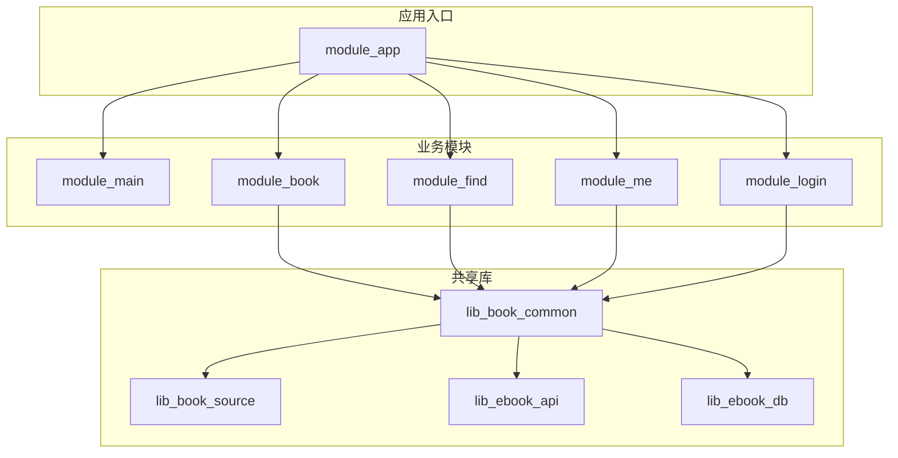
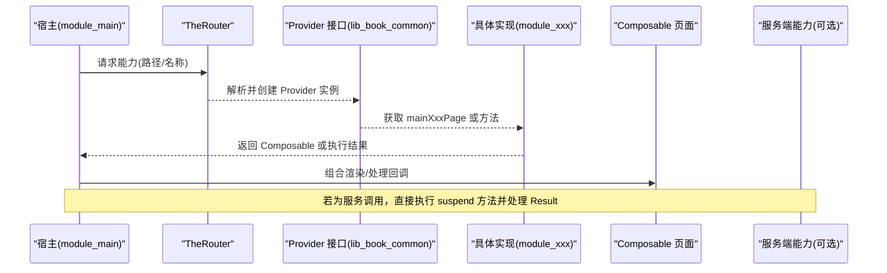
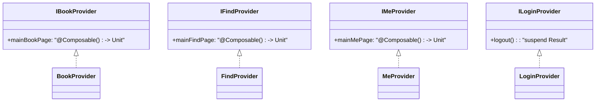
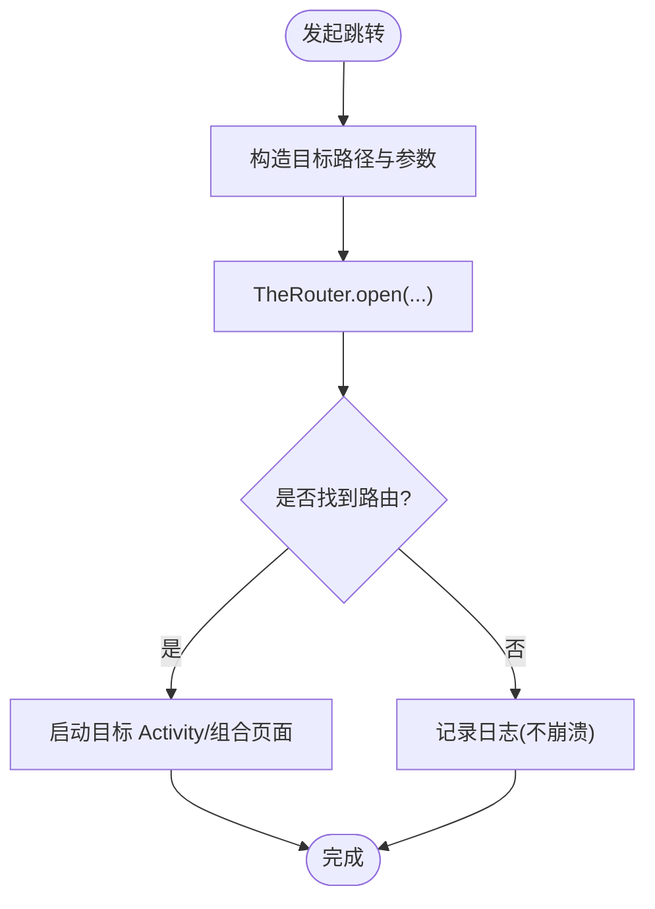
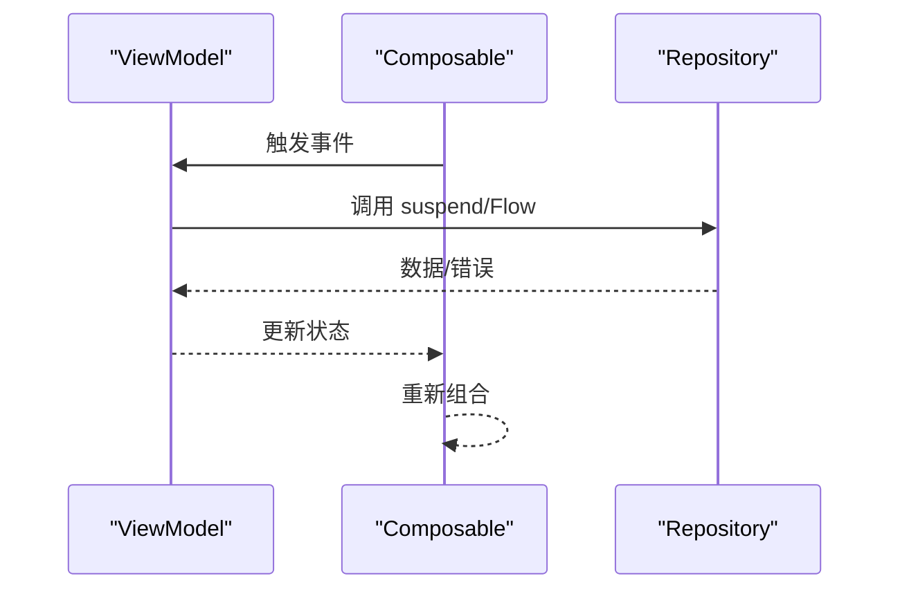
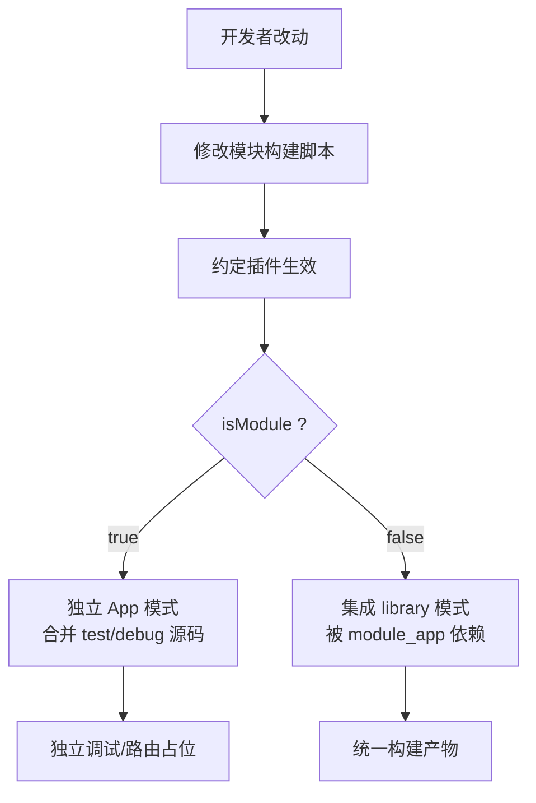
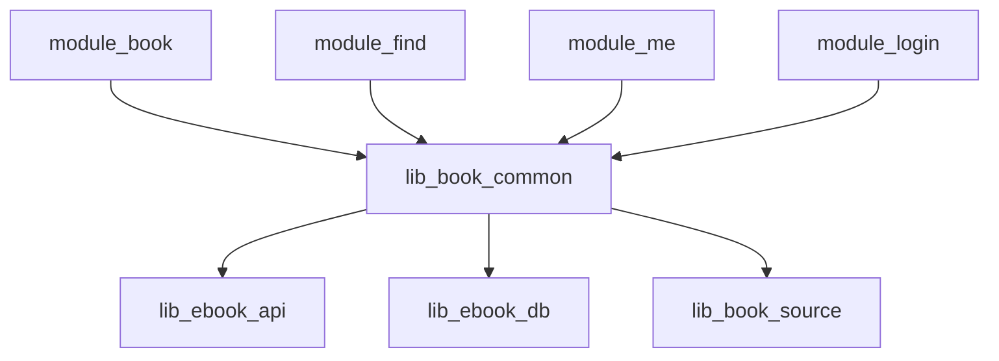

# 模块扩展

<cite>
**本文引用的文件**
- [IBookProvider.kt](file://lib_book_common/src/main/java/com/ebook/common/provider/IBookProvider.kt)
- [IFindProvider.kt](file://lib_book_common/src/main/java/com/ebook/common/provider/IFindProvider.kt)
- [IMeProvider.kt](file://lib_book_common/src/main/java/com/ebook/common/provider/IMeProvider.kt)
- [ILoginProvider.kt](file://lib_book_common/src/main/java/com/ebook/common/provider/ILoginProvider.kt)
- [BookProvider.kt](file://module_book/src/main/java/com/ebook/book/provider/BookProvider.kt)
- [FindProvider.kt](file://module_find/src/main/java/com/ebook/find\provider/FindProvider.kt)
- [MeProvider.kt](file://module_me/src/main/java/com/ebook/me/provider/MeProvider.kt)
- [LoginProvider.kt](file://module_login/src/main/java/com/ebook/login/provider/LoginProvider.kt)
- [routeMap.json（应用入口）](file://module_app/src/main/assets/therouter/routeMap.json)
- [AndroidComponentConventionPlugin.kt](file://build-logic/convention/src/main/kotlin/AndroidComponentConventionPlugin.kt)
- [HiltConventionPlugin.kt](file://build-logic/convention/src/main/kotlin/HiltConventionPlugin.kt)
- [AndroidComposeConventionPlugin.kt](file://build-logic/convention/src/main/kotlin/AndroidComposeConventionPlugin.kt)
- [AGENTS.md](file://AGENTS.md)
</cite>

## 目录
1. [简介](#简介)
2. [项目结构](#项目结构)
3. [核心组件](#核心组件)
4. [架构总览](#架构总览)
5. [详细组件分析](#详细组件分析)
6. [依赖分析](#依赖分析)
7. [性能与构建考量](#性能与构建考量)
8. [故障排查指南](#故障排查指南)
9. [结论](#结论)
10. [附录](#附录)

## 简介
本指南面向需要在该多模块 Android 应用中扩展现有功能或新增业务模块的开发者。文档围绕以下主题展开：
- Provider 接口定义与实现规范（IBookProvider、IFindProvider、IMeProvider、ILoginProvider）
- TheRouter 路由机制（注册、跳转、参数传递）
- Hilt 依赖注入配置（模块声明、绑定、作用域）
- Composable 组件扩展（页面开发、状态管理、数据流）
- 模块化构建配置（Gradle 约定插件、source set、依赖声明）
- 跨模块通信最佳实践（避免循环依赖、解耦）
- 独立开发与集成开发的差异（Manifest、资源、测试环境）

## 项目结构
项目采用多模块架构，业务模块通过共享接口暴露能力，主应用统一装配。核心依赖方向为：业务模块 → lib_book_common → lib_book_source → lib_ebook_api / lib_ebook_db。跨模块导航与能力发现由 TheRouter + Provider 组合完成。

图表来源
- [AGENTS.md](file://AGENTS.md)

章节来源
- [AGENTS.md](file://AGENTS.md)

## 核心组件
- Provider 接口层（位于 lib_book_common）：以函数式 Composable 或 suspend 方法的形式对外暴露跨模块能力。
- 各业务模块提供 Provider 实现：将自身页面或服务接入到全局能力中心。
- 路由系统（TheRouter）：基于注解与生成资产进行页面跳转与参数传递。
- 依赖注入（Hilt）：在模块内使用 @HiltViewModel/@Inject 等，结合约定插件简化配置。
- 构建约定（build-logic）：统一 Gradle 配置，支持独立模块运行与集成构建。

章节来源
- [IBookProvider.kt:1-14](file://lib_book_common/src/main/java/com/ebook/common/provider/IBookProvider.kt#L1-L14)
- [IFindProvider.kt:1-14](file://lib_book_common/src/main/java/com/ebook/common/provider/IFindProvider.kt#L1-L14)
- [IMeProvider.kt:1-14](file://lib_book_common/src/main/java/com/ebook/common/provider/IMeProvider.kt#L1-L14)
- [ILoginProvider.kt:1-20](file://lib_book_common/src/main/java/com/ebook/common/provider/ILoginProvider.kt#L1-L20)
- [BookProvider.kt](file://module_book/src/main/java/com/ebook/book/provider/BookProvider.kt)
- [FindProvider.kt](file://module_find/src/main/java/com/ebook/find/provider/FindProvider.kt)
- [MeProvider.kt](file://module_me/src/main/java/com/ebook/me/provider/MeProvider.kt)
- [LoginProvider.kt](file://module_login/src/main/java/com/ebook/login/provider/LoginProvider.kt)

## 架构总览
下图展示了“跨模块页面组合”和“跨模块服务调用”两条主线：
- 页面级能力通过 Provider 返回 Composable，由宿主 NavHost 直接组合。
- 服务端能力（如登出）通过 Provider 暴露 suspend 方法，调用方处理结果。

图表来源
- [IBookProvider.kt:1-14](file://lib_book_common/src/main/java/com/ebook/common/provider/IBookProvider.kt#L1-L14)
- [IFindProvider.kt:1-14](file://lib_book_common/src/main/java/com/ebook/common/provider/IFindProvider.kt#L1-L14)
- [IMeProvider.kt:1-14](file://lib_book_common/src/main/java/com/ebook/common/provider/IMeProvider.kt#L1-L14)
- [ILoginProvider.kt:1-20](file://lib_book_common/src/main/java/com/ebook/common/provider/ILoginProvider.kt#L1-L20)

## 详细组件分析

### Provider 接口与实现
- IBookProvider/IFindProvider/IMeProvider：以 @Composable () -> Unit 形式暴露主 Tab 页面，供宿主 NavHost 直接组合；页面 ViewModel 作用域由调用处 NavBackStackEntry 决定。
- ILoginProvider：仅暴露服务端侧登出能力，本地会话清理由统一的 SessionManager 负责；独立模式下可能无实现，调用方需允许空实现。

图表来源
- [IBookProvider.kt:1-14](file://lib_book_common/src/main/java/com/ebook/common/provider/IBookProvider.kt#L1-L14)
- [IFindProvider.kt:1-14](file://lib_book_common/src/main/java/com/ebook/common/provider/IFindProvider.kt#L1-L14)
- [IMeProvider.kt:1-14](file://lib_book_common/src/main/java/com/ebook/common/provider/IMeProvider.kt#L1-L14)
- [ILoginProvider.kt:1-20](file://lib_book_common/src/main/java/com/ebook/common/provider/ILoginProvider.kt#L1-L20)
- [BookProvider.kt](file://module_book/src/main/java/com/ebook/book/provider/BookProvider.kt)
- [FindProvider.kt](file://module_find/src/main/java/com/ebook/find/provider/FindProvider.kt)
- [MeProvider.kt](file://module_me/src/main/java/com/ebook/me/provider/MeProvider.kt)
- [LoginProvider.kt](file://module_login/src/main/java/com/ebook/login/provider/LoginProvider.kt)

章节来源
- [IBookProvider.kt:1-14](file://lib_book_common/src/main/java/com/ebook/common/provider/IBookProvider.kt#L1-L14)
- [IFindProvider.kt:1-14](file://lib_book_common/src/main/java/com/ebook/common/provider/IFindProvider.kt#L1-L14)
- [IMeProvider.kt:1-14](file://lib_book_common/src/main/java/com/ebook/common/provider/IMeProvider.kt#L1-L14)
- [ILoginProvider.kt:1-20](file://lib_book_common/src/main/java/com/ebook/common/provider/ILoginProvider.kt#L1-L20)

### TheRouter 路由机制
- 路由注册：Activity 使用 @Route 声明 path；构建期工具回写 routeMap 资产。
- 页面跳转：通过 TheRouter 发起跳转，传入目标路径与参数。
- 参数传递：通过路由参数键值对传递；在目标 Activity 中读取。
- 独立模式注意事项：缺少占位路由时不会崩溃但会静默丢失；修改 @Route 后需二次构建刷新 routeMap。

图表来源
- [routeMap.json（应用入口）:1-9](file://module_app/src/main/assets/therouter/routeMap.json#L1-L9)
- [AGENTS.md](file://AGENTS.md)

章节来源
- [AGENTS.md](file://AGENTS.md)

### Hilt 依赖注入配置
- 模块内使用 @HiltViewModel 与 @Inject 进行注入；页面级 ViewModel 作用域与调用处一致。
- 约定插件封装了 Hilt 的启用方式，减少重复配置。
- Application 上避免 eager 字段注入，必要时通过 EntryPointAccessors 延迟获取。

图表来源
- [HiltConventionPlugin.kt](file://build-logic/convention/src/main/kotlin/HiltConventionPlugin.kt)
- [AGENTS.md](file://AGENTS.md)

章节来源
- [HiltConventionPlugin.kt](file://build-logic/convention/src/main/kotlin/HiltConventionPlugin.kt)
- [AGENTS.md](file://AGENTS.md)

### Composable 组件扩展
- 页面组件通过 Provider 暴露为 @Composable () -> Unit，便于宿主统一编排。
- 状态管理遵循 MVVM：ViewModel 持有状态，UI 订阅 Flow/state。
- 数据流统一使用 Coroutines + Flow；避免引入 RxJava。
- 主题与 UI 基类由 lib_book_common 提供，保证一致体验。

图表来源
- [AGENTS.md](file://AGENTS.md)

章节来源
- [AGENTS.md](file://AGENTS.md)

### 模块化构建配置
- build-logic 约定插件统一 AGP/KSP/Hilt/Compose 等配置，模块只需少量声明。
- AndroidComponentConventionPlugin 支持 isModule=true 时作为独立 App 运行，并将 src/main/test/debug 并入编译，以便独立调试。
- 独立态与集成态 Manifest 替换策略：两份清单互为替代，需保持行为一致。

图表来源
- [AndroidComponentConventionPlugin.kt](file://build-logic/convention/src/main/kotlin/AndroidComponentConventionPlugin.kt)
- [AGENTS.md](file://AGENTS.md)

章节来源
- [AndroidComponentConventionPlugin.kt](file://build-logic/convention/src/main/kotlin/AndroidComponentConventionPlugin.kt)
- [AGENTS.md](file://AGENTS.md)

## 依赖分析
- 模块间解耦：业务模块只依赖 lib_book_common，互不直接依赖；跨模块能力通过 Provider 接口暴露。
- 路由与 Provider 分离：页面跳转用 TheRouter，能力发现用 Provider，职责清晰。
- 外部依赖收敛：网络与数据库分别由 lib_ebook_api/lib_ebook_db 提供，业务模块通过仓库访问。

图表来源
- [AGENTS.md](file://AGENTS.md)

章节来源
- [AGENTS.md](file://AGENTS.md)

## 性能与构建考量
- 路由表更新：新增/修改 @Route 后需再次构建，使生成的 routeMap 生效。
- 独立模式：isModule=true 时仅编译必要源集，便于单模块快速迭代；提交态必须恢复为 isModule=false。
- Hilt 注入时机：Application 避免 eagerly 注入，防止隔离进程崩溃。
- Compose 重组：状态粒度合理拆分，避免不必要的重组；列表项 key 稳定唯一，提升滚动性能。

章节来源
- [AGENTS.md](file://AGENTS.md)

## 故障排查指南
- 路由无效（独立模式）：检查是否在 src/main/test/debug 下补充占位 @Route；确认已二次构建刷新 routeMap。
- Provider 为空：独立模式下某些 Provider 可能未实现，调用方需容错处理。
- 依赖注入异常：确认 Hilt 模块正确启用，避免在 Application 中做过早注入。
- 构建失败：检查 isModule 开关与 source set 配置，确保独立态/集成态清单同步。

章节来源
- [AGENTS.md](file://AGENTS.md)

## 结论
通过 Provider 接口与 TheRouter 的组合，项目实现了清晰的跨模块解耦与灵活的页面/能力扩展点。配合 build-logic 约定插件与 Hilt，开发者可在独立与集成两种模式下高效工作。遵循本文档的最佳实践，可安全地扩展现有功能或新增业务模块。

## 附录

### 新增跨模块页面的步骤（示例）
- 在业务模块中定义页面 Activity/Composable，并使用 @Route 声明路径。
- 如需作为主 Tab 页，提供 Provider 实现，暴露 @Composable 页面。
- 在宿主的 NavHost 中按路径组合页面。
- 如需跨模块调用服务，实现对应 Provider 接口的方法并在调用端处理 Result。

章节来源
- [IBookProvider.kt:1-14](file://lib_book_common/src/main/java/com/ebook/common/provider/IBookProvider.kt#L1-L14)
- [IFindProvider.kt:1-14](file://lib_book_common/src/main/java/com/ebook/common/provider/IFindProvider.kt#L1-L14)
- [IMeProvider.kt:1-14](file://lib_book_common/src/main/java/com/ebook/common/provider/IMeProvider.kt#L1-L14)
- [ILoginProvider.kt:1-20](file://lib_book_common/src/main/java/com/ebook/common/provider/ILoginProvider.kt#L1-L20)
- [AGENTS.md](file://AGENTS.md)