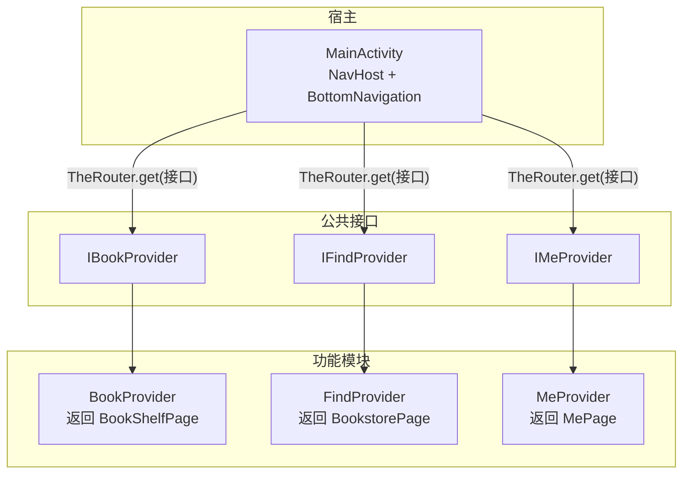
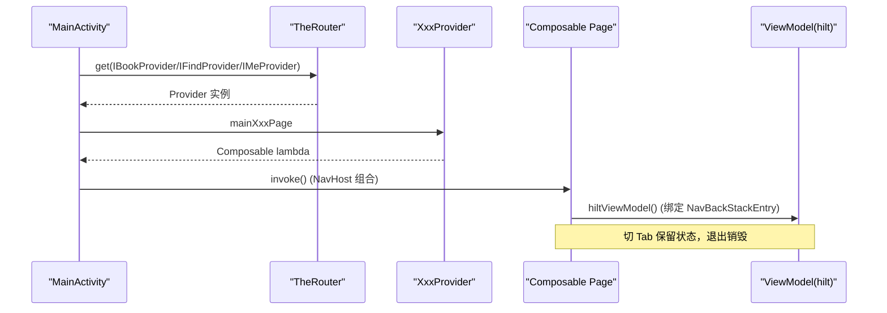
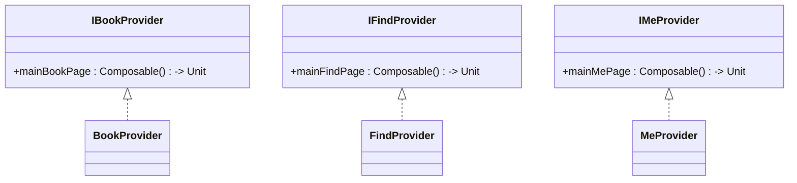
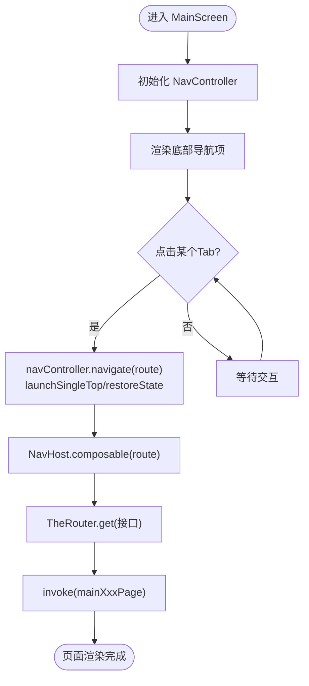
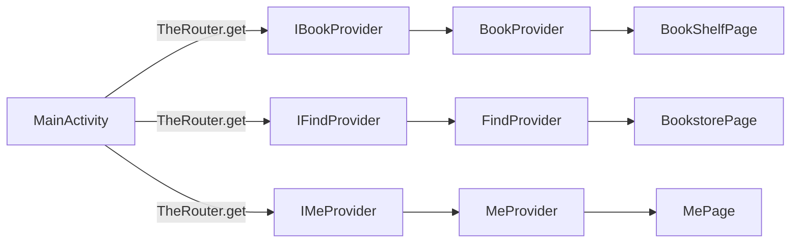

# Compose页面导航

<cite>
**本文引用的文件**
- [IBookProvider.kt](file://lib_book_common/src/main/java/com/ebook/common/provider/IBookProvider.kt)
- [IFindProvider.kt](file://lib_book_common/src/main/java/com/ebook/common/provider/IFindProvider.kt)
- [IMeProvider.kt](file://lib_book_common/src/main/java/com/ebook/common/provider/IMeProvider.kt)
- [MainActivity.kt](file://module_main/src/main/java/com/ebook/main/MainActivity.kt)
- [BookProvider.kt](file://module_book/src/main/java/com/ebook/book/provider/BookProvider.kt)
- [FindProvider.kt](file://module_find/src/main/java/com/ebook/find/provider/FindProvider.kt)
- [MeProvider.kt](file://module_me/src/main/java/com/ebook/me/provider/MeProvider.kt)
</cite>

## 目录
1. [简介](#简介)
2. [项目结构](#项目结构)
3. [核心组件](#核心组件)
4. [架构总览](#架构总览)
5. [详细组件分析](#详细组件分析)
6. [依赖关系分析](#依赖关系分析)
7. [性能考量](#性能考量)
8. [故障排查指南](#故障排查指南)
9. [结论](#结论)
10. [附录：完整示例与最佳实践](#附录完整示例与最佳实践)

## 简介
本文件聚焦于应用内基于 Jetpack Compose 的页面导航方案，说明如何通过 Provider 接口将各模块的 Composable 页面暴露给宿主（module_main），并由 TheRouter 进行服务发现与装配。重点包括：
- IBookProvider、IFindProvider、IMeProvider 接口的职责与使用方式
- MainActivity 中 NavHost 的配置与各 Tab 页面的组合策略
- 页面状态管理与生命周期绑定（hiltViewModel 与 NavBackStackEntry）
- Compose 页面与 Activity 页面的区别与适用场景
- 完整的页面注册、参数传递、状态管理示例
- Compose 导航与传统 Activity 导航混合使用的实践

## 项目结构
本项目采用多模块架构，跨模块页面通过 Provider 接口解耦，由 TheRouter 在运行时提供实现类实例；宿主 module_main 负责主界面导航容器（NavHost + BottomNavigation）。

图表来源
- [MainActivity.kt:175-195](file://module_main/src/main/java/com/ebook/main/MainActivity.kt#L175-L195)
- [IBookProvider.kt:1-13](file://lib_book_common/src/main/java/com/ebook/common/provider/IBookProvider.kt#L1-L13)
- [IFindProvider.kt:1-13](file://lib_book_common/src/main/java/com/ebook/common/provider/IFindProvider.kt#L1-L13)
- [IMeProvider.kt:1-13](file://lib_book_common/src/main/java/com/ebook/common/provider/IMeProvider.kt#L1-L13)
- [BookProvider.kt:1-15](file://module_book/src/main/java/com/ebook/book/provider/BookProvider.kt#L1-L15)
- [FindProvider.kt:1-19](file://module_find/src/main/java/com/ebook/find/provider/FindProvider.kt#L1-L19)
- [MeProvider.kt:1-20](file://module_me/src/main/java/com/ebook/me/provider/MeProvider.kt#L1-L20)

章节来源
- [MainActivity.kt:123-197](file://module_main/src/main/java/com/ebook/main/MainActivity.kt#L123-L197)

## 核心组件
- Provider 接口定义
  - IBookProvider：暴露书架模块的主页 Composable
  - IFindProvider：暴露书城模块的主页 Composable
  - IMeProvider：暴露个人中心模块的主页 Composable
- 宿主导航容器
  - MainActivity.MainScreen：定义三个 Tab 路由（bookshelf、bookstore、me），使用 NavHost 组合各 Provider 提供的 Composable 页面
- 服务提供者实现
  - BookProvider、FindProvider、MeProvider：以 @ServiceProvider 注解注册到 TheRouter，返回对应 Page 的 Composable

章节来源
- [IBookProvider.kt:1-13](file://lib_book_common/src/main/java/com/ebook/common/provider/IBookProvider.kt#L1-L13)
- [IFindProvider.kt:1-13](file://lib_book_common/src/main/java/com/ebook/common/provider/IFindProvider.kt#L1-L13)
- [IMeProvider.kt:1-13](file://lib_book_common/src/main/java/com/ebook/common/provider/IMeProvider.kt#L1-L13)
- [MainActivity.kt:123-197](file://module_main/src/main/java/com/ebook/main/MainActivity.kt#L123-L197)
- [BookProvider.kt:1-15](file://module_book/src/main/java/com/ebook/book/provider/BookProvider.kt#L1-L15)
- [FindProvider.kt:1-19](file://module_find/src/main/java/com/ebook/find/provider/FindProvider.kt#L1-L19)
- [MeProvider.kt:1-20](file://module_me/src/main/java/com/ebook/me/provider/MeProvider.kt#L1-L20)

## 架构总览
整体流程：
- 宿主通过 TheRouter 获取具体 Provider 实例
- 从 Provider 获取 Composable 页面并交给 NavHost 组合
- 每个 Tab 的页面拥有独立的 NavBackStackEntry，配合 hiltViewModel() 保持状态

图表来源
- [MainActivity.kt:175-195](file://module_main/src/main/java/com/ebook/main/MainActivity.kt#L175-L195)
- [BookProvider.kt:8-14](file://module_book/src/main/java/com/ebook/book/provider/BookProvider.kt#L8-L14)
- [FindProvider.kt:8-18](file://module_find/src/main/java/com/ebook/find/provider/FindProvider.kt#L8-L18)
- [MeProvider.kt:9-19](file://module_me/src/main/java/com/ebook/me/provider/MeProvider.kt#L9-L19)

## 详细组件分析

### 1) Provider 接口设计
- 设计目标：以最小契约暴露“页面级服务”，仅返回一个无参 Composable lambda，避免强耦合与复杂构造
- 优势：
  - 宿主无需感知模块内部细节
  - 便于测试与替换实现
  - 页面 ViewModel 作用域由调用处的 NavBackStackEntry 决定，天然具备导航栈生命周期

图表来源
- [IBookProvider.kt:1-13](file://lib_book_common/src/main/java/com/ebook/common/provider/IBookProvider.kt#L1-L13)
- [IFindProvider.kt:1-13](file://lib_book_common/src/main/java/com/ebook/common/provider/IFindProvider.kt#L1-L13)
- [IMeProvider.kt:1-13](file://lib_book_common/src/main/java/com/ebook/common/provider/IMeProvider.kt#L1-L13)
- [BookProvider.kt:1-15](file://module_book/src/main/java/com/ebook/book/provider/BookProvider.kt#L1-L15)
- [FindProvider.kt:1-19](file://module_find/src/main/java/com/ebook/find/provider/FindProvider.kt#L1-L19)
- [MeProvider.kt:1-20](file://module_me/src/main/java/com/ebook/me/provider/MeProvider.kt#L1-L20)

章节来源
- [IBookProvider.kt:1-13](file://lib_book_common/src/main/java/com/ebook/common/provider/IBookProvider.kt#L1-L13)
- [IFindProvider.kt:1-13](file://lib_book_common/src/main/java/com/ebook/common/provider/IFindProvider.kt#L1-L13)
- [IMeProvider.kt:1-13](file://lib_book_common/src/main/java/com/ebook/common/provider/IMeProvider.kt#L1-L13)

### 2) MainActivity 中的 NavHost 配置与 Tab 组合
- 路由定义：sealed class Screen 定义三个路由字符串（bookshelf、bookstore、me）
- 底部导航：NavigationBar 驱动 navController.navigate，使用 launchSingleTop、popUpTo、restoreState 保证状态保留
- 页面组合：composable{...} 中通过 TheRouter.get(接口) 获取 Provider，再调用其 mainXxxPage 组合页面
- 会话处理：在主界面订阅 SessionEventBus，统一处理登录过期跳转

图表来源
- [MainActivity.kt:139-197](file://module_main/src/main/java/com/ebook/main/MainActivity.kt#L139-L197)

章节来源
- [MainActivity.kt:123-197](file://module_main/src/main/java/com/ebook/main/MainActivity.kt#L123-L197)

### 3) Provider 模式实现原理
- 注册机制：各模块通过 @ServiceProvider 将实现类注册为 TheRouter 服务
- 解析过程：宿主通过接口类型向 TheRouter 请求服务，运行时根据编译期扫描或路由表找到实现类
- 解耦点：宿主只依赖接口，不直接依赖模块实现；新增模块只需新增接口与实现即可扩展
- 页面作用域：页面内使用 hiltViewModel()，默认绑定当前 NavBackStackEntry，切换 Tab 时状态保留，退出时销毁

章节来源
- [BookProvider.kt:8-14](file://module_book/src/main/java/com/ebook/book/provider/BookProvider.kt#L8-L14)
- [FindProvider.kt:8-18](file://module_find/src/main/java/com/ebook/find/provider/FindProvider.kt#L8-L18)
- [MeProvider.kt:9-19](file://module_me/src/main/java/com/ebook/me/provider/MeProvider.kt#L9-L19)
- [MainActivity.kt:175-195](file://module_main/src/main/java/com/ebook/main/MainActivity.kt#L175-L195)

### 4) Compose 页面与 Activity 页面的区别与适用场景
- Compose 页面（Provider 暴露）
  - 优点：轻量、声明式 UI；与 NavHost 深度集成；状态随 NavBackStackEntry 管理；易于组合与测试
  - 适用：模块主页、列表页、详情页等纯 UI 展示与简单交互
- Activity 页面
  - 优点：适合系统能力集成（启动转场、全屏覆盖、硬件相关）、需要独立任务栈的场景
  - 适用：阅读器、设置页、需要独立生命周期管理的页面
- 混合使用建议
  - 主页 Tab 走 Compose 导航，复杂或系统集成的子页面用 Activity
  - 跨模块跳转统一通过 TheRouter 路由，避免硬编码路径

章节来源
- [MainActivity.kt:45-56](file://module_main/src/main/java/com/ebook/main/MainActivity.kt#L45-L56)
- [MainActivity.kt:175-195](file://module_main/src/main/java/com/ebook/main/MainActivity.kt#L175-L195)

## 依赖关系分析
- 宿主（module_main）仅依赖公共接口（lib_book_common.provider.*），不直接依赖业务模块
- 各业务模块实现 Provider 并通过 TheRouter 暴露
- 页面内 ViewModel 通过 Hilt 注入，作用域由调用处 NavBackStackEntry 决定

图表来源
- [MainActivity.kt:175-195](file://module_main/src/main/java/com/ebook/main/MainActivity.kt#L175-L195)
- [BookProvider.kt:1-15](file://module_book/src/main/java/com/ebook/book/provider/BookProvider.kt#L1-L15)
- [FindProvider.kt:1-19](file://module_find/src/main/java/com/ebook/find/provider/FindProvider.kt#L1-L19)
- [MeProvider.kt:1-20](file://module_me/src/main/java/com/ebook/me/provider/MeProvider.kt#L1-L20)

章节来源
- [MainActivity.kt:175-195](file://module_main/src/main/java/com/ebook/main/MainActivity.kt#L175-L195)

## 性能考量
- 页面组合开销：Provider 返回的是 Composable lambda，实际页面实例在每次组合时创建，符合 Compose 语义；合理拆分页面与复用组件可降低重建成本
- 状态保留：BottomNavigation 使用 launchSingleTop、restoreState，避免重复创建与状态丢失
- ViewModel 作用域：hiltViewModel() 绑定 NavBackStackEntry，切 Tab 时自动复用与释放，减少冗余内存占用
- 网络与数据加载：建议在页面 ViewModel 中做防抖与缓存，避免频繁重拉

[本节为通用指导，不直接分析特定文件]

## 故障排查指南
- TheRouter 找不到服务
  - 现象：Provider 为空导致页面无法显示
  - 排查：确认模块已正确添加 @ServiceProvider；检查路由表是否生成；确保构建后安装最新 APK
- 页面状态异常
  - 现象：切 Tab 后数据丢失或重复加载
  - 排查：确认使用 hiltViewModel() 并绑定 NavBackStackEntry；检查是否错误地在顶层保存状态
- 会话过期未跳转
  - 现象：登录后仍停留在原页面
  - 排查：确认 MainActivity 订阅了 SessionEventBus，并在 SessionExpired 时执行清会话与跳转

章节来源
- [MainActivity.kt:68-80](file://module_main/src/main/java/com/ebook/main/MainActivity.kt#L68-L80)

## 结论
本项目通过 Provider 接口与 TheRouter 实现了模块间的 Compose 页面解耦与组合，结合 NavHost 与 BottomNavigation 构建了清晰的三 Tab 导航体系。该方案具备良好的可扩展性、可测试性与状态管理能力，同时支持与传统 Activity 的混合使用，满足复杂场景需求。

[本节为总结，不直接分析特定文件]

## 附录：完整示例与最佳实践

### A. 页面注册与组合（已有实现）
- 接口定义：在 lib_book_common.provider 中定义 IBookProvider、IFindProvider、IMeProvider
- 模块实现：在各模块 provider 包下实现接口并以 @ServiceProvider 注册
- 宿主组合：在 MainActivity 的 NavHost 中通过 TheRouter.get(接口) 获取 Provider 并组合页面

章节来源
- [IBookProvider.kt:1-13](file://lib_book_common/src/main/java/com/ebook/common/provider/IBookProvider.kt#L1-L13)
- [IFindProvider.kt:1-13](file://lib_book_common/src/main/java/com/ebook/common/provider/IFindProvider.kt#L1-L13)
- [IMeProvider.kt:1-13](file://lib_book_common/src/main/java/com/ebook/common/provider/IMeProvider.kt#L1-L13)
- [BookProvider.kt:8-14](file://module_book/src/main/java/com/ebook/book/provider/BookProvider.kt#L8-L14)
- [FindProvider.kt:8-18](file://module_find/src/main/java/com/ebook/find/provider/FindProvider.kt#L8-L18)
- [MeProvider.kt:9-19](file://module_me/src/main/java/com/ebook/me/provider/MeProvider.kt#L9-L19)
- [MainActivity.kt:175-195](file://module_main/src/main/java/com/ebook/main/MainActivity.kt#L175-L195)

### B. 参数传递
- Compose 页面间传参：推荐通过 ViewModel + StateFlow/SharedFlow 或在页面参数中以数据类形式传入（如 route 参数或 composable 参数）
- 跨模块参数：可通过 TheRouter 携带参数，或在 Provider 层封装带参数的 Composable lambda（需调整接口契约）

[本节为通用指导，不直接分析特定文件]

### C. 状态管理
- 页面级状态：使用 mutableStateOf 管理本地 UI 状态
- 共享状态：通过 ViewModel 暴露 StateFlow，Compose 侧 collectAsState 订阅
- 导航状态：依赖 NavBackStackEntry 与 hiltViewModel() 自动管理生命周期

[本节为通用指导，不直接分析特定文件]

### D. Compose 与传统 Activity 混合使用
- 主页 Tab 使用 Compose 导航（Bookstore/Bookshelf/Me）
- 复杂页面（如阅读、设置）使用 Activity，通过 TheRouter 路由跳转
- 注意主题与 insets 的一致性，避免样式分裂

章节来源
- [MainActivity.kt:45-56](file://module_main/src/main/java/com/ebook/main/MainActivity.kt#L45-L56)
- [MainActivity.kt:175-195](file://module_main/src/main/java/com/ebook/main/MainActivity.kt#L175-L195)