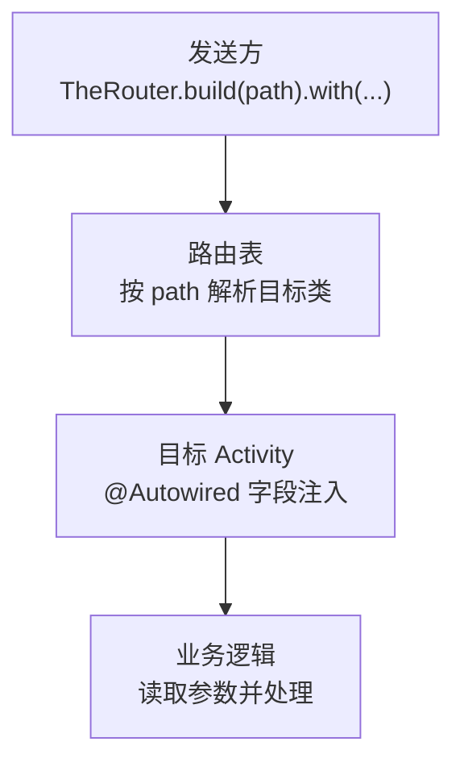
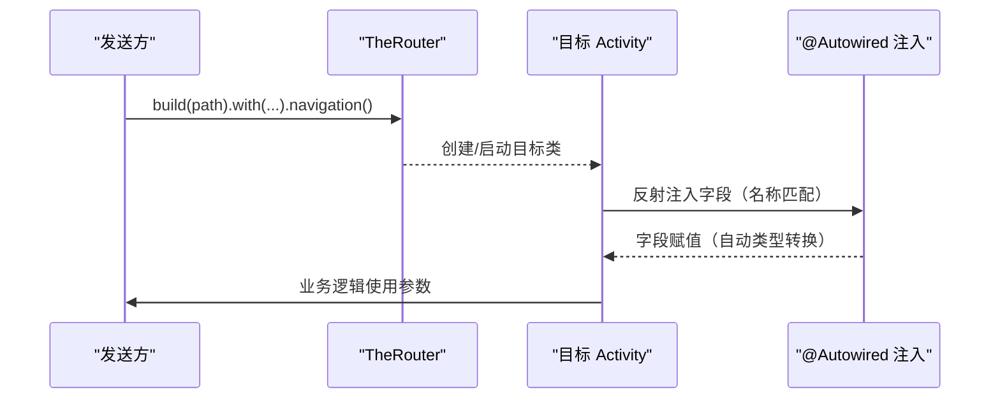
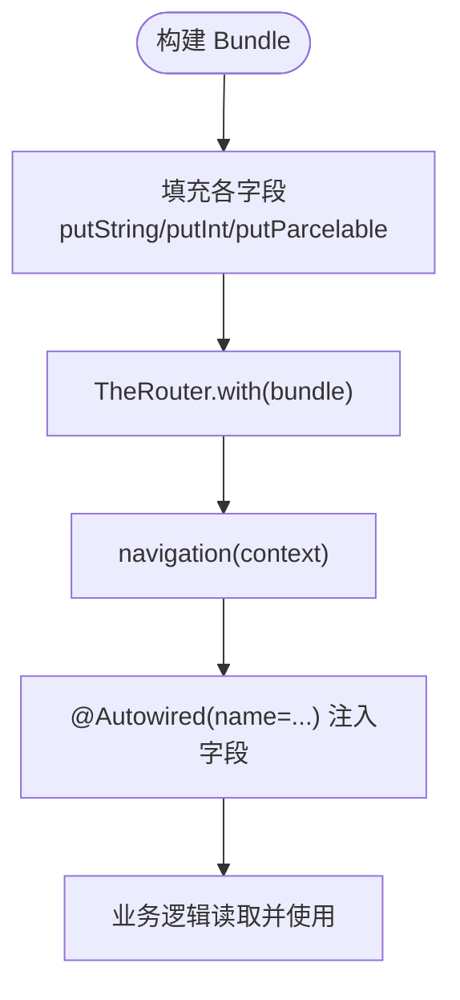

# 参数传递机制

<cite>
**本文引用的文件**
- [BookDetailActivity.kt](file://module_book/src/main/java/com/ebook/book/BookDetailActivity.kt)
- [ReadBookActivity.kt](file://module_book/src/main/java/com/ebook/book/ReadBookActivity.kt)
- [RouteArgs.kt](file://lib_book_common/src/main/java/com/ebook/common/event/RouteArgs.kt)
- [AboutActivity.kt](file://module_me/src/main/java/com/ebook/me/view/AboutActivity.kt)
- [DocActivity.kt](file://module_me/src/main/java/com/ebook/me/view/DocActivity.kt)
- [TestInterruptActivity.kt](file://module_login/src/main/test/debug/TestInterruptActivity.kt)
- [SearchActivity.kt](file://module_find/src/main/java/com/ebook/find/SearchActivity.kt)
</cite>

## 目录
1. [简介](#简介)
2. [项目结构与路由上下文](#项目结构与路由上下文)
3. [核心组件与能力](#核心组件与能力)
4. [架构总览](#架构总览)
5. [详细组件分析](#详细组件分析)
6. [依赖关系分析](#依赖关系分析)
7. [性能与内存考量](#性能与内存考量)
8. [故障排查指南](#故障排查指南)
9. [结论](#结论)
10. [附录：常见场景示例与最佳实践](#附录：常见场景示例与最佳实践)

## 简介
本文件聚焦于项目中基于 TheRouter 的参数传递机制，覆盖以下要点：
- with() 方法支持的参数类型（字符串、整数、对象、Bundle 等）及其使用方式
- @Autowired 注解的使用方法与参数名匹配、类型转换行为
- 复杂对象的序列化与反序列化策略
- 跨模块参数传递的注意事项
- Intent 数据与 TheRouter 参数的区别及适用场景
- 完整的参数传递示例（简单参数、复杂对象、条件处理）
- 参数验证与错误处理机制

## 项目结构与路由上下文
- 路由与页面均位于各业务模块中，通过 TheRouter 进行跨模块导航。
- 跨模块共享的 Bundle key 集中在 RouteArgs 中声明，避免硬编码字符串导致键不一致问题。
- Activity 中通过 TheRouter.build(path).with(...).navigation(...) 发起跳转，并在目标页使用 @Autowired 字段注入参数。

**图表来源**
- [BookDetailActivity.kt:53-68](file://module_book/src/main/java/com/ebook/book/BookDetailActivity.kt#L53-L68)
- [AboutActivity.kt:85-92](file://module_me/src/main/java/com/ebook/me/view/AboutActivity.kt#L85-L92)
- [ReadBookActivity.kt:221-235](file://module_book/src/main/java/com/ebook/book/ReadBookActivity.kt#L221-L235)

**章节来源**
- [RouteArgs.kt:1-33](file://lib_book_common/src/main/java/com/ebook/common/event/RouteArgs.kt#L1-L33)

## 核心组件与能力
- TheRouter 提供链式 API：build(path) 指定路由路径，with(...) 附加参数，navigation(...) 执行跳转。
- @Autowired 用于在目标 Activity 中声明待注入的字段；name 属性指定与发送方一致的 key。
- Bundle 作为通用载体，支持 putString、putInt、putParcelable 等；对于大对象建议使用 BitIntentDataManager 等外部存储并通过 data_key 传递引用。
- 跨模块 Bundle key 统一在 RouteArgs 中定义，保证发送方与接收方一致。

**章节来源**
- [BookDetailActivity.kt:53-68](file://module_book/src/main/java/com/ebook/book/BookDetailActivity.kt#L53-L68)
- [ReadBookActivity.kt:221-235](file://module_book/src/main/java/com/ebook/book/ReadBookActivity.kt#L221-L235)
- [RouteArgs.kt:1-33](file://lib_book_common/src/main/java/com/ebook/common/event/RouteArgs.kt#L1-L33)

## 架构总览
下图展示了从发送方到目标页面的参数传递流程，包括 with(Bundle)、withInt 以及 @Autowired 注入过程。

**图表来源**
- [BookDetailActivity.kt:53-68](file://module_book/src/main/java/com/ebook/book/BookDetailActivity.kt#L53-L68)
- [AboutActivity.kt:85-92](file://module_me/src/main/java/com/ebook/me/view/AboutActivity.kt#L85-L92)
- [ReadBookActivity.kt:221-235](file://module_book/src/main/java/com/ebook/book/ReadBookActivity.kt#L221-L235)

## 详细组件分析

### 使用 with(Bundle) 传递复杂对象
- 将多个字段封装进 Bundle，通过 TheRouter.with(bundle) 传递，目标页用 @Autowired(name = "...") 注入对应字段。
- 复杂对象（如实体）建议以“数据键 + 临时存储”的方式传递，避免 Intent 大小限制与跨进程序列化开销。

**图表来源**
- [BookDetailActivity.kt:116-119](file://module_book/src/main/java/com/ebook/book/BookDetailActivity.kt#L116-L119)
- [ReadBookActivity.kt:221-235](file://module_book/src/main/java/com/ebook/book/ReadBookActivity.kt#L221-L235)

**章节来源**
- [BookDetailActivity.kt:53-68](file://module_book/src/main/java/com/ebook/book/BookDetailActivity.kt#L53-L68)
- [ReadBookActivity.kt:221-235](file://module_book/src/main/java/com/ebook/book/ReadBookActivity.kt#L221-L235)
- [RouteArgs.kt:1-33](file://lib_book_common/src/main/java/com/ebook/common/event/RouteArgs.kt#L1-L33)

### 使用 withInt 传递简单参数
- 适用于轻量参数（如枚举或状态码），通过 withInt(key, value) 传递，目标页用 @Autowired(name = "...") 接收。
- 注意 key 必须与发送方一致，建议在常量中集中管理。

**章节来源**
- [AboutActivity.kt:85-92](file://module_me/src/main/java/com/ebook/me/view/AboutActivity.kt#L85-L92)

### 使用 Intent extra 直接传参
- 某些场景直接使用 Intent.putExtra/getStringExtra 更简洁（如阅读器打开书籍时的 data_key）。
- 适合单模块内或不需要跨模块解耦的场景；跨模块时优先推荐 TheRouter。

**章节来源**
- [ReadBookActivity.kt:170-188](file://module_book/src/main/java/com/ebook/book/ReadBookActivity.kt#L170-L188)

### 跨模块 Bundle key 统一管理
- 所有跨模块共享的 Bundle key 在 RouteArgs 中声明，发送方与接收方引用同一常量，避免运行时静默丢参。
- 典型场景：评论页定位章节、书籍 noteUrl 等。

**章节来源**
- [RouteArgs.kt:1-33](file://lib_book_common/src/main/java/com/ebook/common/event/RouteArgs.kt#L1-L33)

### @Autowired 参数注入与类型转换
- name 属性指定 key，字段类型需与传入值兼容；框架会尝试类型转换（例如 String → Int 或基本类型自动转换）。
- 若类型不匹配或 key 缺失，可能得到默认值或空值；应在调用侧做前置校验。

**章节来源**
- [BookDetailActivity.kt:53-68](file://module_book/src/main/java/com/ebook/book/BookDetailActivity.kt#L53-L68)
- [TestInterruptActivity.kt:29-33](file://module_login/src/main/test/debug/TestInterruptActivity.kt#L29-L33)

### 复杂对象的序列化与反序列化
- 对于大型对象，不建议直接放入 Intent/Bundle；采用“临时存储 + data_key”模式：
  - 发送方将对象存入 BitIntentDataManager，返回 data_key；
  - 通过 TheRouter.with(data_key) 传递键；
  - 目标页根据 data_key 取回对象并清理缓存。
- 优点：避免大对象序列化失败、降低跨进程开销；缺点：需确保生命周期与清理时机正确。

**章节来源**
- [ReadBookActivity.kt:170-188](file://module_book/src/main/java/com/ebook/book/ReadBookActivity.kt#L170-L188)
- [BookDetailActivity.kt:101-104](file://module_book/src/main/java/com/ebook/book/BookDetailActivity.kt#L101-L104)

### 条件参数处理
- 在目标页对可选参数进行判空与分支处理，避免空指针与异常；
- 结合 ViewModel 初始化逻辑，区分不同入口（如书架 vs 搜索）加载策略。

**章节来源**
- [BookDetailActivity.kt:71-91](file://module_book/src/main/java/com/ebook/book/BookDetailActivity.kt#L71-L91)

## 依赖关系分析
- 发送方依赖 TheRouter 与常量（如 KeyCode、RouteArgs）；
- 目标页依赖 TheRouter 的 @Autowired 注入；
- 跨模块通过 routeMap 与路径解耦，减少编译期耦合。

**图表来源**
- [BookDetailActivity.kt:53-68](file://module_book/src/main/java/com/ebook/book/BookDetailActivity.kt#L53-L68)
- [AboutActivity.kt:85-92](file://module_me/src/main/java/com/ebook/me/view/AboutActivity.kt#L85-L92)
- [ReadBookActivity.kt:221-235](file://module_book/src/main/java/com/ebook/book/ReadBookActivity.kt#L221-L235)

**章节来源**
- [RouteArgs.kt:1-33](file://lib_book_common/src/main/java/com/ebook/common/event/RouteArgs.kt#L1-L33)

## 性能与内存考量
- 避免在 Intent/Bundle 中传递大对象，改用 data_key + 临时存储；
- 及时清理临时数据，防止内存泄漏；
- 合理使用 withInt/with(String) 等轻量 API 提升性能；
- 跨模块路由查找成本较低，但应控制路由数量与层级。

## 故障排查指南
- 参数为空或类型不匹配：检查发送方 key 与接收方 @Autowired(name) 是否一致；确认类型可转换；
- 跨模块路由失效：确认 routeMap 已生成且 APK 已重新构建；独立模式下需在测试宿主占位路由；
- 大对象传递失败：改用 data_key + BitIntentDataManager；
- Intent 与 TheRouter 混用：明确职责边界，跨模块优先 TheRouter；
- Bundle key 不一致：统一到 RouteArgs 中管理。

**章节来源**
- [BookDetailActivity.kt:71-91](file://module_book/src/main/java/com/ebook/book/BookDetailActivity.kt#L71-L91)
- [ReadBookActivity.kt:170-188](file://module_book/src/main/java/com/ebook/book/ReadBookActivity.kt#L170-L188)
- [RouteArgs.kt:1-33](file://lib_book_common/src/main/java/com/ebook/common/event/RouteArgs.kt#L1-L33)

## 结论
本项目通过 TheRouter 与 @Autowired 实现了类型安全、可维护的参数传递机制。配合统一的 RouteArgs 与 data_key 模式，既满足简单参数快速传递，又支持复杂对象跨模块传输。遵循上述最佳实践可有效避免运行时错误、提升性能与可维护性。

## 附录：常见场景示例与最佳实践

### 场景一：简单参数传递（withInt）
- 发送方：TheRouter.build(path).withInt(key, value).navigation()
- 接收方：@Autowired(name = "key") var value: Int
- 适用：状态码、开关、枚举等轻量参数

**章节来源**
- [AboutActivity.kt:85-92](file://module_me/src/main/java/com/ebook/me/view/AboutActivity.kt#L85-L92)

### 场景二：复杂对象传递（with(Bundle)）
- 发送方：构建 Bundle，putString/putInt/putParcelable，TheRouter.with(bundle)
- 接收方：@Autowired(name = "...") 注入对应字段
- 适用：多字段组合、小对象

**章节来源**
- [ReadBookActivity.kt:221-235](file://module_book/src/main/java/com/ebook/book/ReadBookActivity.kt#L221-L235)

### 场景三：大对象传递（data_key + 临时存储）
- 发送方：BitIntentDataManager.putData(obj) → data_key；TheRouter.with(data_key)
- 接收方：BitIntentDataManager.getData(data_key) → obj；cleanData(data_key)
- 适用：大对象、跨进程、避免序列化失败

**章节来源**
- [ReadBookActivity.kt:170-188](file://module_book/src/main/java/com/ebook/book/ReadBookActivity.kt#L170-L188)
- [BookDetailActivity.kt:101-104](file://module_book/src/main/java/com/ebook/book/BookDetailActivity.kt#L101-L104)

### 场景四：条件参数处理
- 接收方对可选参数判空与分支处理；
- 结合入口标识（如 from）决定加载策略（本地 vs 网络）。

**章节来源**
- [BookDetailActivity.kt:71-91](file://module_book/src/main/java/com/ebook/book/BookDetailActivity.kt#L71-L91)

### 场景五：跨模块 Bundle key 统一管理
- 统一在 RouteArgs 中定义 key；
- 发送方与接收方引用同一常量，避免键不一致。

**章节来源**
- [RouteArgs.kt:1-33](file://lib_book_common/src/main/java/com/ebook/common/event/RouteArgs.kt#L1-L33)

### 意图与 TheRouter 的区别与选择
- Intent.putExtra：适合单模块内或无需跨模块解耦的快速传参；
- TheRouter：适合跨模块、需要解耦与集中管理的场景；
- 混合使用时注意职责边界与一致性。

**章节来源**
- [ReadBookActivity.kt:170-188](file://module_book/src/main/java/com/ebook/book/ReadBookActivity.kt#L170-L188)