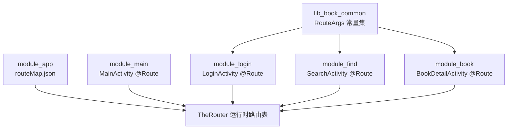
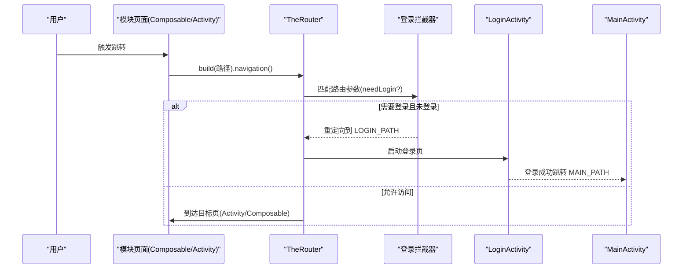
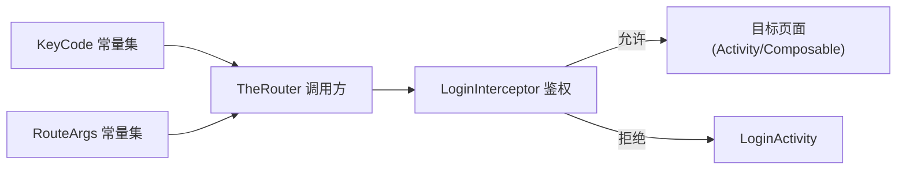

# 基础路由配置

<cite>
**本文引用的文件**
- [module_app/src/main/assets/therouter/routeMap.json](file://module_app/src/main/assets/therouter/routeMap.json)
- [module_main/src/main/java/com/ebook/main/MainActivity.kt](file://module_main/src/main/java/com/ebook/main/MainActivity.kt)
- [lib_book_common/src/main/java/com/ebook/common/event/RouteArgs.kt](file://lib_book_common/src/main/java/com/ebook/common/event/RouteArgs.kt)
- [module_login/src/main/java/com/ebook/login/LoginActivity.kt](file://module_login/src/main/java/com/ebook/login/LoginActivity.kt)
- [module_find/src/main/java/com/ebook/find/SearchActivity.kt](file://module_find/src/main/java/com/ebook/find/SearchActivity.kt)
- [module_book/src/main/java/com/ebook/book/BookDetailActivity.kt](file://module_book/src/main/java/com/ebook/book/BookDetailActivity.kt)
- [lib_book_common/src/main/java/com/ebook/common/interceptor/LoginInterceptor.kt](file://lib_book_common/src/main/java/com/ebook/common/interceptor/LoginInterceptor.kt)
- [module_me/src/main/java/com/ebook/me/page/MePage.kt](file://module_me/src/main/java/com/ebook/me/page/MePage.kt)
</cite>

## 目录
1. [简介](#简介)
2. [项目结构与路由装配位置](#项目结构与路由装配位置)
3. [核心组件与职责](#核心组件与职责)
4. [架构总览](#架构总览)
5. [详细组件分析](#详细组件分析)
6. [依赖关系分析](#依赖关系分析)
7. [性能与可维护性建议](#性能与可维护性建议)
8. [故障排查指南](#故障排查指南)
9. [结论](#结论)

## 简介
本文件聚焦于 TheRouter 在本项目中的集成方式、路径命名规范、@Route 注解使用方式、以及 Activity 与 Composable 页面的路由注册模式。文档基于仓库内已落地的路由表与页面实现，给出跨模块路由的最佳实践、权限控制方案（需登录）以及避免路径冲突的约定。

## 项目结构与路由装配位置
- 每个功能模块在自身 assets 下提供 therouter/routeMap.json，由构建期生成并合并到最终 APK，作为 TheRouter 的路由发现源。根应用 module_app 的 routeMap.json 汇总了各模块暴露的路径，形成全局路由表。
- 主入口 MainActivity 通过 @Route(path = KeyCode.Main.MAIN_PATH) 注册主界面；其他业务页以各自模块的 Activity 或 Provider 暴露的 Composable 页面参与导航。
- 跨模块传参统一通过 RouteArgs 集中管理 Bundle key，避免字符串硬编码导致的“改键不报错但参数丢失”问题。

图表来源
- [module_app/src/main/assets/therouter/routeMap.json:1-150](file://module_app/src/main/assets/therouter/routeMap.json#L1-L150)
- [module_main/src/main/java/com/ebook/main/MainActivity.kt:58-59](file://module_main/src/main/java/com/ebook/main/MainActivity.kt#L58-L59)
- [module_login/src/main/java/com/ebook/login/LoginActivity.kt:50-51](file://module_login/src/main/java/com/ebook/login/LoginActivity.kt#L50-L51)
- [module_find/src/main/java/com/ebook/find/SearchActivity.kt:130-131](file://module_find/src/main/java/com/ebook/find/SearchActivity.kt#L130-L131)
- [module_book/src/main/java/com/ebook/book/BookDetailActivity.kt:54-55](file://module_book/src/main/java/com/ebook/book/BookDetailActivity.kt#L54-L55)
- [lib_book_common/src/main/java/com/ebook/common/event/RouteArgs.kt:1-33](file://lib_book_common/src/main/java/com/ebook/common/event/RouteArgs.kt#L1-L33)

章节来源
- [module_app/src/main/assets/therouter/routeMap.json:1-150](file://module_app/src/main/assets/therouter/routeMap.json#L1-L150)
- [module_main/src/main/java/com/ebook/main/MainActivity.kt:45-115](file://module_main/src/main/java/com/ebook/main/MainActivity.kt#L45-L115)

## 核心组件与职责
- 路由表（routeMap.json）：声明 path → className 映射，并在部分条目携带 params（如 needLogin），用于 TheRouter 启动时的鉴权拦截。
- 页面注册（@Route）：业务 Activity 在类上标注 @Route，path 使用 KeyCode 常量集中定义，避免散落的字面量路径。
- 路由调用（TheRouter.build(...).navigation()）：跨模块跳转统一通过 TheRouter，配合 KeyCode 常量与 RouteArgs 常量传递参数。
- 权限拦截（LoginInterceptor + needLogin）：对需要登录的路由进行拦截，未登录时重定向到登录页。
- 主页与 Tab 组合（Provider + NavHost）：主界面通过 Provider 注入各模块的 Composable 页面，使用 Jetpack Navigation 组合，无需 Fragment。

章节来源
- [module_app/src/main/assets/therouter/routeMap.json:1-150](file://module_app/src/main/assets/therouter/routeMap.json#L1-L150)
- [module_main/src/main/java/com/ebook/main/MainActivity.kt:117-197](file://module_main/src/main/java/com/ebook/main/MainActivity.kt#L117-L197)
- [lib_book_common/src/main/java/com/ebook/common/interceptor/LoginInterceptor.kt:35-50](file://lib_book_common/src/main/java/com/ebook/common/interceptor/LoginInterceptor.kt#L35-L50)

## 架构总览
下图展示了从点击跳转到登录态检查再到目标页呈现的完整流程，覆盖 Activity 与 Composable 两种注册形态。

图表来源
- [module_main/src/main/java/com/ebook/main/MainActivity.kt:58-77](file://module_main/src/main/java/com/ebook/main/MainActivity.kt#L58-L77)
- [lib_book_common/src/main/java/com/ebook/common/interceptor/LoginInterceptor.kt:35-50](file://lib_book_common/src/main/java/com/ebook/common/interceptor/LoginInterceptor.kt#L35-L50)
- [module_app/src/main/assets/therouter/routeMap.json:72-105](file://module_app/src/main/assets/therouter/routeMap.json#L72-L105)

## 详细组件分析

### 路由表与路径命名规范
- 路径前缀按模块划分：/ebook/main/*、/ebook/user/*、/ebook/find/*、/ebook/book/*、/ebook/me/*，保证不同模块路径互不冲突。
- 路径语义清晰：例如 /ebook/main/main 为主页，/ebook/user/login 为登录页，/ebook/find/search 为搜索页，/ebook/book/detail 为书籍详情页。
- 权限控制：对需要登录的路由在 params 中声明 needLogin=true，由拦截器处理。

示例路径（来自全局路由表）
- /ebook/main/main → MainActivity
- /ebook/user/login → LoginActivity
- /ebook/user/register → RegisterActivity
- /ebook/user/modify_pwd → ModifyPwdActivity
- /ebook/find/search → SearchActivity
- /ebook/book/detail → BookDetailActivity
- /ebook/me/comment → MyCommentActivity（需登录）
- /ebook/me/modify → ModifyInformationActivity（需登录）

章节来源
- [module_app/src/main/assets/therouter/routeMap.json:1-150](file://module_app/src/main/assets/therouter/routeMap.json#L1-L150)

### @Route 注解与路径常量
- 所有 Activity 的 @Route 路径均来自 KeyCode 常量（如 KeyCode.Main.MAIN_PATH、KeyCode.Login.LOGIN_PATH 等），禁止直接写死字符串路径。
- 好处：编译期统一维护、避免路径拼写错误、便于后续统一替换与审计。

典型注册点
- 主界面：MainActivity 使用 @Route(path = KeyCode.Main.MAIN_PATH)
- 登录页：LoginActivity 使用 @Route(path = KeyCode.Login.LOGIN_PATH)
- 搜索页：SearchActivity 使用 @Route(path = KeyCode.Find.SEARCH_PATH)
- 书籍详情：BookDetailActivity 使用 @Route(path = KeyCode.Book.DETAIL_PATH)

章节来源
- [module_main/src/main/java/com/ebook/main/MainActivity.kt:58-59](file://module_main/src/main/java/com/ebook/main/MainActivity.kt#L58-L59)
- [module_login/src/main/java/com/ebook/login/LoginActivity.kt:50-51](file://module_login/src/main/java/com/ebook/login/LoginActivity.kt#L50-L51)
- [module_find/src/main/java/com/ebook/find/SearchActivity.kt:130-131](file://module_find/src/main/java/com/ebook/find/SearchActivity.kt#L130-L131)
- [module_book/src/main/java/com/ebook/book/BookDetailActivity.kt:54-55](file://module_book/src/main/java/com/ebook/book/BookDetailActivity.kt#L54-L55)

### 跨模块传参与 KeyCode/RouteArgs 最佳实践
- 路由参数 key 集中在 RouteArgs 中声明，发送方与接收方引用同一常量，避免“改了 key 但对方不知道”的运行时静默丢参。
- 常见键包括章节 URL、章节名、书名、评论聚合键、笔记 URL 等。

章节来源
- [lib_book_common/src/main/java/com/ebook/common/event/RouteArgs.kt:1-33](file://lib_book_common/src/main/java/com/ebook/common/event/RouteArgs.kt#L1-L33)

### 主界面与 Composable 页面路由
- 主界面 MainActivity 通过 TheRouter 注册到 MAIN_PATH，内部使用 Jetpack Navigation 组合三个 Tab 的 Composable 页面。
- 各 Tab 的 Composable 页面通过 Provider 接口暴露（IBookProvider.mainBookPage、IFindProvider.mainFindPage、IMeProvider.mainMePage），在 NavHost 中以 composable(route){ ... } 形式组合。
- 这种模式避免了 Fragment 嵌套，状态由 Hilt 绑定的 ViewModel 与 NavBackStackEntry 共同管理。

章节来源
- [module_main/src/main/java/com/ebook/main/MainActivity.kt:117-197](file://module_main/src/main/java/com/ebook/main/MainActivity.kt#L117-L197)

### 权限控制与登录重定向
- 对于需要登录的路由（params.needLogin=true），LoginInterceptor 会判断当前会话状态；若未登录，将目标路径替换为登录页路径（KeyCode.Login.LOGIN_PATH）。
- 登录成功后，通常回跳到主页（KeyCode.Main.MAIN_PATH）。

章节来源
- [lib_book_common/src/main/java/com/ebook/common/interceptor/LoginInterceptor.kt:35-50](file://lib_book_common/src/main/java/com/ebook/common/interceptor/LoginInterceptor.kt#L35-L50)
- [module_me/src/main/java/com/ebook/me/page/MePage.kt:80-95](file://module_me/src/main/java/com/ebook/me/page/MePage.kt#L80-L95)

### 路径层次结构设计原则与冲突规避
- 按模块分层：/ebook/{模块}/{子功能}，确保不同模块之间不会冲突。
- 语义化命名：路径反映页面用途（login、search、detail、comment 等）。
- 避免重复：新增路由前先检索已有路径前缀与具体路径，必要时通过细分子路径扩展（如 /ebook/me/cache、/ebook/me/about）。
- 资源与路由分离：路由表只负责 path→class 映射，UI 文案与图标由页面自身资源提供。

章节来源
- [module_app/src/main/assets/therouter/routeMap.json:1-150](file://module_app/src/main/assets/therouter/routeMap.json#L1-L150)

## 依赖关系分析
- 模块间通过 TheRouter 解耦：调用方仅持有路径常量（KeyCode）与参数常量（RouteArgs），无需感知目标模块的具体类。
- 路由表由构建产物合并，新增模块只需在自身 assets 添加 routeMap.json 条目即可被全局发现。
- 权限拦截位于 lib_book_common，统一处理 needLogin 逻辑，降低各模块重复代码。

图表来源
- [module_main/src/main/java/com/ebook/main/MainActivity.kt:58-77](file://module_main/src/main/java/com/ebook/main/MainActivity.kt#L58-L77)
- [lib_book_common/src/main/java/com/ebook/common/interceptor/LoginInterceptor.kt:35-50](file://lib_book_common/src/main/java/com/ebook/common/interceptor/LoginInterceptor.kt#L35-L50)
- [module_app/src/main/assets/therouter/routeMap.json:1-150](file://module_app/src/main/assets/therouter/routeMap.json#L1-L150)

章节来源
- [module_main/src/main/java/com/ebook/main/MainActivity.kt:58-77](file://module_main/src/main/java/com/ebook/main/MainActivity.kt#L58-L77)
- [lib_book_common/src/main/java/com/ebook/common/interceptor/LoginInterceptor.kt:35-50](file://lib_book_common/src/main/java/com/ebook/common/interceptor/LoginInterceptor.kt#L35-L50)

## 性能与可维护性建议
- 路径常量集中管理：新增/修改路由必须更新 KeyCode，保持调用方与注册端一致。
- 路由表精简：routeMap.json 仅保留必要字段（path、className、params），减少冗余信息。
- 懒加载 Composable：Tab 内的 Composable 通过 Provider 按需注入，减少首屏负担。
- 鉴权拦截轻量：LoginInterceptor 只做最小判断与重定向，避免阻塞主线程。
- 参数传递安全：跨模块一律使用 RouteArgs 常量，避免字符串魔法值。

[本节为通用建议，不直接分析具体文件]

## 故障排查指南
- 路由找不到或跳转无效：检查对应模块的 routeMap.json 是否包含该 path，以及 @Route 注解的 path 是否与常量一致。
- 登录后仍无法进入目标页：确认 needLogin 路由是否正确被 LoginInterceptor 拦截，以及登录成功后的回跳路径是否正确。
- 传参丢失：核对 RouteArgs 中的 key 是否与接收端一致，避免手写字符串 key。
- 主界面异常：确认 MainActivity 的 @Route 路径为 MAIN_PATH，且主页 NavHost 正确组合了各 Tab 的 Composable 页面。

章节来源
- [module_app/src/main/assets/therouter/routeMap.json:1-150](file://module_app/src/main/assets/therouter/routeMap.json#L1-L150)
- [module_main/src/main/java/com/ebook/main/MainActivity.kt:58-77](file://module_main/src/main/java/com/ebook/main/MainActivity.kt#L58-L77)
- [lib_book_common/src/main/java/com/ebook/common/event/RouteArgs.kt:1-33](file://lib_book_common/src/main/java/com/ebook/common/event/RouteArgs.kt#L1-L33)

## 结论
本项目通过 TheRouter + routeMap.json + @Route 的组合实现了跨模块路由的解耦与统一管理。路径采用模块化前缀与语义化命名，结合 RouteArgs 常量集中管理传参 key，并通过 LoginInterceptor 对 needLogin 路由进行统一鉴权。主界面以 Composable 页面组合 Tab，提升可维护性与性能。遵循本文规范可有效避免路径冲突、提高可测试性与可演进性。