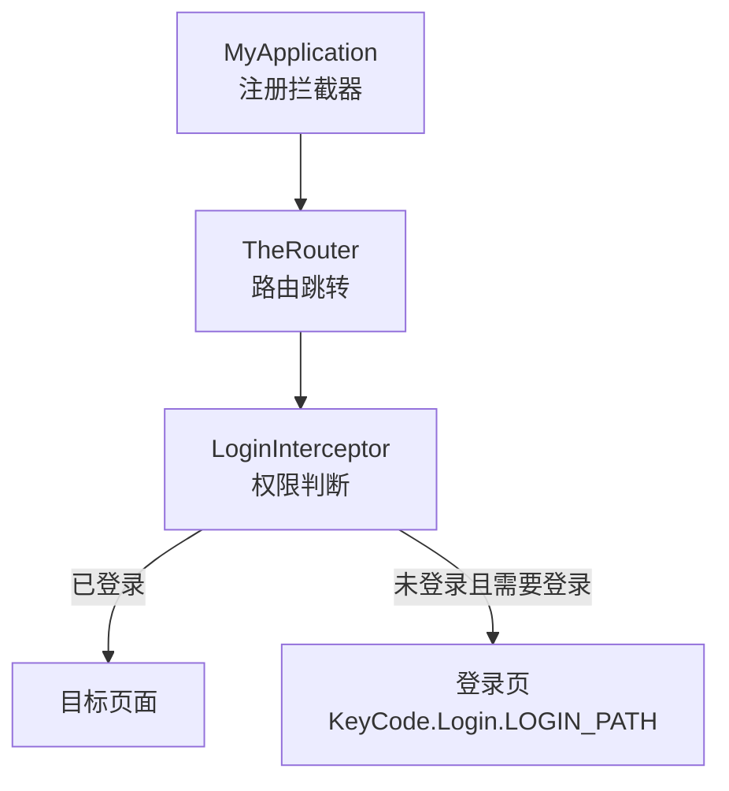
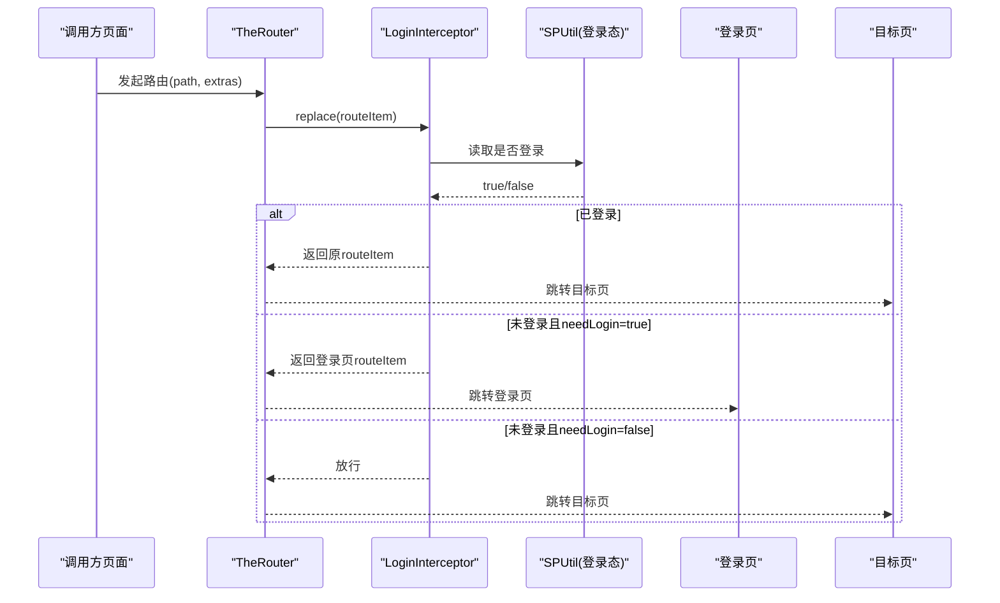
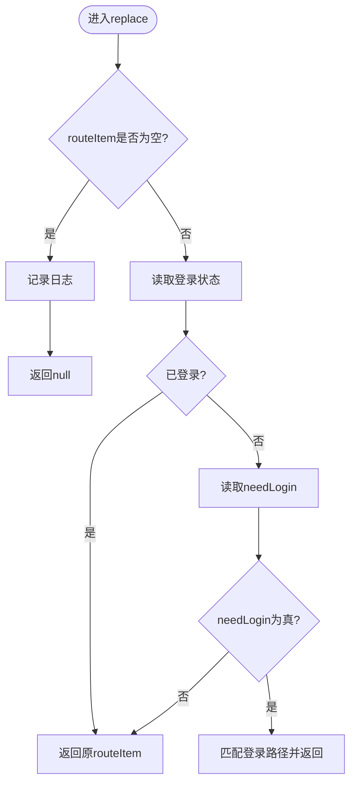
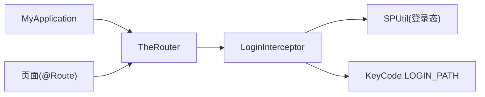

# 权限控制

<cite>
**本文引用的文件**   
- [LoginInterceptor.kt](file://lib_book_common/src/main/java/com/ebook/common/interceptor/LoginInterceptor.kt)
- [MyApplication.kt](file://module_app/src/main/java/com/ebook/MyApplication.kt)
- [KeyCode.kt](file://lib_book_common/src/main/java/com/ebook/common/event/KeyCode.kt)
- [BookCommentsActivity.kt](file://module_book/src/main/java/com/ebook/book/BookCommentsActivity.kt)
- [MyCommentActivity.kt](file://module_me/src/main/java/com/ebook/me/view/MyCommentActivity.kt)
- [ModifyNicknameActivity.kt](file://module_me/src/main/java/com/ebook/me/view/ModifyNicknameActivity.kt)
- [ModifyInformationActivity.kt](file://module_me/src/main/java/com/ebook/me/view/ModifyInformationActivity.kt)
- [TestInterruptActivity.kt](file://module_login/src/main/test/debug/TestInterruptActivity.kt)
- [SettingActivity.kt](file://module_me/src/main/java/com/ebook/me/view/SettingActivity.kt)
- [LoginActivity.kt](file://module_login/src/main/java/com/ebook/login/LoginActivity.kt)
</cite>

## 目录
1. [简介](#简介)
2. [项目结构](#项目结构)
3. [核心组件](#核心组件)
4. [架构总览](#架构总览)
5. [详细组件分析](#详细组件分析)
6. [依赖关系分析](#依赖关系分析)
7. [性能考虑](#性能考虑)
8. [故障排查指南](#故障排查指南)
9. [结论](#结论)
10. [附录：配置示例与扩展指南](#附录：配置示例与扩展指南)

## 简介
本文件聚焦于基于 TheRouter 的页面级权限控制机制，说明如何通过 @Route 注解的 params 参数声明“是否需要登录”，以及由 LoginInterceptor 在路由跳转时执行拦截、将未登录用户自动重定向到登录页。文档还涵盖不同页面的权限分类、拦截执行时机与流程、独立模式下的注意事项，并给出可扩展的自定义权限检查方案。

## 项目结构
与权限控制直接相关的代码分布在以下位置：
- 应用启动阶段注册拦截器：module_app/MyApplication
- 路由拦截器实现：lib_book_common/interceptor/LoginInterceptor
- 路由路径常量定义：lib_book_common/event/KeyCode
- 各业务页面通过 @Route(path = ..., params = ["needLogin", "true"]) 声明权限需求

图表来源
- [MyApplication.kt:24-31](file://module_app/src/main/java/com/ebook/MyApplication.kt#L24-L31)
- [LoginInterceptor.kt:21-41](file://lib_book_common/src/main/java/com/ebook/common/interceptor/LoginInterceptor.kt#L21-L41)
- [KeyCode.kt:13-41](file://lib_book_common/src/main/java/com/ebook/common/event/KeyCode.kt#L13-L41)

章节来源
- [MyApplication.kt:24-31](file://module_app/src/main/java/com/ebook/MyApplication.kt#L24-L31)
- [LoginInterceptor.kt:21-41](file://lib_book_common/src/main/java/com/ebook/common/interceptor/LoginInterceptor.kt#L21-L41)
- [KeyCode.kt:13-41](file://lib_book_common/src/main/java/com/ebook/common/event/KeyCode.kt#L13-L41)

## 核心组件
- 登录拦截器（LoginInterceptor）：实现 RouterReplaceInterceptor，在路由替换阶段读取 RouteItem 的 extras 中的 needLogin 标志，若未登录且该标志为真，则将路由替换为登录页路径；否则放行或跳过拦截。
- 应用初始化（MyApplication）：在 Application.onCreate 中向 TheRouter 添加登录拦截器，确保所有跨模块路由统一受控。
- 路由常量（KeyCode）：集中管理登录、书城、书籍、我的等模块的路径常量，包括 LOGIN_PATH。
- 页面侧声明（@Route）：需要登录的页面通过 params = ["needLogin", "true"] 声明权限需求；公开页面不设置该参数或设置为 false。

章节来源
- [LoginInterceptor.kt:10-42](file://lib_book_common/src/main/java/com/ebook/common/interceptor/LoginInterceptor.kt#L10-L42)
- [MyApplication.kt:24-31](file://module_app/src/main/java/com/ebook/MyApplication.kt#L24-L31)
- [KeyCode.kt:13-41](file://lib_book_common/src/main/java/com/ebook/common/event/KeyCode.kt#L13-L41)
- [BookCommentsActivity.kt:76-79](file://module_book/src/main/java/com/ebook/book/BookCommentsActivity.kt#L76-L79)
- [MyCommentActivity.kt:51-54](file://module_me/src/main/java/com/ebook/me/view/MyCommentActivity.kt#L51-L54)
- [ModifyNicknameActivity.kt:45-48](file://module_me/src/main/java/com/ebook/me/view/ModifyNicknameActivity.kt#L45-L48)
- [ModifyInformationActivity.kt:64-67](file://module_me/src/main/java/com/ebook/me/view/ModifyInformationActivity.kt#L64-L67)

## 架构总览
权限控制基于 TheRouter 的拦截链，核心流程如下：
- 任意页面发起路由跳转
- TheRouter 构造 RouteItem（包含 path、extras 等）
- LoginInterceptor 按优先级参与替换：
  - 读取 SharedPreferences 中的登录状态
  - 若已登录，返回原 RouteItem 放行
  - 若未登录且 needLogin 为真，返回登录页路径对应的 RouteItem
  - 若未登录但 needLogin 为假，放行
- 最终跳转到实际目标或登录页

图表来源
- [LoginInterceptor.kt:21-41](file://lib_book_common/src/main/java/com/ebook/common/interceptor/LoginInterceptor.kt#L21-L41)
- [MyApplication.kt:24-31](file://module_app/src/main/java/com/ebook/MyApplication.kt#L24-L31)
- [KeyCode.kt:13-41](file://lib_book_common/src/main/java/com/ebook/common/event/KeyCode.kt#L13-L41)

## 详细组件分析

### 登录拦截器（LoginInterceptor）
- 职责：在路由替换阶段判断是否需要登录，必要时将路由替换为登录页。
- 关键逻辑：
  - 从 SP 中读取登录状态（sp_is_login）
  - 解析 RouteItem.extras 中的 needLogin 字符串并转布尔
  - 根据组合条件决定是否替换为目标页或登录页
- 错误处理：
  - routeItem 为空时记录日志并返回空，阻止无效跳转
  - 未登录时统一重定向到登录页，避免在目标页重复校验

图表来源
- [LoginInterceptor.kt:21-41](file://lib_book_common/src/main/java/com/ebook/common/interceptor/LoginInterceptor.kt#L21-L41)

章节来源
- [LoginInterceptor.kt:10-42](file://lib_book_common/src/main/java/com/ebook/common/interceptor/LoginInterceptor.kt#L10-L42)

### 应用初始化（MyApplication）
- 在 onCreate 中调用 addRouterReplaceInterceptor 注册登录拦截器，使全局路由均受控。
- 注意：隔离进程（沙箱）会提前 return，不会注册拦截器，避免无关进程影响。

章节来源
- [MyApplication.kt:24-31](file://module_app/src/main/java/com/ebook/MyApplication.kt#L24-L31)

### 路由常量（KeyCode）
- 集中定义模块路由路径，包括登录、注册、修改密码等。
- 登录页路径用于拦截器重定向。

章节来源
- [KeyCode.kt:13-41](file://lib_book_common/src/main/java/com/ebook/common/event/KeyCode.kt#L13-L41)

### 页面级权限声明（@Route 的 params）
- 需要登录的页面通过在 @Route 注解的 params 中声明 needLogin=true，例如：
  - 书籍评论页：params = ["needLogin", "true"]
  - 我的评论页：params = ["needLogin", "true"]
  - 修改昵称页：params = ["needLogin", "true"]
  - 编辑资料页：params = ["needLogin", "true"]
  - 测试中断页：params = ["needLogin", "true"]
- 公开页面通常不声明 needLogin 或设为 false，如设置页（账号区块内部做登录态判断，但页面本身可访问）。

章节来源
- [BookCommentsActivity.kt:76-79](file://module_book/src/main/java/com/ebook/book/BookCommentsActivity.kt#L76-L79)
- [MyCommentActivity.kt:51-54](file://module_me/src/main/java/com/ebook/me/view/MyCommentActivity.kt#L51-L54)
- [ModifyNicknameActivity.kt:45-48](file://module_me/src/main/java/com/ebook/me/view/ModifyNicknameActivity.kt#L45-L48)
- [ModifyInformationActivity.kt:64-67](file://module_me/src/main/java/com/ebook/me/view/ModifyInformationActivity.kt#L64-L67)
- [TestInterruptActivity.kt:25-28](file://module_login/src/main/test/debug/TestInterruptActivity.kt#L25-L28)
- [SettingActivity.kt:61-80](file://module_me/src/main/java/com/ebook/me/view/SettingActivity.kt#L61-L80)

### 登录页（LoginActivity）
- 登录页自身作为被拦截的目标，无需声明 needLogin=true；它提供登录能力以改变全局登录态。
- 使用 singleTask 模式，配合 LaunchedEffect 消费预填参数，确保复用实例时的数据更新。

章节来源
- [LoginActivity.kt:39-52](file://module_login/src/main/java/com/ebook/login/LoginActivity.kt#L39-L52)

## 依赖关系分析
- MyApplication 依赖 TheRouter 接口进行拦截器注册。
- LoginInterceptor 依赖：
  - TheRouter 的 RouterReplaceInterceptor 与 matchRouteMap
  - 本地存储 SPUtil 读取登录态
  - KeyCode 提供登录页路径
- 页面通过 @Route 声明路由与权限，被 TheRouter 识别并在运行时组装 RouteItem。

图表来源
- [MyApplication.kt:24-31](file://module_app/src/main/java/com/ebook/MyApplication.kt#L24-L31)
- [LoginInterceptor.kt:21-41](file://lib_book_common/src/main/java/com/ebook/common/interceptor/LoginInterceptor.kt#L21-L41)
- [KeyCode.kt:13-41](file://lib_book_common/src/main/java/com/ebook/common/event/KeyCode.kt#L13-L41)

章节来源
- [MyApplication.kt:24-31](file://module_app/src/main/java/com/ebook/MyApplication.kt#L24-L31)
- [LoginInterceptor.kt:21-41](file://lib_book_common/src/main/java/com/ebook/common/interceptor/LoginInterceptor.kt#L21-L41)
- [KeyCode.kt:13-41](file://lib_book_common/src/main/java/com/ebook/common/event/KeyCode.kt#L13-L41)

## 性能考虑
- 拦截发生在路由跳转前，开销极小（一次 SP 读取与布尔判断），对 UI 流畅度无显著影响。
- 建议保持 needLogin 仅用于必要页面，避免过度拦截导致频繁重定向。
- 登录态变更应集中管理，确保 SP 一致性，减少多次读取带来的不一致风险。

[本节为通用指导，不直接分析具体文件]

## 故障排查指南
- 症状：点击页面后无响应或静默失败
  - 可能原因：目标路由不存在或被拦截后重定向到登录页但未显示提示
  - 排查：确认页面 @Route 的 path 是否正确，是否在独立模式下存在占位路由
- 症状：已登录仍跳转登录页
  - 可能原因：SP 登录态未正确设置或读取键名不一致
  - 排查：核对登录成功后写入 sp_is_login 的逻辑，确认 LoginInterceptor 读取键一致
- 症状：独立模式下跨模块路由丢失
  - 可能原因：独立运行缺少对应路由占位，TheRouter 找不到路由只记日志
  - 排查：在模块 src/main/test/debug 下添加同名 @Route 占位，并确保重新构建生成 routeMap

章节来源
- [MyApplication.kt:24-31](file://module_app/src/main/java/com/ebook/MyApplication.kt#L24-L31)
- [LoginInterceptor.kt:21-41](file://lib_book_common/src/main/java/com/ebook/common/interceptor/LoginInterceptor.kt#L21-L41)

## 结论
本项目通过 TheRouter 的拦截器机制实现了统一的页面级权限控制。页面仅需在 @Route 中声明 needLogin，即可在跳转时由 LoginInterceptor 统一校验并重定向。该方式解耦了业务页的鉴权逻辑，便于扩展更多权限维度（如管理员角色、功能开关等），同时保证体验一致性与可维护性。

[本节总结，不直接分析具体文件]

## 附录：配置示例与扩展指南

### 页面权限分类与示例
- 公开页面：不需要登录，无需设置 needLogin 或显式 false
  - 示例：设置页（账号区块内部再做登录态判断）
- 需登录页面：声明 needLogin=true
  - 示例：书籍评论、我的评论、修改昵称、编辑资料、测试中断
- 管理员页面：当前仓库未见专用管理员标记，可通过扩展拦截器增加额外权限维度（见下方扩展）

章节来源
- [SettingActivity.kt:61-80](file://module_me/src/main/java/com/ebook/me/view/SettingActivity.kt#L61-L80)
- [BookCommentsActivity.kt:76-79](file://module_book/src/main/java/com/ebook/book/BookCommentsActivity.kt#L76-L79)
- [MyCommentActivity.kt:51-54](file://module_me/src/main/java/com/ebook/me/view/MyCommentActivity.kt#L51-L54)
- [ModifyNicknameActivity.kt:45-48](file://module_me/src/main/java/com/ebook/me/view/ModifyNicknameActivity.kt#L45-L48)
- [ModifyInformationActivity.kt:64-67](file://module_me/src/main/java/com/ebook/me/view/ModifyInformationActivity.kt#L64-L67)
- [TestInterruptActivity.kt:25-28](file://module_login/src/main/test/debug/TestInterruptActivity.kt#L25-L28)

### 权限检查的执行时机与流程
- 执行时机：每次路由跳转前，TheRouter 调用拦截器的 replace 方法
- 流程：
  - 读取登录态
  - 读取 needLogin
  - 满足“未登录且 needLogin=true”则替换为登录页
  - 否则放行

章节来源
- [LoginInterceptor.kt:21-41](file://lib_book_common/src/main/java/com/ebook/common/interceptor/LoginInterceptor.kt#L21-L41)

### 独立模式下的特殊处理
- 独立运行时，跨模块路由可能在宿主中不存在，TheRouter 找不到路由只记日志
- 解决方案：在模块的 src/main/test/debug 中添加同名 @Route 占位，以保证路由链路完整
- 注意：新增/改动 @Route 后需再次构建以生成最新的 routeMap

章节来源
- [MyApplication.kt:24-31](file://module_app/src/main/java/com/ebook/MyApplication.kt#L24-L31)

### 扩展机制：添加自定义权限检查
- 思路：新增一个 RouterReplaceInterceptor，优先级高于或低于现有拦截器，实现自定义规则（如管理员角色、功能开关、白名单路径等）
- 步骤：
  - 新建拦截器类，实现 RouterReplaceInterceptor
  - 在 MyApplication 中通过 addRouterReplaceInterceptor 注册
  - 在需要控制的页面通过 @Route.params 传递自定义标志（如 isAdmin="true"）
  - 在拦截器中读取标志并执行相应逻辑（重定向、拒绝跳转、降级展示等）
- 注意事项：
  - 明确拦截优先级，避免与登录拦截冲突
  - 对于独立模式，确保占位路由存在
  - 保持日志输出，便于定位问题

[本节为通用扩展指导，不直接分析具体文件]