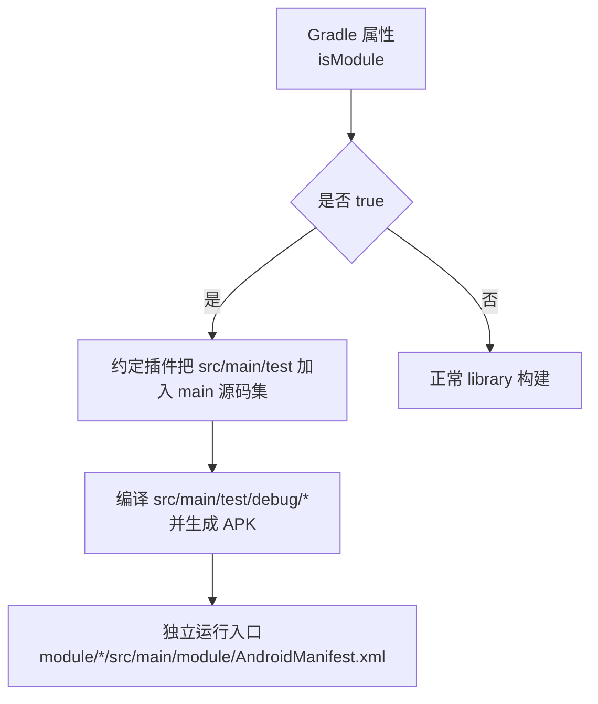
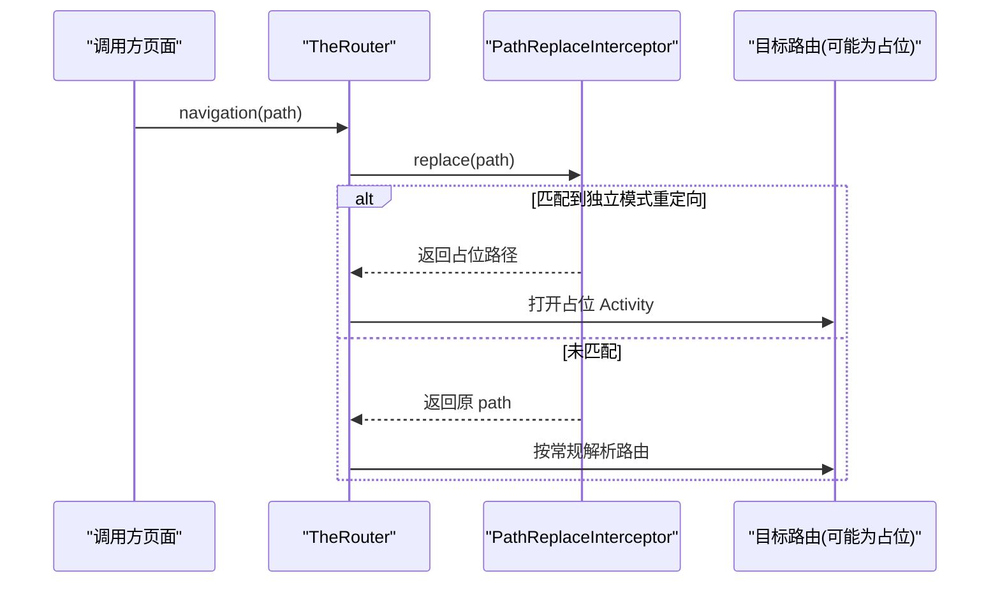
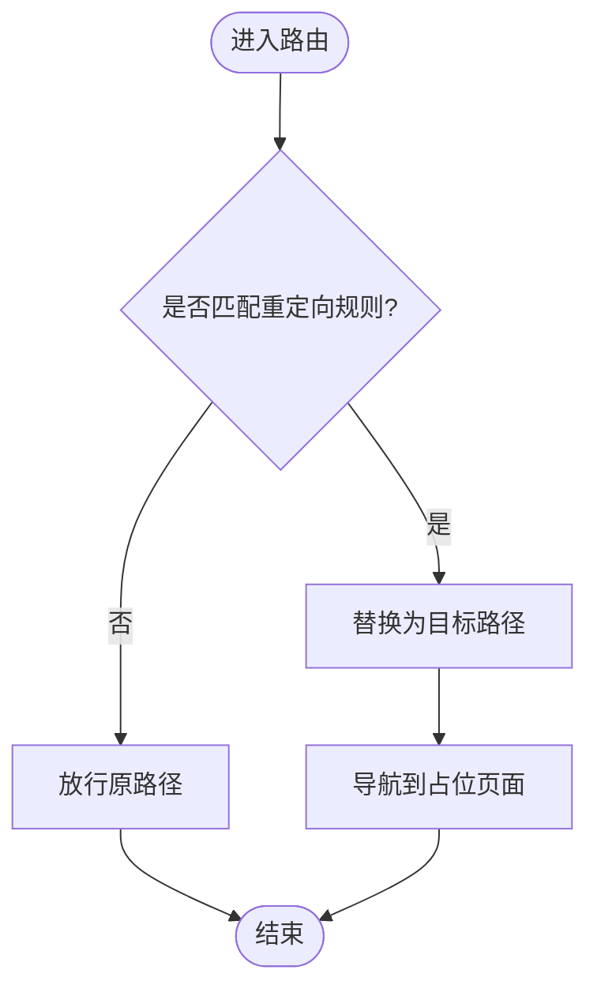
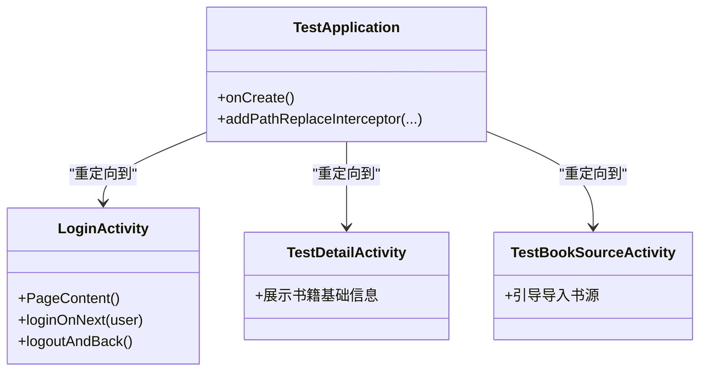
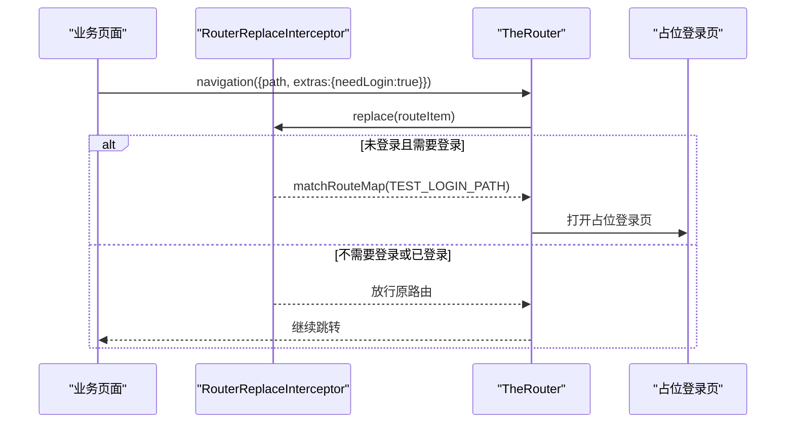
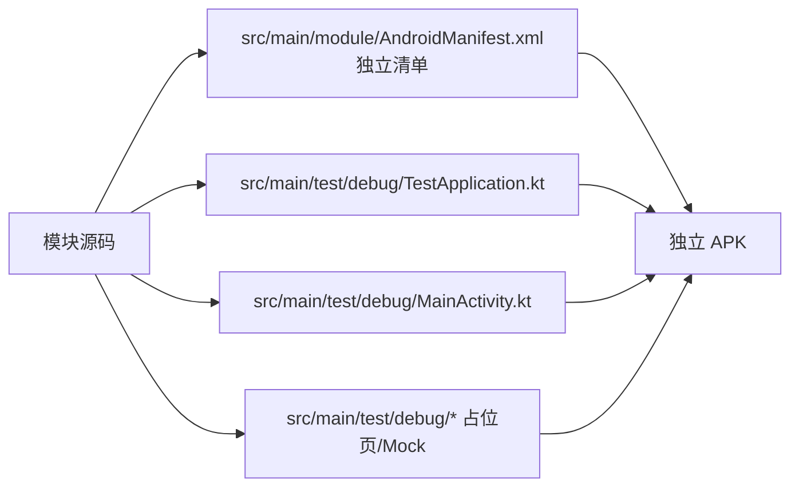
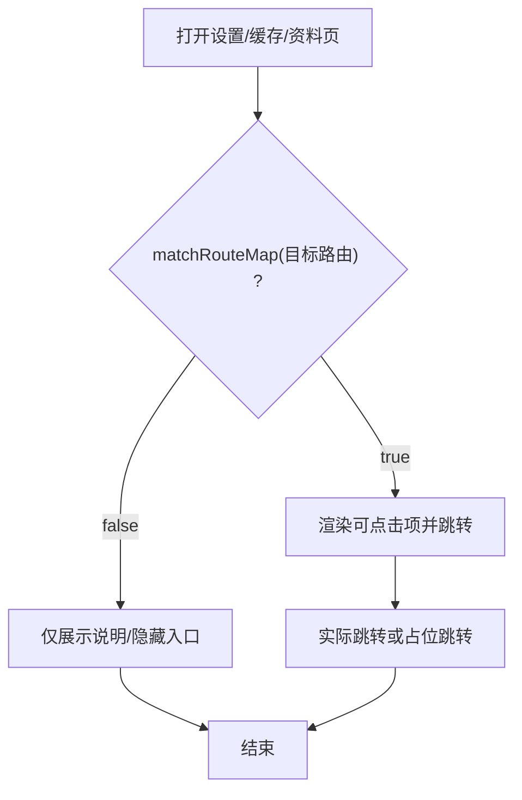
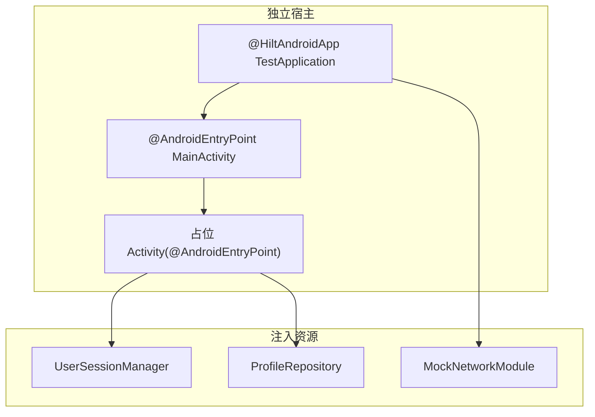

# 独立模式处理

<cite>
**本文引用的文件**
- [AndroidComponentConventionPlugin.kt](file://build-logic/convention/src/main/kotlin/AndroidComponentConventionPlugin.kt)
- [AGENTS.md](file://AGENTS.md)
- [TestApplication.kt（module_book）](file://module_book/src/main/test/debug/TestApplication.kt)
- [MainActivity.kt（module_book 独立入口）](file://module_book/src/main/test/debug/MainActivity.kt)
- [TestApplication.kt（module_find）](file://module_find/src/main/test/debug/TestApplication.kt)
- [TestDetailActivity.kt](file://module_find/src/main/test/debug/TestDetailActivity.kt)
- [TestBookSourceActivity.kt](file://module_find/src/main/test/debug/TestBookSourceActivity.kt)
- [TestApplication.kt（module_me）](file://module_me/src/main/test/debug/TestApplication.kt)
- [LoginActivity.kt（module_me 占位登录页）](file://module_me/src/main/test/debug/LoginActivity.kt)
- [CacheManageActivity.kt](file://module_me/src/main/java/com/ebook/me/view/CacheManageActivity.kt)
- [ModifyInformationActivity.kt](file://module_me/src/main/java/com/ebook/me/view/ModifyInformationActivity.kt)
- [SettingActivity.kt](file://module_me/src/main/java/com/ebook/me/view/SettingActivity.kt)
- [LoginInterceptor.kt](file://lib_book_common/src/main/java/com/ebook/common/interceptor/LoginInterceptor.kt)
</cite>

## 目录
1. [简介](#简介)
2. [项目结构与独立模式触发点](#项目结构与独立模式触发点)
3. [核心机制总览](#核心机制总览)
4. [PathReplaceInterceptor 与路由重定向](#pathreplaceinterceptor-与路由重定向)
5. [测试占位 Activity 的设计模式](#测试占位-activity-的设计模式)
6. [跨模块路由在独立模式下的处理方式](#跨模块路由在独立模式下的处理方式)
7. [src/main/test/debug 目录的组织与作用](#srccommonmaintestdebug-目录的组织与作用)
8. [独立模式的路由配置示例](#独立模式的路由配置示例)
9. [独立模式下的依赖注入与 Hilt 差异](#独立模式下的依赖注入与-hilt-差异)
10. [性能与健壮性注意事项](#性能与健壮性注意事项)
11. [故障排查指南](#故障排查指南)
12. [结论](#结论)

## 简介
本文件系统性说明当 isModule=true 时，各功能模块如何以“独立应用”形态运行：如何通过约定插件将 test/debug 源码并入 main、如何使用 PathReplaceInterceptor 实现路由重定向、如何用占位 Activity 补齐缺失的跨模块能力、以及如何在独立模式下安全地进行依赖注入与页面导航。内容同时给出可操作的配置要点和排障清单，帮助开发者快速定位“点击无响应/路由找不到/注入为 null”等常见问题。

## 项目结构与独立模式触发点
- 构建期开关：gradle.properties 中的 isModule 控制模块是“集成库”还是“独立应用”。约定插件在 isModule=true 时将 src/main/test 作为额外 Kotlin 源码目录并入当前模块的 main source set，使该模块下 src/main/test/debug 内的 Application、Activity、MockNetworkModule 等参与编译并生效。
- 两套清单替换：独立态只使用 module/AndroidManifest.xml；集成态使用主 AndroidManifest.xml。两处声明必须同步，否则行为不一致。
- 默认 mock：独立运行时默认走 mock 数据源，无需额外配置。

**图示来源**
- [AndroidComponentConventionPlugin.kt](file://build-logic/convention/src/main/kotlin/AndroidComponentConventionPlugin.kt)
- [AGENTS.md](file://AGENTS.md)

**章节来源**
- [AGENTS.md:75-78](file://AGENTS.md#L75-L78)

## 核心机制总览
- 路由层：TheRouter 负责跨模块路由。集成态下，跨模块路由在宿主内注册；独立态下，目标模块不在依赖图中，路由不存在会“只记日志、不报错不闪退”，因此需要在独立宿主中用 PathReplaceInterceptor 把外部路径重定向到本模块的占位路由。
- 拦截器：PathReplaceInterceptor 对“字符串路径”进行替换；RouterReplaceInterceptor 可对 RouteItem 做更细粒度拦截（如根据 needLogin 标记决定是否跳转）。
- 占位页面：每个需要被跨模块调用的“外部能力”，在独立模式下提供最小可用页面，完成基本交互或提示。
- 探测与降级：UI 通过 matchRouteMap 探测某路由是否存在，存在则显示可点击项，否则降级为纯展示或隐藏入口，避免假箭头。

**图示来源**
- [TestApplication.kt（module_find）](file://module_find/src/main/test/debug/TestApplication.kt)
- [TestApplication.kt（module_me）](file://module_me/src/main/test/debug/TestApplication.kt)
- [TestApplication.kt（module_book）](file://module_book/src/main/test/debug/TestApplication.kt)

## PathReplaceInterceptor 与路由重定向
- 作用：在 TheRouter 解析路由之前，将“真实路径”替换为“独立模式可用的占位路径”，从而在不引入跨模块依赖的前提下保持链路可走通。
- 典型场景：
  - 登录相关：LOGIN_PATH → TEST_LOGIN_PATH
  - 书源管理：BOOK_SOURCE_PATH → TEST_BOOK_SOURCE_PATH
  - 书籍详情：DETAIL_PATH → TEST_DETAIL_PATH
- 结合 RouterReplaceInterceptor：可在进入前根据参数（如 needLogin）决定是否需要拦截并重定向，避免未登录直接跳到不存在的路由导致“点击无响应”。

**图示来源**
- [TestApplication.kt（module_find）](file://module_find/src/main/test/debug/TestApplication.kt)
- [TestApplication.kt（module_me）](file://module_me/src/main/test/debug/TestApplication.kt)
- [TestApplication.kt（module_book）](file://module_book/src/main/test/debug/TestApplication.kt)

**章节来源**
- [TestApplication.kt（module_find）:9-35](file://module_find/src/main/test/debug/TestApplication.kt#L9-L35)
- [TestApplication.kt（module_me）:14-45](file://module_me/src/main/test/debug/TestApplication.kt#L14-L45)
- [TestApplication.kt（module_book）:9-22](file://module_book/src/main/test/debug/TestApplication.kt#L9-L22)

## 测试占位 Activity 的设计模式
- 设计目标：在独立模式下，为缺失的外部能力提供最小可用页面，保证导航链路不中断，并提供必要提示或模拟能力。
- 常见职责：
  - 占位提示：告知用户当前为独立调试模式，某些功能不可用。
  - 模拟登录：写入本地会话，更新 Profile 展示，便于后续页面验证未登录/已登录分支。
  - 占位详情：仅展示来源与基本信息，用于书城“去导入”链路闭环。
- 样式与主题：遵循 lib_book_common 共享组件与主题约定，避免配色分裂。
- 关键实现要点：
  - 使用 @Route 绑定独立占位路径。
  - 通过 Hilt 注入所需依赖（如 UserSessionManager、ProfileRepository）。
  - 与正式流程一致地保存/清除会话，确保状态流转正确。

**图示来源**
- [LoginActivity.kt（module_me 占位登录页）](file://module_me/src/main/test/debug/LoginActivity.kt)
- [TestDetailActivity.kt](file://module_find/src/main/test/debug/TestDetailActivity.kt)
- [TestBookSourceActivity.kt](file://module_find/src/main/test/debug/TestBookSourceActivity.kt)
- [TestApplication.kt（module_find）](file://module_find/src/main/test/debug/TestApplication.kt)
- [TestApplication.kt（module_me）](file://module_me/src/main/test/debug/TestApplication.kt)

**章节来源**
- [LoginActivity.kt（module_me 占位登录页）:46-122](file://module_me/src/main/test/debug/LoginActivity.kt#L46-L122)
- [TestDetailActivity.kt:19-24](file://module_find/src/main/test/debug/TestDetailActivity.kt#L19-L24)
- [TestBookSourceActivity.kt:15-21](file://module_find/src/main/test/debug/TestBookSourceActivity.kt#L15-L21)

## 跨模块路由在独立模式下的处理方式
- 问题：集成态跨模块路由依赖宿主装配；独立态目标模块不在依赖图内，TheRouter 找不到路由不会崩溃，只会记录一行日志并“静默失败”。
- 方案：
  - 在独立宿主的 TestApplication 中，通过 addPathReplaceInterceptor 将外部路径替换为本模块占位路径。
  - 对于需要登录鉴权的路由，可使用 RouterReplaceInterceptor 基于 needLogin 判断，若未登录且目标路由不存在，则直接跳转到本模块占位登录页。
  - UI 侧通过 matchRouteMap 探测路由是否存在，再决定是否渲染可点击项或隐藏入口，避免“假箭头”。
- 实践要点：
  - 新增/改动 @Route 后，需再次构建以使 routeMap 资产生效（当次安装仍为旧表）。
  - 两处清单（module/AndroidManifest.xml 与主清单）需同步修改 Activity 声明及属性。

**图示来源**
- [TestApplication.kt（module_me）:18-31](file://module_me/src/main/test/debug/TestApplication.kt#L18-L31)
- [LoginInterceptor.kt:37-41](file://lib_book_common/src/main/java/com/ebook/common/interceptor/LoginInterceptor.kt#L37-L41)

**章节来源**
- [TestApplication.kt（module_me）:18-31](file://module_me/src/main/test/debug/TestApplication.kt#L18-L31)
- [LoginInterceptor.kt:37-41](file://lib_book_common/src/main/java/com/ebook/common/interceptor/LoginInterceptor.kt#L37-L41)

## src/main/test/debug 目录的组织与作用
- 组织方式：
  - 每个功能模块在 src/main/test/debug 下放置独立运行的宿主件：TestApplication（@HiltAndroidApp）、MainActivity（独立入口）、必要的占位 Activity、MockNetworkModule 等。
  - 这些类只在 isModule=true 时被编译进 main，不影响集成态产物。
- 作用：
  - 提供独立运行时的 Application 与入口 Activity，组合 Provider 暴露的 Compose 页面，复现宿主渲染路径。
  - 提供占位页面补齐跨模块能力，配合 PathReplaceInterceptor 完成路由重定向。
  - 提供 Mock 网络与数据源，使模块在无后端情况下可独立调试。
- 注意：
  - 独立入口 Activity 必须开启 edge-to-edge 并包裹应用级主题，避免状态栏与配色异常。
  - 占位页面应明确标注“独立调试模式”，避免误认为真实功能。

**图示来源**
- [MainActivity.kt（module_book 独立入口）:16-44](file://module_book/src/main/test/debug/MainActivity.kt#L16-L44)
- [TestApplication.kt（module_find）:9-35](file://module_find/src/main/test/debug/TestApplication.kt#L9-L35)

**章节来源**
- [AGENTS.md:75-78](file://AGENTS.md#L75-L78)
- [MainActivity.kt（module_book 独立入口）:16-44](file://module_book/src/main/test/debug/MainActivity.kt#L16-L44)

## 独立模式的路由配置示例
- 重定向规则（示例思路）：
  - LOGIN_PATH → TEST_LOGIN_PATH（模块内占位登录）
  - MODIFY_PWD_PATH → 隐藏入口（通过 matchRouteMap 探测）
  - DETAIL_PATH → TEST_DETAIL_PATH（模块内占位详情）
  - BOOK_SOURCE_PATH → TEST_BOOK_SOURCE_PATH（模块内占位书源管理）
- 占位页面实现（示例思路）：
  - 占位登录：提供模拟用户卡片与一键登录/退出，写入本地会话并刷新 Profile。
  - 占位详情：仅展示来源与基本信息，满足书城空态“去导入”链路。
  - 占位书源管理：提示当前为独立模式，引导导入书源。
- 路由探测与降级（示例思路）：
  - 缓存页“书籍内容”行：matchRouteMap(主页路由) 存在才显示可点击，否则仅展示说明文案。
  - 编辑资料页“修改密码”：matchRouteMap(修改密码路由) 存在才显示入口。

**图示来源**
- [CacheManageActivity.kt:90-93](file://module_me/src/main/java/com/ebook/me/view/CacheManageActivity.kt#L90-L93)
- [ModifyInformationActivity.kt:112-118](file://module_me/src/main/java/com/ebook/me/view/ModifyInformationActivity.kt#L112-L118)

**章节来源**
- [CacheManageActivity.kt:90-93](file://module_me/src/main/java/com/ebook/me/view/CacheManageActivity.kt#L90-L93)
- [ModifyInformationActivity.kt:112-118](file://module_me/src/main/java/com/ebook/me/view/ModifyInformationActivity.kt#L112-L118)
- [SettingActivity.kt:123-128](file://module_me/src/main/java/com/ebook/me/view/SettingActivity.kt#L123-L128)

## 独立模式下的依赖注入与 Hilt 差异
- 独立宿主需声明 @HiltAndroidApp，以便 Hilt 初始化；占位 Activity 使用 @AndroidEntryPoint 注入依赖。
- 注入差异：
  - 集成态：Hilt 由宿主装配，跨模块依赖由宿主注入。
  - 独立态：模块自身提供 TestApplication 与占位页，按需注入本地依赖（如 UserSessionManager、ProfileRepository），并通过 MockNetworkModule 提供网络能力。
- 注意事项：
  - 避免在 Application 中 eager 注入对象，防止沙箱进程启动顺序导致崩溃。
  - 独立态默认 mock，无需手动切换；如需接入真实后端，可通过 product flavor 或构建变体调整 NetworkModule。
  - 独立入口 Activity 必须启用 edge-to-edge 并应用应用主题，避免 UI 异常。

**图示来源**
- [TestApplication.kt（module_find）:9-35](file://module_find/src/main/test/debug/TestApplication.kt#L9-L35)
- [MainActivity.kt（module_book 独立入口）:16-44](file://module_book/src/main/test/debug/MainActivity.kt#L16-L44)
- [LoginActivity.kt（module_me 占位登录页）:57-62](file://module_me/src/main/test/debug/LoginActivity.kt#L57-L62)

**章节来源**
- [TestApplication.kt（module_find）:9-35](file://module_find/src/main/test/debug/TestApplication.kt#L9-L35)
- [MainActivity.kt（module_book 独立入口）:16-44](file://module_book/src/main/test/debug/MainActivity.kt#L16-L44)
- [LoginActivity.kt（module_me 占位登录页）:57-62](file://module_me/src/main/test/debug/LoginActivity.kt#L57-L62)

## 性能与健壮性注意事项
- 路由查找失败：独立模式下 TheRouter 找不到路由不会崩溃，但会“静默失败”。务必通过 PathReplaceInterceptor 与占位路由保证链路畅通。
- 重复构建：新增/改动 @Route 后，需再次构建以使 routeMap 资产生效；当次安装的 APK 仍携带旧路由表。
- UI 一致性：独立入口必须包裹应用主题并开启 edge-to-edge，避免状态栏与配色异常。
- 注入时序：避免在 Application 构造阶段进行重对象注入，必要时延迟到首次使用时获取。
- 清单同步：两份清单必须同步修改 Activity 声明及属性，避免两种模式行为不一致。

[本节为通用建议，不涉及具体代码片段]

## 故障排查指南
- 症状：点击路由无响应
  - 检查是否在独立宿主中添加了 PathReplaceInterceptor 重定向。
  - 确认目标路由是否已在占位模块中以 @Route 注册。
  - 确认是否已重新构建使 routeMap 资产生效。
- 症状：页面未登录却跳错
  - 检查 RouterReplaceInterceptor 是否正确判断 needLogin 并跳转到占位登录页。
  - 检查 LoginInterceptor 在集成态的行为是否与独立态一致。
- 症状：UI 入口不应出现却显示箭头
  - 检查是否使用 matchRouteMap 探测路由存在性，并在不存在时隐藏入口。
- 症状：主题/状态栏异常
  - 检查独立入口是否开启 edge-to-edge 并应用应用主题。

**章节来源**
- [TestApplication.kt（module_me）:18-31](file://module_me/src/main/test/debug/TestApplication.kt#L18-L31)
- [LoginInterceptor.kt:37-41](file://lib_book_common/src/main/java/com/ebook/common/interceptor/LoginInterceptor.kt#L37-L41)
- [CacheManageActivity.kt:90-93](file://module_me/src/main/java/com/ebook/me/view/CacheManageActivity.kt#L90-L93)
- [MainActivity.kt（module_book 独立入口）:16-44](file://module_book/src/main/test/debug/MainActivity.kt#L16-L44)

## 结论
独立模式通过“约定插件 + PathReplaceInterceptor + 占位 Activity + matchRouteMap 探测”的组合，实现了在不引入跨模块依赖的情况下，仍可完整跑通业务链路。其关键在于：
- 在独立宿主中注册路由重定向规则；
- 提供最小可用的占位页面；
- 在 UI 层探测路由存在性并合理降级；
- 保持两份清单与主题一致；
- 通过 Hilt 在独立宿主中装配必要依赖。

遵循上述原则，可显著提升模块独立调试效率，降低集成态与独立态的行为差异风险。