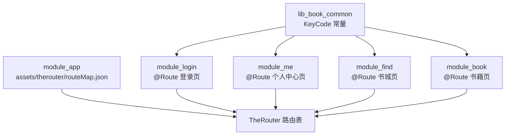
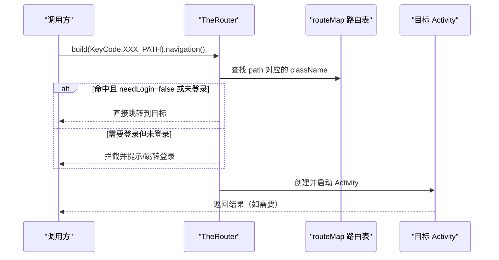
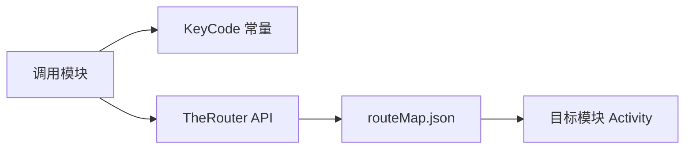

# 路由机制

<cite>
**本文引用的文件**
- [MainActivity.kt](file://module_main/src/main/java/com/ebook/main/MainActivity.kt)
- [routeMap.json（app）](file://module_app/src/main/assets/therouter/routeMap.json)
- [KeyCode.kt](file://lib_book_common/src/main/java/com/ebook/common/event/KeyCode.kt)
- [RouteArgs.kt](file://lib_book_common/src/main/java/com/ebook/common/event/RouteArgs.kt)
- [LoginActivity.kt（登录模块）](file://module_login/src/main/java/com/ebook/login/LoginActivity.kt)
- [LoginActivity.kt（me 独立运行占位）](file://module_me/src/main/test/debug/LoginActivity.kt)
- [TestBookSourceActivity.kt](file://module_find/src/main/test/debug/TestBookSourceActivity.kt)
- [TestDetailActivity.kt](file://module_find/src/main/test/debug/TestDetailActivity.kt)
</cite>

## 目录
1. [简介](#简介)
2. [项目结构中的路由相关位置](#项目结构中的路由相关位置)
3. [核心组件与职责](#核心组件与职责)
4. [架构总览](#架构总览)
5. [详细组件分析](#详细组件分析)
6. [依赖关系分析](#依赖关系分析)
7. [性能与可维护性考量](#性能与可维护性考量)
8. [故障排查指南](#故障排查指南)
9. [结论](#结论)
10. [附录：常见路由配置示例](#附录：常见路由配置示例)

## 简介
本文件系统化说明本项目中 TheRouter 在模块化架构中的作用与使用方式，覆盖以下要点：
- @Route 注解的用法：路径声明、参数传递、权限控制 needLogin
- Activity 路由与 Composable 页面路由的区别与适用场景
- KeyCode 常量管理最佳实践，避免字符串硬编码
- 跨模块导航实现：跳转、参数序列化、返回值处理
- 独立模式下的路由占位机制（src/main/test/debug 下的占位 Activity）
- routeMap 资产的生成机制与构建时刷新要求
- 完整的路由配置示例（基础路由、带参路由、条件路由）

## 项目结构中的路由相关位置
- 路由表资产：每个业务模块的 assets/therouter/routeMap.json 提供该模块对外暴露的 Activity 路由映射；根应用 module_app 也包含一份集中清单。
- 路由常量：跨模块共享的路径常量集中在 lib_book_common 的 KeyCode，避免各处硬编码字符串。
- 路由注解：各模块 Activity 通过 @Route(path = ...) 声明自身可被外部访问的路径。
- 入口与组合：主界面 MainActivity 通过 TheRouter 获取 Provider 暴露的 Composable 页面，完成 Tab 级页面组合。

图表来源
- [routeMap.json（app）:1-150](file://module_app/src/main/assets/therouter/routeMap.json#L1-L150)
- [MainActivity.kt:58-77](file://module_main/src/main/java/com/ebook/main/MainActivity.kt#L58-L77)
- [KeyCode.kt:6-104](file://lib_book_common/src/main/java/com/ebook/common/event/KeyCode.kt#L6-L104)

章节来源
- [MainActivity.kt:58-77](file://module_main/src/main/java/com/ebook/main/MainActivity.kt#L58-L77)
- [routeMap.json（app）:1-150](file://module_app/src/main/assets/therouter/routeMap.json#L1-L150)
- [KeyCode.kt:6-104](file://lib_book_common/src/main/java/com/ebook/common/event/KeyCode.kt#L6-L104)

## 核心组件与职责
- 路由表与注册：
  - 每个模块通过 @Route 将 Activity 暴露为路由目标；构建期扫描生成或合并到 assets/therouter/routeMap.json。
  - 运行时通过 TheRouter.build(path).navigation() 发起跳转。
- 常量与契约：
  - KeyCode 集中管理所有跨模块路由路径，统一命名空间，避免散落的字符串常量。
  - RouteArgs 集中管理跨模块 Bundle 的 key 常量，避免键名不一致导致传参丢失。
- 权限控制：
  - routeMap.json 中可为路由条目设置 params.needLogin=true，使受保护路由在未登录时自动拦截。
- 组合式页面：
  - 主界面通过 TheRouter.get(IProvider::class.java)?.mainXxxPage?.invoke() 组合第三方模块提供的 Composable 页面，用于底部 Tab 展示。

章节来源
- [routeMap.json（app）:1-150](file://module_app/src/main/assets/therouter/routeMap.json#L1-L150)
- [RouteArgs.kt:3-33](file://lib_book_common/src/main/java/com/ebook/common/event/RouteArgs.kt#L3-L33)
- [MainActivity.kt:184-194](file://module_main/src/main/java/com/ebook/main/MainActivity.kt#L184-L194)

## 架构总览
下图展示了从调用方到路由目标的典型流程，包括路径解析、权限校验与目标实例化。

图表来源
- [MainActivity.kt:58-77](file://module_main/src/main/java/com/ebook/main/MainActivity.kt#L58-L77)
- [routeMap.json（app）:1-150](file://module_app/src/main/assets/therouter/routeMap.json#L1-L150)

## 详细组件分析

### @Route 注解与路径声明
- 使用方式：在 Activity 上添加 @Route(path = KeyCode.XXX.PATH)，其中路径来自 KeyCode 常量，保证全局一致。
- 路径规范：建议按模块划分前缀（如 /ebook/me/...、/ebook/user/...），便于管理与区分。
- 示例：
  - 登录页通过 @Route(path = KeyCode.Login.LOGIN_PATH) 暴露登录路由。
  - 主页通过 @Route(path = KeyCode.Main.MAIN_PATH) 暴露主界面。

章节来源
- [LoginActivity.kt（登录模块）:49-51](file://module_login/src/main/java/com/ebook/login/LoginActivity.kt#L49-L51)
- [MainActivity.kt:58-59](file://module_main/src/main/java/com/ebook/main/MainActivity.kt#L58-L59)
- [KeyCode.kt:6-104](file://lib_book_common/src/main/java/com/ebook/common/event/KeyCode.kt#L6-L104)

### 参数传递与接收
- 发送端：使用 TheRouter 的 with(Bundle) 附加参数；Bundle 的 key 必须引用 RouteArgs 中定义的常量，确保跨模块一致性。
- 接收端：在目标 Activity 中使用 @Autowired(name = "...") 或 Intent.extras 读取参数；建议优先使用 TheRouter 注入能力。
- 注意事项：
  - 复杂对象尽量以 ID 或 URL 等轻量形式传递，避免大对象序列化开销。
  - 对空值做防御处理，防止因缺失参数导致崩溃。

章节来源
- [RouteArgs.kt:3-33](file://lib_book_common/src/main/java/com/ebook/common/event/RouteArgs.kt#L3-L33)
- [TestDetailActivity.kt:27-34](file://module_find/src/main/test/debug/TestDetailActivity.kt#L27-L34)

### 权限控制（needLogin）
- 在 routeMap.json 中为敏感路由设置 params.needLogin=true，未登录时将触发拦截。
- 常见受保护路由：个人中心评论、修改资料等。
- 拦截行为：
  - 若未登录，TheRouter 通常引导至登录页；可在业务层结合 SessionEventBus 进行会话过期后的统一跳转。

章节来源
- [routeMap.json（app）:10-35](file://module_app/src/main/assets/therouter/routeMap.json#L10-L35)
- [MainActivity.kt:68-79](file://module_main/src/main/java/com/ebook/main/MainActivity.kt#L68-L79)

### Activity 路由 vs Composable 页面路由
- Activity 路由：
  - 适合跨模块、需要系统级生命周期管理的页面（如登录、详情页）。
  - 通过 @Route 声明并在 routeMap.json 中登记。
- Composable 页面路由：
  - 通过 Provider 接口暴露 Composable 函数，由主界面 NavHost 组合，适用于同一进程内的轻量页面切换（如底部 Tab）。
  - 优势：无 Activity 切换开销，状态保持更自然。
- 选择原则：
  - 跨模块、需独立生命周期/权限控制 → 使用 Activity 路由。
  - 同进程内、轻量 UI 组合 → 使用 Composable 路由。

章节来源
- [MainActivity.kt:184-194](file://module_main/src/main/java/com/ebook/main/MainActivity.kt#L184-L194)

### KeyCode 常量管理最佳实践
- 将所有跨模块路由路径集中在 KeyCode 的不同子接口下，避免散落字符串。
- 新增路由时，先在 KeyCode 中定义路径常量，再在目标 Activity 的 @Route 中引用。
- 好处：编译期检查、统一命名、易于搜索与替换。

章节来源
- [KeyCode.kt:6-104](file://lib_book_common/src/main/java/com/ebook/common/event/KeyCode.kt#L6-L104)

### 跨模块导航实现
- 跳转：使用 TheRouter.build(KeyCode.XXX_PATH).navigation() 发起跳转。
- 参数：通过 with(Bundle) 传入，key 引用 RouteArgs 常量。
- 返回值：如需回传数据，可使用 startActivityForResult 风格或事件总线；在本项目中更多采用状态流或 Repository 回调。
- 示例场景：
  - 从“我的”进入登录页：TheRouter.build(KeyCode.Login.LOGIN_PATH).navigation()
  - 从“书城”进入书籍详情：TheRouter.build(KeyCode.Book.DETAIL_PATH).with(bundle).navigation()

章节来源
- [MainActivity.kt:72-77](file://module_main/src/main/java/com/ebook/main/MainActivity.kt#L72-L77)
- [RouteArgs.kt:3-33](file://lib_book_common/src/main/java/com/ebook/common/event/RouteArgs.kt#L3-L33)

### 独立模式下的路由占位机制
- 背景：当某个模块独立运行（isModule=true）时，其依赖的其他模块可能不存在，直接跳转会失败。
- 方案：在 src/main/test/debug 目录下提供占位 Activity，并通过 PathReplaceInterceptor 将真实路由重定向到占位路由。
- 示例：
  - module_me 独立运行时，登录路由被重定向到测试登录页。
  - module_find 独立运行时，书源管理路由被重定向到 TestBookSourceActivity。

章节来源
- [LoginActivity.kt（me 独立运行占位）:46-59](file://module_me/src/main/test/debug/LoginActivity.kt#L46-L59)
- [TestBookSourceActivity.kt:14-22](file://module_find/src/main/test/debug/TestBookSourceActivity.kt#L14-L22)

### routeMap 资产的生成机制与构建刷新要求
- 生成机制：构建期扫描 @Route 注解，生成或更新各模块的 assets/therouter/routeMap.json。
- 刷新要求：新增或修改 @Route 后，需重新构建才能生效；当次构建的 APK 可能仍携带旧路由表，需再次构建安装。
- 验证方式：检查对应模块的 routeMap.json 是否包含新路由条目。

章节来源
- [routeMap.json（app）:1-150](file://module_app/src/main/assets/therouter/routeMap.json#L1-L150)

## 依赖关系分析
- 模块间解耦：通过 TheRouter + KeyCode + routeMap.json 实现弱耦合的路由通信。
- 依赖方向：
  - 调用方仅依赖 KeyCode 常量与 TheRouter API，不直接依赖目标模块。
  - 目标模块通过 @Route 暴露自身，无需感知调用方。
- 潜在风险：
  - 路径变更需同步更新 KeyCode 与 routeMap.json。
  - 独立模式下需确保占位路由存在，否则跳转静默失败。

图表来源
- [MainActivity.kt:58-77](file://module_main/src/main/java/com/ebook/main/MainActivity.kt#L58-L77)
- [routeMap.json（app）:1-150](file://module_app/src/main/assets/therouter/routeMap.json#L1-L150)

## 性能与可维护性考量
- 性能：
  - 优先使用 Composable 路由减少 Activity 切换开销。
  - 避免在路由中传递大对象，改用 ID 或轻量数据结构。
- 可维护性：
  - 严格使用 KeyCode 常量，禁止硬编码路径字符串。
  - 新增路由时同步更新文档与测试，确保契约一致性。
  - 独立模式占位路由需与正式路由一一对应，避免开发体验断裂。

## 故障排查指南
- 症状：路由跳转无效或静默失败
  - 检查：routeMap.json 是否包含目标路由；@Route 是否正确声明；KeyCode 路径是否匹配。
- 症状：参数丢失
  - 检查：Bundle key 是否使用 RouteArgs 常量；接收端是否正确读取。
- 症状：独立模式下路由失效
  - 检查：是否存在占位 Activity；PathReplaceInterceptor 是否配置正确。
- 症状：需要登录的页面未拦截
  - 检查：routeMap.json 中是否需要设置 needLogin=true；会话状态是否正确。

章节来源
- [routeMap.json（app）:10-35](file://module_app/src/main/assets/therouter/routeMap.json#L10-L35)
- [RouteArgs.kt:3-33](file://lib_book_common/src/main/java/com/ebook/common/event/RouteArgs.kt#L3-L33)
- [TestDetailActivity.kt:27-34](file://module_find/src/main/test/debug/TestDetailActivity.kt#L27-L34)

## 结论
本项目通过 TheRouter 实现了模块间解耦的路由机制，结合 KeyCode 常量与 routeMap.json 资产，提供了类型安全、可维护的跨模块导航方案。Activity 路由与 Composable 路由各司其职，满足不同场景需求。独立模式下的占位机制确保了模块可独立调试，提升了开发效率。遵循本文的最佳实践，可有效避免常见陷阱，提升代码质量与可维护性。

## 附录：常见路由配置示例

### 基础路由（无参）
- 路径：/ebook/me/setting
- 目标：SettingActivity
- 用途：进入设置页

章节来源
- [routeMap.json（app）:2-8](file://module_app/src/main/assets/therouter/routeMap.json#L2-L8)

### 带参路由（需登录）
- 路径：/ebook/me/comment
- 目标：MyCommentActivity
- 权限：needLogin=true
- 参数：commentKey, primaryCommentKey（通过 RouteArgs 常量）
- 用途：进入评论聚合页，显示指定书籍或章节的评论

章节来源
- [routeMap.json（app）:10-17](file://module_app/src/main/assets/therouter/routeMap.json#L10-L17)
- [RouteArgs.kt:21-29](file://lib_book_common/src/main/java/com/ebook/common/event/RouteArgs.kt#L21-L29)

### 条件路由（根据状态跳转）
- 场景：会话过期时跳转登录页
- 实现：监听 SessionEvent.SessionExpired，调用 TheRouter.build(KeyCode.Login.LOGIN_PATH).navigation()
- 用途：统一处理会话过期，清会话并跳转登录

章节来源
- [MainActivity.kt:68-79](file://module_main/src/main/java/com/ebook/main/MainActivity.kt#L68-L79)

### 独立模式占位路由
- 场景：module_find 独立运行时，书源管理路由重定向到 TestBookSourceActivity
- 实现：PathReplaceInterceptor 将 KeyCode.Me.BOOK_SOURCE_PATH 重定向到 KeyCode.Find.TEST_BOOK_SOURCE_PATH
- 用途：保证独立调试时链路完整

章节来源
- [TestBookSourceActivity.kt:14-22](file://module_find/src/main/test/debug/TestBookSourceActivity.kt#L14-L22)