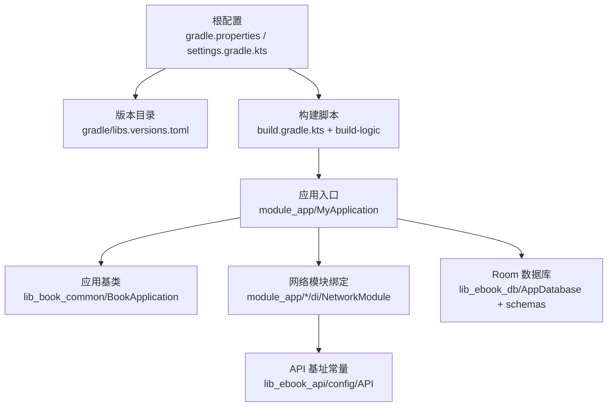
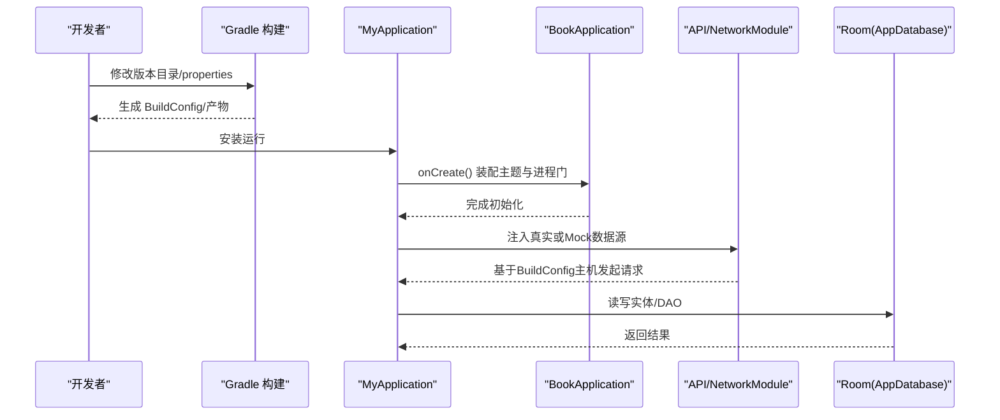
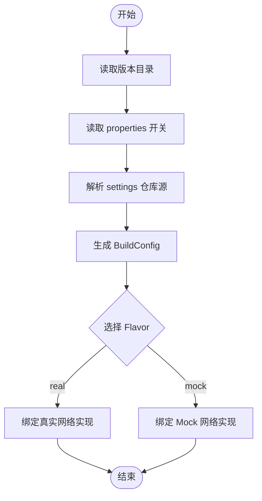
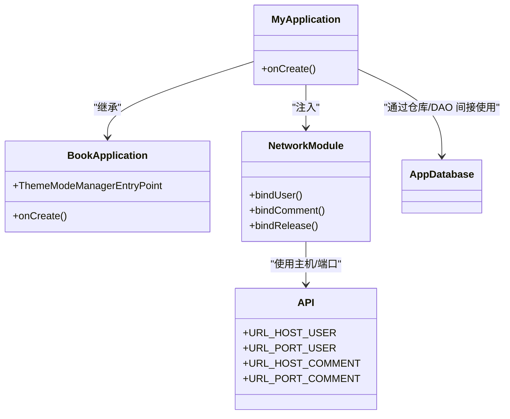
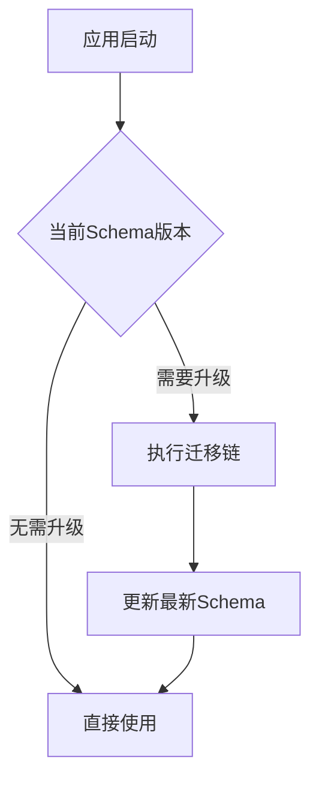
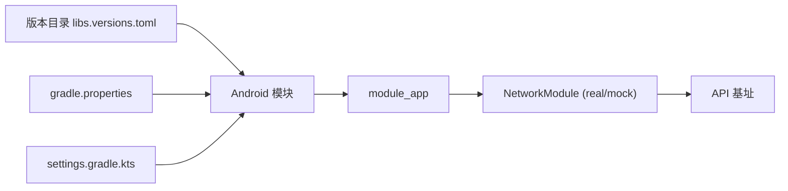

# 配置扩展

<cite>
**本文引用的文件**   
- [gradle.properties](file://gradle.properties)
- [settings.gradle.kts](file://settings.gradle.kts)
- [build.gradle.kts](file://build.gradle.kts)
- [gradle/libs.versions.toml](file://gradle/libs.versions.toml)
- [lib_ebook_api/src/main/java/com/ebook/api/config/API.kt](file://lib_ebook_api/src/main/java/com/ebook/api/config/API.kt)
- [module_app/src/real/java/com/ebook/di/NetworkModule.kt](file://module_app/src/real/java/com/ebook/di/NetworkModule.kt)
- [module_app/src/mock/java/com/ebook/di/NetworkModule.kt](file://module_app/src/mock/java/com/ebook/di/NetworkModule.kt)
- [module_app/src/main/java/com/ebook/MyApplication.kt](file://module_app/src/main/java/com/ebook/MyApplication.kt)
- [lib_book_common/src/main/java/com/ebook/common/BookApplication.kt](file://lib_book_common/src/main/java/com/ebook/common/BookApplication.kt)
- [lib_ebook_db/schemas/com.ebook.db.AppDatabase/1.json](file://lib_ebook_db/schemas/com.ebook.db.AppDatabase/1.json)
- [lib_ebook_db/schemas/com.ebook.db.AppDatabase/8.json](file://lib_ebook_db/schemas/com.ebook.db.AppDatabase/8.json)
- [module_app/build.gradle.kts](file://module_app/build.gradle.kts)
</cite>

## 目录
1. [引言](#引言)
2. [项目结构](#项目结构)
3. [核心组件](#核心组件)
4. [架构总览](#架构总览)
5. [详细组件分析](#详细组件分析)
6. [依赖关系分析](#依赖关系分析)
7. [性能与可维护性](#性能与可维护性)
8. [故障排查指南](#故障排查指南)
9. [结论](#结论)
10. [附录：配置扩展示例与最佳实践](#附录配置扩展示例与最佳实践)

## 引言
本指南面向希望在本项目中系统化地管理“构建时配置”和“运行时配置”的开发者。内容覆盖配置文件格式选择、动态加载机制、构建变体与环境注入、持久化策略、版本升级与迁移、安全考虑以及测试方法，并结合仓库现有实现给出落地建议。

## 项目结构
本项目采用多模块 Gradle 工程，通过约定插件与版本目录统一管理构建配置；应用启动由 module_app 入口初始化并装配主题与跨模块能力；网络层基址等运行期关键参数通过 BuildConfig 注入；数据库使用 Room 并以 schema 演进保障向后兼容。

**图表来源**
- [gradle.properties:1-36](file://gradle.properties#L1-L36)
- [settings.gradle.kts:1-66](file://settings.gradle.kts#L1-L66)
- [build.gradle.kts:1-15](file://build.gradle.kts#L1-L15)
- [gradle/libs.versions.toml:1-238](file://gradle/libs.versions.toml#L1-L238)
- [module_app/src/main/java/com/ebook/MyApplication.kt:1-66](file://module_app/src/main/java/com/ebook/MyApplication.kt#L1-L66)
- [lib_book_common/src/main/java/com/ebook/common/BookApplication.kt:1-64](file://lib_book_common/src/main/java/com/ebook/common/BookApplication.kt#L1-L64)
- [lib_ebook_api/src/main/java/com/ebook/api/config/API.kt:1-26](file://lib_ebook_api/src/main/java/com/ebook/api/config/API.kt#L1-L26)
- [lib_ebook_db/schemas/com.ebook.db.AppDatabase/1.json](file://lib_ebook_db/schemas/com.ebook.db.AppDatabase/1.json)
- [lib_ebook_db/schemas/com.ebook.db.AppDatabase/8.json](file://lib_ebook_db/schemas/com.ebook.db.AppDatabase/8.json)

**章节来源**
- [gradle.properties:1-36](file://gradle.properties#L1-L36)
- [settings.gradle.kts:1-66](file://settings.gradle.kts#L1-L66)
- [build.gradle.kts:1-15](file://build.gradle.kts#L1-L15)
- [gradle/libs.versions.toml:1-238](file://gradle/libs.versions.toml#L1-L238)

## 核心组件
- 构建配置中心
  - 版本目录：集中声明依赖与插件版本，避免散落硬编码。
  - 属性开关：通过 gradle.properties 控制独立调试模式、JVM 参数、AGP 特性等。
  - 仓库源：在 settings 中统一声明 Maven/GitHub 镜像与仓库顺序，提升稳定性。
- 应用启动与主题
  - Application 负责进程门（隔离沙箱）、主题装配、跨模块路由拦截等。
- 网络层配置
  - API 基址由 BuildConfig 注入（来自 local.properties），端口为常量。
  - flavor 切换 real/mock 以决定数据源实现。
- 数据持久化
  - Room 数据库配合 schema 演进保证升级路径稳定。

**章节来源**
- [gradle/libs.versions.toml:1-238](file://gradle/libs.versions.toml#L1-L238)
- [gradle.properties:1-36](file://gradle.properties#L1-L36)
- [settings.gradle.kts:1-66](file://settings.gradle.kts#L1-L66)
- [module_app/src/main/java/com/ebook/MyApplication.kt:1-66](file://module_app/src/main/java/com/ebook/MyApplication.kt#L1-L66)
- [lib_book_common/src/main/java/com/ebook/common/BookApplication.kt:1-64](file://lib_book_common/src/main/java/com/ebook/common/BookApplication.kt#L1-L64)
- [lib_ebook_api/src/main/java/com/ebook/api/config/API.kt:1-26](file://lib_ebook_api/src/main/java/com/ebook/api/config/API.kt#L1-L26)

## 架构总览
下图展示从构建到运行的配置流：构建时通过版本目录与 properties 生成 BuildConfig；应用启动装配主题与路由；网络请求按 flavor 与 BuildConfig 中的主机地址访问后端；数据落库由 Room 管理，并通过 schema 演进保证兼容性。

**图表来源**
- [module_app/src/main/java/com/ebook/MyApplication.kt:1-66](file://module_app/src/main/java/com/ebook/MyApplication.kt#L1-L66)
- [lib_book_common/src/main/java/com/ebook/common/BookApplication.kt:1-64](file://lib_book_common/src/main/java/com/ebook/common/BookApplication.kt#L1-L64)
- [lib_ebook_api/src/main/java/com/ebook/api/config/API.kt:1-26](file://lib_ebook_api/src/main/java/com/ebook/api/config/API.kt#L1-L26)
- [module_app/src/real/java/com/ebook/di/NetworkModule.kt:1-36](file://module_app/src/real/java/com/ebook/di/NetworkModule.kt#L1-L36)
- [lib_ebook_db/schemas/com.ebook.db.AppDatabase/1.json](file://lib_ebook_db/schemas/com.ebook.db.AppDatabase/1.json)
- [lib_ebook_db/schemas/com.ebook.db.AppDatabase/8.json](file://lib_ebook_db/schemas/com.ebook.db.AppDatabase/8.json)

## 详细组件分析

### 构建时配置管理
- 版本目录
  - 所有第三方依赖与插件版本集中在版本目录，构建脚本通过别名引用，便于统一升级与审计。
- 属性与仓库源
  - gradle.properties 集中定义 JVM 参数、独立调试开关、AGP 行为开关等。
  - settings.gradle.kts 统一声明仓库源顺序，避免内网/镜像解析失败。
- 构建变体
  - 通过 source set 与 Hilt Module 切换 mock/real 数据源，无需改动业务代码。
  - API 基址通过 BuildConfig 注入，端口为常量，便于多环境对齐。

**图表来源**
- [gradle/libs.versions.toml:1-238](file://gradle/libs.versions.toml#L1-L238)
- [gradle.properties:1-36](file://gradle.properties#L1-L36)
- [settings.gradle.kts:1-66](file://settings.gradle.kts#L1-L66)
- [module_app/src/real/java/com/ebook/di/NetworkModule.kt:1-36](file://module_app/src/real/java/com/ebook/di/NetworkModule.kt#L1-L36)
- [module_app/src/mock/java/com/ebook/di/NetworkModule.kt](file://module_app/src/mock/java/com/ebook/di/NetworkModule.kt)

**章节来源**
- [gradle/libs.versions.toml:1-238](file://gradle/libs.versions.toml#L1-L238)
- [gradle.properties:1-36](file://gradle.properties#L1-L36)
- [settings.gradle.kts:1-66](file://settings.gradle.kts#L1-L66)
- [module_app/src/real/java/com/ebook/di/NetworkModule.kt:1-36](file://module_app/src/real/java/com/ebook/di/NetworkModule.kt#L1-L36)
- [module_app/src/mock/java/com/ebook/di/NetworkModule.kt](file://module_app/src/mock/java/com/ebook/di/NetworkModule.kt)

### 运行时配置管理
- 应用启动
  - MyApplication 作为入口，调用父类 BookApplication 进行主题装配与进程门处理。
  - 主题模式由 ThemeModeManager 提供，支持跟随系统、浅色、深色。
- 网络配置
  - API 对象提供用户/评论服务的主机与端口，主机来自 BuildConfig 注入。
  - NetworkModule 在 real flavor 下绑定真实网络实现；mock flavor 替换为内存/静态数据。
- 持久化
  - Room 数据库位于 lib_ebook_db，schema 随版本演进，保证升级路径稳定。

**图表来源**
- [module_app/src/main/java/com/ebook/MyApplication.kt:1-66](file://module_app/src/main/java/com/ebook/MyApplication.kt#L1-L66)
- [lib_book_common/src/main/java/com/ebook/common/BookApplication.kt:1-64](file://lib_book_common/src/main/java/com/ebook/common/BookApplication.kt#L1-L64)
- [lib_ebook_api/src/main/java/com/ebook/api/config/API.kt:1-26](file://lib_ebook_api/src/main/java/com/ebook/api/config/API.kt#L1-L26)
- [module_app/src/real/java/com/ebook/di/NetworkModule.kt:1-36](file://module_app/src/real/java/com/ebook/di/NetworkModule.kt#L1-L36)
- [lib_ebook_db/schemas/com.ebook.db.AppDatabase/8.json](file://lib_ebook_db/schemas/com.ebook.db.AppDatabase/8.json)

**章节来源**
- [module_app/src/main/java/com/ebook/MyApplication.kt:1-66](file://module_app/src/main/java/com/ebook/MyApplication.kt#L1-L66)
- [lib_book_common/src/main/java/com/ebook/common/BookApplication.kt:1-64](file://lib_book_common/src/main/java/com/ebook/common/BookApplication.kt#L1-L64)
- [lib_ebook_api/src/main/java/com/ebook/api/config/API.kt:1-26](file://lib_ebook_api/src/main/java/com/ebook/api/config/API.kt#L1-L26)
- [module_app/src/real/java/com/ebook/di/NetworkModule.kt:1-36](file://module_app/src/real/java/com/ebook/di/NetworkModule.kt#L1-L36)

### 配置验证与迁移
- 版本升级
  - Room schema 通过 JSON 文件记录历史版本，升级需新增 MIGRATION_n_to_n+1 并更新 schema JSON。
- 向后兼容
  - 禁止启用破坏性回退；所有变更需走迁移链，确保老数据平滑过渡。

**图表来源**
- [lib_ebook_db/schemas/com.ebook.db.AppDatabase/1.json](file://lib_ebook_db/schemas/com.ebook.db.AppDatabase/1.json)
- [lib_ebook_db/schemas/com.ebook.db.AppDatabase/8.json](file://lib_ebook_db/schemas/com.ebook.db.AppDatabase/8.json)

**章节来源**
- [lib_ebook_db/schemas/com.ebook.db.AppDatabase/1.json](file://lib_ebook_db/schemas/com.ebook.db.AppDatabase/1.json)
- [lib_ebook_db/schemas/com.ebook.db.AppDatabase/8.json](file://lib_ebook_db/schemas/com.ebook.db.AppDatabase/8.json)

## 依赖关系分析
- 构建期依赖
  - 版本目录统一版本，减少耦合与漂移风险。
  - settings 统一仓库源，避免不同机器解析差异。
- 运行期依赖
  - 通过 Hilt Module 将接口与实现解耦，flavor 切换不影响业务。
  - API 基址由 BuildConfig 注入，屏蔽环境差异。

**图表来源**
- [gradle/libs.versions.toml:1-238](file://gradle/libs.versions.toml#L1-L238)
- [gradle.properties:1-36](file://gradle.properties#L1-L36)
- [settings.gradle.kts:1-66](file://settings.gradle.kts#L1-L66)
- [module_app/src/real/java/com/ebook/di/NetworkModule.kt:1-36](file://module_app/src/real/java/com/ebook/di/NetworkModule.kt#L1-L36)
- [lib_ebook_api/src/main/java/com/ebook/api/config/API.kt:1-26](file://lib_ebook_api/src/main/java/com/ebook/api/config/API.kt#L1-L26)

**章节来源**
- [gradle/libs.versions.toml:1-238](file://gradle/libs.versions.toml#L1-L238)
- [gradle.properties:1-36](file://gradle.properties#L1-L36)
- [settings.gradle.kts:1-66](file://settings.gradle.kts#L1-L66)
- [module_app/src/real/java/com/ebook/di/NetworkModule.kt:1-36](file://module_app/src/real/java/com/ebook/di/NetworkModule.kt#L1-L36)
- [lib_ebook_api/src/main/java/com/ebook/api/config/API.kt:1-26](file://lib_ebook_api/src/main/java/com/ebook/api/config/API.kt#L1-L26)

## 性能与可维护性
- 构建性能
  - 合理设置 JVM 参数与并行选项，缩短冷/热构建时间。
  - 使用版本目录减少重复升级成本。
- 运行时性能
  - 主题装配仅在首次组装生效，避免频繁重建。
  - 网络请求通过拦截器统一处理认证与错误，降低分支复杂度。
- 可维护性
  - 通过 flavor 切换 mock/real，便于本地联调与 CI 验证。
  - Room schema 演进明确，升级路径可追溯。

[本节为通用指导，不直接分析具体文件]

## 故障排查指南
- 无法解析仓库源
  - 检查 settings 中仓库顺序与镜像是否可达。
- 构建时报依赖版本冲突
  - 优先在版本目录统一升级，避免散乱覆盖。
- 启动后网络请求异常
  - 确认 BuildConfig 注入的主机地址是否正确；真机联调建议使用 adb reverse 或使用公网 IP。
- 主题显示异常
  - 确认 BookApplication 已正确安装主题并提供 ThemeModeManager。
- 数据库升级失败
  - 核对迁移链完整性与 schema JSON 一致性，避免破坏性回退。

**章节来源**
- [settings.gradle.kts:1-66](file://settings.gradle.kts#L1-L66)
- [gradle/libs.versions.toml:1-238](file://gradle/libs.versions.toml#L1-L238)
- [lib_ebook_api/src/main/java/com/ebook/api/config/API.kt:1-26](file://lib_ebook_api/src/main/java/com/ebook/api/config/API.kt#L1-L26)
- [lib_book_common/src/main/java/com/ebook/common/BookApplication.kt:1-64](file://lib_book_common/src/main/java/com/ebook/common/BookApplication.kt#L1-L64)
- [lib_ebook_db/schemas/com.ebook.db.AppDatabase/1.json](file://lib_ebook_db/schemas/com.ebook.db.AppDatabase/1.json)
- [lib_ebook_db/schemas/com.ebook.db.AppDatabase/8.json](file://lib_ebook_db/schemas/com.ebook.db.AppDatabase/8.json)

## 结论
本项目在构建期通过版本目录与属性开关实现集中化管理，在运行期通过 BuildConfig 注入与 flavor 切换达成环境隔离与灵活配置，结合 Room schema 演进保障数据迁移稳定。遵循上述指南可在不侵入业务的前提下扩展新的配置项、环境变量与运行时偏好，并保持高可维护性与可测试性。

[本节为总结，不直接分析具体文件]

## 附录：配置扩展示例与最佳实践

### 配置文件格式对比与建议
- Properties
  - 优点：简单直观，适合键值型配置；易于被 Gradle 读取。
  - 缺点：不支持复杂嵌套结构；不适合大型配置。
  - 适用场景：构建参数、环境变量映射、开关项。
- JSON
  - 优点：结构化强，易于序列化/反序列化；适合复杂配置。
  - 缺点：语法相对繁琐；编辑易出错。
  - 适用场景：书源规则、批量资源、客户端能力清单。
- YAML
  - 优点：可读性好；常用于服务端配置。
  - 缺点：缩进敏感；在 Android 生态中不如 JSON 普及。
  - 适用场景：与服务端一致化的配置模板（如 ebook-server 配置）。

[本节为通用指导，不直接分析具体文件]

### 动态配置加载机制
- 热更新
  - 建议在运行时通过 Flow/StateFlow 暴露配置变化，UI 层订阅更新。
  - 对网络基址等关键配置，建议重启后生效以避免不一致状态。
- 配置验证
  - 在加载阶段校验必填字段、范围与格式；失败时回退到默认值并告警。
- 默认值处理
  - 为所有可选配置提供合理的默认值，确保降级可用。

[本节为通用指导，不直接分析具体文件]

### 构建时配置管理实践
- 版本目录
  - 将依赖与插件版本集中于版本目录，统一升级。
- 环境变量
  - 通过 local.properties 注入敏感或环境相关值（如服务器主机），生成 BuildConfig。
- 构建变体
  - 使用 flavor 切换 mock/real 数据源；在 DI 模块中绑定具体实现。

**章节来源**
- [gradle/libs.versions.toml:1-238](file://gradle/libs.versions.toml#L1-L238)
- [lib_ebook_api/src/main/java/com/ebook/api/config/API.kt:1-26](file://lib_ebook_api/src/main/java/com/ebook/api/config/API.kt#L1-L26)
- [module_app/src/real/java/com/ebook/di/NetworkModule.kt:1-36](file://module_app/src/real/java/com/ebook/di/NetworkModule.kt#L1-L36)
- [module_app/src/mock/java/com/ebook/di/NetworkModule.kt](file://module_app/src/mock/java/com/ebook/di/NetworkModule.kt)

### 运行时配置管理实践
- SharedPreferences/DataStore
  - 用于用户偏好、功能开关等轻量配置；注意线程安全与主线程 IO。
- Room 持久化
  - 用于结构化、查询复杂的配置集合；配合迁移链保障升级。
- 内存缓存策略
  - 对高频读取的配置使用内存缓存；注意生命周期与一致性。

[本节为通用指导，不直接分析具体文件]

### 配置验证与迁移
- 版本升级
  - 每次实体变更递增版本号并追加紧邻迁移；保留旧迁移以保持升级链完整。
- 数据迁移
  - 迁移逻辑幂等、可重试；对大表迁移分片处理。
- 向后兼容
  - 废弃字段保留并标注；读路径兼容新旧结构。

**章节来源**
- [lib_ebook_db/schemas/com.ebook.db.AppDatabase/1.json](file://lib_ebook_db/schemas/com.ebook.db.AppDatabase/1.json)
- [lib_ebook_db/schemas/com.ebook.db.AppDatabase/8.json](file://lib_ebook_db/schemas/com.ebook.db.AppDatabase/8.json)

### 配置扩展示例
- 功能开关
  - 通过 DataStore 存储布尔开关，UI 订阅 StateFlow 响应。
- API 地址配置
  - 通过 BuildConfig 注入开发/测试/生产环境主机；flavor 切换自动生效。
- 用户偏好设置
  - 字体大小、阅读背景主题等写入 DataStore；应用启动时加载并应用到 UI。

[本节为通用指导，不直接分析具体文件]

### 配置安全考虑
- 敏感信息加密
  - 密钥、令牌等不存明文；使用系统级安全存储或加密方案。
- 权限控制
  - 仅必要模块访问敏感配置；对外暴露最小接口。
- 防篡改机制
  - 对关键配置做签名校验；发布包禁用调试配置。

[本节为通用指导，不直接分析具体文件]

### 配置测试方法
- 单元测试
  - 针对配置加载、验证逻辑编写用例；覆盖边界与异常路径。
- 集成测试
  - 模拟不同 flavor 与 BuildConfig 环境，验证端到端流程。
- 模拟配置环境搭建
  - 使用 mock data source 与假配置集，构造可控测试环境。

[本节为通用指导，不直接分析具体文件]